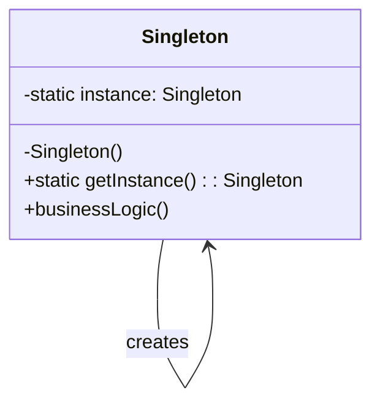
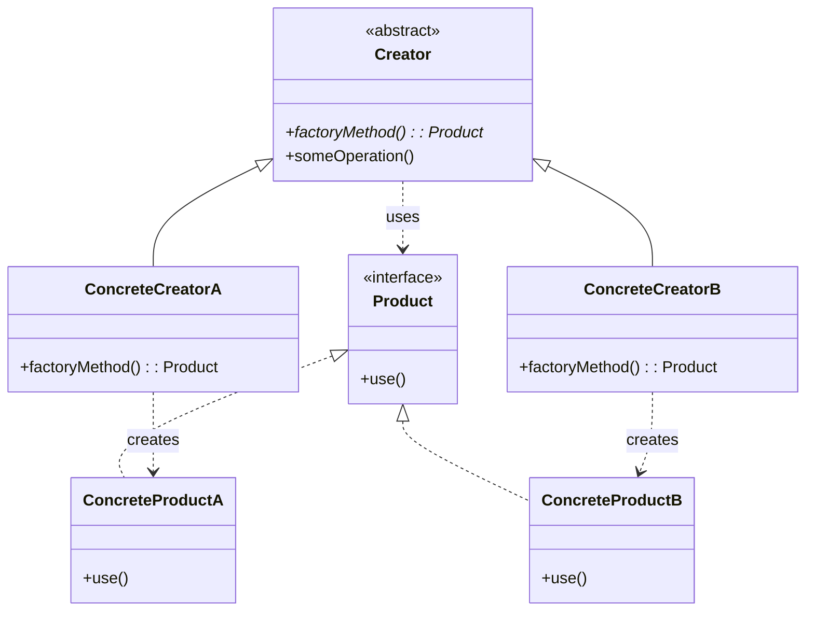
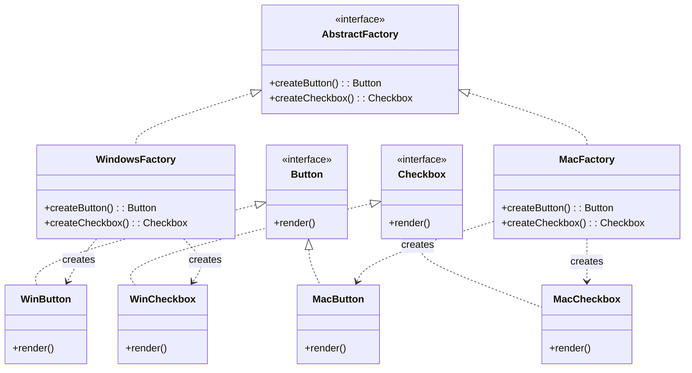
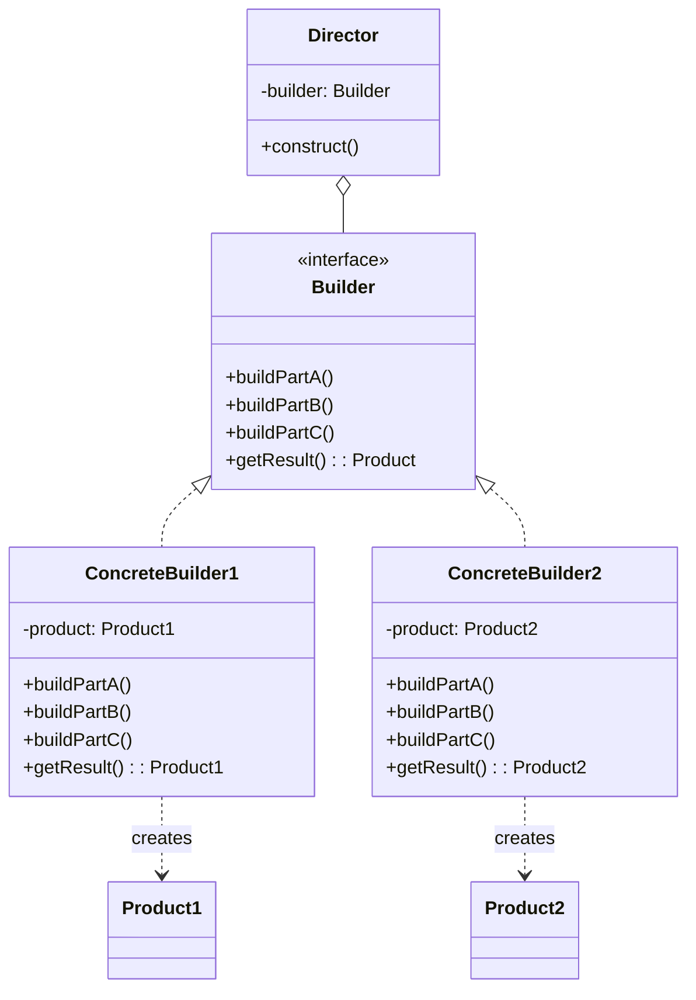
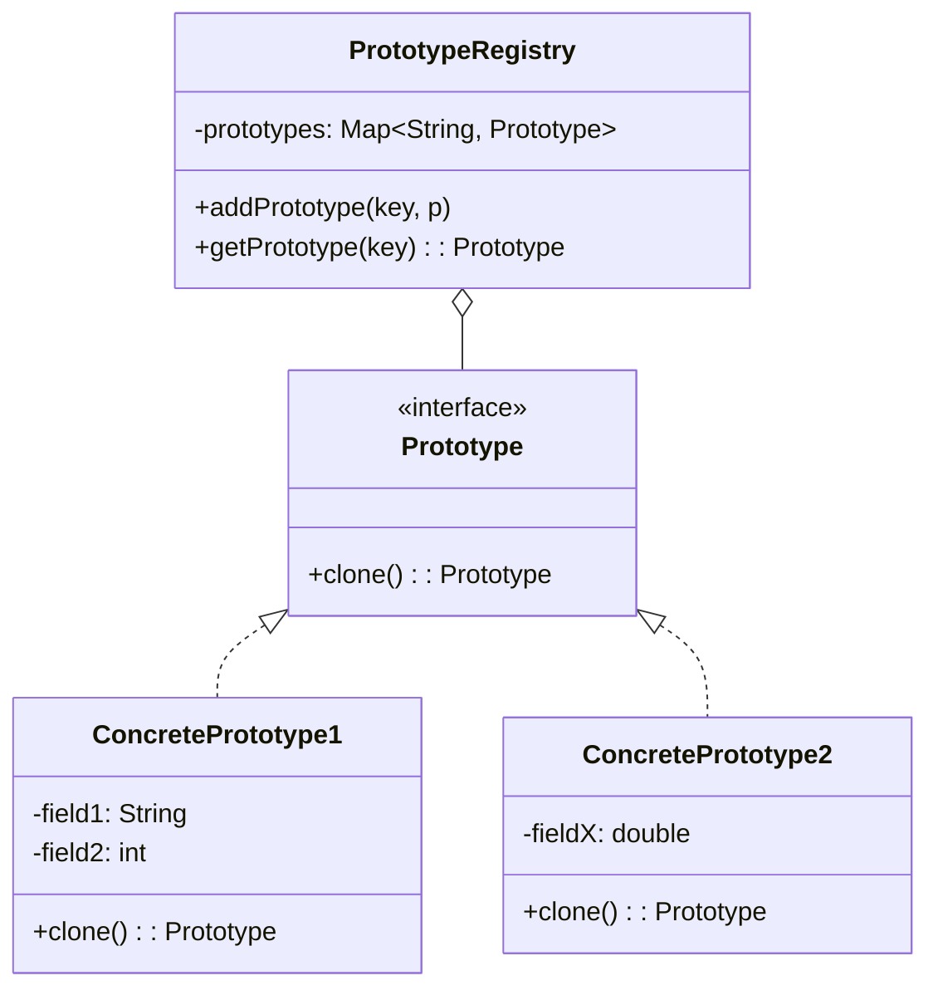

# 🔨 Creational Patterns — Các Mẫu Khởi Tạo

> Kiểm soát **cách tạo đối tượng**, che giấu logic khởi tạo phức tạp, tăng tính linh hoạt trong việc quyết định tạo object nào, khi nào, và bằng cách nào.

---

## 1. Singleton

| Thuộc tính | Giá trị |
|-----------|---------|
| **Ý nghĩa** | Đảm bảo một class chỉ có **duy nhất một instance** và cung cấp điểm truy cập toàn cục |
| **Phức tạp** | ⭐ |
| **Tần suất** | 🔥🔥🔥 |
| **Phạm vi** | Object |

### Class Diagram



### Code Mẫu

```java
public class Singleton {
    private static volatile Singleton instance;
    
    private Singleton() {} // constructor private
    
    public static Singleton getInstance() {
        if (instance == null) {
            synchronized (Singleton.class) {
                if (instance == null) {  // double-checked locking
                    instance = new Singleton();
                }
            }
        }
        return instance;
    }
    
    public void businessLogic() { /* ... */ }
}
```

### Đặc Trưng Nhận Diện
- Constructor **private**
- Static method `getInstance()` là điểm truy cập duy nhất
- Biến static giữ instance duy nhất
- Thread-safe qua double-checked locking hoặc enum

### Khi Nào Sử Dụng
- Cần đúng **một instance** cho toàn hệ thống (DB connection pool, Logger, Config)
- Cần **điểm truy cập toàn cục** có kiểm soát (thay cho global variable)
- Object khởi tạo tốn kém và chỉ cần một lần

### ⚠️ Lưu Ý
- Singleton thường bị **lạm dụng** → gây tight coupling, khó test
- Vi phạm **Single Responsibility Principle** (vừa quản lý logic vừa quản lý vòng đời)
- Khó test do global state → Xem xét **Dependency Injection** thay thế

---

## 2. Factory Method

| Thuộc tính | Giá trị |
|-----------|---------|
| **Ý nghĩa** | Định nghĩa interface để tạo object, nhưng để **subclass quyết định** class nào được khởi tạo |
| **Phức tạp** | ⭐⭐ |
| **Tần suất** | 🔥🔥🔥 |
| **Phạm vi** | Class |

### Class Diagram



### Code Mẫu

```java
// Product interface
interface Transport {
    void deliver();
}

class Truck implements Transport {
    public void deliver() { System.out.println("Deliver by road"); }
}

class Ship implements Transport {
    public void deliver() { System.out.println("Deliver by sea"); }
}

// Creator
abstract class Logistics {
    // Factory Method — subclass quyết định tạo gì
    abstract Transport createTransport();
    
    // Business logic dùng factory method
    public void planDelivery() {
        Transport t = createTransport();
        t.deliver();
    }
}

class RoadLogistics extends Logistics {
    Transport createTransport() { return new Truck(); }
}

class SeaLogistics extends Logistics {
    Transport createTransport() { return new Ship(); }
}
```

### Đặc Trưng Nhận Diện
- Abstract method trả về **interface/abstract type**
- **Subclass** override để trả về concrete type cụ thể
- Creator chứa business logic **không phụ thuộc** vào concrete product

### Khi Nào Sử Dụng
- Không biết trước chính xác **kiểu object** cần tạo
- Muốn để **subclass mở rộng** các loại product mà không sửa Creator
- Framework cần tạo object mà **không biết** application-specific class

### 🔗 Quan Hệ Với Mẫu Khác
- **Factory Method là biến thể đặc biệt của Template Method** — "template" cho việc tạo object
- **Abstract Factory** thường dùng Factory Method bên trong
- Có thể tiến hóa thành **Abstract Factory** khi cần tạo *nhiều loại* product

---

## 3. Abstract Factory

| Thuộc tính | Giá trị |
|-----------|---------|
| **Ý nghĩa** | Cung cấp interface để tạo **họ (family) các đối tượng liên quan** mà không chỉ định class cụ thể |
| **Phức tạp** | ⭐⭐ |
| **Tần suất** | 🔥🔥🔥 |
| **Phạm vi** | Object |

### Class Diagram



### Code Mẫu

```java
// Abstract Products
interface Button { void render(); }
interface Checkbox { void render(); }

// Concrete Products — Windows family
class WinButton implements Button {
    public void render() { System.out.println("Windows Button"); }
}
class WinCheckbox implements Checkbox {
    public void render() { System.out.println("Windows Checkbox"); }
}

// Concrete Products — Mac family
class MacButton implements Button {
    public void render() { System.out.println("Mac Button"); }
}
class MacCheckbox implements Checkbox {
    public void render() { System.out.println("Mac Checkbox"); }
}

// Abstract Factory
interface GUIFactory {
    Button createButton();
    Checkbox createCheckbox();
}

class WindowsFactory implements GUIFactory {
    public Button createButton() { return new WinButton(); }
    public Checkbox createCheckbox() { return new WinCheckbox(); }
}

class MacFactory implements GUIFactory {
    public Button createButton() { return new MacButton(); }
    public Checkbox createCheckbox() { return new MacCheckbox(); }
}

// Client — chỉ làm việc qua interface
class Application {
    private Button button;
    private Checkbox checkbox;
    
    Application(GUIFactory factory) {
        button = factory.createButton();
        checkbox = factory.createCheckbox();
    }
}
```

### Đặc Trưng Nhận Diện
- Interface/abstract class với **nhiều** factory method (tạo *nhiều loại* product)
- Các product thuộc cùng **một family/theme** và phải **tương thích** với nhau
- Client code **không bao giờ** tạo product trực tiếp

### Khi Nào Sử Dụng
- Cần tạo **họ sản phẩm liên quan** (UI toolkit đa nền tảng, database driver family)
- Các product trong family phải **đồng bộ/tương thích** với nhau
- Muốn **che giấu** implementation classes khỏi client

### 🔑 Phân Biệt Factory Method vs Abstract Factory

| Tiêu chí | Factory Method | Abstract Factory |
|----------|---------------|-----------------|
| **Số product** | Tạo **1 loại** product | Tạo **nhiều loại** product liên quan |
| **Cơ chế** | Dùng **kế thừa** (subclass override) | Dùng **composition** (object chứa factory) |
| **Mục đích** | Trì hoãn khởi tạo cho subclass | Tạo family product đồng bộ |
| **Mở rộng** | Thêm subclass của Creator | Thêm implementation của Factory interface |
| **Scope** | Class-level | Object-level |

> **Quy tắc**: Factory Method = **1 method tạo 1 sản phẩm**. Abstract Factory = **1 object chứa nhiều factory methods tạo cả family**.

---

## 4. Builder

| Thuộc tính | Giá trị |
|-----------|---------|
| **Ý nghĩa** | Tách quá trình xây dựng đối tượng phức tạp khỏi biểu diễn, cho phép cùng quy trình tạo ra **các biểu diễn khác nhau** |
| **Phức tạp** | ⭐⭐ |
| **Tần suất** | 🔥🔥🔥 |
| **Phạm vi** | Object |

### Class Diagram



### Code Mẫu

```java
// Product
class House {
    String walls, roof, garage;
    
    @Override
    public String toString() {
        return "House[walls=" + walls + ", roof=" + roof + ", garage=" + garage + "]";
    }
}

// Builder interface
interface HouseBuilder {
    HouseBuilder buildWalls(String type);
    HouseBuilder buildRoof(String type);
    HouseBuilder buildGarage(String type);
    House build();
}

// Concrete Builder — Fluent API
class ModernHouseBuilder implements HouseBuilder {
    private House house = new House();
    
    public HouseBuilder buildWalls(String type) { house.walls = "Modern " + type; return this; }
    public HouseBuilder buildRoof(String type)  { house.roof = "Flat " + type; return this; }
    public HouseBuilder buildGarage(String type) { house.garage = "Smart " + type; return this; }
    public House build() { return house; }
}

// Director — biết thứ tự xây dựng
class ConstructionDirector {
    public House constructLuxuryHouse(HouseBuilder builder) {
        return builder
            .buildWalls("Glass")
            .buildRoof("Solar")
            .buildGarage("Tesla")
            .build();
    }
}

// Usage
House house = new ModernHouseBuilder()
    .buildWalls("Glass")
    .buildRoof("Solar")
    .buildGarage("Tesla")
    .build();
```

### Đặc Trưng Nhận Diện
- Quá trình xây dựng **từng bước (step-by-step)**
- **Director** (tuỳ chọn) biết thứ tự các bước
- Fluent API (method chaining) `builder.setA().setB().build()`
- Tách biệt **construction** vs **representation**

### Khi Nào Sử Dụng
- Object có **nhiều tham số** khởi tạo (telescoping constructor problem)
- Cần tạo **các biểu diễn khác nhau** từ cùng quy trình xây dựng
- Object cần được xây dựng **từng bước** (không thể tạo trong 1 lần gọi)

### 🔑 Phân Biệt Builder vs Abstract Factory

| Tiêu chí | Builder | Abstract Factory |
|----------|---------|-----------------|
| **Trọng tâm** | **Quy trình** xây dựng step-by-step | **Kết quả** — family product |
| **Trả về** | Product phức tạp **cuối quy trình** | Product **ngay lập tức** |
| **Bước** | Nhiều bước, thứ tự quan trọng | Mỗi factory method **độc lập** |
| **Product** | Thường **1 product phức tạp** | **Nhiều product** liên quan |

> **Quy tắc**: Builder tập trung vào **"xây dựng thế nào"** (process), Abstract Factory tập trung vào **"tạo cái gì"** (product family).

---

## 5. Prototype

| Thuộc tính | Giá trị |
|-----------|---------|
| **Ý nghĩa** | Tạo object mới bằng cách **sao chép (clone)** từ một object mẫu đã có |
| **Phức tạp** | ⭐ |
| **Tần suất** | 🔥🔥 |
| **Phạm vi** | Object |

### Class Diagram



### Code Mẫu

```java
// Prototype interface
abstract class Shape implements Cloneable {
    int x, y;
    String color;
    
    // Copy constructor
    Shape(Shape source) {
        this.x = source.x;
        this.y = source.y;
        this.color = source.color;
    }
    Shape() {}
    
    @Override
    public abstract Shape clone();
}

class Circle extends Shape {
    int radius;
    
    Circle(Circle source) {
        super(source);
        this.radius = source.radius;
    }
    Circle() {}
    
    @Override
    public Circle clone() { return new Circle(this); }
}

class Rectangle extends Shape {
    int width, height;
    
    Rectangle(Rectangle source) {
        super(source);
        this.width = source.width;
        this.height = source.height;
    }
    Rectangle() {}
    
    @Override
    public Rectangle clone() { return new Rectangle(this); }
}

// Prototype Registry (tuỳ chọn)
class ShapeCache {
    private Map<String, Shape> cache = new HashMap<>();
    
    public Shape get(String key) { return cache.get(key).clone(); }
    public void put(String key, Shape shape) { cache.put(key, shape); }
}
```

### Đặc Trưng Nhận Diện
- Method `clone()` trả về **bản sao** của chính object
- Không cần biết class cụ thể để tạo bản sao
- Thường đi kèm **Prototype Registry** (cache các prototype)

### Khi Nào Sử Dụng
- Tạo object **tốn kém** (DB query, network call) → clone nhanh hơn tạo mới
- Cần tạo bản sao **bất kể class cụ thể** (chỉ biết interface)
- Muốn **giảm số subclass** — thay vì nhiều factory subclass, dùng prototype registry

### 🔑 Phân Biệt Prototype vs Factory Method

| Tiêu chí | Prototype | Factory Method |
|----------|-----------|---------------|
| **Cách tạo** | Clone từ **instance có sẵn** | Tạo mới qua **subclass method** |
| **Cần kế thừa?** | Không — dùng composition | Có — cần subclass Creator |
| **Flexibility** | Có thể thay đổi prototype **runtime** | Cố định tại **compile-time** (subclass) |
| **Use case** | Object tốn kém tạo, cần nhiều bản sao tương tự | Không biết trước concrete type |

---

## 📊 Ma Trận So Sánh Tổng Hợp Creational Patterns

| Tiêu chí | Singleton | Factory Method | Abstract Factory | Builder | Prototype |
|----------|-----------|---------------|-----------------|---------|-----------|
| **Số instance** | 1 | Nhiều | Nhiều | 1 (phức tạp) | Nhiều (clone) |
| **Kế thừa?** | Không | Có (core) | Có/Không | Không | Không |
| **Composition?** | Không | Không | Có (core) | Có (core) | Có |
| **Biết concrete class?** | Có | Không | Không | Có | Không |
| **Runtime flexible?** | ❌ | ❌ | ✅ | ✅ | ✅ |
| **Mục đích chính** | Unique instance | Delegate creation | Family creation | Step-by-step | Copy creation |

### Sơ đồ tiến hoá

```
Cần tạo object? 
  ├── Chỉ 1 instance? → Singleton
  ├── Nhiều loại, 1 product? → Factory Method
  ├── Nhiều loại, nhiều product liên quan? → Abstract Factory
  ├── Object phức tạp, nhiều bước? → Builder
  └── Tạo tốn kém, cần clone? → Prototype
```

> **Trong thực tế**: Bắt đầu với **Factory Method** (đơn giản nhất), tiến hoá thành **Abstract Factory** khi cần family, hoặc **Prototype** khi cần flexibility runtime. **Builder** dùng khi constructor phức tạp. **Singleton** dùng cực kỳ hạn chế.
