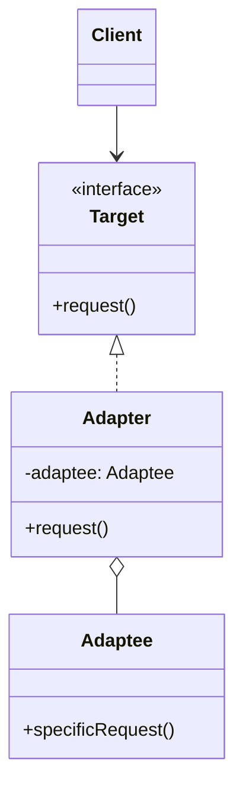
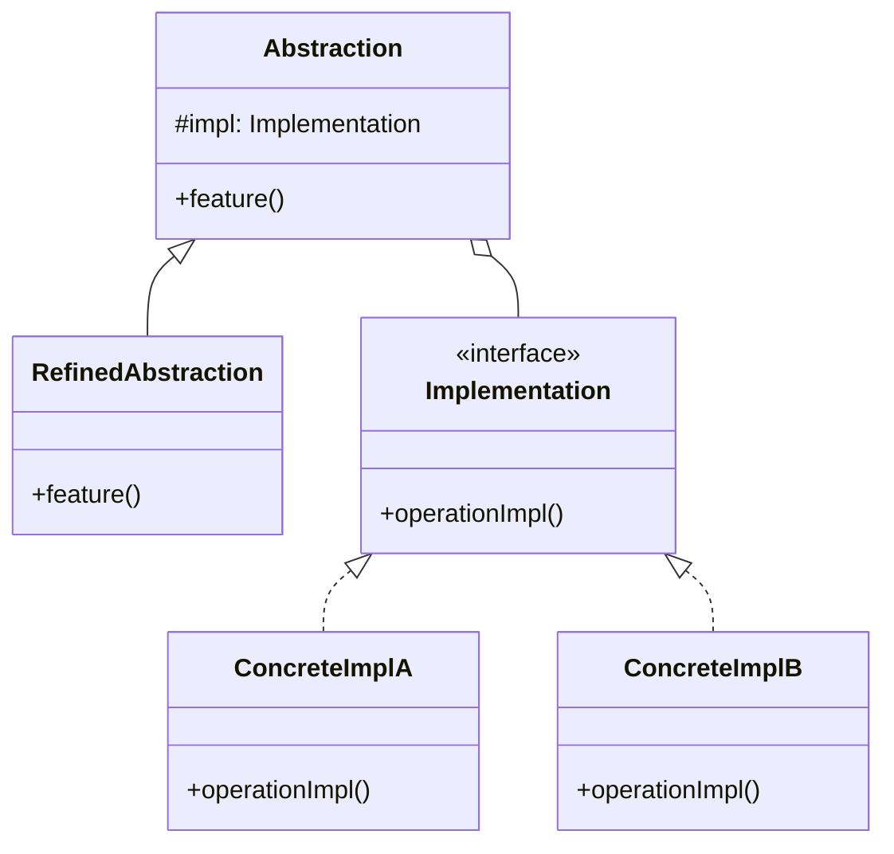
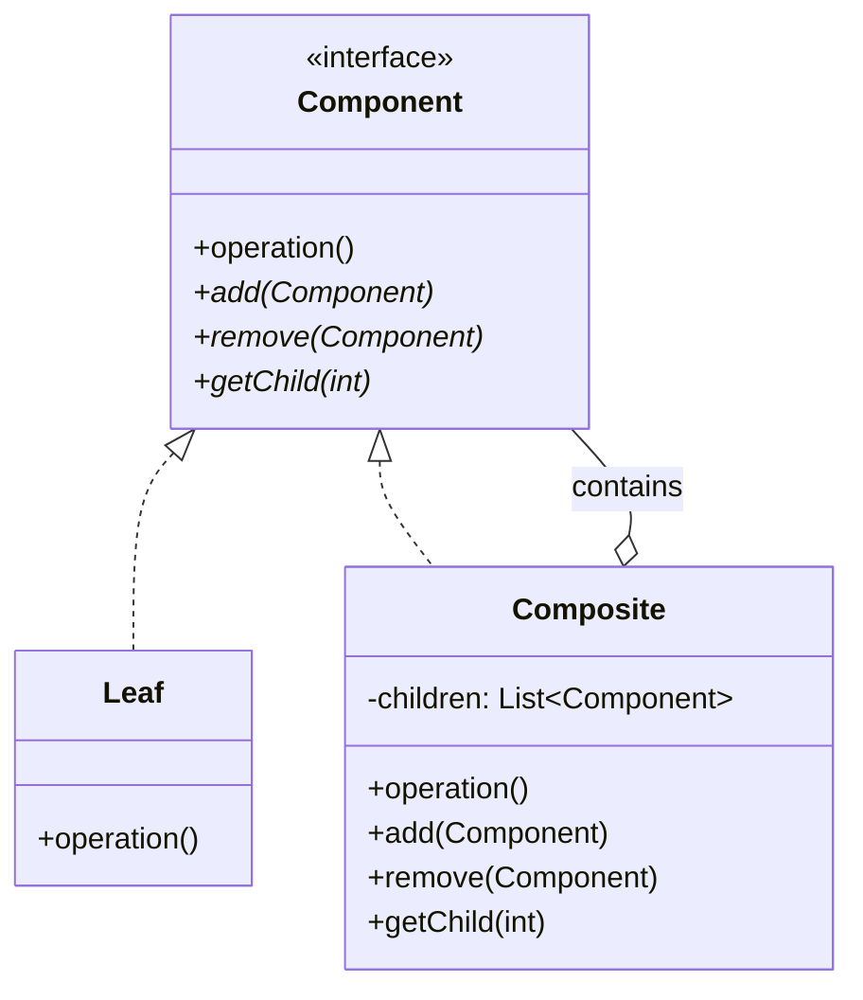
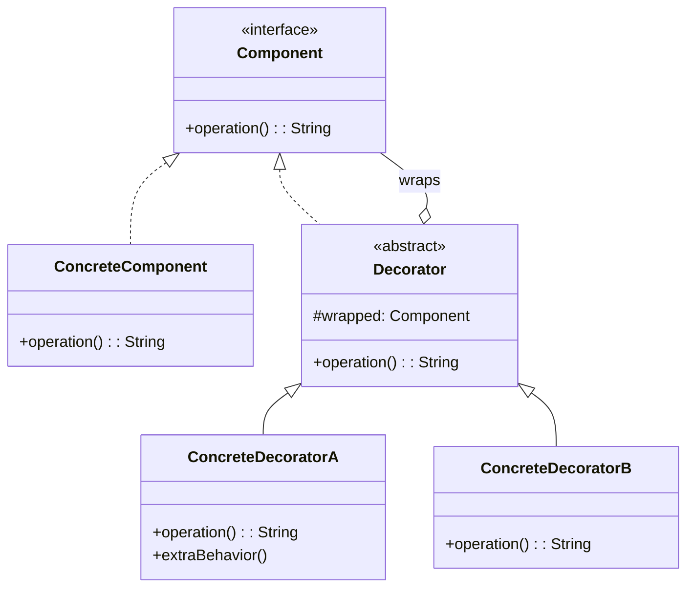
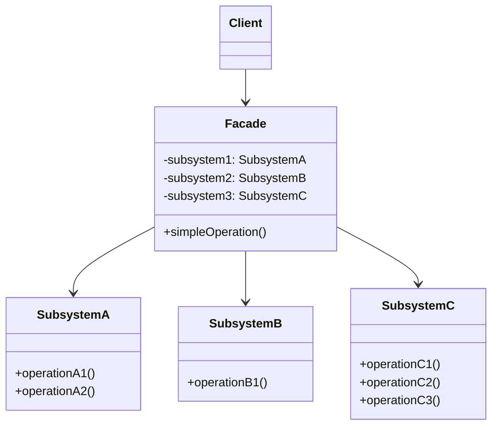
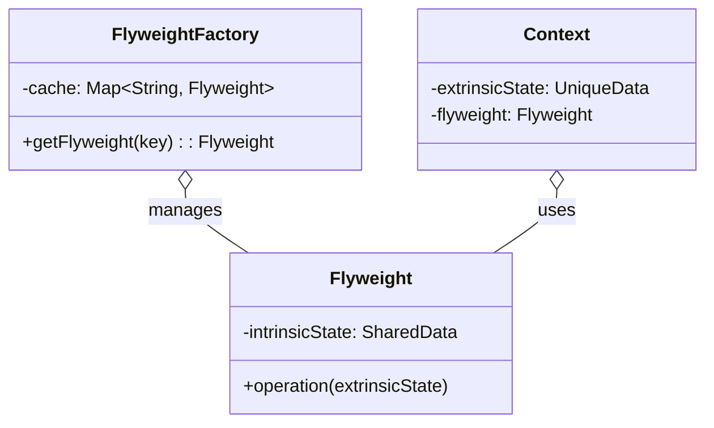
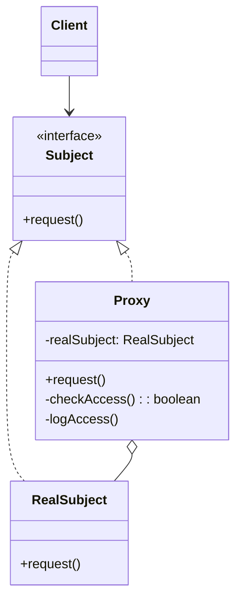

# 🏗️ Structural Patterns — Các Mẫu Cấu Trúc

> Kiểm soát **cách tổ chức và kết hợp** các class/object thành cấu trúc lớn hơn, đồng thời giữ cấu trúc linh hoạt và hiệu quả.

---

## 1. Adapter (Wrapper)

| Thuộc tính | Giá trị |
|-----------|---------|
| **Ý nghĩa** | Chuyển đổi interface của class này thành interface mà client **mong đợi**. Cho phép các class có interface không tương thích **làm việc cùng nhau** |
| **Phức tạp** | ⭐ |
| **Tần suất** | 🔥🔥🔥 |
| **Phạm vi** | Class hoặc Object |

### Class Diagram



### Code Mẫu

```java
// Target — interface client mong đợi
interface MediaPlayer {
    void play(String filename);
}

// Adaptee — class có sẵn, interface khác
class VlcPlayer {
    void playVlc(String filename) {
        System.out.println("Playing VLC: " + filename);
    }
}

// Adapter — chuyển đổi interface
class VlcAdapter implements MediaPlayer {
    private VlcPlayer vlcPlayer;
    
    VlcAdapter(VlcPlayer vlcPlayer) {
        this.vlcPlayer = vlcPlayer;
    }
    
    @Override
    public void play(String filename) {
        vlcPlayer.playVlc(filename);  // delegate
    }
}

// Client dùng Target interface
MediaPlayer player = new VlcAdapter(new VlcPlayer());
player.play("song.vlc");
```

### Đặc Trưng Nhận Diện
- **Wrapper** bọc object có interface khác
- Implement **Target interface**, delegate sang **Adaptee**
- Không thay đổi Adaptee — chỉ "dịch" interface

### Khi Nào Sử Dụng
- Tích hợp **thư viện bên ngoài** có interface không tương thích
- **Legacy code** cần hoạt động với code mới
- Cần dùng class có sẵn nhưng interface **không khớp**

---

## 2. Bridge

| Thuộc tính | Giá trị |
|-----------|---------|
| **Ý nghĩa** | Tách **abstraction** khỏi **implementation** để cả hai có thể thay đổi **độc lập** |
| **Phức tạp** | ⭐⭐⭐ |
| **Tần suất** | 🔥🔥 |
| **Phạm vi** | Object |

### Class Diagram



### Code Mẫu

```java
// Implementation — "backend" có thể thay đổi
interface Device {
    void turnOn();
    void setVolume(int volume);
}

class TV implements Device {
    public void turnOn() { System.out.println("TV on"); }
    public void setVolume(int v) { System.out.println("TV volume: " + v); }
}

class Radio implements Device {
    public void turnOn() { System.out.println("Radio on"); }
    public void setVolume(int v) { System.out.println("Radio volume: " + v); }
}

// Abstraction — "frontend" có thể mở rộng độc lập
class RemoteControl {
    protected Device device;
    
    RemoteControl(Device device) { this.device = device; }
    
    void togglePower() { device.turnOn(); }
    void volumeUp() { device.setVolume(10); }
}

class AdvancedRemote extends RemoteControl {
    AdvancedRemote(Device device) { super(device); }
    
    void mute() { device.setVolume(0); }  // tính năng mở rộng
}

// Kết hợp tự do: AdvancedRemote + TV, RemoteControl + Radio, ...
RemoteControl remote = new AdvancedRemote(new TV());
```

### Đặc Trưng Nhận Diện
- **Hai hệ phân cấp** độc lập: Abstraction hierarchy + Implementation hierarchy
- Abstraction **chứa reference** đến Implementation
- Thay đổi abstraction **KHÔNG ảnh hưởng** implementation và ngược lại

### Khi Nào Sử Dụng
- Class có **2 chiều thay đổi** độc lập (VD: Shape × Color, Remote × Device)
- Muốn tránh **class explosion** do kế thừa đa chiều
- Cần **thay đổi implementation runtime**

### 🔑 Phân Biệt Adapter vs Bridge

| Tiêu chí | Adapter | Bridge |
|----------|---------|--------|
| **Mục đích** | Làm interface **không tương thích** hoạt động cùng nhau | Tách abstraction khỏi implementation **từ đầu** |
| **Thời điểm** | Áp dụng **sau** khi thiết kế (retrofit) | Thiết kế **từ đầu** (upfront) |
| **Hệ phân cấp** | 1 interface + 1 wrapper | 2 hệ phân cấp **song song** |
| **Mối quan hệ** | Adapter "dịch" interface | Abstraction "ủy thác" cho implementation |

> **Quy tắc**: Adapter = **"chữa cháy"** interface không khớp. Bridge = **"phòng ngừa"** sự phụ thuộc.

---

## 3. Composite

| Thuộc tính | Giá trị |
|-----------|---------|
| **Ý nghĩa** | Tổ chức object theo **cấu trúc cây (tree)**, cho phép client xử lý object đơn lẻ và nhóm object **đồng nhất** |
| **Phức tạp** | ⭐⭐ |
| **Tần suất** | 🔥🔥🔥 |
| **Phạm vi** | Object |

### Class Diagram



### Code Mẫu

```java
// Component
interface FileSystemItem {
    int getSize();
    String getName();
}

// Leaf
class File implements FileSystemItem {
    private String name;
    private int size;
    
    File(String name, int size) { this.name = name; this.size = size; }
    
    public int getSize() { return size; }
    public String getName() { return name; }
}

// Composite — chứa children, cùng interface với Leaf
class Directory implements FileSystemItem {
    private String name;
    private List<FileSystemItem> children = new ArrayList<>();
    
    Directory(String name) { this.name = name; }
    
    public void add(FileSystemItem item) { children.add(item); }
    public void remove(FileSystemItem item) { children.remove(item); }
    
    // Đệ quy — xử lý đồng nhất
    public int getSize() {
        return children.stream().mapToInt(FileSystemItem::getSize).sum();
    }
    public String getName() { return name; }
}

// Client xử lý File và Directory giống nhau
FileSystemItem item = getAnyItem(); // có thể là File hoặc Directory
int size = item.getSize();          // hoạt động đồng nhất
```

### Đặc Trưng Nhận Diện
- Cấu trúc **cây** (tree) — Leaf + Composite
- Leaf và Composite **cùng interface** (Component)
- Composite chứa **danh sách children** cùng kiểu Component
- **Đệ quy** — Composite delegate operation cho children

### Khi Nào Sử Dụng
- Biểu diễn **cấu trúc phân cấp** part-whole (file system, menu, UI component tree)
- Client cần xử lý **đồng nhất** cả object đơn lẻ và nhóm object

---

## 4. Decorator (Wrapper)

| Thuộc tính | Giá trị |
|-----------|---------|
| **Ý nghĩa** | Gắn thêm **trách nhiệm/chức năng** cho object một cách **động** mà không cần kế thừa |
| **Phức tạp** | ⭐⭐ |
| **Tần suất** | 🔥🔥🔥 |
| **Phạm vi** | Object |

### Class Diagram



### Code Mẫu

```java
// Component
interface Notifier {
    void send(String message);
}

class BasicNotifier implements Notifier {
    public void send(String msg) { System.out.println("Email: " + msg); }
}

// Base Decorator
abstract class NotifierDecorator implements Notifier {
    protected Notifier wrapped;
    NotifierDecorator(Notifier wrapped) { this.wrapped = wrapped; }
    
    public void send(String msg) { wrapped.send(msg); }  // delegate
}

// Concrete Decorators — thêm chức năng
class SMSDecorator extends NotifierDecorator {
    SMSDecorator(Notifier wrapped) { super(wrapped); }
    
    public void send(String msg) {
        super.send(msg);                          // gọi wrapped
        System.out.println("SMS: " + msg);        // thêm chức năng
    }
}

class SlackDecorator extends NotifierDecorator {
    SlackDecorator(Notifier wrapped) { super(wrapped); }
    
    public void send(String msg) {
        super.send(msg);
        System.out.println("Slack: " + msg);
    }
}

// Xếp chồng decorator — thêm chức năng runtime
Notifier notifier = new SlackDecorator(
                        new SMSDecorator(
                            new BasicNotifier()));
notifier.send("Alert!"); // → Email + SMS + Slack
```

### Đặc Trưng Nhận Diện
- Decorator **implement cùng interface** với Component
- Decorator **chứa reference** đến Component (wrapped)
- Có thể **xếp chồng (stack)** nhiều decorator
- Thêm chức năng **runtime** mà không sửa class gốc

### Khi Nào Sử Dụng
- Thêm chức năng **runtime** mà không ảnh hưởng object khác
- Kế thừa **không thực tế** (quá nhiều combination → class explosion)
- Cần **xếp chồng** nhiều chức năng linh hoạt (Java I/O streams)

### 🔑 Phân Biệt Decorator vs Adapter vs Proxy

| Tiêu chí | Decorator | Adapter | Proxy |
|----------|-----------|---------|-------|
| **Mục đích** | **Thêm** chức năng | **Chuyển đổi** interface | **Kiểm soát** truy cập |
| **Interface** | **Cùng** interface | **Khác** interface | **Cùng** interface |
| **Số wrapper** | Nhiều (stacking) | Thường 1 | Thường 1 |
| **Object bên trong** | Luôn **có sẵn** | Luôn **có sẵn** | Có thể **chưa tạo** (lazy) |
| **Ví dụ** | BufferedInputStream | Arrays.asList() | LazyProxy, CachingProxy |

> **Quy tắc**: Cùng interface + thêm chức năng = **Decorator**. Khác interface + dịch = **Adapter**. Cùng interface + kiểm soát = **Proxy**.

---

## 5. Facade

| Thuộc tính | Giá trị |
|-----------|---------|
| **Ý nghĩa** | Cung cấp **interface đơn giản hoá** cho một hệ thống con (subsystem) phức tạp |
| **Phức tạp** | ⭐ |
| **Tần suất** | 🔥🔥🔥 |
| **Phạm vi** | Object |

### Class Diagram



### Code Mẫu

```java
// Subsystem classes phức tạp
class VideoFile { /* decode video */ }
class AudioMixer { /* mix audio tracks */ }
class VideoCodec { /* compress video */ }
class BitrateReader { /* read/write bitrate */ }

// Facade — đơn giản hoá
class VideoConverter {
    public File convert(String filename, String format) {
        VideoFile file = new VideoFile(filename);
        VideoCodec codec = determineCodec(format);
        AudioMixer mixer = new AudioMixer();
        BitrateReader reader = new BitrateReader();
        
        // Che giấu toàn bộ logic phức tạp
        byte[] rawVideo = reader.read(file, codec);
        byte[] mixedAudio = mixer.fix(rawVideo);
        return codec.encode(mixedAudio);
    }
}

// Client chỉ cần 1 method
File mp4 = new VideoConverter().convert("video.ogg", "mp4");
```

### Đặc Trưng Nhận Diện
- **1 class đơn giản** bọc nhiều subsystem phức tạp
- Client **không cần biết** subsystem bên trong
- Không thêm chức năng mới — chỉ **đơn giản hoá** cách dùng

### Khi Nào Sử Dụng
- Cung cấp **API đơn giản** cho thư viện/framework phức tạp
- Giảm **coupling** giữa client và subsystem
- Tổ chức subsystem thành **layers** (facade cho mỗi layer)

---

## 6. Flyweight

| Thuộc tính | Giá trị |
|-----------|---------|
| **Ý nghĩa** | Chia sẻ hiệu quả **state chung (intrinsic)** giữa nhiều object để **tiết kiệm bộ nhớ** |
| **Phức tạp** | ⭐⭐⭐ |
| **Tần suất** | 🔥 |
| **Phạm vi** | Object |

### Class Diagram



### Code Mẫu

```java
// Flyweight — chứa intrinsic state (shared)
class TreeType {
    private String name;      // intrinsic — shared
    private String color;     // intrinsic — shared
    private String texture;   // intrinsic — shared
    
    TreeType(String name, String color, String texture) {
        this.name = name; this.color = color; this.texture = texture;
    }
    
    void draw(int x, int y) { // extrinsic state passed as parameter
        System.out.println("Drawing " + name + " at (" + x + "," + y + ")");
    }
}

// Flyweight Factory — cache và chia sẻ
class TreeFactory {
    private static Map<String, TreeType> types = new HashMap<>();
    
    static TreeType getTreeType(String name, String color, String texture) {
        String key = name + "-" + color + "-" + texture;
        return types.computeIfAbsent(key, k -> new TreeType(name, color, texture));
    }
}

// Context — chứa extrinsic state (unique per instance)
class Tree {
    private int x, y;            // extrinsic — unique
    private TreeType type;       // flyweight — shared
    
    Tree(int x, int y, TreeType type) {
        this.x = x; this.y = y; this.type = type;
    }
    
    void draw() { type.draw(x, y); }
}

// 1 triệu cây nhưng chỉ vài chục TreeType objects
TreeType oak = TreeFactory.getTreeType("Oak", "Green", "rough");
Tree tree1 = new Tree(10, 20, oak);
Tree tree2 = new Tree(30, 40, oak); // chia sẻ cùng TreeType
```

### Đặc Trưng Nhận Diện
- Tách **intrinsic state** (shared, immutable) vs **extrinsic state** (unique, passed as param)
- **Factory** quản lý cache các flyweight objects
- Hàng triệu "instance" nhưng chỉ vài chục object thực tế trong bộ nhớ

### Khi Nào Sử Dụng
- Ứng dụng tạo **rất nhiều** object tương tự (game: particles, trees, bullets)
- Object chứa **state có thể chia sẻ** (intrinsic) giữa nhiều instance
- **RAM là bottleneck**

---

## 7. Proxy

| Thuộc tính | Giá trị |
|-----------|---------|
| **Ý nghĩa** | Cung cấp **đối tượng thay thế (surrogate)** để kiểm soát truy cập đến đối tượng gốc |
| **Phức tạp** | ⭐⭐ |
| **Tần suất** | 🔥🔥🔥 |
| **Phạm vi** | Object |

### Class Diagram



### Code Mẫu

```java
// Subject
interface Database {
    void query(String sql);
}

// Real Subject — expensive/sensitive
class RealDatabase implements Database {
    public void query(String sql) { 
        System.out.println("Executing: " + sql); 
    }
}

// Proxy — kiểm soát truy cập
class DatabaseProxy implements Database {
    private RealDatabase db;
    private String userRole;
    
    DatabaseProxy(String userRole) { this.userRole = userRole; }
    
    public void query(String sql) {
        // Access control
        if (sql.startsWith("DROP") && !"admin".equals(userRole)) {
            throw new SecurityException("Access denied!");
        }
        // Lazy initialization
        if (db == null) { db = new RealDatabase(); }
        // Logging
        System.out.println("Log: " + sql);
        // Delegate
        db.query(sql);
    }
}
```

### Các Biến Thể Proxy

| Biến thể | Mục đích | Ví dụ |
|----------|---------|-------|
| **Virtual Proxy** | **Lazy initialization** — tạo RealSubject khi thực sự cần | Lazy-loading image |
| **Protection Proxy** | **Kiểm soát quyền** truy cập | Role-based access control |
| **Remote Proxy** | Đại diện cho object ở **server khác** | RMI, gRPC stub |
| **Caching Proxy** | **Cache kết quả** từ RealSubject | HTTP caching proxy |
| **Logging Proxy** | **Ghi log** mỗi lần truy cập | Audit trail |
| **Smart Reference** | **Đếm references** hoặc quản lý lifecycle | Shared pointers (C++) |

### Khi Nào Sử Dụng
- **Lazy init** (Virtual): Object nặng, chỉ tạo khi dùng
- **Access control** (Protection): Kiểm soát quyền
- **Remote**: Object ở máy khác
- **Caching**: Cache kết quả tốn kém
- **Logging/Monitoring**: Ghi log mọi truy cập

---

## 📊 Ma Trận So Sánh Structural Patterns

| Tiêu chí | Adapter | Bridge | Composite | Decorator | Facade | Flyweight | Proxy |
|----------|---------|--------|-----------|-----------|--------|-----------|-------|
| **Bọc object?** | ✅ | ✅ | ❌ | ✅ | ❌ | ❌ | ✅ |
| **Cùng interface?** | ❌ | ❌ | ✅ | ✅ | ❌ | ✅ | ✅ |
| **Mục đích** | Dịch IF | Tách 2 trục | Cây | Thêm chức năng | Đơn giản hoá | Tiết kiệm RAM | Kiểm soát |
| **Số wrapper** | 1 | 1 | N (tree) | N (stack) | 0 | 0 | 1 |
| **Runtime?** | ❌ | ✅ | ✅ | ✅ | ❌ | ✅ | ✅ |

### Bộ Ba Dễ Nhầm: Adapter vs Decorator vs Proxy

```
Adapter:   [Client] → [Adapter: IF_A] → [Adaptee: IF_B]    // KHÁC interface
Decorator: [Client] → [Decorator: IF_A] → [Component: IF_A] // CÙNG interface, THÊM chức năng  
Proxy:     [Client] → [Proxy: IF_A] → [RealSubject: IF_A]   // CÙNG interface, KIỂM SOÁT truy cập
```

> **Ghi nhớ**: 
> - **Adapter** thay đổi interface → "dịch giả"
> - **Decorator** giữ interface, thêm chức năng → "trang trí thêm"
> - **Proxy** giữ interface, kiểm soát truy cập → "bảo vệ/đại diện"
