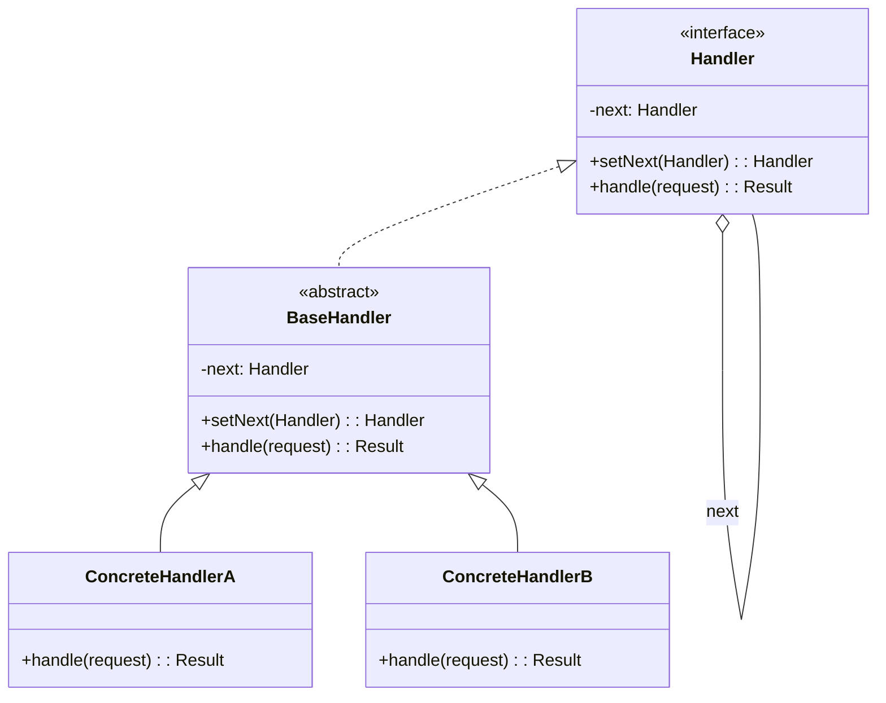
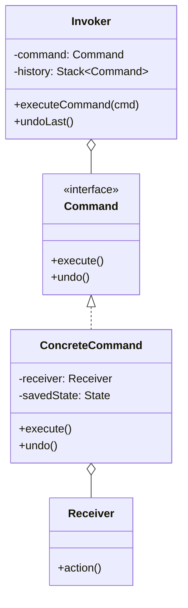
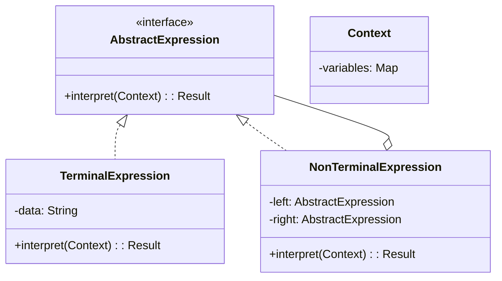
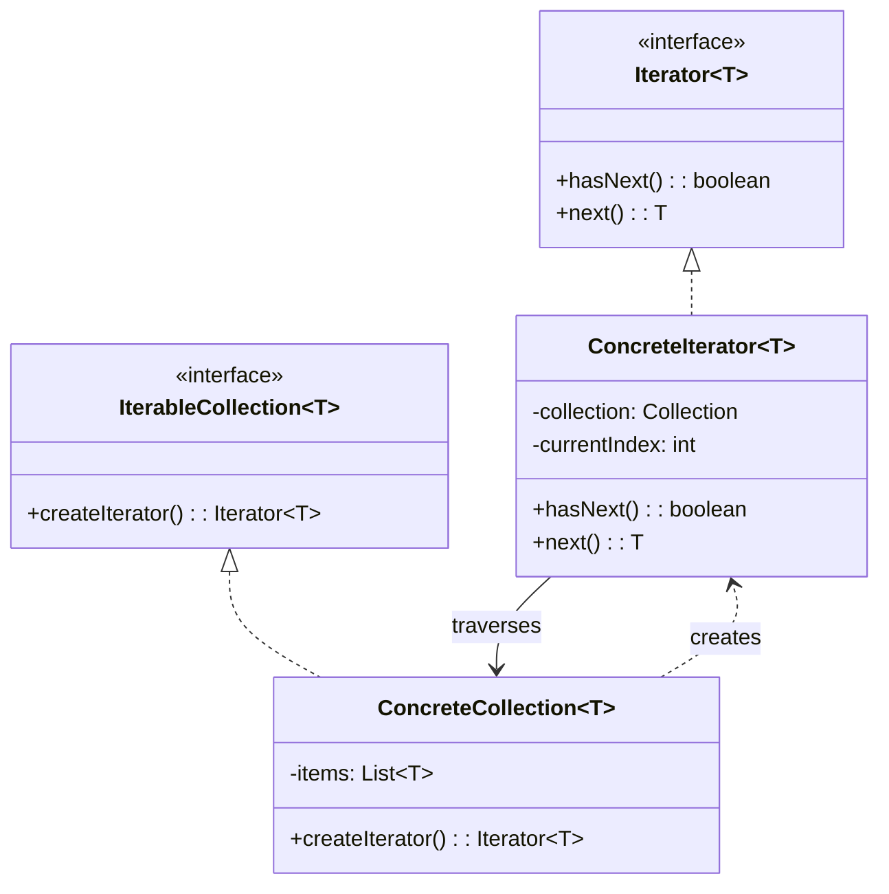
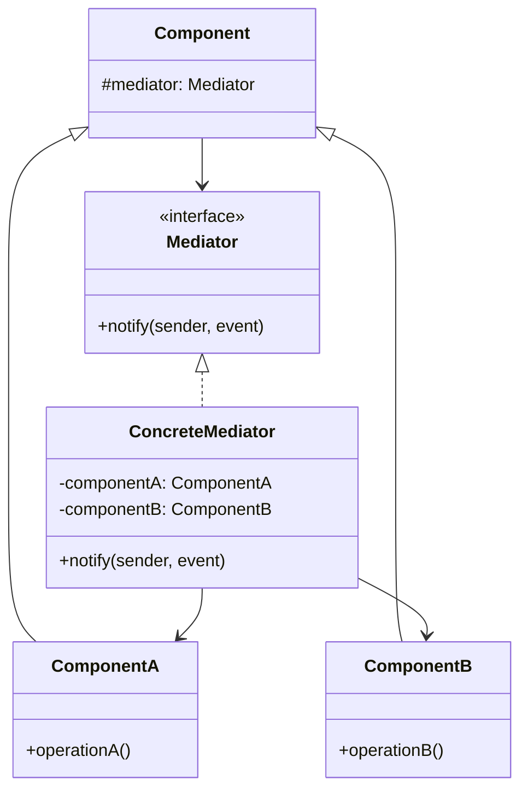
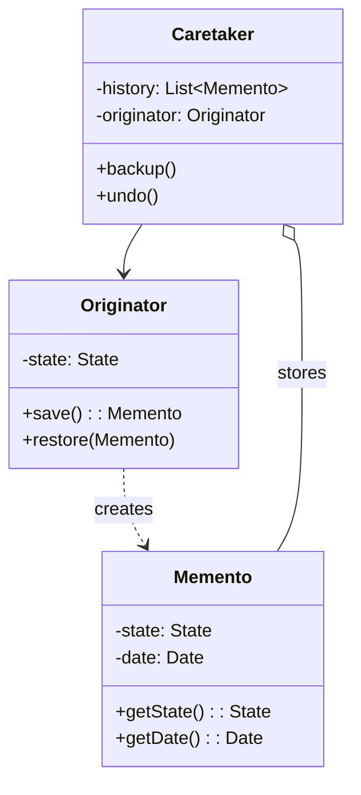

# ⚙️ Behavioral Patterns — Các Mẫu Hành Vi (Phần 1/2)

> Kiểm soát **cách giao tiếp và phân chia trách nhiệm** giữa các đối tượng. Tập trung vào **thuật toán** và **phân công công việc** giữa objects.

---

## 1. Chain of Responsibility

| Thuộc tính | Giá trị |
|-----------|---------|
| **Ý nghĩa** | Chuyển request qua **chuỗi handlers**, mỗi handler quyết định xử lý hoặc **chuyển tiếp** cho handler kế tiếp |
| **Phức tạp** | ⭐⭐ |
| **Tần suất** | 🔥🔥 |
| **Phạm vi** | Object |

### Class Diagram



### Code Mẫu

```java
// Handler
abstract class AuthHandler {
    private AuthHandler next;
    
    AuthHandler setNext(AuthHandler next) {
        this.next = next;
        return next; // fluent chain building
    }
    
    boolean handle(Request req) {
        if (next != null) return next.handle(req);
        return true; // end of chain = approved
    }
}

// Concrete Handlers
class RateLimitHandler extends AuthHandler {
    boolean handle(Request req) {
        if (isRateLimited(req.ip)) return false;  // chặn
        return super.handle(req);                  // chuyển tiếp
    }
}

class AuthenticationHandler extends AuthHandler {
    boolean handle(Request req) {
        if (!isAuthenticated(req.token)) return false;
        return super.handle(req);
    }
}

class AuthorizationHandler extends AuthHandler {
    boolean handle(Request req) {
        if (!hasPermission(req.user, req.resource)) return false;
        return super.handle(req);
    }
}

// Xây chuỗi
AuthHandler chain = new RateLimitHandler();
chain.setNext(new AuthenticationHandler())
     .setNext(new AuthorizationHandler());

chain.handle(request); // đi qua từng handler
```

### Đặc Trưng Nhận Diện
- **Chuỗi** các handler nối liên tiếp
- Mỗi handler có reference đến **handler kế tiếp**
- Handler có thể **xử lý** hoặc **chuyển tiếp** request
- Client **không biết** handler nào sẽ xử lý

### Khi Nào Sử Dụng
- Xử lý request qua **nhiều bước tuần tự** (middleware, filter pipeline)
- Không biết trước handler nào sẽ xử lý
- Cần **thay đổi chuỗi runtime**

### 🔗 Chain of Responsibility vs Decorator

| Tiêu chí | Chain of Responsibility | Decorator |
|----------|------------------------|-----------|
| **Luồng** | Có thể **dừng** ở bất kỳ handler nào | **Luôn chạy qua** tất cả decorator |
| **Mục đích** | Tìm handler phù hợp để xử lý | Thêm chức năng cho mọi request |
| **Kết quả** | **1 handler** xử lý (hoặc none) | **Tất cả** decorator đều thực thi |

---

## 2. Command

| Thuộc tính | Giá trị |
|-----------|---------|
| **Ý nghĩa** | Đóng gói request thành **object** — cho phép tham số hoá, hàng đợi, log, và **undo/redo** |
| **Phức tạp** | ⭐⭐ |
| **Tần suất** | 🔥🔥🔥 |
| **Phạm vi** | Object |

### Class Diagram



### Code Mẫu

```java
// Command interface
interface Command {
    void execute();
    void undo();
}

// Receiver
class TextEditor {
    private StringBuilder text = new StringBuilder();
    
    void insert(String str) { text.append(str); }
    void delete(int length) { text.delete(text.length() - length, text.length()); }
    String getText() { return text.toString(); }
}

// Concrete Command — đóng gói action + undo
class InsertCommand implements Command {
    private TextEditor editor;
    private String text;
    
    InsertCommand(TextEditor editor, String text) {
        this.editor = editor; this.text = text;
    }
    
    public void execute() { editor.insert(text); }
    public void undo() { editor.delete(text.length()); }
}

// Invoker — quản lý history
class CommandHistory {
    private Stack<Command> history = new Stack<>();
    
    void execute(Command cmd) {
        cmd.execute();
        history.push(cmd);
    }
    
    void undo() {
        if (!history.isEmpty()) history.pop().undo();
    }
}
```

### Đặc Trưng Nhận Diện
- Request được đóng gói thành **object** với `execute()` và tuỳ chọn `undo()`
- **Invoker** gọi command mà không biết chi tiết
- **Receiver** là đối tượng thực sự thực hiện hành động
- Command có thể **lưu trữ, xếp hàng, log, replay**

### Khi Nào Sử Dụng
- Cần **undo/redo** (text editor, Photoshop, transaction)
- **Hàng đợi** hoặc lên lịch operations (task queue, job scheduler)
- **Log & replay** operations (event sourcing)
- Tách biệt **GUI actions** khỏi business logic

---

## 3. Interpreter

| Thuộc tính | Giá trị |
|-----------|---------|
| **Ý nghĩa** | Định nghĩa cách **biểu diễn ngữ pháp** của một ngôn ngữ và tạo **interpreter** để xử lý các câu trong ngôn ngữ đó |
| **Phức tạp** | ⭐⭐⭐ |
| **Tần suất** | ❄️ |
| **Phạm vi** | Class |

### Class Diagram



### Code Mẫu

```java
// Expression interface
interface Expression {
    boolean interpret(Map<String, Boolean> context);
}

// Terminal — biến
class Variable implements Expression {
    private String name;
    Variable(String name) { this.name = name; }
    public boolean interpret(Map<String, Boolean> ctx) { return ctx.get(name); }
}

// Non-terminal — AND
class AndExpression implements Expression {
    private Expression left, right;
    AndExpression(Expression l, Expression r) { left = l; right = r; }
    public boolean interpret(Map<String, Boolean> ctx) {
        return left.interpret(ctx) && right.interpret(ctx);
    }
}

// Non-terminal — OR
class OrExpression implements Expression {
    private Expression left, right;
    OrExpression(Expression l, Expression r) { left = l; right = r; }
    public boolean interpret(Map<String, Boolean> ctx) {
        return left.interpret(ctx) || right.interpret(ctx);
    }
}

// Sử dụng: (A AND B) OR C
Expression expr = new OrExpression(
    new AndExpression(new Variable("A"), new Variable("B")),
    new Variable("C"));

Map<String, Boolean> ctx = Map.of("A", true, "B", false, "C", true);
System.out.println(expr.interpret(ctx)); // true
```

### Khi Nào Sử Dụng
- Ngôn ngữ **đơn giản** với ngữ pháp rõ ràng (SQL parser đơn giản, regex, rule engine)
- Hiệu suất **không phải** ưu tiên hàng đầu
- **Hiếm khi dùng** trong thực tế — thường thay bằng parser generator

---

## 4. Iterator

| Thuộc tính | Giá trị |
|-----------|---------|
| **Ý nghĩa** | Cung cấp cách **duyệt tuần tự** các phần tử của collection mà **không lộ** cấu trúc bên trong |
| **Phức tạp** | ⭐⭐ |
| **Tần suất** | 🔥🔥🔥 |
| **Phạm vi** | Object |

### Class Diagram



### Code Mẫu

```java
// Iterator interface
interface TreeIterator<T> {
    boolean hasNext();
    T next();
}

// Collection
class BinaryTree<T> {
    T value;
    BinaryTree<T> left, right;
    
    // Factory method trả về iterator phù hợp
    TreeIterator<T> inOrderIterator() { return new InOrderIterator<>(this); }
    TreeIterator<T> bfsIterator() { return new BFSIterator<>(this); }
}

// Concrete Iterator — In-Order DFS
class InOrderIterator<T> implements TreeIterator<T> {
    private Stack<BinaryTree<T>> stack = new Stack<>();
    
    InOrderIterator(BinaryTree<T> root) { pushLeft(root); }
    
    private void pushLeft(BinaryTree<T> node) {
        while (node != null) { stack.push(node); node = node.left; }
    }
    
    public boolean hasNext() { return !stack.isEmpty(); }
    
    public T next() {
        BinaryTree<T> node = stack.pop();
        pushLeft(node.right);
        return node.value;
    }
}
```

### Đặc Trưng Nhận Diện
- `hasNext()` + `next()` — interface duyệt chuẩn
- Collection tạo Iterator qua **factory method**
- **Nhiều thuật toán duyệt** cho cùng collection (DFS, BFS, in-order...)
- Client duyệt mà **không biết** cấu trúc bên trong

### Khi Nào Sử Dụng
- Duyệt collection **phức tạp** (tree, graph) mà không lộ cấu trúc
- Cần **nhiều cách duyệt** cho cùng collection
- Cần **interface duyệt thống nhất** cho các loại collection khác nhau

---

## 5. Mediator

| Thuộc tính | Giá trị |
|-----------|---------|
| **Ý nghĩa** | Định nghĩa object **trung gian** quản lý giao tiếp giữa các object, tránh chúng **tham chiếu trực tiếp** nhau |
| **Phức tạp** | ⭐⭐ |
| **Tần suất** | 🔥🔥 |
| **Phạm vi** | Object |

### Class Diagram



### Code Mẫu

```java
// Mediator
interface ChatMediator {
    void sendMessage(String msg, User sender);
    void addUser(User user);
}

class ChatRoom implements ChatMediator {
    private List<User> users = new ArrayList<>();
    
    public void addUser(User user) { users.add(user); }
    
    public void sendMessage(String msg, User sender) {
        for (User user : users) {
            if (user != sender) {  // gửi cho tất cả trừ sender
                user.receive(msg);
            }
        }
    }
}

// Colleague
abstract class User {
    protected ChatMediator mediator;
    protected String name;
    
    User(ChatMediator mediator, String name) {
        this.mediator = mediator; this.name = name;
    }
    
    void send(String msg) { mediator.sendMessage(msg, this); }
    abstract void receive(String msg);
}

class ChatUser extends User {
    ChatUser(ChatMediator m, String name) { super(m, name); }
    void receive(String msg) { System.out.println(name + " received: " + msg); }
}
```

### Đặc Trưng Nhận Diện
- Các component giao tiếp **qua mediator**, không trực tiếp
- Mediator **biết tất cả** components (God Object risk!)
- Components **chỉ biết** mediator interface

### Khi Nào Sử Dụng
- Nhiều object giao tiếp **chằng chịt** → giảm coupling
- Tập trung logic điều phối → dễ **thay đổi rules** giao tiếp
- **Dialog boxes**, **air traffic control**, **event bus**

### 🔗 Mediator vs Observer

| Tiêu chí | Mediator | Observer |
|----------|---------|---------|
| **Hướng** | **Hai chiều** — mediator biết tất cả | **Một chiều** — publisher → subscribers |
| **Coupling** | Components **không biết** nhau | Subscribers **không biết** nhau |
| **Trung tâm** | Mediator là **trung tâm điều phối** | Không có trung tâm cố định |
| **Logic** | Logic phức tạp nằm **trong mediator** | Logic đơn giản: notify all |

---

## 6. Memento

| Thuộc tính | Giá trị |
|-----------|---------|
| **Ý nghĩa** | Lưu trữ và khôi phục **trạng thái trước đó** của object mà **không vi phạm** encapsulation |
| **Phức tạp** | ⭐⭐⭐ |
| **Tần suất** | 🔥 |
| **Phạm vi** | Object |

### Class Diagram



### Code Mẫu

```java
// Memento — snapshot of state
class EditorMemento {
    private final String content;
    private final int cursorPos;
    
    EditorMemento(String content, int cursorPos) {
        this.content = content; this.cursorPos = cursorPos;
    }
    
    String getContent() { return content; }
    int getCursorPos() { return cursorPos; }
}

// Originator — object cần save/restore
class Editor {
    private String content = "";
    private int cursorPos = 0;
    
    void type(String text) { content += text; cursorPos += text.length(); }
    
    EditorMemento save() { return new EditorMemento(content, cursorPos); }
    
    void restore(EditorMemento m) {
        content = m.getContent();
        cursorPos = m.getCursorPos();
    }
}

// Caretaker — quản lý lịch sử
class History {
    private Stack<EditorMemento> snapshots = new Stack<>();
    private Editor editor;
    
    History(Editor editor) { this.editor = editor; }
    
    void backup() { snapshots.push(editor.save()); }
    void undo() { if (!snapshots.isEmpty()) editor.restore(snapshots.pop()); }
}
```

### Đặc Trưng Nhận Diện
- **Originator** tạo Memento (snapshot) từ state hiện tại
- **Memento** lưu state — **immutable**, chỉ Originator đọc được nội dung
- **Caretaker** lưu trữ Mementos nhưng **không truy cập** nội dung

### Khi Nào Sử Dụng
- Cần **undo/redo** mà giữ encapsulation
- Cần **snapshot** trạng thái (save game, transaction rollback)
- Kết hợp với **Command** pattern cho undo/redo hoàn chỉnh

### 🔗 Memento vs Command (cho Undo)

| Tiêu chí | Memento | Command |
|----------|---------|---------|
| **Cách undo** | **Khôi phục state** từ snapshot | **Đảo ngược action** (inverse operation) |
| **Bộ nhớ** | Tốn nhiều (mỗi snapshot = toàn bộ state) | Ít (chỉ lưu delta/operation) |
| **Phức tạp** | Đơn giản — chỉ save/restore | Phức tạp — phải viết inverse cho mỗi command |
| **Khi nào dùng** | State nhỏ, undo đơn giản | State lớn, operations có inverse rõ ràng |
