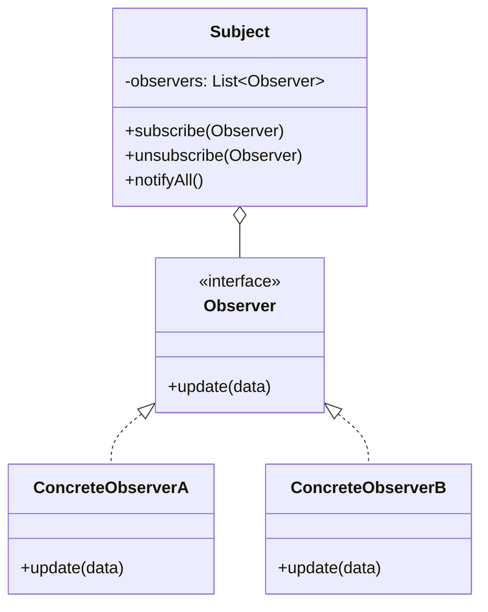
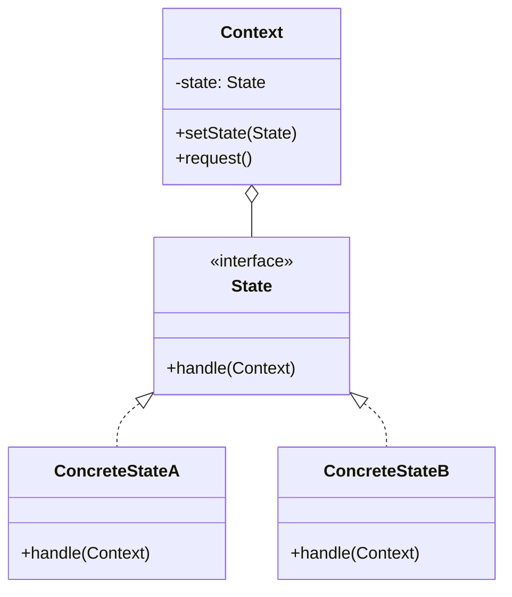
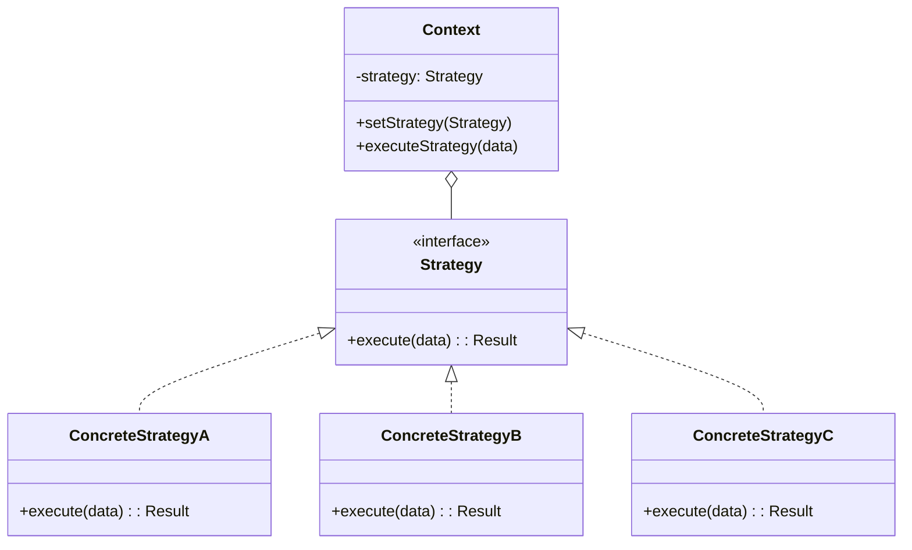
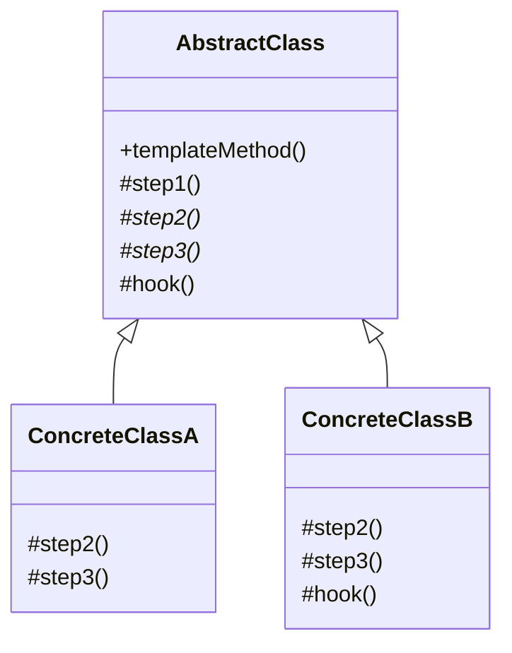
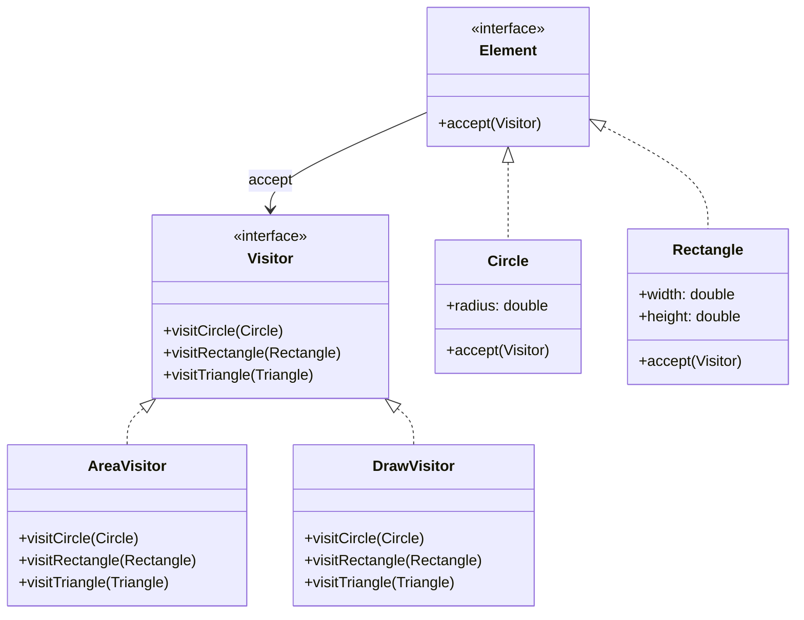

# ⚙️ Behavioral Patterns — Các Mẫu Hành Vi (Phần 2/2)

> Tiếp tục với 5 mẫu còn lại: Observer, State, Strategy, Template Method, Visitor.

---

## 7. Observer (Publish-Subscribe)

| Thuộc tính | Giá trị |
|-----------|---------|
| **Ý nghĩa** | Định nghĩa cơ chế **đăng ký (subscribe)** để nhiều object nhận thông báo tự động khi object khác **thay đổi trạng thái** |
| **Phức tạp** | ⭐⭐ |
| **Tần suất** | 🔥🔥🔥 |
| **Phạm vi** | Object |

### Class Diagram



### Code Mẫu

```java
// Observer interface
interface EventListener {
    void update(String eventType, String data);
}

// Subject (Publisher)
class EventManager {
    private Map<String, List<EventListener>> listeners = new HashMap<>();
    
    void subscribe(String eventType, EventListener listener) {
        listeners.computeIfAbsent(eventType, k -> new ArrayList<>()).add(listener);
    }
    
    void unsubscribe(String eventType, EventListener listener) {
        listeners.getOrDefault(eventType, List.of()).remove(listener);
    }
    
    void notify(String eventType, String data) {
        for (EventListener listener : listeners.getOrDefault(eventType, List.of())) {
            listener.update(eventType, data);
        }
    }
}

// Concrete Observers
class EmailAlert implements EventListener {
    public void update(String event, String data) {
        System.out.println("Email alert: " + event + " → " + data);
    }
}

class LogWriter implements EventListener {
    public void update(String event, String data) {
        System.out.println("Log: [" + event + "] " + data);
    }
}

// Concrete Subject
class FileEditor {
    private EventManager events = new EventManager();
    
    EventManager getEvents() { return events; }
    
    void save(String filename) {
        // ... save logic
        events.notify("save", filename);
    }
}
```

### Đặc Trưng Nhận Diện
- **Subject** duy trì danh sách observers
- **subscribe/unsubscribe** — đăng ký/hủy động
- **notify** — thông báo tất cả observers khi state thay đổi
- Observers **không biết nhau**

### Khi Nào Sử Dụng
- Khi thay đổi 1 object cần **tự động** cập nhật nhiều object khác
- Số lượng và loại observer **không biết trước**
- **Event systems**, **reactive programming**, **MVC/MVVM**

---

## 8. State

| Thuộc tính | Giá trị |
|-----------|---------|
| **Ý nghĩa** | Cho phép object **thay đổi hành vi** khi **trạng thái nội bộ** thay đổi — như thể object thay đổi class |
| **Phức tạp** | ⭐⭐ |
| **Tần suất** | 🔥🔥 |
| **Phạm vi** | Object |

### Class Diagram



### Code Mẫu

```java
// State interface
interface OrderState {
    void next(Order order);
    void prev(Order order);
    void printStatus();
}

// Concrete States
class NewState implements OrderState {
    public void next(Order o) { o.setState(new PaidState()); }
    public void prev(Order o) { System.out.println("Already at initial state"); }
    public void printStatus() { System.out.println("NEW"); }
}

class PaidState implements OrderState {
    public void next(Order o) { o.setState(new ShippedState()); }
    public void prev(Order o) { o.setState(new NewState()); }
    public void printStatus() { System.out.println("PAID"); }
}

class ShippedState implements OrderState {
    public void next(Order o) { o.setState(new DeliveredState()); }
    public void prev(Order o) { o.setState(new PaidState()); }
    public void printStatus() { System.out.println("SHIPPED"); }
}

class DeliveredState implements OrderState {
    public void next(Order o) { System.out.println("Already delivered"); }
    public void prev(Order o) { System.out.println("Cannot undo delivery"); }
    public void printStatus() { System.out.println("DELIVERED"); }
}

// Context
class Order {
    private OrderState state = new NewState();
    
    void setState(OrderState state) { this.state = state; }
    void nextStep() { state.next(this); }
    void prevStep() { state.prev(this); }
    void printStatus() { state.printStatus(); }
}

// Hành vi thay đổi theo state — không cần if/switch
Order order = new Order();
order.printStatus(); // NEW
order.nextStep();
order.printStatus(); // PAID
```

### Đặc Trưng Nhận Diện
- Context **delegate hành vi** cho State object hiện tại
- State objects **biết cách chuyển** sang state khác
- **Loại bỏ** if/else/switch chains dựa trên state
- Giống **state machine** trong OOP

### Khi Nào Sử Dụng
- Object có hành vi **thay đổi** theo trạng thái (order workflow, player states)
- **Nhiều if/else** kiểm tra state → chuyển sang State pattern
- **Finite state machine** cần implement OOP

### 🔑 QUAN TRỌNG: State vs Strategy

| Tiêu chí | State | Strategy |
|----------|-------|----------|
| **Ai thay đổi?** | State tự chuyển (**tự quản lý**) | Client chọn (**từ bên ngoài**) |
| **Biết nhau?** | States **biết** nhau (chuyển tiếp) | Strategies **không biết** nhau |
| **Số lần thay đổi** | **Nhiều lần** trong vòng đời object | Thường **1 lần** khi khởi tạo |
| **Tương tự** | **State machine** — chuyển trạng thái | **Plugin** — thay thuật toán |
| **Ví dụ** | Order: New → Paid → Shipped | Sort: QuickSort / MergeSort |

> **Ghi nhớ**: State = "tôi **tự biến đổi** theo trạng thái". Strategy = "bạn **chọn cho tôi** thuật toán nào".

---

## 9. Strategy

| Thuộc tính | Giá trị |
|-----------|---------|
| **Ý nghĩa** | Định nghĩa **họ thuật toán**, đóng gói từng thuật toán, và làm chúng **hoán đổi được** |
| **Phức tạp** | ⭐ |
| **Tần suất** | 🔥🔥🔥 |
| **Phạm vi** | Object |

### Class Diagram



### Code Mẫu

```java
// Strategy interface
interface PaymentStrategy {
    void pay(int amount);
}

// Concrete Strategies
class CreditCardPayment implements PaymentStrategy {
    private String cardNumber;
    CreditCardPayment(String card) { this.cardNumber = card; }
    public void pay(int amount) { System.out.println("Credit Card: $" + amount); }
}

class PayPalPayment implements PaymentStrategy {
    private String email;
    PayPalPayment(String email) { this.email = email; }
    public void pay(int amount) { System.out.println("PayPal: $" + amount); }
}

class CryptoPayment implements PaymentStrategy {
    public void pay(int amount) { System.out.println("Crypto: $" + amount); }
}

// Context
class ShoppingCart {
    private PaymentStrategy paymentStrategy;
    
    void setPaymentStrategy(PaymentStrategy strategy) {
        this.paymentStrategy = strategy;  // client chọn strategy
    }
    
    void checkout(int amount) {
        paymentStrategy.pay(amount);
    }
}

// Client CHỌN strategy
ShoppingCart cart = new ShoppingCart();
cart.setPaymentStrategy(new CreditCardPayment("4111...")); // client quyết định
cart.checkout(100);
```

### Đặc Trưng Nhận Diện
- Interface chung cho **họ thuật toán**
- Context chứa reference đến **Strategy interface** (composition)
- **Client** chọn strategy cụ thể
- **Loại bỏ** if/else/switch chọn thuật toán

### Khi Nào Sử Dụng
- Có **nhiều thuật toán** cho cùng tác vụ (sort, compress, encrypt, validate)
- Cần **thay đổi thuật toán runtime**
- Muốn **loại bỏ** conditional statements chọn thuật toán

---

## 10. Template Method

| Thuộc tính | Giá trị |
|-----------|---------|
| **Ý nghĩa** | Định nghĩa **khung thuật toán** trong base class, cho phép subclass **override các bước cụ thể** mà không thay đổi cấu trúc |
| **Phức tạp** | ⭐ |
| **Tần suất** | 🔥🔥🔥 |
| **Phạm vi** | Class |

### Class Diagram



### Code Mẫu

```java
// Abstract Class — template method defines algorithm skeleton
abstract class DataMiner {
    
    // Template Method — final = không cho override khung
    public final void mine(String path) {
        openFile(path);       // step 1 — có thể override
        extractData();        // step 2 — PHẢI override (abstract)
        parseData();          // step 3 — PHẢI override (abstract)
        analyzeData();        // step 4 — có default, có thể override
        generateReport();     // step 5 — cố định
        hook();               // hook — mặc định rỗng, tuỳ chọn override
    }
    
    void openFile(String path) { System.out.println("Opening: " + path); }
    abstract void extractData();     // abstract — subclass PHẢI implement
    abstract void parseData();       // abstract — subclass PHẢI implement
    void analyzeData() { System.out.println("Default analysis"); } // default
    
    // Hook — subclass CÓ THỂ override (không bắt buộc)
    void hook() { }
    
    private void generateReport() { System.out.println("Report generated"); }
}

class CSVDataMiner extends DataMiner {
    void extractData() { System.out.println("Extract CSV rows"); }
    void parseData() { System.out.println("Parse CSV fields"); }
}

class PDFDataMiner extends DataMiner {
    void extractData() { System.out.println("Extract PDF text"); }
    void parseData() { System.out.println("Parse PDF structure"); }
    void hook() { System.out.println("PDF cleanup"); } // override hook
}
```

### Đặc Trưng Nhận Diện
- **Template method** trong base class định nghĩa **thứ tự các bước** (thường `final`)
- **Abstract methods** — subclass **bắt buộc** override
- **Hooks** — methods có default implementation rỗng, subclass **tuỳ chọn** override
- **Inversion of Control** — base class gọi subclass (Hollywood Principle: "Don't call us, we'll call you")

### Khi Nào Sử Dụng
- Nhiều class có **thuật toán giống nhau** chỉ khác vài bước
- Muốn **kiểm soát** thứ tự các bước (subclass không thể thay đổi flow)
- **Framework hooks** — cho phép customization có kiểm soát

### 🔑 Template Method vs Strategy

| Tiêu chí | Template Method | Strategy |
|----------|----------------|----------|
| **Cơ chế** | **Kế thừa** (subclass override) | **Composition** (inject object) |
| **Granularity** | Override **từng bước** | Thay thế **toàn bộ thuật toán** |
| **Thay đổi** | **Compile-time** (subclass cố định) | **Runtime** (swap strategy) |
| **Kiểm soát** | Base class **kiểm soát flow** | Client **kiểm soát** chọn algo |
| **Flexibility** | Ít linh hoạt (kế thừa) | Rất linh hoạt (composition) |

> **Quy tắc**: Template Method = thay đổi **một vài bước** trong thuật toán qua kế thừa. Strategy = thay thế **toàn bộ thuật toán** qua composition.

---

## 11. Visitor

| Thuộc tính | Giá trị |
|-----------|---------|
| **Ý nghĩa** | Tách **thuật toán** khỏi **cấu trúc object** mà nó hoạt động trên. Cho phép thêm operations mới **mà không sửa** classes |
| **Phức tạp** | ⭐⭐⭐ |
| **Tần suất** | 🔥 |
| **Phạm vi** | Object |

### Class Diagram



### Code Mẫu

```java
// Visitor interface — một method cho MỖI element type
interface ShapeVisitor {
    double visit(Circle c);
    double visit(Rectangle r);
    double visit(Triangle t);
}

// Element interface
interface Shape {
    double accept(ShapeVisitor visitor);
}

// Concrete Elements
class Circle implements Shape {
    double radius;
    Circle(double r) { radius = r; }
    public double accept(ShapeVisitor v) { return v.visit(this); } // double dispatch
}

class Rectangle implements Shape {
    double width, height;
    Rectangle(double w, double h) { width = w; height = h; }
    public double accept(ShapeVisitor v) { return v.visit(this); }
}

// Concrete Visitors — thêm operation MỚI mà KHÔNG sửa Shape classes
class AreaCalculator implements ShapeVisitor {
    public double visit(Circle c) { return Math.PI * c.radius * c.radius; }
    public double visit(Rectangle r) { return r.width * r.height; }
    public double visit(Triangle t) { return 0.5 * t.base * t.height; }
}

class PerimeterCalculator implements ShapeVisitor {
    public double visit(Circle c) { return 2 * Math.PI * c.radius; }
    public double visit(Rectangle r) { return 2 * (r.width + r.height); }
    public double visit(Triangle t) { return t.a + t.b + t.c; }
}

// Sử dụng
List<Shape> shapes = List.of(new Circle(5), new Rectangle(3, 4));
ShapeVisitor areaCalc = new AreaCalculator();

for (Shape s : shapes) {
    System.out.println("Area: " + s.accept(areaCalc)); // double dispatch
}
```

### Đặc Trưng Nhận Diện
- **Double dispatch** — `element.accept(visitor)` → `visitor.visit(element)`
- Visitor có **một method cho mỗi element type** (method overloading)
- Thêm operation mới = thêm **Visitor class mới** (không sửa elements)
- Element hierarchy phải **ổn định** (thêm element type → sửa mọi Visitor)

### Khi Nào Sử Dụng
- Cần thêm **nhiều operations** cho cấu trúc object ổn định
- Tránh "polluting" element classes với operations không liên quan
- Thao tác trên **Composite tree** (AST traversal, XML/HTML processing)

### ⚠️ Trade-off Quan Trọng

| Dễ thêm... | Visitor | Truyền thống (method trong Element) |
|-------------|---------|--------------------------------------|
| **Operation mới** | ✅ Thêm Visitor class | ❌ Sửa mọi Element class |
| **Element type mới** | ❌ Sửa mọi Visitor | ✅ Thêm Element class |

> **Quy tắc**: Dùng Visitor khi **element types ổn định** nhưng **operations thường xuyên thêm mới**.

---

## 📊 Ma Trận So Sánh Behavioral Patterns

| Pattern | Mục đích chính | Cơ chế | Coupling |
|---------|---------------|--------|----------|
| **Chain of Resp.** | Xử lý request qua chuỗi | Linked list of handlers | Thấp |
| **Command** | Đóng gói request thành object | Command object + Invoker | Thấp |
| **Interpreter** | Parse ngôn ngữ đơn giản | AST + recursive interpret | Cao |
| **Iterator** | Duyệt collection | hasNext/next interface | Thấp |
| **Mediator** | Giảm coupling giao tiếp | Central coordinator | Trung bình |
| **Memento** | Save/restore state | Snapshot objects | Thấp |
| **Observer** | Thông báo thay đổi | Pub/Sub | Thấp |
| **State** | Thay đổi hành vi theo state | State object delegation | Trung bình |
| **Strategy** | Hoán đổi thuật toán | Algorithm object injection | Thấp |
| **Template Method** | Khung thuật toán + override | Inheritance + abstract methods | Cao |
| **Visitor** | Thêm operations cho structure | Double dispatch | Cao |
