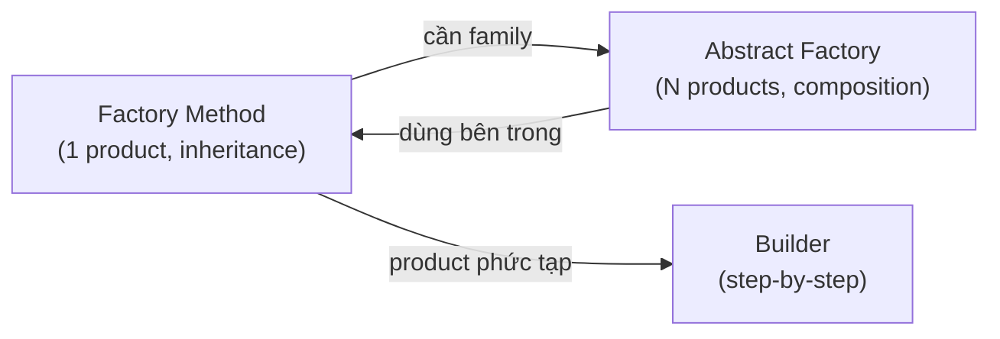
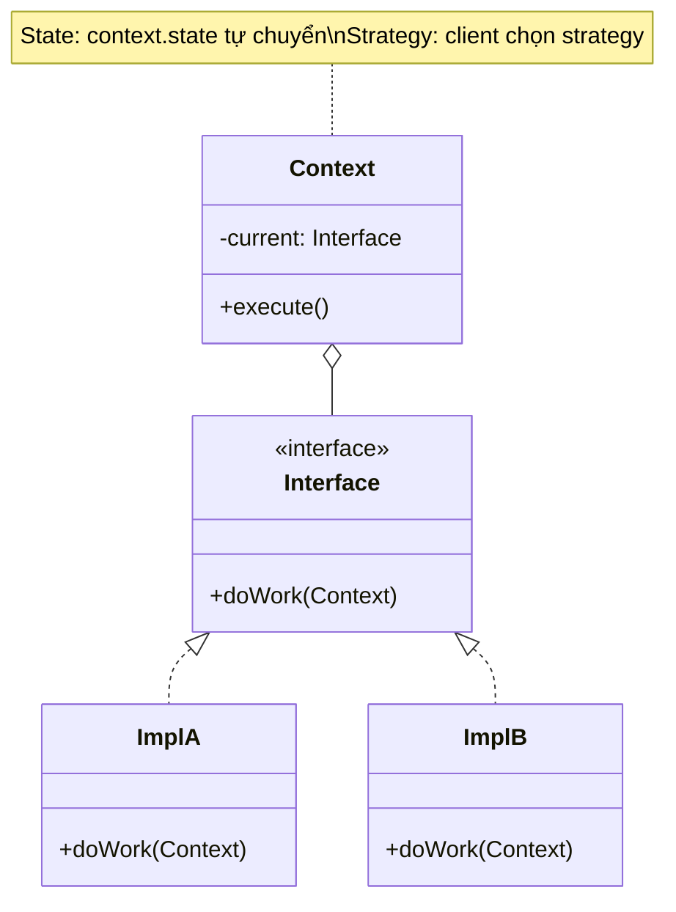

# 🔍 So Sánh & Phân Biệt Chuyên Sâu Giữa Các Design Patterns

> Tài liệu này tập trung vào việc phân biệt các cặp mẫu **dễ nhầm lẫn nhất**, phân tích biến thể, và cung cấp quy tắc chọn mẫu phù hợp.

---

## 📋 Mục Lục Các Cặp So Sánh

1. [Factory Method vs Abstract Factory vs Builder](#1-factory-method-vs-abstract-factory-vs-builder)
2. [Adapter vs Bridge vs Proxy vs Decorator](#2-adapter-vs-bridge-vs-proxy-vs-decorator--bộ-tứ-wrapper)
3. [State vs Strategy](#3-state-vs-strategy--cặp-song-sinh)
4. [Template Method vs Strategy](#4-template-method-vs-strategy)
5. [Observer vs Mediator vs Event Bus](#5-observer-vs-mediator)
6. [Command vs Memento vs Strategy](#6-command-vs-memento-vs-strategy)
7. [Chain of Responsibility vs Decorator](#7-chain-of-responsibility-vs-decorator)
8. [Composite vs Decorator](#8-composite-vs-decorator)
9. [Flyweight vs Singleton vs Object Pool](#9-flyweight-vs-singleton-vs-object-pool)
10. [Visitor vs Iterator vs Strategy](#10-visitor-vs-iterator-vs-strategy)
11. [Factory Method vs Template Method](#11-factory-method-vs-template-method)

---

## 1. Factory Method vs Abstract Factory vs Builder

### Sơ đồ quyết định

```
Cần tạo object?
├── 1 loại product, delegate cho subclass?
│   → Factory Method
├── Nhiều loại product LIÊN QUAN (family)?
│   → Abstract Factory  
├── Object phức tạp, xây từng bước?
│   → Builder
└── Clone từ prototype có sẵn?
    → Prototype
```

### Ma trận so sánh

| Tiêu chí | Factory Method | Abstract Factory | Builder |
|----------|---------------|-----------------|---------|
| **Tạo gì?** | 1 product | Family of products | 1 product phức tạp |
| **Cách tạo** | Subclass override | Object composition | Step-by-step |
| **Khi trả về** | Ngay lập tức | Ngay lập tức | Cuối quy trình (`build()`) |
| **Biết concrete?** | Subclass biết | Factory biết | Builder biết |
| **Client biết?** | Không | Không | Có thể (fluent API) |
| **Mở rộng** | Thêm Creator subclass | Thêm Factory impl | Thêm Builder impl |
| **Ví dụ** | `createLogger()` | `createButton() + createCheckbox()` | `new HouseBuilder().walls().roof().build()` |

### Khi nào một mẫu là biến thể của mẫu khác?

- **Abstract Factory** thường **dùng Factory Method** bên trong — mỗi `create*()` method là một Factory Method
- Bắt đầu với **Factory Method**, khi cần nhiều product liên quan → tiến hóa thành **Abstract Factory**
- **Builder** có thể kết hợp với **Abstract Factory** — factory quyết định Builder nào, Builder xây product



---

## 2. Adapter vs Bridge vs Proxy vs Decorator — Bộ Tứ Wrapper

Cả 4 đều "bọc" một object khác, nhưng **mục đích hoàn toàn khác**:

### Ma trận phân biệt cốt lõi

| Tiêu chí | Adapter | Bridge | Decorator | Proxy |
|----------|---------|--------|-----------|-------|
| **Mục đích** | Dịch interface | Tách abstraction/impl | Thêm chức năng | Kiểm soát truy cập |
| **Interface** | **Khác** (dịch A→B) | **Khác** (2 hierarchy) | **Cùng** | **Cùng** |
| **Thiết kế** | Sau (retrofit) | Trước (upfront) | Sau hoặc trước | Sau hoặc trước |
| **Stacking** | Không | Không | **Có** (nhiều layers) | Thường không |
| **Wrapped object** | Luôn tồn tại | Luôn tồn tại | Luôn tồn tại | Có thể chưa tạo |
| **Ai quyết định?** | Adapter dịch | Bridge tách | Client stack | Proxy kiểm soát |

### Sơ đồ trực quan

```
ADAPTER:   Client ──[IF_Target]──▶ Adapter ──[IF_Adaptee]──▶ Adaptee
                                   "dịch"

BRIDGE:    Abstraction ──────────▶ Implementation
           ↑ extend                ↑ implement
           RefinedAbstr.           ConcreteImpl
           "2 trục độc lập"

DECORATOR: Client ──[IF_Comp]──▶ DecoratorA ──[IF_Comp]──▶ DecoratorB ──[IF_Comp]──▶ Component
                                 "thêm A"                  "thêm B"

PROXY:     Client ──[IF_Subject]──▶ Proxy ──[IF_Subject]──▶ RealSubject
                                    "kiểm soát"
```

### Quy tắc vàng phân biệt

> 1. Interface **khác nhau** giữa 2 bên? → **Adapter**
> 2. **Hai trục** thay đổi độc lập? → **Bridge**  
> 3. Interface **cùng** + **thêm** chức năng + **stack** nhiều? → **Decorator**
> 4. Interface **cùng** + **kiểm soát** (lazy, auth, cache, log)? → **Proxy**

---

## 3. State vs Strategy — Cặp Song Sinh

Cấu trúc **giống hệt nhau** nhưng **ý nghĩa hoàn toàn khác**:



### 5 tiêu chí phân biệt

| # | Tiêu chí | State | Strategy |
|---|----------|-------|----------|
| 1 | **Ai thay đổi?** | State **tự chuyển** (hoặc Context chuyển) | **Client** inject từ bên ngoài |
| 2 | **States biết nhau?** | ✅ Biết — `state.next(context)` chuyển sang state khác | ❌ Không biết nhau |
| 3 | **Số lần thay đổi?** | Nhiều lần, liên tục trong vòng đời | Thường 1 lần (hoặc ít) |
| 4 | **Analogy** | Finite State Machine | Plugin/Algorithm swap |
| 5 | **Ví dụ** | TCP Connection: Listen→Established→Closed | Sort: quickSort / mergeSort |

### Khi nào dùng cái nào?

```
Object thay đổi hành vi LIÊN TỤC dựa trên trạng thái nội bộ?
  └── CÓ → State (VD: Document: Draft→Review→Published)

Cần CHỌN một thuật toán/chiến lược từ bên ngoài?
  └── CÓ → Strategy (VD: Payment: CreditCard/PayPal/Crypto)
```

---

## 4. Template Method vs Strategy

| Tiêu chí | Template Method | Strategy |
|----------|----------------|----------|
| **Cơ chế** | **Kế thừa** (IS-A) | **Composition** (HAS-A) |
| **Thay đổi** | Override **một vài bước** | Thay thế **toàn bộ thuật toán** |
| **Timing** | Compile-time (subclass cố định) | **Runtime** (swap object) |
| **Kiểm soát** | Base class kiểm soát **flow** | Client kiểm soát **chọn algo** |
| **Reuse** | Code chung nằm trong **base class** | Code chung nằm trong **Context** |
| **Flexibility** | Ít — phụ thuộc kế thừa | Nhiều — composition linh hoạt |

### Quy tắc chọn

```
Thuật toán có KHUNG CỐ ĐỊNH, chỉ khác VÀI BƯỚC?
  → Template Method

Thuật toán HOÀN TOÀN KHÁC NHAU, cần swap RUNTIME?
  → Strategy
```

> **Xu hướng hiện đại**: Ưu tiên **Strategy** (composition) hơn Template Method (inheritance) — phù hợp với nguyên tắc "Favor composition over inheritance".

---

## 5. Observer vs Mediator

| Tiêu chí | Observer | Mediator |
|----------|---------|---------|
| **Quan hệ** | 1-to-many (**publisher → subscribers**) | Many-to-many (**qua trung gian**) |
| **Hướng** | **Một chiều** (Subject → Observer) | **Hai chiều** (Component ↔ Mediator ↔ Component) |
| **Logic điều phối** | Đơn giản — notify all | Phức tạp — routing, filtering |
| **Coupling** | Observers **không biết nhau** | Components **không biết nhau**, nhưng Mediator biết tất cả |
| **Khi dùng** | Event broadcast đơn giản | Giao tiếp phức tạp giữa nhiều object |

### Khi nào chuyển Observer → Mediator?

```
Observer đủ khi: A thay đổi → thông báo B, C, D (đơn giản)

Cần Mediator khi: A thay đổi → nếu B đang active → thông báo C, ngược lại → thông báo D
                   (logic điều phối phức tạp)
```

> **Thực tế**: Mediator thường **chứa** Observer pattern bên trong — components "subscribe" vào mediator events.

---

## 6. Command vs Memento vs Strategy

Cả 3 đều "đóng gói" một thứ gì đó thành object:

| Đóng gói gì? | Command | Memento | Strategy |
|--------------|---------|---------|----------|
| **Nội dung** | **Action/Request** | **State snapshot** | **Algorithm** |
| **Mục đích** | Execute/Undo/Queue | Save/Restore | Swap behavior |
| **Có undo?** | ✅ (inverse operation) | ✅ (restore state) | ❌ |
| **Có execute?** | ✅ | ❌ | ✅ |
| **Lưu trữ?** | History stack | History stack | Không |

### Kết hợp Command + Memento cho Undo hoàn chỉnh

```
Command: execute() → thực hiện action
                   → save Memento TRƯỚC khi execute
         undo()   → restore từ Memento

Kết hợp: Command lưu Memento trước execute, restore khi undo
         → Đơn giản hơn viết inverse operation
```

---

## 7. Chain of Responsibility vs Decorator

| Tiêu chí | Chain of Responsibility | Decorator |
|----------|------------------------|-----------|
| **Xử lý** | **1 handler** xử lý (hoặc none) | **Tất cả** decorators đều chạy |
| **Dừng sớm** | ✅ — handler có thể chặn/dừng chain | ❌ — luôn đi qua tất cả |
| **Thứ tự** | Quan trọng (ai xử lý trước?) | Quan trọng (decorator nào bọc ngoài?) |
| **Mục đích** | Tìm handler phù hợp | Thêm behavior cho tất cả requests |
| **Ví dụ** | Middleware: auth → rate limit → handler | Stream: BufferedInputStream(GZIPInputStream(FileInputStream)) |

```
Chain of Resp: request → [H1: skip] → [H2: HANDLE] → [H3: never reached]
Decorator:     request → [D1: add logging] → [D2: add caching] → [Component: execute]
```

---

## 8. Composite vs Decorator

Cả 2 đều sử dụng **recursive composition** nhưng khác mục đích:

| Tiêu chí | Composite | Decorator |
|----------|-----------|-----------|
| **Cấu trúc** | **Cây** (tree) — 1 parent, N children | **Chuỗi** (chain) — mỗi node bọc 1 node |
| **Mục đích** | Xử lý **đồng nhất** leaf và composite | **Thêm chức năng** cho component |
| **Children** | **Nhiều** children (tree structure) | **1** wrapped component (linear) |
| **Aggregate?** | ✅ — tổng hợp kết quả từ children | ❌ — tăng cường kết quả |

```
Composite:  Root
            ├── Leaf1
            ├── Composite2
            │   ├── Leaf3
            │   └── Leaf4
            └── Leaf5

Decorator:  DecoratorA → DecoratorB → DecoratorC → Component
            (thêm A)     (thêm B)     (thêm C)    (core)
```

### Kết hợp mạnh mẽ

Decorator **thường kết hợp** với Composite — decorate từng node trong tree:
```java
Component tree = new LoggingDecorator(           // decorate
    new Composite(                                // composite tree
        new CachingDecorator(new Leaf("A")),      // decorate leaf
        new Leaf("B")
    )
);
```

---

## 9. Flyweight vs Singleton vs Object Pool

Cả 3 đều liên quan đến **quản lý số lượng object**:

| Tiêu chí | Flyweight | Singleton | Object Pool |
|----------|-----------|-----------|-------------|
| **Số instance** | Nhiều, nhưng **chia sẻ** intrinsic state | **Đúng 1** | N (bounded pool) |
| **Mục đích** | Tiết kiệm **RAM** | Unique global access | Tái sử dụng object **tốn kém** tạo |
| **State** | Intrinsic (shared) + Extrinsic (per-context) | Full state | Full state, reset khi trả lại |
| **Ví dụ** | String pool, glyph cache | Logger, Config | DB Connection Pool, Thread Pool |

---

## 10. Visitor vs Iterator vs Strategy

| Tiêu chí | Visitor | Iterator | Strategy |
|----------|---------|----------|----------|
| **Tách gì?** | **Operation** khỏi structure | **Traversal** khỏi collection | **Algorithm** khỏi context |
| **Mục đích** | Thêm operation mới cho elements | Duyệt tuần tự | Hoán đổi thuật toán |
| **Double dispatch?** | ✅ | ❌ | ❌ |
| **Kết hợp** | Visitor thường **dùng Iterator** để duyệt | Iterator duyệt cho Visitor | Strategy độc lập |

---

## 11. Factory Method vs Template Method

**Factory Method là dạng đặc biệt của Template Method**, chuyên cho việc tạo object:

| Tiêu chí | Factory Method | Template Method |
|----------|---------------|----------------|
| **Mục đích** | Override **bước tạo object** | Override **bước xử lý logic** |
| **Return** | Trả về **object mới** | Thường void hoặc kết quả xử lý |
| **Scope** | Creational | Behavioral |
| **Giống nhau** | Cả hai dùng **inheritance + abstract method** |

```
Template Method:  baseMethod() { step1(); step2(); step3(); }  // khung cố định
                  abstract step2();                              // subclass override

Factory Method:   baseMethod() { Product p = createProduct(); p.use(); }  // khung cố định
                  abstract Product createProduct();                         // subclass override → TẠO OBJECT
```

> **Bản chất**: Factory Method = Template Method trong đó bước được override là **bước tạo object**.

---

## 📐 Sơ Đồ Quyết Định Tổng Hợp

```
Bạn cần giải quyết vấn đề gì?

1. TẠO OBJECT
   ├── Chỉ 1 instance? → Singleton
   ├── 1 loại, subclass quyết định? → Factory Method
   ├── Family sản phẩm liên quan? → Abstract Factory
   ├── Object phức tạp, từng bước? → Builder
   └── Clone từ mẫu? → Prototype

2. TỔ CHỨC CẤU TRÚC
   ├── Interface không tương thích? → Adapter
   ├── 2 trục thay đổi độc lập? → Bridge
   ├── Cấu trúc cây, xử lý đồng nhất? → Composite
   ├── Thêm chức năng runtime? → Decorator
   ├── Đơn giản hóa subsystem? → Facade
   ├── Tiết kiệm RAM, chia sẻ state? → Flyweight
   └── Kiểm soát truy cập? → Proxy

3. QUẢN LÝ HÀNH VI
   ├── Xử lý request qua chuỗi? → Chain of Responsibility
   ├── Đóng gói request, undo/redo? → Command
   ├── Parse ngôn ngữ đơn giản? → Interpreter
   ├── Duyệt collection ẩn cấu trúc? → Iterator
   ├── Giảm coupling giao tiếp N-N? → Mediator
   ├── Save/restore state? → Memento
   ├── Thông báo thay đổi 1-N? → Observer
   ├── Hành vi thay đổi theo trạng thái? → State
   ├── Hoán đổi thuật toán? → Strategy
   ├── Khung thuật toán cố định? → Template Method
   └── Thêm operation cho structure ổn định? → Visitor
```
