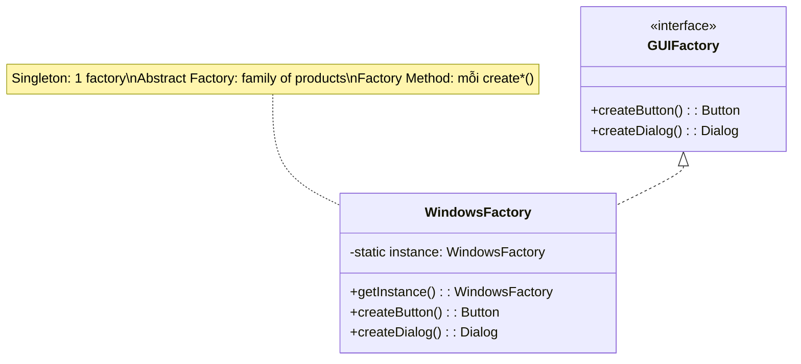
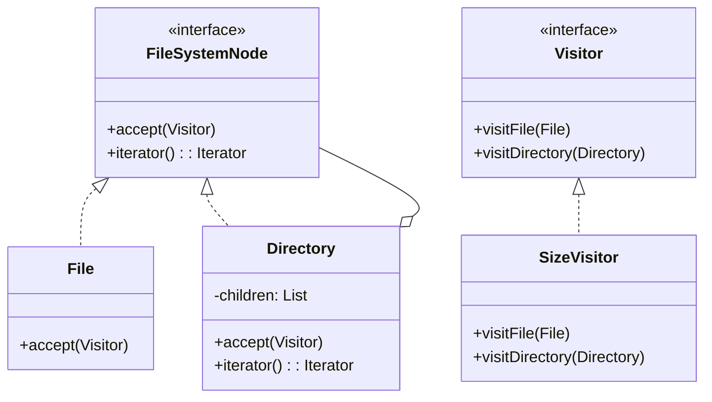
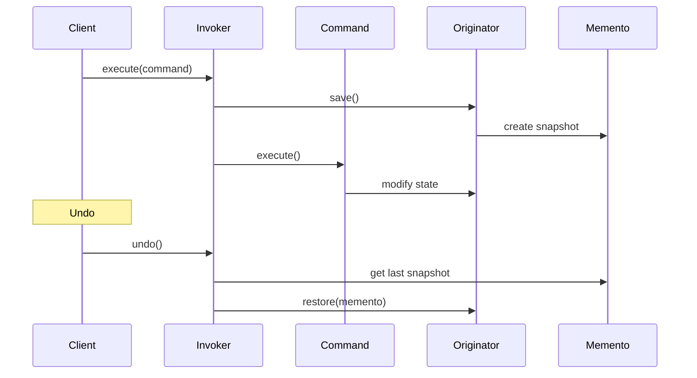
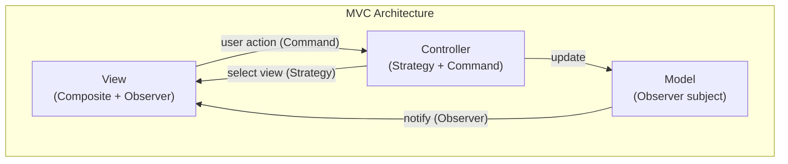

# 🔗 Chiến Lược Kết Hợp Design Patterns

> Trong thực tế, không mẫu nào đứng một mình. Sức mạnh thực sự đến từ việc **kết hợp** các mẫu một cách có chiến lược. Tài liệu này phân tích các tổ hợp phổ biến nhất, khi nào kết hợp, và cách kết hợp hiệu quả.

---

## 📋 Mục Lục

1. [Nguyên Tắc Kết Hợp](#nguyên-tắc-kết-hợp)
2. [10 Tổ Hợp Kinh Điển](#10-tổ-hợp-kinh-điển)
3. [Kiến Trúc Thực Tế: MVC/MVVM](#kiến-trúc-thực-tế)
4. [Anti-patterns Khi Kết Hợp](#anti-patterns)

---

## Nguyên Tắc Kết Hợp

### ✅ NÊN kết hợp khi:
- Mỗi pattern giải quyết **một mối quan tâm riêng biệt** (Separation of Concerns)
- Kết hợp **giảm coupling** tổng thể
- Các pattern **bổ sung** cho nhau (complementary), không chồng chéo

### ❌ KHÔNG NÊN kết hợp khi:
- Thêm pattern chỉ vì "đúng lý thuyết" → **over-engineering**
- Kết hợp tạo ra **complexity** lớn hơn vấn đề ban đầu
- Dùng pattern để giải quyết vấn đề mà **refactoring đơn giản** giải quyết được

---

## 10 Tổ Hợp Kinh Điển

### 1. Abstract Factory + Factory Method + Singleton

**Bài toán**: Hệ thống cần tạo family sản phẩm, chỉ cần 1 factory instance toàn cục.



```java
// Abstract Factory (interface) + Factory Method (mỗi create method)
interface GUIFactory {
    Button createButton();    // Factory Method
    Dialog createDialog();    // Factory Method
}

// Singleton + Abstract Factory implementation
class WindowsFactory implements GUIFactory {
    private static volatile WindowsFactory instance;
    
    private WindowsFactory() {}
    
    static WindowsFactory getInstance() { // Singleton
        if (instance == null) {
            synchronized (WindowsFactory.class) {
                if (instance == null) instance = new WindowsFactory();
            }
        }
        return instance;
    }
    
    public Button createButton() { return new WinButton(); }
    public Dialog createDialog() { return new WinDialog(); }
}
```

**Khi nào**: Factory tốn kém tạo, chỉ cần 1 instance, tạo family products.

---

### 2. Composite + Iterator + Visitor

**Bài toán**: Cấu trúc cây cần duyệt và thực hiện nhiều operations khác nhau.



```java
// Composite
interface FileNode {
    void accept(FileVisitor visitor);  // Visitor
}

class File implements FileNode {
    String name; long size;
    public void accept(FileVisitor v) { v.visitFile(this); }
}

class Directory implements FileNode {
    String name;
    List<FileNode> children = new ArrayList<>();
    
    public void accept(FileVisitor v) {
        v.visitDirectory(this);
        for (FileNode child : children) {  // Iterator (implicit)
            child.accept(v);               // recursive traversal
        }
    }
}

// Visitor — thêm operation mới mà không sửa FileNode
interface FileVisitor {
    void visitFile(File f);
    void visitDirectory(Directory d);
}

class SizeCalculator implements FileVisitor {
    long totalSize = 0;
    public void visitFile(File f) { totalSize += f.size; }
    public void visitDirectory(Directory d) { /* name only */ }
}

class SearchVisitor implements FileVisitor {
    String query; List<File> results = new ArrayList<>();
    public void visitFile(File f) { if (f.name.contains(query)) results.add(f); }
    public void visitDirectory(Directory d) { /* skip */ }
}
```

**Khi nào**: AST (compiler), DOM tree, file system — cần nhiều operations trên tree structure.

---

### 3. Command + Memento (Undo/Redo hoàn chỉnh)

**Bài toán**: Hệ thống cần undo/redo đầy đủ.



```java
// Kết hợp Command + Memento
interface Command {
    void execute();
    void undo();
}

class TextInsertCommand implements Command {
    private TextEditor editor;
    private String text;
    private EditorMemento savedState; // Memento!
    
    TextInsertCommand(TextEditor editor, String text) {
        this.editor = editor; this.text = text;
    }
    
    public void execute() {
        savedState = editor.save();  // Save Memento TRƯỚC khi thay đổi
        editor.insert(text);
    }
    
    public void undo() {
        editor.restore(savedState);  // Restore từ Memento
    }
}

// Invoker với history
class UndoManager {
    private Deque<Command> undoStack = new ArrayDeque<>();
    private Deque<Command> redoStack = new ArrayDeque<>();
    
    void execute(Command cmd) {
        cmd.execute();
        undoStack.push(cmd);
        redoStack.clear(); // clear redo after new action
    }
    
    void undo() {
        if (!undoStack.isEmpty()) {
            Command cmd = undoStack.pop();
            cmd.undo();
            redoStack.push(cmd);
        }
    }
    
    void redo() {
        if (!redoStack.isEmpty()) {
            Command cmd = redoStack.pop();
            cmd.execute();
            undoStack.push(cmd);
        }
    }
}
```

**Khi nào**: Text editor, drawing app, transaction system, game save/load.

---

### 4. Strategy + Factory Method

**Bài toán**: Chọn strategy phù hợp dựa trên context, không hard-code.

```java
// Factory tạo Strategy phù hợp
class CompressionStrategyFactory {
    static CompressionStrategy create(String fileType) {
        return switch (fileType) {
            case "text" -> new GzipStrategy();
            case "image" -> new PngStrategy();
            case "video" -> new H264Strategy();
            default -> new NoCompressionStrategy();
        };
    }
}

// Context dùng factory để chọn strategy
class FileCompressor {
    void compress(File file) {
        CompressionStrategy strategy = CompressionStrategyFactory.create(file.getType());
        strategy.compress(file);
    }
}
```

**Khi nào**: Khi việc chọn strategy cần logic phức tạp → đóng gói trong factory.

---

### 5. Observer + Mediator (Event-Driven Architecture)

**Bài toán**: Nhiều components giao tiếp phức tạp qua events.

```java
// Event Bus = Mediator + Observer
class EventBus {
    // Observer: subscribe/publish
    private Map<Class<?>, List<Consumer<?>>> subscribers = new ConcurrentHashMap<>();
    
    public <T> void subscribe(Class<T> eventType, Consumer<T> handler) {
        subscribers.computeIfAbsent(eventType, k -> new CopyOnWriteArrayList<>())
                   .add(handler);
    }
    
    // Mediator: routing logic
    @SuppressWarnings("unchecked")
    public <T> void publish(T event) {
        List<Consumer<?>> handlers = subscribers.getOrDefault(event.getClass(), List.of());
        for (Consumer handler : handlers) {
            handler.accept(event);  // dispatch to all subscribers
        }
    }
}

// Components chỉ biết EventBus, không biết nhau
class OrderService {
    private EventBus bus;
    
    void placeOrder(Order order) {
        // ... business logic
        bus.publish(new OrderPlacedEvent(order)); // fire & forget
    }
}

class InventoryService {
    InventoryService(EventBus bus) {
        bus.subscribe(OrderPlacedEvent.class, this::onOrderPlaced);
    }
    
    void onOrderPlaced(OrderPlacedEvent event) {
        // reduce inventory
    }
}
```

**Khi nào**: Microservices communication, UI event systems, CQRS.

---

### 6. Decorator + Composite

**Bài toán**: Thêm behavior cho nodes trong cấu trúc cây.

```java
// Component interface (dùng cho cả Composite và Decorator)
interface UIComponent {
    void render();
    int getWidth();
}

// Leaf
class TextBox implements UIComponent {
    public void render() { System.out.println("TextBox"); }
    public int getWidth() { return 100; }
}

// Composite
class Panel implements UIComponent {
    private List<UIComponent> children = new ArrayList<>();
    
    public void add(UIComponent c) { children.add(c); }
    public void render() { children.forEach(UIComponent::render); }
    public int getWidth() { return children.stream().mapToInt(UIComponent::getWidth).sum(); }
}

// Decorator
class BorderDecorator implements UIComponent {
    private UIComponent wrapped;
    private int borderWidth;
    
    BorderDecorator(UIComponent wrapped, int borderWidth) {
        this.wrapped = wrapped; this.borderWidth = borderWidth;
    }
    
    public void render() {
        System.out.println("┌─ border ─┐");
        wrapped.render();
        System.out.println("└─ border ─┘");
    }
    
    public int getWidth() { return wrapped.getWidth() + 2 * borderWidth; }
}

// Kết hợp: Decorate composite nodes
UIComponent ui = new BorderDecorator(  // Decorator bọc Composite
    new Panel() {{
        add(new TextBox());
        add(new BorderDecorator(new TextBox(), 2));  // Decorator bọc Leaf
    }}, 1
);
```

**Khi nào**: UI frameworks, document rendering, middleware pipelines.

---

### 7. Builder + Composite

**Bài toán**: Xây dựng cấu trúc cây phức tạp từng bước.

```java
// Builder tạo Composite tree
class MenuBuilder {
    private Menu root;
    private Deque<Menu> stack = new ArrayDeque<>();
    
    MenuBuilder(String title) {
        root = new Menu(title);
        stack.push(root);
    }
    
    MenuBuilder addItem(String label, Runnable action) {
        stack.peek().add(new MenuItem(label, action)); // Leaf
        return this;
    }
    
    MenuBuilder beginSubmenu(String title) {
        Menu submenu = new Menu(title); // Composite
        stack.peek().add(submenu);
        stack.push(submenu);
        return this;
    }
    
    MenuBuilder endSubmenu() {
        stack.pop();
        return this;
    }
    
    Menu build() { return root; }
}

// Fluent API xây tree
Menu menu = new MenuBuilder("Main")
    .addItem("New", () -> newFile())
    .addItem("Open", () -> openFile())
    .beginSubmenu("Export")
        .addItem("PDF", () -> exportPDF())
        .addItem("HTML", () -> exportHTML())
        .beginSubmenu("Image")
            .addItem("PNG", () -> exportPNG())
            .addItem("JPEG", () -> exportJPEG())
        .endSubmenu()
    .endSubmenu()
    .build();
```

**Khi nào**: HTML builder, XML builder, UI tree construction, game scene graph.

---

### 8. Proxy + Decorator (Layered Enhancement)

**Bài toán**: Vừa kiểm soát truy cập, vừa thêm chức năng.

```java
interface DataService {
    Data fetch(String key);
}

class RealDataService implements DataService {
    public Data fetch(String key) { return database.query(key); }
}

// Proxy: kiểm soát truy cập + lazy init
class AuthProxy implements DataService {
    private DataService real;
    private User currentUser;
    
    public Data fetch(String key) {
        if (!currentUser.hasPermission(key)) throw new AccessDenied();
        if (real == null) real = new RealDataService(); // lazy
        return real.fetch(key);
    }
}

// Decorator: thêm caching
class CachingDecorator implements DataService {
    private DataService wrapped;
    private Map<String, Data> cache = new HashMap<>();
    
    CachingDecorator(DataService wrapped) { this.wrapped = wrapped; }
    
    public Data fetch(String key) {
        return cache.computeIfAbsent(key, k -> wrapped.fetch(k));
    }
}

// Decorator: thêm logging
class LoggingDecorator implements DataService {
    private DataService wrapped;
    LoggingDecorator(DataService wrapped) { this.wrapped = wrapped; }
    
    public Data fetch(String key) {
        log.info("Fetching: " + key);
        Data result = wrapped.fetch(key);
        log.info("Fetched: " + key + " size=" + result.size());
        return result;
    }
}

// Stack: Logging → Caching → Auth → Real
DataService service = new LoggingDecorator(
                        new CachingDecorator(
                            new AuthProxy(currentUser)));
```

**Khi nào**: API layers, data access layers, infrastructure middleware.

---

### 9. State + Observer (Reactive State Machine)

**Bài toán**: State machine cần thông báo observers khi chuyển state.

```java
class Order {
    private OrderState state;
    private List<OrderObserver> observers = new ArrayList<>();
    
    void setState(OrderState newState) {
        OrderState oldState = this.state;
        this.state = newState;
        // Notify observers khi state thay đổi
        observers.forEach(o -> o.onStateChanged(this, oldState, newState));
    }
    
    void subscribe(OrderObserver observer) { observers.add(observer); }
    void nextStep() { state.next(this); }
}

interface OrderObserver {
    void onStateChanged(Order order, OrderState from, OrderState to);
}

// Observer reacts to state changes
class NotificationService implements OrderObserver {
    public void onStateChanged(Order order, OrderState from, OrderState to) {
        if (to instanceof ShippedState) {
            sendEmail(order, "Your order has been shipped!");
        }
    }
}
```

**Khi nào**: Order processing, workflow engines, game character states.

---

### 10. Chain of Responsibility + Command (Middleware Pipeline)

**Bài toán**: Request pipeline với undo capability.

```java
// Middleware = Chain of Responsibility
interface Middleware {
    Response handle(Request req, Middleware next);
}

class AuthMiddleware implements Middleware {
    public Response handle(Request req, Middleware next) {
        if (!isAuthenticated(req)) return Response.unauthorized();
        return next.handle(req, null); // chuyển tiếp
    }
}

class LoggingMiddleware implements Middleware {
    public Response handle(Request req, Middleware next) {
        log.info("Request: " + req);
        Response resp = next.handle(req, null);
        log.info("Response: " + resp);
        return resp;
    }
}

// Handler cuối = Command pattern
class RequestHandler implements Middleware {
    private Map<String, Command> commands;
    
    public Response handle(Request req, Middleware next) {
        Command cmd = commands.get(req.getAction());
        cmd.execute(); // Command pattern
        return Response.ok();
    }
}
```

**Khi nào**: Web frameworks (Express, Spring interceptors), API gateways.

---

## Kiến Trúc Thực Tế

### MVC sử dụng những pattern nào?



| Component | Patterns sử dụng |
|-----------|------------------|
| **Model** | **Observer** (Subject) — notify views khi data thay đổi |
| **View** | **Composite** (UI tree) + **Observer** (subscribe to model) |
| **Controller** | **Strategy** (chọn cách xử lý) + **Command** (đóng gói user actions) |
| **Liên kết** | **Mediator** (Controller mediates Model ↔ View) |

### Clean Architecture Layers

```
Presentation Layer: Facade, Adapter, Observer, Composite
    ↕
Application Layer: Command, Strategy, Template Method, Mediator
    ↕
Domain Layer:      State, Visitor, Interpreter, Iterator
    ↕
Infrastructure:    Proxy, Flyweight, Singleton, Abstract Factory, Builder
```

---

## Anti-patterns

### ❌ Những sai lầm phổ biến khi kết hợp

| Anti-pattern | Mô tả | Giải pháp |
|-------------|--------|-----------|
| **Pattern soup** | Dùng quá nhiều patterns cho vấn đề đơn giản | YAGNI — chỉ dùng khi thực sự cần |
| **Singleton abuse** | Mọi thứ đều Singleton | Dependency Injection thay thế |
| **Decorator hell** | Stack 10+ decorators → khó debug | Facade gom lại, hoặc redesign |
| **Observer memory leak** | Quên unsubscribe → memory leak | WeakReference hoặc lifecycle management |
| **God Mediator** | Mediator biết và làm quá nhiều | Tách thành nhiều mediator nhỏ |
| **Premature abstraction** | Abstract Factory khi chỉ có 1 family | Bắt đầu đơn giản, refactor khi cần |

### Quy tắc vàng

> 1. **Bắt đầu đơn giản** → thêm pattern khi có **đau thực sự** (real pain)
> 2. **Mỗi pattern giải quyết 1 vấn đề** → nếu không có vấn đề, không cần pattern
> 3. **Favor composition over inheritance** → ưu tiên Strategy, Decorator, Proxy hơn Template Method
> 4. **Test là thước đo** → nếu pattern giúp test dễ hơn → đúng hướng

---

## 📊 Ma Trận Tương Thích Kết Hợp

| | Sing. | FM | AF | Build | Proto | Adapt | Bridge | Comp | Deco | Facade | Fly | Proxy | CoR | Cmd | Interp | Iter | Med | Mem | Obs | State | Strat | TM | Visit |
|---|---|---|---|---|---|---|---|---|---|---|---|---|---|---|---|---|---|---|---|---|---|---|---|
| **Singleton** | - | ◐ | ● | ○ | ○ | ○ | ○ | ○ | ○ | ● | ○ | ◐ | ○ | ○ | ○ | ○ | ◐ | ○ | ○ | ○ | ○ | ○ | ○ |
| **Factory M.** | ◐ | - | ● | ◐ | ◐ | ○ | ○ | ○ | ○ | ○ | ○ | ○ | ○ | ○ | ○ | ● | ○ | ○ | ○ | ○ | ● | ● | ○ |
| **Abstract F.** | ● | ● | - | ◐ | ● | ○ | ○ | ○ | ○ | ● | ○ | ○ | ○ | ○ | ○ | ○ | ○ | ○ | ○ | ○ | ○ | ○ | ○ |
| **Builder** | ○ | ◐ | ◐ | - | ○ | ○ | ○ | ● | ○ | ○ | ○ | ○ | ○ | ○ | ○ | ○ | ○ | ○ | ○ | ○ | ○ | ○ | ○ |
| **Composite** | ○ | ○ | ○ | ● | ○ | ○ | ○ | - | ● | ○ | ● | ○ | ● | ○ | ○ | ● | ○ | ○ | ○ | ○ | ○ | ○ | ● |
| **Decorator** | ○ | ○ | ○ | ○ | ○ | ◐ | ○ | ● | - | ○ | ○ | ● | ◐ | ○ | ○ | ○ | ○ | ○ | ○ | ○ | ● | ○ | ○ |
| **Command** | ○ | ○ | ○ | ○ | ● | ○ | ○ | ● | ○ | ○ | ○ | ○ | ● | - | ○ | ○ | ○ | ● | ○ | ○ | ◐ | ○ | ○ |
| **Observer** | ○ | ○ | ○ | ○ | ○ | ○ | ○ | ○ | ○ | ○ | ○ | ○ | ○ | ◐ | ○ | ○ | ● | ○ | - | ● | ○ | ○ | ○ |
| **State** | ○ | ○ | ○ | ○ | ○ | ○ | ○ | ○ | ○ | ○ | ● | ○ | ○ | ○ | ○ | ○ | ○ | ○ | ● | - | ◐ | ○ | ○ |
| **Strategy** | ○ | ● | ○ | ○ | ○ | ○ | ○ | ○ | ● | ○ | ○ | ○ | ○ | ◐ | ○ | ○ | ○ | ○ | ○ | ◐ | - | ◐ | ○ |
| **Visitor** | ○ | ○ | ○ | ○ | ○ | ○ | ○ | ● | ○ | ○ | ○ | ○ | ○ | ○ | ○ | ● | ○ | ○ | ○ | ○ | ○ | ○ | - |

**Chú thích**: ● = Kết hợp kinh điển/rất phổ biến | ◐ = Kết hợp thường gặp | ○ = Ít kết hợp/độc lập
