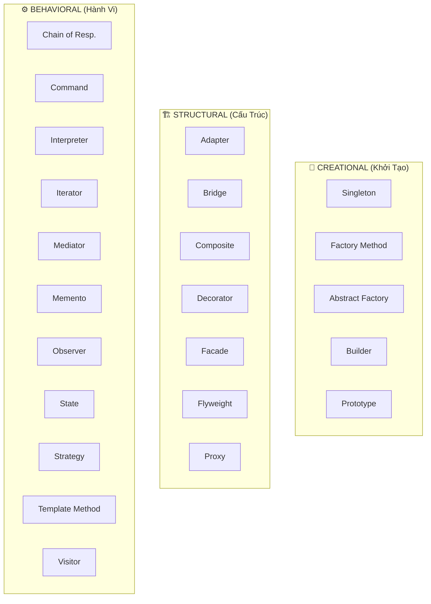
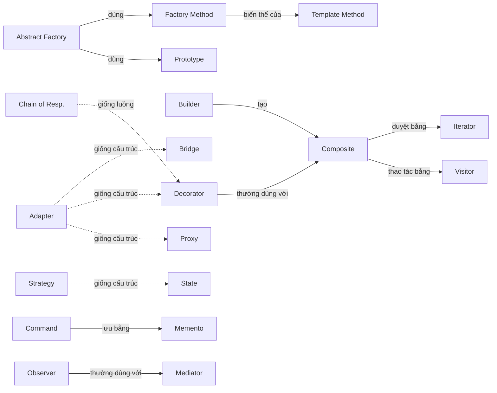

# 🏛️ Gang of Four — 23 Design Patterns: Nghiên Cứu Chuyên Sâu

> **Tài liệu nghiên cứu toàn diện** về 23 mẫu thiết kế kinh điển từ cuốn *"Design Patterns: Elements of Reusable Object-Oriented Software"* (1994) của Erich Gamma, Richard Helm, Ralph Johnson, và John Vlissides.

---

## 📋 Mục Lục

| # | Tài liệu | Nội dung |
|---|----------|----------|
| 1 | [Creational Patterns](./01-creational-patterns.md) | 5 mẫu khởi tạo: Singleton, Factory Method, Abstract Factory, Builder, Prototype |
| 2 | [Structural Patterns](./02-structural-patterns.md) | 7 mẫu cấu trúc: Adapter, Bridge, Composite, Decorator, Facade, Flyweight, Proxy |
| 3 | [Behavioral Patterns](./03-behavioral-patterns.md) | 11 mẫu hành vi: Chain of Responsibility, Command, Interpreter, Iterator, Mediator, Memento, Observer, State, Strategy, Template Method, Visitor |
| 4 | [So Sánh & Phân Biệt](./04-pattern-comparison.md) | Ma trận so sánh, các cặp dễ nhầm lẫn, biến thể |
| 5 | [Kết Hợp Mẫu](./05-pattern-combinations.md) | Chiến lược kết hợp, ví dụ thực tế, anti-patterns |

---

## 🗺️ Bản Đồ Tổng Quan 23 Mẫu

## 🎯 Nguyên Tắc Phân Loại

| Nhóm | Mục đích | Câu hỏi then chốt |
|------|----------|-------------------|
| **Creational** | Kiểm soát **cách tạo** đối tượng | *"Tạo object như thế nào?"* |
| **Structural** | Kiểm soát **cách tổ chức** đối tượng | *"Kết hợp object/class ra sao?"* |
| **Behavioral** | Kiểm soát **cách giao tiếp** giữa đối tượng | *"Object tương tác và phân chia trách nhiệm thế nào?"* |

### Phân loại phụ theo phạm vi

| Scope | Class-based | Object-based |
|-------|------------|--------------|
| **Creational** | Factory Method | Abstract Factory, Builder, Prototype, Singleton |
| **Structural** | Adapter (class) | Adapter (object), Bridge, Composite, Decorator, Facade, Flyweight, Proxy |
| **Behavioral** | Interpreter, Template Method | Chain of Resp., Command, Iterator, Mediator, Memento, Observer, State, Strategy, Visitor |

---

## 📐 Quy Ước Trong Tài Liệu

- **Code mẫu**: Java (ngôn ngữ gốc GoF sử dụng C++/Smalltalk, Java phổ biến hơn cho minh họa)
- **Lược đồ**: Mermaid class diagram
- **Mức độ phức tạp**: ⭐ Đơn giản → ⭐⭐⭐ Phức tạp
- **Tần suất sử dụng**: 🔥 Rất thường → ❄️ Hiếm khi

---

## 🔗 Mối Quan Hệ Giữa Các Mẫu

> **Ghi chú**: Đường nét liền (→) = quan hệ sử dụng/kết hợp trực tiếp. Đường nét đứt (⇢) = tương đồng về cấu trúc hoặc dễ nhầm lẫn.
