# 🧭 Cẩm Nang & Hướng Dẫn Kỹ Thuật Thực Chiến (Engineering Guides)

> Tổng hợp các hướng dẫn chuyên sâu, cẩm nang kiến trúc hệ thống và quy trình kỹ thuật từ nền tảng đến quy mô hàng triệu người dùng.

---

## 🗺️ Bản Đồ Phân Nhóm Guides

```mermaid
graph TD
    Guides["🧭 Engineering Guides"]
    
    Guides --> Scaling["🚀 Scaling & Systems"]
    Guides --> Realtime["⚡ Realtime & WebRTC"]
    Guides --> AI["🤖 AI & Graph Mining"]
    Guides --> RAG["📚 RAG & Vector DB"]
    
    Scaling --> ScalingGuide["System Scaling & Performance Guide<br/>(10K - 1B Users, Latency, Caching, DB)"]
    Scaling --> RustGuide["Rust Zero to Hero Guide<br/>(Memory, Concurrency, Async, Tokio)"]
    
    Realtime --> WebRTC["WebRTC Deep Dive<br/>(Signaling, PeerConnection, Media)"]
    Realtime --> SDP["SDP, ICE, STUN & TURN<br/>(NAT Traversal, Relay Architecture)"]
    Realtime --> CRDT["OT vs CRDT Deep Dive<br/>(Distributed Realtime Collaboration)"]
    
    AI --> AIAgents["AI Agent Frameworks Deep Dive<br/>(LangGraph, CrewAI, AutoGen)"]
    AI --> Neo4j["Social Graph Neo4j GDS Deep Dive<br/>(Graph Analytics & Algorithms)"]
    AI --> Face["Face Analysis Deep Dive<br/>(Facial Recognition & Vector Matching)"]
    AI --> Social["Social Network & Profile Analysis<br/>(Workflows & Ecosystem Integration)"]
    
    RAG --> RAGGuide["RAG Database Selection Guide<br/>(Vector DBs, Indexing, Hybrid Search)"]
    RAG --> RAGImpl["RAG Database Implementation Guide<br/>(Chunking, Embedding, Reranking)"]
    RAG --> RAGEval["RAG & KAG Evaluation Guide<br/>(Faithfulness, Context Precision)"]

    classDef default fill:#1e1e2e,stroke:#3b4252,stroke-width:1px,color:#eceff4;
    classDef highlight fill:#2e3440,stroke:#88c0d0,stroke-width:2px,color:#88c0d0;
    class ScalingGuide,RustGuide,WebRTC,AIAgents,RAGGuide highlight;
```

---

## 1. 🚀 System Engineering & Scaling

Các tài liệu nghiên cứu và cẩm nang thực chiến về hiệu năng, đo lường độ trễ và mở rộng hệ thống:

| Tài Liệu | Trọng Tâm Kiến Trúc | Cấp Độ | Liên Kết |
|---|---|:---:|:---:|
| **System Scaling & Performance Guide** | Phân tích TPS/QPS/RPS/IOPS, phân vị Latency P50-P99.9, kiến trúc qua các mốc 10K → 500K → 1M → 10M → 1B Users, Caching & DB Sharding. | `Nâng Cao` | [Đọc ngay →](./system-scaling-performance-guide) |
| **Rust Zero to Hero Guide** | Lập trình hệ thống hiệu năng cao, Ownership/Borrowing, Concurrency không data-race, Async runtime Tokio. | `Từ Đầu → Pro` | [Đọc ngay →](./rust_zero_to_hero_guide) |

---

## 2. ⚡ Realtime Architecture & WebRTC

Hạ tầng truyền thông âm thanh/hình ảnh thời gian thực, vượt tường lửa mạng và đồng bộ trạng thái phân tán:

| Tài Liệu | Trọng Tâm Kiến Trúc | Cấp Độ | Liên Kết |
|---|---|:---:|:---:|
| **WebRTC Deep Dive** | Kiến trúc WebRTC, Signaling flow, PeerConnection API, MediaStream, DataChannel. | `Chuyên Sâu` | [Đọc ngay →](./realtime/webrtc_deep_dive) |
| **SDP, ICE, STUN & TURN Architecture** | Giao thức truyền thông Session Description Protocol, ICE Candidate gathering, cơ chế NAT Traversal và TURN relay. | `Chuyên Sâu` | [Đọc ngay →](./realtime/sdp_ice_stun_turn_architectures) |
| **OT vs CRDT Deep Dive** | Thuật toán giải quyết xung đột trong văn bản cộng tác thời gian thực: Operational Transformation vs Conflict-free Replicated Data Types. | `Nâng Cao` | [Đọc ngay →](./realtime/ot_crdt_deep_dive) |
| **Realtime RAG Database Guide** | Tích hợp cơ sở dữ liệu Vector phục vụ truy xuất thông tin ngữ nghĩa thời gian thực. | `Thực Chiến` | [Đọc ngay →](./realtime/rag_database_guide) |

---

## 3. 🤖 AI Research, Graph Mining & Profile Analysis

Nghiên cứu các framework Multi-Agent, phân tích mạng đồ thị xã hội và nhận diện thực thể:

| Tài Liệu | Trọng Tâm Kiến Trúc | Cấp Độ | Liên Kết |
|---|---|:---:|:---:|
| **AI Agent Frameworks Deep Dive** | So sánh chi tiết LangGraph, CrewAI, AutoGen; cơ chế Memory, Tool Calling, Multi-Agent Orchestration. | `Chuyên Sâu` | [Đọc ngay →](./ai-research/ai_agent_frameworks_deep_dive) |
| **Social Graph Neo4j GDS Deep Dive** | Ứng dụng Neo4j Graph Data Science trong phân tích đồ thị: Centrality, Community Detection, Node Embedding. | `Nâng Cao` | [Đọc ngay →](./ai-research/social_graph_neo4j_gds_deep_dive) |
| **Face Analysis Deep Dive** | Pipeline nhận diện khuôn mặt, trích xuất đặc trưng vector và đối sánh embedding. | `Thực Chiến` | [Đọc ngay →](./ai-research/face_analysis_deep_dive) |
| **Ecosystem Integration Profile Analysis** | Tích hợp hệ sinh thái phân tích dữ liệu đa nguồn và định danh người dùng. | `Thực Chiến` | [Đọc ngay →](./ai-research/ecosystem_integration_profile_analysis) |
| **Facebook Friends Analysis Workflow** | Quy trình thu thập, tiền xử lý và trực quan hóa mạng lưới liên kết bạn bè mạng xã hội. | `Thực Chiến` | [Đọc ngay →](./facebook_friends_analysis_workflow) |
| **Fake Account Detection Literature** | Tổng quan tài liệu nghiên cứu học thuật về nhận diện bot và tài khoản mạng xã hội giả mạo. | `Nghiên Cứu` | [Đọc ngay →](./sota_literature_review_fake_account_detection) |

---

## 4. 📚 Database & RAG Systems

Quy trình thiết kế, triển khai và đánh giá độ chính xác của hệ thống RAG (Retrieval-Augmented Generation):

| Tài Liệu | Trọng Tâm Kiến Trúc | Cấp Độ | Liên Kết |
|---|---|:---:|:---:|
| **RAG Database Selection Guide** | Tiêu chí lựa chọn Vector Database (Pinecone, Qdrant, Milvus, pgvector, Weaviate), Hybrid Search, Indexing HNSW/IVF. | `Toàn Diện` | [Đọc ngay →](./rag_database_guide) |
| **RAG Database Implementation Guide** | Hướng dẫn xây dựng pipeline RAG hoàn chỉnh: Chunking, Embedding, Semantic Cache, Reranking. | `Thực Chiến` | [Đọc ngay →](./rag_database_implementation_guide) |
| **RAG & KAG Evaluation Guide** | Khung đánh giá chất lượng RAG/KAG: Faithfulness, Answer Relevance, Context Precision, Ragas framework. | `Nâng Cao` | [Đọc ngay →](./rag_kag_evaluation_guide) |
