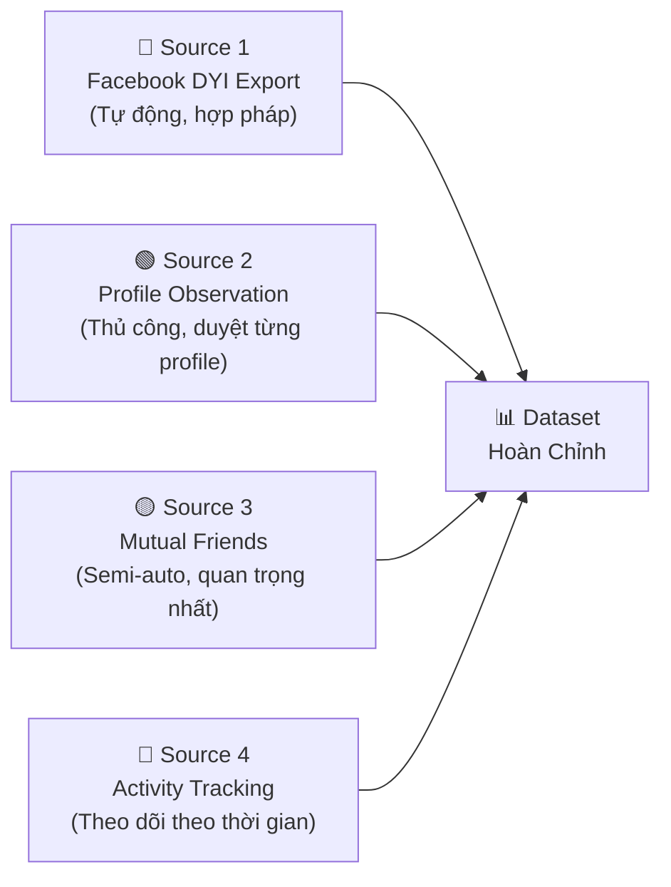
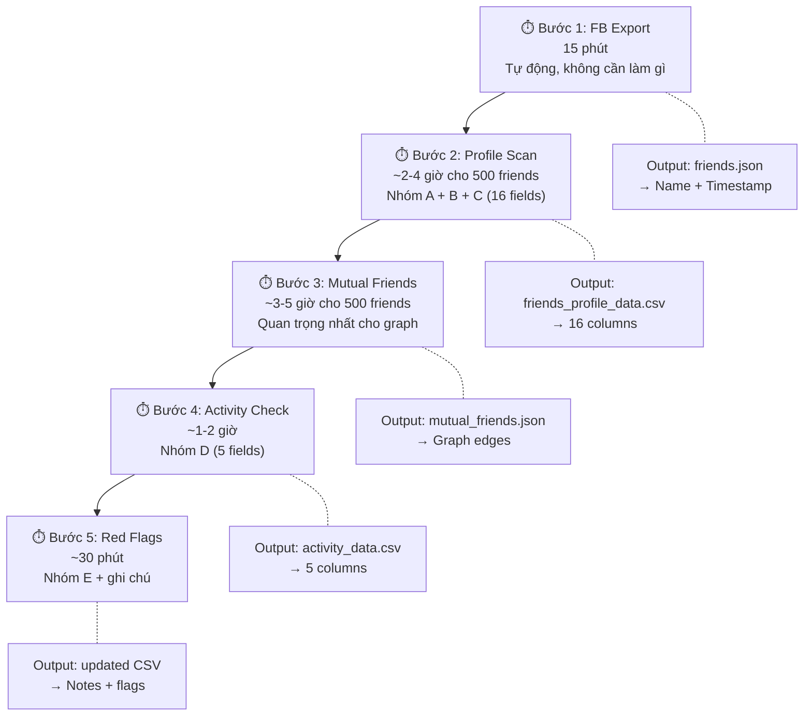

# 📋 Hướng Dẫn Thu Thập Dữ Liệu Bạn Bè Facebook Cho Nghiên Cứu

> **Mục tiêu**: Xác định chính xác data cần crawl, format lưu trữ, và thứ tự ưu tiên — dựa trên các papers SOTA đã nghiên cứu.

---

## 1. Tổng Quan: 4 Nguồn Dữ Liệu



---

## 2. Source 1: Facebook DYI Export (Bắt Buộc — Làm Đầu Tiên)

### Cách lấy
```
Facebook → Settings → Privacy → Download Your Information
  → Format: JSON
  → Date Range: All time
  → Media Quality: Low
  → Chọn: "Friends and Followers"
  → Create File → Đợi email → Download ZIP
```

### Data nhận được

| Field | Ví Dụ | Dùng Cho |
|-------|-------|----------|
| `name` | "Nguyễn Văn A" | Name pattern analysis |
| `timestamp` | 1609459200 (Unix) | Timeline analysis, phát hiện bulk requests |

### Giá trị phân tích

Chỉ 2 fields nhưng **rất giá trị** vì:
1. **Name pattern** → Phát hiện tên random, có số, ký tự lạ
2. **Timestamp clustering** → Phát hiện đợt kết bạn bất thường (20 requests/ngày = đáng nghi)

---

## 3. Source 2: Profile Observation (Ưu Tiên Cao)

Duyệt profile từng friend và ghi lại thông tin. Đây là **data quan trọng nhất** mà FB Export không có.

### 3.1 Schema Thu Thập — 23 Fields

```
📁 File: friends_profile_data.csv
```

#### Nhóm A: Thông Tin Cơ Bản (5 fields)

| # | Field | Kiểu | Cách Lấy | Ví Dụ |
|---|-------|------|----------|-------|
| 1 | `fb_id` | string | URL profile: facebook.com/`{id}` | "nguyen.van.a.123" |
| 2 | `display_name` | string | Tên hiển thị | "Nguyễn Văn A" |
| 3 | `profile_url` | string | Copy URL | "https://facebook.com/nguyen.van.a.123" |
| 4 | `gender` | enum | Nhìn profile | M / F / Other / Unknown |
| 5 | `location` | string | Intro section | "Hà Nội, Vietnam" |

#### Nhóm B: Profile Completeness (6 fields) — ⭐ Quan trọng cho Fake Detection

| # | Field | Kiểu | Cách Lấy | Ý Nghĩa |
|---|-------|------|----------|----------|
| 6 | `has_profile_photo` | 0/1 | Nhìn avatar | Fake thường dùng ảnh mặc định |
| 7 | `is_real_photo` | 0/1/2 | Đánh giá thủ công: 0=default, 1=ảnh thật, 2=ảnh stock/AI | Ảnh stock → đáng nghi |
| 8 | `has_cover_photo` | 0/1 | Nhìn cover | Fake thường không có cover |
| 9 | `bio_length` | int | Đếm ký tự phần Intro | 0 = không có bio → đáng nghi |
| 10 | `has_work_info` | 0/1 | Phần Work | Fake thường bỏ trống |
| 11 | `has_education` | 0/1 | Phần Education | Fake thường bỏ trống |

#### Nhóm C: Social Metrics (5 fields) — ⭐⭐ Quan trọng nhất cho Graph Analysis

| # | Field | Kiểu | Cách Lấy | Ý Nghĩa |
|---|-------|------|----------|----------|
| 12 | `friend_count` | int | Profile → Friends tab → số hiển thị | Quá nhiều (>4000) hoặc quá ít (<20) |
| 13 | `mutual_friends_count` | int | Profile → "X mutual friends" | ⭐ **Signal mạnh nhất**: <2 mutual = rất đáng nghi |
| 14 | `follower_count` | int | Profile (nếu hiển thị) | Ratio follower/friend bất thường |
| 15 | `groups_count` | int | Profile → Groups (nếu public) | Hoạt động cộng đồng |
| 16 | `mutual_friends_names` | list | Click "mutual friends" → ghi tên | ⭐⭐ **Cực kỳ quan trọng cho graph** |

#### Nhóm D: Activity & Content (5 fields) — ⭐ Quan trọng cho Activity Scoring

| # | Field | Kiểu | Cách Lấy | Ý Nghĩa |
|---|-------|------|----------|----------|
| 17 | `posts_visible` | int | Scroll timeline, đếm ~30 ngày gần nhất | 0 posts = ghost/fake |
| 18 | `photos_count` | int | Photos tab → số ảnh | <3 ảnh → đáng nghi |
| 19 | `last_post_days_ago` | int | Xem bài gần nhất, ước tính ngày | >180 ngày = inactive |
| 20 | `content_type` | enum | Nhìn loại content | original/shared/mixed |
| 21 | `interaction_with_me` | 0-10 | Tự đánh giá: bao lâu tương tác? | 0=chưa bao giờ, 10=hàng ngày |

#### Nhóm E: Red Flags (2 fields)

| # | Field | Kiểu | Mô Tả |
|---|-------|------|--------|
| 22 | `account_age_estimate` | enum | new (<6m) / medium (6m-2y) / old (>2y) |
| 23 | `notes` | string | Ghi chú đặc biệt: "ảnh AI", "spam", "không biết ai" |

### 3.2 Template CSV

```csv
fb_id,display_name,profile_url,gender,location,has_profile_photo,is_real_photo,has_cover_photo,bio_length,has_work_info,has_education,friend_count,mutual_friends_count,follower_count,groups_count,mutual_friends_names,posts_visible,photos_count,last_post_days_ago,content_type,interaction_with_me,account_age_estimate,notes
nguyen.van.a,Nguyễn Văn A,https://facebook.com/nguyen.van.a,M,Hà Nội,1,1,1,120,1,1,450,35,,2,"Trần B;Lê C;Phạm D",8,45,2,mixed,7,old,Bạn đại học
john.xyz123,John XYZ 123,https://facebook.com/john.xyz123,M,,1,2,0,0,0,0,5000,0,,,"",,0,3,365,,shared,0,new,Ảnh stock không rõ nguồn gốc
```

---

## 4. Source 3: Mutual Friends Data (Quan Trọng Nhất Cho Graph)

### 4.1 Tại sao mutual friends quan trọng?

Đây là **dữ liệu duy nhất** giúp bạn xây dựng graph:

```
Không có mutual friends data:
    YOU ─── A
    YOU ─── B
    YOU ─── C
    (Chỉ biết ai kết bạn với bạn, không biết A có kết bạn với B không)

CÓ mutual friends data:
    YOU ─── A ─── B
     │      │   ╱
     └── C ─┘  ╱
          └───╱
    (Biết cấu trúc THỰC SỰ → community detection, anomaly detection)
```

### 4.2 Cách thu thập

**Phương pháp: Duyệt từng friend → Click "Mutual Friends" → Ghi tên**

```
📁 File: mutual_friends.json

Format:
{
  "Nguyễn Văn A": ["Trần B", "Lê C", "Phạm D", "Hoàng E"],
  "Trần B": ["Nguyễn Văn A", "Phạm D"],
  "John XYZ 123": [],
  ...
}
```

### 4.3 Chiến lược thu thập hiệu quả

Nếu bạn có **500 friends**, kiểm tra tất cả = 500 lần click. Tiết kiệm thời gian:

```
Ưu tiên 1: Friends có mutual_friends_count > 0  (có bạn chung)
Ưu tiên 2: Friends mới kết bạn gần đây (<6 tháng)
Ưu tiên 3: Friends đáng nghi (ít thông tin profile)
Bỏ qua:    Friends đã biết rõ (gia đình, bạn thân)
```

### 4.4 Dữ liệu bổ sung từ Mutual Friends

Khi nhìn danh sách mutual friends, ghi thêm:
- **Tổng số mutual friends** (con số hiển thị trên profile)
- **Tên cụ thể** (quan trọng cho graph)
- **Nhận xét**: mutual friends có liên quan nhau không?

---

## 5. Source 4: Activity Tracking (Nâng Cao — Theo Thời Gian)

Nếu bạn muốn phân tích **hành vi theo thời gian**, cần observe nhiều lần:

| Data Point | Cách Thu Thập | Tần Suất |
|-----------|---------------|----------|
| Post frequency | Đếm posts mới mỗi tuần | Weekly, 4 tuần |
| Reaction patterns | Ai like/comment bài bạn? | Mỗi khi post bài |
| Online status | Thấy "Active now" lúc nào? | Ghi chú random |
| Profile changes | Name, photo thay đổi? | Monthly |
| New friends | Friend count tăng/giảm? | Monthly |

---

## 6. Thứ Tự Ưu Tiên Thu Thập



### Thời gian ước tính

| Bước | Friends = 200 | Friends = 500 | Friends = 1000 |
|------|--------------|--------------|----------------|
| FB Export | 15 phút | 15 phút | 15 phút |
| Profile Scan | 1-2 giờ | 2-4 giờ | 4-8 giờ |
| Mutual Friends | 1.5-3 giờ | 3-5 giờ | 6-10 giờ |
| Activity Check | 30-60 phút | 1-2 giờ | 2-4 giờ |
| **Tổng** | **~4-6 giờ** | **~7-12 giờ** | **~13-23 giờ** |

> **Mẹo**: Không cần làm hết 1 lúc. Chia ra mỗi ngày 50-100 friends.

---

## 7. Cấu Trúc Files Output

```
research_docs/
├── data/
│   ├── raw/
│   │   ├── facebook-export/          ← Giải nén ZIP từ Facebook
│   │   │   └── friends_and_followers/
│   │   │       └── friends.json
│   │   ├── friends_profile_data.csv  ← Thu thập thủ công (23 fields)
│   │   ├── mutual_friends.json       ← Mutual friends mapping
│   │   └── activity_tracking.csv     ← Activity observations
│   ├── processed/
│   │   ├── friends_enriched.csv      ← Merged từ tất cả sources
│   │   ├── graph_edges.csv           ← Edge list cho NetworkX
│   │   └── features_matrix.csv       ← Feature matrix cho ML
│   └── results/
│       ├── fake_scores.csv           ← Kết quả scoring
│       ├── communities.json          ← Community detection output
│       └── analysis_report.md        ← Báo cáo phân tích
```

---

## 8. Minimum Viable Dataset (Bắt Đầu Nhanh)

Nếu bạn muốn bắt đầu **ngay lập tức** với lượng data tối thiểu:

### MVP: Chỉ cần 3 files

| File | Fields tối thiểu | Thời gian |
|------|-----------------|-----------|
| `friends.json` | name, timestamp | 15 phút (tự động) |
| `friends_basic.csv` | name, mutual_friends_count, has_profile_photo, friend_count, interaction_with_me | 1-2 giờ |
| `mutual_friends.json` | {name: [mutual_names]} — **chỉ cho friends đáng nghi** | 1 giờ |

### MVP cho phân tích:

```python
# Với chỉ 3 files trên, bạn đã có thể:

# 1. Name pattern analysis → detect tên bất thường
# 2. Timeline burst detection → phát hiện kết bạn hàng loạt
# 3. Fake score (5 features) → xếp hạng đáng nghi
# 4. Partial graph → community detection cho nhóm đáng nghi
# 5. Isolation Forest → anomaly detection
```

---

## 9. Lưu Ý Quan Trọng

> [!WARNING]
> ### Về Pháp Lý & Đạo Đức
> - **KHÔNG** sử dụng scraping tools tự động trên Facebook (vi phạm ToS)
> - **KHÔNG** thu thập data người khác mà không có lý do chính đáng
> - Dữ liệu thu thập **chỉ phục vụ nghiên cứu cá nhân** (personal research)
> - Facebook DYI Export là **hoàn toàn hợp pháp** (data của chính bạn)
> - Profile observation (nhìn public info) cũng chấp nhận được cho research

> [!TIP]
> ### Mẹo Thu Thập Hiệu Quả
> 1. **Dùng Google Sheets** làm bảng thu thập — dễ filter/sort/share
> 2. **Chia đợt**: 50-100 friends/ngày, không cần làm hết 1 lần
> 3. **Ưu tiên đáng nghi trước**: Friends bạn không nhớ, tên lạ, mới kết bạn
> 4. **Ghi chú ngay**: Cột `notes` rất quý — sau này sẽ là pseudo-labels
> 5. **Backup thường xuyên**: Export Google Sheets → CSV → commit git

---

## 10. Mapping Data → Phương Pháp Phân Tích

| Data bạn thu thập | Phương pháp áp dụng | Paper tham khảo | Tool |
|-------------------|---------------------|----------------|------|
| Name + timestamp | Name pattern + burst detection | Instagram Fake [1910.03090] | Polars, regex |
| Profile completeness | Fake scoring (weighted) | MultiCred [2309.13305] | Polars |
| mutual_friends_count | Graph density + anomaly | SYBILGAT [2409.08631] | NetworkX |
| mutual_friends_names | Community detection | Graph Clustering Survey [2407.09055] | NetworkX (Louvain) |
| friend_count | Distribution anomaly | TwiBot-22 [2206.04564] | Isolation Forest |
| Activity features | Activity scoring | Digital Cloning [2401.12509] | scikit-learn |
| Tất cả features | ML classification | Survey [2507.06541] | scikit-learn, DBSCAN |
