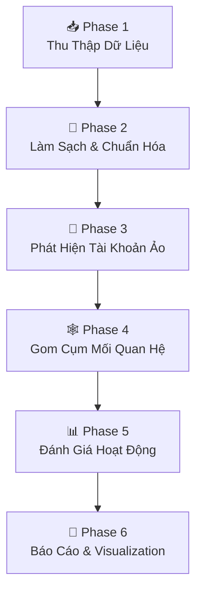

# 🔍 Quy Trình Phân Tích Danh Sách Bạn Bè Facebook

> **Mục tiêu**: Trích xuất → Phát hiện tài khoản ảo → Gom cụm mối quan hệ → Đánh giá hoạt động
>
> **Tools sử dụng**: Python (.venv), networkx, matplotlib, seaborn, scikit-learn, polars

---

## 📋 Tổng Quan Pipeline



---

## Phase 1: 📥 Thu Thập Dữ Liệu

### 1.1 Export từ Facebook (Download Your Information)

Facebook cho phép bạn tải dữ liệu cá nhân:

1. Vào **Settings → Privacy → Download Your Information**
   - URL: `https://www.facebook.com/dyi`
2. Chọn **Format**: `JSON` (quan trọng — không chọn HTML)
3. Chọn **Media Quality**: Low (không cần ảnh)
4. Tick mục **Friends and Followers** → **Create File**
5. Đợi Facebook gửi email → Download ZIP

### 1.2 Cấu Trúc File JSON Facebook Export

```
facebook-data/
├── friends_and_followers/
│   ├── friends.json              ← Danh sách bạn bè
│   ├── removed_friends.json      ← Bạn đã hủy
│   ├── friend_requests_sent.json
│   ├── friend_requests_received.json
│   └── rejected_requests.json
```

### 1.3 Cấu Trúc `friends.json`

```json
{
  "friends_v2": [
    {
      "name": "Nguyễn Văn A",
      "timestamp": 1609459200
    },
    {
      "name": "John Smith",
      "timestamp": 1614556800
    }
  ]
}
```

> [!WARNING]
> Facebook JSON export chỉ có **tên** và **timestamp kết bạn**.
> Để có thêm dữ liệu (profile URL, mutual friends, activity), cần bổ sung bằng các cách ở mục 1.4.

### 1.4 Bổ Sung Dữ Liệu (Nâng Cao)

Để phân tích sâu hơn, bạn cần bổ sung thêm thông tin cho mỗi tài khoản:

**Cách 1: Manual enrichment (An toàn, tuân thủ ToS)**
- Tạo file CSV bổ sung với các cột dưới đây
- Ghi chú thủ công từ quan sát

**Cách 2: Facebook Graph API (Cần App approval)**
```bash
# Lấy danh sách bạn bè (cần user_friends permission)
curl "https://graph.facebook.com/v21.0/me/friends?access_token={TOKEN}"
```

> [!NOTE]
> Graph API hiện chỉ trả về bạn bè **cùng dùng app** (hạn chế từ 2018).

### 1.5 Cấu Trúc Dữ Liệu Đề Xuất (CSV/JSON)

Tạo file `friends_enriched.csv` với schema sau:

```csv
id,name,profile_url,friend_since,mutual_friends_count,total_friends,posts_last_30d,photos_count,profile_photo,cover_photo,bio_length,work_info,education_info,location,joined_groups,common_groups,interaction_score,is_verified,account_age_days,name_pattern
```

| Cột | Mô Tả | Nguồn | Dùng Cho |
|-----|--------|-------|----------|
| `name` | Tên hiển thị | FB Export | Fake detection |
| `friend_since` | Ngày kết bạn (timestamp) | FB Export | Timeline analysis |
| `mutual_friends_count` | Số bạn chung | Manual/API | Clustering |
| `total_friends` | Tổng bạn bè của họ | Manual | Fake detection |
| `posts_last_30d` | Số bài đăng 30 ngày gần | Manual | Activity scoring |
| `photos_count` | Số ảnh | Manual | Fake detection |
| `profile_photo` | Có ảnh profile? (0/1) | Manual | Fake detection |
| `cover_photo` | Có ảnh cover? (0/1) | Manual | Fake detection |
| `bio_length` | Độ dài bio (chars) | Manual | Fake detection |
| `interaction_score` | Điểm tương tác (0-10) | Manual | Relationship |
| `account_age_days` | Tuổi tài khoản | Manual | Fake detection |
| `name_pattern` | Loại tên (vn/en/mixed/random) | Script | Fake detection |

---

## Phase 2: 🧹 Làm Sạch & Chuẩn Hóa

### 2.1 Load và Parse Facebook Export

```python
#!/usr/bin/env python3
"""Phase 2: Load & Clean Facebook Friends Data"""

import json
import polars as pl
from datetime import datetime
from pathlib import Path

# === Load Facebook JSON Export ===
def load_fb_export(json_path: str) -> pl.DataFrame:
    """Load friends.json từ Facebook export."""
    with open(json_path, 'r', encoding='utf-8') as f:
        data = json.load(f)

    friends = data.get('friends_v2', [])

    records = []
    for friend in friends:
        # Facebook encode tên Unicode dạng escaped
        name = friend['name'].encode('latin-1').decode('utf-8', errors='replace')
        timestamp = friend.get('timestamp', 0)
        records.append({
            'name': name,
            'friend_since': datetime.fromtimestamp(timestamp),
            'friend_since_ts': timestamp,
        })

    df = pl.DataFrame(records)
    print(f"Loaded {len(df)} friends from Facebook export")
    return df

# === Enrich with manual CSV (nếu có) ===
def enrich_data(fb_df: pl.DataFrame, csv_path: str = None) -> pl.DataFrame:
    """Kết hợp FB export với dữ liệu enriched."""
    if csv_path and Path(csv_path).exists():
        enriched = pl.read_csv(csv_path)
        df = fb_df.join(enriched, on='name', how='left')
    else:
        # Tạo cột mặc định nếu chưa có enriched data
        df = fb_df.with_columns([
            pl.lit(None).cast(pl.Int32).alias('mutual_friends_count'),
            pl.lit(None).cast(pl.Int32).alias('total_friends'),
            pl.lit(None).cast(pl.Int32).alias('posts_last_30d'),
            pl.lit(None).cast(pl.Int32).alias('photos_count'),
            pl.lit(1).alias('profile_photo'),
            pl.lit(1).alias('cover_photo'),
            pl.lit(None).cast(pl.Int32).alias('bio_length'),
            pl.lit(5).alias('interaction_score'),
            pl.lit(None).cast(pl.Int32).alias('account_age_days'),
        ])
    return df

# === USAGE ===
if __name__ == '__main__':
    # Đường dẫn đến file Facebook export
    fb_path = 'facebook-data/friends_and_followers/friends.json'
    csv_path = 'friends_enriched.csv'  # Optional

    df = load_fb_export(fb_path)
    df = enrich_data(df, csv_path)

    # Quick stats
    print(df.describe())
    print(f"\nFriend since range: {df['friend_since'].min()} → {df['friend_since'].max()}")
```

### 2.2 Phân Tích Tên (Name Pattern Detection)

```python
import re
import unicodedata

def analyze_name(name: str) -> dict:
    """Phân tích pattern tên để phát hiện tên fake."""
    result = {
        'name_length': len(name),
        'word_count': len(name.split()),
        'has_numbers': bool(re.search(r'\d', name)),
        'has_special_chars': bool(re.search(r'[^\w\s\.\-]', name, re.UNICODE)),
        'all_caps': name == name.upper() and len(name) > 3,
        'mixed_scripts': False,
        'repeated_chars': bool(re.search(r'(.)\1{2,}', name)),  # aaa, bbb
        'name_pattern': 'normal',
    }

    # Phát hiện mixed scripts (VD: "Nguyễn John Smith 田中")
    scripts = set()
    for char in name:
        if char.isalpha():
            cat = unicodedata.category(char)
            script = unicodedata.name(char, '').split()[0] if unicodedata.name(char, '') else 'UNKNOWN'
            scripts.add(script)
    result['mixed_scripts'] = len(scripts) > 2

    # Classify name pattern
    if result['has_numbers'] or result['repeated_chars']:
        result['name_pattern'] = 'suspicious'
    elif result['word_count'] == 1:
        result['name_pattern'] = 'single_word'
    elif result['all_caps']:
        result['name_pattern'] = 'all_caps'
    elif result['mixed_scripts']:
        result['name_pattern'] = 'mixed_script'

    return result

# Apply trên DataFrame
def add_name_features(df: pl.DataFrame) -> pl.DataFrame:
    """Thêm features từ phân tích tên."""
    name_features = [analyze_name(name) for name in df['name'].to_list()]
    features_df = pl.DataFrame(name_features)
    return pl.concat([df, features_df], how='horizontal')
```

---

## Phase 3: 🤖 Phát Hiện Tài Khoản Ảo (Fake Account Detection)

### 3.1 Feature Engineering

```python
def compute_fake_score(df: pl.DataFrame) -> pl.DataFrame:
    """
    Tính điểm khả năng fake cho mỗi tài khoản.
    Score 0-100: càng cao càng khả nghi.
    """
    df = df.with_columns([
        # === SIGNAL 1: Profile completeness (0-25 điểm) ===
        (
            pl.when(pl.col('profile_photo') == 0).then(10).otherwise(0) +
            pl.when(pl.col('cover_photo') == 0).then(5).otherwise(0) +
            pl.when(pl.col('bio_length').is_null() | (pl.col('bio_length') == 0))
              .then(10).otherwise(0)
        ).alias('score_profile'),

        # === SIGNAL 2: Name pattern (0-20 điểm) ===
        (
            pl.when(pl.col('name_pattern') == 'suspicious').then(20)
              .when(pl.col('name_pattern') == 'single_word').then(10)
              .when(pl.col('name_pattern') == 'all_caps').then(8)
              .when(pl.col('name_pattern') == 'mixed_script').then(5)
              .otherwise(0)
        ).alias('score_name'),

        # === SIGNAL 3: Activity level (0-25 điểm) ===
        (
            pl.when(pl.col('posts_last_30d').is_null() | (pl.col('posts_last_30d') == 0))
              .then(15).otherwise(0) +
            pl.when(pl.col('photos_count').is_null() | (pl.col('photos_count') < 3))
              .then(10).otherwise(0)
        ).alias('score_activity'),

        # === SIGNAL 4: Social network (0-20 điểm) ===
        (
            pl.when(pl.col('mutual_friends_count').is_null() | (pl.col('mutual_friends_count') < 2))
              .then(15).otherwise(
                pl.when(pl.col('mutual_friends_count') < 5).then(5).otherwise(0)
              ) +
            pl.when(pl.col('total_friends').is_not_null() & (pl.col('total_friends') > 4000))
              .then(5).otherwise(0)
        ).alias('score_social'),

        # === SIGNAL 5: Account age vs friend_since (0-10 điểm) ===
        (
            pl.when(pl.col('account_age_days').is_not_null() & (pl.col('account_age_days') < 90))
              .then(10)
              .when(pl.col('account_age_days').is_not_null() & (pl.col('account_age_days') < 180))
              .then(5)
              .otherwise(0)
        ).alias('score_age'),
    ])

    # Tổng điểm fake
    df = df.with_columns(
        (
            pl.col('score_profile') +
            pl.col('score_name') +
            pl.col('score_activity') +
            pl.col('score_social') +
            pl.col('score_age')
        ).alias('fake_score')
    )

    # Phân loại
    df = df.with_columns(
        pl.when(pl.col('fake_score') >= 60).then(pl.lit('🔴 High Risk'))
          .when(pl.col('fake_score') >= 35).then(pl.lit('🟡 Medium Risk'))
          .when(pl.col('fake_score') >= 15).then(pl.lit('🟢 Low Risk'))
          .otherwise(pl.lit('✅ Normal'))
          .alias('risk_level')
    )

    return df
```

### 3.2 Bảng Tiêu Chí Phát Hiện Fake

| Signal | Trọng Số | Mô Tả | Dấu Hiệu Fake |
|--------|----------|--------|----------------|
| **Profile completeness** | 25% | Ảnh profile, cover, bio | Thiếu ảnh, bio rỗng |
| **Name pattern** | 20% | Tên có số, ký tự lạ, mixed script | "user12345", "AAAA BBB" |
| **Activity level** | 25% | Bài đăng, ảnh, comments | 0 posts/30 ngày, <3 ảnh |
| **Social network** | 20% | Bạn chung, tổng friends | <2 bạn chung, >4000 friends |
| **Account age** | 10% | Tuổi tài khoản | Tạo <90 ngày |

### 3.3 Machine Learning Approach (Nâng Cao)

```python
from sklearn.ensemble import IsolationForest, RandomForestClassifier
from sklearn.preprocessing import StandardScaler
import numpy as np

def detect_anomalies_ml(df: pl.DataFrame) -> pl.DataFrame:
    """
    Dùng Isolation Forest để phát hiện tài khoản bất thường.
    Không cần labeled data — unsupervised anomaly detection.
    """
    # Chọn features số
    feature_cols = [
        'mutual_friends_count', 'total_friends', 'posts_last_30d',
        'photos_count', 'profile_photo', 'cover_photo', 'bio_length',
        'account_age_days', 'name_length', 'word_count',
    ]

    # Lọc cột tồn tại và fill null
    available = [c for c in feature_cols if c in df.columns]
    X = df.select(available).fill_null(0).to_numpy()

    # Scale features
    scaler = StandardScaler()
    X_scaled = scaler.fit_transform(X)

    # Isolation Forest
    iso_forest = IsolationForest(
        contamination=0.1,  # Giả sử ~10% fake
        random_state=42,
        n_estimators=100
    )
    predictions = iso_forest.fit_predict(X_scaled)
    scores = iso_forest.decision_function(X_scaled)

    # -1 = anomaly, 1 = normal
    df = df.with_columns([
        pl.Series('ml_is_anomaly', predictions == -1),
        pl.Series('ml_anomaly_score', -scores),  # Negate: higher = more anomalous
    ])

    return df
```

---

## Phase 4: 🕸️ Gom Cụm Mối Quan Hệ (Relationship Clustering)

### 4.1 Xây Dựng Social Graph

```python
import networkx as nx
from collections import defaultdict

def build_social_graph(df: pl.DataFrame, mutual_friends_data: dict = None) -> nx.Graph:
    """
    Xây dựng graph mối quan hệ.

    mutual_friends_data format:
    {
        "Nguyễn A": ["Trần B", "Lê C"],
        "Trần B": ["Nguyễn A", "Phạm D"],
        ...
    }
    """
    G = nx.Graph()

    # Thêm bạn bè là nodes
    for row in df.iter_rows(named=True):
        G.add_node(row['name'], **{
            'friend_since': str(row.get('friend_since', '')),
            'fake_score': row.get('fake_score', 0),
            'risk_level': row.get('risk_level', 'unknown'),
            'mutual_friends': row.get('mutual_friends_count', 0),
        })

    # Thêm edges dựa trên bạn chung
    if mutual_friends_data:
        for person, mutuals in mutual_friends_data.items():
            for mutual in mutuals:
                if G.has_node(person) and G.has_node(mutual):
                    G.add_edge(person, mutual, weight=1)

    # Thêm "ME" node ở trung tâm
    G.add_node('ME', fake_score=0, risk_level='self')
    for node in list(G.nodes):
        if node != 'ME':
            G.add_edge('ME', node, weight=0.5)

    print(f"Graph: {G.number_of_nodes()} nodes, {G.number_of_edges()} edges")
    return G

def cluster_communities(G: nx.Graph) -> dict:
    """
    Phát hiện cộng đồng/nhóm trong mạng lưới bạn bè.
    """
    # Loại bỏ node ME để clustering chính xác
    G_no_me = G.copy()
    G_no_me.remove_node('ME')

    # === Method 1: Louvain Community Detection ===
    try:
        communities = nx.community.louvain_communities(G_no_me, seed=42)
        print(f"Louvain found {len(communities)} communities")
    except:
        # Fallback: Label Propagation
        communities = list(nx.community.label_propagation_communities(G_no_me))
        print(f"Label Propagation found {len(communities)} communities")

    # Assign community labels
    community_map = {}
    for i, community in enumerate(communities):
        for node in community:
            community_map[node] = f"Group_{i+1}"

    # === Phân tích từng community ===
    results = {}
    for i, community in enumerate(communities):
        group_name = f"Group_{i+1}"
        members = list(community)
        fake_scores = [G.nodes[m].get('fake_score', 0) for m in members]

        results[group_name] = {
            'size': len(members),
            'members': members,
            'avg_fake_score': sum(fake_scores) / len(fake_scores) if fake_scores else 0,
            'high_risk_count': sum(1 for s in fake_scores if s >= 60),
        }

    return results, community_map
```

### 4.2 Gom Cụm Theo Thời Gian Kết Bạn

```python
def cluster_by_friend_timeline(df: pl.DataFrame) -> pl.DataFrame:
    """
    Phát hiện các đợt kết bạn bất thường (bulk friend requests).
    Dấu hiệu: Nhiều accounts kết bạn trong cùng 1 khoảng thời gian ngắn.
    """
    # Sắp xếp theo thời gian
    df = df.sort('friend_since')

    # Tính khoảng cách giữa các lần kết bạn liên tiếp
    df = df.with_columns(
        pl.col('friend_since').diff().dt.total_hours().alias('hours_since_prev')
    )

    # Phát hiện burst: >5 friend requests trong 24h
    df = df.with_columns(
        pl.col('friend_since')
          .dt.truncate('1d')
          .alias('friend_date')
    )

    daily_counts = df.group_by('friend_date').agg(
        pl.count().alias('friends_added_that_day')
    )

    df = df.join(daily_counts, on='friend_date', how='left')

    # Flag burst days
    df = df.with_columns(
        pl.when(pl.col('friends_added_that_day') > 5)
          .then(pl.lit('⚡ Burst'))
          .otherwise(pl.lit('Normal'))
          .alias('add_pattern')
    )

    return df
```

### 4.3 Gom Cụm Theo Đặc Điểm Tương Đồng

```python
from sklearn.cluster import DBSCAN, KMeans
from sklearn.preprocessing import StandardScaler

def cluster_by_features(df: pl.DataFrame, n_clusters: int = 5) -> pl.DataFrame:
    """
    Gom cụm accounts có đặc điểm tương tự nhau.
    → Phát hiện nhóm accounts fake có cùng pattern.
    """
    feature_cols = [
        'fake_score', 'mutual_friends_count', 'account_age_days',
        'posts_last_30d', 'photos_count',
    ]
    available = [c for c in feature_cols if c in df.columns]
    X = df.select(available).fill_null(0).to_numpy()

    scaler = StandardScaler()
    X_scaled = scaler.fit_transform(X)

    # DBSCAN: Tự phát hiện số cluster, tìm outliers
    dbscan = DBSCAN(eps=0.8, min_samples=3)
    labels = dbscan.fit_predict(X_scaled)

    df = df.with_columns(
        pl.Series('cluster_id', labels).cast(pl.Utf8)
    )

    # Cluster -1 = noise/outliers → đáng nghi
    df = df.with_columns(
        pl.when(pl.col('cluster_id') == '-1')
          .then(pl.lit('🔍 Outlier'))
          .otherwise(pl.lit('Normal'))
          .alias('cluster_type')
    )

    return df
```

---

## Phase 5: 📊 Đánh Giá Hoạt Động

### 5.1 Activity Scoring

```python
def compute_activity_score(df: pl.DataFrame) -> pl.DataFrame:
    """
    Đánh giá mức độ hoạt động của từng tài khoản.
    Score 0-100: càng cao càng active.
    """
    df = df.with_columns([
        # Posts score (0-30)
        pl.when(pl.col('posts_last_30d') > 10).then(30)
          .when(pl.col('posts_last_30d') > 5).then(20)
          .when(pl.col('posts_last_30d') > 0).then(10)
          .otherwise(0)
          .alias('activity_posts'),

        # Photos score (0-20)
        pl.when(pl.col('photos_count') > 50).then(20)
          .when(pl.col('photos_count') > 10).then(15)
          .when(pl.col('photos_count') > 3).then(10)
          .otherwise(0)
          .alias('activity_photos'),

        # Interaction score (0-30)
        (pl.col('interaction_score').fill_null(0) * 3).clip(0, 30)
          .alias('activity_interaction'),

        # Profile completeness (0-20)
        (
            pl.col('profile_photo').fill_null(0) * 5 +
            pl.col('cover_photo').fill_null(0) * 5 +
            pl.when(pl.col('bio_length').is_not_null() & (pl.col('bio_length') > 0))
              .then(10).otherwise(0)
        ).alias('activity_profile'),
    ])

    df = df.with_columns(
        (
            pl.col('activity_posts') +
            pl.col('activity_photos') +
            pl.col('activity_interaction') +
            pl.col('activity_profile')
        ).alias('activity_score')
    )

    df = df.with_columns(
        pl.when(pl.col('activity_score') >= 70).then(pl.lit('🟢 Very Active'))
          .when(pl.col('activity_score') >= 40).then(pl.lit('🟡 Moderate'))
          .when(pl.col('activity_score') >= 15).then(pl.lit('🟠 Low Activity'))
          .otherwise(pl.lit('🔴 Inactive/Ghost'))
          .alias('activity_level')
    )

    return df
```

### 5.2 Tổng Hợp Báo Cáo

```python
def generate_summary_report(df: pl.DataFrame) -> dict:
    """Tạo báo cáo tổng hợp."""
    total = len(df)

    report = {
        'total_friends': total,
        'risk_distribution': df.group_by('risk_level').count().sort('count', descending=True).to_dicts(),
        'activity_distribution': df.group_by('activity_level').count().sort('count', descending=True).to_dicts(),
        'top_suspicious': df.sort('fake_score', descending=True).head(20).select(['name', 'fake_score', 'risk_level']).to_dicts(),
        'burst_days': df.filter(pl.col('add_pattern') == '⚡ Burst').group_by('friend_date').count().sort('count', descending=True).to_dicts(),
        'cluster_summary': df.group_by('cluster_id').agg([
            pl.count().alias('size'),
            pl.col('fake_score').mean().alias('avg_fake_score'),
        ]).sort('avg_fake_score', descending=True).to_dicts(),
    }

    # Print report
    print("=" * 60)
    print(f"  FACEBOOK FRIENDS ANALYSIS REPORT")
    print(f"  Total Friends: {total}")
    print("=" * 60)
    print(f"\n📊 Risk Distribution:")
    for r in report['risk_distribution']:
        pct = r['count'] / total * 100
        print(f"  {r['risk_level']}: {r['count']} ({pct:.1f}%)")

    print(f"\n📈 Activity Distribution:")
    for a in report['activity_distribution']:
        pct = a['count'] / total * 100
        print(f"  {a['activity_level']}: {a['count']} ({pct:.1f}%)")

    print(f"\n🔴 Top 10 Most Suspicious:")
    for s in report['top_suspicious'][:10]:
        print(f"  Score {s['fake_score']:3d} | {s['risk_level']} | {s['name']}")

    return report
```

---

## Phase 6: 📑 Visualization

### 6.1 Network Graph Visualization

```python
import matplotlib.pyplot as plt
import matplotlib
matplotlib.use('Agg')  # Non-interactive backend

def visualize_network(G: nx.Graph, community_map: dict, output_path: str = 'network_graph.png'):
    """Vẽ network graph với màu theo community và size theo risk."""
    fig, ax = plt.subplots(1, 1, figsize=(20, 16))

    # Layout
    pos = nx.spring_layout(G, k=2, iterations=50, seed=42)

    # Color by community
    communities = set(community_map.values())
    color_palette = plt.cm.Set3(range(len(communities)))
    community_colors = {c: color_palette[i] for i, c in enumerate(communities)}

    node_colors = []
    node_sizes = []
    for node in G.nodes:
        if node == 'ME':
            node_colors.append('gold')
            node_sizes.append(500)
        else:
            comm = community_map.get(node, 'Unknown')
            node_colors.append(community_colors.get(comm, 'gray'))
            fake_score = G.nodes[node].get('fake_score', 0)
            node_sizes.append(50 + fake_score * 3)  # Bigger = more suspicious

    nx.draw_networkx(
        G, pos, ax=ax,
        node_color=node_colors,
        node_size=node_sizes,
        font_size=6,
        edge_color='lightgray',
        alpha=0.8,
        with_labels=False,
    )

    # Highlight high-risk nodes
    high_risk = [n for n in G.nodes if G.nodes[n].get('fake_score', 0) >= 60]
    if high_risk:
        nx.draw_networkx_nodes(G, pos, nodelist=high_risk,
                                node_color='red', node_size=200,
                                edgecolors='darkred', linewidths=2, ax=ax)

    ax.set_title('Facebook Friends Network — Community Detection & Risk Analysis',
                  fontsize=16, fontweight='bold')
    plt.tight_layout()
    plt.savefig(output_path, dpi=150, bbox_inches='tight')
    print(f"Saved: {output_path}")
```

### 6.2 Dashboard Charts

```python
import seaborn as sns

def visualize_dashboard(df: pl.DataFrame, output_path: str = 'dashboard.png'):
    """Tạo dashboard 4 charts."""
    fig, axes = plt.subplots(2, 2, figsize=(16, 12))
    pdf = df.to_pandas()  # seaborn cần pandas

    # 1. Risk Distribution (Pie)
    risk_counts = pdf['risk_level'].value_counts()
    colors = {'🔴 High Risk': '#e74c3c', '🟡 Medium Risk': '#f39c12',
              '🟢 Low Risk': '#2ecc71', '✅ Normal': '#3498db'}
    risk_counts.plot(kind='pie', ax=axes[0, 0], autopct='%1.1f%%',
                      colors=[colors.get(r, 'gray') for r in risk_counts.index])
    axes[0, 0].set_title('Risk Distribution', fontweight='bold')
    axes[0, 0].set_ylabel('')

    # 2. Friend Timeline (Line)
    timeline = pdf.groupby(pdf['friend_since'].dt.to_period('M')).size()
    timeline.plot(kind='bar', ax=axes[0, 1], color='steelblue', alpha=0.7)
    axes[0, 1].set_title('Friends Added Over Time', fontweight='bold')
    axes[0, 1].set_xlabel('Month')
    axes[0, 1].tick_params(axis='x', rotation=45)

    # 3. Fake Score Distribution (Histogram)
    if 'fake_score' in pdf.columns:
        sns.histplot(pdf['fake_score'], bins=20, ax=axes[1, 0], color='coral', kde=True)
        axes[1, 0].axvline(x=60, color='red', linestyle='--', label='High Risk Threshold')
        axes[1, 0].axvline(x=35, color='orange', linestyle='--', label='Medium Risk Threshold')
        axes[1, 0].set_title('Fake Score Distribution', fontweight='bold')
        axes[1, 0].legend()

    # 4. Activity vs Fake Score (Scatter)
    if 'activity_score' in pdf.columns and 'fake_score' in pdf.columns:
        sns.scatterplot(data=pdf, x='activity_score', y='fake_score',
                         hue='risk_level', ax=axes[1, 1], alpha=0.6)
        axes[1, 1].set_title('Activity Score vs Fake Score', fontweight='bold')

    plt.suptitle('Facebook Friends Analysis Dashboard', fontsize=18, fontweight='bold', y=1.02)
    plt.tight_layout()
    plt.savefig(output_path, dpi=150, bbox_inches='tight')
    print(f"Saved: {output_path}")
```

---

## 🎯 Chạy Toàn Bộ Pipeline

```python
#!/usr/bin/env python3
"""
Facebook Friends Analysis — Full Pipeline
==========================================
Chạy: .venv/bin/python3 analyze_friends.py

Input:  facebook-data/friends_and_followers/friends.json
        friends_enriched.csv (optional)
Output: network_graph.png, dashboard.png, report.json
"""

# Import tất cả functions ở trên, sau đó:

def main():
    # Phase 1-2: Load & Clean
    df = load_fb_export('facebook-data/friends_and_followers/friends.json')
    df = enrich_data(df, 'friends_enriched.csv')
    df = add_name_features(df)

    # Phase 3: Fake Detection
    df = compute_fake_score(df)
    df = detect_anomalies_ml(df)

    # Phase 4: Clustering
    G = build_social_graph(df)
    community_results, community_map = cluster_communities(G)
    df = cluster_by_friend_timeline(df)
    df = cluster_by_features(df)

    # Phase 5: Activity Assessment
    df = compute_activity_score(df)
    report = generate_summary_report(df)

    # Phase 6: Visualization
    visualize_network(G, community_map, 'network_graph.png')
    visualize_dashboard(df, 'dashboard.png')

    # Export results
    df.write_csv('analysis_results.csv')
    print("\n✅ Analysis complete! Check output files.")

if __name__ == '__main__':
    main()
```

---

## 📦 Dependencies (Đã Cài Trong .venv)

| Package | Version | Vai Trò |
|---------|---------|---------|
| `polars` | — | DataFrames nhanh, xử lý dữ liệu |
| `networkx` | 3.6.1 | Graph analysis, community detection |
| `matplotlib` | 3.11.1 | Visualization |
| `seaborn` | — | Statistical plots |
| `scikit-learn` | — | ML (Isolation Forest, DBSCAN, KMeans) |
| `scipy` | 1.18.0 | Scientific computing |

> [!NOTE]
> Các packages `polars`, `seaborn`, `scikit-learn` là **skill references** (knowledge-based).
> Nếu chưa cài Python package, chạy:
> ```bash
> .venv/bin/pip install polars seaborn scikit-learn pandas
> ```

---

## 🔄 Kết Hợp Với Antigravity AI Skills

| Bước | Skill Sử Dụng | Cách Dùng |
|------|---------------|-----------|
| Nghiên cứu kỹ thuật phát hiện fake | `deep-research` | "Research fake account detection techniques on social media" |
| Tìm papers liên quan | `huggingface-papers` + `paper-lookup` | Tìm papers về bot detection, social network analysis |
| Viết báo cáo phân tích | `scientific-writing` | Tạo report chuẩn academic/technical |
| Tạo slides trình bày | `scientific-slides` | Export kết quả thành presentation |
| Trích dẫn nguồn | `citation-management` | Quản lý references cho methodology |
| Visualization nâng cao | Skill `matplotlib` + `seaborn` | Agent biết best practices cho visualization |
| Clustering theory | Skill `scikit-learn` + `networkx` | Agent biết API, patterns cho ML + graph |
