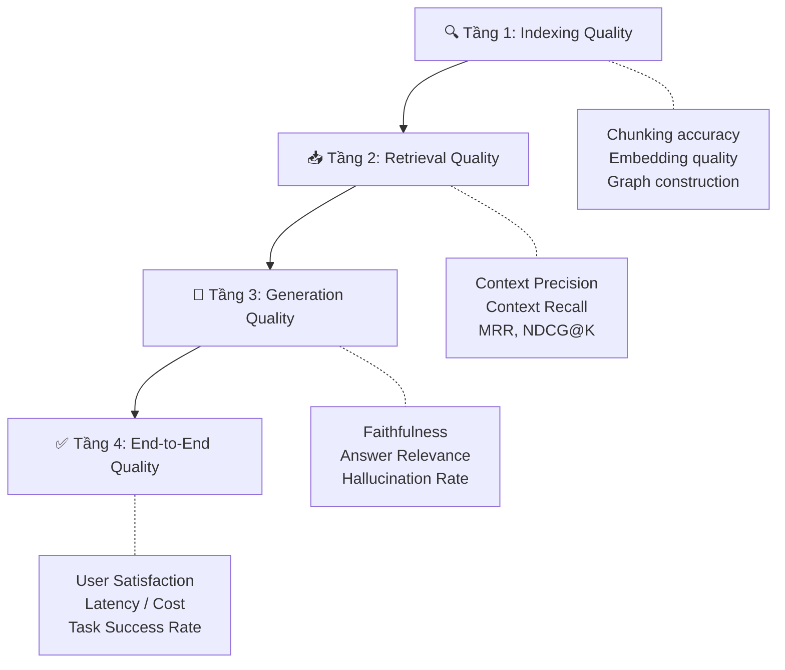
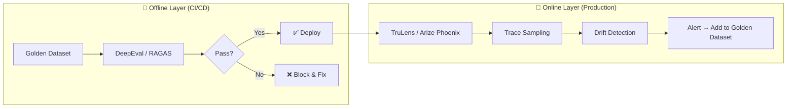
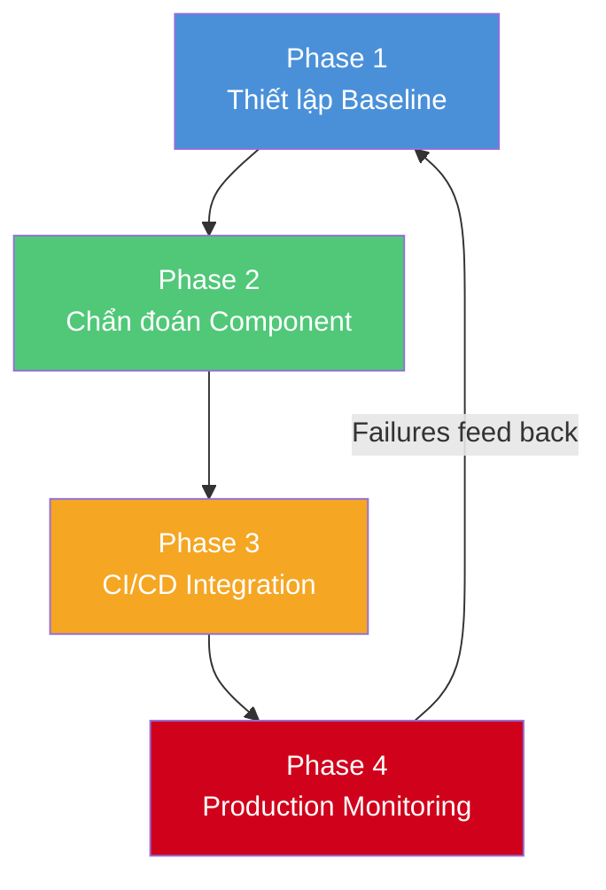

# Đánh Giá Hệ Thống RAG/KAG Hiện Đại — Hướng Dẫn Toàn Diện

> **Phạm vi**: Tổng hợp nghiên cứu về phương pháp luận, metrics, công cụ, và thực hành tốt nhất
> để đánh giá hiệu quả của hệ thống Retrieval-Augmented Generation (RAG) và
> Knowledge-Augmented Generation (KAG) — cập nhật 2025–2026.

---

## 1. Tổng Quan: RAG vs KAG

### 1.1 RAG (Retrieval-Augmented Generation)

RAG bổ sung kiến thức cho LLM bằng cách **truy xuất các đoạn văn bản (chunks) tương đồng
ngữ nghĩa** từ vector database, rồi đưa vào context của prompt trước khi sinh câu trả lời.

```
Query → Embedding → Vector Search → Top-K Chunks → LLM → Answer
```

### 1.2 KAG (Knowledge-Augmented Generation)

KAG đại diện cho bước tiến hóa tiếp theo, thay thế tìm kiếm vector "phẳng" bằng
**lý luận logic trên đồ thị tri thức (Knowledge Graph)**. KAG sử dụng engine như OpenSPG
để duyệt mối quan hệ giữa các thực thể, cho phép trả lời câu hỏi đa bước (multi-hop)
mà RAG truyền thống thất bại.

```
Query → Logical Form → KG Traversal + Text Retrieval → Hybrid Reasoning → LLM → Answer
```

### 1.3 So Sánh Kiến Trúc

| Đặc điểm | RAG | KAG |
|:---|:---|:---|
| **Storage Engine** | Vector Database (Qdrant, Pinecone, Weaviate) | Graph Database (Kuzu, Neo4j, OpenSPG) |
| **Cơ chế chính** | Semantic Similarity Search | Relational/Logical Traversal |
| **Lỗi phổ biến** | Retrieval noise, hallucination | Graph incompleteness, complex logic failures |
| **Trọng tâm đánh giá** | Precision, Recall, Faithfulness | Multi-hop reasoning, Graph Fidelity |
| **Phù hợp** | Document Q&A tổng quát | Domain chuyên sâu (luật, y tế, tài chính) |

---

## 2. Framework Đánh Giá Theo Tầng (Layered Evaluation)

> [!IMPORTANT]
> **Nguyên tắc cốt lõi**: Không đánh giá RAG/KAG như một hộp đen. Phải **tách riêng** từng
> tầng (retrieval, generation) để xác định chính xác vị trí lỗi.

### 2.1 Kiến Trúc 4 Tầng Đánh Giá



---

## 3. Metrics Chi Tiết

### 3.1 Metrics Đánh Giá Retrieval

#### Context Precision
- **Đo gì**: Tỷ lệ chunks truy xuất thực sự liên quan
- **Công thức**: `Relevant Chunks Retrieved / Total Chunks Retrieved`
- **Mục đích**: Đảm bảo LLM nhận "tín hiệu" thay vì "nhiễu"
- **Cần ground truth**: Không (thông thường)

#### Context Recall
- **Đo gì**: Hệ thống có truy xuất **đủ** thông tin cần thiết không?
- **Công thức**: `Ground Truth Claims Attributable to Context / Total Ground Truth Claims`
- **Mục đích**: Phát hiện thiếu sót trong retrieval
- **Cần ground truth**: **Có** — đây là metric duy nhất trong RAGAS yêu cầu ground truth

#### Recall@K / Precision@K / NDCG@K
- **Recall@K**: Trong K kết quả đầu, bao nhiêu % tài liệu liên quan đã được truy xuất?
- **Precision@K**: Trong K kết quả đầu, bao nhiêu % là thực sự liên quan?
- **NDCG@K** (Normalized Discounted Cumulative Gain): Tài liệu liên quan có được xếp hạng cao không?

#### MRR (Mean Reciprocal Rank)
- Vị trí trung bình của kết quả liên quan đầu tiên trong danh sách truy xuất

### 3.2 Metrics Đánh Giá Generation

#### Faithfulness (Groundedness)
- **Đo gì**: Câu trả lời có **chỉ** dựa trên context được cung cấp không?
- **Cách hoạt động**: Phân tách câu trả lời thành từng claim, kiểm tra mỗi claim có thể suy ra từ context không
- **Công thức**: `Faithful Claims / Total Claims`
- **Mục đích**: Metric **quan trọng nhất** để phát hiện hallucination
- **Cần ground truth**: Không

#### Answer Relevance
- **Đo gì**: Câu trả lời có **đúng** với câu hỏi của người dùng không?
- **Cách hoạt động**: Sinh các câu hỏi tiềm năng từ câu trả lời, so sánh với câu hỏi gốc
- **Mục đích**: Lọc câu trả lời lệch chủ đề, thừa, hoặc thiếu
- **Cần ground truth**: Không

#### Answer Correctness
- **Đo gì**: Câu trả lời có đúng so với đáp án tham chiếu không?
- **Cách hoạt động**: Kết hợp F1 score trên các statement + semantic similarity
- **Cần ground truth**: **Có**

### 3.3 Metrics Đặc Thù cho KAG / GraphRAG

| Metric | Mô tả |
|:---|:---|
| **Multi-hop Reasoning Accuracy** | Khả năng kết nối nhiều thực thể xa nhau trong graph để đưa ra kết luận |
| **Graph Alignment** | Cấu trúc graph truy xuất có khớp với đường dẫn logic cần thiết? |
| **Entity Extraction Accuracy** | Chất lượng trích xuất thực thể khi xây dựng KG |
| **Relationship Correctness** | Mối quan hệ giữa các thực thể có chính xác? |
| **Provenance Coverage** | Mỗi node/edge có truy nguyên được về tài liệu gốc? |
| **Community Clustering Score** | Đánh giá dựa trên semantic community trong KG |

### 3.4 Metrics Vận Hành (Operational)

| Metric | Mô tả | Ý nghĩa |
|:---|:---|:---|
| **Latency (P50/P95/P99)** | Thời gian phản hồi | Đo từng giai đoạn: retrieval, reranking, generation |
| **Token Cost** | Chi phí token cho mỗi query | Context size × LLM pricing |
| **Throughput** | Số query/giây | Scalability |
| **Error Rate** | % query thất bại | Stability |
| **Hallucination Rate** | % câu trả lời chứa thông tin bịa đặt | Safety |

### 3.5 Bảng Tổng Hợp Metrics

| Metric | Tầng | Cần Ground Truth? | Câu hỏi cốt lõi |
|:---|:---|:---|:---|
| **Context Precision** | Retrieval | Không | Chunks truy xuất có liên quan? |
| **Context Recall** | Retrieval | Có | Đã truy xuất đủ thông tin? |
| **Faithfulness** | Generation | Không | Câu trả lời có dựa trên context? |
| **Answer Relevance** | Generation | Không | Câu trả lời có đúng câu hỏi? |
| **Answer Correctness** | E2E | Có | Câu trả lời có đúng? |
| **Multi-hop Accuracy** | KAG-specific | Có | Hệ thống lý luận đa bước tốt? |

---

## 4. Công Cụ & Framework Đánh Giá

### 4.1 Bảng So Sánh

| Công cụ | Loại | Best for | Production Monitoring | Open Source |
|:---|:---|:---|:---|:---|
| **RAGAS** | Framework | Batch dataset evaluation | Qua tích hợp | ✅ |
| **DeepEval** | Framework | CI/CD, unit testing | Qua Confident AI | ✅ |
| **TruLens** | Library | RAG Triad, tracing | ✅ Native | ✅ |
| **LangSmith** | Platform (SaaS) | Full lifecycle, LangChain | ✅ Core feature | ❌ |
| **ARES** | Research tool | Minimize human labeling | Offline focus | ✅ |
| **Arize Phoenix** | Platform | Tracing, monitoring | ✅ Core feature | Open-core |
| **BenchmarkQED** | Benchmark | Automated RAG benchmarking | ❌ | ✅ (Microsoft) |
| **GraphRAG-Bench** | Benchmark | GraphRAG-specific eval | ❌ | ✅ |

### 4.2 Chiến Lược Kết Hợp Công Cụ (Khuyến Nghị)



> [!TIP]
> **Xu hướng 2025–2026**: Teams trưởng thành sử dụng **two-layer pattern** —
> offline layer (unit test/regression trước deploy) + online layer (monitor production traces
> để phát hiện silent failures).

---

## 5. Triển Khai Thực Tế

### 5.1 Đánh Giá Với RAGAS (Batch Analysis)

```python
from ragas import evaluate
from ragas.metrics import (
    faithfulness,
    answer_relevancy,
    context_precision,
    context_recall
)
from datasets import Dataset

# Chuẩn bị evaluation dataset
eval_data = {
    "question": [
        "Quy trình xử lý khiếu nại bảo hiểm gồm mấy bước?",
        "Thời hạn giải quyết khiếu nại tối đa là bao lâu?"
    ],
    "answer": [
        "Quy trình gồm 5 bước: tiếp nhận, xác minh, thẩm định, phê duyệt, chi trả.",
        "Thời hạn tối đa là 30 ngày kể từ ngày nhận đủ hồ sơ."
    ],
    "contexts": [
        ["Quy trình xử lý khiếu nại bảo hiểm bao gồm 5 bước chính..."],
        ["Theo quy định, thời hạn giải quyết không quá 30 ngày làm việc..."]
    ],
    "ground_truth": [
        "Quy trình gồm 5 bước: tiếp nhận, xác minh, thẩm định, phê duyệt, chi trả.",
        "Tối đa 30 ngày làm việc."
    ]
}

dataset = Dataset.from_dict(eval_data)

# Chạy evaluation
results = evaluate(
    dataset=dataset,
    metrics=[
        faithfulness,
        answer_relevancy,
        context_precision,
        context_recall
    ]
)

print(results)
# Output: {'faithfulness': 0.95, 'answer_relevancy': 0.88, 
#          'context_precision': 0.92, 'context_recall': 0.85}
```

### 5.2 Đánh Giá Với DeepEval (CI/CD Unit Testing)

```python
import pytest
from deepeval import assert_test
from deepeval.metrics import (
    FaithfulnessMetric,
    AnswerRelevancyMetric,
    ContextualPrecisionMetric,
    ContextualRecallMetric,
    HallucinationMetric
)
from deepeval.test_case import LLMTestCase

# Định nghĩa metrics với ngưỡng chấp nhận
faithfulness_metric = FaithfulnessMetric(threshold=0.7)
relevancy_metric = AnswerRelevancyMetric(threshold=0.7)
hallucination_metric = HallucinationMetric(threshold=0.5)

# ---- Test 1: Câu hỏi thông thường ----
def test_basic_rag_query():
    test_case = LLMTestCase(
        input="Lãi suất tiết kiệm hiện tại là bao nhiêu?",
        actual_output="Lãi suất tiết kiệm kỳ hạn 12 tháng hiện là 5.5%/năm.",
        retrieval_context=[
            "Bảng lãi suất tiết kiệm cập nhật: Kỳ hạn 12 tháng: 5.5%/năm",
            "Lãi suất áp dụng từ ngày 01/01/2025"
        ]
    )
    assert_test(test_case, [faithfulness_metric, relevancy_metric])

# ---- Test 2: Câu hỏi ngoài phạm vi (negative test) ----
def test_out_of_scope_query():
    test_case = LLMTestCase(
        input="Thời tiết hôm nay thế nào?",
        actual_output="Tôi không có thông tin về thời tiết trong dữ liệu hiện tại.",
        retrieval_context=[
            "Quy trình mở tài khoản tiết kiệm online..."
        ]
    )
    # Câu trả lời KHÔNG nên hallucinate — phải thừa nhận "không biết"
    assert_test(test_case, [hallucination_metric])

# ---- Test 3: Multi-hop reasoning (dành cho KAG) ----
def test_multihop_kag_query():
    test_case = LLMTestCase(
        input="Giám đốc chi nhánh Hà Nội có thẩm quyền duyệt hạn mức bao nhiêu?",
        actual_output="Giám đốc Nguyễn Văn A có thẩm quyền duyệt tối đa 5 tỷ VND.",
        retrieval_context=[
            "Chi nhánh Hà Nội do Giám đốc Nguyễn Văn A quản lý.",
            "Giám đốc chi nhánh có thẩm quyền phê duyệt hạn mức tín dụng tối đa 5 tỷ VND.",
            "Quy chế phân cấp thẩm quyền ban hành ngày 15/03/2024."
        ]
    )
    assert_test(test_case, [faithfulness_metric, relevancy_metric])

# Chạy: pytest test_rag_eval.py -v
```

### 5.3 Custom KAG Evaluation (Multi-hop Reasoning)

```python
"""
Đánh giá đặc thù cho KAG: kiểm tra khả năng lý luận đa bước
trên Knowledge Graph.
"""

def evaluate_multihop_reasoning(
    kag_system,
    test_cases: list[dict],
) -> dict:
    """
    Đánh giá multi-hop reasoning của KAG system.
    
    Mỗi test case gồm:
    - question: Câu hỏi cần nhiều bước suy luận
    - expected_hops: Số bước suy luận kỳ vọng
    - expected_entities: Các thực thể phải được truy cập
    - expected_answer: Đáp án tham chiếu
    """
    results = {
        "total": len(test_cases),
        "correct": 0,
        "hop_accuracy": [],
        "entity_coverage": [],
        "reasoning_trace_valid": 0,
    }
    
    for tc in test_cases:
        # Gọi KAG system, yêu cầu trả về reasoning trace
        response = kag_system.query(
            question=tc["question"],
            return_trace=True  # Trả về đường dẫn suy luận trên graph
        )
        
        # 1. Kiểm tra đáp án đúng
        if is_semantically_equivalent(response.answer, tc["expected_answer"]):
            results["correct"] += 1
        
        # 2. Kiểm tra số bước suy luận
        actual_hops = len(response.reasoning_trace)
        results["hop_accuracy"].append(
            1.0 if actual_hops >= tc["expected_hops"] else actual_hops / tc["expected_hops"]
        )
        
        # 3. Kiểm tra entity coverage
        accessed_entities = {step.entity for step in response.reasoning_trace}
        expected = set(tc["expected_entities"])
        coverage = len(accessed_entities & expected) / len(expected)
        results["entity_coverage"].append(coverage)
        
        # 4. Kiểm tra tính hợp lệ của reasoning trace
        if validate_graph_path(response.reasoning_trace):
            results["reasoning_trace_valid"] += 1
    
    # Tổng hợp
    n = results["total"]
    return {
        "accuracy": results["correct"] / n,
        "avg_hop_accuracy": sum(results["hop_accuracy"]) / n,
        "avg_entity_coverage": sum(results["entity_coverage"]) / n,
        "reasoning_validity_rate": results["reasoning_trace_valid"] / n,
    }
```

---

## 6. Xây Dựng Golden Dataset

> [!IMPORTANT]
> Golden Dataset là **nguồn sự thật duy nhất** cho đánh giá. Chất lượng dataset
> quyết định chất lượng đánh giá.

### 6.1 Nguyên Tắc Xây Dựng

| Nguyên tắc | Chi tiết |
|:---|:---|
| **Bắt đầu từ thực tế** | 20–50 case từ production logs, support tickets, user feedback |
| **Bao gồm negative cases** | Câu hỏi mà hệ thống **không thể** trả lời — test khả năng "từ chối" |
| **Đa dạng độ phức tạp** | Mix giữa single-hop (đơn giản) và multi-hop (phức tạp) |
| **Cập nhật liên tục** | Mỗi lỗi production → thêm vào dataset |
| **Cấu trúc rõ ràng** | Mỗi case có: input, expected output, relevant docs, và pass/fail criteria |

### 6.2 Cấu Trúc Golden Dataset

```json
{
  "test_cases": [
    {
      "id": "TC-001",
      "category": "single-hop",
      "difficulty": "easy",
      "question": "Lãi suất tiết kiệm kỳ hạn 6 tháng là bao nhiêu?",
      "expected_answer": "4.8% mỗi năm",
      "relevant_doc_ids": ["DOC-RATE-2025-Q1"],
      "expected_chunks": ["Bảng lãi suất kỳ hạn 6 tháng: 4.8%/năm"],
      "pass_criteria": {
        "must_contain": ["4.8%"],
        "must_not_contain": ["không chắc", "có thể"],
        "faithfulness_threshold": 0.9
      }
    },
    {
      "id": "TC-002",
      "category": "multi-hop",
      "difficulty": "hard",
      "question": "Khách hàng VIP có được ưu đãi lãi suất vay mua nhà không?",
      "expected_answer": "Có, khách VIP (Diamond/Platinum) được giảm 0.5% lãi suất vay mua nhà so với lãi suất niêm yết.",
      "relevant_doc_ids": ["DOC-VIP-POLICY", "DOC-MORTGAGE-RATE"],
      "required_reasoning_hops": 2,
      "expected_entities": ["VIP_Diamond", "VIP_Platinum", "Mortgage_Rate", "Discount_Policy"],
      "pass_criteria": {
        "must_contain": ["0.5%", "giảm"],
        "faithfulness_threshold": 0.85,
        "multi_hop_required": true
      }
    },
    {
      "id": "TC-003",
      "category": "negative",
      "difficulty": "medium",
      "question": "Bitcoin hôm nay giá bao nhiêu?",
      "expected_answer": "Tôi không có thông tin về giá Bitcoin trong dữ liệu ngân hàng.",
      "relevant_doc_ids": [],
      "pass_criteria": {
        "must_refuse": true,
        "must_not_hallucinate": true,
        "hallucination_threshold": 0.3
      }
    }
  ]
}
```

---

## 7. LLM-as-a-Judge: Phương Pháp Chính

### 7.1 Cách Hoạt Động

Thay vì thuê annotator đánh giá thủ công, sử dụng một LLM mạnh (GPT-4o, Claude Sonnet/Opus)
làm "giám khảo" để chấm điểm output.

```
[System Prompt cho Judge]
Bạn là một chuyên gia đánh giá chất lượng. Hãy đánh giá câu trả lời sau
dựa trên CONTEXT được cung cấp.

Tiêu chí:
1. Faithfulness (0-1): Mọi claim trong câu trả lời có được hỗ trợ bởi context?
2. Relevance (0-1): Câu trả lời có đúng câu hỏi?  
3. Completeness (0-1): Câu trả lời có đầy đủ thông tin?

Trả lời dạng JSON:
{"faithfulness": 0.X, "relevance": 0.X, "completeness": 0.X, "reasoning": "..."}
```

### 7.2 Hạn Chế & Cách Khắc Phục

| Hạn chế | Giải pháp |
|:---|:---|
| **Position bias** | Randomize thứ tự context |
| **Verbosity bias** | Yêu cầu output structured (JSON) |
| **Self-bias** | Dùng model khác model sinh đáp án làm judge |
| **Domain blind spots** | Calibrate bằng human-labeled set (50–100 mẫu) |

---

## 8. KAG Benchmarks: Kết Quả Tham Chiếu

### 8.1 KAG vs RAG Truyền Thống (Dữ liệu từ paper gốc)

| Dataset | RAG (F1) | KAG (F1) | Cải thiện |
|:---|:---|:---|:---|
| **HotpotQA** | ~0.45 | ~0.60 | **+33.5%** |
| **2WikiMultiHopQA** | ~0.52 | ~0.62 | **+19.6%** |

> [!NOTE]
> KAG đặc biệt vượt trội với multi-hop reasoning nhờ logical form-guided hybrid
> reasoning engine trên OpenSPG.

### 8.2 Benchmarks Đáng Chú Ý (2024–2026)

| Benchmark | Nguồn | Mục đích |
|:---|:---|:---|
| **HotpotQA** | Yang et al. | Multi-hop QA tổng quát |
| **2WikiMultiHopQA** | Ho et al. | Multi-hop QA dựa trên Wikipedia |
| **MuSiQue** | Trivedi et al. | Multi-hop phức tạp, 2–4 hops |
| **MAGIC** | Research 2025 | Inter-context conflicts |
| **BenchmarkQED** | Microsoft Research | Automated RAG benchmarking |
| **GraphRAG-Bench** | Community 2025 | GraphRAG-specific evaluation |

---

## 9. Quy Trình Đánh Giá Đầy Đủ (Playbook)

### Phase 1: Thiết Lập Baseline

```
1. Thu thập 50–100 câu hỏi thực từ production / SMEs
2. Phân loại: single-hop / multi-hop / negative / adversarial
3. Tạo ground truth answers (human-verified)
4. Chạy evaluation lần đầu → ghi nhận baseline scores
```

### Phase 2: Component-Level Diagnosis

```
5. Đánh giá Retrieval riêng:
   - Context Precision < 0.7? → Cải thiện chunking / embedding
   - Context Recall < 0.7? → Mở rộng corpus / tối ưu query
   
6. Đánh giá Generation riêng:
   - Faithfulness < 0.8? → Cải thiện prompt / thêm guardrails
   - Answer Relevance < 0.7? → Tối ưu prompt template

7. [KAG-specific] Đánh giá Graph Quality:
   - Entity extraction accuracy
   - Relationship correctness
   - Graph completeness
```

### Phase 3: CI/CD Integration

```
8. Tích hợp DeepEval vào CI pipeline
9. Mỗi PR thay đổi prompt/chunking/embedding phải pass test suite
10. Tự động block deploy nếu metrics xuống dưới threshold
```

### Phase 4: Production Monitoring

```
11. Deploy TruLens/Arize Phoenix cho tracing
12. Sampling 5–10% production queries
13. Alert khi faithfulness drift > 10%
14. Mỗi failure → thêm vào golden dataset
```

### Tổng Quan Quy Trình



---

## 10. Ngưỡng Khuyến Nghị (Thresholds)

| Metric | Mức tối thiểu | Mức tốt | Mức xuất sắc |
|:---|:---|:---|:---|
| **Faithfulness** | ≥ 0.70 | ≥ 0.85 | ≥ 0.95 |
| **Answer Relevance** | ≥ 0.65 | ≥ 0.80 | ≥ 0.90 |
| **Context Precision** | ≥ 0.60 | ≥ 0.75 | ≥ 0.90 |
| **Context Recall** | ≥ 0.60 | ≥ 0.80 | ≥ 0.90 |
| **Multi-hop Accuracy** | ≥ 0.50 | ≥ 0.70 | ≥ 0.85 |
| **Hallucination Rate** | ≤ 0.20 | ≤ 0.10 | ≤ 0.05 |
| **Latency P95** | ≤ 10s | ≤ 5s | ≤ 2s |

> [!CAUTION]
> Các ngưỡng trên là **hướng dẫn tổng quát**. Domain chuyên sâu (y tế, tài chính)
> nên yêu cầu faithfulness ≥ 0.95 và hallucination rate ≤ 0.03.

---

## 11. Anti-Patterns Cần Tránh

| ❌ Anti-Pattern | ✅ Nên làm |
|:---|:---|
| Chỉ đo accuracy end-to-end | Tách riêng retrieval và generation metrics |
| Dùng BLEU/ROUGE cho đánh giá | Dùng LLM-as-a-Judge + faithfulness metrics |
| Không có negative test cases | Bao gồm 15–20% câu hỏi ngoài phạm vi |
| Đánh giá một lần rồi thôi | Tích hợp vào CI/CD, monitor continuous |
| Dùng cùng model sinh và judge | Dùng model judge khác model sinh đáp án |
| Chỉ dùng synthetic questions | Mix 70% real questions + 30% synthetic |
| Bỏ qua latency/cost | Đo cả operational metrics song song |

---

## 12. Tham Khảo & Nguồn

### Papers
- **KAG**: "KAG: Boosting LLMs in Professional Domains via Knowledge Augmented Generation" — arXiv 2024
- **RAGAS**: "RAGAS: Automated Evaluation of Retrieval Augmented Generation" — arXiv 2023
- **GraphRAG**: Microsoft Research, "From Local to Global: A Graph RAG Approach" — 2024
- **ARES**: Stanford FutureData, "ARES: An Automated Evaluation Framework for RAG Systems" — 2024

### Frameworks & Tools
- RAGAS: https://ragas.io
- DeepEval: https://deepeval.com
- TruLens: https://trulens.org
- LangSmith: https://smith.langchain.com
- Arize Phoenix: https://phoenix.arize.com
- OpenSPG/KAG: https://github.com/OpenSPG/KAG

### Benchmarks
- HotpotQA: https://hotpotqa.github.io
- 2WikiMultiHopQA: https://github.com/Alab-NII/2wikimultihop
- BenchmarkQED: Microsoft Research
- GraphRAG-Bench: https://github.com/IDEA-FinAI/GraphRAG-Bench
