# Operational Transformation & CRDT — Deep Dive

## 1. Bài toán gốc: Collaborative Editing

Khi nhiều người cùng chỉnh sửa một tài liệu **đồng thời** qua mạng (latency ≠ 0), ba tính chất cần đảm bảo:

| Tính chất | Ý nghĩa |
|---|---|
| **Convergence** | Mọi replica cuối cùng phải có cùng trạng thái |
| **Intention preservation** | Hiệu ứng của mỗi thao tác phải giống như khi nó được thực hiện trên trạng thái mà người dùng nhìn thấy |
| **Causality preservation** | Thứ tự nhân quả phải được bảo toàn (nếu op A "xảy ra trước" op B thì mọi replica đều áp A trước B) |

Hai họ giải pháp chính: **OT** (1989) và **CRDT** (2011).

---

## 2. Operational Transformation (OT)

### 2.1 Ý tưởng cốt lõi

> **"Transform the operation, not the data."**

Mỗi thao tác chỉnh sửa được mô hình hóa thành một **operation** (op). Khi hai op đồng thời xung đột, ta **biến đổi** (transform) một op để nó vẫn đúng ngữ nghĩa khi áp dụng **sau** op kia.

### 2.2 Mô hình operations cho Plain Text

```
Insert(position, character)   — chèn ký tự tại vị trí
Delete(position)              — xóa ký tự tại vị trí
```

### 2.3 Hàm Transform — TP1 (Transformation Property 1)

Cho hai op `a` và `b` được tạo đồng thời trên cùng một trạng thái `S`:

```
T(a, b) → a'    sao cho   S · b · a'  =  S · a · b'
T(b, a) → b'
```

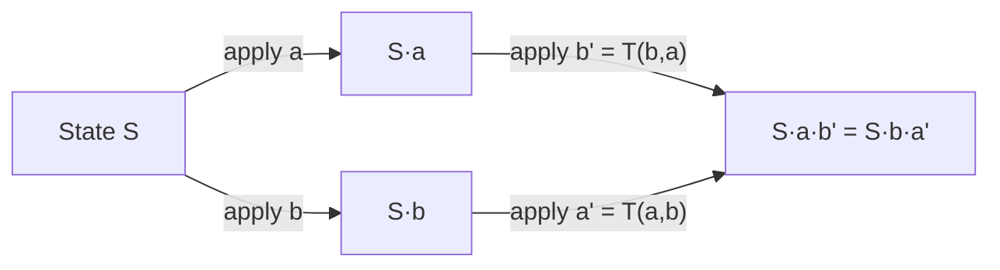

#### Bảng transform cho text editing:

| a \ b | Insert(pb, cb) | Delete(pb) |
|---|---|---|
| **Insert(pa, ca)** | if pa < pb → Insert(pa, ca) | if pa ≤ pb → Insert(pa, ca) |
| | if pa > pb → Insert(pa+1, ca) | if pa > pb → Insert(pa−1, ca) |
| | if pa = pb → tiebreak by site_id | |
| **Delete(pa)** | if pa < pb → Delete(pa) | if pa < pb → Delete(pa) |
| | if pa ≥ pb → Delete(pa+1) | if pa > pb → Delete(pa−1) |
| | | if pa = pb → **noop** (đã xóa) |

### 2.4 Ví dụ cụ thể

```
Document ban đầu: "ABC"

User 1: Insert(1, 'X')  →  "AXBC"     (chèn X sau A)
User 2: Delete(2)       →  "AC"       (xóa B — vị trí 2, index từ 0)
```

Nếu User 2 nhận op của User 1 trước:
- Document User 2 hiện tại: `"AC"`
- Op nhận: `Insert(1, 'X')`
- Cần transform: `T(Insert(1,'X'), Delete(2))`
  - pa=1 < pb=2 → `Insert(1, 'X')` — **giữ nguyên**
- Áp dụng: `"AC"` → `"AXC"` ✓

Nếu User 1 nhận op của User 2:
- Document User 1 hiện tại: `"AXBC"`
- Op nhận: `Delete(2)` (ban đầu muốn xóa B)
- Cần transform: `T(Delete(2), Insert(1,'X'))`
  - pa=2 ≥ pb=1 → `Delete(2+1)` = `Delete(3)`
- Áp dụng: `"AXBC"` → xóa index 3 → `"AXC"` ✓

**Convergence đạt được!**

### 2.5 Kiến trúc OT

#### Client-Server (Google Docs style — Jupiter/Wave)

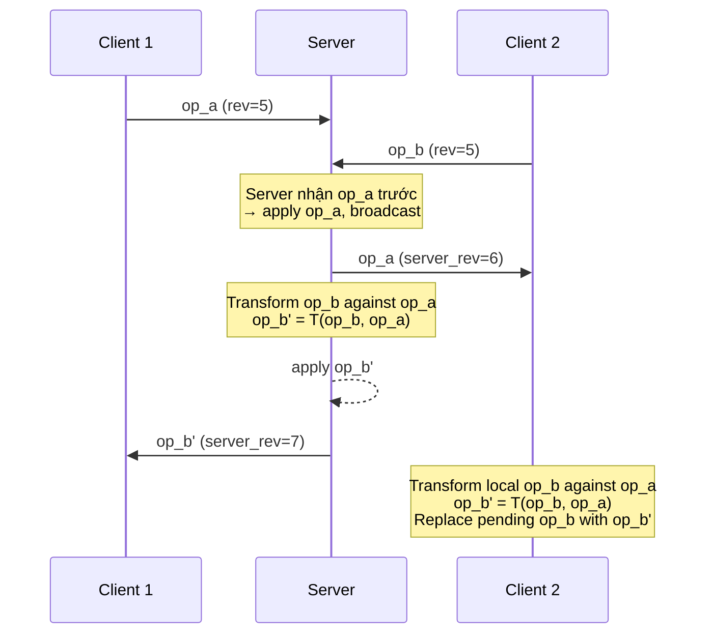

**Ưu điểm**: Server serializes tất cả ops → chỉ cần TP1, tránh vấn đề TP2.

**Nhược điểm**: Single point of failure, latency phụ thuộc vào server.

#### Peer-to-Peer (dOPT, adOPTed, GOTO, SOCT)

Không có server trung tâm. Cần cả **TP1** và **TP2** (Transformation Property 2):

```
T(T(a, b), T(c, b)) = T(T(a, c), T(b, c))
```

> [!CAUTION]
> TP2 cực kỳ khó đảm bảo đúng. Nhiều thuật toán OT đã được chứng minh là **không thỏa mãn TP2** trong mọi trường hợp (Imine et al., 2006). Đây là lý do OT peer-to-peer gần như không được dùng trong production.

### 2.6 Client-side: OT Control Algorithm

Mỗi client duy trì:

```javascript
class OTClient {
  revision     // server revision mà client đã "thấy"
  pending      // op đã gửi server, chưa được ACK
  buffer       // các op local chưa gửi (đợi pending được ACK)
  
  // Khi user thao tác local
  applyLocal(op) {
    applyToDocument(op)
    if (this.pending === null) {
      this.pending = op
      send(op, this.revision)
    } else {
      this.buffer.push(op)
    }
  }
  
  // Khi nhận ACK từ server (op của mình)
  onAck() {
    this.revision++
    if (this.buffer.length > 0) {
      this.pending = composeAll(this.buffer)
      this.buffer = []
      send(this.pending, this.revision)
    } else {
      this.pending = null
    }
  }
  
  // Khi nhận op từ server (của người khác)
  onRemoteOp(serverOp) {
    this.revision++
    if (this.pending) {
      [this.pending, serverOp] = transform(this.pending, serverOp)
    }
    for (let i = 0; i < this.buffer.length; i++) {
      [this.buffer[i], serverOp] = transform(this.buffer[i], serverOp)
    }
    applyToDocument(serverOp)
  }
}
```

> [!NOTE]
> Đây chính là mô hình **3-state** (Synchronized / Awaiting Confirm / Awaiting Confirm + Buffer) mà Google Docs và ShareDB sử dụng.

### 2.7 Tổng kết OT

| Aspect | Đánh giá |
|---|---|
| **Proven in production** | Google Docs, Apache Wave, ShareDB, Etherpad |
| **Correctness** | Rất khó chứng minh (đặc biệt peer-to-peer) |
| **Complexity** | O(H²) trong worst case (H = history length) |
| **Server dependency** | Client-Server model gần như bắt buộc |
| **Rich text** | Tốt — operations dễ mở rộng (OT-rich-text của Quill) |

---

## 3. Conflict-free Replicated Data Types (CRDT)

### 3.1 Ý tưởng cốt lõi

> **"Design the data type so that conflicts are impossible by construction."**

Thay vì transform operations, CRDT thiết kế cấu trúc dữ liệu sao cho:
- Mọi concurrent operations đều **commutative** (thứ tự áp dụng không quan trọng), HOẶC
- States hội tụ qua **merge function** (join semilattice)

### 3.2 Hai họ CRDT

#### State-based CRDT (CvRDT — Convergent)

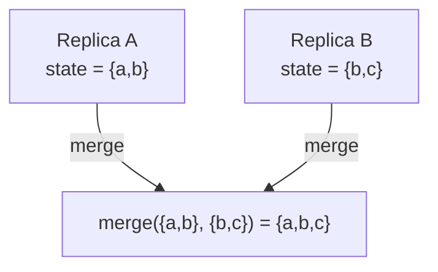

- Gửi **toàn bộ state** giữa các replicas
- Merge function phải là **join of a semilattice**: commutative, associative, idempotent
- Ví dụ: G-Counter, OR-Set

#### Operation-based CRDT (CmRDT — Commutative)

- Gửi **operations** giữa các replicas  
- Operations phải **commutative** (concurrent ops có thể áp dụng theo bất kỳ thứ tự nào)
- Yêu cầu: reliable broadcast với causal delivery
- Ví dụ: Yjs, Automerge

### 3.3 CRDT cho Text Editing — Sequence CRDTs

Đây là phần phức tạp nhất và thú vị nhất.

#### 3.3.1 Tombstone-based: RGA (Replicated Growable Array)

Mỗi ký tự có một **unique ID** = `(timestamp, replicaId)`:

```
Document: "ABC"

Nội bộ:
  [{ id: (1,A), char: 'A', deleted: false },
   { id: (2,A), char: 'B', deleted: false },
   { id: (3,A), char: 'C', deleted: false }]
```

**Insert**: Tạo ID mới, chèn **sau** ký tự có ID cha (parent). Nếu hai insert cùng vị trí → tiebreak bằng ID (timestamp lớn hơn thắng, nếu bằng → replicaId).

**Delete**: Không xóa thật, chỉ đánh dấu `deleted: true` (**tombstone**).

```javascript
// Simplified RGA Insert
insert(parentId, newChar, replicaId, clock) {
  const newId = { ts: clock, replica: replicaId }
  const parentIndex = this.findIndex(parentId)
  
  // Tìm vị trí chèn: sau parent, trước mọi element có ID nhỏ hơn
  let insertPos = parentIndex + 1
  while (insertPos < this.list.length) {
    const existing = this.list[insertPos]
    if (this.compareIds(existing.id, newId) > 0) {
      // existing có ID lớn hơn → chèn trước nó
      break
    }
    insertPos++
  }
  
  this.list.splice(insertPos, 0, {
    id: newId,
    char: newChar,
    deleted: false
  })
}
```

> [!WARNING]
> **Tombstone problem**: Ký tự đã xóa vẫn chiếm bộ nhớ. Cần **garbage collection** (GC), nhưng GC trong distributed system rất phức tạp vì phải đảm bảo mọi replica đã "thấy" tombstone trước khi xóa.

#### 3.3.2 Position-based: Logoot / LSEQ

Thay vì tombstone, dùng **fractional positions** (vị trí là số thực/danh sách số nguyên):

```
'A' → position [1]
'B' → position [2]
'C' → position [3]

Insert 'X' giữa A và B:
'X' → position [1, 5]   (giữa [1] và [2])

Insert 'Y' giữa A và X:
'Y' → position [1, 2]   (giữa [1] và [1,5])
```

**Ưu điểm**: Không cần tombstone — delete thực sự xóa.

**Nhược điểm**: Position identifiers có thể **phình to** theo thời gian (interleaving problem).

#### 3.3.3 Tree-based: Yjs (YATA)

**Yjs** — thư viện CRDT phổ biến nhất hiện nay — sử dụng thuật toán **YATA** (Yet Another Transformation Approach):

```
Mỗi item (character/block) có:
  - id:     { client: number, clock: number }
  - left:   ID of left neighbor khi insert
  - right:  ID of right neighbor khi insert  
  - parent: ID of parent container
  - content: actual data
  - deleted: boolean
```

**Conflict resolution rule** trong YATA:
> Khi hai items cùng insert giữa hai items giống nhau (cùng left, cùng right):
> - Item nào có `origin` (left neighbor) xuất hiện **trước** → đứng trước
> - Nếu cùng origin → so sánh `client ID`

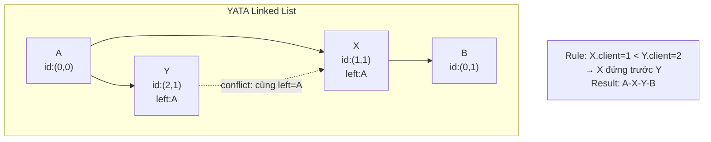

### 3.4 Ví dụ thực tế: CRDT vs OT cho cùng scenario

```
Document: "ABC"     (3 chars, index 0-2)

User 1 (replica R1): Insert 'X' at position 1  →  muốn "AXBC"
User 2 (replica R2): Delete position 2 (char B) →  muốn "AC"
```

**Với CRDT (RGA-style)**:

```
Trạng thái ban đầu:
  [(1,S):'A', (2,S):'B', (3,S):'C']

R1 tạo: Insert(parent=(1,S), char='X', id=(4,R1))
R2 tạo: Delete(id=(2,S))

--- R1 nhận Delete từ R2 ---
Tìm item có id=(2,S), đánh dấu deleted=true
Result: [(1,S):'A', (4,R1):'X', (2,S):'B'☠, (3,S):'C']
Visible: "AXC" ✓

--- R2 nhận Insert từ R1 ---
Tìm parent (1,S)='A', chèn 'X' sau nó
Result: [(1,S):'A', (4,R1):'X', (2,S):'B'☠, (3,S):'C']  
Visible: "AXC" ✓

✅ Convergence — KHÔNG cần transform!
```

### 3.5 Các loại CRDT phổ biến khác

| CRDT | Kiểu | Mô tả | Use case |
|---|---|---|---|
| **G-Counter** | State | Counter chỉ tăng, mỗi replica có counter riêng | Page views, likes |
| **PN-Counter** | State | Hai G-Counter (positive + negative) | Balance, inventory |
| **G-Set** | State | Set chỉ thêm (add-only) | Tag collection |
| **OR-Set** (Observed-Remove) | State/Op | Set hỗ trợ add + remove | Shopping cart |
| **LWW-Register** | State | Last-Writer-Wins bằng timestamp | User profile fields |
| **MV-Register** | State | Multi-Value — giữ mọi concurrent writes | Conflict resolution UI |
| **LWW-Map** | State | Map với LWW cho mỗi key | Key-value store |
| **RGA** | Op | Sequence cho text editing | Collaborative docs |
| **Yjs Doc** | Op | Hierarchical CRDT (map + array + text) | Full document model |

### 3.6 Formal Property: Semilattice

State-based CRDT yêu cầu `(S, ⊑, ⊔)` là một **join semilattice**:

```
∀ a, b ∈ S:
  1. a ⊔ b = b ⊔ a                    (commutative)
  2. (a ⊔ b) ⊔ c = a ⊔ (b ⊔ c)      (associative)  
  3. a ⊔ a = a                         (idempotent)
```

Điều này đảm bảo: bất kể thứ tự nhận message, bất kể duplicate message → **mọi replica hội tụ**.

---

## 4. So sánh OT vs CRDT

### 4.1 Bảng so sánh chi tiết

| Tiêu chí | OT | CRDT |
|---|---|---|
| **Năm ra đời** | 1989 (Ellis & Gibbs) | 2011 (Shapiro et al.) |
| **Triết lý** | Transform operations at runtime | Design data type to be conflict-free |
| **Server** | Gần như bắt buộc (client-server) | Không cần (true P2P possible) |
| **Correctness proof** | Rất khó (TP1 + TP2) | Đơn giản hơn (semilattice / commutativity) |
| **Memory overhead** | Thấp (chỉ giữ document + pending ops) | Cao hơn (unique IDs + tombstones) |
| **Network** | Ops nhỏ gọn | Ops lớn hơn (chứa unique IDs) |
| **Offline support** | Khó (cần server để serialize) | Tự nhiên (merge khi reconnect) |
| **Undo/Redo** | Phức tạp (cần inverse transform) | Phức tạp (tombstone-aware) |
| **GC (Garbage Collection)** | Không cần | Cần cho tombstone-based CRDTs |
| **Latency sensitivity** | Nhạy cảm hơn (cần round-trip) | Ít nhạy cảm (local-first) |
| **Real-world adoption** | Google Docs, Etherpad, ShareDB | Yjs, Automerge, Figma, Apple Notes |

### 4.2 Khi nào chọn gì?

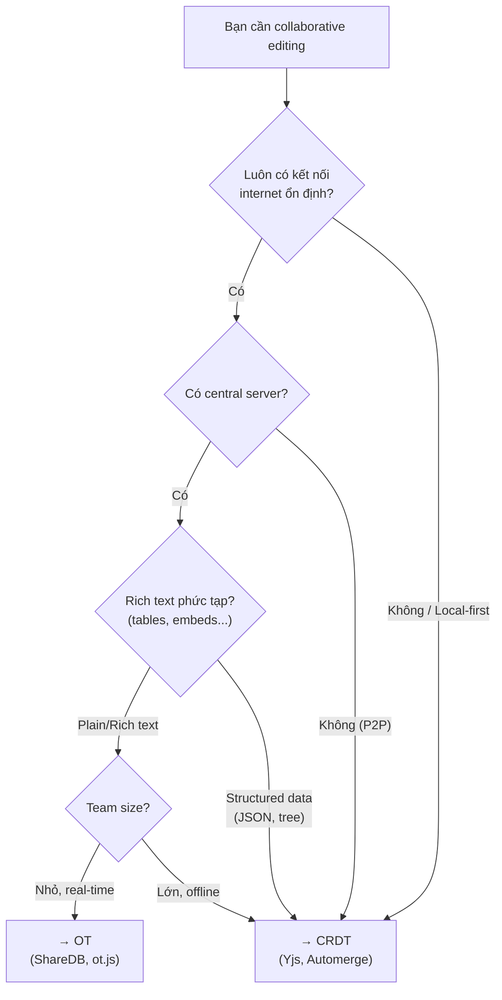

---

## 5. Hướng triển khai thực tế

### 5.1 Phương án 1: OT với ShareDB (Node.js)

> [!TIP]
> **Best for**: Real-time collaborative text editing có server, team size nhỏ-trung, không cần offline.

#### Server

```javascript
// server.js
const ShareDB = require('sharedb');
const WebSocket = require('ws');
const WebSocketJSONStream = require('@teamwork/websocket-json-stream');
const richText = require('rich-text');

// Đăng ký OT type cho rich text (Quill Delta format)
ShareDB.types.register(richText.type);

// Tạo ShareDB backend với MongoDB adapter
const db = require('sharedb-mongo')('mongodb://localhost:27017/myapp');
const backend = new ShareDB({ db });

// WebSocket server
const wss = new WebSocket.Server({ port: 8080 });

wss.on('connection', (ws) => {
  const stream = new WebSocketJSONStream(ws);
  backend.listen(stream);
});

// Tạo document mới nếu chưa có
const connection = backend.connect();
const doc = connection.get('documents', 'my-doc');
doc.fetch((err) => {
  if (err) throw err;
  if (doc.type === null) {
    // Khởi tạo với Quill Delta format
    doc.create([{ insert: 'Hello World!\n' }], 'rich-text');
  }
});
```

#### Client

```javascript
// client.js
const sharedb = require('sharedb/lib/client');
const richText = require('rich-text');
const Quill = require('quill');

sharedb.types.register(richText.type);

const socket = new WebSocket('ws://localhost:8080');
const connection = new sharedb.Connection(socket);
const doc = connection.get('documents', 'my-doc');

doc.subscribe((err) => {
  if (err) throw err;
  
  const quill = new Quill('#editor', { theme: 'snow' });
  quill.setContents(doc.data);
  
  // Local changes → send to server
  quill.on('text-change', (delta, oldDelta, source) => {
    if (source === 'user') {
      doc.submitOp(delta);  // ShareDB handles OT automatically
    }
  });
  
  // Remote changes → apply to editor
  doc.on('op', (op, source) => {
    if (!source) {  // not local
      quill.updateContents(op);
    }
  });
});
```

### 5.2 Phương án 2: CRDT với Yjs (Recommended cho projects mới)

> [!TIP]
> **Best for**: Modern collaborative apps, offline-first, P2P optional, structured data.

#### Core Setup

```javascript
// yjs-setup.js
import * as Y from 'yjs';
import { WebsocketProvider } from 'y-websocket';
import { IndexeddbPersistence } from 'y-indexeddb';

// Tạo Yjs document
const ydoc = new Y.Doc();

// Layer 1: Local persistence (offline support)
const indexeddbProvider = new IndexeddbPersistence('my-doc', ydoc);
indexeddbProvider.on('synced', () => {
  console.log('Loaded from IndexedDB');
});

// Layer 2: Network sync via WebSocket
const wsProvider = new WebsocketProvider(
  'wss://your-server.com',
  'my-doc-room',
  ydoc
);

wsProvider.on('status', ({ status }) => {
  console.log(`Connection: ${status}`);  // connected / disconnected
});

// ---- Sử dụng shared types ----

// Text editing (sequence CRDT)
const ytext = ydoc.getText('main-content');
ytext.insert(0, 'Hello ');
ytext.insert(6, 'World!');
// ytext.toString() === 'Hello World!'

// Structured data (map CRDT)
const ymeta = ydoc.getMap('metadata');
ymeta.set('title', 'My Document');
ymeta.set('lastModified', Date.now());

// Array/List (sequence CRDT)
const ytasks = ydoc.getArray('tasks');
ytasks.push([{ text: 'Buy groceries', done: false }]);

// Nested structures
const ymap = new Y.Map();
ymap.set('key', 'value');
ytasks.push([ymap]);  // push a map into an array

// ---- Observe changes ----
ytext.observe((event) => {
  console.log('Text changed:', event.changes.delta);
  // [{ retain: 5 }, { insert: 'X' }]
});

ymeta.observe((event) => {
  event.changes.keys.forEach((change, key) => {
    console.log(`Key "${key}": ${change.action}`);
    // action: 'add' | 'update' | 'delete'
  });
});
```

#### Tích hợp với Quill Editor

```javascript
// yjs-quill.js
import * as Y from 'yjs';
import { QuillBinding } from 'y-quill';
import Quill from 'quill';
import QuillCursors from 'quill-cursors';

Quill.register('modules/cursors', QuillCursors);

const ydoc = new Y.Doc();
const ytext = ydoc.getText('quill-content');

const quill = new Quill('#editor', {
  theme: 'snow',
  modules: {
    cursors: true,
    toolbar: [
      ['bold', 'italic', 'underline'],
      [{ list: 'ordered' }, { list: 'bullet' }],
      ['link', 'image'],
    ],
  },
});

// Binding tự động sync Yjs ↔ Quill
const binding = new QuillBinding(ytext, quill, wsProvider.awareness);

// Awareness (cursor positions, user names, colors)
wsProvider.awareness.setLocalStateField('user', {
  name: 'Alice',
  color: '#ff6b6b',
});
```

#### Yjs WebSocket Server (minimal)

```javascript
// yjs-server.js
const WebSocket = require('ws');
const { setupWSConnection } = require('y-websocket/bin/utils');
const http = require('http');

const server = http.createServer((req, res) => {
  res.writeHead(200);
  res.end('Yjs WebSocket Server');
});

const wss = new WebSocket.Server({ server });

wss.on('connection', (conn, req) => {
  setupWSConnection(conn, req);
  // y-websocket handles:
  //   - Document sync protocol
  //   - Awareness protocol (cursors)
  //   - Persistence (optional, via LevelDB/MongoDB callback)
});

server.listen(1234, () => {
  console.log('Yjs server running on ws://localhost:1234');
});
```

### 5.3 Phương án 3: CRDT với Automerge (Rust core + JS bindings)

> [!TIP]
> **Best for**: Apps cần Git-like branching/merging, structured JSON data.

```javascript
// automerge-example.js
import { next as Automerge } from '@automerge/automerge';

// Tạo document
let doc = Automerge.init();
doc = Automerge.change(doc, 'Initialize', (d) => {
  d.title = 'My Document';
  d.tasks = [];
  d.tasks.push({ text: 'Task 1', done: false });
});

// Fork (like git branch)
let fork = Automerge.clone(doc);

// Concurrent changes
doc = Automerge.change(doc, (d) => {
  d.tasks.push({ text: 'Task 2', done: false });
});

fork = Automerge.change(fork, (d) => {
  d.tasks[0].done = true;
  d.title = 'Updated Title';
});

// Merge (automatic conflict resolution)
doc = Automerge.merge(doc, fork);
// doc.title === 'Updated Title'
// doc.tasks === [
//   { text: 'Task 1', done: true },   ← from fork
//   { text: 'Task 2', done: false },   ← from doc
// ]

// Get change history
const history = Automerge.getHistory(doc);
history.forEach(({ change, snapshot }) => {
  console.log(change.message, change.time);
});

// Binary sync protocol (for network)
const [syncState1, msg1] = Automerge.generateSyncMessage(doc, syncState);
// Send msg1 to peer...
```

### 5.4 Architecture Comparison

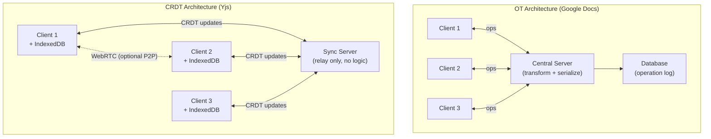

> [!IMPORTANT]
> Với CRDT, server chỉ là **relay/persistence** — không cần logic transform. Client có thể hoạt động hoàn toàn offline và sync khi reconnect. Đây là sự khác biệt kiến trúc lớn nhất.

---

## 6. Transform & Merge — Giải thích chi tiết từng trường hợp

> [!IMPORTANT]
> Đây là phần mấu chốt: **OT dùng transform**, **CRDT dùng merge**. Hai cơ chế hoàn toàn khác nhau để đạt cùng mục tiêu — convergence. Phần này sẽ walk-through từng bước cho từng loại thao tác.

### 6.1 OT Transform — Mọi tổ hợp operations

#### 6.1.1 Nguyên lý: Tại sao phải Transform?

Khi hai user cùng chỉnh sửa đồng thời, op của mỗi người được tạo dựa trên **cùng một trạng thái gốc S**. Nhưng khi op của User B đến User A, document của A đã thay đổi (vì A đã áp dụng op của chính mình). Vì vậy op của B **không còn đúng** nữa → cần **transform** để điều chỉnh.

```
Trạng thái gốc S = "HELLO"
                     01234

User A tạo op_a trên S
User B tạo op_b trên S

Khi A nhận op_b:
  - Document A đang ở trạng thái S·a (đã áp op_a)
  - op_b được tạo cho S, KHÔNG PHẢI S·a
  - → Cần transform: op_b' = T(op_b, op_a)
  - Áp dụng op_b' lên S·a → đúng kết quả
```

#### 6.1.2 Insert vs Insert — Chi tiết từng case

**Case 1: Vị trí khác nhau**

```
S = "ABC"     (index: A=0, B=1, C=2)

User A: Insert(1, 'X')   → "AXBC"    (chèn X sau A)
User B: Insert(3, 'Y')   → "ABCY"    (chèn Y sau C)

--- User A nhận op_b = Insert(3, 'Y') ---
Document A hiện tại: "AXBC"    (đã chèn X)
Transform: T(Insert(3,'Y'), Insert(1,'X'))
  → pa=3 > pb=1 → dịch vị trí: Insert(3+1, 'Y') = Insert(4, 'Y')
Áp dụng Insert(4, 'Y') lên "AXBC" → "AXBCY" ✓

--- User B nhận op_a = Insert(1, 'X') ---
Document B hiện tại: "ABCY"    (đã chèn Y)
Transform: T(Insert(1,'X'), Insert(3,'Y'))
  → pa=1 < pb=3 → giữ nguyên: Insert(1, 'X')
Áp dụng Insert(1, 'X') lên "ABCY" → "AXBCY" ✓

Convergence: cả hai đều ra "AXBCY" ✅
```

**Case 2: Cùng vị trí — cần tiebreak**

```
S = "ABC"

User A (site_id=1): Insert(1, 'X')   → muốn chèn X sau A
User B (site_id=2): Insert(1, 'Y')   → muốn chèn Y sau A

Cả hai cùng chèn tại vị trí 1 — ai đứng trước?
→ Tiebreak bằng site_id: site_id nhỏ hơn thắng

--- User A nhận op_b = Insert(1, 'Y') ---
Transform: T(Insert(1,'Y'), Insert(1,'X'))
  → pa=1 = pb=1, site_id(B)=2 > site_id(A)=1
  → B thua: Insert(1+1, 'Y') = Insert(2, 'Y')
Document A: "AXBC" → áp Insert(2,'Y') → "AXYBC" ✓

--- User B nhận op_a = Insert(1, 'X') ---
Transform: T(Insert(1,'X'), Insert(1,'Y'))
  → pa=1 = pb=1, site_id(A)=1 < site_id(B)=2
  → A thắng: Insert(1, 'X') — giữ nguyên
Document B: "AYBC" → áp Insert(1,'X') → "AXYBC" ✓

Convergence: "AXYBC" — X luôn đứng trước Y ✅
```

> [!NOTE]
> **Tiebreak rule phải nhất quán**: Mọi replica phải dùng cùng rule (site_id nhỏ thắng, hoặc lớn thắng). Nếu không → divergence.

#### 6.1.3 Delete vs Delete — Cùng xóa 1 ký tự

```
S = "ABCDE"

User A: Delete(2)    → xóa 'C' → "ABDE"
User B: Delete(2)    → xóa 'C' → "ABDE"

--- User A nhận op_b = Delete(2) ---
Document A: "ABDE"   (đã xóa C)
Transform: T(Delete(2), Delete(2))
  → pa=2 = pb=2 → NOOP (ký tự đã bị xóa rồi!)
Không làm gì. Document vẫn là "ABDE" ✓

--- User B nhận op_a = Delete(2) ---
Tương tự → NOOP
Document vẫn là "ABDE" ✓
```

**Delete vs Delete — Vị trí khác nhau:**

```
S = "ABCDE"

User A: Delete(1)    → xóa 'B' → "ACDE"
User B: Delete(3)    → xóa 'D' → "ABCE"

--- User A nhận op_b = Delete(3) ---
Document A: "ACDE"  (đã xóa B)
Transform: T(Delete(3), Delete(1))
  → pa=3 > pb=1 → dịch: Delete(3-1) = Delete(2)
Áp dụng Delete(2) lên "ACDE" → xóa 'D' → "ACE" ✓

--- User B nhận op_a = Delete(1) ---
Document B: "ABCE"  (đã xóa D)
Transform: T(Delete(1), Delete(3))
  → pa=1 < pb=3 → giữ nguyên: Delete(1)
Áp dụng Delete(1) lên "ABCE" → xóa 'B' → "ACE" ✓

Convergence: "ACE" ✅
```

#### 6.1.4 Insert vs Delete — Interaction phức tạp nhất

```
S = "ABCDE"

User A: Insert(2, 'X')   → "ABXCDE"   (chèn X trước C)
User B: Delete(3)         → "ABCE"     (xóa D tại index 3)

--- User A nhận op_b = Delete(3) ---
Document A: "ABXCDE"
Transform: T(Delete(3), Insert(2,'X'))
  → pa=3 ≥ pb=2 → dịch: Delete(3+1) = Delete(4)
Áp dụng Delete(4) lên "ABXCDE" → xóa 'D' → "ABXCE" ✓

--- User B nhận op_a = Insert(2, 'X') ---
Document B: "ABCE"
Transform: T(Insert(2,'X'), Delete(3))
  → pa=2 ≤ pb=3 → giữ nguyên: Insert(2, 'X')
Áp dụng Insert(2,'X') lên "ABCE" → "ABXCE" ✓

Convergence: "ABXCE" ✅
```

#### 6.1.5 Tóm tắt bảng Transform hoàn chỉnh

```
╔═══════════════════╦══════════════════════════════╦════════════════════════════╗
║  T(a, b)          ║  b = Insert(pb, cb)          ║  b = Delete(pb)            ║
╠═══════════════════╬══════════════════════════════╬════════════════════════════╣
║                   ║  pa < pb  → Insert(pa, ca)   ║  pa < pb  → Insert(pa, ca) ║
║  a = Insert(pa,ca)║  pa > pb  → Insert(pa+1, ca) ║  pa > pb  → Insert(pa-1,ca)║
║                   ║  pa = pb  → tiebreak(site_id)║  pa = pb  → Insert(pa, ca) ║
╠═══════════════════╬══════════════════════════════╬════════════════════════════╣
║                   ║  pa < pb  → Delete(pa)       ║  pa < pb  → Delete(pa)     ║
║  a = Delete(pa)   ║  pa ≥ pb  → Delete(pa+1)     ║  pa > pb  → Delete(pa-1)   ║
║                   ║                              ║  pa = pb  → NOOP           ║
╚═══════════════════╩══════════════════════════════╩════════════════════════════╝
```

#### 6.1.6 Rich Text Operations — Format, Retain, Embed

Google Docs và Quill không chỉ dùng Insert/Delete. Rich text OT dùng **Delta format** với 3 ops:

```javascript
// Quill Delta format
{
  ops: [
    { retain: 5 },                          // giữ nguyên 5 ký tự
    { insert: "World", attributes: { bold: true } },  // chèn "World" in bold
    { delete: 3 },                          // xóa 3 ký tự tiếp theo
    { retain: 2, attributes: { italic: true } },      // format 2 ký tự thành italic
  ]
}
```

**Transform với Retain (format change):**

```
S = "Hello World"      (plain text, không format)

User A: { retain: 5, attributes: { bold: true } }
  → "**Hello** World"   (bold 5 ký tự đầu)

User B: { retain: 3, delete: 2 }
  → "Hel World"         (xóa "lo")

--- Transform ---
T(op_a, op_b):
  op_b xóa 2 ký tự ở vị trí 3-4
  op_a bold 5 ký tự (0-4)
  
  Sau khi B xóa → "Hel World" (chỉ còn 3 ký tự "Hel")
  op_a' cần điều chỉnh: bold chỉ 3 ký tự (không phải 5, vì 2 đã bị xóa)
  → { retain: 3, attributes: { bold: true } }

Kết quả: "**Hel** World" ✓
```

> [!WARNING]
> **Đây là lý do OT cho rich text CỰC KỲ phức tạp**: Mỗi loại attribute (bold, italic, color, link, embed...) đều cần transform rules riêng. Quill Delta library đã xử lý hầu hết, nhưng custom attributes cần thêm logic.

#### 6.1.7 Chuỗi Transform — Khi có >2 ops đồng thời

Trong thực tế, khi client offline rồi reconnect, có thể có **N ops** cần transform:

```
Client đang ở revision 5, server đang ở revision 8
→ Client gửi op, nhưng cần transform qua 3 ops (rev 6, 7, 8)

op_client' = T(T(T(op_client, op_6), op_7), op_8)
```

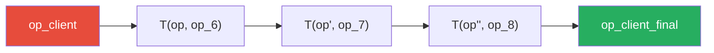

Đây là lý do OT có complexity **O(H)** cho mỗi op, với H = số ops chưa transform.

---

### 6.2 CRDT Merge — Mọi thao tác tự hội tụ

#### 6.2.1 Nguyên lý: Tại sao không cần Transform?

CRDT thiết kế cấu trúc dữ liệu sao cho **mọi concurrent operations đều commutative** — áp dụng theo bất kỳ thứ tự nào đều cho cùng kết quả. Không cần transform vì không có conflict "thật sự".

```
Với OT:
  S + op_a + T(op_b, op_a)  =  S + op_b + T(op_a, op_b)
  → Phải TÍNH TOÁN transform

Với CRDT:
  S + op_a + op_b  =  S + op_b + op_a
  → ĐÚNG BY DESIGN, không cần tính gì
```

#### 6.2.2 State-based Merge: G-Counter — Từng bước

G-Counter (Grow-only Counter) là CRDT đơn giản nhất. Mỗi replica giữ một vector, merge bằng pointwise max.

```
3 replicas: A, B, C
Mỗi replica giữ vector [countA, countB, countC]

═══ Bước 1: Khởi tạo ═══
  A = [0, 0, 0]    total = 0
  B = [0, 0, 0]    total = 0
  C = [0, 0, 0]    total = 0

═══ Bước 2: Các replica increment độc lập ═══
  A tự increment 2 lần:   A = [2, 0, 0]    total = 2
  B tự increment 3 lần:   B = [0, 3, 0]    total = 3
  C tự increment 1 lần:   C = [0, 0, 1]    total = 1

═══ Bước 3: A gửi state cho B — MERGE ═══
  B.merge(A):
    B_new[0] = max(B[0], A[0]) = max(0, 2) = 2
    B_new[1] = max(B[1], A[1]) = max(3, 0) = 3
    B_new[2] = max(B[2], A[2]) = max(0, 0) = 0
  
  B = [2, 3, 0]    total = 5

═══ Bước 4: C gửi state cho B — MERGE ═══
  B.merge(C):
    B_new[0] = max(2, 0) = 2
    B_new[1] = max(3, 0) = 3
    B_new[2] = max(0, 1) = 1
  
  B = [2, 3, 1]    total = 6    ← đúng! (2+3+1 = 6 increments)

═══ Bước 5: B gửi state cho A và C ═══
  A.merge(B) → A = [max(2,2), max(0,3), max(0,1)] = [2, 3, 1]   total = 6
  C.merge(B) → C = [max(0,2), max(0,3), max(1,1)] = [2, 3, 1]   total = 6

✅ Mọi replica đều = [2, 3, 1], total = 6 — CONVERGENCE!
```

**Tại sao merge bằng `max` hoạt động?**

```
Tính chất của max:
  max(a, b) = max(b, a)              ← commutative  (thứ tự merge không quan trọng)
  max(max(a,b), c) = max(a, max(b,c)) ← associative  (nhóm merge không quan trọng)
  max(a, a) = a                       ← idempotent   (merge cùng state nhiều lần OK)

→ Bất kể thứ tự nhận message, duplicate message → kết quả luôn đúng!
```

#### 6.2.3 State-based Merge: OR-Set — Add/Remove conflict

OR-Set (Observed-Remove Set) xử lý conflict giữa add và remove bằng **unique tags**:

```
═══ Khởi tạo ═══
  A.set = {}
  B.set = {}

═══ Bước 1: A thêm "apple" ═══
  A tạo unique tag: tag_1
  A.set = { ("apple", tag_1) }

═══ Bước 2: Sync A → B ═══
  B.merge(A)
  B.set = { ("apple", tag_1) }

═══ Bước 3: Concurrent operations! ═══
  A: remove("apple")
    → A biết "apple" có tag_1 → đánh dấu tag_1 removed
    → A.add_set    = { ("apple", tag_1) }
    → A.remove_set = { tag_1 }
    → A nhìn thấy: {} (empty — apple đã bị remove)

  B: add("apple")  (thêm lại apple, ĐỒNG THỜI với remove của A)
    → B tạo tag mới: tag_2
    → B.add_set    = { ("apple", tag_1), ("apple", tag_2) }
    → B.remove_set = {}
    → B nhìn thấy: { "apple" }

═══ Bước 4: MERGE ═══
  A.merge(B):
    add_set    = union = { ("apple", tag_1), ("apple", tag_2) }
    remove_set = union = { tag_1 }
    
    Visible items = add_set entries WHERE tag NOT IN remove_set
    → ("apple", tag_1): tag_1 ∈ remove_set → ❌ removed
    → ("apple", tag_2): tag_2 ∉ remove_set → ✅ visible!
    
    A nhìn thấy: { "apple" } ✓

  B.merge(A):
    add_set    = union = { ("apple", tag_1), ("apple", tag_2) }
    remove_set = union = { tag_1 }
    
    → ("apple", tag_1): removed ❌
    → ("apple", tag_2): visible ✅
    
    B nhìn thấy: { "apple" } ✓

✅ CONVERGENCE! Apple vẫn tồn tại vì B thêm lại SAU khi A remove.
   Semantics đúng: "add-wins" — nếu ai đó thêm lại concurrent với remove,
   item sống sót.
```

> [!TIP]
> **OR-Set = "Add wins"**: Khi add và remove xảy ra đồng thời, add thắng. Đây là behavior mặc định hợp lý cho hầu hết ứng dụng (shopping cart, tag list...). Nếu muốn "remove wins", cần dùng **RWO-Set** (Remove-Wins Observed Set).

#### 6.2.4 Operation-based Merge: RGA cho Text — Từng bước

Đây là cách CRDT sequence (RGA) xử lý concurrent insert mà **không cần transform**:

```
═══ Document ban đầu ═══
  [ (id:A0, char:'H'), (id:A1, char:'i') ]
  Visible: "Hi"

═══ User A và User B đồng thời chèn sau 'H' ═══

User A: insert(after: A0, char: 'X', id: A2)
  → Ý định: chèn X giữa H và i

User B: insert(after: A0, char: 'Y', id: B1)
  → Ý định: chèn Y giữa H và i

═══ User A áp dụng local, rồi nhận op của B ═══

Sau local:  [ A0:'H', A2:'X', A1:'i' ]  → "HXi"

Nhận op B: insert(after: A0, char: 'Y', id: B1)
  → Tìm A0 ('H'), cần chèn 'Y' sau nó
  → Nhưng đã có A2:'X' ở đó!
  → CONFLICT RESOLUTION:
    So sánh ID: A2=(clock:2, replica:A) vs B1=(clock:1, replica:B)
    Timestamp A2.clock=2 > B1.clock=1 → A2 đứng TRƯỚC
    (hoặc nếu timestamp bằng → so sánh replica ID)
  → Kết quả: [ A0:'H', A2:'X', B1:'Y', A1:'i' ]
  → Visible: "HXYi"

═══ User B áp dụng local, rồi nhận op của A ═══

Sau local:  [ A0:'H', B1:'Y', A1:'i' ]  → "HYi"

Nhận op A: insert(after: A0, char: 'X', id: A2)
  → Tìm A0 ('H'), cần chèn 'X' sau nó
  → Đã có B1:'Y' ở đó!
  → CONFLICT RESOLUTION: A2.clock=2 > B1.clock=1 → A2 đứng TRƯỚC
  → Kết quả: [ A0:'H', A2:'X', B1:'Y', A1:'i' ]
  → Visible: "HXYi"

✅ CONVERGENCE! Cùng kết quả "HXYi" mà KHÔNG CẦN TRANSFORM!
```

#### 6.2.5 So sánh cơ chế: Transform vs Merge

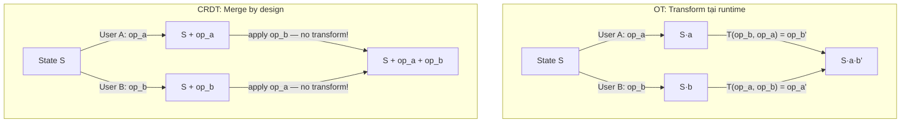

| Aspect | OT Transform | CRDT Merge |
|---|---|---|
| **Khi nào tính?** | Runtime — mỗi khi nhận concurrent op | Design time — built into data structure |
| **Cần server?** | Gần như bắt buộc (serialize ops) | Không — merge ở client |
| **Complexity** | O(H) per op (H = history) | O(1) per op (amortized) |
| **Correctness** | Phải chứng minh TP1 + TP2 | Chứng minh commutativity / semilattice |
| **Memory** | Thấp (chỉ document) | Cao hơn (unique IDs, tombstones) |
| **Offline** | Rất khó | Tự nhiên |

---

## 7. Challenges & Advanced Topics

### 7.1 Tombstone Garbage Collection

```javascript
// Naive GC strategy cho RGA
class GarbageCollector {
  // Chỉ GC khi TẤT CẢ replicas đã "thấy" deletion
  canCollect(tombstone, versionVectors) {
    // version vector của mỗi replica phải ≥ deletion timestamp
    return Object.entries(versionVectors).every(
      ([replicaId, vector]) => 
        vector[tombstone.deletedBy.replica] >= tombstone.deletedBy.clock
    );
  }
  
  // Yjs approach: GC theo "struct" blocks
  // Khi một run of deleted items liên tiếp → merge thành 1 GC block
  // Chỉ giữ length, không giữ content
}
```

### 7.2 Undo/Redo trong CRDT

```javascript
// Yjs UndoManager
import { UndoManager } from 'yjs';

const ytext = ydoc.getText('content');
const undoManager = new UndoManager(ytext, {
  // Chỉ undo thao tác của local user
  trackedOrigins: new Set([null]),  // null = local changes
  captureTimeout: 500,  // Group ops within 500ms
});

// Ctrl+Z
undoManager.undo();

// Ctrl+Y  
undoManager.redo();

// Stack info
undoManager.undoStack.length;
undoManager.redoStack.length;
```

### 7.3 Awareness Protocol (Cursors & Presence)

```javascript
// Yjs Awareness — không phải CRDT, là ephemeral state
const awareness = wsProvider.awareness;

// Set local user info
awareness.setLocalStateField('user', {
  name: 'Alice',
  color: '#e74c3c',
});

// Set cursor position
awareness.setLocalStateField('cursor', {
  anchor: { index: 5 },
  head: { index: 10 },
});

// Listen for remote users
awareness.on('change', ({ added, updated, removed }) => {
  const states = awareness.getStates();
  states.forEach((state, clientId) => {
    if (clientId !== ydoc.clientID) {
      console.log(`User ${state.user?.name} cursor at ${state.cursor?.anchor?.index}`);
    }
  });
});
```

### 7.4 Intent Preservation — Vấn đề muôn thuở

```
Scenario: Move element from list A to list B

User 1: Delete item X from list A, Insert X into list B  (intent: MOVE)
User 2: Edit item X in list A                            (intent: MODIFY)

Concurrent result:
  - List A: item X deleted (from User 1) but also modified (from User 2)?
  - List B: item X appears (from User 1) but without User 2's edit?

→ CRDT: X exists in both lists (duplicate!) or edit is lost
→ OT: Depends on transform function design — equally hard
```

> [!WARNING]
> **Cả OT lẫn CRDT đều không giải quyết hoàn hảo intent preservation cho mọi trường hợp.** Với semantic operations phức tạp (move, reorder, structural changes), cần thiết kế application-level conflict resolution.

---

## 8. Open Source Projects triển khai Collaborative Editing

### 8.1 Collaborative Whiteboards

| Project | Tech Stack | Sync Mechanism | License | Stars |
|---|---|---|---|---|
| **[Excalidraw](https://github.com/excalidraw/excalidraw)** | React, TypeScript | Pseudo-P2P relay + E2E encryption | MIT | 95k+ |
| **[tldraw](https://github.com/tldraw/tldraw)** | React, TypeScript | Client-Server (`@tldraw/sync`) + optimistic rebase | Apache 2.0 (core) | 40k+ |
| **[AFFiNE](https://github.com/toeverything/AFFiNE)** | TypeScript, Yjs (OctoBase) | CRDT (Yjs-based) + WebSocket | MIT | 45k+ |
| **[Ourboard](https://github.com/raimohanska/ourboard)** | TypeScript | Custom event-based sync | MIT | ~1k |

#### Đánh giá so sánh Whiteboards

| Tiêu chí | Excalidraw | tldraw | AFFiNE | Ourboard |
|---|---|---|---|---|
| **Real-time Collab Quality** | ⭐⭐⭐⭐ Tốt, LWW per element | ⭐⭐⭐⭐⭐ Xuất sắc, authoritative server | ⭐⭐⭐⭐ Tốt, Yjs-based | ⭐⭐⭐ Cơ bản |
| **Offline Support** | ⭐⭐⭐ IndexedDB, limited | ⭐⭐⭐ Optimistic local | ⭐⭐⭐⭐⭐ Local-first, Yjs | ⭐⭐ Không hỗ trợ |
| **Privacy & Security** | ⭐⭐⭐⭐⭐ E2E encrypted | ⭐⭐⭐ Server-side persistence | ⭐⭐⭐⭐ Self-host available | ⭐⭐⭐ Self-host |
| **Extensibility / SDK** | ⭐⭐⭐ React component, limited API | ⭐⭐⭐⭐⭐ Full SDK, custom shapes | ⭐⭐⭐⭐ BlockSuite API | ⭐⭐ Minimal |
| **Performance (large canvas)** | ⭐⭐⭐⭐ Tốt, Canvas 2D | ⭐⭐⭐⭐⭐ Excellent, optimized | ⭐⭐⭐ Chậm hơn với >1000 elements | ⭐⭐⭐ OK |
| **Production Readiness** | ⭐⭐⭐⭐⭐ Proven, used by millions | ⭐⭐⭐⭐⭐ Enterprise-ready | ⭐⭐⭐⭐ Growing, beta features | ⭐⭐ Side project |
| **Learning Curve** | ⭐⭐⭐⭐⭐ Dễ embed | ⭐⭐⭐⭐ Cần hiểu SDK | ⭐⭐⭐ Complex architecture | ⭐⭐⭐⭐ Đơn giản |
| **Community & Ecosystem** | ⭐⭐⭐⭐⭐ Rất lớn, plugins | ⭐⭐⭐⭐⭐ Lớn, active | ⭐⭐⭐⭐ Đang phát triển | ⭐⭐ Nhỏ |
| **Self-hosting Difficulty** | ⭐⭐⭐⭐ Dễ (Docker) | ⭐⭐⭐ Cần Cloudflare/Infra | ⭐⭐⭐⭐ Docker compose | ⭐⭐⭐⭐⭐ Rất dễ |
| **Conflict Resolution** | LWW per element | Server-authoritative + rebase | CRDT (Yjs merge) | Event-based, basic |

> [!TIP]
> **Khuyến nghị**:
> - **MVP / Privacy-first** → Excalidraw (E2E encryption, dễ deploy)
> - **Production / Custom SDK** → tldraw (best sync engine, extensible)
> - **All-in-one workspace** → AFFiNE (whiteboard + docs + database)

#### Excalidraw — Kiến trúc chi tiết

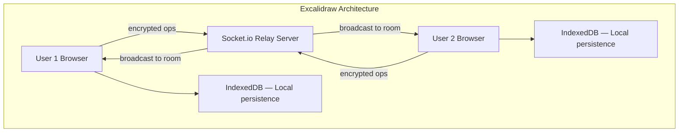

- **Sync model**: Mỗi element (shape, stroke) là một `ExcalidrawElement` object
- **Conflict resolution**: Last-Writer-Wins per element (dùng `version` field)
- **E2E Encryption**: Key nằm trong URL hash (`#key=...`), server không thể đọc
- **Không dùng CRDT framework**: Custom implementation, đơn giản hóa vì whiteboard elements ít conflict hơn text

#### tldraw — Kiến trúc chi tiết

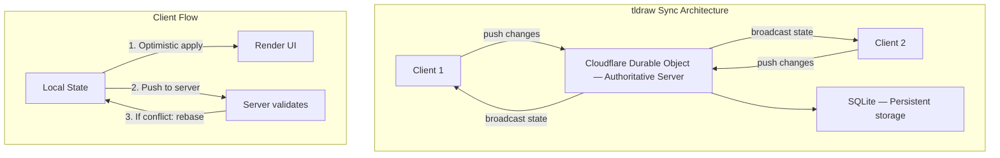

- **Sync engine**: `@tldraw/sync` — Git-like push/pull/rebase model
- **Conflict handling**: Server là authoritative, client rebase local changes
- **Production stack**: Cloudflare Durable Objects + SQLite per room
- **Có thể kết hợp Yjs**: Cho granular property-level merging

---

### 8.2 Collaborative Text/Document Editors

| Project | Tech Stack | Sync Mechanism | Editor | License |
|---|---|---|---|---|
| **[Etherpad](https://github.com/ether/etherpad-lite)** | Node.js | OT (Easysync) | Custom | Apache 2.0 |
| **[HedgeDoc](https://github.com/hedgedoc/hedgedoc)** | TypeScript, Node.js | OT | CodeMirror | AGPL-3.0 |
| **[AFFiNE](https://github.com/toeverything/AFFiNE)** | TypeScript, Yjs | CRDT (BlockSuite + Yjs) | Custom (BlockSuite) | MIT |
| **[AppFlowy](https://github.com/AppFlowy-IO/AppFlowy)** | Rust, Flutter | CRDT (custom) | Custom | AGPL-3.0 |
| **[BlockNote](https://github.com/TypeCellOS/BlockNote)** | TypeScript, Yjs | CRDT (Yjs) | ProseMirror | MPL 2.0 |
| **[Tiptap](https://github.com/ueberdosis/tiptap)** | TypeScript, Yjs | CRDT (Yjs via Hocuspocus) | ProseMirror | MIT |
| **[Novel](https://github.com/steven-tey/novel)** | TypeScript | CRDT (Yjs optional) | Tiptap/ProseMirror | Apache 2.0 |

#### Đánh giá so sánh Text/Document Editors

| Tiêu chí | Etherpad | HedgeDoc | AFFiNE | AppFlowy | BlockNote | Tiptap | Novel |
|---|---|---|---|---|---|---|---|
| **Sync Algorithm** | OT (Easysync) | OT | CRDT (Yjs) | CRDT (custom) | CRDT (Yjs) | CRDT (Yjs) | CRDT (Yjs) |
| **Rich Text Quality** | ⭐⭐⭐ Basic | ⭐⭐⭐ Markdown | ⭐⭐⭐⭐⭐ Block-based | ⭐⭐⭐⭐ Block-based | ⭐⭐⭐⭐⭐ Block-based | ⭐⭐⭐⭐⭐ Highly custom | ⭐⭐⭐⭐ Notion-like |
| **Offline Support** | ❌ Server-dependent | ❌ Server-dependent | ⭐⭐⭐⭐⭐ Local-first | ⭐⭐⭐⭐ Local SQLite | ⭐⭐⭐⭐ Via Yjs | ⭐⭐⭐⭐ Via Yjs | ⭐⭐⭐ Limited |
| **Real-time Collab** | ⭐⭐⭐⭐⭐ Core feature | ⭐⭐⭐⭐ Good | ⭐⭐⭐⭐⭐ Core feature | ⭐⭐⭐ In development | ⭐⭐⭐⭐ Good | ⭐⭐⭐⭐⭐ Excellent | ⭐⭐⭐ Add-on |
| **Extensibility** | ⭐⭐⭐⭐ Plugin system | ⭐⭐⭐ Limited | ⭐⭐⭐⭐ BlockSuite | ⭐⭐⭐ Plugin system | ⭐⭐⭐⭐⭐ React blocks | ⭐⭐⭐⭐⭐ Extensions | ⭐⭐⭐ Fork-based |
| **Performance** | ⭐⭐⭐ OK for small docs | ⭐⭐⭐ OK | ⭐⭐⭐⭐ Good | ⭐⭐⭐⭐⭐ Rust core | ⭐⭐⭐⭐ Good | ⭐⭐⭐⭐ Good | ⭐⭐⭐⭐ Good |
| **Production Readiness** | ⭐⭐⭐⭐⭐ 15+ năm | ⭐⭐⭐⭐ Stable | ⭐⭐⭐⭐ Growing | ⭐⭐⭐ Alpha/Beta | ⭐⭐⭐⭐ Stable | ⭐⭐⭐⭐⭐ Enterprise | ⭐⭐⭐⭐ Stable |
| **Learning Curve** | ⭐⭐⭐⭐⭐ Rất dễ | ⭐⭐⭐⭐ Dễ | ⭐⭐⭐ Phức tạp | ⭐⭐ Rust + Flutter | ⭐⭐⭐⭐⭐ Rất dễ | ⭐⭐⭐⭐ Moderate | ⭐⭐⭐⭐⭐ Rất dễ |
| **Community** | ⭐⭐⭐⭐ Lớn, mature | ⭐⭐⭐ Moderate | ⭐⭐⭐⭐⭐ Growing fast | ⭐⭐⭐⭐ Active | ⭐⭐⭐ Growing | ⭐⭐⭐⭐⭐ Rất lớn | ⭐⭐⭐⭐ Active |
| **Self-hosting** | ⭐⭐⭐⭐⭐ Docker, simple | ⭐⭐⭐⭐ Docker | ⭐⭐⭐⭐ Docker compose | ⭐⭐⭐⭐ Docker | N/A (library) | N/A (library) | N/A (library) |
| **Mobile Support** | ⭐⭐ Web only | ⭐⭐ Web only | ⭐⭐⭐ Web + mobile WIP | ⭐⭐⭐⭐⭐ Native Flutter | N/A | N/A | N/A |
| **Use Case** | Simple collab pad | Markdown collab | All-in-one workspace | Notion alt (native) | Embed block editor | Embed rich editor | Notion-like editor |

> [!TIP]
> **Khuyến nghị theo use case**:
> - **Nhanh, đơn giản, self-host** → Etherpad (battle-tested 15+ năm)
> - **Markdown collaboration** → HedgeDoc
> - **All-in-one workspace (Notion + Miro)** → AFFiNE
> - **Native mobile app** → AppFlowy (Flutter + Rust)
> - **Embed editor vào React app** → BlockNote (dễ nhất) hoặc Tiptap (flexible nhất)
> - **Notion-style cho SaaS** → Novel (nhẹ, dễ customize)

#### Etherpad — OT trong thực tế

```
Etherpad sử dụng Easysync protocol (OT-based):

1. Mỗi revision là một "changeset" — chuỗi operations
2. Format: Z:length>insertions<deletions*attributeChanges$newText

Ví dụ changeset:
  Z:6>1=4*0+1$X     
  ↑    ↑ ↑  ↑  ↑
  |    | |  |  └── text chèn: "X"
  |    | |  └───── chèn 1 ký tự với attribute 0
  |    | └──────── giữ nguyên 4 ký tự
  |    └────────── net thêm 1 ký tự
  └─────────────── document length = 6

Server serialize tất cả changesets → OT classic client-server model
```

#### AFFiNE — CRDT-based Notion alternative

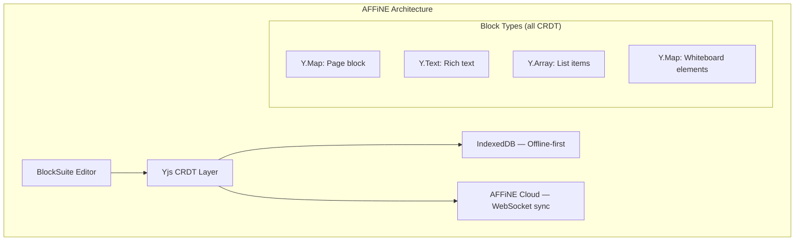

---

### 8.3 Collaborative Code Editors

| Project | Tech Stack | Sync Mechanism | License |
|---|---|---|---|
| **[Zed](https://github.com/zed-industries/zed)** | Rust | CRDT (custom) | Apache 2.0 |
| **[Conclave](https://github.com/conclave-team/conclave)** | JavaScript, WebRTC | CRDT (LSEQ) | MIT |
| **[CodeMirror 6](https://github.com/codemirror/collab)** | TypeScript | OT (`@codemirror/collab`) | MIT |
| **[Monaco + Yjs](https://github.com/nicoth-in/yjs-monaco)** | TypeScript, Yjs | CRDT (Yjs) | MIT |

#### Đánh giá so sánh Code Editors

| Tiêu chí | Zed | Conclave | CodeMirror 6 | Monaco + Yjs |
|---|---|---|---|---|
| **Sync Algorithm** | CRDT (custom Rust) | CRDT (LSEQ) | OT (collab ext) | CRDT (Yjs) |
| **Architecture** | Native desktop app | Web P2P (WebRTC) | Library (embeddable) | Library (embeddable) |
| **Real-time Quality** | ⭐⭐⭐⭐⭐ Native, ultra-low latency | ⭐⭐⭐ P2P, variable | ⭐⭐⭐⭐ Good with server | ⭐⭐⭐⭐ Good with Yjs provider |
| **Offline Support** | ⭐⭐⭐ Limited (needs server) | ⭐⭐⭐⭐ P2P, partial | ⭐⭐ Server-dependent | ⭐⭐⭐⭐ Yjs offline |
| **Language Support** | ⭐⭐⭐⭐⭐ Tree-sitter, LSP | ⭐⭐ Basic syntax | ⭐⭐⭐⭐⭐ Excellent, extensible | ⭐⭐⭐⭐⭐ VS Code level |
| **Performance** | ⭐⭐⭐⭐⭐ Rust native, GPU | ⭐⭐⭐ Browser-limited | ⭐⭐⭐⭐⭐ Highly optimized | ⭐⭐⭐⭐ Good |
| **Cursor/Presence** | ⭐⭐⭐⭐⭐ Native + follow mode | ⭐⭐⭐ Basic cursors | ⭐⭐⭐⭐ Via extensions | ⭐⭐⭐⭐ Via Yjs awareness |
| **Production Readiness** | ⭐⭐⭐⭐⭐ Daily-use ready | ⭐⭐ Educational | ⭐⭐⭐⭐⭐ Used everywhere | ⭐⭐⭐⭐ Stable integration |
| **Learning Curve** | N/A (end-user app) | ⭐⭐⭐⭐ Good for learning | ⭐⭐⭐ Moderate | ⭐⭐⭐ Moderate |
| **Maintained** | ⭐⭐⭐⭐⭐ Very active | ⭐ Archived | ⭐⭐⭐⭐⭐ Active | ⭐⭐⭐ Community |
| **Best For** | Team code collaboration | Learning CRDTs | Custom web IDE | VS Code-like web IDE |

> [!TIP]
> **Khuyến nghị**:
> - **Desktop collaboration** → Zed (best native experience)
> - **Học CRDT** → Conclave (đơn giản, tốt cho educational)
> - **Custom web IDE (lightweight)** → CodeMirror 6 + `@codemirror/collab`
> - **VS Code-like web IDE** → Monaco + Yjs

#### Zed Editor — Native CRDT Collaboration

```
Zed's collaboration architecture:
  1. Mỗi file là một CRDT buffer (custom implementation in Rust)
  2. Operations: Insert(position, text), Delete(range)
  3. Conflict resolution: CRDT — mọi edit đều commutative
  4. Transport: gRPC over QUIC protocol
  5. Presence: Real-time cursors, selections, diagnostics sharing
  
Unique features:
  - "Follow mode": xem màn hình collaborator real-time
  - Shared terminal sessions
  - Shared language server (LSP) diagnostics
```

---

### 8.4 CRDT/OT Libraries & Frameworks

| Library | Language | Type | Best For |
|---|---|---|---|
| **[Yjs](https://github.com/yjs/yjs)** | JavaScript/TypeScript | CRDT (YATA) | Production editors, whiteboards |
| **[Automerge](https://github.com/automerge/automerge)** | Rust + JS/Swift/Python | CRDT (RGA + LWW) | Local-first apps, version history |
| **[Loro](https://github.com/loro-dev/loro)** | Rust + JS (WASM) | CRDT (Fugue) | High-performance, emerging |
| **[Diamond Types](https://github.com/josephg/diamond-types)** | Rust | CRDT | Experimental, ultra-fast |
| **[ShareDB](https://github.com/share/sharedb)** | JavaScript/Node.js | OT | Server-centric real-time |
| **[ot.js](https://github.com/Operational-Transformation/ot.js)** | JavaScript | OT | Simple text OT |
| **[Hocuspocus](https://github.com/ueberdosis/hocuspocus)** | TypeScript | Yjs Server | Production Yjs backend |
| **[y-sweet](https://github.com/drifting-in-space/y-sweet)** | Rust | Yjs Server | Scalable Yjs backend |

#### Đánh giá so sánh Libraries & Frameworks

| Tiêu chí | Yjs | Automerge | Loro | Diamond Types | ShareDB | ot.js | Hocuspocus | y-sweet |
|---|---|---|---|---|---|---|---|---|
| **Algorithm** | YATA | RGA + LWW | Fugue | Custom CRDT | OT | OT | Yjs relay | Yjs relay |
| **Type** | CRDT | CRDT | CRDT | CRDT | OT | OT | Server | Server |
| **Maturity** | ⭐⭐⭐⭐⭐ | ⭐⭐⭐⭐ | ⭐⭐⭐ | ⭐⭐ | ⭐⭐⭐⭐⭐ | ⭐⭐⭐⭐ | ⭐⭐⭐⭐ | ⭐⭐⭐ |
| **Performance** | ⭐⭐⭐⭐⭐ | ⭐⭐⭐⭐ | ⭐⭐⭐⭐⭐ | ⭐⭐⭐⭐⭐ | ⭐⭐⭐⭐ | ⭐⭐⭐ | ⭐⭐⭐⭐ | ⭐⭐⭐⭐⭐ |
| **Memory Efficiency** | ⭐⭐⭐⭐ GC blocks | ⭐⭐⭐ Full history | ⭐⭐⭐⭐⭐ Optimized | ⭐⭐⭐⭐⭐ Minimal | ⭐⭐⭐⭐⭐ OT minimal | ⭐⭐⭐⭐⭐ Minimal | N/A | N/A |
| **Offline / P2P** | ⭐⭐⭐⭐⭐ Native | ⭐⭐⭐⭐⭐ Native | ⭐⭐⭐⭐⭐ Native | ⭐⭐⭐⭐ Native | ❌ Server-required | ❌ Server-required | ❌ Server | ❌ Server |
| **Version History** | ⭐⭐ Snapshot only | ⭐⭐⭐⭐⭐ Git-like DAG | ⭐⭐⭐⭐ Good | ⭐⭐⭐ Basic | ⭐⭐⭐⭐ Op log | ⭐⭐ Basic | Via Yjs | Via Yjs |
| **Editor Bindings** | ⭐⭐⭐⭐⭐ Quill, ProseMirror, Monaco, CodeMirror, Slate | ⭐⭐⭐ ProseMirror | ⭐⭐⭐ Growing | ⭐ None | ⭐⭐⭐⭐ Quill, CodeMirror | ⭐⭐⭐ CodeMirror | Via Yjs | Via Yjs |
| **Multi-language** | JS only | ⭐⭐⭐⭐⭐ Rust, JS, Swift, Python, C | ⭐⭐⭐⭐ Rust, JS | Rust only | JS only | JS only | TS only | Rust + JS |
| **Documentation** | ⭐⭐⭐⭐⭐ | ⭐⭐⭐⭐ | ⭐⭐⭐ | ⭐⭐ | ⭐⭐⭐⭐ | ⭐⭐⭐ | ⭐⭐⭐⭐⭐ | ⭐⭐⭐ |
| **Community** | ⭐⭐⭐⭐⭐ Largest | ⭐⭐⭐⭐ Strong | ⭐⭐⭐ Growing | ⭐⭐ Niche | ⭐⭐⭐⭐ Stable | ⭐⭐⭐ Declining | ⭐⭐⭐⭐ Active | ⭐⭐⭐ New |
| **Structured Data** | ⭐⭐⭐⭐ Y.Map, Y.Array, Y.Text | ⭐⭐⭐⭐⭐ Native JSON | ⭐⭐⭐⭐⭐ Rich types | ⭐⭐ Text only | ⭐⭐⭐⭐ JSON OT | ⭐⭐ Text only | Via Yjs | Via Yjs |
| **Bundle Size** | ~15KB gzipped | ~700KB (WASM) | ~200KB (WASM) | N/A (Rust) | ~30KB | ~5KB | Server-side | Server-side |

> [!IMPORTANT]
> **Phân tích chi tiết từng tiêu chí quan trọng:**
>
> **Performance benchmark (text editing, 100k ops):**
> - Diamond Types > Loro > Yjs >> Automerge (Seph Gentle benchmarks)
> - Yjs vẫn "đủ nhanh" cho 99% use cases
>
> **Memory footprint (1MB document after heavy editing):**
> - OT (ShareDB): ~1MB (chỉ document)
> - Yjs: ~2-5MB (document + metadata + GC blocks)
> - Automerge: ~10-50MB (full history DAG)
> - Loro: ~1.5-3MB (optimized encoding)

#### Bảng quyết định chọn Library

```
╔═══════════════════════════════╦═══════════════════════╦══════════════════╗
║  Yêu cầu                     ║  Chọn                 ║  Lý do           ║
╠═══════════════════════════════╬═══════════════════════╬══════════════════╣
║  Web editor, cần nhanh        ║  Yjs                  ║  Ecosystem lớn   ║
║  Mobile + Web + Desktop       ║  Automerge            ║  Multi-language   ║
║  Performance-critical          ║  Loro hoặc Diamond    ║  Rust core       ║
║  Server-centric, simple       ║  ShareDB              ║  Proven OT       ║
║  Yjs backend, managed         ║  Hocuspocus           ║  Auth, hooks     ║
║  Yjs backend, scalable        ║  y-sweet              ║  Rust, S3 persist║
║  Learning / prototype         ║  ot.js                ║  Đơn giản nhất   ║
║  Git-like versioning          ║  Automerge            ║  History DAG     ║
╚═══════════════════════════════╩═══════════════════════╩══════════════════╝
```

---

### 8.5 Tổng hợp: Radar Chart — So sánh theo category

#### Whiteboards Radar

```
                    Performance
                        │
                   5 ╌╌╌┼╌╌╌ 5
                  ╱     │     ╲
    Privacy  4 ╌╌╱╌╌╌╌╌╌┼╌╌╌╌╌╌╲╌╌ 4  Extensibility
              ╱         │         ╲
         3 ╌╌╱╌╌╌╌╌╌╌╌╌╌┼╌╌╌╌╌╌╌╌╌╌╲╌╌ 3
            │            │            │
    Offline ┼╌╌╌╌╌╌╌╌╌╌╌┼╌╌╌╌╌╌╌╌╌╌╌┤  Community
            │            │            │
            ╲            │           ╱
             ╲╌╌╌╌╌╌╌╌╌╌┼╌╌╌╌╌╌╌╌╌╱
                         │
                  Collab Quality

  Excalidraw: ██████ Privacy=5, Community=5, Performance=4
  tldraw:     ██████ Extensibility=5, Performance=5, Collab=5
  AFFiNE:     ██████ Offline=5, Collab=4, Community=4
```

#### Tổng hợp điểm theo category

| Category | 🥇 Best Overall | 🥈 Runner-up | 🏅 Best for Learning |
|---|---|---|---|
| **Whiteboards** | tldraw (sync engine + SDK) | Excalidraw (community + privacy) | Excalidraw (simplest arch) |
| **Text Editors** | Tiptap (extensibility + ecosystem) | AFFiNE (all-in-one) | Etherpad (OT classic) |
| **Code Editors** | Zed (native performance) | CodeMirror 6 (web, flexible) | Conclave (CRDT educational) |
| **CRDT Libraries** | Yjs (ecosystem + maturity) | Automerge (versioning + multi-lang) | ot.js (simplest OT) |
| **CRDT Servers** | Hocuspocus (features) | y-sweet (performance) | ShareDB (OT simplest) |

---

### 8.6 Chọn project nào để học?

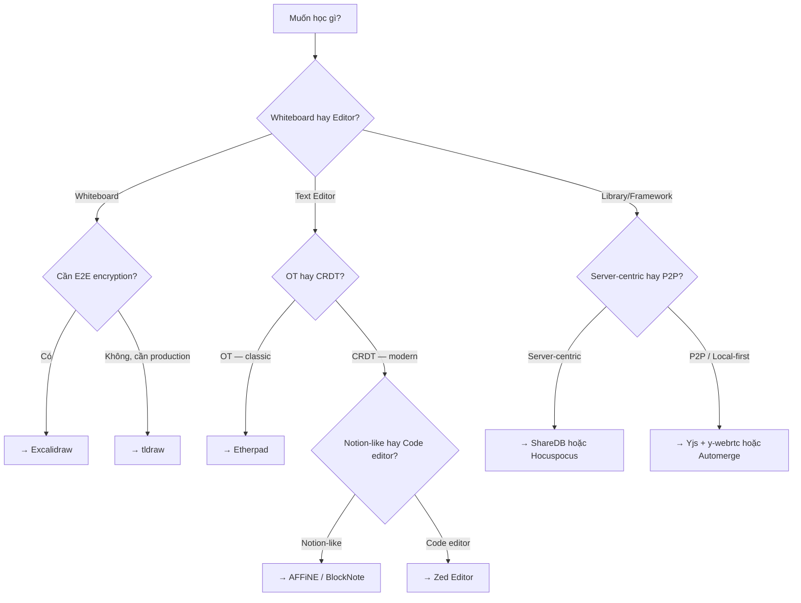

### 8.7 Quick Start: Thử nghiệm nhanh

**1. Yjs + tldraw whiteboard (5 phút):**
```bash
npx create-react-app my-whiteboard --template typescript
cd my-whiteboard
npm install @tldraw/tldraw yjs y-websocket
```

**2. Yjs + BlockNote editor (5 phút):**
```bash
npm create vite@latest my-editor -- --template react-ts
cd my-editor
npm install @blocknote/react @blocknote/core yjs y-websocket
```

**3. ShareDB + Quill (OT approach, 5 phút):**
```bash
mkdir my-ot-editor && cd my-ot-editor
npm init -y
npm install sharedb @teamwork/websocket-json-stream rich-text ws quill
```
---

### 8.8 Sản phẩm thực tế sử dụng giải pháp Hybrid OT + CRDT

> [!IMPORTANT]
> Hầu hết sản phẩm production hàng đầu **không dùng thuần túy OT hoặc CRDT**, mà kết hợp cả hai theo mô hình hybrid. Dưới đây là survey 17 sản phẩm thực tế.

#### Hybrid Model Map — Sản phẩm thuộc model nào?

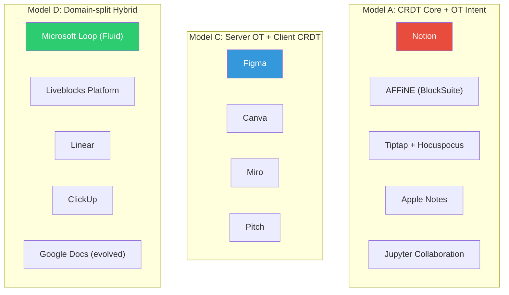

**Bốn mô hình Hybrid** (chi tiết tại [ot_crdt_hybrid.md](file:///home/nguyentthai96/.gemini/antigravity-ide/brain/caa32604-afdb-422b-b8d7-741cb30f47ba/ot_crdt_hybrid.md)):
- **Model A**: CRDT backbone + OT-style intent rules (Peritext, ProseMirror+Yjs)
- **Model B**: OT online + CRDT offline (Superhuman, Coda)
- **Model C**: Server OT serialize + Client CRDT local state (Figma, Canva, Miro)
- **Model D**: Domain-split — mỗi feature dùng kỹ thuật khác nhau (Loop, Linear, Google Docs)

---

#### ★ Figma — Model C (Server OT + Client CRDT)

```
Figma Architecture:
  CLIENT                           SERVER (Rust)
  ┌──────────────────────┐         ┌──────────────────────┐
  │ Local State (CRDT)   │  WebSocket  │ OT Serializer        │
  │ • Optimistic apply   │ ←──────→ │ • Total ordering      │
  │ • LWW per property   │         │ • Transform ops       │
  │ • Fractional indexing│         │ • DynamoDB journal    │
  └──────────────────────┘         └──────────────────────┘

  × Pure OT: Transform O(n²) cho tree structure
  × Pure CRDT: Memory overhead, không cần P2P
  ✓ Hybrid: LWW per property + server ordering
```

- **Data model**: `Map<ObjectID, Map<Property, Value>>` — property-level LWW
- **Ordering**: Fractional indexing (base-95 arbitrary precision)
- **Server**: Rust (migrated từ TypeScript 2018), per-document process
- **Scale**: 500+ concurrent editors per file

#### ★ Notion — Model A + D (CRDT structure + OT text)

```
Notion Architecture:
  Block Tree (CRDT domain)         Text Content (OT domain)
  ┌──────────────────────┐         ┌──────────────────────┐
  │ Page                 │         │ Granular ops:         │
  │ ├── Heading (id:abc) │         │ • insert(offset,text) │
  │ ├── Text (id:def) ──────────→ │ • delete(range)       │
  │ ├── Table (id:ghi)   │         │ • format(bold,range)  │
  │ └── Image (id:jkl)   │         │ • Transform concurrent│
  │                      │         │   text ops            │
  │ Block ops: auto-merge│         └──────────────────────┘
  └──────────────────────┘
```

- CRDT cho **block structure** (add/remove/reorder blocks merge automatically)
- OT-style cho **text within blocks** (fine-grained intent preservation)
- Server-authoritative cho **permissions, comments**

#### Apple Notes — Model A (Full CRDT + Intent Rules)

- Custom CRDT format (Protocol Buffers, gzipped) — **không dùng Yjs/Automerge**
- Sync qua iCloud (CloudKit) — device-to-device via cloud
- ✅ Full offline support, merge on reconnect
- Rich text, tables, checklists, drawings — all CRDT
- Intent-aware rules tương tự Peritext cho formatting conflicts
- **Scale**: 100M+ devices — CRDT triển khai quy mô lớn nhất thế giới

#### Microsoft Loop — Model D (Fluid Framework)

- **Fluid Framework** (open-source) — DDS: SharedMap, SharedString, SharedTree
- **Portable components**: cùng 1 component sống trong Teams, Outlook, OneNote
- Fluid xử lý **collaborative data**, Microsoft Graph API xử lý **permissions/storage**
- Model D điển hình: chia domain rõ ràng

#### Google Docs — Model D (OT + server-authoritative metadata)

- OT classic cho **text editing** (server-mediated)
- Server CRUD cho **comments, suggestions** (not OT/CRDT)
- Google Drive API cho **permissions** (server-authoritative)
- Separate channel cho **cursors/presence** (not part of OT stream)

---

#### Bảng so sánh tổng hợp 17 sản phẩm

| Sản phẩm | Hybrid Model | CRDT | OT | Server-auth | Offline | Scale |
|---|---|---|---|---|---|---|
| **Figma** | C | ✓ inspired | ✓ server | ✓✓ | ❌ | 500+ editors/file |
| **Canva** | C | ✓ inspired | ✓ server | ✓✓ | ❌ | Large teams |
| **Miro** | C+D | ✓ inspired | ✓ server | ✓✓ | ❌ | 100+ users/board |
| **Notion** | A+D | ✓ structure | ✓ text | ✓ | Partial | Millions users |
| **Apple Notes** | A | ✓✓ custom | ✓ intent | ✗ | ✓✓ | 100M+ devices |
| **MS Loop** | D | ✓ Fluid | ✗ | ✓ auth | Partial | Enterprise |
| **AFFiNE** | A | ✓✓ Yjs | ✓ intent | Optional | ✓✓ | Growing |
| **Google Docs** | D | ✗ | ✓✓ | ✓✓ | Partial | Billions users |
| **VS Code Live Share** | C var. | ✗ | ✗ | ✓✓ host | ❌ | Small teams |
| **Zed** | Pure CRDT | ✓✓ | ✗ | ✗ | ✓ | Small teams |
| **Liveblocks** | D platform | ✓ Yjs | ✗ | ✓ Storage | ✓ | SaaS platform |
| **Linear** | D | ✓ text | ✗ | ✓✓ issues | Partial | Startups |
| **ClickUp** | D | ✗ | ✓ text | ✓✓ | ❌ | Enterprise |
| **Coda** | B+D | ✓ offline | ✓ data | ✓✓ | ✓ | Teams |
| **Jupyter Collab** | A | ✓✓ Yjs | ✗ | ✓ kernel | Partial | Research |
| **Pitch** | C | ✓ inspired | ✓ server | ✓✓ | ❌ | Teams |
| **Superhuman** | B | ✗ | ✓ modifiers | ✓ | ✓✓ | Individual |


# Survey: Sản phẩm thực tế sử dụng Hybrid OT + CRDT

> Nội dung này đã được thêm vào Section 8.8 của [ot_crdt_deep_dive.md]

## Tóm tắt kết quả survey 17 sản phẩm

### Phân loại theo Hybrid Model

| Model | Sản phẩm | Đặc trưng |
|---|---|---|
| **A** (CRDT + OT Intent) | Notion, AFFiNE, Apple Notes, Tiptap+Hocuspocus, Jupyter | CRDT backbone + OT-style intent rules |
| **B** (OT Online + CRDT Offline) | Superhuman, Coda | OT khi online, CRDT khi offline |
| **C** (Server OT + Client CRDT) | Figma, Canva, Miro, Pitch | Server serialize, client optimistic |
| **D** (Domain-split) | MS Loop, Liveblocks, Linear, ClickUp, Google Docs | Mỗi feature dùng kỹ thuật khác |

### Key Findings

1. **Không sản phẩm production nào dùng thuần túy OT hay CRDT** — tất cả hybrid ở mức độ nào đó
2. **Model D (Domain-split) là phổ biến nhất** — thực tế nhất cho production apps
3. **Apple Notes** là trường hợp đặc biệt: full CRDT, 100M+ devices
4. **AI Agents** (2024-2026) đang đẩy xu hướng về server-mediated models

### Tham khảo

- Figma: Evan Wallace blog post "How Figma's multiplayer technology works"
- Notion: Operation-based sync, block tree structure
- Apple Notes: Custom CRDT (Protocol Buffers), CloudKit sync
- Microsoft Loop: Fluid Framework (open-source)
- Liveblocks: Managed Yjs + Storage platform


#### Xu hướng 2024-2026

```
  2019-2021: "OT vs CRDT — chọn 1"
  ══════════════════════════════════
  Google Docs (OT) ←→ Automerge/Yjs (CRDT)

  2022-2023: "Hybrid is the answer"  
  ═══════════════════════════════
  Figma, Notion public hybrid architecture
  Peritext paper → rich text CRDT + OT intent

  2024-2026: "Domain-split hybrid is the default"
  ════════════════════════════════════════════
  Hầu hết production apps dùng Model D:
  • CRDT cho content (text, blocks)
  • Server-auth cho business logic (perms, workflows)
  • REST API cho metadata (comments, history)
  • Managed platforms: Liveblocks, Fluid, Hocuspocus
  
  New challenge: AI Agents (25-100x faster than humans)
  → Server-mediated models more attractive for AI control
```

> [!TIP]
> **Kết luận từ survey 17 sản phẩm:**
> 1. **Không sản phẩm production nào dùng thuần túy OT hay CRDT** — tất cả hybrid
> 2. **Design tools** (Figma, Canva, Miro) → Model C (server + CRDT-like client)
> 3. **Document editors** (Notion, AFFiNE) → Model A (CRDT core + OT intent)
> 4. **SaaS platforms** (Linear, ClickUp) → Model D (CRDT text + server-auth business logic)
> 5. **Apple Notes** là trường hợp đặc biệt: full CRDT, 100M+ devices, quy mô lớn nhất

---

## 9. Production Checklist

### Nếu chọn OT:

- [ ] Sử dụng **client-server** model (không peer-to-peer)
- [ ] Dùng thư viện đã proven: ShareDB, ot.js, Quill Delta OT
- [ ] Implement 3-state machine trên client (Sync/Awaiting/Buffering)
- [ ] Server phải serialize tất cả ops theo thứ tự toàn cục
- [ ] Persist operation log cho undo/history
- [ ] Handle reconnection: client gửi lại pending ops với đúng revision
- [ ] Rate limit ops (debounce typing)

### Nếu chọn CRDT:

- [ ] Chọn thư viện: **Yjs** (popular, fast), **Automerge** (git-like), **Loro** (emerging, fast)
- [ ] Setup persistence layer: IndexedDB (client) + PostgreSQL/MongoDB (server)
- [ ] Implement awareness protocol cho cursors/presence
- [ ] Plan GC strategy cho tombstones
- [ ] Handle large documents: lazy loading, sub-document splitting
- [ ] Setup sync protocol: y-websocket, y-webrtc, hoặc custom
- [ ] Test conflict scenarios exhaustively
- [ ] Monitor document size growth over time

---

## 10. Tham khảo

### Papers & Articles

| Resource | Link |
|---|---|
| **OT** — Original paper (Ellis & Gibbs, 1989) | "Concurrency Control in Groupware Systems" |
| **CRDT** — Shapiro et al., 2011 | "A comprehensive study of CRDTs" |
| **YATA** — Nicolaescu et al., 2016 | "Near Real-Time Peer-to-Peer Shared Editing on Extensible Data Types" |
| **Martin Kleppmann** — talks & papers | "Making CRDTs 98% More Efficient" |
| **Seph Gentle** — "CRDTs go brrr" | https://josephg.com/blog/crdts-go-brrr/ |
| **Bartosz Sypytkowski** — CRDT series | Excellent visual explanations |

### Libraries & Frameworks

| Resource | Link |
|---|---|
| **Yjs** — documentation | https://docs.yjs.dev |
| **Automerge** — documentation | https://automerge.org |
| **Loro** — documentation | https://loro.dev |
| **ShareDB** — GitHub | https://github.com/share/sharedb |
| **Hocuspocus** — Yjs server | https://hocuspocus.dev |
| **Diamond Types** (Rust CRDT) | https://github.com/josephg/diamond-types |

### Open Source Projects

| Project | Link |
|---|---|
| **Excalidraw** — Whiteboard | https://github.com/excalidraw/excalidraw |
| **tldraw** — Whiteboard SDK | https://github.com/tldraw/tldraw |
| **AFFiNE** — Notion + Miro alternative | https://github.com/toeverything/AFFiNE |
| **Etherpad** — Collaborative editor (OT) | https://github.com/ether/etherpad-lite |
| **Zed** — Code editor with collab | https://github.com/zed-industries/zed |
| **BlockNote** — Block-based editor | https://github.com/TypeCellOS/BlockNote |
| **AppFlowy** — Notion alternative | https://github.com/AppFlowy-IO/AppFlowy |
