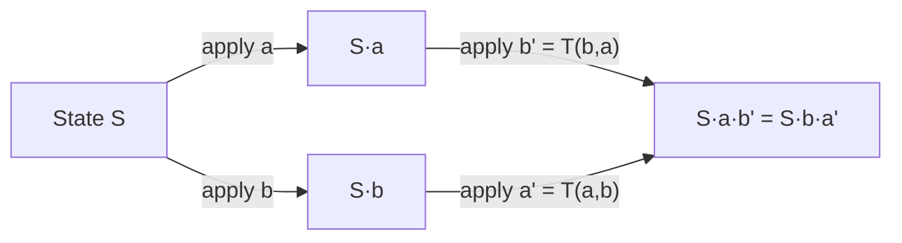
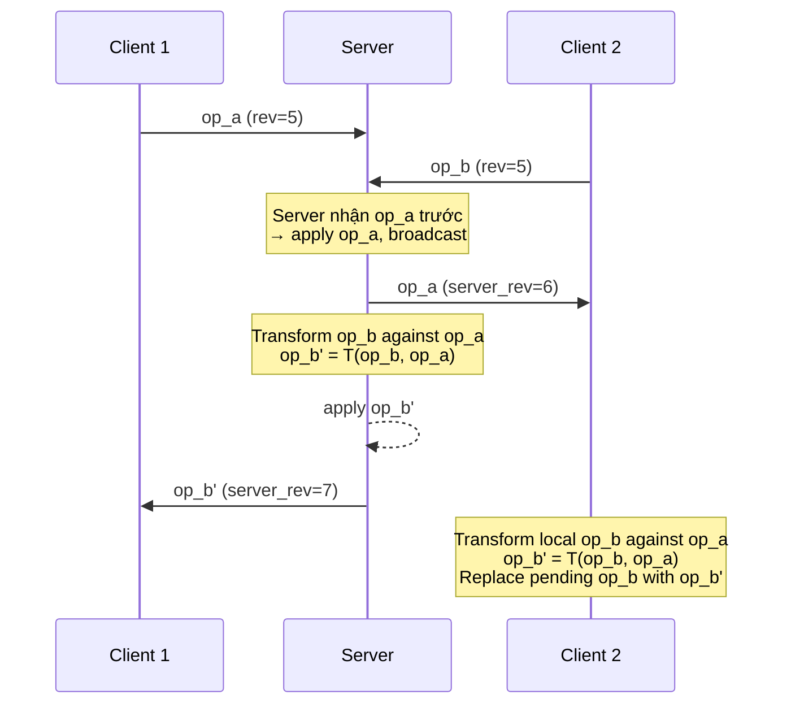
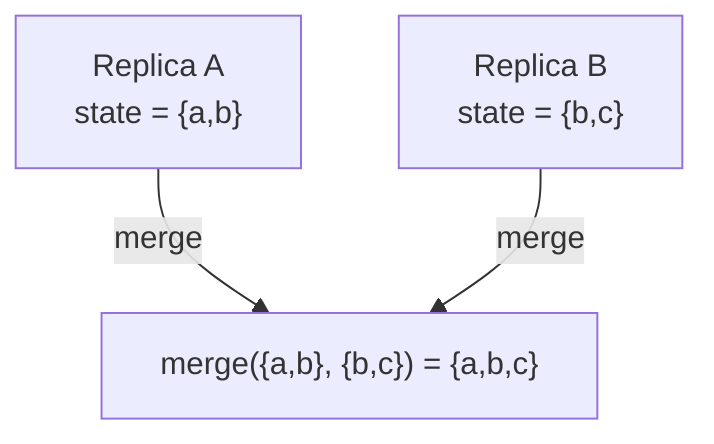
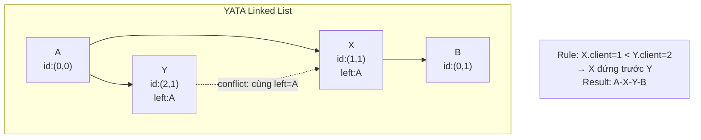
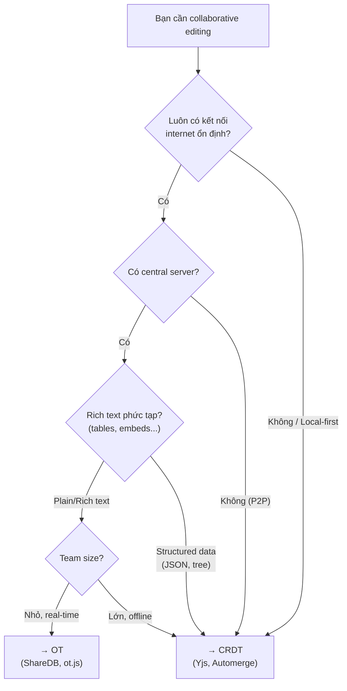
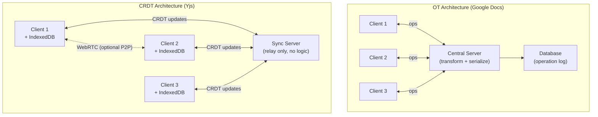

# Operational Transformation & CRDT — Deep Dive

## 1. Bài toán gốc: Collaborative Editing

Khi nhiều người cùng chỉnh sửa một tài liệu **đồng thời** qua mạng (latency ≠ 0), ba tính chất cần đảm bảo:

| Tính chất | Ý nghĩa |
|---|---|
| **Convergence** | Mọi replica cuối cùng phải có cùng trạng thái |
| **Intention preservation** | Hiệu ứng của mỗi thao tác phải giống như khi nó được thực hiện trên trạng thái mà người dùng nhìn thấy |
| **Causality preservation** | Thứ tự nhân quả phải được bảo toàn (nếu op A "xảy ra trước" op B thì mọi replica đều áp A trước B) |

Hai họ giải pháp chính: **OT** (1989) và **CRDT** (2011).

---

## 2. Operational Transformation (OT)

### 2.1 Ý tưởng cốt lõi

> **"Transform the operation, not the data."**

Mỗi thao tác chỉnh sửa được mô hình hóa thành một **operation** (op). Khi hai op đồng thời xung đột, ta **biến đổi** (transform) một op để nó vẫn đúng ngữ nghĩa khi áp dụng **sau** op kia.

### 2.2 Mô hình operations cho Plain Text

```
Insert(position, character)   — chèn ký tự tại vị trí
Delete(position)              — xóa ký tự tại vị trí
```

### 2.3 Hàm Transform — TP1 (Transformation Property 1)

Cho hai op `a` và `b` được tạo đồng thời trên cùng một trạng thái `S`:

```
T(a, b) → a'    sao cho   S · b · a'  =  S · a · b'
T(b, a) → b'
```



#### Bảng transform cho text editing:

| a \ b | Insert(pb, cb) | Delete(pb) |
|---|---|---|
| **Insert(pa, ca)** | if pa < pb → Insert(pa, ca) | if pa ≤ pb → Insert(pa, ca) |
| | if pa > pb → Insert(pa+1, ca) | if pa > pb → Insert(pa−1, ca) |
| | if pa = pb → tiebreak by site_id | |
| **Delete(pa)** | if pa < pb → Delete(pa) | if pa < pb → Delete(pa) |
| | if pa ≥ pb → Delete(pa+1) | if pa > pb → Delete(pa−1) |
| | | if pa = pb → **noop** (đã xóa) |

### 2.4 Ví dụ cụ thể

```
Document ban đầu: "ABC"

User 1: Insert(1, 'X')  →  "AXBC"     (chèn X sau A)
User 2: Delete(2)       →  "AC"       (xóa B — vị trí 2, index từ 0)
```

Nếu User 2 nhận op của User 1 trước:
- Document User 2 hiện tại: `"AC"`
- Op nhận: `Insert(1, 'X')`
- Cần transform: `T(Insert(1,'X'), Delete(2))`
  - pa=1 < pb=2 → `Insert(1, 'X')` — **giữ nguyên**
- Áp dụng: `"AC"` → `"AXC"` ✓

Nếu User 1 nhận op của User 2:
- Document User 1 hiện tại: `"AXBC"`
- Op nhận: `Delete(2)` (ban đầu muốn xóa B)
- Cần transform: `T(Delete(2), Insert(1,'X'))`
  - pa=2 ≥ pb=1 → `Delete(2+1)` = `Delete(3)`
- Áp dụng: `"AXBC"` → xóa index 3 → `"AXC"` ✓

**Convergence đạt được!**

### 2.5 Kiến trúc OT

#### Client-Server (Google Docs style — Jupiter/Wave)



**Ưu điểm**: Server serializes tất cả ops → chỉ cần TP1, tránh vấn đề TP2.

**Nhược điểm**: Single point of failure, latency phụ thuộc vào server.

#### Peer-to-Peer (dOPT, adOPTed, GOTO, SOCT)

Không có server trung tâm. Cần cả **TP1** và **TP2** (Transformation Property 2):

```
T(T(a, b), T(c, b)) = T(T(a, c), T(b, c))
```

> [!CAUTION]
> TP2 cực kỳ khó đảm bảo đúng. Nhiều thuật toán OT đã được chứng minh là **không thỏa mãn TP2** trong mọi trường hợp (Imine et al., 2006). Đây là lý do OT peer-to-peer gần như không được dùng trong production.

### 2.6 Client-side: OT Control Algorithm

Mỗi client duy trì:

```javascript
class OTClient {
  revision     // server revision mà client đã "thấy"
  pending      // op đã gửi server, chưa được ACK
  buffer       // các op local chưa gửi (đợi pending được ACK)
  
  // Khi user thao tác local
  applyLocal(op) {
    applyToDocument(op)
    if (this.pending === null) {
      this.pending = op
      send(op, this.revision)
    } else {
      this.buffer.push(op)
    }
  }
  
  // Khi nhận ACK từ server (op của mình)
  onAck() {
    this.revision++
    if (this.buffer.length > 0) {
      this.pending = composeAll(this.buffer)
      this.buffer = []
      send(this.pending, this.revision)
    } else {
      this.pending = null
    }
  }
  
  // Khi nhận op từ server (của người khác)
  onRemoteOp(serverOp) {
    this.revision++
    if (this.pending) {
      [this.pending, serverOp] = transform(this.pending, serverOp)
    }
    for (let i = 0; i < this.buffer.length; i++) {
      [this.buffer[i], serverOp] = transform(this.buffer[i], serverOp)
    }
    applyToDocument(serverOp)
  }
}
```

> [!NOTE]
> Đây chính là mô hình **3-state** (Synchronized / Awaiting Confirm / Awaiting Confirm + Buffer) mà Google Docs và ShareDB sử dụng.

### 2.7 Tổng kết OT

| Aspect | Đánh giá |
|---|---|
| **Proven in production** | Google Docs, Apache Wave, ShareDB, Etherpad |
| **Correctness** | Rất khó chứng minh (đặc biệt peer-to-peer) |
| **Complexity** | O(H²) trong worst case (H = history length) |
| **Server dependency** | Client-Server model gần như bắt buộc |
| **Rich text** | Tốt — operations dễ mở rộng (OT-rich-text của Quill) |

---

## 3. Conflict-free Replicated Data Types (CRDT)

### 3.1 Ý tưởng cốt lõi

> **"Design the data type so that conflicts are impossible by construction."**

Thay vì transform operations, CRDT thiết kế cấu trúc dữ liệu sao cho:
- Mọi concurrent operations đều **commutative** (thứ tự áp dụng không quan trọng), HOẶC
- States hội tụ qua **merge function** (join semilattice)

### 3.2 Hai họ CRDT

#### State-based CRDT (CvRDT — Convergent)



- Gửi **toàn bộ state** giữa các replicas
- Merge function phải là **join of a semilattice**: commutative, associative, idempotent
- Ví dụ: G-Counter, OR-Set

#### Operation-based CRDT (CmRDT — Commutative)

- Gửi **operations** giữa các replicas  
- Operations phải **commutative** (concurrent ops có thể áp dụng theo bất kỳ thứ tự nào)
- Yêu cầu: reliable broadcast với causal delivery
- Ví dụ: Yjs, Automerge

### 3.3 CRDT cho Text Editing — Sequence CRDTs

Đây là phần phức tạp nhất và thú vị nhất.

#### 3.3.1 Tombstone-based: RGA (Replicated Growable Array)

Mỗi ký tự có một **unique ID** = `(timestamp, replicaId)`:

```
Document: "ABC"

Nội bộ:
  [{ id: (1,A), char: 'A', deleted: false },
   { id: (2,A), char: 'B', deleted: false },
   { id: (3,A), char: 'C', deleted: false }]
```

**Insert**: Tạo ID mới, chèn **sau** ký tự có ID cha (parent). Nếu hai insert cùng vị trí → tiebreak bằng ID (timestamp lớn hơn thắng, nếu bằng → replicaId).

**Delete**: Không xóa thật, chỉ đánh dấu `deleted: true` (**tombstone**).

```javascript
// Simplified RGA Insert
insert(parentId, newChar, replicaId, clock) {
  const newId = { ts: clock, replica: replicaId }
  const parentIndex = this.findIndex(parentId)
  
  // Tìm vị trí chèn: sau parent, trước mọi element có ID nhỏ hơn
  let insertPos = parentIndex + 1
  while (insertPos < this.list.length) {
    const existing = this.list[insertPos]
    if (this.compareIds(existing.id, newId) > 0) {
      // existing có ID lớn hơn → chèn trước nó
      break
    }
    insertPos++
  }
  
  this.list.splice(insertPos, 0, {
    id: newId,
    char: newChar,
    deleted: false
  })
}
```

> [!WARNING]
> **Tombstone problem**: Ký tự đã xóa vẫn chiếm bộ nhớ. Cần **garbage collection** (GC), nhưng GC trong distributed system rất phức tạp vì phải đảm bảo mọi replica đã "thấy" tombstone trước khi xóa.

#### 3.3.2 Position-based: Logoot / LSEQ

Thay vì tombstone, dùng **fractional positions** (vị trí là số thực/danh sách số nguyên):

```
'A' → position [1]
'B' → position [2]
'C' → position [3]

Insert 'X' giữa A và B:
'X' → position [1, 5]   (giữa [1] và [2])

Insert 'Y' giữa A và X:
'Y' → position [1, 2]   (giữa [1] và [1,5])
```

**Ưu điểm**: Không cần tombstone — delete thực sự xóa.

**Nhược điểm**: Position identifiers có thể **phình to** theo thời gian (interleaving problem).

#### 3.3.3 Tree-based: Yjs (YATA)

**Yjs** — thư viện CRDT phổ biến nhất hiện nay — sử dụng thuật toán **YATA** (Yet Another Transformation Approach):

```
Mỗi item (character/block) có:
  - id:     { client: number, clock: number }
  - left:   ID of left neighbor khi insert
  - right:  ID of right neighbor khi insert  
  - parent: ID of parent container
  - content: actual data
  - deleted: boolean
```

**Conflict resolution rule** trong YATA:
> Khi hai items cùng insert giữa hai items giống nhau (cùng left, cùng right):
> - Item nào có `origin` (left neighbor) xuất hiện **trước** → đứng trước
> - Nếu cùng origin → so sánh `client ID`



### 3.4 Ví dụ thực tế: CRDT vs OT cho cùng scenario

```
Document: "ABC"     (3 chars, index 0-2)

User 1 (replica R1): Insert 'X' at position 1  →  muốn "AXBC"
User 2 (replica R2): Delete position 2 (char B) →  muốn "AC"
```

**Với CRDT (RGA-style)**:

```
Trạng thái ban đầu:
  [(1,S):'A', (2,S):'B', (3,S):'C']

R1 tạo: Insert(parent=(1,S), char='X', id=(4,R1))
R2 tạo: Delete(id=(2,S))

--- R1 nhận Delete từ R2 ---
Tìm item có id=(2,S), đánh dấu deleted=true
Result: [(1,S):'A', (4,R1):'X', (2,S):'B'☠, (3,S):'C']
Visible: "AXC" ✓

--- R2 nhận Insert từ R1 ---
Tìm parent (1,S)='A', chèn 'X' sau nó
Result: [(1,S):'A', (4,R1):'X', (2,S):'B'☠, (3,S):'C']  
Visible: "AXC" ✓

✅ Convergence — KHÔNG cần transform!
```

### 3.5 Các loại CRDT phổ biến khác

| CRDT | Kiểu | Mô tả | Use case |
|---|---|---|---|
| **G-Counter** | State | Counter chỉ tăng, mỗi replica có counter riêng | Page views, likes |
| **PN-Counter** | State | Hai G-Counter (positive + negative) | Balance, inventory |
| **G-Set** | State | Set chỉ thêm (add-only) | Tag collection |
| **OR-Set** (Observed-Remove) | State/Op | Set hỗ trợ add + remove | Shopping cart |
| **LWW-Register** | State | Last-Writer-Wins bằng timestamp | User profile fields |
| **MV-Register** | State | Multi-Value — giữ mọi concurrent writes | Conflict resolution UI |
| **LWW-Map** | State | Map với LWW cho mỗi key | Key-value store |
| **RGA** | Op | Sequence cho text editing | Collaborative docs |
| **Yjs Doc** | Op | Hierarchical CRDT (map + array + text) | Full document model |

### 3.6 Formal Property: Semilattice

State-based CRDT yêu cầu `(S, ⊑, ⊔)` là một **join semilattice**:

```
∀ a, b ∈ S:
  1. a ⊔ b = b ⊔ a                    (commutative)
  2. (a ⊔ b) ⊔ c = a ⊔ (b ⊔ c)      (associative)  
  3. a ⊔ a = a                         (idempotent)
```

Điều này đảm bảo: bất kể thứ tự nhận message, bất kể duplicate message → **mọi replica hội tụ**.

---

## 4. So sánh OT vs CRDT

### 4.1 Bảng so sánh chi tiết

| Tiêu chí | OT | CRDT |
|---|---|---|
| **Năm ra đời** | 1989 (Ellis & Gibbs) | 2011 (Shapiro et al.) |
| **Triết lý** | Transform operations at runtime | Design data type to be conflict-free |
| **Server** | Gần như bắt buộc (client-server) | Không cần (true P2P possible) |
| **Correctness proof** | Rất khó (TP1 + TP2) | Đơn giản hơn (semilattice / commutativity) |
| **Memory overhead** | Thấp (chỉ giữ document + pending ops) | Cao hơn (unique IDs + tombstones) |
| **Network** | Ops nhỏ gọn | Ops lớn hơn (chứa unique IDs) |
| **Offline support** | Khó (cần server để serialize) | Tự nhiên (merge khi reconnect) |
| **Undo/Redo** | Phức tạp (cần inverse transform) | Phức tạp (tombstone-aware) |
| **GC (Garbage Collection)** | Không cần | Cần cho tombstone-based CRDTs |
| **Latency sensitivity** | Nhạy cảm hơn (cần round-trip) | Ít nhạy cảm (local-first) |
| **Real-world adoption** | Google Docs, Etherpad, ShareDB | Yjs, Automerge, Figma, Apple Notes |

### 4.2 Khi nào chọn gì?



---

## 5. Hướng triển khai thực tế

### 5.1 Phương án 1: OT với ShareDB (Node.js)

> [!TIP]
> **Best for**: Real-time collaborative text editing có server, team size nhỏ-trung, không cần offline.

#### Server

```javascript
// server.js
const ShareDB = require('sharedb');
const WebSocket = require('ws');
const WebSocketJSONStream = require('@teamwork/websocket-json-stream');
const richText = require('rich-text');

// Đăng ký OT type cho rich text (Quill Delta format)
ShareDB.types.register(richText.type);

// Tạo ShareDB backend với MongoDB adapter
const db = require('sharedb-mongo')('mongodb://localhost:27017/myapp');
const backend = new ShareDB({ db });

// WebSocket server
const wss = new WebSocket.Server({ port: 8080 });

wss.on('connection', (ws) => {
  const stream = new WebSocketJSONStream(ws);
  backend.listen(stream);
});

// Tạo document mới nếu chưa có
const connection = backend.connect();
const doc = connection.get('documents', 'my-doc');
doc.fetch((err) => {
  if (err) throw err;
  if (doc.type === null) {
    // Khởi tạo với Quill Delta format
    doc.create([{ insert: 'Hello World!\n' }], 'rich-text');
  }
});
```

#### Client

```javascript
// client.js
const sharedb = require('sharedb/lib/client');
const richText = require('rich-text');
const Quill = require('quill');

sharedb.types.register(richText.type);

const socket = new WebSocket('ws://localhost:8080');
const connection = new sharedb.Connection(socket);
const doc = connection.get('documents', 'my-doc');

doc.subscribe((err) => {
  if (err) throw err;
  
  const quill = new Quill('#editor', { theme: 'snow' });
  quill.setContents(doc.data);
  
  // Local changes → send to server
  quill.on('text-change', (delta, oldDelta, source) => {
    if (source === 'user') {
      doc.submitOp(delta);  // ShareDB handles OT automatically
    }
  });
  
  // Remote changes → apply to editor
  doc.on('op', (op, source) => {
    if (!source) {  // not local
      quill.updateContents(op);
    }
  });
});
```

### 5.2 Phương án 2: CRDT với Yjs (Recommended cho projects mới)

> [!TIP]
> **Best for**: Modern collaborative apps, offline-first, P2P optional, structured data.

#### Core Setup

```javascript
// yjs-setup.js
import * as Y from 'yjs';
import { WebsocketProvider } from 'y-websocket';
import { IndexeddbPersistence } from 'y-indexeddb';

// Tạo Yjs document
const ydoc = new Y.Doc();

// Layer 1: Local persistence (offline support)
const indexeddbProvider = new IndexeddbPersistence('my-doc', ydoc);
indexeddbProvider.on('synced', () => {
  console.log('Loaded from IndexedDB');
});

// Layer 2: Network sync via WebSocket
const wsProvider = new WebsocketProvider(
  'wss://your-server.com',
  'my-doc-room',
  ydoc
);

wsProvider.on('status', ({ status }) => {
  console.log(`Connection: ${status}`);  // connected / disconnected
});

// ---- Sử dụng shared types ----

// Text editing (sequence CRDT)
const ytext = ydoc.getText('main-content');
ytext.insert(0, 'Hello ');
ytext.insert(6, 'World!');
// ytext.toString() === 'Hello World!'

// Structured data (map CRDT)
const ymeta = ydoc.getMap('metadata');
ymeta.set('title', 'My Document');
ymeta.set('lastModified', Date.now());

// Array/List (sequence CRDT)
const ytasks = ydoc.getArray('tasks');
ytasks.push([{ text: 'Buy groceries', done: false }]);

// Nested structures
const ymap = new Y.Map();
ymap.set('key', 'value');
ytasks.push([ymap]);  // push a map into an array

// ---- Observe changes ----
ytext.observe((event) => {
  console.log('Text changed:', event.changes.delta);
  // [{ retain: 5 }, { insert: 'X' }]
});

ymeta.observe((event) => {
  event.changes.keys.forEach((change, key) => {
    console.log(`Key "${key}": ${change.action}`);
    // action: 'add' | 'update' | 'delete'
  });
});
```

#### Tích hợp với Quill Editor

```javascript
// yjs-quill.js
import * as Y from 'yjs';
import { QuillBinding } from 'y-quill';
import Quill from 'quill';
import QuillCursors from 'quill-cursors';

Quill.register('modules/cursors', QuillCursors);

const ydoc = new Y.Doc();
const ytext = ydoc.getText('quill-content');

const quill = new Quill('#editor', {
  theme: 'snow',
  modules: {
    cursors: true,
    toolbar: [
      ['bold', 'italic', 'underline'],
      [{ list: 'ordered' }, { list: 'bullet' }],
      ['link', 'image'],
    ],
  },
});

// Binding tự động sync Yjs ↔ Quill
const binding = new QuillBinding(ytext, quill, wsProvider.awareness);

// Awareness (cursor positions, user names, colors)
wsProvider.awareness.setLocalStateField('user', {
  name: 'Alice',
  color: '#ff6b6b',
});
```

#### Yjs WebSocket Server (minimal)

```javascript
// yjs-server.js
const WebSocket = require('ws');
const { setupWSConnection } = require('y-websocket/bin/utils');
const http = require('http');

const server = http.createServer((req, res) => {
  res.writeHead(200);
  res.end('Yjs WebSocket Server');
});

const wss = new WebSocket.Server({ server });

wss.on('connection', (conn, req) => {
  setupWSConnection(conn, req);
  // y-websocket handles:
  //   - Document sync protocol
  //   - Awareness protocol (cursors)
  //   - Persistence (optional, via LevelDB/MongoDB callback)
});

server.listen(1234, () => {
  console.log('Yjs server running on ws://localhost:1234');
});
```

### 5.3 Phương án 3: CRDT với Automerge (Rust core + JS bindings)

> [!TIP]
> **Best for**: Apps cần Git-like branching/merging, structured JSON data.

```javascript
// automerge-example.js
import { next as Automerge } from '@automerge/automerge';

// Tạo document
let doc = Automerge.init();
doc = Automerge.change(doc, 'Initialize', (d) => {
  d.title = 'My Document';
  d.tasks = [];
  d.tasks.push({ text: 'Task 1', done: false });
});

// Fork (like git branch)
let fork = Automerge.clone(doc);

// Concurrent changes
doc = Automerge.change(doc, (d) => {
  d.tasks.push({ text: 'Task 2', done: false });
});

fork = Automerge.change(fork, (d) => {
  d.tasks[0].done = true;
  d.title = 'Updated Title';
});

// Merge (automatic conflict resolution)
doc = Automerge.merge(doc, fork);
// doc.title === 'Updated Title'
// doc.tasks === [
//   { text: 'Task 1', done: true },   ← from fork
//   { text: 'Task 2', done: false },   ← from doc
// ]

// Get change history
const history = Automerge.getHistory(doc);
history.forEach(({ change, snapshot }) => {
  console.log(change.message, change.time);
});

// Binary sync protocol (for network)
const [syncState1, msg1] = Automerge.generateSyncMessage(doc, syncState);
// Send msg1 to peer...
```

### 5.4 Architecture Comparison



> [!IMPORTANT]
> Với CRDT, server chỉ là **relay/persistence** — không cần logic transform. Client có thể hoạt động hoàn toàn offline và sync khi reconnect. Đây là sự khác biệt kiến trúc lớn nhất.

---

## 6. Challenges & Advanced Topics

### 6.1 Tombstone Garbage Collection

```javascript
// Naive GC strategy cho RGA
class GarbageCollector {
  // Chỉ GC khi TẤT CẢ replicas đã "thấy" deletion
  canCollect(tombstone, versionVectors) {
    // version vector của mỗi replica phải ≥ deletion timestamp
    return Object.entries(versionVectors).every(
      ([replicaId, vector]) => 
        vector[tombstone.deletedBy.replica] >= tombstone.deletedBy.clock
    );
  }
  
  // Yjs approach: GC theo "struct" blocks
  // Khi một run of deleted items liên tiếp → merge thành 1 GC block
  // Chỉ giữ length, không giữ content
}
```

### 6.2 Undo/Redo trong CRDT

```javascript
// Yjs UndoManager
import { UndoManager } from 'yjs';

const ytext = ydoc.getText('content');
const undoManager = new UndoManager(ytext, {
  // Chỉ undo thao tác của local user
  trackedOrigins: new Set([null]),  // null = local changes
  captureTimeout: 500,  // Group ops within 500ms
});

// Ctrl+Z
undoManager.undo();

// Ctrl+Y  
undoManager.redo();

// Stack info
undoManager.undoStack.length;
undoManager.redoStack.length;
```

### 6.3 Awareness Protocol (Cursors & Presence)

```javascript
// Yjs Awareness — không phải CRDT, là ephemeral state
const awareness = wsProvider.awareness;

// Set local user info
awareness.setLocalStateField('user', {
  name: 'Alice',
  color: '#e74c3c',
});

// Set cursor position
awareness.setLocalStateField('cursor', {
  anchor: { index: 5 },
  head: { index: 10 },
});

// Listen for remote users
awareness.on('change', ({ added, updated, removed }) => {
  const states = awareness.getStates();
  states.forEach((state, clientId) => {
    if (clientId !== ydoc.clientID) {
      console.log(`User ${state.user?.name} cursor at ${state.cursor?.anchor?.index}`);
    }
  });
});
```

### 6.4 Intent Preservation — Vấn đề muôn thuở

```
Scenario: Move element from list A to list B

User 1: Delete item X from list A, Insert X into list B  (intent: MOVE)
User 2: Edit item X in list A                            (intent: MODIFY)

Concurrent result:
  - List A: item X deleted (from User 1) but also modified (from User 2)?
  - List B: item X appears (from User 1) but without User 2's edit?

→ CRDT: X exists in both lists (duplicate!) or edit is lost
→ OT: Depends on transform function design — equally hard
```

> [!WARNING]
> **Cả OT lẫn CRDT đều không giải quyết hoàn hảo intent preservation cho mọi trường hợp.** Với semantic operations phức tạp (move, reorder, structural changes), cần thiết kế application-level conflict resolution.

---

## 7. Production Checklist

### Nếu chọn OT:

- [ ] Sử dụng **client-server** model (không peer-to-peer)
- [ ] Dùng thư viện đã proven: ShareDB, ot.js, Quill Delta OT
- [ ] Implement 3-state machine trên client (Sync/Awaiting/Buffering)
- [ ] Server phải serialize tất cả ops theo thứ tự toàn cục
- [ ] Persist operation log cho undo/history
- [ ] Handle reconnection: client gửi lại pending ops với đúng revision
- [ ] Rate limit ops (debounce typing)

### Nếu chọn CRDT:

- [ ] Chọn thư viện: **Yjs** (popular, fast), **Automerge** (git-like), hoặc **Diamond Types** (Rust, experimental)
- [ ] Setup persistence layer: IndexedDB (client) + PostgreSQL/MongoDB (server)
- [ ] Implement awareness protocol cho cursors/presence
- [ ] Plan GC strategy cho tombstones
- [ ] Handle large documents: lazy loading, sub-document splitting
- [ ] Setup sync protocol: y-websocket, y-webrtc, hoặc custom
- [ ] Test conflict scenarios exhaustively
- [ ] Monitor document size growth over time

---

## 8. Tham khảo

| Resource | Link |
|---|---|
| **OT** — Original paper (Ellis & Gibbs, 1989) | "Concurrency Control in Groupware Systems" |
| **CRDT** — Shapiro et al., 2011 | "A comprehensive study of CRDTs" |
| **Yjs** — documentation | https://docs.yjs.dev |
| **Automerge** — documentation | https://automerge.org |
| **ShareDB** — GitHub | https://github.com/share/sharedb |
| **Martin Kleppmann** — talks & papers | "Making CRDTs 98% More Efficient" |
| **Seph Gentle** — "CRDTs go brrr" | https://josephg.com/blog/crdts-go-brrr/ |
| **Bartosz Sypytkowski** — CRDT series | Excellent visual explanations |
| **Diamond Types** (Rust CRDT) | https://github.com/josephg/diamond-types |
