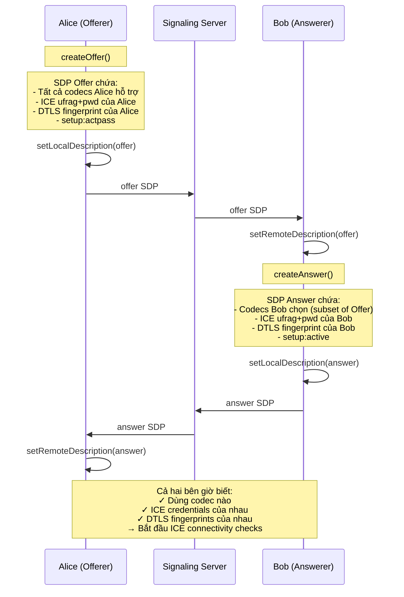
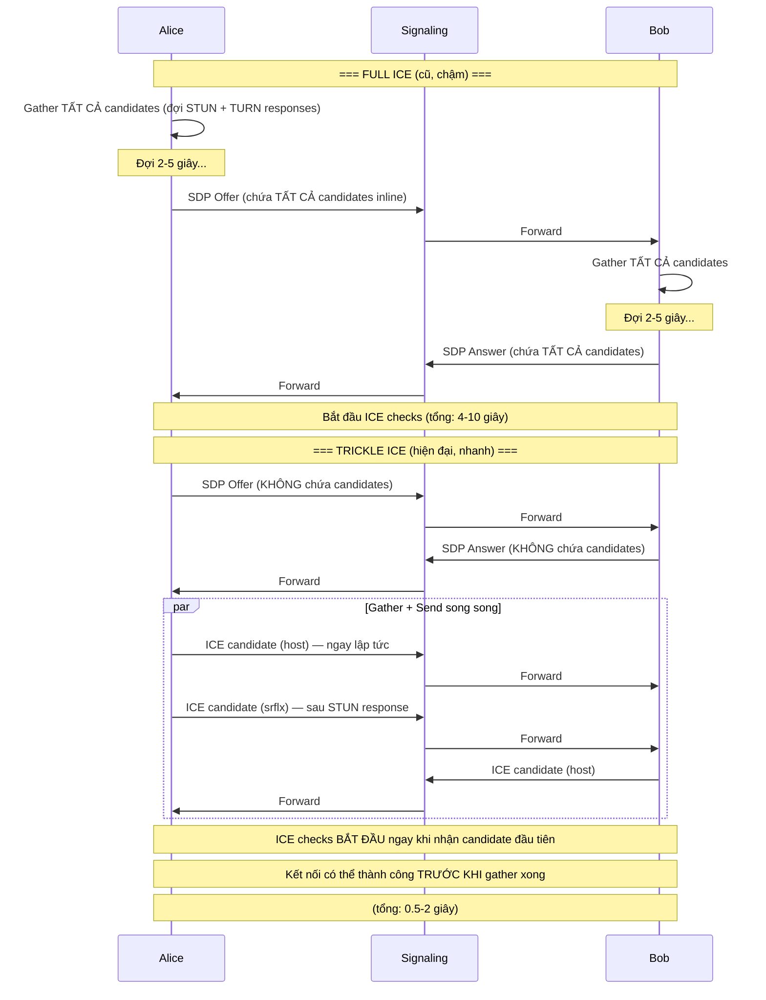
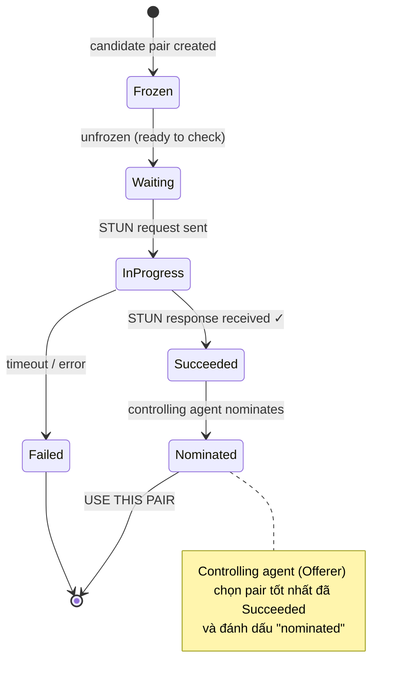
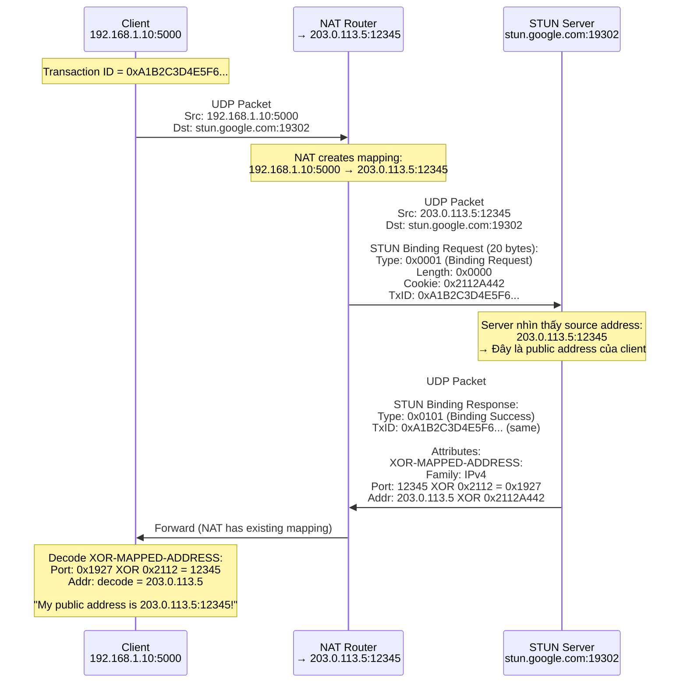
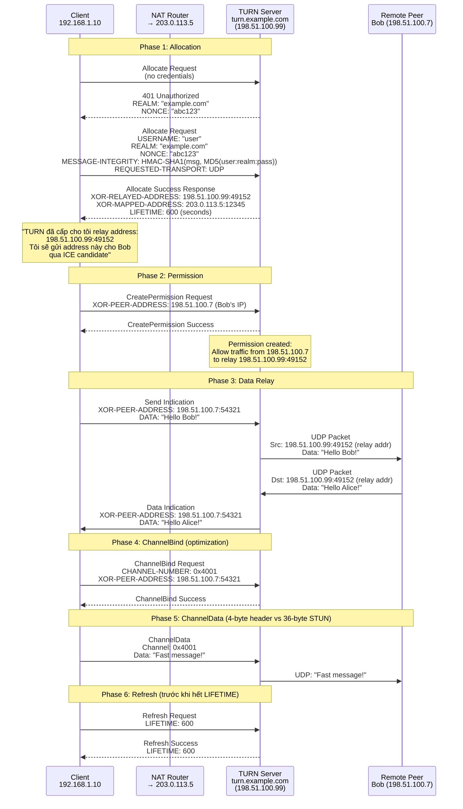
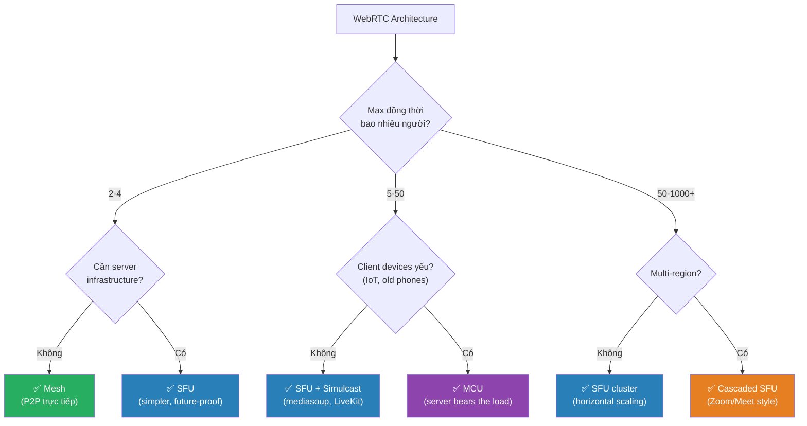
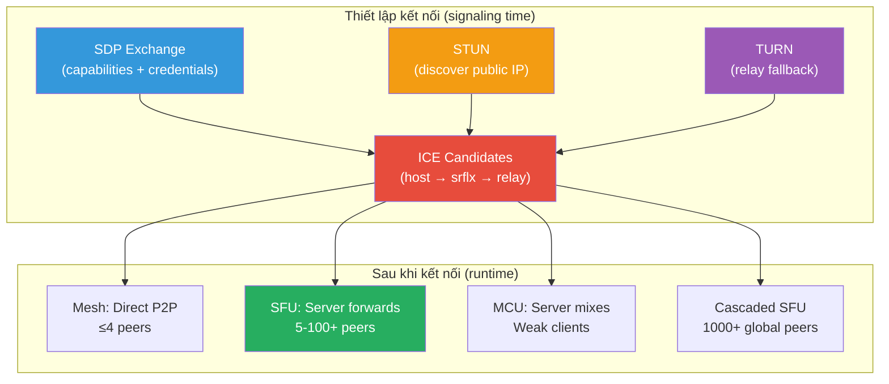

# SDP, ICE, STUN/TURN & WebRTC Architectures — Deep Dive

---

## 1. SDP (Session Description Protocol) — Phân tích từng byte

SDP là một **text-based format** (RFC 8866) mô tả media session. Trong WebRTC, SDP được trao đổi qua Signaling Server dưới dạng **Offer** và **Answer**.

### 1.1 Cấu trúc tổng quan

```
SDP = Session-level description
    + 1..N Media-level descriptions

┌─────────────────────────────────────────────────┐
│  SESSION-LEVEL (áp dụng cho toàn bộ session)    │
│                                                  │
│  v=  (version)                                   │
│  o=  (origin — session creator)                  │
│  s=  (session name)                              │
│  t=  (timing)                                    │
│  a=  (session-level attributes)                  │
│      - a=group:BUNDLE                            │
│      - a=ice-options                             │
│      - a=msid-semantic                           │
├─────────────────────────────────────────────────┤
│  MEDIA-LEVEL #1 (audio)                          │
│                                                  │
│  m=  (media line — type, port, protocol, codecs) │
│  c=  (connection info)                           │
│  a=  (media-level attributes)                    │
│      - a=ice-ufrag / a=ice-pwd                   │
│      - a=fingerprint                             │
│      - a=setup                                   │
│      - a=mid                                     │
│      - a=rtpmap / a=fmtp                         │
│      - a=candidate                               │
├─────────────────────────────────────────────────┤
│  MEDIA-LEVEL #2 (video)                          │
│  ...                                             │
├─────────────────────────────────────────────────┤
│  MEDIA-LEVEL #3 (data channel)                   │
│  ...                                             │
└─────────────────────────────────────────────────┘
```

### 1.2 SDP Offer — Annotated line by line

```
// ==================== SESSION LEVEL ====================

v=0
│  SDP version. Luôn là 0 (chưa bao giờ thay đổi kể từ 1998).

o=- 4628370238957location 2 IN IP4 127.0.0.1
│  │  │              │  │    │
│  │  │              │  │    └─ Address (placeholder, không dùng trong WebRTC)
│  │  │              │  └─ Network type: IN = Internet
│  │  │              └─ Session version (tăng khi SDP thay đổi)
│  │  └─ Session ID (random, unique per session)
│  └─ Username ("-" = anonymous)
└─ Origin line

s=-
│  Session name ("-" = no name). Bắt buộc có nhưng WebRTC không dùng.

t=0 0
│  Timing: start=0, stop=0 → session permanent (không hết hạn)

a=group:BUNDLE 0 1 2
│  BUNDLE: Multiplex tất cả media (audio=0, video=1, data=2)
│  qua MỘT transport duy nhất (tiết kiệm ICE negotiation)
│  
│  Không có BUNDLE: mỗi m= line cần ICE riêng → 3× candidates
│  Có BUNDLE: tất cả m= line dùng chung 1 ICE + 1 DTLS

a=extmap-allow-mixed
│  Cho phép mix encrypted và unencrypted RTP header extensions

a=msid-semantic: WMS
│  Media Stream Identification: WMS = WebRTC Media Stream


// ==================== MEDIA LEVEL #1: AUDIO ====================

m=audio 9 UDP/TLS/RTP/SAVPF 111 63 9 0 8 13 110 126
│  │     │  │                  └─ Payload types (codec IDs, xem rtpmap bên dưới)
│  │     │  └─ Protocol: UDP transport, TLS security, RTP media, SAVPF feedback
│  │     └─ Port: 9 = placeholder (thực tế lấy từ ICE candidate)
│  └─ Media type: audio
│
│  SAVPF = Secure Audio/Video Profile with Feedback
│  (S = SRTP encryption, AVP = Audio/Video Profile, F = RTCP Feedback)

c=IN IP4 0.0.0.0
│  Connection: placeholder (thực tế dùng ICE candidate address)

a=rtcp:9 IN IP4 0.0.0.0
│  RTCP port: placeholder

// ---- ICE Credentials ----

a=ice-ufrag:F7gI
│  ICE username fragment (ngắn, random)
│  Dùng trong STUN Binding Request để identify session

a=ice-pwd:x9cml/YzichV2+XGvA0NxJ1
│  ICE password (dùng cho HMAC-SHA1 integrity of STUN messages)
│  
│  Mỗi peer tạo ufrag+pwd riêng → trao đổi qua SDP
│  STUN request username = "remote_ufrag:local_ufrag"

// ---- DTLS (Encryption) ----

a=fingerprint:sha-256 D1:DC:5A:9C:EA:07:...:3C:2B
│  SHA-256 hash của DTLS certificate
│  Peer verify fingerprint này để đảm bảo KHÔNG bị MITM
│  (Signaling Server biết fingerprint nhưng không có private key)

a=setup:actpass
│  DTLS role negotiation:
│    - Offer luôn gửi "actpass" (tôi có thể là client hoặc server)
│    - Answer chọn "active" (tôi là DTLS client) hoặc "passive"

// ---- Media Direction ----

a=mid:0
│  Media ID = "0" (tham chiếu bởi BUNDLE group ở trên)

a=sendrecv
│  Direction: gửi VÀ nhận (bidirectional)
│  Các giá trị khác: sendonly, recvonly, inactive

// ---- Codec Descriptions ----

a=rtpmap:111 opus/48000/2
│  Payload type 111 = Opus codec, 48kHz sample rate, 2 channels (stereo)

a=fmtp:111 minptime=10;useinbandfec=1
│  Format parameters cho Opus:
│    - minptime=10: minimum packet duration 10ms
│    - useinbandfec=1: enable Forward Error Correction

a=rtpmap:63 red/48000/2
│  Payload 63 = Redundant Audio (backup codec)

a=rtpmap:9 G722/8000
│  Payload 9 = G.722 wideband codec

a=rtpmap:0 PCMU/8000
│  Payload 0 = G.711 μ-law (narrowband, fallback)

// ---- RTCP Feedback ----

a=rtcp-fb:111 transport-cc
│  Transport-wide Congestion Control cho Opus
│  Receiver gửi feedback về packet loss/delay → sender điều chỉnh bitrate

a=rtcp-fb:111 nack
│  Negative Acknowledgment: receiver yêu cầu retransmit packet bị mất


// ==================== MEDIA LEVEL #2: VIDEO ====================

m=video 9 UDP/TLS/RTP/SAVPF 96 97 102 103 104 105 106 107
│  Video codecs (nhiều payload types cho simulcast + fallback)

a=mid:1

// ---- Video Codecs ----

a=rtpmap:96 VP8/90000
│  Payload 96 = VP8 codec, 90kHz clock rate

a=rtpmap:97 rtx/90000
a=fmtp:97 apt=96
│  Payload 97 = Retransmission stream cho VP8 (apt = associated payload type)

a=rtpmap:102 H264/90000
a=fmtp:102 level-asymmetry-allowed=1;packetization-mode=1;profile-level-id=42001f
│  H.264 Constrained Baseline Profile, Level 3.1
│    - packetization-mode=1: Non-Interleaved Mode (standard)
│    - profile-level-id=42001f: Baseline profile, level 3.1 (720p30)

a=rtpmap:104 H264/90000
a=fmtp:104 level-asymmetry-allowed=1;packetization-mode=1;profile-level-id=42e01f
│  H.264 Constrained High Profile (better quality, more CPU)

// ---- Simulcast (SFU-ready) ----

a=simulcast:send q;h;f
│  Gửi 3 quality layers:
│    q = quarter resolution (e.g., 320x180)
│    h = half resolution (e.g., 640x360)  
│    f = full resolution (e.g., 1280x720)

a=rid:q send
a=rid:h send
a=rid:f send
│  Restriction IDs cho mỗi simulcast layer

// ---- RTCP Feedback (Video-specific) ----

a=rtcp-fb:96 goog-remb
│  Google REMB: Receiver Estimated Maximum Bitrate
│  Receiver ước lượng bandwidth → gửi cho sender

a=rtcp-fb:96 ccm fir
│  Full Intra Request: receiver yêu cầu keyframe
│  (khi bị mất nhiều packets hoặc join giữa chừng)

a=rtcp-fb:96 nack pli
│  Picture Loss Indication: "tôi mất frame, gửi lại keyframe"


// ==================== MEDIA LEVEL #3: DATA CHANNEL ====================

m=application 9 UDP/DTLS/SCTP webrtc-datachannel
│  │            │  │            └─ SCTP over DTLS (reliable/unreliable data)
│  │            │  └─ Protocol stack
│  │            └─ Port placeholder
│  └─ Application data (not audio/video)

a=mid:2

a=sctp-port:5000
│  SCTP port number (internal, NOT UDP port)

a=max-message-size:262144
│  Maximum message size = 256KB per SCTP message
│  Larger messages must be chunked by application


// ==================== ICE CANDIDATES (inline hoặc trickle) ===========

a=candidate:1 1 udp 2122260223 192.168.1.10 52000 typ host
a=candidate:2 1 udp 1686052607 203.0.113.5 12345 typ srflx raddr 192.168.1.10 rport 52000
a=candidate:3 1 tcp 1518280447 192.168.1.10 9 typ host tcptype active
a=candidate:4 1 udp 41885695 198.51.100.99 3478 typ relay raddr 203.0.113.5 rport 12345
```

### 1.3 SDP Answer — Khác gì so với Offer?

```
// Answer chọn MỘT codec cho mỗi media type (từ list mà Offer đề xuất)
// Answer chọn DTLS role cụ thể (active hoặc passive)
// Answer có ICE credentials RIÊNG (khác với Offer)

// Key differences:
a=setup:active          ← Answer chọn "active" (Offer đã đề xuất "actpass")
a=ice-ufrag:Bx9Z        ← ICE credentials RIÊNG của Answer peer
a=ice-pwd:anotherRandomPassword

// Answer có thể reject media bằng cách set port = 0:
m=video 0 UDP/TLS/RTP/SAVPF 96
│       └─ port = 0 → "Tôi không muốn video"
```

### 1.4 SDP Negotiation Flow



---

## 2. ICE Candidates — Cấu trúc chi tiết

### 2.1 Anatomy of a Candidate String

```
a=candidate:4234997325 1 udp 2043278322 192.168.0.56 44323 typ host generation 0 ufrag F7gI network-id 2
│            │          │ │   │          │              │     │       │            │        │
│            │          │ │   │          │              │     │       │            │        └─ Network interface ID
│            │          │ │   │          │              │     │       │            └─ ICE ufrag (match SDP)
│            │          │ │   │          │              │     │       └─ ICE generation (0 = initial, 1+ = restart)
│            │          │ │   │          │              │     └─ Candidate type
│            │          │ │   │          │              └─ Port
│            │          │ │   │          └─ IP Address
│            │          │ │   └─ Priority (32-bit unsigned integer)
│            │          │ └─ Transport protocol
│            │          └─ Component ID (1=RTP, 2=RTCP)
│            └─ Foundation (hash, dùng để group related candidates)
└─ Attribute name
```

### 2.2 Ba loại candidate chi tiết

```
// ┌─────────────────────────────────────────────────────────────────┐
// │                    HOST CANDIDATE                               │
// │  Lấy trực tiếp từ network interfaces của máy                   │
// └─────────────────────────────────────────────────────────────────┘

a=candidate:1 1 udp 2122260223 192.168.1.10 52000 typ host
│                     │
│                     └─ Priority rất CAO (~2.1 billion)
│
│  Source:  OS network interface (ifconfig / ipconfig)
│  Address: Private IP (192.168.x.x, 10.x.x.x, 172.16-31.x.x)
│  Khi nào dùng: Hai peers CÙNG mạng LAN
│  Latency: THẤP NHẤT (direct, no NAT)


// ┌─────────────────────────────────────────────────────────────────┐
// │              SERVER REFLEXIVE (srflx) CANDIDATE                 │
// │  IP public được phát hiện qua STUN server                      │
// └─────────────────────────────────────────────────────────────────┘

a=candidate:2 1 udp 1686052607 203.0.113.5 12345 typ srflx raddr 192.168.1.10 rport 52000
│                     │          │                       │
│                     │          │                       └─ Related address/port
│                     │          │                          (private IP gốc → debug info)
│                     │          └─ Public IP:Port mà NAT đã gán
│                     └─ Priority TRUNG BÌNH (~1.7 billion)
│
│  Source:  STUN Binding Response
│  Address: Public IP (NAT external address)
│  Khi nào dùng: Hai peers KHÁC mạng, NAT không quá strict
│  Latency: THẤP (direct qua NAT, no relay)


// ┌─────────────────────────────────────────────────────────────────┐
// │                    RELAY CANDIDATE                              │
// │  Địa chỉ do TURN server cấp                                   │
// └─────────────────────────────────────────────────────────────────┘

a=candidate:3 1 udp 41885695 198.51.100.99 3478 typ relay raddr 203.0.113.5 rport 12345
│                    │         │                        │
│                    │         │                        └─ Related: srflx address
│                    │         └─ TURN server's relay address
│                    └─ Priority THẤP NHẤT (~42 million)
│
│  Source:  TURN Allocate Response
│  Address: TURN server's IP (data đi QUA server này)
│  Khi nào dùng: P2P direct THẤT BẠI (Symmetric NAT, firewall)
│  Latency: CAO (thêm 1 hop qua TURN server)
│  Cost: TỐN BANDWIDTH (TURN relay tất cả traffic)
```

### 2.3 Công thức tính Priority

```
priority = (2^24) × type_preference
         + (2^8)  × local_preference  
         + (2^0)  × (256 - component_id)

Trong đó:
  type_preference:
    host  = 126
    srflx = 100
    prflx = 110  (peer reflexive — discovered during ICE checks)
    relay = 0

  local_preference:
    65535 cho preferred interface (ví dụ: WiFi > Ethernet > Cellular)

  component_id:
    1 = RTP
    2 = RTCP
```

```javascript
// Ví dụ tính priority:
function calcPriority(type, localPref, componentId) {
  const typePrefs = { host: 126, prflx: 110, srflx: 100, relay: 0 };
  return (Math.pow(2, 24) * typePrefs[type])
       + (Math.pow(2, 8) * localPref)
       + (256 - componentId);
}

calcPriority('host',  65535, 1);  // → 2,130,706,431 (highest)
calcPriority('srflx', 65535, 1);  // → 1,677,721,855
calcPriority('relay', 65535, 1);  // →    16,777,215 (lowest)
```

> [!NOTE]
> **ICE luôn thử candidate có priority CAO nhất trước** → host trước, rồi srflx, cuối cùng mới relay. Đảm bảo luôn chọn đường tốt nhất có thể.

### 2.4 Trickle ICE vs Full ICE



> [!IMPORTANT]
> **Trickle ICE** là default trong browsers hiện đại. Candidates được gửi **từng cái một** ngay khi tìm được → ICE checks bắt đầu sớm hơn → kết nối nhanh hơn 3-5×.

### 2.5 ICE Candidate Pair & Nomination

Mỗi bên có N candidates. ICE ghép thành **candidate pairs** và kiểm tra từng cặp:

```
Alice's candidates:          Bob's candidates:
  L1: host  192.168.1.10       R1: host  10.0.0.5
  L2: srflx 203.0.113.5       R2: srflx 198.51.100.7
  L3: relay 198.51.100.99     R3: relay 203.0.113.200

Candidate Pairs (sorted by combined priority):
  Pair 1: L1 ↔ R1  (host-host)        priority: HIGHEST
  Pair 2: L1 ↔ R2  (host-srflx)       ↑
  Pair 3: L2 ↔ R1  (srflx-host)       │
  Pair 4: L2 ↔ R2  (srflx-srflx)      │
  Pair 5: L1 ↔ R3  (host-relay)       │
  Pair 6: L3 ↔ R1  (relay-host)       │
  Pair 7: L2 ↔ R3  (srflx-relay)      │
  Pair 8: L3 ↔ R2  (relay-srflx)      │
  Pair 9: L3 ↔ R3  (relay-relay)      priority: LOWEST
```



#### Connectivity Check (STUN Binding trên candidate pair)

```
Alice (L2: 203.0.113.5:12345) ──STUN Binding Request──→ Bob (R2: 198.51.100.7:54321)
                                 │
                                 │ Username: "Bob_ufrag:Alice_ufrag"
                                 │ HMAC-SHA1: signed with Bob's ice-pwd
                                 │ USE-CANDIDATE: (nếu nominate)
                                 │ PRIORITY: Alice's priority for this candidate

Bob validates:
  ✓ Username matches local ufrag
  ✓ HMAC-SHA1 valid (dùng local ice-pwd)
  → Send STUN Binding Response
  → Triggered check: Bob gửi STUN request ngược lại cho Alice

Alice (L2) ←──STUN Binding Response── Bob (R2)
                                 │
                                 │ XOR-MAPPED-ADDRESS: Alice's address as seen by Bob
                                 │ → Pair L2↔R2 → state = Succeeded ✓
```

---

## 3. STUN Protocol — Bên trong packet

### 3.1 STUN Message Format (RFC 8489)

```
 0                   1                   2                   3
 0 1 2 3 4 5 6 7 8 9 0 1 2 3 4 5 6 7 8 9 0 1 2 3 4 5 6 7 8 9 0 1
+-+-+-+-+-+-+-+-+-+-+-+-+-+-+-+-+-+-+-+-+-+-+-+-+-+-+-+-+-+-+-+-+
│0 0│  STUN Message Type (14 bits)│     Message Length          │  ← 4 bytes
├─┬─┼─────────────────────────────┼─────────────────────────────┤
│ │ │                                                           │
│ │ │           Magic Cookie = 0x2112A442                       │  ← 4 bytes (fixed)
│ │ │                                                           │
├─┴─┼───────────────────────────────────────────────────────────┤
│   │                                                           │
│   │           Transaction ID (96 bits / 12 bytes)             │  ← 12 bytes (random)
│   │                                                           │
│   │                                                           │
├───┼───────────────────────────────────────────────────────────┤
│   │                                                           │
│   │           Attributes (TLV format, variable length)        │
│   │                                                           │
└───┴───────────────────────────────────────────────────────────┘

Total header: 20 bytes (fixed)

Message Type (14 bits):
  ┌──────┬──────────────────────────┐
  │ Bits │ Meaning                  │
  ├──────┼──────────────────────────┤
  │ M11  │                          │
  │ M10  │ Method (12 bits)         │
  │ M9   │ 0x001 = Binding          │
  │ M8   │ 0x003 = Allocate (TURN)  │
  │ M7   │ 0x006 = CreatePerm(TURN) │
  │ C1   │ Class bit 1              │
  │ M6   │                          │
  │ M5   │                          │
  │ M4   │                          │
  │ C0   │ Class bit 0              │
  │ M3   │                          │
  │ M2   │                          │
  │ M1   │                          │
  │ M0   │                          │
  └──────┴──────────────────────────┘
  
  Class (C1 C0):
    00 = Request
    01 = Indication (no response expected)
    10 = Success Response
    11 = Error Response
```

### 3.2 STUN Binding Flow — Packet Level



### 3.3 XOR-MAPPED-ADDRESS — Tại sao XOR?

```
Vấn đề: Một số NAT devices kiểm tra PAYLOAD của UDP packets
         và rewrite IP addresses chúng tìm thấy (ALG - Application Layer Gateway)
         
         Nếu STUN response chứa plaintext "203.0.113.5",
         NAT có thể rewrite nó thành private IP → SAI!

Giải pháp: XOR address với Magic Cookie (0x2112A442)
           → NAT không nhận ra đó là IP address → không rewrite

Encoding:
  Port:    actual_port XOR (magic_cookie >> 16)
           12345 XOR 0x2112 = 0x1927
           
  Address: actual_ip XOR magic_cookie
           203.0.113.5 = 0xCB007105
           0xCB007105 XOR 0x2112A442 = 0xEA12D547
```

### 3.4 STUN Attributes (TLV format)

```
 0                   1                   2                   3
 0 1 2 3 4 5 6 7 8 9 0 1 2 3 4 5 6 7 8 9 0 1 2 3 4 5 6 7 8 9 0 1
+-+-+-+-+-+-+-+-+-+-+-+-+-+-+-+-+-+-+-+-+-+-+-+-+-+-+-+-+-+-+-+-+
│         Attribute Type        │          Length               │
├───────────────────────────────┼───────────────────────────────┤
│                          Value (variable)                     │
│                       (padded to 4-byte boundary)             │
└───────────────────────────────────────────────────────────────┘

Common attributes:
  0x0001  MAPPED-ADDRESS         (legacy, replaced by XOR version)
  0x0006  USERNAME               "remote_ufrag:local_ufrag"
  0x0008  MESSAGE-INTEGRITY      HMAC-SHA1 over message (20 bytes)
  0x0009  ERROR-CODE             Error number + reason phrase
  0x000C  CHANNEL-NUMBER         (TURN)
  0x000D  LIFETIME               (TURN allocation lifetime)
  0x0014  REALM                  Authentication realm
  0x0015  NONCE                  Authentication nonce
  0x0020  XOR-MAPPED-ADDRESS     XOR-encoded address
  0x0024  PRIORITY               ICE candidate priority
  0x0025  USE-CANDIDATE          ICE nomination flag (no value)
  0x8028  FINGERPRINT            CRC-32 of message
  0x8029  ICE-CONTROLLED         Tiebreaker for role conflict
  0x802A  ICE-CONTROLLING        Tiebreaker for role conflict
```

#### ICE Connectivity Check — STUN with credentials

```
STUN Binding Request (ICE connectivity check):
  Header:
    Type: 0x0001 (Binding Request)
    Length: varies
    Cookie: 0x2112A442
    TxID: random 12 bytes
    
  Attributes:
    USERNAME: "Bob_ufrag:Alice_ufrag"     ← concatenated ufrags
    PRIORITY: 2043278322                   ← candidate priority
    ICE-CONTROLLING: 0x1234567890ABCDEF    ← tiebreaker (if controlling)
    USE-CANDIDATE:                          ← (empty, flag only, if nominating)
    MESSAGE-INTEGRITY: HMAC-SHA1(message, Bob_ice_pwd)   ← signed with REMOTE ice-pwd
    FINGERPRINT: CRC32(message) XOR 0x5354554E
```

> [!IMPORTANT]
> **MESSAGE-INTEGRITY** dùng **remote peer's `ice-pwd`** (lấy từ SDP). Đây là cách STUN verify rằng request thực sự đến từ peer hợp lệ, không phải attacker.

---

## 4. TURN Protocol — Chi tiết hoạt động

### 4.1 TURN Allocation Lifecycle



### 4.2 Send/Data Indication vs ChannelData

```
┌──────────────────────────────────────────────────────────────────────┐
│  Send Indication (STUN format — 36+ byte overhead)                  │
│                                                                      │
│  ┌──────────────────────┐                                           │
│  │ STUN Header (20B)    │                                           │
│  │ XOR-PEER-ADDRESS(12B)│  ← cần specify destination mỗi lần       │
│  │ DATA attribute (4B+) │  ← TLV header                            │
│  │ Actual data          │                                           │
│  └──────────────────────┘                                           │
│                                                                      │
│  Overhead: 36 bytes per message (STUN header + attributes)          │
│  Dùng khi: Giao tiếp với nhiều peers, chưa bind channel            │
├──────────────────────────────────────────────────────────────────────┤
│  ChannelData (compact format — 4 byte overhead)                     │
│                                                                      │
│  ┌──────────────────────┐                                           │
│  │ Channel Number (2B)  │  ← 0x4000-0x7FFF                         │
│  │ Data Length (2B)      │                                           │
│  │ Actual data          │                                           │
│  └──────────────────────┘                                           │
│                                                                      │
│  Overhead: 4 bytes per message (channel + length only!)             │
│  Dùng khi: Giao tiếp chủ yếu với 1 peer (đã ChannelBind)          │
│  Tiết kiệm: 32 bytes/message = ~9× less overhead                   │
└──────────────────────────────────────────────────────────────────────┘
```

### 4.3 TURN Permission Model

```
TURN Permission = IP-based (KHÔNG check port)

CreatePermission(198.51.100.7) → cho phép MỌI traffic từ 198.51.100.7:*

    ✅ 198.51.100.7:54321 → relay → client  (allowed)
    ✅ 198.51.100.7:9999  → relay → client  (allowed, any port)
    ❌ 198.51.100.8:54321 → relay → client  (BLOCKED, wrong IP)

Permission lifetime: 300 seconds (5 minutes)
→ Client phải gửi CreatePermission refresh định kỳ

ChannelBind = IP:Port specific (stricter)
    Channel 0x4001 → 198.51.100.7:54321 (exact match)
    ChannelBind lifetime: 600 seconds (10 minutes)
```

### 4.4 Chi phí TURN

```
Scenario: Video call 720p, 30fps, 2 participants

Bandwidth per direction:
  Video: ~1.5 Mbps
  Audio: ~40 Kbps
  Total: ~1.54 Mbps

TURN relay (bidirectional):
  Upload to TURN:   1.54 Mbps
  Download from TURN: 1.54 Mbps
  Total through TURN: 3.08 Mbps = ~1.4 GB/hour

Pricing (managed TURN):
  Twilio: $0.40/GB → $0.56/hour per call
  Xirsys: $0.20/GB → $0.28/hour per call
  Self-hosted (coturn): server cost only (~$20/month VPS)
  
Giảm chi phí:
  - Chỉ dùng TURN khi ICE direct thất bại (~20-25% calls)
  - Force relay=false cho internal networks
  - Dùng TCP TURN (port 443) qua restrictive firewalls
```

---

## 5. Kiến trúc WebRTC: Mesh, SFU, MCU

### 5.1 Mesh — Full Peer-to-Peer

```
4 participants: mỗi peer kết nối với MỌI peer khác

    Alice ←───────→ Bob
      ↑ ╲         ╱ ↑
      │   ╲     ╱   │
      │     ╲ ╱     │
      │     ╱ ╲     │
      │   ╱     ╲   │
      ↓ ╱         ╲ ↓
    Carol ←───────→ Dave

Connections: N×(N-1)/2 = 4×3/2 = 6 connections
Upload streams per peer: N-1 = 3 (gửi video/audio tới 3 peers)
Download streams per peer: N-1 = 3

Total upload bandwidth per peer (720p):
  3 × 1.5 Mbps = 4.5 Mbps ← NẶNG cho client!
```

```
Scaling problem:

  Participants │ Connections │ Upload per peer │ Practical?
  ─────────────┼─────────────┼─────────────────┼───────────
       2       │      1      │     1.5 Mbps    │  ✅ Perfect
       3       │      3      │     3.0 Mbps    │  ✅ Good
       4       │      6      │     4.5 Mbps    │  ⚠️ OK
       5       │     10      │     6.0 Mbps    │  ⚠️ Strain
      10       │     45      │    13.5 Mbps    │  ❌ Impossible
      20       │    190      │    28.5 Mbps    │  ❌ Absurd
```

> **Mesh chỉ phù hợp cho ≤4-5 participants.**

### 5.2 SFU (Selective Forwarding Unit) ⭐ Phổ biến nhất

```
SFU = Smart media router. Nhận streams từ mọi peer, 
forward CÓ CHỌN LỌC tới các peers khác.
KHÔNG encode/decode (chỉ forward raw packets).

    Alice ──video──→ ┌──────────┐ ──video (Alice)──→ Bob
    Alice ──audio──→ │          │ ──audio (Alice)──→ Bob
                     │          │ ──video (Carol)──→ Bob
    Bob ──video────→ │   SFU    │ ──audio (Carol)──→ Bob
    Bob ──audio────→ │  Server  │
                     │          │ ──video (Alice)──→ Carol
    Carol ──video──→ │          │ ──video (Bob)────→ Carol
    Carol ──audio──→ └──────────┘ ──audio (Alice)──→ Carol
                                  ──audio (Bob)────→ Carol

Upload per peer: 1 stream (tới SFU)   ← KHÔNG phụ thuộc vào N!
Download per peer: N-1 streams (từ SFU)
Server bandwidth: N × (N-1) streams forwarded

    Participants │ Upload/peer │ Download/peer │ Server bandwidth
    ─────────────┼─────────────┼───────────────┼──────────────────
         2       │   1.5 Mbps  │    1.5 Mbps   │     3 Mbps
         5       │   1.5 Mbps  │    6.0 Mbps   │    30 Mbps
        10       │   1.5 Mbps  │   13.5 Mbps   │   135 Mbps
        50       │   1.5 Mbps  │   73.5 Mbps   │  3,675 Mbps
        
    → Upload cố định! Download tăng tuyến tính.
    → Download quá lớn? Giải quyết bằng SIMULCAST ↓
```

#### Simulcast — Gửi nhiều quality layers

```
Client gửi lên SFU 3 video streams cùng lúc:

    ┌─────────────────────────────────────────────┐
    │  Simulcast Layers                            │
    │                                              │
    │  Layer "f" (full):  1280×720, 30fps, 1.5Mbps │
    │  Layer "h" (half):   640×360, 25fps, 500Kbps │
    │  Layer "q" (quarter):320×180, 15fps, 150Kbps │
    │                                              │
    │  Total upload: ~2.15 Mbps (cố định)          │
    └─────────────────────────────────────────────┘

SFU chọn layer phù hợp cho MỖI receiver:

    ┌────────┐                          ┌────────┐
    │ Alice  │──f,h,q──→ ┌─────┐──f──→ │ Bob    │  (broadband → full quality)
    │(sender)│           │ SFU │──h──→ │ Carol  │  (medium → half quality)  
    └────────┘           │     │──q──→ │ Dave   │  (mobile 3G → quarter)
                         └─────┘
                         
    SFU quyết định layer dựa trên:
    - Receiver's available bandwidth (REMB / transport-cc feedback)
    - Receiver's viewport size (nếu speaker view → active speaker gets "f", others get "q")
    - Explicit subscription (receiver yêu cầu quality level)
```

#### SVC (Scalable Video Coding) — Alternative cho Simulcast

```
Thay vì gửi 3 streams riêng biệt, SVC encode 1 stream có layers:

    ┌─────────────────────────────────┐
    │  Base Layer (always sent)       │  ← 320×180, decodable alone
    │  ┌─────────────────────────┐    │
    │  │ Enhancement Layer 1     │    │  ← + base = 640×360
    │  │  ┌─────────────────┐    │    │
    │  │  │ Enhancement L2  │    │    │  ← + base + L1 = 1280×720
    │  │  └─────────────────┘    │    │
    │  └─────────────────────────┘    │
    └─────────────────────────────────┘

SFU drops enhancement layers cho receivers kém bandwidth:
  - Bob (good): Base + L1 + L2 = full quality
  - Dave (bad): Base only = low quality
  
Ưu điểm vs Simulcast:
  - Bandwidth efficiency tốt hơn (~1.5× vs 2.15×)
  - Smoother quality transitions
  
Nhược điểm:
  - Codec support: VP9 SVC, AV1 SVC (VP8 không hỗ trợ)
  - Phức tạp hơn để implement
```

### 5.3 MCU (Multipoint Control Unit)

```
MCU = Server decode TẤT CẢ streams, MIX thành 1 stream,
      encode lại và gửi cho mỗi receiver.

    Alice ──video──→ ┌──────────┐
    Bob   ──video──→ │   MCU    │ ──mixed video──→ Alice (sees Bob+Carol+Dave)
    Carol ──video──→ │  Server  │ ──mixed video──→ Bob   (sees Alice+Carol+Dave)
    Dave  ──video──→ │          │ ──mixed video──→ Carol (sees Alice+Bob+Dave)
                     │ decode   │ ──mixed video──→ Dave  (sees Alice+Bob+Carol)
                     │ mix      │
                     │ encode   │
                     └──────────┘

    ┌─────────────────────────────────────────┐
    │  Mixed Video Layout (server-composed)    │
    │                                          │
    │  ┌───────────┬───────────┐              │
    │  │  Alice    │   Bob     │              │
    │  │  (720p)   │   (720p)  │              │
    │  ├───────────┼───────────┤              │
    │  │  Carol    │   Dave    │              │
    │  │  (720p)   │   (720p)  │              │
    │  └───────────┴───────────┘              │
    │                                          │
    │  → Composed into single 1080p stream     │
    └─────────────────────────────────────────┘

Upload per peer:   1 stream (tới MCU)
Download per peer: 1 stream (mixed, từ MCU)  ← LUÔN là 1, bất kể N!

    Participants │ Upload/peer │ Download/peer │ Server CPU
    ─────────────┼─────────────┼───────────────┼────────────────
         2       │   1.5 Mbps  │    1.5 Mbps   │   LOW
         5       │   1.5 Mbps  │    1.5 Mbps   │   MEDIUM
        10       │   1.5 Mbps  │    1.5 Mbps   │   HIGH
        50       │   1.5 Mbps  │    1.5 Mbps   │   EXTREME 🔥

→ Client bandwidth CỐ ĐỊNH (tuyệt vời cho thiết bị yếu)
→ Server CPU cực kỳ TỐN (decode N + encode N streams)
```

### 5.4 Cascaded SFU — Distributed / Multi-region

```
Cho participants ở nhiều regions:

    ┌─────────────────────────────────────────────────────────────────┐
    │                                                                  │
    │   US Region                        EU Region                    │
    │                                                                  │
    │   Alice ──→ ┌─────────┐   trunk   ┌─────────┐ ←── Carol        │
    │   Bob   ──→ │  SFU    │←────────→│  SFU    │ ←── Dave         │
    │             │  US-East│   (low    │  EU-West│                   │
    │             └─────────┘  latency  └─────────┘                   │
    │                          inter-DC)                               │
    │                                                                  │
    │   Asia Region                                                   │
    │                                                                  │
    │   Eve ────→ ┌─────────┐                                         │
    │   Frank ──→ │  SFU    │←── trunk to US + EU                    │
    │             │  AP-SE  │                                         │
    │             └─────────┘                                         │
    │                                                                  │
    └─────────────────────────────────────────────────────────────────┘

    Mỗi client kết nối tới SFU GẦN NHẤT
    SFUs forward streams cho nhau qua backbone (low-latency trunk)
    
    Ưu điểm:
    - Mỗi client có latency thấp tới SFU gần
    - Scalable: thêm SFU node khi cần
    - Fault tolerant: 1 SFU down → chỉ ảnh hưởng region đó
    
    Dùng bởi: Zoom, Google Meet, Microsoft Teams, Discord
```

### 5.5 So sánh tổng hợp

| Tiêu chí | Mesh | SFU | MCU | Cascaded SFU |
|---|---|---|---|---|
| **Server** | Không cần | Forward only | Decode+Mix+Encode | Multi-region SFUs |
| **Max participants** | 4-5 | 50-100+ | 20-50 | 1000+ |
| **Client upload** | (N-1) × stream | 1 stream | 1 stream | 1 stream |
| **Client download** | (N-1) × stream | (N-1) × stream | 1 stream | (N-1) × stream |
| **Server CPU** | None | Very low | Very high | Low per SFU |
| **Server bandwidth** | None | N×(N-1) | 2N | Depends on trunk |
| **Latency** | Lowest (direct) | Low | Medium (re-encode) | Low (per region) |
| **Flexibility** | None | High (simulcast) | Low (fixed layout) | High |
| **E2E encryption** | ✅ Native | ✅ With Insertable Streams | ❌ Server decodes | ✅ With Insertable Streams |
| **Cost** | Free | Medium | High (CPU) | High (infra) |
| **Real examples** | y-webrtc, simple apps | **mediasoup**, Janus, LiveKit | FreeSwitch, Opal | **Zoom**, Google Meet |

### 5.6 Decision Flowchart



---

## 6. SFU Implementation — mediasoup (Production-grade)

```javascript
// ---- Server (Node.js + mediasoup) ----

const mediasoup = require('mediasoup');

async function createSFU() {
  // 1. Worker = separate OS process cho media handling
  const worker = await mediasoup.createWorker({
    rtcMinPort: 10000,
    rtcMaxPort: 10100,
  });
  
  // 2. Router = media routing context (1 per room)
  const router = await worker.createRouter({
    mediaCodecs: [
      {
        kind: 'audio',
        mimeType: 'audio/opus',
        clockRate: 48000,
        channels: 2,
      },
      {
        kind: 'video',
        mimeType: 'video/VP8',
        clockRate: 90000,
        parameters: {
          'x-google-start-bitrate': 1000,
        },
      },
      {
        kind: 'video',
        mimeType: 'video/H264',
        clockRate: 90000,
        parameters: {
          'packetization-mode': 1,
          'profile-level-id': '42e01f',
          'level-asymmetry-allowed': 1,
        },
      },
    ],
  });
  
  return { worker, router };
}

// 3. WebRTC Transport = ICE + DTLS connection per peer
async function createTransport(router) {
  const transport = await router.createWebRtcTransport({
    listenIps: [
      { ip: '0.0.0.0', announcedIp: '203.0.113.5' },  // public IP
    ],
    enableUdp: true,
    enableTcp: true,           // fallback khi UDP bị chặn
    preferUdp: true,
    initialAvailableOutgoingBitrate: 1000000,  // 1 Mbps start
    
    // ICE candidates được SFU tạo (server-side ICE)
    // Client sẽ nhận qua signaling và dùng để kết nối
  });
  
  return {
    id: transport.id,
    iceParameters: transport.iceParameters,      // {usernameFragment, password}
    iceCandidates: transport.iceCandidates,       // server's ICE candidates
    dtlsParameters: transport.dtlsParameters,    // {fingerprints, role}
  };
}

// 4. Producer = peer gửi media lên SFU
async function createProducer(transport, rtpParameters) {
  const producer = await transport.produce({
    kind: 'video',
    rtpParameters,    // from client's SDP
    // Simulcast support:
    // rtpParameters chứa multiple encodings (layers)
  });
  
  return producer;
}

// 5. Consumer = SFU forward media tới receiver
async function createConsumer(router, transport, producerId, rtpCapabilities) {
  // Check nếu receiver hỗ trợ codec
  if (!router.canConsume({ producerId, rtpCapabilities })) {
    throw new Error('Cannot consume: codec mismatch');
  }
  
  const consumer = await transport.consume({
    producerId,
    rtpCapabilities,
    paused: true,  // start paused, resume khi client ready
  });
  
  return {
    id: consumer.id,
    producerId: consumer.producerId,
    kind: consumer.kind,
    rtpParameters: consumer.rtpParameters,
  };
}
```

```javascript
// ---- Client (Browser) ----

import { Device } from 'mediasoup-client';

async function joinRoom(signalingSocket) {
  const device = new Device();
  
  // 1. Load server's RTP capabilities
  const routerCapabilities = await signal('getRouterRtpCapabilities');
  await device.load({ routerRtpCapabilities: routerCapabilities });
  
  // 2. Create send transport
  const sendTransportInfo = await signal('createWebRtcTransport', { direction: 'send' });
  const sendTransport = device.createSendTransport(sendTransportInfo);
  
  // Transport connect event (ICE + DTLS)
  sendTransport.on('connect', async ({ dtlsParameters }, callback, errback) => {
    try {
      await signal('connectTransport', {
        transportId: sendTransport.id,
        dtlsParameters,
      });
      callback();  // ICE + DTLS connected!
    } catch (err) {
      errback(err);
    }
  });
  
  // Transport produce event
  sendTransport.on('produce', async ({ kind, rtpParameters }, callback, errback) => {
    try {
      const { producerId } = await signal('produce', {
        transportId: sendTransport.id,
        kind,
        rtpParameters,
      });
      callback({ id: producerId });
    } catch (err) {
      errback(err);
    }
  });
  
  // 3. Produce local media (webcam + mic)
  const stream = await navigator.mediaDevices.getUserMedia({
    video: true, audio: true,
  });
  
  const videoTrack = stream.getVideoTracks()[0];
  const audioTrack = stream.getAudioTracks()[0];
  
  // Produce with simulcast
  const videoProducer = await sendTransport.produce({
    track: videoTrack,
    encodings: [
      { maxBitrate:  100000, scaleResolutionDownBy: 4 },  // q: 320×180
      { maxBitrate:  500000, scaleResolutionDownBy: 2 },  // h: 640×360
      { maxBitrate: 1500000, scaleResolutionDownBy: 1 },  // f: 1280×720
    ],
    codecOptions: {
      videoGoogleStartBitrate: 1000,
    },
  });
  
  const audioProducer = await sendTransport.produce({ track: audioTrack });
  
  // 4. Create receive transport + consume remote streams
  const recvTransportInfo = await signal('createWebRtcTransport', { direction: 'recv' });
  const recvTransport = device.createRecvTransport(recvTransportInfo);
  
  // ... similar connect handler ...
  
  // Consume a remote peer's video
  async function consumeRemotePeer(producerId) {
    const consumerInfo = await signal('consume', {
      transportId: recvTransport.id,
      producerId,
      rtpCapabilities: device.rtpCapabilities,
    });
    
    const consumer = await recvTransport.consume(consumerInfo);
    
    // Attach to video element
    const videoEl = document.createElement('video');
    videoEl.srcObject = new MediaStream([consumer.track]);
    videoEl.autoplay = true;
    document.getElementById('videos').appendChild(videoEl);
    
    // Resume consumer
    await signal('resumeConsumer', { consumerId: consumer.id });
  }
}
```

---

## 7. Tổng kết Visual


