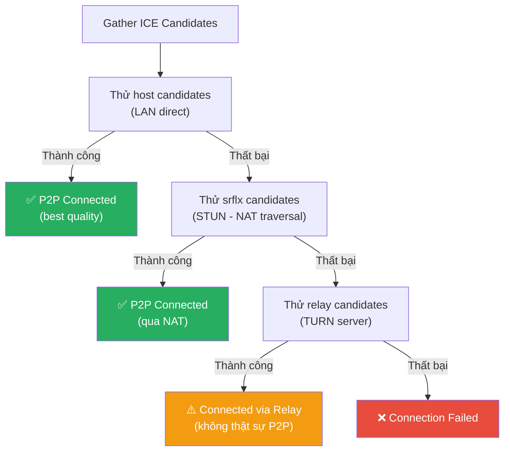
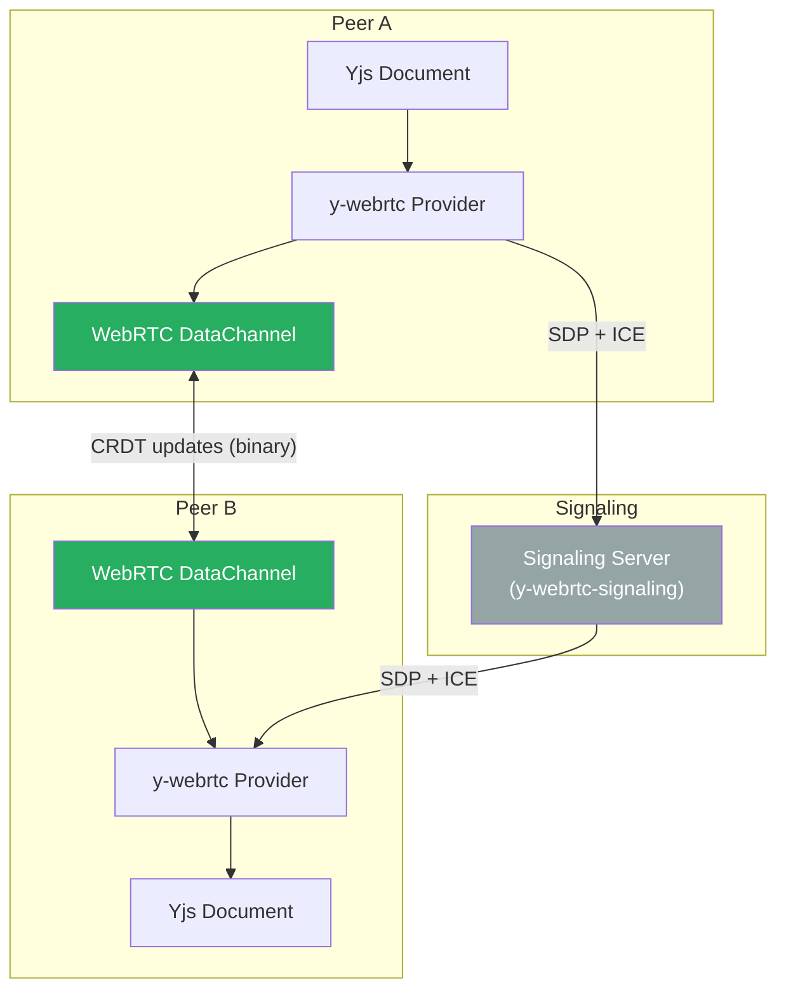

# WebRTC Deep Dive — Thiết lập kết nối P2P

> Tài liệu giải thích cách WebRTC thiết lập kết nối peer-to-peer trong thực tế, từ NAT traversal đến CRDT sync. Không yêu cầu kiến thức nền tảng về networking.

---

## 1. Hiểu lầm phổ biến

Trước khi đi vào chi tiết, cần làm rõ một số hiểu lầm phổ biến về WebRTC:

| Mô tả | Đúng/Sai | Giải thích |
|---|---|---|
| "WebRTC là P2P" | ⚠️ **Phần lớn đúng** | ~70-80% connections là P2P thật, nhưng ~20-30% phải đi qua relay server (TURN) |
| "Client tự tìm route tới client khác" | ❌ **Sai** | Cần Signaling Server + STUN + có thể cần TURN để thiết lập kết nối |
| "Không cần server" | ❌ **Sai** | Cần **ít nhất 2 loại server** (Signaling + STUN) trong giai đoạn thiết lập |
| "Sau khi kết nối thì data đi trực tiếp P2P" | ✅ **Đúng** | Nếu không qua TURN relay, data đi thẳng giữa hai peers |
| "WebRTC chỉ dùng cho video call" | ❌ **Sai** | WebRTC có **DataChannel** cho arbitrary data — dùng cho CRDT sync, file transfer, gaming |
| "WebRTC không an toàn" | ❌ **Sai** | Mọi kết nối đều **bắt buộc mã hóa** (DTLS/SRTP), kể cả qua TURN relay |

> [!NOTE]
> **Tóm lại**: WebRTC = P2P **sau khi** thiết lập kết nối. Nhưng giai đoạn thiết lập luôn cần servers trung gian. Đây là cái giá phải trả để "đục lỗ" qua NAT/firewall.

---

## 2. Bài toán thật sự: NAT Traversal

### Tại sao không thể kết nối trực tiếp?

Hầu hết devices trên Internet đều ở **sau NAT** (Network Address Translation):

```
                    Internet
                       │
              ┌────────┴────────┐
              │                 │
        ┌─────┴─────┐    ┌─────┴─────┐
        │  NAT/     │    │  NAT/     │
        │  Router A │    │  Router B │
        │           │    │           │
        └─────┬─────┘    └─────┬─────┘
              │                 │
     ┌────────┼────┐    ┌──────┼──────┐
     │        │    │    │      │      │
   Alice    Bob  ...  Carol  Dave   ...
   
   Private   192.168.1.x      10.0.0.x
   Public    → 203.0.113.5    → 198.51.100.7
```

**Vấn đề cụ thể**: Alice muốn gửi packet trực tiếp tới Carol, nhưng:

1. Alice chỉ biết IP private của mình (`192.168.1.10`) — **không dùng được trên Internet**
2. Alice **không biết** IP public của mình (`203.0.113.5`)
3. Alice **không biết** IP public của Carol (`198.51.100.7`)
4. Ngay cả khi biết IP public của Carol, NAT Router B sẽ **chặn** incoming packets vì không có mapping

> [!IMPORTANT]
> **Đây là lý do WebRTC không thể "tự tìm route"**. Nó cần cơ chế bên ngoài để:
> 1. **Trao đổi thông tin** kết nối (Signaling)
> 2. **Phát hiện IP public** (STUN)
> 3. **"Đục lỗ" qua NAT** (ICE)
> 4. **Dùng relay** khi P2P thất bại (TURN)

---

## 3. Bốn thành phần của WebRTC Connection

### 3.0 Tổng quan kiến trúc

```mermaid
sequenceDiagram
    participant A as Alice (Browser)
    participant SS as Signaling Server<br/>(WebSocket/HTTP)
    participant STUN as STUN Server<br/>(Google/Twilio)
    participant TURN as TURN Server<br/>(Relay - backup)
    participant B as Bob (Browser)
    
    Note over A,B: Phase 1: Signaling (trao đổi SDP + ICE candidates)
    
    A->>STUN: "IP public của tôi là gì?"
    STUN-->>A: "203.0.113.5:12345"
    B->>STUN: "IP public của tôi là gì?"
    STUN-->>B: "198.51.100.7:54321"
    
    A->>SS: SDP Offer + ICE Candidates
    SS->>B: Forward SDP Offer + ICE Candidates
    B->>SS: SDP Answer + ICE Candidates
    SS->>A: Forward SDP Answer + ICE Candidates
    
    Note over A,B: Phase 2: ICE Connectivity Check
    
    A->>B: STUN Binding Request (direct)
    B->>A: STUN Binding Response
    
    Note over A,B: Phase 3: P2P Established ✓
    
    A<->B: DTLS Handshake → SRTP/SCTP Data
    
    Note over A,B: Nếu direct thất bại:
    A->>TURN: Allocate relay
    TURN-->>A: Relay address
    A-->TURN: Data
    TURN-->B: Relay data
```

### Vai trò của từng thành phần

| Thành phần | Vai trò | Khi nào cần | Chi phí |
|---|---|---|---|
| **Signaling Server** | Chuyển tiếp "danh thiếp" (SDP + ICE) giữa hai peers | **Luôn luôn** — WebRTC không định nghĩa cách signaling | Tự host (WebSocket) |
| **STUN Server** | Giúp client phát hiện IP public của mình | **Luôn luôn** — cần biết IP public | Free (Google STUN) |
| **ICE Framework** | Thử mọi đường kết nối, chọn tốt nhất | Built-in WebRTC API | N/A |
| **TURN Server** | Relay data khi P2P thất bại | ~20-30% connections | **Tốn tiền** (~$0.40/GB) |

---

### 3.1 Signaling Server — "Người mai mối"

**WebRTC spec KHÔNG định nghĩa signaling** — bạn tự implement bằng bất kỳ cách nào (WebSocket, HTTP, thậm chí email).

Signaling Server chỉ làm một việc: **chuyển tiếp thông tin kết nối** giữa hai peers trước khi chúng biết nhau.

```javascript
// signaling-server.js (Node.js + WebSocket)
const WebSocket = require('ws');
const wss = new WebSocket.Server({ port: 9090 });

const rooms = new Map(); // roomId → Set<WebSocket>

wss.on('connection', (ws) => {
  ws.on('message', (raw) => {
    const msg = JSON.parse(raw);
    
    switch (msg.type) {
      case 'join':
        // Client tham gia phòng
        if (!rooms.has(msg.room)) rooms.set(msg.room, new Set());
        rooms.get(msg.room).add(ws);
        ws.room = msg.room;
        ws.peerId = msg.peerId;
        
        // Thông báo cho peers khác trong phòng
        broadcast(msg.room, ws, {
          type: 'peer-joined',
          peerId: msg.peerId,
        });
        break;
        
      case 'offer':
      case 'answer':
      case 'ice-candidate':
        // Chuyển tiếp SDP/ICE tới peer đích
        const target = findPeer(msg.room, msg.targetPeerId);
        if (target) {
          target.send(JSON.stringify({
            ...msg,
            fromPeerId: ws.peerId,
          }));
        }
        break;
    }
  });
  
  ws.on('close', () => {
    if (ws.room && rooms.has(ws.room)) {
      rooms.get(ws.room).delete(ws);
      broadcast(ws.room, ws, {
        type: 'peer-left',
        peerId: ws.peerId,
      });
    }
  });
});

function broadcast(room, sender, msg) {
  for (const client of rooms.get(room) || []) {
    if (client !== sender && client.readyState === WebSocket.OPEN) {
      client.send(JSON.stringify(msg));
    }
  }
}

function findPeer(room, peerId) {
  for (const client of rooms.get(room) || []) {
    if (client.peerId === peerId) return client;
  }
  return null;
}
```

> [!NOTE]
> Signaling Server **KHÔNG** truyền data thật. Nó chỉ hoạt động trong **vài giây đầu** để hai peers trao đổi "danh thiếp" (SDP + ICE candidates). Sau đó có thể tắt mà connection vẫn hoạt động.

---

### 3.2 STUN Server — "Gương soi IP"

**STUN** (Session Traversal Utilities for NAT) giúp client phát hiện **IP public + port** mà NAT router đã gán cho nó.

```
Alice (192.168.1.10:5000)
    │
    │  STUN Binding Request
    ▼
NAT Router A (gán mapping: 192.168.1.10:5000 → 203.0.113.5:12345)
    │
    │  Source: 203.0.113.5:12345
    ▼
STUN Server (stun.l.google.com:19302)
    │
    │  STUN Binding Response:
    │  "Your public address is 203.0.113.5:12345"
    ▼
Alice: "À, IP public của tôi là 203.0.113.5:12345!"
```

```javascript
// Trong WebRTC API, STUN được cấu hình qua iceServers:
const peerConnection = new RTCPeerConnection({
  iceServers: [
    // STUN servers miễn phí (chỉ dùng cho ICE candidate gathering)
    { urls: 'stun:stun.l.google.com:19302' },
    { urls: 'stun:stun1.l.google.com:19302' },
    { urls: 'stun:stun.stunprotocol.org:3478' },
  ]
});
```

**Chi phí**: STUN server rất nhẹ (chỉ phản hồi IP), có thể dùng STUN miễn phí của Google. Bandwidth gần như bằng 0.

---

### 3.3 ICE Framework — "Thử mọi đường"

**ICE** (Interactive Connectivity Establishment) là quy trình thử **tất cả các đường kết nối có thể**, rồi chọn đường tốt nhất.

#### ICE Candidates — 3 loại "đường đi"

```
┌─────────────────────────────────────────────────────────┐
│                    ICE Candidates                        │
│                                                          │
│  ┌──────────────┐  ┌──────────────┐  ┌──────────────┐  │
│  │    host      │  │    srflx     │  │    relay     │  │
│  │              │  │              │  │              │  │
│  │  Local IP    │  │  Public IP   │  │  TURN server │  │
│  │  (LAN only)  │  │  (via STUN)  │  │  (relay)     │  │
│  │              │  │              │  │              │  │
│  │  Ưu tiên: 1  │  │  Ưu tiên: 2  │  │  Ưu tiên: 3  │  │
│  │  (cao nhất)  │  │  (trung bình) │  │  (thấp nhất) │  │
│  └──────────────┘  └──────────────┘  └──────────────┘  │
│                                                          │
│  ICE thử theo thứ tự ưu tiên:                           │
│  host → srflx → relay                                   │
└─────────────────────────────────────────────────────────┘
```

| Loại | Tên đầy đủ | Cách hoạt động | Khi nào dùng |
|---|---|---|---|
| **host** | Host Candidate | Dùng IP private trực tiếp | Hai peers cùng mạng LAN |
| **srflx** | Server Reflexive | Dùng IP public từ STUN | Hai peers khác mạng, NAT cho phép |
| **relay** | Relay Candidate | Mọi data đi qua TURN server | NAT symmetric, firewall chặn |

#### ICE Connectivity Check Process



#### NAT Types và khả năng P2P

Không phải NAT nào cũng giống nhau. Loại NAT quyết định liệu P2P có thành công hay không:

```
┌─────────────────────────────────────────────────────────────────┐
│                        NAT Types                                │
│                                                                  │
│  Full Cone NAT ──────── Dễ traverse nhất                        │
│  │  Mọi external host đều gửi được tới mapped port              │
│  │                                                               │
│  Restricted Cone NAT ── Chỉ host mà internal đã gửi tới        │
│  │                                                               │
│  Port Restricted NAT ── Chỉ host:port mà internal đã gửi tới   │
│  │                                                               │
│  Symmetric NAT ───────── Khó traverse nhất                      │
│     Mỗi destination khác nhau → mapped port khác nhau            │
│     → STUN không giúp được → PHẢI dùng TURN                    │
└─────────────────────────────────────────────────────────────────┘
```

**Ma trận khả năng kết nối P2P theo loại NAT:**

| Alice \ Bob | Full Cone | Restricted | Port Restricted | Symmetric |
|---|---|---|---|---|
| **Full Cone** | ✅ Direct | ✅ Direct | ✅ Direct | ✅ Direct |
| **Restricted** | ✅ Direct | ✅ Direct | ✅ Direct | ⚠️ Có thể |
| **Port Restricted** | ✅ Direct | ✅ Direct | ✅ Direct | ❌ TURN |
| **Symmetric** | ✅ Direct | ⚠️ Có thể | ❌ TURN | ❌ TURN |

> [!IMPORTANT]
> Khoảng **~15-25% connections** phải dùng TURN relay vì cả hai peers đều ở sau Symmetric NAT (phổ biến ở enterprise networks, 4G/5G carriers). Lúc đó **KHÔNG còn là P2P thật sự** — data đi qua TURN server trung gian.

---

### 3.4 TURN Server — "Plan B khi P2P thất bại"

**TURN** (Traversal Using Relays around NAT) là relay server — mọi data đi qua nó.

```
Alice ←──encrypted──→ TURN Server ←──encrypted──→ Bob

  Không phải P2P, nhưng:
  - Vẫn end-to-end encrypted (DTLS)
  - TURN server KHÔNG đọc được nội dung
  - Tăng latency + bandwidth cost
```

```javascript
const peerConnection = new RTCPeerConnection({
  iceServers: [
    // STUN (miễn phí)
    { urls: 'stun:stun.l.google.com:19302' },
    
    // TURN (tốn tiền — relay bandwidth)
    {
      urls: 'turn:turn.example.com:3478',
      username: 'user',
      credential: 'pass',
    },
    {
      urls: 'turns:turn.example.com:443',  // TURN over TLS
      username: 'user', 
      credential: 'pass',
    },
  ]
});
```

**Chi phí TURN**: Relay **tất cả media/data traffic** → rất tốn bandwidth. Dịch vụ managed: Twilio (~$0.40/GB), Xirsys, hoặc tự host coturn.

> [!TIP]
> **Nên dùng TURN managed hay tự host?**
> - **Managed** (Twilio, Xirsys): Dễ setup, global coverage, tốn ~$0.40/GB
> - **Tự host** (coturn): Rẻ hơn nếu traffic lớn, nhưng cần DevOps maintain
> - **Khuyến nghị**: Bắt đầu với managed, chuyển sang self-host khi traffic > 1TB/month

---

## 4. Full Connection Flow — Code chi tiết

```javascript
// ============================================================
// webrtc-peer.js — Complete P2P connection with data channel
// ============================================================

class WebRTCPeer {
  constructor(signalingUrl, roomId, peerId) {
    this.peerId = peerId;
    this.connections = new Map(); // remotePeerId → RTCPeerConnection
    this.dataChannels = new Map(); // remotePeerId → RTCDataChannel
    
    // 1. Connect to Signaling Server
    this.signaling = new WebSocket(signalingUrl);
    this.signaling.onopen = () => {
      this.signaling.send(JSON.stringify({
        type: 'join', room: roomId, peerId,
      }));
    };
    this.signaling.onmessage = (e) => this.onSignalingMessage(JSON.parse(e.data));
  }
  
  // ---- Signaling Message Handler ----
  
  async onSignalingMessage(msg) {
    switch (msg.type) {
      case 'peer-joined':
        // Tôi là người tạo offer (initiator)
        await this.createOffer(msg.peerId);
        break;
        
      case 'offer':
        // Nhận offer → tạo answer
        await this.handleOffer(msg.fromPeerId, msg.sdp);
        break;
        
      case 'answer':
        // Nhận answer → hoàn tất handshake
        await this.handleAnswer(msg.fromPeerId, msg.sdp);
        break;
        
      case 'ice-candidate':
        // Nhận ICE candidate từ remote peer
        await this.handleIceCandidate(msg.fromPeerId, msg.candidate);
        break;
    }
  }
  
  // ---- Create Peer Connection ----
  
  createPeerConnection(remotePeerId) {
    const pc = new RTCPeerConnection({
      iceServers: [
        { urls: 'stun:stun.l.google.com:19302' },
        { urls: 'stun:stun1.l.google.com:19302' },
        {
          urls: 'turn:turn.example.com:3478',
          username: 'user',
          credential: 'pass',
        },
      ],
      // ICE transport policy: 'all' (default) hoặc 'relay' (force TURN)
      iceTransportPolicy: 'all',
    });
    
    // Khi ICE tìm được candidate → gửi qua signaling
    pc.onicecandidate = ({ candidate }) => {
      if (candidate) {
        console.log(`ICE candidate found: ${candidate.type}`, candidate);
        // candidate.type: 'host' | 'srflx' | 'relay'
        
        this.signaling.send(JSON.stringify({
          type: 'ice-candidate',
          targetPeerId: remotePeerId,
          candidate: candidate.toJSON(),
        }));
      }
    };
    
    // Connection state monitoring
    pc.oniceconnectionstatechange = () => {
      console.log(`ICE state [${remotePeerId}]:`, pc.iceConnectionState);
      // States: new → checking → connected → completed → disconnected → failed → closed
      
      if (pc.iceConnectionState === 'connected') {
        // Kiểm tra đường kết nối thực tế
        this.logConnectionType(pc);
      }
      
      if (pc.iceConnectionState === 'failed') {
        console.log('ICE failed — có thể do firewall hoặc Symmetric NAT');
        // Có thể thử ICE restart:
        pc.restartIce();
      }
    };
    
    // Nhận data channel từ remote
    pc.ondatachannel = (event) => {
      this.setupDataChannel(remotePeerId, event.channel);
    };
    
    this.connections.set(remotePeerId, pc);
    return pc;
  }
  
  // ---- Offer / Answer Exchange ----
  
  async createOffer(remotePeerId) {
    const pc = this.createPeerConnection(remotePeerId);
    
    // Tạo data channel (phải tạo TRƯỚC createOffer)
    const dc = pc.createDataChannel('data', {
      ordered: true,        // đảm bảo thứ tự (TCP-like)
      // ordered: false,    // không đảm bảo thứ tự (UDP-like, lower latency)
      // maxRetransmits: 3, // số lần retry tối đa
    });
    this.setupDataChannel(remotePeerId, dc);
    
    // Tạo SDP Offer
    const offer = await pc.createOffer();
    await pc.setLocalDescription(offer);
    
    // Gửi offer qua signaling server
    this.signaling.send(JSON.stringify({
      type: 'offer',
      targetPeerId: remotePeerId,
      sdp: pc.localDescription.toJSON(),
    }));
  }
  
  async handleOffer(remotePeerId, sdp) {
    const pc = this.createPeerConnection(remotePeerId);
    
    await pc.setRemoteDescription(new RTCSessionDescription(sdp));
    
    // Tạo SDP Answer
    const answer = await pc.createAnswer();
    await pc.setLocalDescription(answer);
    
    this.signaling.send(JSON.stringify({
      type: 'answer',
      targetPeerId: remotePeerId,
      sdp: pc.localDescription.toJSON(),
    }));
  }
  
  async handleAnswer(remotePeerId, sdp) {
    const pc = this.connections.get(remotePeerId);
    await pc.setRemoteDescription(new RTCSessionDescription(sdp));
  }
  
  async handleIceCandidate(remotePeerId, candidate) {
    const pc = this.connections.get(remotePeerId);
    if (pc && candidate) {
      await pc.addIceCandidate(new RTCIceCandidate(candidate));
    }
  }
  
  // ---- Data Channel ----
  
  setupDataChannel(remotePeerId, channel) {
    channel.onopen = () => {
      console.log(`Data channel OPEN with ${remotePeerId}`);
      this.dataChannels.set(remotePeerId, channel);
    };
    
    channel.onmessage = (event) => {
      const data = JSON.parse(event.data);
      console.log(`Received from ${remotePeerId}:`, data);
      this.onData?.(remotePeerId, data);
    };
    
    channel.onclose = () => {
      console.log(`Data channel CLOSED with ${remotePeerId}`);
      this.dataChannels.delete(remotePeerId);
    };
    
    channel.onerror = (error) => {
      console.error(`Data channel ERROR with ${remotePeerId}:`, error);
    };
  }
  
  // Gửi data tới một peer
  send(remotePeerId, data) {
    const dc = this.dataChannels.get(remotePeerId);
    if (dc && dc.readyState === 'open') {
      dc.send(JSON.stringify(data));
    }
  }
  
  // Broadcast tới tất cả peers
  broadcast(data) {
    for (const [peerId, dc] of this.dataChannels) {
      if (dc.readyState === 'open') {
        dc.send(JSON.stringify(data));
      }
    }
  }
  
  // ---- Debug: Xem đang dùng đường kết nối nào ----
  
  async logConnectionType(pc) {
    const stats = await pc.getStats();
    
    stats.forEach((report) => {
      if (report.type === 'candidate-pair' && report.state === 'succeeded') {
        const localId = report.localCandidateId;
        const remoteId = report.remoteCandidateId;
        
        stats.forEach((r) => {
          if (r.id === localId) {
            console.log('Local candidate:', {
              type: r.candidateType,  // 'host' | 'srflx' | 'relay'
              protocol: r.protocol,   // 'udp' | 'tcp'
              address: r.address,
              port: r.port,
            });
          }
          if (r.id === remoteId) {
            console.log('Remote candidate:', {
              type: r.candidateType,
              protocol: r.protocol,
              address: r.address,
              port: r.port,
            });
          }
        });
      }
    });
  }
}
```

---

## 5. SDP — "Danh thiếp" của Peer

SDP (Session Description Protocol) chứa thông tin media/data capabilities. Đây là ví dụ một SDP thật:

```
v=0
o=- 4628370238 2 IN IP4 127.0.0.1
s=-
t=0 0

// ICE credentials (mỗi session khác nhau)
a=ice-ufrag:F7gI          ← username fragment
a=ice-pwd:x9cml/YzichV2+XGvA  ← password

// DTLS fingerprint (end-to-end encryption)
a=fingerprint:sha-256 D1:DC:5A:...

// Data channel
m=application 9 UDP/DTLS/SCTP webrtc-datachannel
a=sctp-port:5000
a=max-message-size:262144

// ICE candidates (có thể inline hoặc trickle)
a=candidate:1 1 udp 2122260223 192.168.1.10 52000 typ host
a=candidate:2 1 udp 1686052607 203.0.113.5 12345 typ srflx raddr 192.168.1.10 rport 52000
a=candidate:3 1 udp 41885695 198.51.100.99 3478 typ relay raddr 203.0.113.5 rport 12345
```

**Giải thích từng phần quan trọng:**

| Field | Ý nghĩa | Ví dụ |
|---|---|---|
| `ice-ufrag` + `ice-pwd` | Credentials cho ICE, mỗi session unique | `F7gI` / `x9cml/...` |
| `fingerprint` | DTLS certificate hash — đảm bảo E2E encryption | `sha-256 D1:DC:...` |
| `candidate ... typ host` | IP private, ưu tiên cao nhất | `192.168.1.10:52000` |
| `candidate ... typ srflx` | IP public (qua STUN), ưu tiên trung bình | `203.0.113.5:12345` |
| `candidate ... typ relay` | TURN relay address, ưu tiên thấp nhất | `198.51.100.99:3478` |

---

## 6. Kết nối WebRTC với CRDT (y-webrtc)

Đây là cách Yjs sử dụng WebRTC cho P2P CRDT sync — kết hợp trực tiếp với tài liệu OT/CRDT:



```javascript
import * as Y from 'yjs';
import { WebrtcProvider } from 'y-webrtc';

const ydoc = new Y.Doc();

// P2P sync via WebRTC — signaling server chỉ dùng lúc đầu
const provider = new WebrtcProvider('my-room', ydoc, {
  // Signaling servers (chỉ để trao đổi SDP/ICE)
  signaling: ['wss://signaling.yjs.dev'],
  
  // Password (optional — encrypt room)
  password: 'secret',
  
  // Awareness
  awareness: ydoc.awareness,
  
  // ICE servers
  peerOpts: {
    config: {
      iceServers: [
        { urls: 'stun:stun.l.google.com:19302' },
      ],
    },
  },
  
  // Max connections (mesh topology)
  maxConns: 20,
});

// Sau khi kết nối: data đi TRỰC TIẾP peer-to-peer
// KHÔNG qua bất kỳ server nào (trừ khi TURN)
const ytext = ydoc.getText('content');
ytext.insert(0, 'Hello from P2P!');
// → Tự động broadcast tới tất cả peers qua WebRTC DataChannel
```

> [!WARNING]
> **Mesh topology problem**: Với N peers, cần N×(N-1)/2 connections.
> - 5 peers = 10 connections ✅
> - 10 peers = 45 connections ⚠️
> - 20 peers = 190 connections ❌
>
> Với >20 peers, nên dùng **WebSocket relay** thay vì WebRTC mesh, hoặc chuyển sang **SFU** (Selective Forwarding Unit) topology.

---

## 7. Tóm tắt: WebRTC Connection Timeline

```
Thời gian
  │
  │  T=0ms     Client A mở app
  │  T=50ms    Connect tới Signaling Server (WebSocket)
  │  T=100ms   Join room, nhận danh sách peers
  │  T=150ms   Tạo RTCPeerConnection + DataChannel
  │  T=200ms   Gửi STUN request → nhận IP public
  │  T=250ms   Gather ICE candidates (host, srflx, relay)
  │  T=300ms   Tạo SDP Offer → gửi qua Signaling Server
  │  T=350ms   Nhận SDP Answer + remote ICE candidates
  │  T=400ms   ICE connectivity checks bắt đầu
  │  T=500ms   ✅ ICE connected (host/srflx/relay)
  │  T=550ms   DTLS handshake (end-to-end encryption)
  │  T=600ms   ✅ DataChannel OPEN — P2P ready!
  │
  │  T=600ms+  Data đi TRỰC TIẾP giữa peers
  │            Signaling Server KHÔNG cần nữa
  │            (có thể disconnect)
  ▼
```

> [!TIP]
> **Tổng thời gian thiết lập**: ~500-800ms trong điều kiện bình thường. Nếu phải fallback qua TURN: +200-500ms thêm. Sau khi thiết lập, latency P2P thường < 50ms (so với ~100-200ms qua server relay).

---

## 8. Checklist: Triển khai WebRTC trong Production

### Bắt buộc

- [ ] **Signaling Server**: WebSocket-based, hỗ trợ rooms
- [ ] **STUN**: Cấu hình ít nhất 2 STUN servers (Google free)
- [ ] **TURN**: Bắt buộc cho production (15-25% users cần relay)
- [ ] **ICE restart**: Handle `iceConnectionState === 'failed'`
- [ ] **Reconnection logic**: Detect disconnects, auto-reconnect

### Nên có

- [ ] **Connection quality monitoring**: `getStats()` API
- [ ] **Adaptive**: Chuyển ordered ↔ unordered DataChannel theo network
- [ ] **Fallback**: WebSocket fallback nếu WebRTC hoàn toàn thất bại
- [ ] **Metrics**: Track % connections qua host/srflx/relay

### Scale considerations

- [ ] **< 10 peers**: Mesh topology (WebRTC) ✅
- [ ] **10-50 peers**: SFU (Selective Forwarding Unit) hoặc hybrid
- [ ] **> 50 peers**: WebSocket relay + server-side fan-out


# WebRTC — P2P Connection Establishment Deep Dive

## 1. Hiểu lầm phổ biến

| Mô tả | Đúng/Sai |
|---|---|
| "WebRTC là P2P" | ⚠️ **Phần lớn đúng** — nhưng ~20-30% connections phải đi qua relay server |
| "Client tự tìm route tới client khác" | ❌ **Sai** — cần Signaling Server + STUN + có thể cần TURN |
| "Không cần server" | ❌ **Sai** — cần ít nhất 2 loại server để thiết lập kết nối |
| "Sau khi kết nối thì data đi trực tiếp P2P" | ✅ **Đúng** (nếu không qua TURN) |

## 2. Bài toán thật sự: NAT Traversal

Hầu hết devices trên Internet đều ở **sau NAT** (Network Address Translation):

```
                    Internet
                       │
              ┌────────┴────────┐
              │                 │
        ┌─────┴─────┐    ┌─────┴─────┐
        │  NAT/     │    │  NAT/     │
        │  Router A │    │  Router B │
        │           │    │           │
        └─────┬─────┘    └─────┬─────┘
              │                 │
     ┌────────┼────┐    ┌──────┼──────┐
     │        │    │    │      │      │
   Alice    Bob  ...  Carol  Dave   ...
   
   Private   192.168.1.x      10.0.0.x
   Public    → 203.0.113.5    → 198.51.100.7
```

**Vấn đề**: Alice muốn gửi packet trực tiếp tới Carol, nhưng:
- Alice chỉ biết IP private của mình (`192.168.1.10`) — **không dùng được trên Internet**
- Alice không biết IP public của mình (`203.0.113.5`)
- Alice không biết IP public của Carol (`198.51.100.7`)
- Ngay cả khi biết IP public của Carol, NAT Router B sẽ **chặn** incoming packets vì không có mapping

> [!IMPORTANT]
> **Đây là lý do WebRTC không thể "tự tìm route"**. Nó cần cơ chế bên ngoài để:
> 1. Trao đổi thông tin kết nối (Signaling)
> 2. Phát hiện IP public (STUN)
> 3. "Đục lỗ" qua NAT (ICE)
> 4. Dùng relay khi P2P thất bại (TURN)

---

## 3. Bốn thành phần của WebRTC Connection

### Tổng quan kiến trúc

```mermaid
sequenceDiagram
    participant A as Alice (Browser)
    participant SS as Signaling Server<br/>(WebSocket/HTTP)
    participant STUN as STUN Server<br/>(Google/Twilio)
    participant TURN as TURN Server<br/>(Relay - backup)
    participant B as Bob (Browser)
    
    Note over A,B: Phase 1: Signaling (trao đổi SDP + ICE candidates)
    
    A->>STUN: "IP public của tôi là gì?"
    STUN-->>A: "203.0.113.5:12345"
    B->>STUN: "IP public của tôi là gì?"
    STUN-->>B: "198.51.100.7:54321"
    
    A->>SS: SDP Offer + ICE Candidates
    SS->>B: Forward SDP Offer + ICE Candidates
    B->>SS: SDP Answer + ICE Candidates
    SS->>A: Forward SDP Answer + ICE Candidates
    
    Note over A,B: Phase 2: ICE Connectivity Check
    
    A->>B: STUN Binding Request (direct)
    B->>A: STUN Binding Response
    
    Note over A,B: Phase 3: P2P Established ✓
    
    A<-->B: DTLS Handshake → SRTP/SCTP Data
    
    Note over A,B: Nếu direct thất bại:
    A->>TURN: Allocate relay
    TURN-->>A: Relay address
    A-->TURN: Data
    TURN-->B: Relay data
```

---

### 3.1 Signaling Server — "Người mai mối"

**WebRTC spec KHÔNG định nghĩa signaling** — bạn tự implement bằng bất kỳ cách nào (WebSocket, HTTP, thậm chí email).

Signaling Server chỉ làm một việc: **chuyển tiếp thông tin kết nối** giữa hai peers trước khi chúng biết nhau.

```javascript
// signaling-server.js (Node.js + WebSocket)
const WebSocket = require('ws');
const wss = new WebSocket.Server({ port: 9090 });

const rooms = new Map(); // roomId → Set<WebSocket>

wss.on('connection', (ws) => {
  ws.on('message', (raw) => {
    const msg = JSON.parse(raw);
    
    switch (msg.type) {
      case 'join':
        // Client tham gia phòng
        if (!rooms.has(msg.room)) rooms.set(msg.room, new Set());
        rooms.get(msg.room).add(ws);
        ws.room = msg.room;
        ws.peerId = msg.peerId;
        
        // Thông báo cho peers khác trong phòng
        broadcast(msg.room, ws, {
          type: 'peer-joined',
          peerId: msg.peerId,
        });
        break;
        
      case 'offer':
      case 'answer':
      case 'ice-candidate':
        // Chuyển tiếp SDP/ICE tới peer đích
        const target = findPeer(msg.room, msg.targetPeerId);
        if (target) {
          target.send(JSON.stringify({
            ...msg,
            fromPeerId: ws.peerId,
          }));
        }
        break;
    }
  });
  
  ws.on('close', () => {
    if (ws.room && rooms.has(ws.room)) {
      rooms.get(ws.room).delete(ws);
      broadcast(ws.room, ws, {
        type: 'peer-left',
        peerId: ws.peerId,
      });
    }
  });
});

function broadcast(room, sender, msg) {
  for (const client of rooms.get(room) || []) {
    if (client !== sender && client.readyState === WebSocket.OPEN) {
      client.send(JSON.stringify(msg));
    }
  }
}

function findPeer(room, peerId) {
  for (const client of rooms.get(room) || []) {
    if (client.peerId === peerId) return client;
  }
  return null;
}
```

> [!NOTE]
> Signaling Server **KHÔNG** truyền data thật. Nó chỉ hoạt động trong vài giây đầu để hai peers trao đổi "danh thiếp" (SDP + ICE candidates). Sau đó có thể tắt.

---

### 3.2 STUN Server — "Gương soi IP"

**STUN** (Session Traversal Utilities for NAT) giúp client phát hiện **IP public + port** mà NAT router đã gán cho nó.

```
Alice (192.168.1.10:5000)
    │
    │  STUN Binding Request
    ▼
NAT Router A (gán mapping: 192.168.1.10:5000 → 203.0.113.5:12345)
    │
    │  Source: 203.0.113.5:12345
    ▼
STUN Server (stun.l.google.com:19302)
    │
    │  STUN Binding Response:
    │  "Your public address is 203.0.113.5:12345"
    ▼
Alice: "À, IP public của tôi là 203.0.113.5:12345!"
```

```javascript
// Trong WebRTC API, STUN được cấu hình qua iceServers:
const peerConnection = new RTCPeerConnection({
  iceServers: [
    // STUN servers miễn phí (chỉ dùng cho ICE candidate gathering)
    { urls: 'stun:stun.l.google.com:19302' },
    { urls: 'stun:stun1.l.google.com:19302' },
    { urls: 'stun:stun.stunprotocol.org:3478' },
  ]
});
```

**Chi phí**: STUN server rất nhẹ (chỉ phản hồi IP), có thể dùng STUN miễn phí của Google. Bandwidth gần như bằng 0.

---

### 3.3 ICE Framework — "Thử mọi đường"

**ICE** (Interactive Connectivity Establishment) là quy trình thử **tất cả các đường kết nối có thể**, rồi chọn đường tốt nhất.

#### ICE Candidates — 3 loại "đường đi"

```
┌─────────────────────────────────────────────────────────┐
│                    ICE Candidates                        │
│                                                          │
│  ┌──────────────┐  ┌──────────────┐  ┌──────────────┐  │
│  │    host      │  │    srflx     │  │    relay     │  │
│  │              │  │              │  │              │  │
│  │  Local IP    │  │  Public IP   │  │  TURN server │  │
│  │  (LAN only)  │  │  (via STUN)  │  │  (relay)     │  │
│  │              │  │              │  │              │  │
│  │  Ưu tiên: 1  │  │  Ưu tiên: 2  │  │  Ưu tiên: 3  │  │
│  │  (cao nhất)  │  │  (trung bình) │  │  (thấp nhất) │  │
│  └──────────────┘  └──────────────┘  └──────────────┘  │
│                                                          │
│  ICE thử theo thứ tự ưu tiên:                           │
│  host → srflx → relay                                   │
└─────────────────────────────────────────────────────────┘
```

| Loại | Tên đầy đủ | Cách hoạt động | Khi nào dùng |
|---|---|---|---|
| **host** | Host Candidate | Dùng IP private trực tiếp | Hai peers cùng mạng LAN |
| **srflx** | Server Reflexive | Dùng IP public từ STUN | Hai peers khác mạng, NAT cho phép |
| **relay** | Relay Candidate | Mọi data đi qua TURN server | NAT symmetric, firewall chặn |

#### ICE Connectivity Check Process


#### NAT Types và khả năng P2P

```
┌─────────────────────────────────────────────────────────────────┐
│                        NAT Types                                │
│                                                                  │
│  Full Cone NAT ──────── Dễ traverse nhất                        │
│  │  Mọi external host đều gửi được tới mapped port              │
│  │                                                               │
│  Restricted Cone NAT ── Chỉ host mà internal đã gửi tới        │
│  │                                                               │
│  Port Restricted NAT ── Chỉ host:port mà internal đã gửi tới   │
│  │                                                               │
│  Symmetric NAT ───────── Khó traverse nhất                      │
│     Mỗi destination khác nhau → mapped port khác nhau            │
│     → STUN không giúp được → PHẢI dùng TURN                    │
└─────────────────────────────────────────────────────────────────┘
```

| Alice \ Bob | Full Cone | Restricted | Port Restricted | Symmetric |
|---|---|---|---|---|
| **Full Cone** | ✅ Direct | ✅ Direct | ✅ Direct | ✅ Direct |
| **Restricted** | ✅ Direct | ✅ Direct | ✅ Direct | ⚠️ Có thể |
| **Port Restricted** | ✅ Direct | ✅ Direct | ✅ Direct | ❌ TURN |
| **Symmetric** | ✅ Direct | ⚠️ Có thể | ❌ TURN | ❌ TURN |

> [!IMPORTANT]
> Khoảng **~15-25% connections** phải dùng TURN relay vì cả hai peers đều ở sau Symmetric NAT (phổ biến ở enterprise networks, 4G/5G carriers). Lúc đó **KHÔNG còn là P2P thật sự** — data đi qua TURN server trung gian.

---

### 3.4 TURN Server — "Plan B khi P2P thất bại"

**TURN** (Traversal Using Relays around NAT) là relay server — mọi data đi qua nó.

```
Alice ←──encrypted──→ TURN Server ←──encrypted──→ Bob

  Không phải P2P, nhưng:
  - Vẫn end-to-end encrypted (DTLS)
  - TURN server KHÔNG đọc được nội dung
  - Tăng latency + bandwidth cost
```

```javascript
const peerConnection = new RTCPeerConnection({
  iceServers: [
    // STUN (miễn phí)
    { urls: 'stun:stun.l.google.com:19302' },
    
    // TURN (tốn tiền — relay bandwidth)
    {
      urls: 'turn:turn.example.com:3478',
      username: 'user',
      credential: 'pass',
    },
    {
      urls: 'turns:turn.example.com:443',  // TURN over TLS
      username: 'user', 
      credential: 'pass',
    },
  ]
});
```

**Chi phí TURN**: Relay **tất cả media/data traffic** → rất tốn bandwidth. Dịch vụ managed: Twilio (~$0.40/GB), Xirsys, hoặc tự host coturn.

---

## 4. Full Connection Flow — Code chi tiết

```javascript
// ============================================================
// webrtc-peer.js — Complete P2P connection with data channel
// ============================================================

class WebRTCPeer {
  constructor(signalingUrl, roomId, peerId) {
    this.peerId = peerId;
    this.connections = new Map(); // remotePeerId → RTCPeerConnection
    this.dataChannels = new Map(); // remotePeerId → RTCDataChannel
    
    // 1. Connect to Signaling Server
    this.signaling = new WebSocket(signalingUrl);
    this.signaling.onopen = () => {
      this.signaling.send(JSON.stringify({
        type: 'join', room: roomId, peerId,
      }));
    };
    this.signaling.onmessage = (e) => this.onSignalingMessage(JSON.parse(e.data));
  }
  
  // ---- Signaling Message Handler ----
  
  async onSignalingMessage(msg) {
    switch (msg.type) {
      case 'peer-joined':
        // Tôi là người tạo offer (initiator)
        await this.createOffer(msg.peerId);
        break;
        
      case 'offer':
        // Nhận offer → tạo answer
        await this.handleOffer(msg.fromPeerId, msg.sdp);
        break;
        
      case 'answer':
        // Nhận answer → hoàn tất handshake
        await this.handleAnswer(msg.fromPeerId, msg.sdp);
        break;
        
      case 'ice-candidate':
        // Nhận ICE candidate từ remote peer
        await this.handleIceCandidate(msg.fromPeerId, msg.candidate);
        break;
    }
  }
  
  // ---- Create Peer Connection ----
  
  createPeerConnection(remotePeerId) {
    const pc = new RTCPeerConnection({
      iceServers: [
        { urls: 'stun:stun.l.google.com:19302' },
        { urls: 'stun:stun1.l.google.com:19302' },
        {
          urls: 'turn:turn.example.com:3478',
          username: 'user',
          credential: 'pass',
        },
      ],
      // ICE transport policy: 'all' (default) hoặc 'relay' (force TURN)
      iceTransportPolicy: 'all',
    });
    
    // Khi ICE tìm được candidate → gửi qua signaling
    pc.onicecandidate = ({ candidate }) => {
      if (candidate) {
        console.log(`ICE candidate found: ${candidate.type}`, candidate);
        // candidate.type: 'host' | 'srflx' | 'relay'
        
        this.signaling.send(JSON.stringify({
          type: 'ice-candidate',
          targetPeerId: remotePeerId,
          candidate: candidate.toJSON(),
        }));
      }
    };
    
    // Connection state monitoring
    pc.oniceconnectionstatechange = () => {
      console.log(`ICE state [${remotePeerId}]:`, pc.iceConnectionState);
      // States: new → checking → connected → completed → disconnected → failed → closed
      
      if (pc.iceConnectionState === 'connected') {
        // Kiểm tra đường kết nối thực tế
        this.logConnectionType(pc);
      }
      
      if (pc.iceConnectionState === 'failed') {
        console.log('ICE failed — có thể do firewall hoặc Symmetric NAT');
        // Có thể thử ICE restart:
        pc.restartIce();
      }
    };
    
    // Nhận data channel từ remote
    pc.ondatachannel = (event) => {
      this.setupDataChannel(remotePeerId, event.channel);
    };
    
    this.connections.set(remotePeerId, pc);
    return pc;
  }
  
  // ---- Offer / Answer Exchange ----
  
  async createOffer(remotePeerId) {
    const pc = this.createPeerConnection(remotePeerId);
    
    // Tạo data channel (phải tạo TRƯỚC createOffer)
    const dc = pc.createDataChannel('data', {
      ordered: true,        // đảm bảo thứ tự (TCP-like)
      // ordered: false,    // không đảm bảo thứ tự (UDP-like, lower latency)
      // maxRetransmits: 3, // số lần retry tối đa
    });
    this.setupDataChannel(remotePeerId, dc);
    
    // Tạo SDP Offer
    const offer = await pc.createOffer();
    await pc.setLocalDescription(offer);
    
    // Gửi offer qua signaling server
    this.signaling.send(JSON.stringify({
      type: 'offer',
      targetPeerId: remotePeerId,
      sdp: pc.localDescription.toJSON(),
    }));
  }
  
  async handleOffer(remotePeerId, sdp) {
    const pc = this.createPeerConnection(remotePeerId);
    
    await pc.setRemoteDescription(new RTCSessionDescription(sdp));
    
    // Tạo SDP Answer
    const answer = await pc.createAnswer();
    await pc.setLocalDescription(answer);
    
    this.signaling.send(JSON.stringify({
      type: 'answer',
      targetPeerId: remotePeerId,
      sdp: pc.localDescription.toJSON(),
    }));
  }
  
  async handleAnswer(remotePeerId, sdp) {
    const pc = this.connections.get(remotePeerId);
    await pc.setRemoteDescription(new RTCSessionDescription(sdp));
  }
  
  async handleIceCandidate(remotePeerId, candidate) {
    const pc = this.connections.get(remotePeerId);
    if (pc && candidate) {
      await pc.addIceCandidate(new RTCIceCandidate(candidate));
    }
  }
  
  // ---- Data Channel ----
  
  setupDataChannel(remotePeerId, channel) {
    channel.onopen = () => {
      console.log(`Data channel OPEN with ${remotePeerId}`);
      this.dataChannels.set(remotePeerId, channel);
    };
    
    channel.onmessage = (event) => {
      const data = JSON.parse(event.data);
      console.log(`Received from ${remotePeerId}:`, data);
      this.onData?.(remotePeerId, data);
    };
    
    channel.onclose = () => {
      console.log(`Data channel CLOSED with ${remotePeerId}`);
      this.dataChannels.delete(remotePeerId);
    };
    
    channel.onerror = (error) => {
      console.error(`Data channel ERROR with ${remotePeerId}:`, error);
    };
  }
  
  // Gửi data tới một peer
  send(remotePeerId, data) {
    const dc = this.dataChannels.get(remotePeerId);
    if (dc && dc.readyState === 'open') {
      dc.send(JSON.stringify(data));
    }
  }
  
  // Broadcast tới tất cả peers
  broadcast(data) {
    for (const [peerId, dc] of this.dataChannels) {
      if (dc.readyState === 'open') {
        dc.send(JSON.stringify(data));
      }
    }
  }
  
  // ---- Debug: Xem đang dùng đường kết nối nào ----
  
  async logConnectionType(pc) {
    const stats = await pc.getStats();
    
    stats.forEach((report) => {
      if (report.type === 'candidate-pair' && report.state === 'succeeded') {
        const localId = report.localCandidateId;
        const remoteId = report.remoteCandidateId;
        
        stats.forEach((r) => {
          if (r.id === localId) {
            console.log('Local candidate:', {
              type: r.candidateType,  // 'host' | 'srflx' | 'relay'
              protocol: r.protocol,   // 'udp' | 'tcp'
              address: r.address,
              port: r.port,
            });
          }
          if (r.id === remoteId) {
            console.log('Remote candidate:', {
              type: r.candidateType,
              protocol: r.protocol,
              address: r.address,
              port: r.port,
            });
          }
        });
      }
    });
  }
}
```

---

## 5. SDP — "Danh thiếp" của Peer

SDP (Session Description Protocol) chứa thông tin media/data capabilities:

```
v=0
o=- 4628370238 2 IN IP4 127.0.0.1
s=-
t=0 0

// ICE credentials (mỗi session khác nhau)
a=ice-ufrag:F7gI          ← username fragment
a=ice-pwd:x9cml/YzichV2+XGvA  ← password

// DTLS fingerprint (end-to-end encryption)
a=fingerprint:sha-256 D1:DC:5A:...

// Data channel
m=application 9 UDP/DTLS/SCTP webrtc-datachannel
a=sctp-port:5000
a=max-message-size:262144

// ICE candidates (có thể inline hoặc trickle)
a=candidate:1 1 udp 2122260223 192.168.1.10 52000 typ host
a=candidate:2 1 udp 1686052607 203.0.113.5 12345 typ srflx raddr 192.168.1.10 rport 52000
a=candidate:3 1 udp 41885695 198.51.100.99 3478 typ relay raddr 203.0.113.5 rport 12345
```

---

## 6. Kết nối WebRTC với CRDT (y-webrtc)

Đây là cách Yjs sử dụng WebRTC cho P2P CRDT sync:


```javascript
import * as Y from 'yjs';
import { WebrtcProvider } from 'y-webrtc';

const ydoc = new Y.Doc();

// P2P sync via WebRTC — signaling server chỉ dùng lúc đầu
const provider = new WebrtcProvider('my-room', ydoc, {
  // Signaling servers (chỉ để trao đổi SDP/ICE)
  signaling: ['wss://signaling.yjs.dev'],
  
  // Password (optional — encrypt room)
  password: 'secret',
  
  // Awareness
  awareness: ydoc.awareness,
  
  // ICE servers
  peerOpts: {
    config: {
      iceServers: [
        { urls: 'stun:stun.l.google.com:19302' },
      ],
    },
  },
  
  // Max connections (mesh topology)
  maxConns: 20,
});

// Sau khi kết nối: data đi TRỰC TIẾP peer-to-peer
// KHÔNG qua bất kỳ server nào (trừ khi TURN)
const ytext = ydoc.getText('content');
ytext.insert(0, 'Hello from P2P!');
// → Tự động broadcast tới tất cả peers qua WebRTC DataChannel
```

> [!WARNING]
> **Mesh topology problem**: Với N peers, cần N×(N-1)/2 connections. 10 peers = 45 connections. Với >20 peers, nên dùng WebSocket relay thay vì WebRTC mesh, hoặc chuyển sang **SFU** (Selective Forwarding Unit) topology.

---

## 7. Tóm tắt: WebRTC Connection Timeline

```
Thời gian
  │
  │  T=0ms     Client A mở app
  │  T=50ms    Connect tới Signaling Server (WebSocket)
  │  T=100ms   Join room, nhận danh sách peers
  │  T=150ms   Tạo RTCPeerConnection + DataChannel
  │  T=200ms   Gửi STUN request → nhận IP public
  │  T=250ms   Gather ICE candidates (host, srflx, relay)
  │  T=300ms   Tạo SDP Offer → gửi qua Signaling Server
  │  T=350ms   Nhận SDP Answer + remote ICE candidates
  │  T=400ms   ICE connectivity checks bắt đầu
  │  T=500ms   ✅ ICE connected (host/srflx/relay)
  │  T=550ms   DTLS handshake (end-to-end encryption)
  │  T=600ms   ✅ DataChannel OPEN — P2P ready!
  │
  │  T=600ms+  Data đi TRỰC TIẾP giữa peers
  │            Signaling Server KHÔNG cần nữa
  │            (có thể disconnect)
  ▼
```
