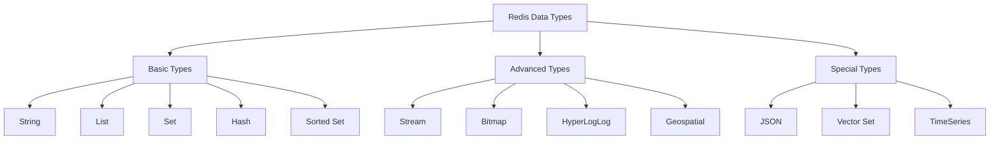
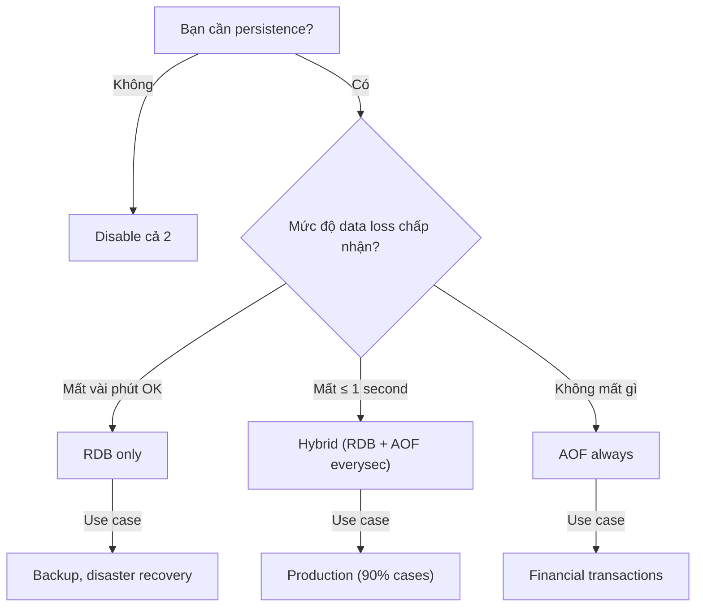
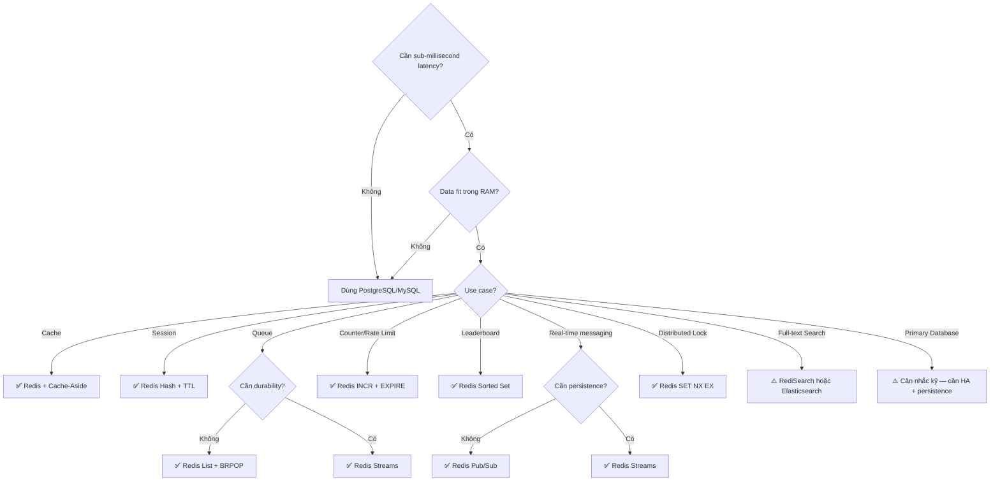

# Redis Deep Dive — Từ Cơ Bản Đến Chuyên Sâu

> **"Redis is not a cache. Redis is a data structure server."** — Salvatore Sanfilippo (Antirez), tác giả Redis.

## 1. Redis Là Gì?

**Redis** (**RE**mote **DI**ctionary **S**erver) là một **in-memory data structure store** mã nguồn mở, hoạt động như:

| Vai trò | Mô tả |
|---------|--------|
| **Cache** | Lớp đệm giảm tải cho database chính |
| **Database** | Lưu trữ dữ liệu chính (primary datastore) cho một số use case |
| **Message Broker** | Pub/Sub, Streams cho real-time messaging |
| **Session Store** | Quản lý phiên đăng nhập người dùng |
| **Queue** | Hàng đợi task cho background jobs |
| **Vector Store** | Lưu trữ embedding cho AI/ML (Redis 8.x+) |

### 1.1. Tại Sao Cần Redis?

```
┌─────────────┐     ~1ms      ┌─────────────┐
│  Application│ ◄────────────►│    Redis     │  ← In-memory
└──────┬──────┘               └─────────────┘
       │
       │  ~10-50ms
       ▼
┌─────────────┐
│  PostgreSQL  │  ← Disk-based
│  / MySQL     │
└─────────────┘
```

**Vấn đề cốt lõi mà Redis giải quyết:**

1. **Latency Gap**: Database truyền thống (PostgreSQL, MySQL) trả lời trong **5–50ms**. Redis trả lời trong **< 1ms** (sub-millisecond). Với hệ thống 100K requests/s, sự khác biệt này quyết định sống còn.

2. **Database Overload**: Khi 10,000 users cùng truy vấn cùng một query phức tạp (JOIN 5 bảng), database sẽ nghẽn. Redis cache kết quả → chỉ query database 1 lần.

3. **Shared State**: Trong kiến trúc microservices, nhiều service cần chia sẻ state (session, rate limit counter, feature flags). Redis đóng vai trò **shared memory** giữa các process/service.

### 1.2. Lịch Sử Phát Triển

| Năm | Phiên bản | Sự kiện quan trọng |
|-----|-----------|---------------------|
| 2009 | 1.0 | Salvatore Sanfilippo tạo ra Redis |
| 2012 | 2.6 | Lua scripting, millisecond precision expire |
| 2015 | 3.0 | **Redis Cluster** — horizontal scaling |
| 2018 | 5.0 | **Redis Streams** — event log data structure |
| 2020 | 6.0 | Multi-threaded I/O, ACL (Access Control List) |
| 2022 | 7.0 | Redis Functions, Sharded Pub/Sub |
| 2024 | Chuyển license → SSPL/RSALv2 → AGPLv3 (2025) |
| 2025 | 8.x | Vector Search native, Hybrid Search, Query Engine |

---

## 2. Kiến Trúc Nội Bộ Redis

### 2.1. Single-Threaded Event Loop

Đây là **điều quan trọng nhất** cần hiểu về Redis:

```
                    ┌─────────────────────────────┐
                    │     Redis Main Thread        │
                    │  ┌───────────────────────┐   │
                    │  │    Event Loop          │   │
  Client 1 ────────┼──┤  ┌─────────────────┐   │   │
  Client 2 ────────┼──┤  │  epoll/kqueue    │   │   │
  Client 3 ────────┼──┤  │  (I/O Multiplex) │   │   │
     ...   ────────┼──┤  └────────┬────────┘   │   │
  Client N ────────┼──┤           │            │   │
                    │  │  ┌───────▼───────┐    │   │
                    │  │  │  Command       │    │   │
                    │  │  │  Processing    │    │   │
                    │  │  │  (Sequential)  │    │   │
                    │  │  └───────────────┘    │   │
                    │  └───────────────────────┘   │
                    └─────────────────────────────┘
```

**Tại sao single-threaded lại nhanh?**

| Yếu tố | Giải thích |
|---------|-----------|
| **Không có lock** | Không context switch, không mutex, không deadlock |
| **CPU cache friendly** | Dữ liệu nằm trong L1/L2 cache vì chỉ 1 thread truy cập |
| **I/O multiplexing** | `epoll` (Linux) / `kqueue` (BSD) xử lý hàng nghìn connections đồng thời |
| **In-memory** | Mọi thứ nằm trong RAM → thời gian truy cập ~100ns |

::: warning Hệ quả quan trọng
Nếu một command tốn **lâu** (ví dụ `KEYS *` trên 10 triệu keys), **toàn bộ Redis sẽ bị block**. Tất cả client khác phải chờ. Đây là lý do tại sao `KEYS` bị cấm trong production.
:::

### 2.2. Multi-Threaded I/O (Redis 6.0+)

Redis 6.0 thêm **multi-threaded I/O** nhưng **command execution vẫn single-threaded**:

```
┌────────────────────────────────────────────┐
│            I/O Threads (configurable)       │
│  Thread 1: Read socket data + parse         │
│  Thread 2: Read socket data + parse         │
│  Thread 3: Read socket data + parse         │
│  Thread 4: Read socket data + parse         │
└─────────────────┬──────────────────────────┘
                  │ Parsed commands
                  ▼
┌────────────────────────────────────────────┐
│          Main Thread (single)               │
│  Execute commands sequentially              │
│  (Atomicity guaranteed)                     │
└─────────────────┬──────────────────────────┘
                  │ Responses
                  ▼
┌────────────────────────────────────────────┐
│            I/O Threads                      │
│  Write responses back to sockets            │
└────────────────────────────────────────────┘
```

**Config kích hoạt:**
```redis
io-threads 4            # Số I/O threads (recommend: số CPU cores / 2)
io-threads-do-reads yes  # Cho phép đọc đa luồng
```

### 2.3. Memory Model

Redis sử dụng **jemalloc** (thay vì glibc malloc) để quản lý bộ nhớ hiệu quả:

```
┌──────────────────────────────────────────┐
│              Redis Memory Layout          │
├──────────────────────────────────────────┤
│  Data Memory (keys + values)      ~80%   │
│  ├── Hash Tables (dictht)                │
│  ├── SDS Strings                         │
│  ├── Skiplists                           │
│  └── Ziplists / Listpacks               │
├──────────────────────────────────────────┤
│  Client Buffers                    ~5%   │
│  ├── Input buffer (query buffer)         │
│  └── Output buffer (reply buffer)        │
├──────────────────────────────────────────┤
│  AOF / Replication Buffer          ~5%   │
├──────────────────────────────────────────┤
│  Internal Overhead (jemalloc)     ~10%   │
│  ├── Memory fragmentation                │
│  └── Metadata (redisObject headers)      │
└──────────────────────────────────────────┘
```

**`redisObject`** — Mỗi value trong Redis được bọc bởi struct này:

```c
typedef struct redisObject {
    unsigned type:4;       // STRING, LIST, SET, ZSET, HASH, STREAM
    unsigned encoding:4;   // Internal encoding (ziplist, skiplist, ht...)
    unsigned lru:24;       // LRU time / LFU counter
    int refcount;          // Reference counting cho GC
    void *ptr;             // Con trỏ tới data thực sự
} robj; // 16 bytes per object
```

---

## 3. Cấu Trúc Dữ Liệu — "Trái Tim" Của Redis

### 3.1. Tổng Quan Các Kiểu Dữ Liệu



### 3.2. String — Cấu Trúc Nền Tảng

**Internal encoding: SDS (Simple Dynamic String)**

```
┌──────┬──────┬───────┬──────────────────┐
│ len  │ free │ flags │ buf[]            │
│ 5    │ 3    │ SDS8  │ H e l l o \0 _ _ │
└──────┴──────┴───────┴──────────────────┘
```

**Tại sao không dùng C string?**

| Tính năng | C String | SDS |
|-----------|----------|-----|
| Lấy độ dài | O(n) scan | O(1) — trường `len` |
| Binary safe | Không (dừng tại `\0`) | Có (lưu `len` riêng) |
| Buffer overflow | Có thể xảy ra | Tự động realloc |
| Memory realloc | Mỗi lần thay đổi | Space pre-allocation |

**Commands thiết yếu & Use Cases:**

```redis
# === Cơ bản ===
SET user:1001:name "Nguyen Van A"
GET user:1001:name

# === Atomic Counter (Rate Limiting, Page View) ===
INCR api:rate:192.168.1.1        # Atomic increment
INCRBY product:42:views 1
DECR stock:item:99               # Giảm tồn kho

# === Distributed Lock ===
SET lock:order:5001 "worker-3" NX EX 30
# NX = Only set if Not eXists
# EX 30 = Expire after 30 seconds

# === Cache với TTL ===
SETEX cache:homepage 3600 "<html>...</html>"   # 1 hour
PSETEX cache:otp:0901234567 300000 "482910"    # 5 minutes (ms)

# === Conditional SET (Redis 6.2+) ===
SET key value GET          # SET và trả về giá trị cũ
SET key value XX           # Chỉ SET nếu key đã tồn tại
SET key value NX EX 60     # Chỉ SET nếu key chưa tồn tại + TTL

# === Append & Range ===
APPEND log:2024-01-15 "10:30 Login user:1001\n"
GETRANGE user:bio 0 99    # Lấy 100 ký tự đầu
```

**Encoding tối ưu nội bộ:**

| Giá trị | Encoding | Bộ nhớ |
|---------|----------|--------|
| Số nguyên ≤ 2⁶³ | `int` | 0 bytes (embedded trong ptr) |
| String ≤ 44 bytes | `embstr` | 1 allocation (header + data liền) |
| String > 44 bytes | `raw` | 2 allocations (header + data riêng) |

### 3.3. Hash — Object Store

**Lý tưởng để lưu objects** thay vì serialize JSON thành String.

```redis
# === Lưu thông tin user ===
HSET user:1001 name "Nguyen Van A" 
                email "a@example.com" 
                age 28 
                role "admin"

HGET user:1001 name              # → "Nguyen Van A"
HMGET user:1001 name email       # Lấy nhiều fields
HGETALL user:1001                # Lấy tất cả

# === Partial Update (không cần re-serialize toàn bộ object) ===
HSET user:1001 last_login "2024-01-15T10:30:00Z"
HINCRBY user:1001 login_count 1

# === Check tồn tại ===
HEXISTS user:1001 email          # → 1 (true)

# === Hash Field Expiration (Redis 7.4+) ===
HEXPIRE user:1001 3600 FIELDS 1 session_token
# Field session_token sẽ tự xóa sau 1 giờ
```

**So sánh: Hash vs String cho Object storage:**

```
# ❌ Anti-pattern: JSON string
SET user:1001 '{"name":"A","email":"a@ex.com","age":28,"role":"admin"}'
# → Phải GET toàn bộ → parse → sửa 1 field → serialize → SET lại

# ✅ Best practice: Hash
HSET user:1001 name "A" email "a@ex.com" age 28 role "admin"
# → HSET user:1001 age 29  (chỉ update 1 field, atomic)
```

**Internal encoding:**

| Điều kiện | Encoding | Mô tả |
|-----------|----------|-------|
| entries ≤ 128 VÀ value ≤ 64 bytes | `listpack` (ziplist cũ) | Memory-compact, O(n) lookup |
| Ngược lại | `hashtable` | O(1) lookup, nhiều memory hơn |

### 3.4. List — Queue / Stack

```redis
# === Message Queue (FIFO) ===
LPUSH queue:emails '{"to":"a@ex.com","subject":"Welcome"}'
LPUSH queue:emails '{"to":"b@ex.com","subject":"Verify"}'
RPOP queue:emails    # Lấy phần tử cũ nhất (FIFO)

# === Blocking Queue (Worker pattern) ===
BRPOP queue:emails 30    # Block tối đa 30s chờ message mới
# → Worker ngủ thay vì poll liên tục, tiết kiệm CPU

# === Activity Feed / Timeline ===
LPUSH feed:user:1001 '{"type":"like","post":42,"time":"..."}'
LRANGE feed:user:1001 0 19    # 20 items mới nhất
LTRIM feed:user:1001 0 99     # Giữ tối đa 100 items

# === Stack (LIFO) ===
LPUSH stack:undo "action:delete:item:5"
LPOP stack:undo    # Lấy action gần nhất để undo
```

**Internal: Quicklist** (doubly linked list of ziplists):

```
┌──────────┐    ┌──────────┐    ┌──────────┐
│ ziplist  │◄──►│ ziplist  │◄──►│ ziplist  │
│ [A,B,C]  │    │ [D,E,F]  │    │ [G,H]    │
└──────────┘    └──────────┘    └──────────┘
```

### 3.5. Set — Tập Hợp Không Trùng Lặp

```redis
# === Tagging System ===
SADD post:42:tags "redis" "database" "nosql"
SADD post:43:tags "redis" "caching" "performance"

# === Set Operations ===
SINTER post:42:tags post:43:tags       # Giao: {"redis"}
SUNION post:42:tags post:43:tags       # Hợp: {"redis","database","nosql","caching","performance"}
SDIFF post:42:tags post:43:tags        # Hiệu: {"database","nosql"}

# === Online Users ===
SADD online:users "user:1001" "user:1002" "user:1003"
SISMEMBER online:users "user:1001"     # → 1 (online)
SCARD online:users                      # → 3 (tổng số online)
SRANDMEMBER online:users 5             # Random 5 users online

# === Unique Visitor (ngày) ===
SADD uv:2024-01-15 "ip:1.2.3.4" "ip:5.6.7.8"
SCARD uv:2024-01-15                    # Số unique visitors
```

### 3.6. Sorted Set (ZSet) — "Vũ Khí Bí Mật" Của Redis

**Cấu trúc mạnh nhất của Redis.** Mỗi member có một **score** (float64), tự động sắp xếp theo score.

**Internal: Skip List + Hash Table**

```
┌─────────────────────────────────────────────┐
│                Skip List                     │
│  Level 4: HEAD ───────────────────────► NIL  │
│  Level 3: HEAD ────────► 30 ──────────► NIL  │
│  Level 2: HEAD ──► 10 ──► 30 ──► 50 ──► NIL │
│  Level 1: HEAD ► 5 ► 10 ► 20 ► 30 ► 50 ► NIL│
│                                              │
│  + Hash Table: member → score (O(1) lookup)  │
└─────────────────────────────────────────────┘
```

| Operation | Complexity | Giải thích |
|-----------|-----------|-----------|
| `ZADD` | O(log N) | Insert vào skip list |
| `ZSCORE` | O(1) | Hash table lookup |
| `ZRANK` | O(log N) | Traverse skip list |
| `ZRANGE` | O(log N + M) | M = số phần tử trả về |

**Commands & Use Cases:**

```redis
# === Leaderboard (Game / E-commerce) ===
ZADD leaderboard 1500 "player:alice"
ZADD leaderboard 2300 "player:bob"
ZADD leaderboard 1800 "player:charlie"

ZREVRANGE leaderboard 0 9 WITHSCORES    # Top 10 (cao → thấp)
ZREVRANK leaderboard "player:bob"        # → 0 (hạng 1)
ZINCRBY leaderboard 100 "player:alice"   # Alice +100 điểm

# === Real-time Trending (thời gian decay) ===
# Score = timestamp → sort theo thời gian
ZADD trending 1705312200 "article:42"
ZADD trending 1705312800 "article:99"
ZRANGEBYSCORE trending 1705312000 +inf   # Tất cả từ timestamp X trở đi

# === Rate Limiter (Sliding Window) ===
# Mỗi request: thêm vào sorted set với score = timestamp
ZADD rate:user:1001 1705312200.123 "req:uuid1"
ZADD rate:user:1001 1705312200.456 "req:uuid2"
ZREMRANGEBYSCORE rate:user:1001 0 1705312140  # Xóa entries > 60s trước
ZCARD rate:user:1001                          # Đếm requests trong window

# === Priority Queue ===
ZADD pq:tasks 1 "send-email:urgent"      # priority 1 = cao nhất
ZADD pq:tasks 5 "generate-report"        # priority 5 = thấp
ZADD pq:tasks 3 "process-payment"
ZPOPMIN pq:tasks                          # Lấy task priority cao nhất

# === Delayed Job Queue ===
ZADD delayed:jobs 1705315800 "job:send-reminder:42"  # Run at timestamp
# Worker poll: ZRANGEBYSCORE delayed:jobs 0 <now> LIMIT 0 10
```

### 3.7. Stream — Event Log (Redis 5.0+)

::: tip 📖 Bài viết chuyên sâu
Xem [Redis Streams — Chuyên Sâu Event Streaming](/guides/redis_streams_deep_dive) để đọc toàn bộ về Consumer Groups, PEL, recovery patterns, production code mẫu, và so sánh chi tiết với Kafka/RabbitMQ.
:::

**Redis Streams = Kafka-like log + Consumer Groups, nhưng nhẹ hơn nhiều.**

```
┌─────────────────────────────────────────┐
│  Stream: orders                          │
│  ┌────────────────────────────────────┐  │
│  │ 1705312200000-0  {item:A, qty:2}  │  │
│  │ 1705312200001-0  {item:B, qty:1}  │  │
│  │ 1705312200002-0  {item:C, qty:5}  │  │
│  │ 1705312200003-0  {item:D, qty:3}  │──┼── Persistent log
│  └────────────────────────────────────┘  │
│                                          │
│  Consumer Group: "order-processors"      │
│  ├── Consumer "worker-1" → pending: 1   │
│  ├── Consumer "worker-2" → pending: 0   │
│  └── Consumer "worker-3" → pending: 2   │
└─────────────────────────────────────────┘
```

```redis
# === Producer ===
XADD orders * item "laptop" qty 2 customer "user:1001"
# * = auto-generate ID (timestamp-sequence)

# === Consumer Group ===
XGROUP CREATE orders order-processors $ MKSTREAM
# $ = chỉ đọc messages mới

# === Consumer (Worker) ===
XREADGROUP GROUP order-processors worker-1 COUNT 10 BLOCK 5000 STREAMS orders >
# > = chỉ lấy messages chưa ai xử lý
# BLOCK 5000 = chờ tối đa 5s

# === Acknowledge ===
XACK orders order-processors 1705312200000-0
# "Tôi đã xử lý xong message này"

# === Pending List (messages chưa ACK) ===
XPENDING orders order-processors
# Kiểm tra messages bị "stuck" → re-assign cho worker khác

# === Claim (re-assign stuck messages) ===
XCLAIM orders order-processors worker-2 60000 1705312200000-0
# Nếu message idle > 60s, chuyển cho worker-2

# === Trim (giới hạn kích thước stream) ===
XTRIM orders MAXLEN ~ 10000    # Giữ ~10,000 entries gần nhất
```

**So sánh Stream vs Pub/Sub:**

| Tính năng | Pub/Sub | Stream |
|-----------|---------|--------|
| **Persistence** | Không | Có (lưu trên disk) |
| **Replay** | Không thể | Có (đọc lại từ bất kỳ vị trí) |
| **Consumer Groups** | Không | Có (load balancing giữa workers) |
| **Delivery** | At-most-once | At-least-once (với ACK) |
| **Backpressure** | Không (slow consumer mất messages) | Có (consumer đọc theo tốc độ riêng) |
| **Use case** | Chat, notifications, real-time dashboard | Event sourcing, task queue, audit log |

### 3.8. Bitmap — Bit-Level Operations

```redis
# === Daily Active Users (DAU) ===
# Mỗi user ID = bit position
SETBIT dau:2024-01-15 1001 1    # User 1001 active
SETBIT dau:2024-01-15 1002 1    # User 1002 active
SETBIT dau:2024-01-15 5000 1    # User 5000 active

BITCOUNT dau:2024-01-15          # → 3 (số users active)

# === Weekly Active: OR tất cả daily bitmaps ===
BITOP OR wau:2024-w3 dau:2024-01-15 dau:2024-01-16 ... dau:2024-01-21
BITCOUNT wau:2024-w3

# === Bloom Filter thủ công ===
# 10 triệu users → chỉ cần ~1.25 MB RAM!
# (so với Set: ~640 MB cho 10M entries)
```

### 3.9. HyperLogLog — Đếm Unique Xấp Xỉ

```redis
# === Unique Visitors ===
PFADD uv:2024-01-15 "ip:1.2.3.4" "ip:5.6.7.8" "ip:1.2.3.4"
PFCOUNT uv:2024-01-15    # → 2 (xấp xỉ, sai số < 0.81%)

# === Merge nhiều ngày ===
PFMERGE uv:2024-w3 uv:2024-01-15 uv:2024-01-16 ... uv:2024-01-21
PFCOUNT uv:2024-w3

# BỘ NHỚ: Chỉ 12 KB cho BẤT KỲ số lượng unique elements nào!
# → 100 triệu unique visitors vẫn chỉ tốn 12 KB
```

### 3.10. Geospatial — Vị Trí Địa Lý

```redis
# === Lưu vị trí ===
GEOADD stores 106.6297 10.8231 "store:saigon-center"
GEOADD stores 105.8342 21.0278 "store:hanoi-hoankiem"

# === Tìm stores gần nhất ===
GEOSEARCH stores FROMLONLAT 106.6500 10.8000 BYRADIUS 5 km ASC COUNT 10
# → Trả về stores trong bán kính 5km, sắp xếp từ gần → xa

# === Khoảng cách giữa 2 điểm ===
GEODIST stores "store:saigon-center" "store:hanoi-hoankiem" km
```

---

## 4. Persistence — Bền Vững Dữ Liệu

### 4.1. Tại Sao In-Memory Cần Persistence?

```
Scenario: Redis server crash lúc 3:00 AM
├── Không persistence → MẤT TOÀN BỘ dữ liệu → Session mất, cache cold
├── Chỉ RDB (snapshot mỗi 1h) → Mất tối đa 1h data
├── RDB + AOF (everysec) → Mất tối đa 1 second data
└── AOF (always) → Mất 0 data nhưng chậm hơn
```

### 4.2. RDB (Redis Database Snapshot)

**Cơ chế:** Tạo snapshot (binary dump) toàn bộ dataset tại một thời điểm.

```
┌──────────────┐     fork()     ┌──────────────┐
│ Main Process │ ──────────────►│ Child Process │
│ (vẫn phục vụ │                │ (ghi RDB file │
│  clients)    │                │  ra disk)     │
└──────────────┘                └──────┬───────┘
       │                               │
       │  Copy-on-Write (COW)          │ dump.rdb
       │  Chỉ copy page khi           │
       │  main process ghi             ▼
       │                         ┌──────────┐
       └─────────────────────────│  Disk    │
                                 └──────────┘
```

**Config:**

```redis
# Tự động snapshot
save 3600 1        # Snapshot nếu ≥ 1 key thay đổi trong 3600s
save 300 100       # Snapshot nếu ≥ 100 keys thay đổi trong 300s
save 60 10000      # Snapshot nếu ≥ 10000 keys thay đổi trong 60s

# File location
dbfilename dump.rdb
dir /var/lib/redis/

# Compression
rdbcompression yes
rdbchecksum yes

# Manual trigger
BGSAVE              # Background save (non-blocking)
SAVE                # Foreground save (BLOCKING — TRÁNH DÙNG!)
```

**Ưu & Nhược:**

| Ưu điểm | Nhược điểm |
|----------|-----------|
| File compact, load nhanh khi restart | Có thể mất dữ liệu giữa 2 lần snapshot |
| Fork + COW → ít ảnh hưởng performance | Fork tốn RAM (COW worst case: 2x memory) |
| Tốt cho backup (copy file sang S3) | Không phù hợp nếu cần minimize data loss |

### 4.3. AOF (Append-Only File)

**Cơ chế:** Ghi log **mọi write command** vào file, theo thứ tự.

```
# File: appendonly.aof
*3\r\n$3\r\nSET\r\n$5\r\nuser1\r\n$3\r\nBob\r\n
*3\r\n$3\r\nSET\r\n$5\r\nuser2\r\n$5\r\nAlice\r\n
*2\r\n$3\r\nDEL\r\n$5\r\nuser1\r\n
```

**fsync policies:**

| Policy | Mô tả | Performance | Data Loss |
|--------|--------|-------------|-----------|
| `appendfsync always` | fsync sau **mỗi** command | Chậm nhất | 0 |
| `appendfsync everysec` | fsync mỗi giây **(khuyên dùng)** | Ít ảnh hưởng | ≤ 1 second |
| `appendfsync no` | Để OS quyết định flush | Nhanh nhất | Không xác định |

**AOF Rewrite** (nén file AOF):

```
# Trước rewrite (100 lệnh INCR):
INCR counter    # counter = 1
INCR counter    # counter = 2
...
INCR counter    # counter = 100

# Sau rewrite (1 lệnh SET):
SET counter 100
```

```redis
# Config AOF rewrite
auto-aof-rewrite-percentage 100    # Rewrite khi AOF gấp đôi kích thước lần rewrite trước
auto-aof-rewrite-min-size 64mb     # Chỉ rewrite nếu AOF > 64MB

# Manual trigger
BGREWRITEAOF
```

### 4.4. Hybrid Persistence (Khuyên Dùng — Production)

```redis
# Kích hoạt hybrid (Redis 4.0+)
aof-use-rdb-preamble yes
```

**File AOF hybrid:**

```
┌──────────────────────────────────┐
│  RDB Preamble (binary snapshot)  │  ← Load nhanh như RDB
├──────────────────────────────────┤
│  AOF Tail (incremental commands) │  ← Data mới nhất từ sau snapshot
└──────────────────────────────────┘
```

**Ma trận quyết định:**



---

## 5. Replication — Master-Replica

### 5.1. Kiến Trúc

```
                    Writes
     ┌──────────────────────────────┐
     │                              │
     ▼                              │
┌─────────┐    async replication    │
│ Master  │ ──────────────────► ┌───┴─────┐
│ (R/W)   │ ──────────────────► │Replica 1│ (Read-only)
│         │                     │         │
└─────────┘                     └─────────┘
     │
     │    async replication     ┌─────────┐
     └──────────────────────────►│Replica 2│ (Read-only)
                                │         │
                                └─────────┘
```

### 5.2. Replication Mechanism

**Full Sync (lần đầu hoặc khi quá xa):**

```
Master                          Replica
  │                                │
  │  1. PSYNC ? -1                 │
  │◄──────────────────────────────│
  │                                │
  │  2. FULLRESYNC <runid> <offset>│
  │───────────────────────────────►│
  │                                │
  │  3. BGSAVE → RDB file         │
  │  4. Send RDB via socket        │
  │───────────────────────────────►│
  │                                │
  │  5. Send buffered commands      │
  │───────────────────────────────►│
  │                                │
  │  6. Continuous streaming        │
  │───────────────────────────────►│
```

**Partial Sync (reconnect sau ngắt kết nối ngắn):**

```redis
# Replication Backlog (circular buffer)
repl-backlog-size 256mb     # Buffer cho partial resync
repl-backlog-ttl 3600       # Giữ backlog 1h sau khi replica disconnect
```

### 5.3. Config

```redis
# Trên Replica:
replicaof 192.168.1.100 6379
masterauth "your-master-password"

# Trên Master:
min-replicas-to-write 1      # Từ chối write nếu < 1 replica connected
min-replicas-max-lag 10       # Replica lag tối đa 10 seconds
```

::: danger Lưu ý quan trọng
Redis replication là **asynchronous** mặc định. Có thể xảy ra **data loss** nếu Master crash trước khi replicate xong cho Replica. Dùng `WAIT` command để chờ replication nếu cần strong consistency.
:::

---

## 6. High Availability — Redis Sentinel

### 6.1. Kiến trúc Sentinel

```
┌────────────┐  ┌────────────┐  ┌────────────┐
│ Sentinel 1 │  │ Sentinel 2 │  │ Sentinel 3 │
│ :26379     │  │ :26379     │  │ :26379     │
└─────┬──────┘  └──────┬─────┘  └──────┬─────┘
      │                │               │
      │    Monitor & Gossip Protocol   │
      │                │               │
      ▼                ▼               ▼
┌──────────┐     ┌──────────┐    ┌──────────┐
│  Master  │────►│ Replica 1│    │ Replica 2│
│ :6379    │────►│ :6380    │    │ :6381    │
│ (R/W)    │     │ (R/O)    │    │ (R/O)    │
└──────────┘     └──────────┘    └──────────┘
```

### 6.2. Failover Process

```
1. SDOWN (Subjective Down)
   └── 1 Sentinel phát hiện Master không respond (after down-after-milliseconds)

2. ODOWN (Objective Down)
   └── Quorum (N/2 + 1) Sentinels đồng ý Master down

3. Leader Election
   └── Sentinels bầu 1 leader để thực hiện failover (Raft-like)

4. Failover Execution
   ├── Leader chọn Replica tốt nhất (ít lag nhất)
   ├── Promote Replica → Master mới
   ├── Reconfig các Replica còn lại → replicate từ Master mới
   └── Thông báo clients về Master mới

5. Recovery
   └── Master cũ (khi online lại) → tự động trở thành Replica
```

**Config Sentinel:**

```redis
# sentinel.conf
sentinel monitor mymaster 192.168.1.100 6379 2
# 2 = quorum (số sentinel cần đồng ý để failover)

sentinel down-after-milliseconds mymaster 5000
# 5s không respond → coi là down

sentinel failover-timeout mymaster 60000
# Timeout cho failover process

sentinel parallel-syncs mymaster 1
# Số replicas sync đồng thời khi failover
```

### 6.3. Khi Nào Dùng Sentinel?

| Scenario | Sentinel | Cluster |
|----------|----------|---------|
| Dataset < 200GB | ✅ | ❌ Overkill |
| Cần HA đơn giản | ✅ | ❌ Phức tạp |
| Cần horizontal sharding | ❌ | ✅ |
| Multi-key operations (MGET, pipeline) | ✅ Dễ dàng | ⚠️ Phải cùng hash slot |
| Team nhỏ, ít DevOps | ✅ | ❌ |

---

## 7. Redis Cluster — Horizontal Scaling

### 7.1. Hash Slot Architecture

```
┌────────────────────────────────────────────────────┐
│                16384 Hash Slots                     │
│                                                     │
│  Slot 0-5460     Slot 5461-10922    Slot 10923-16383│
│  ┌────────────┐  ┌──────────────┐   ┌─────────────┐│
│  │  Master A  │  │   Master B   │   │  Master C   ││
│  │  + Replica │  │   + Replica  │   │  + Replica  ││
│  └────────────┘  └──────────────┘   └─────────────┘│
└────────────────────────────────────────────────────┘

Key "user:1001" → CRC16("user:1001") % 16384 = Slot 3421 → Master A
Key "user:2002" → CRC16("user:2002") % 16384 = Slot 9876 → Master B
```

### 7.2. Hash Tags — Đảm Bảo Keys Cùng Slot

```redis
# Vấn đề: MGET user:1001 user:2002 → LỖI nếu 2 keys ở khác slot

# Giải pháp: Hash Tags
SET {user:1001}:profile "..."
SET {user:1001}:session "..."
SET {user:1001}:cart "..."
# → CRC16 chỉ hash phần trong {} → tất cả nằm cùng slot

# MGET {user:1001}:profile {user:1001}:session → OK!
```

### 7.3. MOVED & ASK Redirections

```
Client → Master A: GET user:2002
Master A → Client: MOVED 9876 192.168.1.102:6379
# "Key này ở slot 9876, hãy hỏi Master B tại 192.168.1.102"

Client → Master B: GET user:2002
Master B → Client: "value"
```

### 7.4. Setup Cluster

```bash
# Tạo cluster 3 masters + 3 replicas
redis-cli --cluster create \
  192.168.1.100:6379 192.168.1.101:6379 192.168.1.102:6379 \
  192.168.1.103:6379 192.168.1.104:6379 192.168.1.105:6379 \
  --cluster-replicas 1

# Thêm node mới
redis-cli --cluster add-node 192.168.1.106:6379 192.168.1.100:6379

# Reshard (di chuyển slots)
redis-cli --cluster reshard 192.168.1.100:6379

# Check cluster health
redis-cli --cluster check 192.168.1.100:6379
```

---

## 8. Transactions, Scripting & Pipelining

### 8.1. Transactions (MULTI/EXEC)

```redis
# === Basic Transaction ===
MULTI
SET user:1001:balance 500
SET user:1002:balance 1500
EXEC
# → Cả 2 lệnh chạy atomic (không command nào xen vào giữa)

# === Optimistic Locking với WATCH ===
WATCH user:1001:balance
balance = GET user:1001:balance    # 1000

MULTI
SET user:1001:balance (balance - 200)    # 800
SET user:1002:balance (target + 200)
EXEC
# → Nếu user:1001:balance bị ai đó thay đổi giữa WATCH và EXEC
#   → EXEC trả về nil → retry
```

::: warning Hạn chế của MULTI/EXEC
- **Không có rollback**: Nếu 1 command trong transaction lỗi runtime, các commands khác vẫn chạy.
- **Không có logic**: Không thể dùng kết quả của command trước để quyết định command sau. Cần Lua script cho logic phức tạp.
:::

### 8.2. Lua Scripting — Atomic Logic

```redis
# === Transfer tiền (atomic, có logic) ===
EVAL "
  local from_balance = tonumber(redis.call('GET', KEYS[1]))
  local amount = tonumber(ARGV[1])
  
  if from_balance >= amount then
    redis.call('DECRBY', KEYS[1], amount)
    redis.call('INCRBY', KEYS[2], amount)
    return 1   -- success
  else
    return 0   -- insufficient balance
  end
" 2 user:1001:balance user:1002:balance 200

# === Rate Limiter (Sliding Window — atomic) ===
EVAL "
  local key = KEYS[1]
  local window = tonumber(ARGV[1])    -- 60 seconds
  local limit = tonumber(ARGV[2])     -- 100 requests
  local now = tonumber(ARGV[3])       -- current timestamp
  
  -- Xóa entries ngoài window
  redis.call('ZREMRANGEBYSCORE', key, 0, now - window)
  
  -- Đếm requests hiện tại
  local count = redis.call('ZCARD', key)
  
  if count < limit then
    redis.call('ZADD', key, now, now .. ':' .. math.random())
    redis.call('EXPIRE', key, window)
    return 1   -- allowed
  else
    return 0   -- rate limited
  end
" 1 rate:user:1001 60 100 1705312200
```

**Best Practice:**

```redis
# Dùng EVALSHA thay vì EVAL (tránh gửi script mỗi lần)
SCRIPT LOAD "return redis.call('GET', KEYS[1])"
# → "e0e1f9fabfc9d4800c877a703b823ac0578ff831"

EVALSHA e0e1f9fabfc9d4800c877a703b823ac0578ff831 1 mykey
```

### 8.3. Pipelining — Batch Commands

```
# Không pipeline: 100 commands × 2ms RTT = 200ms total
Client ──► Redis: SET key1 val1
Client ◄── Redis: OK
Client ──► Redis: SET key2 val2
Client ◄── Redis: OK
... (repeat 100 times)

# Với pipeline: 100 commands trong 1 RTT ≈ 2ms total
Client ──► Redis: SET key1 val1
                  SET key2 val2
                  SET key3 val3
                  ... (100 commands)
Client ◄── Redis: OK
                  OK
                  OK
                  ... (100 responses)
```

**Benchmark:**

| Mode | 100 SET commands | Latency |
|------|-----------------|---------|
| Không pipeline | 200ms | 100 × 2ms RTT |
| Pipeline (batch 100) | ~3ms | 1 × 2ms RTT + processing |
| **Speedup** | **~66x** | |

::: tip Pipeline vs Transaction
- **Pipeline**: Chỉ batch network I/O, **không atomic**. Commands khác có thể xen vào.
- **MULTI/EXEC**: Atomic execution, nhưng mỗi command vẫn là 1 network round trip.
- **Pipeline + MULTI/EXEC**: Kết hợp cả hai — batch + atomic.
:::

---

## 9. Pub/Sub — Real-time Messaging

### 9.1. Basic Pub/Sub

```redis
# === Subscriber ===
SUBSCRIBE chat:room:general
# Chờ messages...

# === Publisher ===
PUBLISH chat:room:general "Hello everyone!"
# → Tất cả subscribers nhận được "Hello everyone!"

# === Pattern Subscribe ===
PSUBSCRIBE chat:room:*
# Nhận messages từ TẤT CẢ rooms
```

### 9.2. Sharded Pub/Sub (Redis 7.0+)

```redis
# Trong Cluster, Pub/Sub truyền thống broadcast tới TẤT CẢ nodes
# → Waste bandwidth!

# Sharded Pub/Sub chỉ route tới node chứa channel's hash slot
SSUBSCRIBE channel:user:1001
SPUBLISH channel:user:1001 "New notification"
```

---

## 10. Caching Patterns — Chiến Lược Cache Thực Chiến

### 10.1. Cache-Aside (Lazy Loading)

```
┌──────┐  1. GET key    ┌───────┐
│Client│ ──────────────► │ Redis │
│      │ ◄────────────── │       │  2a. Cache HIT → return
└──┬───┘                 └───────┘
   │
   │ 2b. Cache MISS
   │
   ▼
┌──────┐  3. Query      ┌──────────┐
│Client│ ──────────────► │ Database │
│      │ ◄────────────── │          │
└──┬───┘  4. Result      └──────────┘
   │
   │ 5. SET key result EX 3600
   ▼
┌───────┐
│ Redis │  ← Cache populated
└───────┘
```

```python
def get_user(user_id):
    # 1. Check cache
    cached = redis.get(f"user:{user_id}")
    if cached:
        return json.loads(cached)
    
    # 2. Cache miss → query DB
    user = db.query("SELECT * FROM users WHERE id = %s", user_id)
    
    # 3. Populate cache with TTL
    redis.setex(f"user:{user_id}", 3600, json.dumps(user))
    
    return user
```

### 10.2. Write-Through

```
┌──────┐  1. Write      ┌───────┐  2. Write     ┌──────────┐
│Client│ ──────────────► │ Redis │ ─────────────► │ Database │
│      │ ◄────────────── │       │ ◄───────────── │          │
└──────┘  4. Response    └───────┘  3. Confirm    └──────────┘
```

### 10.3. Write-Behind (Write-Back)

```
┌──────┐  1. Write      ┌───────┐
│Client│ ──────────────► │ Redis │  2. Response ngay lập tức
│      │ ◄────────────── │       │
└──────┘                 └───┬───┘
                             │
                             │ 3. Async write (batch, delayed)
                             ▼
                         ┌──────────┐
                         │ Database │
                         └──────────┘
```

### 10.4. Cache Stampede Prevention

```
# === Vấn đề: 10,000 requests cùng lúc khi cache expire ===
#   → 10,000 queries đồng thời tới database → DB overload

# === Giải pháp 1: Distributed Lock ===
def get_data_with_lock(key):
    data = redis.get(key)
    if data:
        return data
    
    lock_key = f"lock:{key}"
    if redis.set(lock_key, "1", nx=True, ex=30):
        # Chỉ 1 process rebuild cache
        data = expensive_db_query()
        redis.setex(key, 3600, data)
        redis.delete(lock_key)
        return data
    else:
        # Các process khác chờ
        time.sleep(0.1)
        return get_data_with_lock(key)  # retry

# === Giải pháp 2: Probabilistic Early Expiration ===
# Refresh cache TRƯỚC khi nó expire
def get_with_early_refresh(key, ttl=3600, beta=1.0):
    data, expiry = redis.get_with_meta(key)
    
    remaining_ttl = expiry - time.time()
    # Xác suất refresh tăng khi gần hết TTL
    if remaining_ttl - beta * math.log(random.random()) <= 0:
        data = expensive_query()
        redis.setex(key, ttl, data)
    
    return data
```

### 10.5. Cache Penetration & Avalanche

```
# === Cache Penetration ===
# Query key KHÔNG TỒN TẠI → luôn miss → luôn query DB
# Ví dụ: attacker query user:-999999

# Giải pháp: Cache null/empty result
def get_user_safe(user_id):
    cached = redis.get(f"user:{user_id}")
    if cached == "NULL":           # Null marker
        return None
    if cached:
        return json.loads(cached)
    
    user = db.query(user_id)
    if user is None:
        redis.setex(f"user:{user_id}", 300, "NULL")  # Cache null 5 phút
    else:
        redis.setex(f"user:{user_id}", 3600, json.dumps(user))
    return user

# === Cache Avalanche ===
# Hàng triệu keys expire CÙNG LÚC → DB quá tải

# Giải pháp: Random TTL jitter
import random
base_ttl = 3600
jitter = random.randint(0, 600)  # +0 đến +10 phút
redis.setex(key, base_ttl + jitter, value)
```

---

## 11. Eviction Policies — Chiến Lược Quản Lý Bộ Nhớ

### 11.1. Khi Nào Eviction Xảy Ra?

```redis
maxmemory 4gb              # Giới hạn RAM cho Redis
maxmemory-policy allkeys-lru  # Policy khi đầy
```

### 11.2. Ma Trận Eviction Policies

| Policy | Phạm vi | Thuật toán | Use Case |
|--------|---------|-----------|----------|
| `noeviction` | — | Trả lỗi OOM khi đầy | Database mode (không muốn mất data) |
| `allkeys-lru` | Tất cả keys | **LRU** (ít dùng gần đây nhất) | **General caching (phổ biến nhất)** |
| `allkeys-lfu` | Tất cả keys | **LFU** (ít dùng thường xuyên nhất) | Cache có hot keys (sản phẩm trending) |
| `volatile-lru` | Keys có TTL | LRU | Mix: cache (có TTL) + persistent data (không TTL) |
| `volatile-lfu` | Keys có TTL | LFU | Tương tự, ưu tiên frequency |
| `volatile-ttl` | Keys có TTL | TTL ngắn nhất | Xóa keys sắp expire trước |
| `allkeys-random` | Tất cả keys | Random | Khi access pattern đều |
| `volatile-random` | Keys có TTL | Random | Hiếm dùng |

::: tip Recommendation
- **90% cases**: Dùng `allkeys-lru` hoặc `allkeys-lfu`
- **LFU** tốt hơn LRU khi có **hot keys** (ít keys được access rất nhiều)
- Tăng `maxmemory-samples` (default 5 → 10) để LRU/LFU chính xác hơn (trade-off: chậm hơn chút)
:::

---

## 12. Distributed Locking — Khóa Phân Tán

### 12.1. Single Instance Lock

```redis
# === Acquire Lock ===
SET lock:resource:42 "worker-uuid-abc" NX EX 30
# NX = chỉ set nếu chưa tồn tại
# EX 30 = tự giải phóng sau 30s (tránh deadlock nếu worker crash)

# === Release Lock (phải dùng Lua — atomic check + delete) ===
EVAL "
  if redis.call('GET', KEYS[1]) == ARGV[1] then
    return redis.call('DEL', KEYS[1])
  else
    return 0
  end
" 1 lock:resource:42 "worker-uuid-abc"
# Chỉ xóa lock nếu đúng owner → tránh xóa lock của worker khác
```

### 12.2. Redlock Algorithm (Multi-Instance)

```
┌──────────┐  ┌──────────┐  ┌──────────┐  ┌──────────┐  ┌──────────┐
│ Redis 1  │  │ Redis 2  │  │ Redis 3  │  │ Redis 4  │  │ Redis 5  │
│ (indep.) │  │ (indep.) │  │ (indep.) │  │ (indep.) │  │ (indep.) │
└──────────┘  └──────────┘  └──────────┘  └──────────┘  └──────────┘

Algorithm:
1. Lấy timestamp T1
2. Gửi SET lock NX EX tới tất cả 5 instances
3. Lấy timestamp T2
4. Lock acquired nếu:
   - Đạt được lock trên ≥ 3/5 instances (majority)
   - Thời gian (T2 - T1) < lock TTL
5. Lock validity time = TTL - (T2 - T1)
```

::: warning Redlock Controversy
Martin Kleppmann (tác giả "Designing Data-Intensive Applications") đã chỉ ra rằng Redlock **không an toàn** trong mọi trường hợp (GC pause, clock drift). Nếu cần **strong correctness**, hãy dùng ZooKeeper hoặc etcd. Redlock phù hợp cho **efficiency locks** (tránh duplicate work) chứ không phải **correctness locks** (tránh data corruption).
:::

---

## 13. Key Design Patterns — Thiết Kế Key Hiệu Quả

### 13.1. Naming Convention

```
# Format: <service>:<entity>:<id>:<field>
# Ví dụ:
app:user:1001:profile
app:user:1001:session
app:order:5001:status
cache:product:list:page:1
rate:api:192.168.1.1
lock:payment:order:5001

# Anti-patterns:
user_1001           # ❌ Không có namespace
user:1001:*         # ❌ Wildcard trong key name
very-long-descriptive-key-name-for-user-profile-data  # ❌ Quá dài
```

### 13.2. Patterns Thực Chiến

```redis
# === Session Store ===
HSET session:{session-id} user_id 1001 role "admin" ip "1.2.3.4"
EXPIRE session:{session-id} 1800    # 30 phút

# === Feature Flags ===
HSET features:v2 dark_mode 1 new_checkout 0 ai_search 1
HGET features:v2 dark_mode          # → "1" (enabled)

# === Idempotency Key (tránh xử lý duplicate request) ===
SET idempotent:{request-uuid} "processing" NX EX 86400
# Nếu SET thành công → xử lý request
# Nếu SET fail (key tồn tại) → duplicate → bỏ qua

# === Configuration Cache ===
HSET config:app database_url "postgres://..." 
                redis_url "redis://..." 
                max_workers 10
```

---

## 14. Performance Tuning & Monitoring

### 14.1. Benchmark

```bash
# Built-in benchmark
redis-benchmark -h 127.0.0.1 -p 6379 -c 100 -n 1000000 -q

# Kết quả điển hình (single node, modern hardware):
# SET: 150,000 - 200,000 ops/s
# GET: 180,000 - 250,000 ops/s
# INCR: 200,000+ ops/s
# LPUSH: 150,000 ops/s
# LRANGE (100 elements): 50,000 ops/s
```

### 14.2. Slow Log

```redis
# Ghi log commands chậm hơn 10ms
slowlog-log-slower-than 10000      # microseconds (10ms)
slowlog-max-len 128                 # Giữ 128 entries

# Xem slow log
SLOWLOG GET 10
# → ID, timestamp, duration (μs), command, client
```

### 14.3. Memory Analysis

```redis
# Tổng quan memory
INFO memory
# used_memory: 1073741824 (1GB)
# used_memory_rss: 1200000000
# mem_fragmentation_ratio: 1.12  (< 1.5 = OK, > 2.0 = vấn đề)

# Phân tích key cụ thể
MEMORY USAGE user:1001             # Bytes used by this key
DEBUG OBJECT user:1001             # Encoding, refcount, idle time

# Tìm big keys
redis-cli --bigkeys
# Scans toàn bộ keyspace, report biggest keys per type
```

### 14.4. Commands Nguy Hiểm Trong Production

| Command | Vấn đề | Thay thế |
|---------|--------|----------|
| `KEYS *` | Block toàn bộ Redis (O(N)) | `SCAN` (cursor-based, non-blocking) |
| `FLUSHALL` | Xóa mọi thứ | ❌ Đừng dùng |
| `FLUSHDB` | Xóa toàn bộ DB hiện tại | ❌ Đừng dùng |
| `SAVE` | Block cho đến khi save xong | `BGSAVE` |
| `DEBUG SLEEP` | Block Redis | ❌ |
| `MONITOR` | Overhead ~50% throughput | Chỉ dùng debug, thời gian ngắn |

```redis
# Disable commands nguy hiểm
rename-command FLUSHALL ""
rename-command FLUSHDB ""
rename-command KEYS ""
rename-command DEBUG ""
```

---

## 15. Security — Bảo Mật Redis

### 15.1. ACL (Access Control List — Redis 6.0+)

```redis
# Tạo user với quyền hạn chế
ACL SETUSER app-readonly on >secret123 ~cache:* +get +mget +scan -@dangerous

# Giải thích:
# on          = user active
# >secret123  = password
# ~cache:*    = chỉ truy cập keys bắt đầu bằng "cache:"
# +get +mget  = chỉ được GET và MGET
# -@dangerous = cấm tất cả commands trong category "dangerous"

# Tạo admin user
ACL SETUSER admin on >admin-pass ~* +@all

# Xem ACL
ACL LIST
ACL WHOAMI
```

### 15.2. TLS Encryption

```redis
# redis.conf
tls-port 6380
tls-cert-file /path/to/redis.crt
tls-key-file /path/to/redis.key
tls-ca-cert-file /path/to/ca.crt
tls-auth-clients yes
```

### 15.3. Network Security

```redis
# Chỉ bind localhost (nếu Redis trên cùng server với app)
bind 127.0.0.1 -::1

# Protected mode (tự động bật nếu không có password + không bind)
protected-mode yes

# Password (legacy, nên dùng ACL thay thế)
requirepass your-strong-password
```

---

## 16. Use Cases Toàn Diện — Khi Nào Dùng Redis?

### 16.1. Ma Trận Quyết Định



### 16.2. Use Cases Chi Tiết Theo Ngành

| Ngành | Use Case | Redis Feature | Tại Sao Không Dùng DB Thường? |
|-------|----------|---------------|-------------------------------|
| **E-commerce** | Shopping Cart | Hash + TTL | DB query mỗi page load quá chậm |
| | Flash Sale inventory | DECR (atomic) | Race condition nếu dùng UPDATE SQL |
| | Product recommendation cache | String + TTL | ML model inference mỗi request quá đắt |
| | Trending products | Sorted Set | Real-time ranking cần O(log N) update |
| **Social Media** | News feed cache | List | JOIN 10+ bảng mỗi request không khả thi |
| | Online status | SET + TTL | Polling DB cho "who's online" không scale |
| | Like/View counter | INCR | Hàng triệu concurrent writes |
| | Mutual friends | SINTER | Set intersection nhanh hơn SQL JOIN |
| **FinTech** | Rate limiting API | Sorted Set | Sliding window counter cần atomicity |
| | OTP storage | String + PSETEX | Cần expire chính xác (5 phút) |
| | Idempotency check | SET NX | Tránh duplicate transactions |
| **Gaming** | Leaderboard | Sorted Set | Real-time ranking millions players |
| | Match session | Hash + TTL | Tạm thời, expire khi match kết thúc |
| | Pub/Sub events | Streams | Player actions, game state changes |
| **IoT** | Sensor data buffer | Streams | Ingest tốc độ cao trước khi batch write |
| | Device status | Hash | Millions devices, frequent updates |
| | Geo-fence alerts | Geospatial | `GEOSEARCH` nhanh hơn PostGIS cho use case đơn giản |

### 16.3. Khi Nào KHÔNG Dùng Redis?

| Scenario | Lý do | Alternative |
|----------|-------|-------------|
| Dataset >> RAM | Chi phí quá cao ($100/GB RAM vs $0.10/GB SSD) | PostgreSQL, MongoDB |
| Complex queries (JOIN, GROUP BY, subquery) | Redis không hỗ trợ SQL | PostgreSQL |
| ACID transactions cần rollback | Redis transactions không rollback | PostgreSQL |
| Long-term storage / audit log | In-memory không phù hợp cho archival | Kafka + S3 |
| Full-text search phức tạp | Elasticsearch vẫn mạnh hơn RediSearch cho use case lớn | Elasticsearch |
| Graph queries | Redis không có graph engine | Neo4j |
| Primary source of truth (critical data) | Dù có persistence, vẫn có risk mất data | PostgreSQL |

---

## 17. Redis Trong Kiến Trúc Hệ Thống

### 17.1. Microservices Architecture

```
┌─────────────────────────────────────────────────────────┐
│                    Load Balancer                         │
└──────────────┬──────────────────┬───────────────────────┘
               │                  │
    ┌──────────▼──────┐  ┌───────▼────────┐
    │ API Gateway     │  │ API Gateway    │
    │ (rate limit     │  │ (rate limit    │
    │  via Redis)     │  │  via Redis)    │
    └───┬────┬────┬───┘  └───┬────┬──────┘
        │    │    │          │    │
   ┌────▼┐ ┌─▼──┐ ┌────▼┐ ┌─▼──┐
   │User │ │Order│ │Pay  │ │Noti│
   │Svc  │ │Svc  │ │Svc  │ │Svc │
   └──┬──┘ └──┬──┘ └──┬──┘ └──┬─┘
      │       │       │       │
      └───────┼───────┼───────┘
              │       │
    ┌─────────▼───────▼──────────┐
    │     Redis Cluster           │
    │  ┌───────────────────────┐  │
    │  │ Session Store         │  │
    │  │ API Rate Limiting     │  │
    │  │ Distributed Locks     │  │
    │  │ Inter-service Cache   │  │
    │  │ Pub/Sub Events        │  │
    │  │ Feature Flags         │  │
    │  └───────────────────────┘  │
    └─────────────────────────────┘
```

### 17.2. CQRS + Event Sourcing

```
                     ┌──────────────────┐
   Write ──────────► │ PostgreSQL       │ ── Event ──► Redis Streams
                     │ (Source of Truth) │              │
                     └──────────────────┘              │
                                                       ▼
                     ┌──────────────────┐        ┌──────────┐
   Read ◄─────────── │ Redis            │ ◄──────│ Consumer │
                     │ (Read Model /    │        │ (update  │
                     │  Materialized    │        │  read    │
                     │  View)           │        │  model)  │
                     └──────────────────┘        └──────────┘
```

---

## 18. Redis vs Alternatives — So Sánh Chi Tiết

| Tiêu chí | Redis | Memcached | KeyDB | Dragonfly | Valkey |
|----------|-------|-----------|-------|-----------|--------|
| **Data structures** | Strings, Hash, List, Set, ZSet, Stream, Bitmap, HLL, Geo, JSON, Vector | Strings only | Same as Redis | Same as Redis | Same as Redis |
| **Persistence** | RDB + AOF | Không | RDB + AOF | Snapshot | RDB + AOF |
| **Clustering** | Cluster (16384 slots) | Client-side sharding | Multi-master | Single-threaded scale-up | Cluster |
| **Threading** | Single (command) + Multi (I/O) | Multi-threaded | Multi-threaded | Multi-threaded | Single + Multi I/O |
| **Lua scripting** | Có | Không | Có | Có | Có |
| **Pub/Sub** | Có | Không | Có | Có | Có |
| **License (2025)** | AGPLv3 | BSD | BSD | BSL 1.1 | BSD |
| **Use when** | Full-featured, ecosystem | Pure simple cache | Redis alternative, multi-thread | High-performance single node | Open-source Redis fork |

---

## 19. Production Checklist

### 19.1. Trước Khi Lên Production

```
□ Config
  ├── □ maxmemory đã set (70-80% RAM available)
  ├── □ maxmemory-policy đã chọn đúng (allkeys-lru cho cache)
  ├── □ Persistence enabled (Hybrid: RDB + AOF everysec)
  ├── □ bind chỉ IP cần thiết (không bind 0.0.0.0)
  ├── □ requirepass hoặc ACL configured
  ├── □ rename-command cho FLUSHALL, KEYS, DEBUG
  └── □ TLS enabled cho cross-network communication

□ High Availability
  ├── □ Sentinel (≥ 3 nodes) hoặc Cluster setup
  ├── □ Replica configured và syncing
  ├── □ Failover tested
  └── □ Client có retry/reconnect logic

□ Monitoring
  ├── □ INFO stats được scrape (Prometheus + Grafana)
  ├── □ Slow log enabled và reviewed
  ├── □ Memory fragmentation ratio monitored
  ├── □ Connected clients tracked
  ├── □ Keyspace hit/miss ratio monitored
  └── □ Alert cho: memory > 80%, replication lag > 10s, connected_clients spike

□ Application
  ├── □ Connection pooling (không tạo connection mỗi request)
  ├── □ TTL trên TẤT CẢ cache keys
  ├── □ Key naming convention thống nhất
  ├── □ Không dùng KEYS, SMEMBERS trên large sets
  ├── □ Pipeline/batch cho bulk operations
  ├── □ Circuit breaker cho Redis failures
  └── □ Fallback logic (nếu Redis down → query DB trực tiếp)
```

### 19.2. Key Metrics Cần Monitor

| Metric | Healthy Range | Alert Threshold |
|--------|--------------|-----------------|
| `used_memory` / `maxmemory` | < 75% | > 85% |
| `mem_fragmentation_ratio` | 1.0 – 1.5 | > 2.0 hoặc < 1.0 |
| `connected_clients` | Stable | Spike > 2x normal |
| `keyspace_hit_ratio` | > 90% | < 80% |
| `instantaneous_ops_per_sec` | Baseline ± 20% | Spike > 2x |
| `latest_fork_usec` | < 500ms | > 1s |
| `rdb_last_bgsave_status` | ok | err |
| `master_link_status` (replica) | up | down |
| `master_last_io_seconds_ago` | < 5 | > 10 |

---

## 20. Quick Reference — Cheat Sheet

### 20.1. Complexity Cheat Sheet

| Kiểu | Command | Complexity |
|------|---------|-----------|
| String | GET, SET, INCR | O(1) |
| Hash | HGET, HSET | O(1) |
| Hash | HGETALL | O(N) — N = số fields |
| List | LPUSH, RPOP | O(1) |
| List | LRANGE | O(S+N) — S = start offset, N = count |
| List | LINDEX | O(N) |
| Set | SADD, SISMEMBER | O(1) |
| Set | SMEMBERS | O(N) |
| Set | SINTER | O(N*M) — N, M = sizes of sets |
| ZSet | ZADD, ZSCORE | O(log N) |
| ZSet | ZRANGE | O(log N + M) |
| ZSet | ZRANGEBYSCORE | O(log N + M) |
| Stream | XADD, XLEN | O(1) |
| Stream | XRANGE | O(N) |
| Global | SCAN | O(1) per call (cursor-based) |
| Global | KEYS | **O(N) — ĐỘC HẠI!** |

### 20.2. Config Template (Production)

```redis
# === Memory ===
maxmemory 4gb
maxmemory-policy allkeys-lru
maxmemory-samples 10

# === Persistence (Hybrid) ===
save 3600 1
save 300 100
save 60 10000
appendonly yes
appendfsync everysec
aof-use-rdb-preamble yes
auto-aof-rewrite-percentage 100
auto-aof-rewrite-min-size 64mb

# === Network ===
bind 127.0.0.1
protected-mode yes
tcp-backlog 511
timeout 300
tcp-keepalive 300

# === Performance ===
io-threads 4
io-threads-do-reads yes
hz 10
dynamic-hz yes

# === Security ===
# requirepass your-password
# rename-command FLUSHALL ""
# rename-command KEYS ""

# === Logging ===
loglevel notice
slowlog-log-slower-than 10000
slowlog-max-len 128

# === Clients ===
maxclients 10000
```

---

## 21. Tổng Kết

### Redis Trong Một Câu

> Redis là **bộ não bộ nhớ tạm** của hệ thống phân tán — nơi mọi service đến để lấy thông tin nhanh, đồng bộ trạng thái, và phối hợp hành động.

### Mental Model

```
┌─────────────────────────────────────────────────────┐
│              Your System Architecture                │
│                                                      │
│  ┌────────────┐     ┌─────────────────────────┐     │
│  │ PostgreSQL │     │         Redis            │     │
│  │            │     │                           │     │
│  │ • Source   │     │ • Cache (GET 1M ops/s)   │     │
│  │   of Truth │     │ • Session Store           │     │
│  │ • Complex  │     │ • Rate Limiter            │     │
│  │   Queries  │     │ • Distributed Lock        │     │
│  │ • ACID     │     │ • Pub/Sub Messaging       │     │
│  │ • Relations│     │ • Leaderboard             │     │
│  │            │     │ • Queue (Streams)         │     │
│  │ "BANK"     │     │ • Counters                │     │
│  │            │     │                           │     │
│  │            │     │ "WORKING MEMORY"          │     │
│  └────────────┘     └─────────────────────────┘     │
│                                                      │
│  Rule: Store data in PostgreSQL.                     │
│        Cache & coordinate in Redis.                  │
│        Never lose what's in PostgreSQL.               │
│        Always be ready to rebuild Redis from DB.     │
└─────────────────────────────────────────────────────┘
```

::: tip Nguyên tắc vàng
**Thiết kế hệ thống sao cho nếu toàn bộ Redis mất sạch, hệ thống vẫn hoạt động** — chỉ chậm hơn, không sai dữ liệu. Redis là acceleration layer, không phải source of truth (trừ khi bạn chấp nhận risk và có HA đầy đủ).
:::
