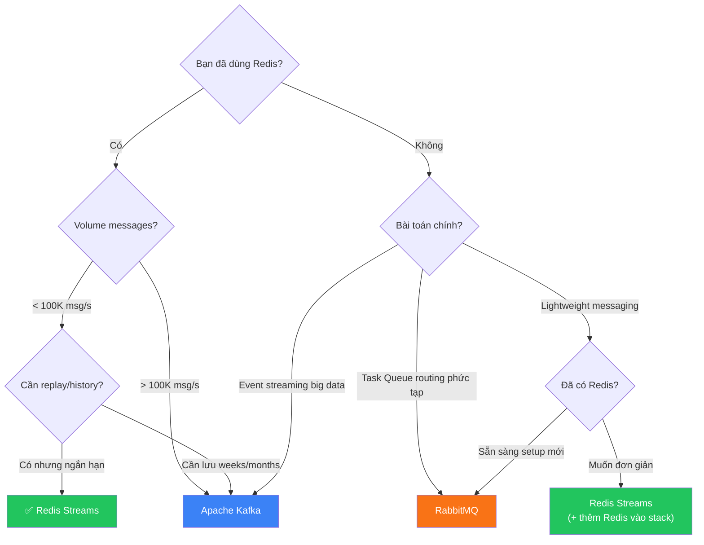

# Redis Streams — Chuyên Sâu Event Streaming

> **Redis Streams = Append-only log + Consumer Groups + At-least-once delivery — tất cả trong Redis, không cần Kafka.**

## 1. Redis Streams Là Gì? — Giải Thích Bằng Ví Dụ Thực Tế

### 1.1. Bài Toán Gốc

Hãy tưởng tượng bạn có một **hệ thống đặt hàng e-commerce**:

```
                  Khi user đặt hàng, bạn cần:
User Click ───►   ├── 1. Gửi email xác nhận
"Đặt hàng"        ├── 2. Trừ tồn kho
                   ├── 3. Ghi log audit
                   ├── 4. Gửi notification cho seller
                   └── 5. Tính điểm loyalty

Nếu làm tuần tự: 200ms + 150ms + 50ms + 100ms + 80ms = 580ms ❌ (quá chậm)
Nếu làm trong API handler: 1 service crash → toàn bộ fail ❌
```

**Giải pháp: Redis Streams** — API handler chỉ cần **ghi 1 event** vào stream, các service khác **đọc và xử lý độc lập**:

```
┌──────────┐   XADD    ┌──────────────────────┐
│ API      │ ────────► │  Stream: orders       │
│ Handler  │   ~0.1ms  │                       │
│          │           │  ┌─────────────────┐  │
│ Return   │           │  │ 1705312200-0    │  │
│ 200 OK   │           │  │ {item:laptop,   │  │
│ ngay!    │           │  │  qty:2,         │  │
└──────────┘           │  │  user:1001}     │  │
                       │  └─────────────────┘  │
                       └──────────┬────────────┘
                                  │
              ┌───────────────────┼───────────────────┐
              │                   │                   │
              ▼                   ▼                   ▼
      ┌───────────────┐  ┌───────────────┐  ┌───────────────┐
      │ Email Service │  │ Inventory Svc │  │ Notification  │
      │ (consumer 1)  │  │ (consumer 2)  │  │ (consumer 3)  │
      │ Gửi email     │  │ Trừ tồn kho   │  │ Push notify   │
      └───────────────┘  └───────────────┘  └───────────────┘
```

**Kết quả:** API response ~1ms (chỉ XADD). Các service xử lý **async, song song, độc lập**. Nếu 1 service crash → message vẫn nằm trong stream → xử lý lại khi service recover.

### 1.2. Stream Là Gì Về Mặt Kỹ Thuật?

Redis Stream là một **append-only log data structure** — giống một cuốn sổ mà bạn chỉ có thể **viết thêm vào cuối**, không xóa, không sửa (trừ khi cố ý trim).

```
┌─────────────────────────────────────────────────────────────────┐
│                     Stream: "orders"                            │
│                                                                 │
│  ID: 1705312200000-0        ID: 1705312200001-0                │
│  ┌───────────────────┐      ┌───────────────────┐              │
│  │ item = "laptop"   │      │ item = "phone"    │              │
│  │ qty  = 2          │  ──► │ qty  = 1          │  ──► ...     │
│  │ user = "1001"     │      │ user = "2002"     │              │
│  └───────────────────┘      └───────────────────┘              │
│  ▲                                                              │
│  │                                                              │
│  Mỗi entry = 1 event, mỗi event có nhiều field-value pairs    │
│  ID format: <timestamp_ms>-<sequence_within_ms>                │
└─────────────────────────────────────────────────────────────────┘
```

**Đặc điểm cốt lõi:**

| Đặc điểm | Mô tả |
|-----------|--------|
| **Append-only** | Chỉ thêm vào cuối, không insert/update giữa chừng |
| **Persistent** | Lưu trên disk (nếu bật AOF/RDB), khác với Pub/Sub mất khi offline |
| **Ordered** | Entries sắp xếp theo ID (timestamp-based), đảm bảo thứ tự |
| **Replayable** | Có thể đọc lại từ bất kỳ vị trí nào trong stream |
| **Consumer Groups** | Cho phép nhiều consumers chia nhau workload |

---

## 2. Anatomy — Cấu Trúc Nội Bộ

### 2.1. Entry ID

Mỗi entry trong stream có một **ID duy nhất**, format: `<millisecondsTime>-<sequenceNumber>`

```
1705312200000-0     ← entry đầu tiên tại timestamp 1705312200000ms
1705312200000-1     ← entry thứ 2 tại CÙNG millisecond
1705312200001-0     ← entry tại millisecond tiếp theo
```

- **`*`** (auto-generate): Redis tự tạo ID dựa trên server time → **đảm bảo ID luôn tăng dần**
- **Custom ID**: Có thể tự đặt nhưng phải > ID cuối cùng hiện tại
- **ID chính là vị trí**: Từ ID, bạn có thể đọc stream từ chính xác điểm đó

### 2.2. Internal Data Structure — Radix Tree + Listpack

```
┌──────────────────────────────────────────────────────┐
│              Stream Internal Structure                │
│                                                       │
│  ┌─────────────────────────────────────────┐         │
│  │          Radix Tree (Rax)                │         │
│  │  (Index: maps ID prefix → listpack)     │         │
│  │                                          │         │
│  │  "170531220" ──┬── "0000" → [listpack1] │         │
│  │                └── "0001" → [listpack2] │         │
│  └─────────────────────────────────────────┘         │
│                                                       │
│  ┌─────────────────────────────────────────┐         │
│  │          Listpack (compact encoding)     │         │
│  │  ┌─────┬─────┬─────┬─────┬─────┐       │         │
│  │  │entry│entry│entry│entry│entry│       │         │
│  │  │  1  │  2  │  3  │  4  │  5  │       │         │
│  │  └─────┴─────┴─────┴─────┴─────┘       │         │
│  │  (mỗi listpack chứa ~100 entries)       │         │
│  └─────────────────────────────────────────┘         │
│                                                       │
│  Config:                                              │
│  stream-node-max-bytes 4096                           │
│  stream-node-max-entries 100                          │
└──────────────────────────────────────────────────────┘
```

**Tại sao Radix Tree?**
- **Memory efficient**: Entries gần nhau (cùng millisecond) share prefix trong tree
- **Range queries nhanh**: `XRANGE` traverse tree, không cần scan toàn bộ
- **Listpack compression**: Nhiều entries nhỏ packed liền nhau, ít overhead

---

## 3. Commands — Toàn Bộ API Chi Tiết

### 3.1. Producer Commands

#### `XADD` — Thêm Entry Vào Stream

```redis
# === Cơ bản: auto-generate ID ===
XADD orders * item "laptop" qty 2 customer "user:1001" total 25000000
# Trả về: "1705312200000-0" (ID được tạo)

# === Giới hạn kích thước stream (QUAN TRỌNG cho production) ===
XADD orders MAXLEN ~ 10000 * item "phone" qty 1
# ~ = approximate trimming (nhanh hơn exact, khuyên dùng)
# Giữ khoảng ~10,000 entries, tự xóa entries cũ nhất

# === MINID (Redis 6.2+): trim theo ID thay vì count ===
XADD orders MINID ~ 1705225800000-0 * item "tablet" qty 3
# Xóa entries có ID < 1705225800000-0 (cũ hơn 1 ngày trước)

# === Custom ID (hiếm dùng, chỉ khi migrate data) ===
XADD orders 1705312200000-0 item "laptop" qty 2

# === NOMKSTREAM: không tự tạo stream nếu chưa tồn tại ===
XADD orders NOMKSTREAM * item "laptop" qty 2
# Trả lỗi nếu "orders" chưa tồn tại
```

::: warning Production Rule
**LUÔN dùng `MAXLEN ~` hoặc `MINID ~`** khi XADD. Nếu không, stream sẽ **tăng vô hạn** → hết memory!
:::

#### `XLEN` — Đếm Entries

```redis
XLEN orders    # → 15234 (số entries trong stream)
```

### 3.2. Consumer Commands (Đọc Không Có Group)

#### `XREAD` — Đọc Trực Tiếp (Không Qua Group)

```redis
# === Đọc tối đa 10 entries mới hơn ID cụ thể ===
XREAD COUNT 10 STREAMS orders 1705312200000-0
# Đọc entries có ID > 1705312200000-0

# === Đọc TẤT CẢ entries từ đầu ===
XREAD COUNT 100 STREAMS orders 0
# "0" = từ entry đầu tiên

# === Blocking read (chờ messages mới) ===
XREAD BLOCK 5000 COUNT 10 STREAMS orders $
# $ = chỉ đọc messages MỚI (từ thời điểm gọi XREAD)
# BLOCK 5000 = chờ tối đa 5 giây
# BLOCK 0 = chờ mãi mãi (như BRPOP)

# === Đọc từ NHIỀU streams cùng lúc ===
XREAD BLOCK 5000 COUNT 10 STREAMS orders payments notifications $ $ $
```

#### `XRANGE` / `XREVRANGE` — Đọc Theo Khoảng

```redis
# === Đọc tất cả entries ===
XRANGE orders - +
# - = ID nhỏ nhất, + = ID lớn nhất

# === Đọc entries trong khoảng thời gian ===
XRANGE orders 1705312200000 1705315800000
# Tất cả entries từ timestamp A đến B

# === Phân trang ===
XRANGE orders - + COUNT 100          # 100 entries đầu
XRANGE orders (1705312200099-0 + COUNT 100  # 100 entries tiếp (exclusive start)

# === Đọc ngược (mới nhất trước) ===
XREVRANGE orders + - COUNT 10       # 10 entries mới nhất
```

### 3.3. Consumer Group Commands — "Vũ Khí Chính"

#### Tại Sao Cần Consumer Group?

```
# VẤN ĐỀ: 3 workers cùng XREAD → mỗi worker đọc TẤT CẢ messages
# → Duplicate processing!

Worker 1: XREAD → [msg1, msg2, msg3]   ← xử lý cả 3
Worker 2: XREAD → [msg1, msg2, msg3]   ← xử lý cả 3 (DUPLICATE!)
Worker 3: XREAD → [msg1, msg2, msg3]   ← xử lý cả 3 (DUPLICATE!)

# GIẢI PHÁP: Consumer Group → Redis tự PHÂN PHỐI messages
Worker 1: XREADGROUP → [msg1]          ← chỉ xử lý msg1
Worker 2: XREADGROUP → [msg2]          ← chỉ xử lý msg2
Worker 3: XREADGROUP → [msg3]          ← chỉ xử lý msg3
```

#### `XGROUP CREATE` — Tạo Consumer Group

```redis
# === Tạo group, chỉ đọc messages MỚI ===
XGROUP CREATE orders order-processors $ MKSTREAM
# $ = bắt đầu từ messages mới (bỏ qua messages cũ)
# MKSTREAM = tạo stream nếu chưa tồn tại

# === Tạo group, đọc TỪ ĐẦU (xử lý messages cũ) ===
XGROUP CREATE orders order-processors 0
# 0 = bắt đầu từ entry đầu tiên

# === Tạo group từ một ID cụ thể ===
XGROUP CREATE orders order-processors 1705312200000-0
# Bắt đầu từ entry có ID sau 1705312200000-0
```

#### `XREADGROUP` — Consumer Đọc Messages

```redis
# === Đọc messages MỚI chưa ai xử lý ===
XREADGROUP GROUP order-processors worker-1 COUNT 10 BLOCK 5000 STREAMS orders >
# GROUP order-processors = tên group
# worker-1 = tên consumer (auto-created nếu chưa tồn tại)
# > = chỉ lấy messages CHƯA ĐƯỢC DELIVER cho bất kỳ consumer nào
# BLOCK 5000 = chờ tối đa 5s nếu không có message mới

# KẾT QUẢ:
# 1) "orders"
# 2) 1) 1) "1705312200000-0"
#       2) 1) "item" 2) "laptop" 3) "qty" 4) "2"
#    2) 1) "1705312200001-0"
#       2) 1) "item" 2) "phone" 3) "qty" 4) "1"

# === Đọc lại messages ĐÃ DELIVER nhưng chưa ACK (recovery) ===
XREADGROUP GROUP order-processors worker-1 COUNT 10 STREAMS orders 0
# 0 (thay vì >) = đọc pending messages CỦA CHÍNH worker-1
```

#### `XACK` — Xác Nhận Đã Xử Lý Xong

```redis
XACK orders order-processors 1705312200000-0
# "Tôi (bất kỳ consumer nào trong group) đã xử lý xong entry này"
# → Entry bị xóa khỏi Pending Entries List (PEL)

# === ACK nhiều entries cùng lúc ===
XACK orders order-processors 1705312200000-0 1705312200001-0 1705312200002-0
```

::: danger Nếu Không XACK
Entry sẽ **mãi mãi** nằm trong **Pending Entries List (PEL)** → memory leak + message bị stuck → cần XCLAIM hoặc XAUTOCLAIM để recover.
:::

### 3.4. Recovery Commands — Xử Lý Messages Bị Stuck

#### Kịch bản: Worker crash giữa chừng

```
Timeline:
T1: worker-1 nhận msg-A bằng XREADGROUP     ← msg-A vào PEL của worker-1
T2: worker-1 bắt đầu xử lý msg-A
T3: worker-1 CRASH! 💥                       ← msg-A vẫn nằm trong PEL
T4: msg-A bị "stuck" — không ai xử lý
T5: Cần worker-2 "claim" msg-A và xử lý tiếp
```

#### `XPENDING` — Kiểm Tra Messages Bị Stuck

```redis
# === Tổng quan pending messages ===
XPENDING orders order-processors
# 1) (integer) 5             ← 5 messages đang pending
# 2) "1705312200000-0"       ← ID nhỏ nhất pending
# 3) "1705312200004-0"       ← ID lớn nhất pending
# 4) 1) 1) "worker-1"
#       2) "3"               ← worker-1 có 3 messages pending
#    2) 1) "worker-2"
#       2) "2"               ← worker-2 có 2 messages pending

# === Chi tiết pending messages của worker cụ thể ===
XPENDING orders order-processors - + 10 worker-1
# 1) 1) "1705312200000-0"    ← entry ID
#    2) "worker-1"           ← consumer name
#    3) (integer) 360000     ← idle time (ms) = 6 phút kể từ lần deliver cuối
#    4) (integer) 2          ← delivery count (đã deliver 2 lần)
```

#### `XCLAIM` — Chuyển Message Cho Consumer Khác

```redis
# === worker-2 claim msg từ worker-1 (nếu idle > 60s) ===
XCLAIM orders order-processors worker-2 60000 1705312200000-0
# 60000 = min-idle-time (ms): chỉ claim nếu message idle > 60s
# → Message chuyển ownership từ worker-1 sang worker-2
# → worker-2 nhận lại data và xử lý

# === Force claim (bỏ qua min-idle-time) ===
XCLAIM orders order-processors worker-2 0 1705312200000-0 FORCE

# === Chỉ lấy ID (không cần data) ===
XCLAIM orders order-processors worker-2 60000 1705312200000-0 JUSTID
```

#### `XAUTOCLAIM` — Tự Động Claim (Redis 6.2+, KHUYÊN DÙNG)

```redis
# === Tự động tìm và claim messages idle > 60s ===
XAUTOCLAIM orders order-processors worker-2 60000 0-0 COUNT 10
# 0-0 = bắt đầu scan từ đầu PEL
# COUNT 10 = claim tối đa 10 messages

# KẾT QUẢ:
# 1) "1705312200005-0"       ← cursor mới (dùng cho lần scan tiếp)
# 2) 1) 1) "1705312200000-0" ← message đã claim
#       2) 1) "item" 2) "laptop" ...
#    2) 1) "1705312200002-0"
#       2) ...
# 3) (empty array)           ← deleted entries (nếu có)
```

### 3.5. Management Commands

```redis
# === Xem thông tin stream ===
XINFO STREAM orders
# length: 15234
# radix-tree-keys: 152
# radix-tree-nodes: 305
# last-generated-id: 1705312215000-0
# first-entry: ...
# last-entry: ...

# === Xem thông tin groups ===
XINFO GROUPS orders
# 1) name: order-processors
#    consumers: 3
#    pending: 5
#    last-delivered-id: 1705312215000-0

# === Xem thông tin consumers ===
XINFO CONSUMERS orders order-processors
# 1) name: worker-1
#    pending: 3
#    idle: 360000
#    inactive: 360000

# === Xóa consumer (chuyển pending messages về unassigned) ===
XGROUP DELCONSUMER orders order-processors worker-1

# === Xóa group ===
XGROUP DESTROY orders order-processors

# === Trim stream thủ công ===
XTRIM orders MAXLEN ~ 10000
XTRIM orders MINID ~ 1705225800000-0

# === Xóa entries cụ thể (hiếm dùng) ===
XDEL orders 1705312200000-0
```

---

## 4. Consumer Group Deep Dive — Cơ Chế Hoạt Động

### 4.1. Pending Entries List (PEL) — "Bộ Nhớ" Của Group

PEL là **cấu trúc dữ liệu trung tâm** của Consumer Group. Nó theo dõi **message nào đã deliver cho consumer nào** nhưng **chưa được ACK**.

```
┌─────────────────────────────────────────────────────────┐
│              Consumer Group: "order-processors"          │
│                                                          │
│  last-delivered-id: 1705312215000-0                     │
│  (= "đã deliver tới đây, messages sau ID này chưa ai   │
│     nhận")                                               │
│                                                          │
│  ┌──────────────────────────────────────────────────┐   │
│  │           Pending Entries List (PEL)              │   │
│  │                                                    │   │
│  │  Entry ID           │ Consumer  │ Idle    │ Count │   │
│  │  ─────────────────  │ ───────── │ ─────── │ ───── │   │
│  │  1705312200000-0    │ worker-1  │ 360s    │ 2     │   │
│  │  1705312200001-0    │ worker-1  │ 360s    │ 1     │   │
│  │  1705312200002-0    │ worker-2  │ 120s    │ 1     │   │
│  │  1705312200003-0    │ worker-1  │ 360s    │ 3     │   │
│  │  1705312200004-0    │ worker-3  │ 30s     │ 1     │   │
│  └──────────────────────────────────────────────────┘   │
│                                                          │
│  • Idle = thời gian kể từ lần deliver cuối               │
│  • Count = số lần deliver (claim/re-deliver)             │
│  • Nếu Count > threshold → Dead Letter Queue            │
└─────────────────────────────────────────────────────────┘
```

### 4.2. Message Flow — Từng Bước Chi Tiết

```
Producer                    Redis Stream                    Consumers
   │                            │                              │
   │  XADD orders * ...        │                              │
   │ ─────────────────────────►│                              │
   │                            │ (entry appended to stream)  │
   │                            │                              │
   │                            │     XREADGROUP ... >        │
   │                            │◄────────────────────────────│ worker-1
   │                            │                              │
   │                            │  1. Lấy entry chưa deliver  │
   │                            │  2. Ghi vào PEL:            │
   │                            │     {entry-id → worker-1}   │
   │                            │  3. Cập nhật                │
   │                            │     last-delivered-id       │
   │                            │  4. Trả data cho worker-1   │
   │                            │ ────────────────────────────►│
   │                            │                              │
   │                            │                              │ worker-1 xử lý
   │                            │                              │ ...
   │                            │                              │
   │                            │     XACK orders group id    │
   │                            │◄────────────────────────────│ worker-1
   │                            │                              │
   │                            │  Xóa entry khỏi PEL ✓      │
   │                            │                              │
```

### 4.3. Delivery Semantics

| Semantic | Mô tả | Cách đạt được |
|----------|--------|---------------|
| **At-most-once** | Message xử lý tối đa 1 lần (có thể mất) | XACK **trước** khi xử lý |
| **At-least-once** | Message xử lý ít nhất 1 lần (có thể duplicate) | XACK **sau** khi xử lý **(khuyên dùng)** |
| **Exactly-once** | Mỗi message xử lý đúng 1 lần | At-least-once + **idempotent consumer** |

```python
# === At-least-once (Recommended) ===
while True:
    messages = redis.xreadgroup(
        groupname="processors",
        consumername="worker-1",
        streams={"orders": ">"},
        count=10,
        block=5000
    )
    
    for stream, entries in messages:
        for entry_id, data in entries:
            try:
                process_order(data)          # 1. Xử lý TRƯỚC
                redis.xack("orders", "processors", entry_id)  # 2. ACK SAU
            except Exception as e:
                log.error(f"Failed to process {entry_id}: {e}")
                # KHÔNG ACK → message sẽ nằm trong PEL
                # → XAUTOCLAIM sẽ chuyển cho consumer khác
```

---

## 5. Production Patterns — Mẫu Thiết Kế Thực Chiến

### 5.1. Pattern 1: Reliable Worker Queue

**Bài toán:** Background job processing (gửi email, resize ảnh, generate PDF...)

```
┌────────────┐    XADD     ┌───────────────────────┐
│ Web Server │ ──────────► │  Stream: jobs          │
│ (producer) │             │                        │
└────────────┘             └──────────┬────────────┘
                                      │
                  Consumer Group: "workers"
                  ┌───────────┬───────┴───────┬───────────┐
                  │           │               │           │
            ┌─────▼─────┐ ┌──▼────────┐ ┌────▼───────┐ ┌─▼──────────┐
            │ worker-1  │ │ worker-2  │ │ worker-3   │ │ worker-4   │
            │ (pod 1)   │ │ (pod 2)   │ │ (pod 3)    │ │ (pod 4)    │
            └───────────┘ └───────────┘ └────────────┘ └────────────┘
```

```python
import redis
import time
import uuid
import json

r = redis.Redis()

# === Producer ===
def enqueue_job(job_type, payload):
    """Gửi job vào stream"""
    entry_id = r.xadd("jobs", {
        "type": job_type,
        "payload": json.dumps(payload),
        "created_at": str(time.time()),
        "idempotency_key": str(uuid.uuid4()),
    }, maxlen=50000)  # Giữ tối đa 50K entries
    return entry_id

# === Consumer (Robust Worker) ===
class StreamWorker:
    def __init__(self, stream, group, consumer_name):
        self.stream = stream
        self.group = group
        self.consumer = consumer_name
        self.r = redis.Redis()
        self._ensure_group()
    
    def _ensure_group(self):
        """Tạo group nếu chưa tồn tại"""
        try:
            self.r.xgroup_create(self.stream, self.group, id="$", mkstream=True)
        except redis.ResponseError as e:
            if "BUSYGROUP" not in str(e):
                raise
    
    def run(self):
        """Main loop: 2-phase startup"""
        # PHASE 1: Recovery — xử lý pending messages (từ crash trước)
        print(f"[{self.consumer}] Phase 1: Recovering pending messages...")
        self._process_pending()
        
        # PHASE 2: New messages — đọc messages mới
        print(f"[{self.consumer}] Phase 2: Processing new messages...")
        while True:
            self._claim_abandoned()     # Claim messages từ dead consumers
            self._read_new_messages()
    
    def _process_pending(self):
        """Đọc lại messages đã deliver cho mình nhưng chưa ACK"""
        while True:
            messages = self.r.xreadgroup(
                groupname=self.group,
                consumername=self.consumer,
                streams={self.stream: "0"},  # "0" = pending messages
                count=10
            )
            if not messages or not messages[0][1]:
                break  # Hết pending messages
            
            for stream, entries in messages:
                for entry_id, data in entries:
                    self._handle_message(entry_id, data)
    
    def _read_new_messages(self):
        """Đọc messages mới, block nếu không có"""
        messages = self.r.xreadgroup(
            groupname=self.group,
            consumername=self.consumer,
            streams={self.stream: ">"},   # ">" = messages mới
            count=10,
            block=5000   # Chờ 5 giây
        )
        if messages:
            for stream, entries in messages:
                for entry_id, data in entries:
                    self._handle_message(entry_id, data)
    
    def _claim_abandoned(self):
        """Claim messages bị stuck > 60 giây"""
        result = self.r.xautoclaim(
            name=self.stream,
            groupname=self.group,
            consumername=self.consumer,
            min_idle_time=60000,   # 60 seconds
            start_id="0-0",
            count=5
        )
        if result and result[1]:
            for entry_id, data in result[1]:
                self._handle_message(entry_id, data)
    
    def _handle_message(self, entry_id, data):
        """Xử lý 1 message với retry + dead letter"""
        # Kiểm tra delivery count
        pending_info = self.r.xpending_range(
            self.stream, self.group, 
            min=entry_id, max=entry_id, count=1
        )
        
        if pending_info and pending_info[0]["times_delivered"] > 5:
            # Dead Letter: message đã thử xử lý 5 lần → cho vào DLQ
            print(f"[DLQ] Moving {entry_id} to dead letter queue")
            self.r.xadd("dead-letter:jobs", data)
            self.r.xack(self.stream, self.group, entry_id)
            return
        
        try:
            # XỬ LÝ MESSAGE (idempotent)
            job_type = data.get(b"type", b"unknown").decode()
            payload = json.loads(data.get(b"payload", b"{}"))
            
            if job_type == "send_email":
                send_email(payload)
            elif job_type == "resize_image":
                resize_image(payload)
            
            # ACK SAU KHI XỬ LÝ THÀNH CÔNG
            self.r.xack(self.stream, self.group, entry_id)
            
        except Exception as e:
            print(f"[ERROR] Failed {entry_id}: {e}")
            # KHÔNG ACK → sẽ được retry hoặc claim bởi consumer khác

# === Sử dụng ===
worker = StreamWorker("jobs", "workers", "worker-1")
worker.run()
```

### 5.2. Pattern 2: Event Fan-out (Nhiều Groups Đọc Cùng Stream)

**Bài toán:** Khi đặt hàng, nhiều service cần xử lý **cùng event** nhưng **khác mục đích**.

```
                        ┌──────────────────────┐
                        │  Stream: orders       │
                        │  [order-created event]│
                        └──────────┬───────────┘
                                   │
                    ┌──────────────┼──────────────┐
                    │              │              │
            Group: "email"   Group: "inventory"  Group: "analytics"
                    │              │              │
              ┌─────▼─────┐ ┌─────▼─────┐ ┌─────▼─────┐
              │ Email Svc │ │ Stock Svc │ │ Analytics │
              │ Gửi email │ │ Trừ kho   │ │ Ghi metrics│
              └───────────┘ └───────────┘ └───────────┘

Mỗi group nhận BẢN SAO RIÊNG của tất cả messages!
Group "email" xử lý 100% messages → gửi email
Group "inventory" xử lý 100% messages → trừ tồn kho  
Group "analytics" xử lý 100% messages → ghi thống kê
```

```redis
# === Tạo 3 groups trên CÙNG 1 stream ===
XGROUP CREATE orders email-service $ MKSTREAM
XGROUP CREATE orders inventory-service $ MKSTREAM
XGROUP CREATE orders analytics-service $ MKSTREAM

# === Producer ghi 1 lần ===
XADD orders * event "order.created" order_id 5001 item "laptop" qty 2

# === Mỗi service đọc qua group riêng ===
# Email service
XREADGROUP GROUP email-service email-worker-1 COUNT 10 BLOCK 5000 STREAMS orders >

# Inventory service  
XREADGROUP GROUP inventory-service inv-worker-1 COUNT 10 BLOCK 5000 STREAMS orders >

# Analytics service
XREADGROUP GROUP analytics-service analytics-worker-1 COUNT 10 BLOCK 5000 STREAMS orders >
```

### 5.3. Pattern 3: Delayed Job Queue

**Bài toán:** Gửi reminder sau 30 phút, retry failed job sau 5 phút.

```
┌─────────────────────────────────────────────────┐
│  Sorted Set: "delayed:jobs"                      │
│  Score = timestamp khi job nên chạy              │
│  ┌───────────────────────────────────────┐       │
│  │ Score: 1705313800  │ "job:reminder:42"│       │
│  │ Score: 1705314400  │ "job:retry:send" │       │
│  │ Score: 1705315000  │ "job:expire:99"  │       │
│  └───────────────────────────────────────┘       │
└──────────────────┬──────────────────────────────┘
                   │
                   │ Scheduler Worker (mỗi giây):
                   │ ZRANGEBYSCORE delayed:jobs 0 <now>
                   │ → Lấy jobs "đến hạn"
                   │ → XADD vào stream để workers xử lý
                   ▼
┌─────────────────────────────────────────────────┐
│  Stream: "jobs"                                  │
│  Consumer Group: "workers"                       │
└─────────────────────────────────────────────────┘
```

```python
import time

def schedule_job(job_id, delay_seconds, job_data):
    """Lên lịch job chạy sau delay_seconds giây"""
    run_at = time.time() + delay_seconds
    r.zadd("delayed:jobs", {json.dumps({
        "job_id": job_id,
        **job_data
    }): run_at})

def scheduler_loop():
    """Chạy mỗi giây, chuyển due jobs vào stream"""
    while True:
        now = time.time()
        # Lấy jobs đã đến hạn
        due_jobs = r.zrangebyscore("delayed:jobs", 0, now, start=0, num=100)
        
        for job_raw in due_jobs:
            job_data = json.loads(job_raw)
            # Chuyển vào stream
            r.xadd("jobs", job_data, maxlen=50000)
            # Xóa khỏi delayed queue
            r.zrem("delayed:jobs", job_raw)
        
        time.sleep(1)  # Poll mỗi giây

# === Sử dụng ===
schedule_job("reminder:42", delay_seconds=1800, job_data={
    "type": "send_reminder",
    "user_id": "1001",
    "message": "Bạn có đơn hàng chưa thanh toán!"
})
```

### 5.4. Pattern 4: Event Sourcing Lite

**Bài toán:** Ghi lại **mọi thay đổi trạng thái** để có thể replay, audit, debug.

```redis
# === Mỗi lần trạng thái đơn hàng thay đổi → ghi event ===
XADD events:order:5001 * event "created" status "pending" by "user:1001"
XADD events:order:5001 * event "paid" status "paid" by "payment-gateway"
XADD events:order:5001 * event "shipped" status "shipped" by "warehouse:hanoi" tracking "VN123456"
XADD events:order:5001 * event "delivered" status "delivered" by "shipper:grab"

# === Replay: xem lại toàn bộ lịch sử đơn hàng ===
XRANGE events:order:5001 - +
# → [created → paid → shipped → delivered]

# === Audit: ai đã làm gì lúc nào? ===
# Entry ID chứa timestamp → biết chính xác thời gian mỗi event

# === Debug: tại sao đơn hàng bị lỗi? ===
# Xem event cuối cùng trước khi lỗi
XREVRANGE events:order:5001 + - COUNT 5
```

### 5.5. Pattern 5: Real-time Notifications (Hybrid Pub/Sub + Streams)

```
# === Strategy: Pub/Sub cho "tín hiệu", Streams cho "dữ liệu" ===

# Producer:
# 1. Ghi event đầy đủ vào Stream (persistent, replayable)
XADD notifications:user:1001 MAXLEN ~ 1000 * 
    type "order_update" 
    title "Đơn hàng #5001 đã giao" 
    body "Shipper đã giao thành công"

# 2. Pub/Sub signal để client biết có data mới (instant)
PUBLISH signal:user:1001 "new_notification"

# Consumer (mobile app / websocket):
# 1. Subscribe signal channel
SUBSCRIBE signal:user:1001
# 2. Khi nhận signal → XREAD stream để lấy data
XREAD COUNT 10 STREAMS notifications:user:1001 $last_known_id
```

**Tại sao kết hợp?**
- **Pub/Sub**: Instant delivery (~0.1ms), nhưng mất message nếu client offline
- **Streams**: Persistent, client quay lại đọc messages đã miss
- **Kết hợp**: "Chuông cửa" (Pub/Sub) + "Hộp thư" (Streams) = hoàn hảo

---

## 6. So Sánh Chi Tiết — Redis Streams vs Kafka vs RabbitMQ

### 6.1. Bảng So Sánh Toàn Diện

| Tiêu chí | Redis Streams | Apache Kafka | RabbitMQ |
|----------|---------------|-------------|----------|
| **Mô hình** | Append-only log (in-memory) | Distributed commit log (disk) | Message broker (queue) |
| **Persistence** | RAM + AOF/RDB | Disk (ưu tiên throughput) | Disk + RAM |
| **Latency** | **< 1ms** (sub-millisecond) | 5–20ms | 1–5ms |
| **Throughput** | ~200K msg/s (single node) | **Millions msg/s** (cluster) | ~50K msg/s |
| **Message retention** | MAXLEN/MINID (giới hạn bởi RAM) | Days/weeks/forever (disk) | Xóa sau ACK |
| **Consumer Groups** | ✅ Có | ✅ Có | ✅ Có (Competing consumers) |
| **Replay** | ✅ (XRANGE) | ✅ (Offset reset) | ❌ (xóa sau ACK) |
| **Delivery guarantee** | At-least-once | At-least-once / Exactly-once | At-least-once / At-most-once |
| **Ordering** | ✅ Per stream | ✅ Per partition | ⚠️ Không đảm bảo giữa consumers |
| **Backpressure** | ✅ Consumer đọc theo tốc độ riêng | ✅ | ⚠️ Prefetch count |
| **Clustering** | Redis Cluster | ✅ Native (brokers + ZK/KRaft) | ✅ (Quorum queues) |
| **Operational cost** | **Thấp** (đã có Redis) | **Cao** (ZK/KRaft + brokers + monitoring) | **Trung bình** |
| **Ecosystem** | Nhỏ | **Lớn** (Connect, Streams API, ksqlDB) | **Lớn** (plugins, protocols) |

### 6.2. Decision Tree — Chọn Cái Nào?



### 6.3. Khi Nào Chọn Redis Streams?

| ✅ Nên dùng | ❌ Không nên dùng |
|-------------|-------------------|
| Đã có Redis trong stack → zero thêm infra | Data volume > RAM available |
| Volume < 100K msg/s per stream | Cần lưu events hàng tuần/tháng |
| Cần ultra-low latency (< 1ms) | Cần exactly-once (Kafka transactions) |
| Team nhỏ, không muốn vận hành Kafka | Cần complex routing (RabbitMQ exchanges) |
| Real-time notifications, lightweight queues | Multi-datacenter replication |
| Event sourcing cho domain nhỏ | Stream processing (ksqlDB, Flink) |

---

## 7. Memory & Performance — Tối Ưu Trong Production

### 7.1. Ước Tính Memory

```
Mỗi stream entry ≈ overhead + field data

Overhead per entry: ~100-200 bytes (ID + listpack metadata)
Field data: key lengths + value lengths + encoding overhead

Ví dụ:
Entry: {item: "laptop", qty: 2, customer: "user:1001"}
≈ 200 bytes overhead + ~50 bytes data = ~250 bytes/entry

10,000 entries ≈ 2.5 MB
100,000 entries ≈ 25 MB
1,000,000 entries ≈ 250 MB
```

### 7.2. MAXLEN vs MINID — Chiến Lược Trim

```redis
# === MAXLEN: giữ N entries gần nhất ===
XADD stream MAXLEN ~ 10000 * key value
# Ưu: đơn giản, dễ tính memory
# Nhược: không biết giữ data bao lâu

# === MINID: giữ entries từ timestamp cụ thể ===
XADD stream MINID ~ 1705225800000-0 * key value
# 1705225800000 = 24h trước
# Ưu: biết chính xác giữ data bao lâu
# Nhược: không biết dùng bao nhiêu memory

# === Kết hợp cả hai (KHUYÊN DÙNG) ===
# Dùng MAXLEN trong XADD (bảo vệ memory)
XADD stream MAXLEN ~ 100000 * key value
# + Cron job XTRIM MINID mỗi giờ (bảo vệ thời gian)
XTRIM stream MINID ~ <24h-ago-timestamp>
```

### 7.3. Performance Tips

```
1. BATCH processing: Dùng COUNT trong XREADGROUP
   ❌ COUNT 1    → 1 message/call → overhead cao
   ✅ COUNT 50   → 50 messages/call → hiệu quả hơn

2. ACK batching: ACK nhiều entries cùng lúc
   ❌ XACK stream group id1
      XACK stream group id2
   ✅ XACK stream group id1 id2 id3 id4 id5

3. Pipeline XADD: Nếu ghi nhiều entries
   Dùng pipeline để batch nhiều XADD → giảm RTT

4. Monitor PEL size: Nếu PEL tăng liên tục
   → Consumers không kịp xử lý hoặc không ACK
   → Scale thêm consumers hoặc fix bug

5. Avoid XINFO in hot path: XINFO tốn O(N)
   → Chỉ dùng cho monitoring, không gọi mỗi request
```

---

## 8. Monitoring & Alerting

### 8.1. Metrics Cần Theo Dõi

```redis
# === Stream metrics ===
XINFO STREAM orders FULL
# Quan tâm:
# - length: số entries (nếu tăng liên tục → consumers chậm)
# - first-entry / last-entry: biết lag thời gian

# === Group metrics ===
XINFO GROUPS orders
# Quan tâm:
# - pending: số messages chưa ACK (nên < threshold)
# - lag: khoảng cách giữa last-delivered-id và stream tail

# === Consumer metrics ===  
XINFO CONSUMERS orders order-processors
# Quan tâm:
# - pending per consumer: nếu 1 consumer có quá nhiều → overloaded
# - idle: nếu idle quá lâu → consumer có thể đã crash
```

### 8.2. Alert Rules

| Metric | Warning | Critical | Hành động |
|--------|---------|----------|-----------|
| `stream.length` | > 50K | > 100K | Scale consumers |
| `group.pending` | > 1000 | > 5000 | Check dead consumers, XAUTOCLAIM |
| `consumer.idle` | > 60s | > 300s | Restart consumer, XCLAIM |
| `entry.delivery_count` | > 3 | > 5 | Move to Dead Letter Queue |
| `memory_usage` | > 70% maxmemory | > 85% | XTRIM hoặc tăng MAXLEN |

---

## 9. Tổng Kết

### Redis Streams Trong Một Câu

> Redis Streams = **Kafka nhẹ** sống bên trong Redis — cho bạn **append-only log**, **consumer groups**, và **at-least-once delivery** mà không cần thêm bất kỳ infrastructure nào.

### Khi Nào Dùng — Quick Reference

```
✅ Dùng Redis Streams khi:
   ├── Đã có Redis → zero thêm infra cost
   ├── Background job queue (thay thế Celery/BullMQ đơn giản)
   ├── Event fan-out cho microservices (< 100K msg/s)
   ├── Real-time notifications + history
   ├── Audit log ngắn hạn (24h - 7 ngày)
   └── Event sourcing cho domain nhỏ

❌ Không dùng khi:
   ├── Data volume > RAM
   ├── Cần lưu events hàng tháng/năm → Kafka
   ├── Cần complex routing (topic, header-based) → RabbitMQ
   ├── Cần exactly-once transactions → Kafka
   └── Cần stream processing (JOIN, WINDOW, AGGREGATE) → Kafka + ksqlDB/Flink
```

### Mental Model

```
┌─────────────────────────────────────────────────────┐
│                                                      │
│  Pub/Sub    = Loa phát thanh (ai nghe thì nghe,     │
│               tắt đài là mất)                        │
│                                                      │
│  List+BRPOP = Hộp thư giấy (1 người nhận, đọc xong  │
│               xóa luôn, không ai khác đọc được)      │
│                                                      │
│  Streams    = Camera an ninh (ghi lại mọi thứ,       │
│               nhiều người xem cùng lúc,              │
│               xem lại bất kỳ lúc nào,                │
│               tự xóa sau X ngày)                     │
│                                                      │
└─────────────────────────────────────────────────────┘
```
