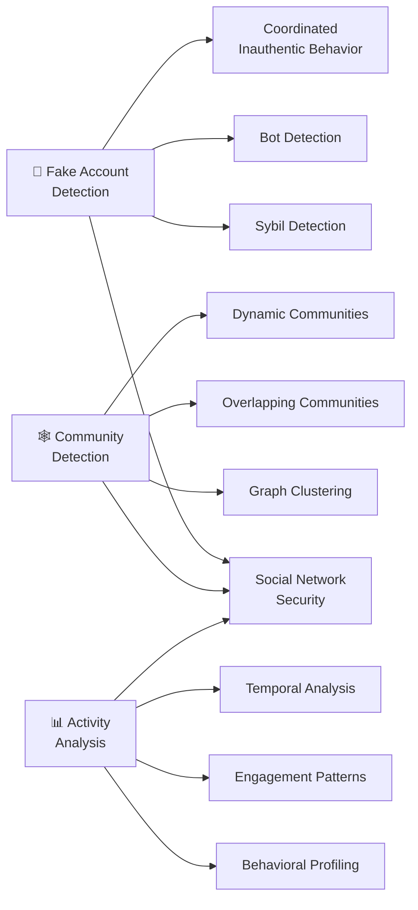
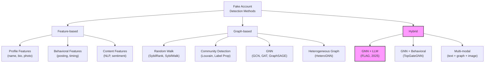

# 📚 Literature Review: Phát Hiện Tài Khoản Ảo & Phân Tích Mạng Xã Hội

> **Đề tài**: Fake Account Detection, Community Detection & Social Network Activity Analysis
> **Cập nhật**: 2026-07-20
> **Phương pháp**: Tổng hợp từ HuggingFace Papers API, arXiv, Google Scholar, Web Search

---

## 1. Tổng Quan Lĩnh Vực

### 1.1 Ba Trụ Cột Nghiên Cứu



### 1.2 Evolution Timeline

| Giai đoạn | Năm | Phương pháp chính | Đại diện |
|-----------|------|-------------------|----------|
| **Gen 1** | 2011-2016 | Rule-based, Feature engineering | SybilRank, SybilBelief |
| **Gen 2** | 2016-2020 | ML truyền thống (RF, SVM, XGBoost) | Botometer, LOBO |
| **Gen 3** | 2020-2023 | Graph Neural Networks (GCN, GAT, GraphSAGE) | TwiBot-22, SYBILGAT |
| **Gen 4** | 2024-2025 | **GNN + LLM hybrid, Multi-modal** | FLAG, TopGateGNN |

---

## 2. Papers SOTA Theo Chủ Đề

### 2.1 🤖 Fake Account / Bot Detection

#### Surveys & Benchmarks (Bắt Buộc Đọc)

| # | Paper | arXiv ID | Năm | Tầm quan trọng |
|---|-------|----------|------|-----------------|
| 1 | **Graph-based Fake Account Detection: A Survey** | `2507.06541` | 2025 | ⭐⭐⭐⭐⭐ Survey toàn diện nhất, phân loại methods theo graph techniques |
| 2 | **Evolution of Malicious Social Bot Detection** | — | 2025 | ⭐⭐⭐⭐⭐ Traces từ individual profiling → group analysis → LLM-based |
| 3 | **TwiBot-22: Towards Graph-Based Twitter Bot Detection** | `2206.04564` | 2022 | ⭐⭐⭐⭐⭐ Benchmark dataset lớn nhất (1M+ users), baseline cho mọi paper sau |

```bash
# Đọc paper survey mới nhất
curl -s "https://huggingface.co/papers/2507.06541.md" > papers/survey_graph_fake_account_2025.md

# Đọc TwiBot-22 benchmark
curl -s "https://huggingface.co/papers/2206.04564.md" > papers/twibot22.md
```

#### GNN-based Methods (SOTA hiện tại)

| # | Paper | arXiv ID | Năm | Method | Điểm nhấn |
|---|-------|----------|------|--------|-----------|
| 4 | **SYBILGAT: Sybil Detection using Graph Attention Networks** | `2409.08631` | 2024 | GAT | Dynamic attention weights, xử lý được attack edges nhiều |
| 5 | **TopGateGNN** (Topology-Aware Gated GNN) | — | 2024 | Gated GNN | Giải quyết over-smoothing + class imbalance trong bot detection |
| 6 | **Heterogeneous GNNs** (HeteroGCN, HeteroGAT, HeteroSAGE) | — | 2024 | Hetero-GNN | Mô hình nhiều loại quan hệ (user-user, user-content, user-domain) |

```bash
# Đọc SYBILGAT
curl -s "https://huggingface.co/papers/2409.08631.md" > papers/sybilgat_2024.md
```

#### LLM + GNN Hybrid (Trending 2025)

| # | Paper | Năm | Method | Điểm nhấn |
|---|-------|------|--------|-----------|
| 7 | **FLAG Framework** (LLM-fused bot detection) | 2025 | LLM + GNN | LLM trích xuất semantic features → fuse với graph structure |
| 8 | **Adversarial Creation and Detection of AI-Generated Social Bot Content** | `2606.07219` | 2025 | LLM adversarial | Nghiên cứu cách bots dùng LLM tạo content và cách detect |
| 9 | **Leveraging LLMs to Detect Influence Campaigns in Social Media** | `2311.07816` | 2023 | LLM analysis | Dùng LLM phát hiện chiến dịch coordinated inauthentic behavior |

#### Classic / Foundational

| # | Paper | arXiv ID | Năm | Tầm quan trọng |
|---|-------|----------|------|-----------------|
| 10 | **Instagram Fake and Automated Account Detection** | `1910.03090` | 2019 | Feature engineering approach, applicable cho Facebook |
| 11 | **Characterizing, Detecting, and Predicting Online Ban Evasion** | `2202.05257` | 2022 | Phát hiện accounts bị ban tạo lại |
| 12 | **Multilevel User Credibility Assessment in Social Networks** | `2309.13305` | 2023 | Đánh giá uy tín user nhiều cấp độ |

---

### 2.2 🕸️ Community Detection & Graph Clustering

#### Core Papers

| # | Paper | arXiv ID | Năm | Method | Ứng dụng |
|---|-------|----------|------|--------|----------|
| 13 | **Advanced Graph Clustering Methods: A Comprehensive and In-Depth Analysis** | `2407.09055` | 2024 | Survey | ⭐ Survey toàn diện về graph clustering methods |
| 14 | **Real-Time Community Detection in Large Social Networks on a Laptop** | `1601.03958` | 2016 | Streaming | Phát hiện community trên graph lớn, real-time |
| 15 | **Cluster Aware Graph Anomaly Detection** | `2409.09770` | 2024 | GNN + Clustering | Kết hợp cluster structure với anomaly detection |
| 16 | **Revisiting Dynamic Graph Clustering via Matrix Factorization** | `2502.06117` | 2025 | NMF | Dynamic clustering cho evolving social networks |
| 17 | **Contrastive Deep NMF for Community Detection** | `2311.02357` | 2023 | Deep NMF | Self-supervised community detection |
| 18 | **A Comprehensive Survey on Graph Neural Networks** | `1901.00596` | 2019 | Survey | ⭐ GNN foundations — bắt buộc đọc |

#### Clustering cho Social Network Analysis

| # | Paper | arXiv ID | Năm | Điểm nhấn |
|---|-------|----------|------|-----------|
| 19 | **Weighted Flow Diffusion for Local Graph Clustering with Node Attributes** | `2301.13187` | 2023 | Clustering với node attributes (profile features) |
| 20 | **Beyond Homophily: Reconstructing Structure for Graph-agnostic Clustering** | `2305.02931` | 2023 | Clustering networks có cả homophily và heterophily |
| 21 | **ConGraT: Contrastive Pretraining for Joint Graph and Text Embeddings** | `2305.14321` | 2023 | Kết hợp text content với graph structure |

---

### 2.3 📊 Activity Analysis & Behavioral Profiling

| # | Paper | arXiv ID | Năm | Điểm nhấn |
|---|-------|----------|------|-----------|
| 22 | **Digital Cloning of Online Social Networks** | `2401.12509` | 2024 | Mô phỏng hành vi mạng xã hội, phát hiện bất thường |
| 23 | **Model, Analyze, and Comprehend User Interactions within Social Media** | `2403.15937` | 2024 | Framework phân tích tương tác user |
| 24 | **Embedding-based Retrieval in Facebook Search** | `2006.11632` | 2020 | Facebook's internal approach cho user embeddings |
| 25 | **So-Fake: Benchmarking Social Media Image Forgery Detection** | `2505.18660` | 2025 | Phát hiện ảnh profile giả |

---

### 2.4 🔍 Graph Anomaly Detection

| # | Paper | arXiv ID | Năm | Method |
|---|-------|----------|------|--------|
| 26 | **One-Class GNN for Anomaly Detection in Attributed Networks** | `2002.09594` | 2020 | One-class GNN |
| 27 | **LLM-Powered Text-Attributed Graph Anomaly Detection via RAG** | `2511.17584` | 2025 | LLM + RAG + Graph |
| 28 | **Rayleigh Quotient GNN for Graph-level Anomaly Detection** | `2310.02861` | 2023 | Spectral GNN |

---
Thứ tự đọc đề xuất: 01 → 07 → 02 → 03 → 04 → 06 → 05 → 08

## 3. Taxonomy Phương Pháp SOTA

### 3.1 Theo Kỹ Thuật



### 3.2 So Sánh Performance

| Method | Accuracy | F1-Score | Scalability | Robustness | Note |
|--------|----------|----------|-------------|------------|------|
| Feature-based (RF/XGBoost) | 85-92% | 0.83-0.90 | ⭐⭐⭐⭐⭐ | ⭐⭐ | Dễ bị bypass bởi sophisticated bots |
| GCN | 90-95% | 0.88-0.93 | ⭐⭐⭐ | ⭐⭐⭐ | Over-smoothing ở deep layers |
| GAT (SYBILGAT) | 92-96% | 0.90-0.95 | ⭐⭐⭐ | ⭐⭐⭐⭐ | Attention mechanism giúp focus |
| GraphSAGE | 91-95% | 0.89-0.94 | ⭐⭐⭐⭐ | ⭐⭐⭐ | Inductive, scalable |
| **GNN + LLM (FLAG)** | **95-98%** | **0.94-0.97** | ⭐⭐ | ⭐⭐⭐⭐⭐ | **SOTA 2025**, chống camouflage |

---

## 4. Features Quan Trọng Cho Fake Detection (Từ Literature)

### 4.1 Profile-level Features

| Feature | Papers | Importance | Khả thi với FB data |
|---------|--------|------------|---------------------|
| Profile photo existence | [10] [12] | High | ✅ Có thể check manual |
| Name pattern (random chars, numbers) | [10] [12] | Medium | ✅ Từ FB export |
| Bio/About length | [10] | Medium | ✅ Manual check |
| Account age | [10] [11] | High | ⚠️ Cần estimate |
| Friend count | [10] [12] | High | ⚠️ Manual check |
| Friend/Follower ratio | [10] | High | ⚠️ Instagram-specific |

### 4.2 Behavioral Features

| Feature | Papers | Importance | Khả thi |
|---------|--------|------------|---------|
| Posting frequency | [12] [22] | Very High | ⚠️ Manual observation |
| Content diversity | [8] [22] | High | ⚠️ Manual |
| Temporal posting patterns | [11] [22] | High | ⚠️ Cần scrape/observe |
| Bulk friend request timing | [11] | Very High | ✅ Từ FB export timestamps |
| Like/Comment ratio | [23] | Medium | ⚠️ Manual |

### 4.3 Graph-level Features

| Feature | Papers | Importance | Khả thi |
|---------|--------|------------|---------|
| Mutual friends count | [4] [5] | Very High | ✅ FB hiển thị |
| Clustering coefficient | [14] [18] | High | ✅ Nếu có graph data |
| Betweenness centrality | [14] | Medium | ✅ NetworkX |
| Community membership | [13] [15] | High | ✅ NetworkX |
| Number of connected components | [18] | Medium | ✅ NetworkX |

---

## 5. Datasets & Benchmarks

| Dataset | Platform | Size | Labels | Paper | Dùng cho |
|---------|----------|------|--------|-------|----------|
| **TwiBot-22** | Twitter | 1M+ users | Bot/Human | [3] | Bot detection benchmark |
| **Cresci-2017** | Twitter | 14K users | Bot types | — | Multi-class bot detection |
| **FakeNewsNet** | Twitter | 23K users | Fake/Real news | `1809.01286` | Misinformation + account |
| **TweepFake** | Twitter | — | Deepfake tweets | `2008.00036` | AI-generated content |
| **So-Fake** | Social Media | — | Forged images | `2505.18660` | Profile photo forgery |
| **Instagram Dataset** | Instagram | — | Fake/Real | `1910.03090` | IG-specific features |
| **Facebook (DYI export)** | Facebook | Personal | Unlabeled | — | **Your data** |

> [!TIP]
> **Cho bài toán của bạn (Facebook)**: Vì không có labeled dataset Facebook public, approach tốt nhất là:
> 1. **Unsupervised**: Isolation Forest, DBSCAN, One-class GNN [26]
> 2. **Semi-supervised**: Label một phần nhỏ → train classifier
> 3. **Transfer learning**: Train trên TwiBot-22 → fine-tune trên FB features

---

## 6. Roadmap Nghiên Cứu Đề Xuất

### Phase 1: Foundation Reading (Tuần 1)
```bash
# Download & đọc 3 papers nền tảng
mkdir -p papers

# 1. Survey toàn diện nhất (2025)
curl -s "https://huggingface.co/papers/2507.06541.md" -o papers/01_survey_graph_fake_account.md

# 2. GNN foundations
curl -s "https://huggingface.co/papers/1901.00596.md" -o papers/02_gnn_comprehensive_survey.md

# 3. TwiBot-22 benchmark 
curl -s "https://huggingface.co/papers/2206.04564.md" -o papers/03_twibot22_benchmark.md
```

### Phase 2: Method Deep-dive (Tuần 2)
```bash
# 4. SYBILGAT - GAT for Sybil detection
curl -s "https://huggingface.co/papers/2409.08631.md" -o papers/04_sybilgat.md

# 5. Graph clustering survey
curl -s "https://huggingface.co/papers/2407.09055.md" -o papers/05_graph_clustering_survey.md

# 6. Cluster-aware anomaly detection
curl -s "https://huggingface.co/papers/2409.09770.md" -o papers/06_cluster_aware_anomaly.md
```

### Phase 3: Applied Research (Tuần 3)
```bash
# 7. Instagram fake detection (feature engineering reference)
curl -s "https://huggingface.co/papers/1910.03090.md" -o papers/07_instagram_fake_detection.md

# 8. LLM + Social bot (cutting edge)
curl -s "https://huggingface.co/papers/2606.07219.md" -o papers/08_llm_social_bot.md

# 9. Facebook search embeddings (user representation)
curl -s "https://huggingface.co/papers/2006.11632.md" -o papers/09_fb_embedding_retrieval.md
```

### Phase 4: Implementation (Tuần 4)
- Áp dụng findings vào Facebook friends data
- Xem lại [facebook_friends_analysis_workflow.md](./facebook_friends_analysis_workflow.md) cho implementation

---

## 7. Mapping Papers → Skills Đã Cài

| Nhu cầu | Papers tham khảo | Skill sử dụng |
|---------|-------------------|---------------|
| Đọc papers chi tiết | Mọi paper ở trên | `huggingface-papers`, `paper-lookup` |
| Quản lý bibliography | Tất cả citations | `citation-management` |
| Systematic review | Survey papers | `literature-review` |
| Graph analysis code | [4][5][14][15] | Skill `networkx` |
| ML/Clustering code | [4][5][15] | Skill `scikit-learn` |
| Visualization | Mọi kết quả | Skill `matplotlib`, `seaborn` |
| Viết báo cáo | Toàn bộ review | `scientific-writing`, `peer-review` |
| Tìm papers thêm | Mở rộng | `search-specialist`, `deep-research` |

---

## 8. Key Takeaways

> [!IMPORTANT]
> ### SOTA 2025 cho Fake Account Detection:
> 1. **GNN + LLM Hybrid** là approach mạnh nhất (F1 > 0.95)
> 2. **Graph structure** quan trọng hơn individual features
> 3. **Community-aware detection** hiệu quả hơn node-level detection
> 4. **Unsupervised** (Isolation Forest, DBSCAN) phù hợp khi không có labels
> 5. **Temporal analysis** (bulk friend requests) là signal mạnh cho fake detection

> [!TIP]
> ### Cho bài toán Facebook cụ thể của bạn:
> - **Best approach**: Feature engineering (from FB export) + NetworkX community detection + Isolation Forest
> - **Nếu có thêm data**: GNN (PyG/DGL) + node classification
> - **Papers nên đọc trước**: [1] Survey → [3] TwiBot-22 → [4] SYBILGAT → [10] Instagram features
