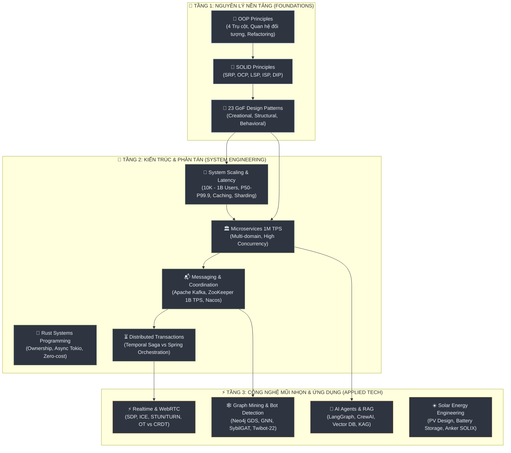

## 🗺️ Bản Đồ Cấu Trúc Toàn Bộ Tài Liệu (Knowledge Map)

Hệ thống tài liệu nghiên cứu được tổ chức logic theo **3 tầng kiến trúc tri thức**: từ **Nguyên Lý Nền Tảng (Core Foundations)**, tiến lên **Kỹ Nghệ & Kiến Trúc Phân Tán (High-Scale Systems)**, và mở rộng sang **Công Nghệ Mũi Nhọn & Ứng Dụng Thực Tiễn (Cutting-Edge & Applied Tech)**.

---

## 🧭 Lộ Trình Đọc Gợi Ý (Curated Learning Paths)

Tùy theo mục tiêu nghiên cứu và vai trò kỹ thuật, bạn có thể tham khảo một trong 4 lộ trình sau:

::: tabs
== 🚀 Lộ Trình 1: Backend & Distributed Systems Architect
Dành cho kỹ sư backend muốn làm chủ kiến trúc chịu tải cao và hệ thống phân tán:
1. **Nền tảng hướng đối tượng:** [OOP Principles](/oop-principles/) → [SOLID Principles](/solid-principles/) → [23 GoF Design Patterns](/design-patterns/)
2. **Kỹ nghệ Scaling:** [System Scaling & Performance Guide](/guides/system-scaling-performance-guide) (nắm vững Latency P50-P99.9, RPS, Caching, DB Sharding)
3. **Lập trình hệ thống:** [Rust Zero to Hero Guide](/guides/rust_zero_to_hero_guide)
4. **Kiến trúc quy mô siêu lớn:** [Microservices 1M TPS Multi-Domain](/papers/ARCHITECTURE_microservice_1M_TPS_multi_domain)
5. **Messaging & Đồng thuận phân tán:** [Apache Kafka Zero to Advanced](/papers/RESEARCH_kafka_zero_to_advanced) → [ZooKeeper 1B TPS](/papers/ANALYSIS_zookeeper_spring_ecosystem_1B_TPS) → [Nacos Deep Dive](/papers/RESEARCH_nacos_deep_dive)
6. **Điều phối giao dịch:** [Temporal Saga vs Spring Ecosystem](/papers/RESEARCH_temporal_saga_vs_spring_ecosystem)
== ⚡ Lộ Trình 2: Realtime Streaming & Collaboration Engineer
Dành cho kỹ sư phát triển hạ tầng thoại, video, streaming và soạn thảo cộng tác thời gian thực:
1. **Giao thức WebRTC:** [WebRTC Deep Dive](/guides/realtime/webrtc_deep_dive) (Signaling, PeerConnection, MediaStream, DataChannel)
2. **Vượt tường lửa mạng:** [SDP, ICE, STUN & TURN Architectures](/guides/realtime/sdp_ice_stun_turn_architectures) (NAT Traversal & Relay servers)
3. **Đồng bộ hóa cộng tác phân tán:** [OT vs CRDT Deep Dive](/guides/realtime/ot_crdt_deep_dive) (Operational Transformation vs CRDT)
4. **Hạ tầng Vector thời gian thực:** [Realtime RAG Database Guide](/guides/realtime/rag_database_guide)
== 🤖 Lộ Trình 3: AI Researcher & Graph Data Scientist
Dành cho chuyên gia trí tuệ nhân tạo, đồ thị mạng xã hội và nghiên cứu học thuật:
1. **Vector Database & RAG:** [RAG Database Selection](/guides/rag_database_guide) → [RAG Implementation Guide](/guides/rag_database_implementation_guide) → [RAG/KAG Evaluation Guide](/guides/rag_kag_evaluation_guide)
2. **Hệ thống AI Agent:** [AI Agent Frameworks Deep Dive](/guides/ai-research/ai_agent_frameworks_deep_dive) (LangGraph, CrewAI, AutoGen)
3. **Phân tích đồ thị:** [Social Graph Neo4j GDS Deep Dive](/guides/ai-research/social_graph_neo4j_gds_deep_dive) → [Facebook Friends Analysis](/guides/facebook_friends_analysis_workflow)
4. **Nghiên cứu học thuật đỉnh cao:** [Fake Account Detection SOTA Synthesis](/papers/SYNTHESIS_fake_account_detection_sota) → [Twibot-22 Benchmark](/papers/02_twibot22_benchmark) → [SybilGAT 2024](/papers/03_sybilgat_2024) → [GNN Comprehensive Survey](/papers/07_gnn_comprehensive_survey) → [LLM Social Bot 2025](/papers/08_llm_social_bot_2025)
== ☀️ Lộ Trình 4: Kỹ Sư Năng Lượng Tái Tạo (Solar Energy)
Dành cho kỹ sư thiết kế và nhà đầu tư hệ thống điện mặt trời mái nhà có lưu trữ:
1. **Tổng quan nghiên cứu:** [Tổng Quan Hệ Thống Năng Lượng Mặt Trời](/solar-energy/) & [Toàn Cảnh Nghiên Cứu](/solar-energy/solar-energy-system-research)
2. **Khảo sát & Phụ tải:** [Phân Tích Nhu Cầu Tiêu Thụ Điện](/solar-energy/01-phan-tich-nhu-cau)
3. **Tính toán thiết kế:** [Thiết Kế Cấu Hình Hệ Thống PV](/solar-energy/02-thiet-ke-he-thong)
4. **Đánh giá thiết bị:** [So Sánh Thiết Bị & Pin Lưu Trữ](/solar-energy/03-so-sanh-thiet-bi)
5. **Kinh tế & Hoàn vốn:** [Tính Toán Hoàn Vốn Đầu Tư (NPV/IRR)](/solar-energy/04-tinh-toan-hoan-von)
6. **Pháp lý & Vận hành:** [Quy Định Pháp Lý Đấu Nối](/solar-energy/05-quy-dinh-phap-ly) → [Lộ Trình Vận Hành & O&M](/solar-energy/06-lo-trinh-van-hanh)
7. **Giải pháp thực tế:** [Phân Tích Chuyên Sâu Anker SOLIX X1](/solar-energy/08-anker-solix) → [Tổng Kết & Đề Xuất](/solar-energy/07-tong-ket)
:::

---

## 📚 Bản Đồ Chỉ Mục Chi Tiết Theo Nội Dung (Full Topic Directory)

### 1. 🚀 System Engineering & Scaling

| Bài Viết | Trọng Tâm Nghiên Cứu | Phân Loại |
|---|---|:---:|
| [🚀 System Scaling & Performance Guide](/guides/system-scaling-performance-guide) | Khái niệm TPS/QPS/RPS/IOPS, phân vị Latency P50-P99.9, kiến trúc qua các mốc 10K → 500K → 1M → 10M → 1B Users, Caching, DB Sharding, Connection Pooling, Load Testing k6. | `Guide` |
| [🦀 Rust Zero to Hero Guide](/guides/rust_zero_to_hero_guide) | Cẩm nang Rust toàn diện: Ownership, Borrowing, Concurrency an toàn, Zero-cost Abstractions, Async Runtime Tokio. | `Guide` |

👉 *Xem toàn bộ chuyên mục tại: [🧭 Engineering Guides Hub](/guides/)*

---

### 2. 🏛️ Hệ Thống Phân Tán & Message Queue (Distributed Systems)

| Bài Viết | Trọng Tâm Nghiên Cứu | Phân Loại |
|---|---|:---:|
| [🏛️ Microservices 1M TPS Multi-Domain](/papers/ARCHITECTURE_microservice_1M_TPS_multi_domain) | Kiến trúc tổng thể hệ thống microservices đa domain chịu tải 1,000,000 TPS: Partitioning, Caching hierarchy, Async execution. | `Architecture` |
| [☁️ Spring Cloud, K8s, Istio & Temporal Ecosystem](/papers/ANALYSIS_spring_cloud_k8s_istio_temporal_ecosystem) | Bức tranh tích hợp toàn diện: Container Orchestration (K8s), Service Mesh (Istio), Spring Cloud microservices và Workflow Engine (Temporal). | `Analysis` |
| [🦁 ZooKeeper Ecosystem 1B TPS](/papers/ANALYSIS_zookeeper_spring_ecosystem_1B_TPS) | Kiến trúc cụm ZooKeeper chịu tải 1 tỷ truy vấn/ngày kết hợp hệ sinh thái Spring Boot: Quorum sizing, Cache sync, Read replicas. | `Analysis` |
| [📬 Apache Kafka Zero to Advanced](/papers/RESEARCH_kafka_zero_to_advanced) | Cẩm nang Kafka chuyên sâu: Broker architecture, Partition log, Consumer group rebalance, Exactly-once semantics, Production tuning. | `Deep Research` |
| [🔬 Nghiên Cứu Apache ZooKeeper](/papers/RESEARCH_apache_zookeeper) | Thuật toán đồng thuận Zab, cấu trúc dữ liệu znode, Watcher notification, cơ chế bầu chọn Leader và giải pháp chống Split-brain. | `Deep Research` |
| [📘 Hướng Dẫn ZooKeeper + Spring Boot](/papers/GUIDE_zookeeper_spring_boot) | Thực hành kết nối ZooKeeper qua Apache Curator, cấu hình Distributed Lock, Leader Election và đăng ký dịch vụ trong Spring Boot. | `Guide` |
| [🌐 Alibaba Nacos Deep Dive](/papers/RESEARCH_nacos_deep_dive) | Phân tích sâu Alibaba Nacos: Cơ chế Service Discovery (Raft/Distro protocol), Dynamic Config Management và so sánh với Eureka/Consul. | `Deep Research` |
| [⏳ Temporal Saga vs Spring Ecosystem](/papers/RESEARCH_temporal_saga_vs_spring_ecosystem) | So sánh chi tiết kiến trúc điều phối giao dịch phân tán: Workflow-driven Saga (Temporal) đối đầu Choreography/Orchestration truyền thống trong Spring. | `Deep Research` |

👉 *Xem toàn bộ chuyên mục tại: [🏛️ Distributed Systems & Papers Hub](/papers/)*

---

### 3. ⚡ Realtime Architecture & WebRTC

| Bài Viết | Trọng Tâm Nghiên Cứu | Phân Loại |
|---|---|:---:|
| [⚡ WebRTC Deep Dive](/guides/realtime/webrtc_deep_dive) | Kiến trúc hạ tầng WebRTC: Signaling protocol, PeerConnection state machine, MediaStream audio/video codecs, DataChannel SCTP. | `Deep Dive` |
| [🌐 SDP, ICE, STUN & TURN Architectures](/guides/realtime/sdp_ice_stun_turn_architectures) | Cơ chế NAT Traversal: Session Description Protocol offer/answer, ICE candidate gathering, STUN binding và TURN relay fallback. | `Deep Dive` |
| [🔄 OT vs CRDT Deep Dive](/guides/realtime/ot_crdt_deep_dive) | So sánh giải thuật đồng bộ dữ liệu thời gian thực: Operational Transformation (Google Docs) vs Conflict-free Replicated Data Types (Figma, Automerge, Yjs). | `Deep Dive` |
| [📊 Realtime RAG Database Guide](/guides/realtime/rag_database_guide) | Tích hợp cơ sở dữ liệu Vector để truy xuất ngữ nghĩa và làm giàu ngữ cảnh thời gian thực. | `Guide` |

---

### 4. 🤖 AI Research, RAG & Vector Systems

| Bài Viết | Trọng Tâm Nghiên Cứu | Phân Loại |
|---|---|:---:|
| [🤖 AI Agent Frameworks Deep Dive](/guides/ai-research/ai_agent_frameworks_deep_dive) | So sánh kiến trúc các framework hàng đầu: LangGraph, CrewAI, AutoGen. Cơ chế State Management, Human-in-the-loop, Tool Execution. | `Deep Dive` |
| [📚 RAG Database Guide](/guides/rag_database_guide) | Tiêu chí chọn Vector Database: Pinecone, Qdrant, Milvus, pgvector, Weaviate. Indexing HNSW/IVF, Hybrid Search (Dense + Sparse). | `Guide` |
| [🛠️ RAG Database Implementation Guide](/guides/rag_database_implementation_guide) | Hướng dẫn xây dựng pipeline RAG hoàn chỉnh: Chunking strategies, Embedding models, Semantic Caching, Cross-Encoder Reranking. | `Guide` |
| [📈 RAG & KAG Evaluation Guide](/guides/rag_kag_evaluation_guide) | Phương pháp luận đánh giá hệ thống RAG & Knowledge-Augmented Generation: Faithfulness, Answer Relevance, Context Precision, Ragas. | `Guide` |
| [🕸️ Social Graph Neo4j GDS Deep Dive](/guides/ai-research/social_graph_neo4j_gds_deep_dive) | Khai phá dữ liệu mạng xã hội với Neo4j Graph Data Science: PageRank, Betweenness, Louvain Community Detection, FastRP Embedding. | `Deep Dive` |
| [👤 Face Analysis Deep Dive](/guides/ai-research/face_analysis_deep_dive) | Pipeline xử lý và nhận diện khuôn mặt: Face Detection, Alignment, Feature Extraction, Vector Similarity Search. | `Deep Dive` |
| [🔗 Ecosystem Integration Profile Analysis](/guides/ai-research/ecosystem_integration_profile_analysis) | Tích hợp dữ liệu hồ sơ người dùng đa nguồn và phân tích hành vi trong hệ sinh thái số. | `Deep Dive` |
| [👥 Facebook Friends Analysis Workflow](/guides/facebook_friends_analysis_workflow) | Quy trình thu thập, làm sạch và trực quan hóa mạng lưới liên kết xã hội cá nhân. | `Workflow` |
| [🕵️ Fake Account Detection Literature Review](/guides/sota_literature_review_fake_account_detection) | Tổng hợp tài liệu nghiên cứu học thuật nền tảng về phát hiện bot và tài khoản mạng xã hội giả mạo. | `Review` |

---

### 5. 📜 Nghiên Cứu Học Thuật & Bot Detection (Academic Papers)

| Bài Viết | Trọng Tâm Nghiên Cứu | Năm / Chuẩn |
|---|---|:---:|
| [📊 Fake Account Detection SOTA Synthesis](/papers/SYNTHESIS_fake_account_detection_sota) | Tổng hợp toàn diện các phương pháp tiên tiến nhất (State-of-the-Art) phát hiện tài khoản giả mạo trên mạng xã hội. | `SOTA Survey` |
| [🤖 Twibot-22 Benchmark](/papers/02_twibot22_benchmark) | Phân tích tập dữ liệu đồ thị mạng xã hội Twibot-22: 1M người dùng, 170M quan hệ, đánh giá các mô hình SOTA bot detection. | `Benchmark` |
| [🛡️ SybilGAT (2024)](/papers/03_sybilgat_2024) | Mạng nơ-ron đồ thị Graph Attention Network kết hợp đa quan hệ để phát hiện tấn công Sybil quy mô lớn. | `Paper 2024` |
| [🔍 Graph Clustering Survey](/papers/04_graph_clustering_survey) | Khảo sát chuyên sâu các thuật toán phân cụm đồ thị: Spectral Clustering, Louvain, Infomap và Deep Graph Clustering. | `Survey` |
| [📸 Instagram Fake Detection](/papers/05_instagram_fake_detection) | Phân tích đặc trưng hành vi và ảnh đại diện phục vụ nhận diện tài khoản giả mạo trên Instagram. | `Paper` |
| [🎯 Cluster-Aware Anomaly Detection](/papers/06_cluster_aware_anomaly) | Thuật toán phát hiện bất thường trên đồ thị có nhận biết cấu trúc cụm cộng đồng (Cluster-aware). | `Paper` |
| [📈 GNN Comprehensive Survey](/papers/07_gnn_comprehensive_survey) | Khảo sát toàn cảnh các mô hình Graph Neural Networks: GCN, GAT, GraphSAGE, GIN và phương pháp huấn luyện phân tán. | `Survey` |
| [💬 LLM Social Bot (2025)](/papers/08_llm_social_bot_2025) | Nhận diện và phòng chống thế hệ social bot mới được trang bị khả năng sinh nội dung thông minh bằng LLM. | `Paper 2025` |

---

### 6. 📐 Kỹ Nghệ Phần Mềm & Nguyên Lý Thiết Kế (Patterns & Principles)

#### 🧩 23 Gang of Four Design Patterns

| Bài Viết | Nhóm Mẫu Thiết Kế | Chi Tiết Các Mẫu |
|---|---|---|
| [📖 Giới Thiệu Chung](/design-patterns/) | Tổng quan GoF | Triết lý thiết kế, phân loại 3 nhóm, nguyên tắc lựa chọn pattern. |
| [1. Creational Patterns](/design-patterns/01-creational-patterns) | Khởi Tạo | Factory Method, Abstract Factory, Builder, Prototype, Singleton. |
| [2. Structural Patterns](/design-patterns/02-structural-patterns) | Cấu Trúc | Adapter, Bridge, Composite, Decorator, Facade, Flyweight, Proxy. |
| [3a. Behavioral Patterns Part 1](/design-patterns/03a-behavioral-patterns-part1) | Hành Vi (Phần 1) | Chain of Responsibility, Command, Iterator, Mediator, Memento. |
| [3b. Behavioral Patterns Part 2](/design-patterns/03b-behavioral-patterns-part2) | Hành Vi (Phần 2) | Observer, State, Strategy, Template Method, Visitor. |
| [4. So Sánh Các Pattern](/design-patterns/04-pattern-comparison) | Ma Trận So Sánh | Strategy vs State, Factory vs Abstract Factory, Proxy vs Decorator vs Adapter. |
| [5. Phối Hợp Các Pattern](/design-patterns/05-pattern-combinations) | Kết Hợp Mẫu | Cách phối hợp nhiều pattern để xây dựng kiến trúc mở rộng và linh hoạt. |

#### 📐 SOLID Principles

| Bài Viết | Nguyên Lý | Khái Niệm Cốt Lõi |
|---|---|---|
| [📖 Giới Thiệu SOLID](/solid-principles/) | Tổng quan | Lịch sử hình thành, mục tiêu giảm technical debt và chi phí bảo trì. |
| [1. Single Responsibility (SRP)](/solid-principles/01-single-responsibility) | Đơn Trách Nhiệm | Mỗi class/module chỉ nên có một lý do duy nhất để thay đổi. |
| [2. Open/Closed Principle (OCP)](/solid-principles/02-open-closed) | Đóng/Mở | Mở cho việc mở rộng (extension), đóng cho việc sửa đổi (modification). |
| [3. Liskov Substitution (LSP)](/solid-principles/03-liskov-substitution) | Thay Thế Liskov | Class con phải có khả năng thay thế hoàn hảo cho class cha mà không làm hỏng tính đúng đắn. |
| [4. Interface Segregation (ISP)](/solid-principles/04-interface-segregation) | Phân Tách Interface | Nhiều interface nhỏ gọn, tập trung tốt hơn một interface khổng lồ với nhiều method dư thừa. |
| [5. Dependency Inversion (DIP)](/solid-principles/05-dependency-inversion) | Đảo Ngược Phụ Thuộc | Module cấp cao không phụ thuộc module cấp thấp; cả hai đều phụ thuộc vào abstraction. |
| [6. Tổng Hợp & Thực Hành](/solid-principles/06-synthesis-and-practice) | Ca Điển Hình | Bài tập tái cấu trúc mã nguồn thực tế áp dụng đồng thời cả 5 nguyên lý SOLID. |

#### 🧱 OOP Principles

| Bài Viết | Chủ Đề | Nội Dung Trọng Tâm |
|---|---|---|
| [📖 Giới Thiệu OOP](/oop-principles/) | Tổng quan | Lịch sử và tầm quan trọng của tư duy lập trình hướng đối tượng. |
| [1. Bốn Trụ Cột OOP](/oop-principles/01-four-pillars-of-oop) | Trụ Cột | Đóng gói (Encapsulation), Kế thừa (Inheritance), Đa hình (Polymorphism), Trừu tượng (Abstraction). |
| [2. Quan Hệ Giữa Các Đối Tượng](/oop-principles/02-object-relationships) | Quan Hệ Đối Tượng | Phân biệt Association, Aggregation, Composition, Generalization và Dependency. |
| [3. Nguyên Lý Thiết Kế OOP](/oop-principles/03-design-principles) | Nguyên Tắc Vàng | DRY (Don't Repeat Yourself), KISS, YAGNI, Law of Demeter, Composition over Inheritance. |
| [4. Áp Dụng Trong Thực Tế](/oop-principles/04-oop-in-practice) | Thực Hành Refactor | Nhận diện và hóa giải các Code Smells kinh điển (God Class, Feature Envy, Long Method). |

---

### 7. ☀️ Kỹ Thuật Năng Lượng Mặt Trời (Solar Energy Engineering)

| Bài Viết | Giai Đoạn Dự Án | Nội Dung Kỹ Thuật |
|---|---|---|
| [☀️ Giới Thiệu Dự Án](/solar-energy/) | Tổng quan | Mục tiêu, phạm vi nghiên cứu hệ thống điện mặt trời mái nhà có lưu trữ (BESS). |
| [📊 Toàn Cảnh Nghiên Cứu](/solar-energy/solar-energy-system-research) | Bức Tranh Toàn Cảnh | Khung phương pháp luận nghiên cứu và phân tích kỹ thuật - kinh tế toàn diện. |
| [1. Phân Tích Nhu Cầu Phụ Tải](/solar-energy/01-phan-tich-nhu-cau) | Khảo Sát | Đo đạc biểu đồ tiêu thụ điện, phân bố công suất theo khung giờ cao điểm / thấp điểm. |
| [2. Thiết Kế Cấu Hình Hệ Thống](/solar-energy/02-thiet-ke-he-thong) | Thiết Kế Kỹ Thuật | Tính toán chuỗi tấm pin PV, góc nghiêng tối ưu bức xạ mặt trời, dây dẫn và bảo vệ DC/AC. |
| [3. So Sánh Thiết Bị & Công Nghệ](/solar-energy/03-so-sanh-thiet-bi) | Lựa Chọn Thiết Bị | So sánh Inverter (On-grid, Hybrid, Off-grid) và các dòng pin lưu trữ (LiFePO4, NMC, Lead-Acid). |
| [4. Phân Tích Tài Chính & Hoàn Vốn](/solar-energy/04-tinh-toan-hoan-von) | Tài Chính | Mô hình tính toán dòng tiền, thời gian hoàn vốn (Payback period), chỉ số NPV và IRR. |
| [5. Quy Định Pháp Lý & Tiêu Chuẩn](/solar-energy/05-quy-dinh-phap-ly) | Pháp Lý | Tiêu chuẩn PCCC hệ thống điện mặt trời, thủ tục đấu nối lưới điện và an toàn vận hành. |
| [6. Kế Hoạch Vận Hành & Bảo Trì](/solar-energy/06-lo-trinh-van-hanh) | Vận Hành O&M | Lộ trình bảo dưỡng định kỳ, vệ sinh tấm pin, hệ thống giám sát từ xa qua IoT và bảo hành. |
| [7. Tổng Kết & Khuyến Nghị](/solar-energy/07-tong-ket) | Quyết Định Đầu Tư | Bảng ma trận so sánh các phương án và lộ trình triển khai chi tiết cho hộ gia đình/doanh nghiệp. |
| [8. Phân Tích Chuyên Sâu Anker SOLIX X1](/solar-energy/08-anker-solix) | Ca Nghiên Cứu | Đánh giá hệ thống All-in-one Anker SOLIX X1: Kiến trúc module, Inverter Hybrid, an toàn LFP. |

---

### 🎯 SOTA Skills & Tools

- [🎯 Research Skills SOTA](/research_skills_sota): Phương pháp luận nghiên cứu học thuật đỉnh cao, tra cứu tài liệu khoa học trên ArXiv, PubMed, Semantic Scholar, CrossRef và phân tích citation tự động.
