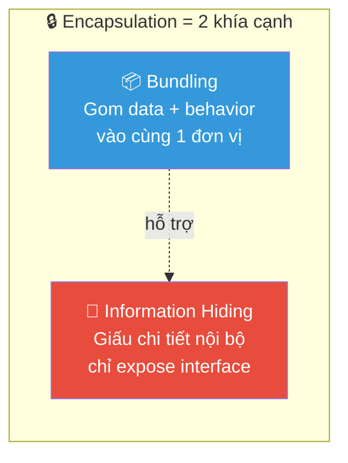
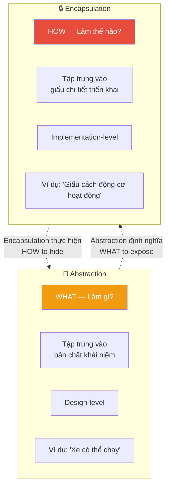
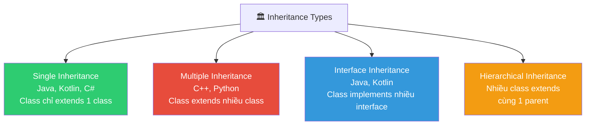
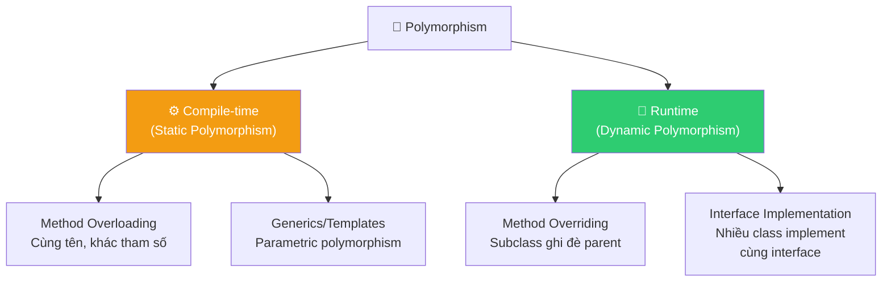
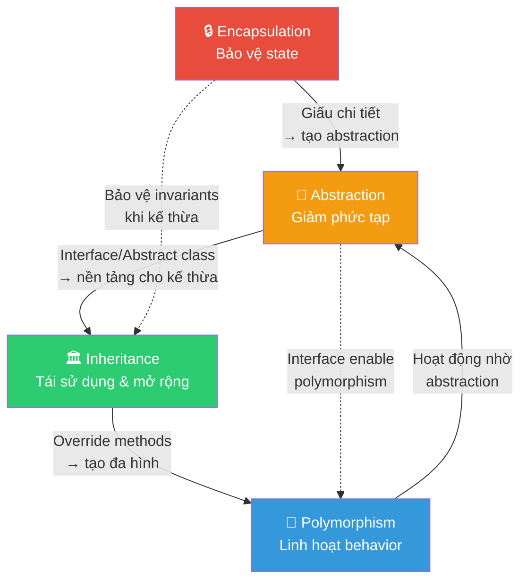

# 🏛️ 4 Trụ Cột của OOP — Phân Tích Chuyên Sâu

> **Mức độ quan trọng**: ⭐⭐⭐ Cốt lõi — Không thể viết code OOP tốt nếu không hiểu rõ 4 trụ cột này.

---

## 📋 Mục Lục

- [1. Encapsulation — Đóng Gói](#1-encapsulation--đóng-gói)
- [2. Abstraction — Trừu Tượng Hóa](#2-abstraction--trừu-tượng-hóa)
- [3. Inheritance — Kế Thừa](#3-inheritance--kế-thừa)
- [4. Polymorphism — Đa Hình](#4-polymorphism--đa-hình)
- [5. Mối Quan Hệ Giữa 4 Trụ Cột](#5-mối-quan-hệ-giữa-4-trụ-cột)
- [6. So Sánh Tổng Hợp](#6-so-sánh-tổng-hợp)

---

## 1. Encapsulation — Đóng Gói

### 1.1 Định Nghĩa Chính Xác

**Encapsulation** là cơ chế **đóng gói dữ liệu (state)** và **hành vi thao tác trên dữ liệu đó (behavior)** vào cùng một đơn vị (class), đồng thời **kiểm soát quyền truy cập** từ bên ngoài.

> **Hiểu nhầm phổ biến #1**: Nhiều người nghĩ encapsulation chỉ là "dùng private + getter/setter". Đó là **information hiding** — chỉ là MỘT PHẦN của encapsulation.



### 1.2 Hai Khía Cạnh Cốt Lõi

| Khía cạnh | Ý nghĩa | Ví dụ |
|-----------|---------|-------|
| **Bundling** | Gom dữ liệu và phương thức xử lý vào cùng class | `BankAccount` chứa `balance` + `deposit()` + `withdraw()` |
| **Information Hiding** | Giấu chi tiết triển khai, chỉ lộ interface cần thiết | `balance` là private, chỉ access qua `getBalance()` |

### 1.3 Ví Dụ Minh Họa Chi Tiết

#### ❌ Vi phạm Encapsulation — "Anemic Domain Model"

```java
// ❌ BAD: Data và logic tách rời
// Class chỉ chứa data, không có behavior → Anemic Domain Model
public class BankAccount {
    public double balance;     // Public field → ai cũng sửa được
    public String accountId;
    public String ownerName;
}

// Logic nằm riêng ở service → KHÔNG PHẢI OOP thực sự
public class BankService {
    public void withdraw(BankAccount account, double amount) {
        // Ai cũng có thể bypass method này và sửa trực tiếp account.balance
        if (account.balance >= amount) {
            account.balance -= amount;
        }
    }
    
    public void deposit(BankAccount account, double amount) {
        account.balance += amount;
    }
}

// Vấn đề: Bất kỳ đâu trong code đều có thể làm:
// account.balance = -999999;  → Trạng thái vô nghĩa, không ai ngăn được!
```

#### ✅ Encapsulation đúng cách

```java
// ✅ GOOD: Data + Behavior + Validation gói trong cùng class
public class BankAccount {
    // 🔒 Private state — không ai truy cập trực tiếp
    private double balance;
    private final String accountId;
    private final String ownerName;
    private final List<Transaction> transactionHistory;

    // Constructor kiểm soát đầu vào
    public BankAccount(String accountId, String ownerName, double initialDeposit) {
        if (initialDeposit < 0) {
            throw new IllegalArgumentException("Số tiền gửi ban đầu không thể âm");
        }
        this.accountId = accountId;
        this.ownerName = ownerName;
        this.balance = initialDeposit;
        this.transactionHistory = new ArrayList<>();
    }

    // 📤 Behavior kèm business rule — rút tiền
    public void withdraw(double amount) {
        if (amount <= 0) {
            throw new IllegalArgumentException("Số tiền rút phải dương");
        }
        if (amount > balance) {
            throw new InsufficientFundsException(
                "Số dư " + balance + " không đủ để rút " + amount
            );
        }
        balance -= amount;
        transactionHistory.add(new Transaction(TransactionType.WITHDRAWAL, amount));
    }

    // 📥 Behavior kèm business rule — gửi tiền
    public void deposit(double amount) {
        if (amount <= 0) {
            throw new IllegalArgumentException("Số tiền gửi phải dương");
        }
        balance += amount;
        transactionHistory.add(new Transaction(TransactionType.DEPOSIT, amount));
    }

    // 🔍 Chỉ expose read-only view
    public double getBalance() {
        return balance;  // Trả về primitive → immutable
    }

    // 🔍 Trả về bản sao → không ai sửa được list gốc
    public List<Transaction> getTransactionHistory() {
        return Collections.unmodifiableList(transactionHistory);
    }
    
    // ❌ KHÔNG CÓ setBalance() — không cho phép sửa trực tiếp
}
```

### 1.4 Các Cấp Độ Access Control

```
┌─────────────────────────────────────────────────────┐
│ Access Modifier    │ Class │ Package │ Subclass │ World │
├────────────────────┼───────┼─────────┼──────────┼───────┤
│ public             │  ✅   │   ✅    │    ✅    │  ✅   │
│ protected          │  ✅   │   ✅    │    ✅    │  ❌   │
│ default (package)  │  ✅   │   ✅    │    ❌    │  ❌   │
│ private            │  ✅   │   ❌    │    ❌    │  ❌   │
└─────────────────────────────────────────────────────┘
```

### 1.5 Ngữ Cảnh Sử Dụng Thực Tế

| Ngữ cảnh | Encapsulation áp dụng như thế nào |
|-----------|-----------------------------------|
| 🏦 **Banking** | `BankAccount.balance` private → chỉ thay đổi qua `deposit()` / `withdraw()` với validation |
| 📱 **Mobile App** | `UserSession` giấu token, expose `isLoggedIn()` thay vì lộ token string |
| 🎮 **Game Dev** | `Player.health` private → chỉ thay đổi qua `takeDamage()` / `heal()` với min/max bounds |
| 🌐 **API Design** | HTTP client giấu connection pooling, retry logic → expose `get()` / `post()` đơn giản |

### 1.6 Liên Kết SOLID

- **SRP**: Class đóng gói tốt thường có trách nhiệm đơn nhất
- **ISP**: Encapsulation tốt = expose ít interface, liên quan trực tiếp đến phân tách interface

---

## 2. Abstraction — Trừu Tượng Hóa

### 2.1 Định Nghĩa Chính Xác

**Abstraction** là quá trình **mô hình hóa các khái niệm phức tạp** bằng cách chỉ giữ lại những **đặc điểm thiết yếu** và **ẩn đi chi tiết triển khai**, tạo ra một "lớp trừu tượng" cho phép người dùng tương tác ở mức khái niệm thay vì mức triển khai.

> **Hiểu nhầm phổ biến #2**: Abstraction ≠ Abstract class. Abstract class chỉ là MỘT CÁCH để hiện thực hóa abstraction trong code.

### 2.2 Phân Biệt Abstraction vs Encapsulation



| Tiêu chí | Abstraction | Encapsulation |
|----------|-------------|---------------|
| **Mục đích** | Giảm phức tạp bằng cách mô hình hóa | Bảo vệ dữ liệu và ẩn triển khai |
| **Câu hỏi** | "Cần expose CÁI GÌ?" | "Giấu NHƯ THẾ NÀO?" |
| **Mức độ** | Design-level (thiết kế) | Implementation-level (triển khai) |
| **Công cụ** | Interface, Abstract class | Access modifiers, Wrapper methods |
| **Ví dụ đời thực** | Remote TV: các nút Power, Volume, Channel | Mạch điện bên trong TV bị ẩn đi |

### 2.3 Ví Dụ Minh Họa Chi Tiết

#### Tầng Abstraction trong hệ thống thanh toán

```java
// ──────────────────────────────────────────
// TẦNG 1: Abstraction cao nhất — "Thanh toán là gì?"
// ──────────────────────────────────────────
public interface PaymentProcessor {
    /**
     * Xử lý thanh toán.
     * Người gọi KHÔNG CẦN BIẾT:
     *   - Kết nối API bên thứ 3 như thế nào
     *   - Retry bao nhiêu lần khi fail
     *   - Mã hóa dữ liệu thẻ ra sao
     * 
     * Người gọi CHỈ CẦN BIẾT:
     *   - Đưa vào PaymentRequest
     *   - Nhận lại PaymentResult
     */
    PaymentResult processPayment(PaymentRequest request);
    
    PaymentResult refund(String transactionId, Money amount);
    
    PaymentStatus checkStatus(String transactionId);
}

// ──────────────────────────────────────────
// TẦNG 2: Abstract class — Chia sẻ logic chung
// ──────────────────────────────────────────
public abstract class AbstractPaymentProcessor implements PaymentProcessor {
    
    private final RetryPolicy retryPolicy;
    private final AuditLogger auditLogger;
    
    @Override
    public final PaymentResult processPayment(PaymentRequest request) {
        // Template Method pattern: luồng xử lý chung
        validate(request);                           // Bước 1: Validate
        PaymentResult result = retryPolicy.execute(  // Bước 2: Execute có retry
            () -> doProcessPayment(request)          // ← Subclass implement
        );
        auditLogger.log(request, result);            // Bước 3: Audit log
        return result;
    }
    
    // Hook method — subclass PHẢI implement chi tiết gọi API
    protected abstract PaymentResult doProcessPayment(PaymentRequest request);
    
    // Hook method — subclass PHẢI implement validation riêng
    protected abstract void validate(PaymentRequest request);
}

// ──────────────────────────────────────────
// TẦNG 3: Concrete — Chi tiết triển khai cụ thể
// ──────────────────────────────────────────
public class StripePaymentProcessor extends AbstractPaymentProcessor {
    
    private final StripeClient stripeClient;  // SDK của Stripe
    
    @Override
    protected PaymentResult doProcessPayment(PaymentRequest request) {
        // Chi tiết cụ thể: gọi Stripe API
        ChargeCreateParams params = ChargeCreateParams.builder()
            .setAmount(request.getAmount().toCents())
            .setCurrency(request.getCurrency().getCode())
            .setSource(request.getPaymentToken())
            .build();
        
        Charge charge = stripeClient.charges().create(params);
        return mapToPaymentResult(charge);
    }
    
    @Override
    protected void validate(PaymentRequest request) {
        // Stripe yêu cầu token, không nhận card number trực tiếp
        if (request.getPaymentToken() == null) {
            throw new InvalidPaymentException("Stripe requires a payment token");
        }
    }
}

public class VNPayPaymentProcessor extends AbstractPaymentProcessor {
    
    private final VNPayClient vnpayClient;
    
    @Override
    protected PaymentResult doProcessPayment(PaymentRequest request) {
        // Chi tiết cụ thể: gọi VNPay API (khác hoàn toàn Stripe)
        VNPayTransaction txn = vnpayClient.createTransaction(
            request.getAmount().toBigDecimal(),
            request.getOrderId(),
            request.getReturnUrl()
        );
        return mapToPaymentResult(txn);
    }
    
    @Override
    protected void validate(PaymentRequest request) {
        // VNPay yêu cầu orderId + returnUrl
        if (request.getOrderId() == null || request.getReturnUrl() == null) {
            throw new InvalidPaymentException("VNPay requires orderId and returnUrl");
        }
    }
}
```

#### Cách sử dụng — Client code không cần biết chi tiết

```java
public class CheckoutService {
    private final PaymentProcessor paymentProcessor;  // Chỉ biết abstraction!
    
    // Inject bất kỳ implementation nào
    public CheckoutService(PaymentProcessor paymentProcessor) {
        this.paymentProcessor = paymentProcessor;
    }
    
    public OrderResult checkout(Order order) {
        PaymentRequest request = PaymentRequest.builder()
            .amount(order.getTotalAmount())
            .currency(Currency.VND)
            .orderId(order.getId())
            .build();
        
        // ✅ Không cần biết là Stripe hay VNPay
        // ✅ Không cần biết retry logic, audit logging
        // ✅ Chỉ cần biết: gửi request → nhận result
        PaymentResult result = paymentProcessor.processPayment(request);
        
        if (result.isSuccessful()) {
            return OrderResult.success(order, result.getTransactionId());
        }
        return OrderResult.failed(order, result.getErrorMessage());
    }
}
```

### 2.4 Levels of Abstraction

```
┌──────────────────────────────────────────────────────┐
│  Level 4: Business Domain                            │
│  "Khách hàng thanh toán đơn hàng"                    │
│  → CheckoutService.checkout(order)                   │
├──────────────────────────────────────────────────────┤
│  Level 3: Service Interface                          │
│  "Xử lý thanh toán với request/response"             │
│  → PaymentProcessor.processPayment(request)          │
├──────────────────────────────────────────────────────┤
│  Level 2: Infrastructure Abstraction                 │
│  "Gọi API gateway thanh toán bên thứ 3"             │
│  → StripePaymentProcessor.doProcessPayment()         │
├──────────────────────────────────────────────────────┤
│  Level 1: Technical Detail                           │
│  "HTTP POST /v1/charges, JSON encoding, SSL..."      │
│  → StripeClient, HttpClient, SSLContext              │
└──────────────────────────────────────────────────────┘
```

### 2.5 Liên Kết SOLID

- **DIP**: "Phụ thuộc vào abstraction" — chính là áp dụng abstraction
- **OCP**: Abstraction tốt cho phép mở rộng (thêm MoMoPaymentProcessor) mà không sửa code cũ

---

## 3. Inheritance — Kế Thừa

### 3.1 Định Nghĩa Chính Xác

**Inheritance** là cơ chế cho phép một class (subclass/child) **kế thừa thuộc tính và phương thức** từ class khác (superclass/parent), tạo ra **quan hệ IS-A** (là một loại). Subclass có thể **tái sử dụng**, **mở rộng**, hoặc **ghi đè** behavior của superclass.

> **⚠️ Cảnh báo quan trọng**: Inheritance là công cụ mạnh nhưng **dễ bị lạm dụng nhất** trong OOP. Modern OOP ưu tiên Composition over Inheritance trong hầu hết trường hợp.

### 3.2 Các Loại Inheritance



### 3.3 Ví Dụ Minh Họa Chi Tiết

#### ❌ Kế thừa sai — "Hình vuông kế thừa Hình chữ nhật" (Ví dụ kinh điển vi phạm LSP)

```java
// ❌ BAD: Square IS-A Rectangle? Về mặt toán học thì đúng,
// nhưng về mặt hành vi OOP thì SAI!

public class Rectangle {
    protected int width;
    protected int height;
    
    public void setWidth(int width)   { this.width = width; }
    public void setHeight(int height) { this.height = height; }
    public int getArea()              { return width * height; }
}

public class Square extends Rectangle {
    // Override để đảm bảo width == height luôn đúng
    @Override
    public void setWidth(int width) {
        this.width = width;
        this.height = width;  // ← Side effect bất ngờ!
    }
    
    @Override
    public void setHeight(int height) {
        this.width = height;  // ← Side effect bất ngờ!
        this.height = height;
    }
}

// ❌ Client code BỊ PHÁ VỠ:
public void testArea(Rectangle rect) {
    rect.setWidth(5);
    rect.setHeight(4);
    // Kỳ vọng: area = 20
    assert rect.getArea() == 20;  // FAIL nếu rect là Square!
    // Square: setHeight(4) → width=4, height=4 → area = 16
}
```

#### ✅ Kế thừa đúng — Employee Hierarchy

```java
// ✅ GOOD: Kế thừa hợp lý — "IS-A" thực sự
// Mọi subclass đều CÓ THỂ thay thế Employee mà không phá vỡ behavior

public abstract class Employee {
    private final String id;
    private final String name;
    private final String department;
    private LocalDate hireDate;
    
    public Employee(String id, String name, String department) {
        this.id = id;
        this.name = name;
        this.department = department;
        this.hireDate = LocalDate.now();
    }
    
    // Template method — mỗi loại employee tính lương khác nhau
    public abstract Money calculateSalary();
    
    // Behavior chung — tất cả employee đều có
    public int getYearsOfService() {
        return Period.between(hireDate, LocalDate.now()).getYears();
    }
    
    // Có thể override nhưng có default behavior hợp lý
    public Money calculateBonus() {
        return calculateSalary().multiply(0.1);  // Default: 10% lương
    }
    
    // Getters — encapsulation
    public String getId()         { return id; }
    public String getName()       { return name; }
    public String getDepartment() { return department; }
}

// ✅ FullTimeEmployee IS-A Employee — hoàn toàn hợp lý
public class FullTimeEmployee extends Employee {
    private final Money monthlySalary;
    private final int paidLeaveDays;
    
    public FullTimeEmployee(String id, String name, String dept, 
                            Money monthlySalary) {
        super(id, name, dept);
        this.monthlySalary = monthlySalary;
        this.paidLeaveDays = 12;  // 12 ngày phép/năm
    }
    
    @Override
    public Money calculateSalary() {
        return monthlySalary;
    }
    
    @Override
    public Money calculateBonus() {
        // Full-time: bonus = 1 tháng lương + 5% mỗi năm thâm niên
        double bonusRate = 1.0 + (getYearsOfService() * 0.05);
        return monthlySalary.multiply(bonusRate);
    }
}

// ✅ ContractEmployee IS-A Employee — hoàn toàn hợp lý
public class ContractEmployee extends Employee {
    private final Money hourlyRate;
    private final int hoursWorked;
    
    public ContractEmployee(String id, String name, String dept, 
                            Money hourlyRate, int hoursWorked) {
        super(id, name, dept);
        this.hourlyRate = hourlyRate;
        this.hoursWorked = hoursWorked;
    }
    
    @Override
    public Money calculateSalary() {
        return hourlyRate.multiply(hoursWorked);
    }
    
    // Không override calculateBonus() → dùng default 10%
}

// ✅ Intern IS-A Employee — hoàn toàn hợp lý  
public class Intern extends Employee {
    private final Money stipend;  // Trợ cấp cố định
    
    public Intern(String id, String name, String dept, Money stipend) {
        super(id, name, dept);
        this.stipend = stipend;
    }
    
    @Override
    public Money calculateSalary() {
        return stipend;
    }
    
    @Override
    public Money calculateBonus() {
        return Money.ZERO;  // Intern không có bonus — hợp lý!
    }
}
```

#### Sử dụng Polymorphism qua Inheritance

```java
public class PayrollService {
    public PayrollReport generatePayroll(List<Employee> employees) {
        Money totalSalary = Money.ZERO;
        Money totalBonus = Money.ZERO;
        
        for (Employee emp : employees) {
            // ✅ Polymorphism: mỗi loại employee tính lương/bonus khác nhau
            // nhưng code ở đây KHÔNG CẦN BIẾT cụ thể loại nào
            totalSalary = totalSalary.add(emp.calculateSalary());
            totalBonus = totalBonus.add(emp.calculateBonus());
        }
        
        return new PayrollReport(employees.size(), totalSalary, totalBonus);
    }
}
```

### 3.4 Khi Nào Nên / Không Nên Dùng Inheritance

| ✅ Nên dùng khi | ❌ Không nên dùng khi |
|----------------|---------------------|
| Quan hệ **IS-A** thực sự và bền vững | Chỉ muốn **tái sử dụng code** (dùng Composition) |
| Subclass không vi phạm **LSP** | Quan hệ **HAS-A** (dùng Composition) |
| Hierarchy ≤ 3 cấp | Hierarchy > 3 cấp (quá phức tạp) |
| Base class **ổn định**, ít thay đổi | Base class thay đổi thường xuyên |
| Template Method pattern | Cần thay đổi behavior **runtime** (dùng Strategy) |

### 3.5 Liên Kết SOLID

- **LSP**: Subclass PHẢI thay thế được base class → Kiểm tra trước khi inheritance
- **OCP**: Thêm subclass mới mà không sửa code cũ → Inheritance hỗ trợ mở rộng

---

## 4. Polymorphism — Đa Hình

### 4.1 Định Nghĩa Chính Xác

**Polymorphism** (poly = nhiều, morph = hình dạng) là khả năng **cùng một interface/method** có thể **hoạt động khác nhau** tùy thuộc vào đối tượng thực tế đang thực thi. Đây là trụ cột **mạnh nhất** của OOP — cho phép viết code linh hoạt, mở rộng được.

### 4.2 Các Loại Polymorphism



### 4.3 Ví Dụ Minh Họa Chi Tiết

#### 4.3.1 Compile-time Polymorphism — Method Overloading

```java
public class Logger {
    // ✅ Cùng tên "log" nhưng khác tham số
    // Compiler quyết định gọi method nào dựa trên tham số truyền vào
    
    public void log(String message) {
        System.out.println("[INFO] " + message);
    }
    
    public void log(String message, LogLevel level) {
        System.out.println("[" + level + "] " + message);
    }
    
    public void log(String message, LogLevel level, Exception exception) {
        System.out.println("[" + level + "] " + message);
        exception.printStackTrace();
    }
    
    // Generics — Parametric Polymorphism
    public <T> void log(String message, T context) {
        System.out.println("[INFO] " + message + " | Context: " + context);
    }
}

// Sử dụng:
Logger logger = new Logger();
logger.log("Server started");                          // → log(String)
logger.log("Connection lost", LogLevel.ERROR);         // → log(String, LogLevel)
logger.log("Timeout", LogLevel.ERROR, new TimeoutException()); // → log(String, LogLevel, Exception)
```

#### 4.3.2 Runtime Polymorphism — Ví dụ hệ thống Notification

```java
// ──────────────────────────────────────────
// Interface định nghĩa "hợp đồng" — Notification gửi được
// ──────────────────────────────────────────
public interface NotificationSender {
    void send(Notification notification);
    boolean supports(NotificationType type);
}

// ──────────────────────────────────────────
// Implementation 1: Email
// ──────────────────────────────────────────
public class EmailNotificationSender implements NotificationSender {
    private final EmailClient emailClient;
    
    @Override
    public void send(Notification notification) {
        emailClient.sendEmail(
            notification.getRecipient().getEmail(),
            notification.getSubject(),
            notification.getBody()
        );
    }
    
    @Override
    public boolean supports(NotificationType type) {
        return type == NotificationType.EMAIL;
    }
}

// ──────────────────────────────────────────
// Implementation 2: SMS
// ──────────────────────────────────────────
public class SmsNotificationSender implements NotificationSender {
    private final SmsGateway smsGateway;
    
    @Override
    public void send(Notification notification) {
        smsGateway.sendSms(
            notification.getRecipient().getPhoneNumber(),
            notification.getBody()  // SMS không có subject
        );
    }
    
    @Override
    public boolean supports(NotificationType type) {
        return type == NotificationType.SMS;
    }
}

// ──────────────────────────────────────────
// Implementation 3: Push Notification
// ──────────────────────────────────────────
public class PushNotificationSender implements NotificationSender {
    private final FirebaseClient firebaseClient;
    
    @Override
    public void send(Notification notification) {
        firebaseClient.sendPush(
            notification.getRecipient().getDeviceToken(),
            notification.getSubject(),
            notification.getBody()
        );
    }
    
    @Override
    public boolean supports(NotificationType type) {
        return type == NotificationType.PUSH;
    }
}

// ──────────────────────────────────────────
// Service sử dụng — KHÔNG BIẾT implementation cụ thể
// ──────────────────────────────────────────
public class NotificationService {
    // ✅ Inject danh sách — dễ dàng thêm loại mới
    private final List<NotificationSender> senders;
    
    public NotificationService(List<NotificationSender> senders) {
        this.senders = senders;
    }
    
    public void notify(User user, String subject, String body, 
                       NotificationType type) {
        Notification notification = new Notification(user, subject, body);
        
        // ✅ Polymorphism: cùng gọi send() nhưng mỗi sender 
        //    thực hiện khác nhau (email, sms, push)
        senders.stream()
            .filter(sender -> sender.supports(type))
            .forEach(sender -> sender.send(notification));
    }
    
    // ✅ Gửi qua TẤT CẢ kênh
    public void notifyAll(User user, String subject, String body) {
        Notification notification = new Notification(user, subject, body);
        senders.forEach(sender -> sender.send(notification));
    }
}
```

### 4.4 Polymorphism Giải Quyết Vấn Đề Gì?

#### Không có Polymorphism — If/Switch chain

```java
// ❌ BAD: Mỗi lần thêm loại notification → sửa code ở đây
public void sendNotification(User user, String message, String type) {
    if (type.equals("email")) {
        emailClient.sendEmail(user.getEmail(), message);
    } else if (type.equals("sms")) {
        smsGateway.sendSms(user.getPhone(), message);
    } else if (type.equals("push")) {
        firebaseClient.sendPush(user.getDeviceToken(), message);
    }
    // ❌ Thêm Zalo, Telegram → phải sửa method này
    // ❌ Vi phạm OCP!
}
```

#### Có Polymorphism — Mở rộng tự do

```java
// ✅ GOOD: Thêm loại mới? Chỉ cần implement interface
public class ZaloNotificationSender implements NotificationSender {
    @Override
    public void send(Notification notification) { /* Gọi Zalo API */ }
    
    @Override
    public boolean supports(NotificationType type) {
        return type == NotificationType.ZALO;
    }
}

// NotificationService KHÔNG CẦN SỬA → OCP satisfied!
```

### 4.5 Liên Kết SOLID

- **OCP**: Polymorphism là **cơ chế chính** để đạt được Open/Closed (thêm behavior mới bằng implementation mới)
- **LSP**: Mọi implementation phải **thay thế được** interface mà không phá vỡ client code
- **DIP**: Client phụ thuộc vào interface (abstraction), không phụ thuộc implementation cụ thể

---

## 5. Mối Quan Hệ Giữa 4 Trụ Cột



**Đọc sơ đồ:**
1. **Encapsulation** bảo vệ state → cho phép tạo **abstraction** (giấu HOW, lộ WHAT)
2. **Abstraction** (interface/abstract class) → là nền tảng cho **inheritance**
3. **Inheritance** + method overriding → tạo **polymorphism**
4. **Polymorphism** hoạt động nhờ **abstraction** (gọi qua interface, dispatch đến implementation)

---

## 6. So Sánh Tổng Hợp

| Tiêu chí | Encapsulation | Abstraction | Inheritance | Polymorphism |
|----------|:---:|:---:|:---:|:---:|
| **Mục đích chính** | Bảo vệ dữ liệu | Giảm phức tạp | Tái sử dụng code | Linh hoạt behavior |
| **Câu hỏi** | "Giấu gì?" | "Expose gì?" | "Kế thừa gì?" | "Hoạt động thế nào?" |
| **Cơ chế** | Access modifiers | Interface, Abstract class | `extends`, `implements` | Override, Overload |
| **Mức thiết kế** | Implementation | Design | Design + Implementation | Design + Implementation |
| **Rủi ro lạm dụng** | 🟡 Trung bình | 🟢 Thấp | 🔴 Cao | 🟡 Trung bình |
| **Liên kết SOLID** | SRP, ISP | DIP, OCP | LSP, OCP | OCP, LSP, DIP |
| **Ví dụ đời thực** | Ổ điện: giấu dây điện | Remote: nút bấm đơn giản | Xe tải kế thừa Xe | USB: cùng cổng, nhiều thiết bị |

---

> **Tiếp theo**: [Quan Hệ Giữa Các Đối Tượng →](./02-object-relationships.md)
