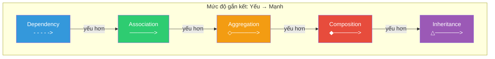
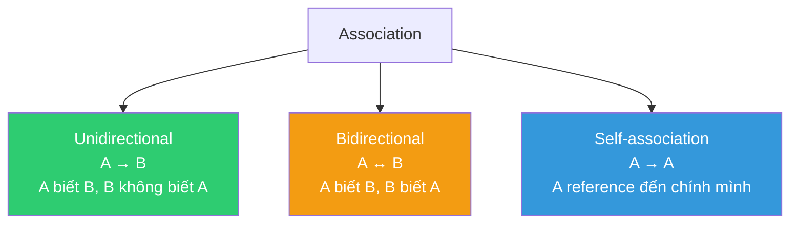
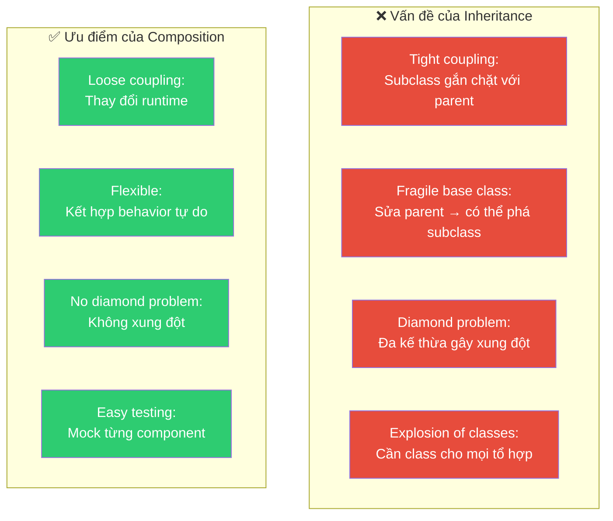
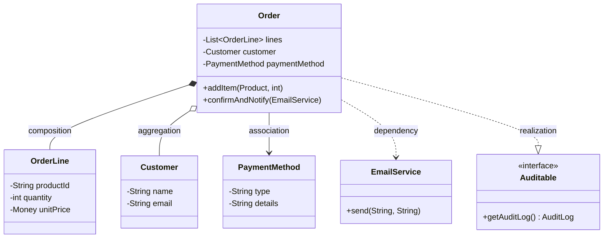

# 🔗 Quan Hệ Giữa Các Đối Tượng — Phân Tích Chuyên Sâu

> **Mức độ quan trọng**: ⭐⭐⭐ — Hiểu sai quan hệ giữa objects là nguyên nhân gốc rễ của hầu hết lỗi thiết kế OOP.

---

## 📋 Mục Lục

- [1. Tổng Quan Các Loại Quan Hệ](#1-tổng-quan-các-loại-quan-hệ)
- [2. Dependency — Phụ Thuộc](#2-dependency--phụ-thuộc)
- [3. Association — Liên Kết](#3-association--liên-kết)
- [4. Aggregation — Gộp Nhóm](#4-aggregation--gộp-nhóm)
- [5. Composition — Hợp Thành](#5-composition--hợp-thành)
- [6. Inheritance vs Composition](#6-inheritance-vs-composition)
- [7. Realization — Hiện Thực Hóa](#7-realization--hiện-thực-hóa)
- [8. Ma Trận So Sánh & Quy Tắc Chọn](#8-ma-trận-so-sánh--quy-tắc-chọn)

---

## 1. Tổng Quan Các Loại Quan Hệ



| Quan hệ | Ký hiệu UML | Ngữ nghĩa | Lifetime coupling |
|---------|:---:|---|:---:|
| **Dependency** | `- - ->` | "uses" — dùng tạm thời | Không |
| **Association** | `────>` | "knows" — biết nhau | Không |
| **Aggregation** | `◇───>` | "has" — có nhưng không sở hữu | Không |
| **Composition** | `◆───>` | "owns" — sở hữu, vòng đời gắn liền | Có |
| **Inheritance** | `△───>` | "is-a" — là một loại | Có (compile-time) |
| **Realization** | `△- - ->` | "implements" — hiện thực hóa interface | Có (compile-time) |

---

## 2. Dependency — Phụ Thuộc

### 2.1 Đặc Điểm

| Đặc điểm | Mô tả |
|-----------|-------|
| **Định nghĩa** | Class A **sử dụng** class B nhưng **không giữ reference** lâu dài |
| **Thời gian** | Tạm thời — chỉ trong scope của method |
| **Coupling** | Yếu nhất trong tất cả quan hệ |
| **UML** | Mũi tên nét đứt `- - - ->` |
| **Ngữ nghĩa** | "A **uses** B" |

### 2.2 Ví Dụ Minh Họa

```java
// B xuất hiện trong: (1) parameter, (2) local variable, (3) return type
// KHÔNG phải field của A

public class OrderService {
    
    // ✅ Dependency qua parameter — OrderValidator chỉ dùng trong scope method
    public boolean validateOrder(Order order, OrderValidator validator) {
        return validator.validate(order);
    }
    
    // ✅ Dependency qua local variable — PDF chỉ tạo tạm
    public void exportOrder(Order order) {
        PdfGenerator pdf = new PdfGenerator();  // Dùng xong bỏ
        pdf.generate(order.toDocument());
    }
    
    // ✅ Dependency qua return type
    public OrderSummary summarize(Order order) {
        return new OrderSummary(order.getTotal(), order.getItemCount());
    }
}
```

### 2.3 Ngữ Cảnh Sử Dụng

| Ngữ cảnh | Ví dụ |
|-----------|-------|
| 📧 **Utility classes** | `String.format(...)` — dùng xong không giữ |
| 🏭 **Factory method** | `createUser(UserDto dto)` — dto chỉ dùng để tạo, không lưu |
| 📊 **Converter** | `toJson(Object obj)` — obj chỉ dùng trong scope convert |

---

## 3. Association — Liên Kết

### 3.1 Đặc Điểm

| Đặc điểm | Mô tả |
|-----------|-------|
| **Định nghĩa** | Class A **biết** class B và **giữ reference** dài hạn (field) |
| **Thời gian** | Dài hạn — tồn tại suốt lifetime của A |
| **Coupling** | Trung bình |
| **UML** | Mũi tên nét liền `────>` |
| **Ngữ nghĩa** | "A **knows** B", "A **has a reference to** B" |

### 3.2 Phân Loại Association



### 3.3 Ví Dụ Minh Họa

```java
// ──────────────────────────────────────────
// Unidirectional Association: Teacher → Course
// Teacher biết Course, Course không biết Teacher
// ──────────────────────────────────────────
public class Teacher {
    private String name;
    private List<Course> assignedCourses;  // ✅ Association: giữ reference dài hạn
    
    public void assignCourse(Course course) {
        assignedCourses.add(course);
    }
    
    public void removeCourse(Course course) {
        assignedCourses.remove(course);
    }
    
    // ⚡ Course tồn tại ĐỘC LẬP với Teacher
    // Xóa Teacher → Course vẫn tồn tại
}

// ──────────────────────────────────────────
// Bidirectional Association: Student ↔ Course
// ──────────────────────────────────────────
public class Student {
    private String name;
    private List<Course> enrolledCourses;  // Student → Course
    
    public void enroll(Course course) {
        enrolledCourses.add(course);
        course.addStudent(this);  // Đồng bộ 2 chiều
    }
}

public class Course {
    private String title;
    private List<Student> students;  // Course → Student
    
    public void addStudent(Student student) {
        students.add(student);
    }
}

// ──────────────────────────────────────────
// Self-Association: Employee → Employee (manager)
// ──────────────────────────────────────────
public class Employee {
    private String name;
    private Employee manager;           // Self-association: manager cũng là Employee
    private List<Employee> subordinates; // Self-association ngược
}
```

### 3.4 Phân Biệt Dependency vs Association

| Tiêu chí | Dependency | Association |
|----------|:---:|:---:|
| **Reference** | Tạm thời (parameter/local var) | Dài hạn (field) |
| **Scope** | Trong 1 method | Suốt lifetime |
| **Coupling** | Yếu | Trung bình |
| **Ví dụ code** | `void print(Document doc)` | `private Printer printer;` |
| **Ví dụ đời thực** | Khách thuê taxi (dùng xong xuống) | Tài xế có chiếc xe riêng |

---

## 4. Aggregation — Gộp Nhóm

### 4.1 Đặc Điểm

| Đặc điểm | Mô tả |
|-----------|-------|
| **Định nghĩa** | Quan hệ **"has-a"** — whole chứa part, nhưng part **tồn tại độc lập** |
| **Vòng đời** | Part **KHÔNG bị phá hủy** khi whole bị phá hủy |
| **Ownership** | Weak ownership — "mượn" chứ không "sở hữu" |
| **UML** | Hình thoi rỗng `◇────>` |
| **Ngữ nghĩa** | "A **has** B (but B can exist without A)" |

### 4.2 Ví Dụ Minh Họa

```java
// ◇ Aggregation: Department ◇───> Employee
// Department CÓ nhiều Employee, nhưng Employee TỒN TẠI ĐỘC LẬP
// Xóa Department → Employee KHÔNG bị xóa (chuyển sang dept khác)

public class Department {
    private String name;
    private List<Employee> members;  // ◇ Aggregation
    
    public Department(String name) {
        this.name = name;
        this.members = new ArrayList<>();
    }
    
    // Employee được tạo BÊN NGOÀI, truyền vào → không sở hữu
    public void addMember(Employee employee) {
        members.add(employee);
    }
    
    public void removeMember(Employee employee) {
        members.remove(employee);
        // ✅ Employee vẫn tồn tại sau khi rời khỏi Department!
    }
}

// Employee tồn tại độc lập
public class Employee {
    private String name;
    private String employeeId;
    
    // Employee được tạo TRƯỚC, KHÔNG phụ thuộc Department
    public Employee(String name, String employeeId) {
        this.name = name;
        this.employeeId = employeeId;
    }
}

// Sử dụng: Employee tồn tại trước và sau Department
Employee alice = new Employee("Alice", "E001");
Employee bob = new Employee("Bob", "E002");

Department engineering = new Department("Engineering");
engineering.addMember(alice);
engineering.addMember(bob);

// ✅ Xóa department → alice và bob vẫn tồn tại
engineering = null;
System.out.println(alice.getName()); // "Alice" — vẫn sống!
```

### 4.3 Ví Dụ Thực Tế Khác

```java
// ◇ Aggregation: Playlist ◇───> Song
// Playlist chứa nhiều Song, nhưng Song tồn tại độc lập
// Xóa Playlist → Song KHÔNG bị xóa (có thể nằm trong Playlist khác)

public class Playlist {
    private String name;
    private List<Song> songs;  // Aggregation: Song tồn tại độc lập
    
    public void addSong(Song song)    { songs.add(song); }
    public void removeSong(Song song) { songs.remove(song); }
}

// 1 Song có thể nằm trong NHIỀU Playlist cùng lúc
Song song = new Song("Bohemian Rhapsody");
Playlist rock = new Playlist("Rock Classics");
Playlist favorites = new Playlist("My Favorites");
rock.addSong(song);
favorites.addSong(song);  // ✅ Cùng 1 Song, 2 Playlist
```

---

## 5. Composition — Hợp Thành

### 5.1 Đặc Điểm

| Đặc điểm | Mô tả |
|-----------|-------|
| **Định nghĩa** | Quan hệ **"owns-a"** — whole **sở hữu** part, part **không tồn tại** nếu không có whole |
| **Vòng đời** | Part **BỊ PHÁ HỦY** cùng whole |
| **Ownership** | Strong ownership — "sở hữu" hoàn toàn |
| **UML** | Hình thoi đặc `◆────>` |
| **Ngữ nghĩa** | "A **owns** B (B cannot exist without A)" |

### 5.2 Ví Dụ Minh Họa

```java
// ◆ Composition: House ◆───> Room
// House SỞ HỮU Room — Room KHÔNG TỒN TẠI nếu không có House
// Xóa House → Room BỊ XÓA theo

public class House {
    private final String address;
    private final List<Room> rooms;  // ◆ Composition: House sở hữu Room
    
    public House(String address, int numberOfRooms) {
        this.address = address;
        // ✅ Room được tạo BÊN TRONG House → House kiểm soát vòng đời
        this.rooms = new ArrayList<>();
        for (int i = 0; i < numberOfRooms; i++) {
            rooms.add(new Room("Room-" + (i + 1), 20.0));  // Tạo tại đây
        }
    }
    
    // ✅ Room chỉ truy cập qua House
    public List<Room> getRooms() {
        return Collections.unmodifiableList(rooms);
    }
    
    // Khi House bị GC → rooms cũng bị GC (không ai reference)
}

// Room không có ý nghĩa nếu không có House
public class Room {
    private final String name;
    private final double area;  // m²
    
    // Package-private constructor → chỉ House mới tạo được
    Room(String name, double area) {
        this.name = name;
        this.area = area;
    }
}
```

### 5.3 Ví Dụ Phức Tạp Hơn — Order và OrderLine

```java
// ◆ Composition: Order ◆───> OrderLine
// OrderLine không có ý nghĩa ngoài Order

public class Order {
    private final String orderId;
    private final List<OrderLine> lines;  // ◆ Composition
    private OrderStatus status;
    
    public Order(String orderId) {
        this.orderId = orderId;
        this.lines = new ArrayList<>();
        this.status = OrderStatus.CREATED;
    }
    
    // ✅ OrderLine được tạo TRONG context của Order
    public void addItem(Product product, int quantity) {
        OrderLine line = new OrderLine(  // ← Tạo tại đây
            product.getId(),
            product.getName(),
            product.getPrice(),
            quantity
        );
        lines.add(line);
    }
    
    public Money getTotal() {
        return lines.stream()
            .map(OrderLine::getSubtotal)
            .reduce(Money.ZERO, Money::add);
    }
    
    // ✅ Xóa Order → tất cả OrderLine bị xóa theo
    // Trong database: ON DELETE CASCADE
}

// OrderLine không tồn tại độc lập
public class OrderLine {
    private final String productId;
    private final String productName;
    private final Money unitPrice;
    private int quantity;
    
    // Constructor chỉ Order gọi được
    OrderLine(String productId, String productName, Money unitPrice, int quantity) {
        this.productId = productId;
        this.productName = productName;
        this.unitPrice = unitPrice;
        this.quantity = quantity;
    }
    
    public Money getSubtotal() {
        return unitPrice.multiply(quantity);
    }
}
```

### 5.4 Aggregation vs Composition — So Sánh Trực Quan

```
AGGREGATION (◇):                      COMPOSITION (◆):
                                       
  ┌──────────┐                           ┌──────────┐
  │Department│ ◇──── Employee            │  House   │ ◆──── Room
  └──────────┘       ↑                   └──────────┘       ↑
                     │                                      │
         Employee tồn tại                      Room bị phá hủy
         ĐỘC LẬP khi                          khi House bị
         Department bị xóa                     phá hủy
                                       
  Ví dụ khác:                          Ví dụ khác:
  • Playlist ◇── Song                  • Order ◆── OrderLine
  • Team ◇── Player                    • Car ◆── Engine
  • Library ◇── Book                   • Human ◆── Heart
  • University ◇── Professor           • Email ◆── Attachment
```

---

## 6. Inheritance vs Composition

### 6.1 Tại Sao "Composition over Inheritance"?

> **"Favor object composition over class inheritance."**
> — Gang of Four, Design Patterns (1994)



### 6.2 Ví Dụ Kinh Điển: "Class Explosion"

```java
// ❌ BAD: Inheritance → Bùng nổ class khi cần tổ hợp features
//
// Yêu cầu: Robot có thể:
//   - Di chuyển: Walk, Fly, Swim
//   - Tấn công: Shoot, Punch
//
// Inheritance approach:
//   WalkingShootingRobot
//   WalkingPunchingRobot
//   FlyingShootingRobot
//   FlyingPunchingRobot
//   SwimmingShootingRobot
//   SwimmingPunchingRobot
//   FlyingSwimmingShootingPunchingRobot  ← ???
//   → 3 × 2 = 6 class (ít nhất), tăng theo cấp số nhân!
```

```java
// ✅ GOOD: Composition → Tự do kết hợp features

// Interfaces cho từng khả năng
public interface MovementStrategy {
    void move(Position from, Position to);
}

public interface AttackStrategy {
    void attack(Target target);
}

// Implementations
public class WalkMovement implements MovementStrategy {
    @Override
    public void move(Position from, Position to) {
        System.out.println("Walking from " + from + " to " + to);
    }
}

public class FlyMovement implements MovementStrategy {
    @Override
    public void move(Position from, Position to) {
        System.out.println("Flying from " + from + " to " + to);
    }
}

public class ShootAttack implements AttackStrategy {
    @Override
    public void attack(Target target) {
        System.out.println("Shooting at " + target);
    }
}

public class PunchAttack implements AttackStrategy {
    @Override
    public void attack(Target target) {
        System.out.println("Punching " + target);
    }
}

// Robot sử dụng Composition — TỰ DO kết hợp
public class Robot {
    private final String name;
    private MovementStrategy movementStrategy;   // ◇ Aggregation
    private AttackStrategy attackStrategy;        // ◇ Aggregation
    
    public Robot(String name, MovementStrategy movement, AttackStrategy attack) {
        this.name = name;
        this.movementStrategy = movement;
        this.attackStrategy = attack;
    }
    
    // ✅ Thay đổi behavior RUNTIME — Inheritance không làm được!
    public void upgradeMovement(MovementStrategy newMovement) {
        this.movementStrategy = newMovement;
    }
    
    public void move(Position from, Position to) {
        movementStrategy.move(from, to);
    }
    
    public void attack(Target target) {
        attackStrategy.attack(target);
    }
}

// Sử dụng:
Robot terminator = new Robot("T-1000", new WalkMovement(), new ShootAttack());
terminator.move(posA, posB);  // "Walking from A to B"

// ✅ Upgrade runtime!
terminator.upgradeMovement(new FlyMovement());
terminator.move(posA, posB);  // "Flying from A to B"
```

### 6.3 Quy Tắc Chọn

```
┌─────────────────────────────────────────────────────────┐
│  Dùng INHERITANCE khi:                                  │
│  ✅ Quan hệ IS-A thực sự (Dog IS-A Animal)             │
│  ✅ Subclass là specialization của parent                │
│  ✅ Muốn dùng Template Method pattern                   │
│  ✅ Base class ổn định, ít thay đổi                     │
│  ✅ Hierarchy ≤ 3 cấp                                   │
├─────────────────────────────────────────────────────────┤
│  Dùng COMPOSITION khi:                                  │
│  ✅ Quan hệ HAS-A (Car HAS-A Engine)                   │
│  ✅ Cần thay đổi behavior runtime                       │
│  ✅ Cần kết hợp nhiều behavior linh hoạt                │
│  ✅ Base class có thể thay đổi                          │
│  ✅ Hierarchy sẽ > 3 cấp                               │
│  ✅ Đa kế thừa behavior (Java không hỗ trợ)            │
└─────────────────────────────────────────────────────────┘
```

---

## 7. Realization — Hiện Thực Hóa

### 7.1 Đặc Điểm

| Đặc điểm | Mô tả |
|-----------|-------|
| **Định nghĩa** | Class **implement** một interface — cam kết tuân thủ contract |
| **UML** | Mũi tên nét đứt với tam giác rỗng `△- - ->` |
| **Ngữ nghĩa** | "A **implements** B" |

### 7.2 Ví Dụ

```java
// Interface = contract
public interface Serializable {
    byte[] serialize();
    void deserialize(byte[] data);
}

// Realization = cam kết tuân thủ contract
public class User implements Serializable {
    private String name;
    private int age;
    
    @Override
    public byte[] serialize() {
        return (name + ":" + age).getBytes();
    }
    
    @Override
    public void deserialize(byte[] data) {
        String[] parts = new String(data).split(":");
        this.name = parts[0];
        this.age = Integer.parseInt(parts[1]);
    }
}
```

---

## 8. Ma Trận So Sánh & Quy Tắc Chọn

### 8.1 Ma Trận Tổng Hợp

| Tiêu chí | Dependency | Association | Aggregation | Composition | Inheritance |
|----------|:---:|:---:|:---:|:---:|:---:|
| **Coupling** | ⭐ | ⭐⭐ | ⭐⭐ | ⭐⭐⭐ | ⭐⭐⭐⭐ |
| **Lifetime** | Tạm thời | Dài hạn | Dài hạn | Gắn liền | Compile-time |
| **Ownership** | Không | Không | Yếu | Mạnh | N/A |
| **Part tồn tại độc lập** | ✅ | ✅ | ✅ | ❌ | N/A |
| **Đa hướng** | Không | Có thể | Có thể | Thường 1 chiều | 1 chiều |
| **Keyword Java** | Parameter | Field | Field | Field (final) | `extends` |
| **Database equiv.** | JOIN tạm | FK nullable | FK nullable | FK + CASCADE | Table inheritance |

### 8.2 Decision Flowchart

```
Bạn cần mối quan hệ giữa A và B?
│
├─ A chỉ dùng B tạm thời trong 1 method?
│  └─ ✅ DEPENDENCY
│
├─ A giữ reference đến B dài hạn?
│  │
│  ├─ B có thể tồn tại không cần A?
│  │  │
│  │  ├─ A "sở hữu" B (quản lý vòng đời)?
│  │  │  └─ ✅ AGGREGATION (nhưng B vẫn sống khi A chết)
│  │  │
│  │  └─ A chỉ "biết" B?
│  │     └─ ✅ ASSOCIATION
│  │
│  └─ B KHÔNG thể tồn tại không có A?
│     └─ ✅ COMPOSITION
│
└─ A "là một loại" B?
   │
   ├─ Quan hệ IS-A thực sự + LSP OK?
   │  └─ ✅ INHERITANCE
   │
   └─ Chỉ muốn tái sử dụng code?
      └─ ✅ COMPOSITION (composition over inheritance!)
```

### 8.3 Ví Dụ Thực Tế Tổng Hợp — Hệ Thống E-Commerce

```java
// ──────────────────────────────────────────────────
// Minh họa TẤT CẢ các loại quan hệ trong 1 hệ thống
// ──────────────────────────────────────────────────

// COMPOSITION: Order ◆──> OrderLine (OrderLine chết theo Order)
// AGGREGATION: Order ◇──> Customer (Customer tồn tại độc lập)
// ASSOCIATION: Order ───> PaymentMethod (Order biết PaymentMethod)
// DEPENDENCY: Order - -> EmailService (dùng tạm khi gửi mail)
// REALIZATION: Order implements Auditable

public class Order implements Auditable {
    
    // ◆ COMPOSITION: Order sở hữu OrderLine
    private final List<OrderLine> lines = new ArrayList<>();
    
    // ◇ AGGREGATION: Customer tồn tại độc lập
    private final Customer customer;
    
    // ─── ASSOCIATION: Order biết PaymentMethod
    private PaymentMethod paymentMethod;
    
    public Order(Customer customer) {
        this.customer = customer;
    }
    
    // ◆ Tạo OrderLine TRONG Order
    public void addItem(Product product, int qty) {
        lines.add(new OrderLine(product, qty));
    }
    
    // - -> DEPENDENCY: EmailService chỉ dùng tạm
    public void confirmAndNotify(EmailService emailService) {
        this.status = OrderStatus.CONFIRMED;
        emailService.send(customer.getEmail(), "Order confirmed!");
    }
    
    // REALIZATION: implement Auditable interface
    @Override
    public AuditLog getAuditLog() {
        return new AuditLog(this.id, this.createdAt, this.modifiedAt);
    }
}
```



---

> **Tiếp theo**: [Nguyên Tắc Thiết Kế Bổ Sung →](./03-design-principles.md)
