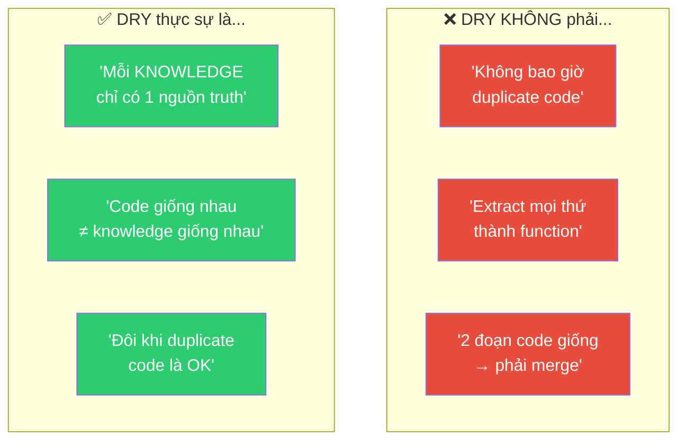
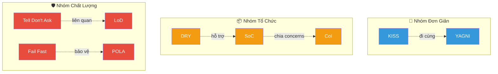

# 📐 Nguyên Tắc Thiết Kế Phần Mềm Bổ Sung — Phân Tích Chuyên Sâu

> Ngoài SOLID, đây là những nguyên tắc thiết kế **thiết yếu** mà mọi software engineer phải nắm vững. Chúng bổ trợ cho SOLID và OOP, tạo nên "bộ công cụ tư duy" hoàn chỉnh.

---

## 📋 Mục Lục

- [1. DRY — Don't Repeat Yourself](#1-dry--dont-repeat-yourself)
- [2. KISS — Keep It Simple, Stupid](#2-kiss--keep-it-simple-stupid)
- [3. YAGNI — You Aren't Gonna Need It](#3-yagni--you-arent-gonna-need-it)
- [4. Law of Demeter — Nguyên Tắc Ít Biết](#4-law-of-demeter--nguyên-tắc-ít-biết)
- [5. Separation of Concerns — Phân Tách Mối Quan Tâm](#5-separation-of-concerns--phân-tách-mối-quan-tâm)
- [6. Composition over Inheritance](#6-composition-over-inheritance)
- [7. Fail Fast — Thất Bại Sớm](#7-fail-fast--thất-bại-sớm)
- [8. Tell, Don't Ask](#8-tell-dont-ask)
- [9. Principle of Least Astonishment](#9-principle-of-least-astonishment)
- [10. Ma Trận Tổng Hợp](#10-ma-trận-tổng-hợp)

---

## 1. DRY — Don't Repeat Yourself

### 1.1 Định Nghĩa Chính Xác

> **"Every piece of knowledge must have a single, unambiguous, authoritative representation within a system."**
> — Andrew Hunt & David Thomas, *The Pragmatic Programmer* (1999)

**DRY** không chỉ là "không copy-paste code". Nó nói về **knowledge** (kiến thức/logic) — mỗi quy tắc business, mỗi thuật toán, mỗi schema chỉ nên được biểu diễn **MỘT NƠI DUY NHẤT**.

### 1.2 Hiểu Nhầm Phổ Biến



### 1.3 Ví Dụ Minh Họa

#### ❌ Vi phạm DRY — Logic tính giá nằm ở nhiều nơi

```java
// ❌ BAD: Cùng 1 business rule (giảm giá 10% cho VIP) nằm ở 3 chỗ
// Khi rule thay đổi → phải sửa 3 chỗ → dễ quên → bug!

public class CartService {
    public Money calculateTotal(Cart cart, Customer customer) {
        Money total = cart.getSubtotal();
        if (customer.isVip()) {
            total = total.multiply(0.9);  // ← 10% discount
        }
        return total;
    }
}

public class InvoiceService {
    public Invoice generateInvoice(Order order) {
        Money amount = order.getTotal();
        if (order.getCustomer().isVip()) {
            amount = amount.multiply(0.9);  // ← Duplicate logic!
        }
        return new Invoice(amount);
    }
}

public class ReportService {
    public Money calculateRevenue(List<Order> orders) {
        Money total = Money.ZERO;
        for (Order order : orders) {
            Money amount = order.getTotal();
            if (order.getCustomer().isVip()) {
                amount = amount.multiply(0.9);  // ← Duplicate lần 3!
            }
            total = total.add(amount);
        }
        return total;
    }
}
```

#### ✅ Áp dụng DRY — Single source of truth

```java
// ✅ GOOD: Business rule nằm DUY NHẤT ở 1 nơi

public class PricingPolicy {
    // Single source of truth cho mọi logic tính giá
    public Money applyDiscount(Money originalPrice, Customer customer) {
        if (customer.isVip()) {
            return originalPrice.multiply(0.9);  // Chỉ 1 nơi!
        }
        if (customer.getOrderCount() > 50) {
            return originalPrice.multiply(0.95); // Thêm rule mới? Sửa 1 nơi
        }
        return originalPrice;
    }
}

// Mọi nơi đều gọi PricingPolicy
public class CartService {
    private final PricingPolicy pricingPolicy;
    
    public Money calculateTotal(Cart cart, Customer customer) {
        return pricingPolicy.applyDiscount(cart.getSubtotal(), customer);
    }
}

public class InvoiceService {
    private final PricingPolicy pricingPolicy;
    
    public Invoice generateInvoice(Order order) {
        Money amount = pricingPolicy.applyDiscount(
            order.getTotal(), order.getCustomer()
        );
        return new Invoice(amount);
    }
}
```

#### ⚠️ Khi nào DUPLICATE code lại OK?

```java
// ⚠️ 2 đoạn code TRÔNG giống nhau nhưng KHÔNG phải cùng knowledge
// Chúng thay đổi vì LÝ DO KHÁC NHAU → KHÔNG nên merge

// Validation cho User input (thay đổi theo UX requirement)
public class UserInputValidator {
    public boolean isValidName(String name) {
        return name != null && name.length() >= 2 && name.length() <= 50;
    }
}

// Validation cho Database field (thay đổi theo DB schema)
public class DatabaseFieldValidator {
    public boolean isValidName(String name) {
        return name != null && name.length() >= 2 && name.length() <= 50;
    }
}

// Dù code GIỐNG NHAU 100%, chúng phục vụ 2 MỤC ĐÍCH KHÁC NHAU
// và sẽ THAY ĐỔI VÌ LÝ DO KHÁC NHAU
// → Giữ duplicate là OK! (Gọi là "incidental duplication")
```

### 1.4 Liên Kết

| Liên kết | Mô tả |
|----------|-------|
| **SRP** | DRY tự nhiên dẫn đến SRP: mỗi knowledge = 1 responsibility |
| **Đối lập WET** | "Write Everything Twice" / "We Enjoy Typing" — anti-pattern |

---

## 2. KISS — Keep It Simple, Stupid

### 2.1 Định Nghĩa

> **"Most systems work best if they are kept simple rather than made complicated."**
> — Kelly Johnson, Lockheed Martin (1960s)

**KISS** = Ưu tiên giải pháp **đơn giản nhất** mà vẫn **đúng** và **đủ**. Phức tạp hóa không cần thiết là kẻ thù số 1 của code maintainable.

### 2.2 Ví Dụ Minh Họa

#### ❌ Over-engineered — Vi phạm KISS

```java
// ❌ BAD: Chỉ cần kiểm tra user có quyền admin không
// nhưng tạo ra hệ thống phức tạp quá mức

public interface PermissionStrategy {
    boolean hasPermission(User user, Action action);
}

public class RoleBasedPermissionStrategy implements PermissionStrategy {
    private final Map<Role, Set<Action>> rolePermissions;
    
    @Override
    public boolean hasPermission(User user, Action action) {
        return rolePermissions
            .getOrDefault(user.getRole(), Collections.emptySet())
            .contains(action);
    }
}

public class PermissionChainBuilder {
    private final List<PermissionStrategy> strategies;
    
    public PermissionChainBuilder addStrategy(PermissionStrategy s) {
        strategies.add(s);
        return this;
    }
    
    public PermissionChain build() {
        return new PermissionChain(strategies);
    }
}

public class PermissionChain {
    public boolean check(User user, Action action) {
        return strategies.stream()
            .anyMatch(s -> s.hasPermission(user, action));
    }
}

// Chỉ để kiểm tra: user.isAdmin()? → 4 classes, 50+ lines 🤦
```

#### ✅ Giữ đơn giản — KISS

```java
// ✅ GOOD: Đơn giản, rõ ràng, đúng mục đích
// Khi nào CẦN phức tạp hơn → refactor lúc đó (YAGNI)

public class AdminGuard {
    public static boolean isAdmin(User user) {
        return user.getRole() == Role.ADMIN;
    }
}

// Sử dụng:
if (AdminGuard.isAdmin(currentUser)) {
    // Cho phép thao tác admin
}

// Khi yêu cầu MỞ RỘNG (ví dụ: thêm MODERATOR role)
// → LÚC ĐÓ mới refactor sang PermissionStrategy
```

### 2.3 Dấu Hiệu Vi Phạm KISS

| Dấu hiệu | Ví dụ |
|-----------|-------|
| 🚩 **Over-abstraction** | 5 layers interface cho feature đơn giản |
| 🚩 **Premature optimization** | Cache khi chưa đo performance |
| 🚩 **Over-design** | Strategy pattern cho 2 case cố định |
| 🚩 **Framework overkill** | Dùng Kafka cho 100 msg/ngày |
| 🚩 **Clever code** | One-liner streams phức tạp thay vì for loop rõ ràng |

---

## 3. YAGNI — You Aren't Gonna Need It

### 3.1 Định Nghĩa

> **"Always implement things when you actually need them, never when you just foresee that you need them."**
> — Ron Jeffries, co-founder of XP (Extreme Programming)

**YAGNI** = Không implement feature/abstraction cho đến khi **THỰC SỰ CẦN**. 80% "requirements tương lai" sẽ **không bao giờ xảy ra** hoặc sẽ **thay đổi hoàn toàn**.

### 3.2 Ví Dụ Minh Họa

#### ❌ Vi phạm YAGNI — Code cho tương lai không bao giờ đến

```java
// ❌ BAD: Hiện tại chỉ có 1 database (PostgreSQL)
// Nhưng dev nghĩ "biết đâu sau này đổi sang MongoDB"
// → Tạo abstraction layer phức tạp NGAY TỪ ĐẦU

public interface DatabaseAdapter {
    void save(String collection, Object document);
    Object find(String collection, String id);
    void delete(String collection, String id);
    List<Object> query(String collection, Map<String, Object> filters);
}

public class PostgresAdapter implements DatabaseAdapter {
    // 200 dòng code wrapping PostgreSQL
}

public class MongoAdapter implements DatabaseAdapter {
    // 200 dòng code chưa bao giờ dùng, chưa bao giờ test
    // Khi thực sự cần → requirement đã thay đổi hoàn toàn
}

public interface RepositoryFactory {
    DatabaseAdapter createAdapter(DatabaseType type);
}

// → 400+ dòng code, 3 classes, chỉ để "phòng khi"
// → Maintenance cost cao, test phức tạp, chưa bao giờ dùng MongoAdapter
```

#### ✅ Áp dụng YAGNI — Chỉ code cái cần NGAY BÂY GIỜ

```java
// ✅ GOOD: Dùng PostgreSQL trực tiếp
// Repository interface + implementation đơn giản

public interface UserRepository {
    User findById(String id);
    void save(User user);
    void delete(String id);
}

public class JpaUserRepository implements UserRepository {
    private final EntityManager em;
    
    @Override
    public User findById(String id) {
        return em.find(User.class, id);
    }
    
    @Override
    public void save(User user) {
        em.persist(user);
    }
    
    @Override
    public void delete(String id) {
        User user = findById(id);
        if (user != null) em.remove(user);
    }
}

// ✅ Interface UserRepository đã đủ abstract
// ✅ Khi CẦN đổi DB → tạo MongoUserRepository lúc đó
// ✅ Không cần DatabaseAdapter generic phức tạp
```

### 3.3 YAGNI vs Good Architecture

```
┌────────────────────────────────────────────────────┐
│  YAGNI KHÔNG có nghĩa là:                         │
│  ❌ Không cần interface                            │
│  ❌ Không cần abstraction                          │
│  ❌ Viết spaghetti code                           │
│  ❌ Không cần test                                │
│                                                    │
│  YAGNI CÓ nghĩa là:                              │
│  ✅ Interface/abstraction cho nhu cầu HIỆN TẠI    │
│  ✅ Không tạo adapter cho DB bạn chưa dùng        │
│  ✅ Không tạo plugin system khi chỉ có 1 plugin   │
│  ✅ Refactor khi requirement THỰC SỰ xuất hiện    │
└────────────────────────────────────────────────────┘
```

### 3.4 Liên Kết

| Liên kết | Mô tả |
|----------|-------|
| **KISS** | YAGNI + KISS thường đi cùng nhau |
| **ISP** | Không tạo interface quá rộng "cho tương lai" |
| **OCP** | OCP cho phép mở rộng SAU → không cần code trước |

---

## 4. Law of Demeter — Nguyên Tắc Ít Biết

### 4.1 Định Nghĩa

> **"Only talk to your immediate friends. Don't talk to strangers."**
> — Karl Lieberherr, Northeastern University (1987)

Hay còn gọi là **Principle of Least Knowledge** — Một method chỉ nên gọi method của:
1. Chính object đó (`this`)
2. Tham số được truyền vào method
3. Object mà method tạo ra
4. Field trực tiếp của object đó

### 4.2 Ví Dụ Minh Họa

#### ❌ Vi phạm — "Train wreck" / Method chaining

```java
// ❌ BAD: Method chaining qua nhiều object → high coupling
// Order phải BIẾT cấu trúc nội bộ của Customer → Address → City

public class OrderShippingService {
    public String getShippingCity(Order order) {
        // ❌ Train wreck: order → customer → address → city
        // Nếu thay đổi cấu trúc Address → tất cả caller bị ảnh hưởng
        return order.getCustomer().getAddress().getCity().getName();
    }
    
    public double calculateShippingFee(Order order) {
        // ❌ Phải biết cấu trúc sâu bên trong
        String zipCode = order.getCustomer()
                              .getAddress()
                              .getZipCode();    // ← 3 cấp deep!
        
        double distance = order.getCustomer()
                               .getAddress()
                               .getCity()
                               .getDistanceFromWarehouse(); // ← 4 cấp!
        
        return distance * 0.5 + getBaseRate(zipCode);
    }
}
```

#### ✅ Tuân thủ Law of Demeter

```java
// ✅ GOOD: Mỗi object expose thông tin cần thiết
// KHÔNG yêu cầu caller đào sâu vào cấu trúc nội bộ

public class Order {
    private Customer customer;
    
    // ✅ Order expose trực tiếp thông tin shipping cần
    public String getShippingCity() {
        return customer.getShippingCity();  // Delegate 1 cấp
    }
    
    public String getShippingZipCode() {
        return customer.getShippingZipCode();
    }
}

public class Customer {
    private Address shippingAddress;
    
    // ✅ Customer delegate xuống Address
    public String getShippingCity() {
        return shippingAddress.getCityName();
    }
    
    public String getShippingZipCode() {
        return shippingAddress.getZipCode();
    }
}

public class Address {
    private City city;
    private String zipCode;
    
    public String getCityName() {
        return city.getName();
    }
    
    public String getZipCode() {
        return zipCode;
    }
}

// ✅ Service chỉ nói chuyện với "bạn trực tiếp"
public class OrderShippingService {
    public String getShippingCity(Order order) {
        return order.getShippingCity();  // ✅ Chỉ 1 cấp!
    }
}
```

### 4.3 Ngoại Lệ Hợp Lý

```java
// ⚠️ Fluent API / Builder pattern KHÔNG vi phạm LoD
// Vì method chaining trả về chính đối tượng đó (this)
StringBuilder sb = new StringBuilder()
    .append("Hello")
    .append(" ")
    .append("World");  // ✅ OK — cùng 1 object

// ⚠️ Stream API KHÔNG vi phạm LoD
// Vì mỗi operation trả về Stream mới, không phải object khác type
List<String> names = employees.stream()
    .filter(e -> e.isActive())
    .map(e -> e.getName())
    .collect(Collectors.toList());  // ✅ OK — cùng Stream pipeline
```

### 4.4 Liên Kết

| Liên kết | Mô tả |
|----------|-------|
| **DIP** | LoD giảm coupling → hỗ trợ Dependency Inversion |
| **Encapsulation** | LoD là hệ quả tự nhiên của encapsulation tốt |
| **Facade** | Facade pattern áp dụng LoD ở mức hệ thống |

---

## 5. Separation of Concerns — Phân Tách Mối Quan Tâm

### 5.1 Định Nghĩa

> **"Let each module or layer address a distinct concern."**
> — Edsger W. Dijkstra (1974)

**SoC** = Phân chia hệ thống thành các phần **không chồng chéo**, mỗi phần xử lý MỘT **concern** (mối quan tâm) riêng biệt.

### 5.2 Ví Dụ Minh Họa

#### ❌ Vi phạm SoC — "God Method"

```java
// ❌ BAD: 1 method xử lý TẤT CẢ concerns
public class UserController {
    
    public Response createUser(Request request) {
        // Concern 1: Parsing input
        String name = request.getParam("name");
        String email = request.getParam("email");
        
        // Concern 2: Validation
        if (name == null || name.isEmpty()) {
            return Response.error("Name is required");
        }
        if (!email.matches("^[\\w.-]+@[\\w.-]+\\.[a-zA-Z]{2,}$")) {
            return Response.error("Invalid email");
        }
        
        // Concern 3: Business logic
        String hashedPassword = BCrypt.hashpw(
            request.getParam("password"), BCrypt.gensalt()
        );
        
        // Concern 4: Database access
        Connection conn = DriverManager.getConnection(DB_URL);
        PreparedStatement stmt = conn.prepareStatement(
            "INSERT INTO users (name, email, password) VALUES (?, ?, ?)"
        );
        stmt.setString(1, name);
        stmt.setString(2, email);
        stmt.setString(3, hashedPassword);
        stmt.executeUpdate();
        
        // Concern 5: Notification
        JavaMailSender mailSender = new JavaMailSender();
        mailSender.send(email, "Welcome!", "Welcome to our platform!");
        
        // Concern 6: Response formatting
        return Response.json(Map.of("status", "created", "email", email));
    }
}
```

#### ✅ Áp dụng SoC — Mỗi class/layer 1 concern

```java
// ✅ GOOD: Mỗi layer xử lý 1 concern riêng biệt

// Concern 1: HTTP/Presentation
@RestController
public class UserController {
    private final UserService userService;
    
    @PostMapping("/users")
    public ResponseEntity<UserResponse> createUser(@Valid @RequestBody CreateUserRequest request) {
        User user = userService.createUser(request.toCommand());
        return ResponseEntity.status(201).body(UserResponse.from(user));
    }
}

// Concern 2: Validation (declarative)
public class CreateUserRequest {
    @NotBlank(message = "Name is required")
    private String name;
    
    @Email(message = "Invalid email")
    private String email;
    
    @Size(min = 8, message = "Password must be at least 8 chars")
    private String password;
}

// Concern 3: Business Logic
@Service
public class UserService {
    private final UserRepository userRepository;
    private final PasswordEncoder passwordEncoder;
    private final EventPublisher eventPublisher;
    
    public User createUser(CreateUserCommand command) {
        if (userRepository.existsByEmail(command.getEmail())) {
            throw new DuplicateEmailException(command.getEmail());
        }
        
        User user = new User(
            command.getName(),
            command.getEmail(),
            passwordEncoder.encode(command.getPassword())
        );
        
        userRepository.save(user);
        eventPublisher.publish(new UserCreatedEvent(user));  // Async notification
        return user;
    }
}

// Concern 4: Data Access
@Repository
public class JpaUserRepository implements UserRepository {
    @Override
    public void save(User user) { /* JPA logic */ }
    
    @Override
    public boolean existsByEmail(String email) { /* JPA query */ }
}

// Concern 5: Notification (triggered by event — completely separated)
@EventListener
public class WelcomeEmailHandler {
    private final EmailService emailService;
    
    public void handle(UserCreatedEvent event) {
        emailService.sendWelcome(event.getUserEmail());
    }
}
```

### 5.3 SoC Ở Các Mức Độ

```
┌──────────────────────────────────────────────────┐
│  Mức hệ thống:    Frontend / Backend / Database  │
├──────────────────────────────────────────────────┤
│  Mức ứng dụng:    Controller / Service / Repo    │
├──────────────────────────────────────────────────┤
│  Mức module:      Auth / Payment / Notification  │
├──────────────────────────────────────────────────┤
│  Mức class:       Validation / Business / Persist│
├──────────────────────────────────────────────────┤
│  Mức method:      Parse → Validate → Process     │
└──────────────────────────────────────────────────┘
```

---

## 6. Composition over Inheritance

> Đã phân tích chi tiết trong [02-object-relationships.md](./02-object-relationships.md#6-inheritance-vs-composition).

### 6.1 Tóm Tắt Nhanh

| Khi nào Inheritance | Khi nào Composition |
|---------------------|---------------------|
| IS-A thực sự + LSP OK | HAS-A / CAN-DO |
| Template Method pattern | Strategy pattern |
| Base class ổn định | Behavior thay đổi runtime |
| Hierarchy ≤ 3 cấp | Kết hợp nhiều behavior |

### 6.2 Ví Dụ Bổ Sung — Logging

```java
// ❌ Inheritance: Mọi class cần log phải extends BaseLoggable
public class BaseLoggable {
    protected void log(String message) {
        System.out.println("[LOG] " + message);
    }
}

// UserService đã extends BaseService → không thể extends BaseLoggable!
// Java single inheritance limitation!
public class UserService extends BaseService { /* extends BaseLoggable? */ }

// ✅ Composition: Inject logger — không cần inheritance
public class UserService {
    private final Logger logger;  // Composition: HAS-A Logger
    
    public UserService(Logger logger) {
        this.logger = logger;
    }
    
    public void createUser(User user) {
        logger.info("Creating user: " + user.getEmail());
        // ... business logic
    }
}
```

---

## 7. Fail Fast — Thất Bại Sớm

### 7.1 Định Nghĩa

> **"If a system is going to fail, it's better to fail immediately and visibly."**
> — Jim Shore (2004)

**Fail Fast** = Phát hiện lỗi **CÀ SỚM CÀNG TỐT** và **dừng ngay lập tức** thay vì tiếp tục chạy với trạng thái sai → tạo ra bug khó debug.

### 7.2 Ví Dụ Minh Họa

#### ❌ Fail Slow — Lỗi lan tỏa

```java
// ❌ BAD: Không validate đầu vào → lỗi xảy ra ở nơi xa
public class OrderProcessor {
    public void processOrder(Order order) {
        // Không check null → NullPointerException ở đâu đó sâu bên trong
        // Không check empty items → logic tính tiền sai
        // Không check negative price → database lưu giá trị vô nghĩa
        
        double total = 0;
        for (OrderItem item : order.getItems()) { // NPE nếu items null
            total += item.getPrice() * item.getQuantity();
            // Nếu price = -5, quantity = -3 → total = 15 → SAI!
        }
        
        paymentService.charge(order.getCustomer(), total);
        // Charge amount âm? Charge 0? Charge cho null customer?
        // Lỗi xảy ra ở PaymentService → khó trace ngược về nguyên nhân gốc
    }
}
```

#### ✅ Fail Fast — Phát hiện và dừng sớm

```java
// ✅ GOOD: Validate ngay đầu vào → lỗi rõ ràng, dễ debug
public class OrderProcessor {
    public void processOrder(Order order) {
        // 🛡️ Fail fast: kiểm tra preconditions
        Objects.requireNonNull(order, "Order must not be null");
        Objects.requireNonNull(order.getCustomer(), "Customer must not be null");
        
        if (order.getItems() == null || order.getItems().isEmpty()) {
            throw new IllegalArgumentException("Order must have at least 1 item");
        }
        
        for (OrderItem item : order.getItems()) {
            if (item.getPrice().isNegative()) {
                throw new IllegalArgumentException(
                    "Item price must not be negative: " + item.getName()
                );
            }
            if (item.getQuantity() <= 0) {
                throw new IllegalArgumentException(
                    "Item quantity must be positive: " + item.getName()
                );
            }
        }
        
        // ✅ Đến đây: dữ liệu đã được validate → xử lý an toàn
        Money total = calculateTotal(order);
        paymentService.charge(order.getCustomer(), total);
    }
}
```

### 7.3 Fail Fast Patterns

| Pattern | Ví dụ |
|---------|-------|
| **Constructor validation** | `if (age < 0) throw new IllegalArgumentException()` |
| **Guard clauses** | Check null/empty ở đầu method |
| **Assertions** | `assert invariant : "Invariant violated"` |
| **Type system** | Dùng `NonNull`, `Positive`, typed ID thay vì String/int |
| **Immutable objects** | Validate tại creation, an toàn suốt lifecycle |

---

## 8. Tell, Don't Ask

### 8.1 Định Nghĩa

> **"Tell objects what to do, don't ask them for data and do the work yourself."**
> — Martin Fowler & Kent Beck

**Tell, Don't Ask** = Thay vì **hỏi** object về state rồi **quyết định** bên ngoài, hãy **bảo** object tự xử lý vì nó hiểu state của mình nhất.

### 8.2 Ví Dụ Minh Họa

```java
// ❌ ASK: Hỏi account về state, xử lý bên ngoài
public class TransferService {
    public void transfer(Account from, Account to, Money amount) {
        // ❌ Hỏi balance → quyết định bên ngoài
        if (from.getBalance().isGreaterThanOrEqual(amount)) {
            from.setBalance(from.getBalance().subtract(amount));
            to.setBalance(to.getBalance().add(amount));
        } else {
            throw new InsufficientFundsException();
        }
    }
}

// ✅ TELL: Bảo account tự xử lý
public class TransferService {
    public void transfer(Account from, Account to, Money amount) {
        from.withdraw(amount);  // ✅ Tell: "Rút tiền đi!"
        to.deposit(amount);     // ✅ Tell: "Nhận tiền đi!"
        // Account tự biết cách validate, update balance, log transaction
    }
}

public class Account {
    private Money balance;
    
    public void withdraw(Money amount) {
        // ✅ Object tự xử lý vì nó hiểu state tốt nhất
        if (balance.isLessThan(amount)) {
            throw new InsufficientFundsException(balance, amount);
        }
        balance = balance.subtract(amount);
        auditLog.record(TransactionType.WITHDRAWAL, amount);
    }
    
    public void deposit(Money amount) {
        if (amount.isNegativeOrZero()) {
            throw new IllegalArgumentException("Deposit amount must be positive");
        }
        balance = balance.add(amount);
        auditLog.record(TransactionType.DEPOSIT, amount);
    }
}
```

### 8.3 Liên Kết

- **Encapsulation**: Tell Don't Ask là cách suy nghĩ tự nhiên khi encapsulation tốt
- **SRP**: Object xử lý logic liên quan đến state của nó → đúng trách nhiệm

---

## 9. Principle of Least Astonishment

### 9.1 Định Nghĩa

> **"The system should behave in a way that most users will expect it to behave."**

**POLA** (hay **Principle of Least Surprise**) = Code/API nên hoạt động **đúng như người đọc kỳ vọng**. Nếu một method tên `getUser()` lại **xóa** user → vi phạm POLA.

### 9.2 Ví Dụ Minh Họa

```java
// ❌ Vi phạm POLA — Side effects bất ngờ
public class UserRepository {
    // Tên "find" nhưng lại CREATE user nếu không tìm thấy!
    public User findByEmail(String email) {
        User user = database.query("SELECT * FROM users WHERE email = ?", email);
        if (user == null) {
            user = new User(email);
            database.insert(user);  // ❌ Bất ngờ! "find" mà lại tạo mới
        }
        return user;
    }
}

// ✅ Tuân thủ POLA — Tên nói rõ behavior
public class UserRepository {
    // "find" chỉ tìm, trả null nếu không có
    public Optional<User> findByEmail(String email) {
        return Optional.ofNullable(
            database.query("SELECT * FROM users WHERE email = ?", email)
        );
    }
    
    // Method riêng cho find-or-create — tên nói rõ
    public User findOrCreateByEmail(String email) {
        return findByEmail(email)
            .orElseGet(() -> {
                User newUser = new User(email);
                database.insert(newUser);
                return newUser;
            });
    }
}
```

### 9.3 Checklist POLA

| ✅ Tuân thủ | ❌ Vi phạm |
|------------|-----------|
| `getX()` chỉ trả về giá trị | `getX()` có side effect |
| `isValid()` trả về boolean | `isValid()` throw exception |
| `save()` lưu dữ liệu | `save()` gửi email |
| `delete()` xóa 1 record | `delete()` xóa cascade không thông báo |
| `toString()` trả về String | `toString()` query database |

---

## 10. Ma Trận Tổng Hợp

| Nguyên tắc | Một câu | Khi vi phạm sẽ thấy | Liên kết SOLID |
|:---:|---|---|---|
| **DRY** | Mỗi knowledge chỉ 1 nơi | Sửa 1 logic phải sửa nhiều chỗ | SRP |
| **KISS** | Đơn giản nhất mà đúng | Code phức tạp hơn vấn đề | SRP |
| **YAGNI** | Chỉ code khi cần | Nhiều code chưa bao giờ dùng | ISP |
| **LoD** | Chỉ nói chuyện với bạn trực tiếp | `a.b().c().d()` chains | DIP |
| **SoC** | Mỗi module 1 concern | God class / God method | SRP |
| **CoI** | Ưu tiên HAS-A hơn IS-A | Deep inheritance hierarchy | LSP, DIP |
| **Fail Fast** | Phát hiện lỗi sớm nhất | Bug khó debug, lỗi ở nơi xa | — |
| **Tell Don't Ask** | Bảo object xử lý | Getter-heavy, anemic model | SRP, Encapsulation |
| **POLA** | Không gây bất ngờ | `findUser()` mà tạo user mới | — |



---

> **Tiếp theo**: [OOP Trong Thực Tế →](./04-oop-in-practice.md)
