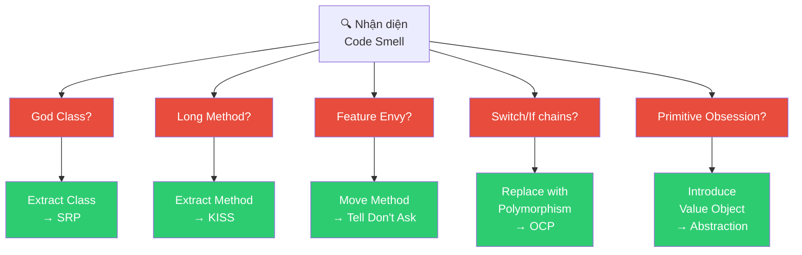
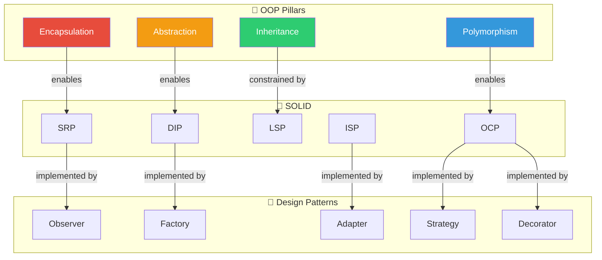
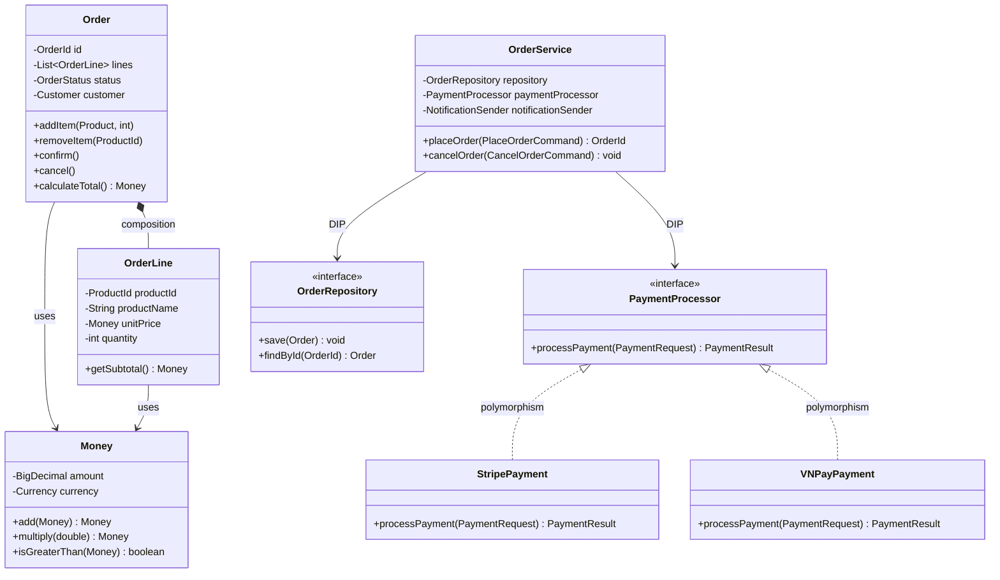

# 🔧 OOP Trong Thực Tế — Anti-Patterns, Refactoring & Tổng Hợp

> Kiến thức lý thuyết chỉ có giá trị khi áp dụng được vào thực tế. Chương này kết nối OOP, SOLID, và Design Patterns thành một bức tranh toàn vẹn thông qua các tình huống thực chiến.

---

## 📋 Mục Lục

- [1. Anti-Patterns Phổ Biến Trong OOP](#1-anti-patterns-phổ-biến-trong-oop)
- [2. Refactoring Patterns — Từ Bad Code Đến Clean Code](#2-refactoring-patterns--từ-bad-code-đến-clean-code)
- [3. Kết Hợp OOP + SOLID + Design Patterns](#3-kết-hợp-oop--solid--design-patterns)
- [4. OOP Trong Các Kiến Trúc Hiện Đại](#4-oop-trong-các-kiến-trúc-hiện-đại)
- [5. Case Study Tổng Hợp](#5-case-study-tổng-hợp)
- [6. Checklist Review Code OOP](#6-checklist-review-code-oop)

---

## 1. Anti-Patterns Phổ Biến Trong OOP

### 1.1 Bảng Tổng Quan Anti-Patterns

| # | Anti-Pattern | Mô tả | Vi phạm | Khắc phục |
|---|-------------|-------|---------|-----------|
| 1 | **God Class** | Class quá lớn, làm quá nhiều việc | SRP, SoC | Tách class theo responsibility |
| 2 | **Anemic Domain Model** | Class chỉ có getter/setter, logic nằm ở service | Encapsulation, Tell Don't Ask | Đưa logic vào domain object |
| 3 | **Feature Envy** | Method sử dụng data của class khác nhiều hơn class mình | Encapsulation, LoD | Di chuyển method sang class phù hợp |
| 4 | **Primitive Obsession** | Dùng primitive types thay vì tạo Value Object | Abstraction | Tạo value objects (Email, Money, Age) |
| 5 | **Shotgun Surgery** | 1 thay đổi → sửa nhiều class | DRY, SRP | Tập trung logic liên quan vào 1 nơi |
| 6 | **Inappropriate Intimacy** | 2 class biết quá nhiều nội bộ của nhau | Encapsulation, LoD | Giảm coupling, dùng interface |
| 7 | **Refused Bequest** | Subclass không dùng hết method của parent | LSP | Xem lại hierarchy, dùng composition |
| 8 | **Speculative Generality** | Code generic "cho tương lai" | YAGNI | Xóa code chưa dùng, refactor khi cần |

### 1.2 Phân Tích Chi Tiết Từng Anti-Pattern

#### Anti-Pattern 1: God Class

```java
// ❌ GOD CLASS: UserManager làm MỌI THỨ liên quan đến User
// 500+ dòng, 30+ methods, 15+ fields
public class UserManager {
    // Authentication
    private Map<String, String> sessions;
    public boolean login(String email, String password) { /* ... */ }
    public void logout(String sessionId) { /* ... */ }
    public String generateToken(User user) { /* ... */ }
    
    // Profile management
    public void updateProfile(String userId, Map<String, String> data) { /* ... */ }
    public void uploadAvatar(String userId, byte[] image) { /* ... */ }
    
    // Notification
    public void sendWelcomeEmail(User user) { /* ... */ }
    public void sendPasswordResetEmail(String email) { /* ... */ }
    
    // Analytics
    public Map<String, Integer> getUserStats() { /* ... */ }
    public List<User> getActiveUsers(Duration period) { /* ... */ }
    
    // Payment
    public void chargeUser(String userId, Money amount) { /* ... */ }
    public List<Invoice> getUserInvoices(String userId) { /* ... */ }
    
    // Admin
    public void banUser(String userId) { /* ... */ }
    public void promoteToAdmin(String userId) { /* ... */ }
    
    // ... 20+ more methods
}
```

```java
// ✅ REFACTORED: Tách thành nhiều class, mỗi class 1 trách nhiệm

public class AuthenticationService {
    public AuthResult login(Credentials credentials) { /* ... */ }
    public void logout(SessionId sessionId) { /* ... */ }
    public Token generateToken(User user) { /* ... */ }
}

public class UserProfileService {
    public void updateProfile(UserId userId, ProfileUpdateCommand command) { /* ... */ }
    public void uploadAvatar(UserId userId, Image image) { /* ... */ }
}

public class UserNotificationService {
    public void sendWelcomeEmail(User user) { /* ... */ }
    public void sendPasswordResetEmail(Email email) { /* ... */ }
}

public class UserAnalyticsService {
    public UserStats getStats() { /* ... */ }
    public List<User> getActiveUsers(Duration period) { /* ... */ }
}

public class UserBillingService {
    public void charge(UserId userId, Money amount) { /* ... */ }
    public List<Invoice> getInvoices(UserId userId) { /* ... */ }
}

public class UserAdminService {
    public void ban(UserId userId) { /* ... */ }
    public void promoteToAdmin(UserId userId) { /* ... */ }
}
```

#### Anti-Pattern 2: Anemic Domain Model

```java
// ❌ ANEMIC: Domain object chỉ là data container
public class Order {
    private Long id;
    private OrderStatus status;
    private List<OrderItem> items;
    private Money totalAmount;
    
    // Chỉ có getter/setter — KHÔNG CÓ BEHAVIOR
    public Long getId() { return id; }
    public void setId(Long id) { this.id = id; }
    public OrderStatus getStatus() { return status; }
    public void setStatus(OrderStatus status) { this.status = status; }
    public List<OrderItem> getItems() { return items; }
    public void setItems(List<OrderItem> items) { this.items = items; }
    public Money getTotalAmount() { return totalAmount; }
    public void setTotalAmount(Money amount) { this.totalAmount = amount; }
}

// Logic nằm ở Service — vi phạm Encapsulation
public class OrderService {
    public void addItem(Order order, Product product, int qty) {
        OrderItem item = new OrderItem(product, qty);
        order.getItems().add(item);  // ❌ Truy cập trực tiếp internal list
        
        // ❌ Logic tính total nằm ở service thay vì Order
        Money newTotal = Money.ZERO;
        for (OrderItem i : order.getItems()) {
            newTotal = newTotal.add(i.getPrice().multiply(i.getQuantity()));
        }
        order.setTotalAmount(newTotal);
    }
    
    public void cancel(Order order) {
        // ❌ Logic validation nằm ở service
        if (order.getStatus() == OrderStatus.SHIPPED) {
            throw new IllegalStateException("Cannot cancel shipped order");
        }
        order.setStatus(OrderStatus.CANCELLED);
    }
}
```

```java
// ✅ RICH DOMAIN MODEL: Logic nằm trong domain object

public class Order {
    private final OrderId id;
    private OrderStatus status;
    private final List<OrderLine> lines;  // ◆ Composition
    
    public Order(OrderId id) {
        this.id = id;
        this.status = OrderStatus.CREATED;
        this.lines = new ArrayList<>();
    }
    
    // ✅ BEHAVIOR: Order tự biết cách thêm item
    public void addItem(Product product, int quantity) {
        if (status != OrderStatus.CREATED) {
            throw new OrderNotModifiableException(id, status);
        }
        if (quantity <= 0) {
            throw new IllegalArgumentException("Quantity must be positive");
        }
        
        // Kiểm tra duplicate → tăng quantity
        lines.stream()
            .filter(line -> line.getProductId().equals(product.getId()))
            .findFirst()
            .ifPresentOrElse(
                line -> line.increaseQuantity(quantity),
                () -> lines.add(OrderLine.create(product, quantity))
            );
    }
    
    // ✅ BEHAVIOR: Order tự biết cách tính total
    public Money calculateTotal() {
        return lines.stream()
            .map(OrderLine::getSubtotal)
            .reduce(Money.ZERO, Money::add);
    }
    
    // ✅ BEHAVIOR: Order tự biết cách cancel + validation
    public void cancel() {
        if (status == OrderStatus.SHIPPED) {
            throw new OrderAlreadyShippedException(id);
        }
        if (status == OrderStatus.CANCELLED) {
            throw new OrderAlreadyCancelledException(id);
        }
        this.status = OrderStatus.CANCELLED;
    }
    
    // ✅ BEHAVIOR: State transition có validation
    public void confirm() {
        if (lines.isEmpty()) {
            throw new EmptyOrderException(id);
        }
        if (status != OrderStatus.CREATED) {
            throw new InvalidOrderTransitionException(id, status, OrderStatus.CONFIRMED);
        }
        this.status = OrderStatus.CONFIRMED;
    }
    
    // ✅ Read-only access
    public List<OrderLine> getLines() {
        return Collections.unmodifiableList(lines);
    }
}
```

#### Anti-Pattern 4: Primitive Obsession

```java
// ❌ PRIMITIVE OBSESSION: Dùng String/int cho mọi thứ
public class User {
    private String id;         // Có thể null? Empty? Bất kỳ format?
    private String email;      // Có validate format? Có normalize?
    private String phone;      // Có country code? Format nào?
    private int age;           // Âm? 999?
    private double balance;    // Precision? Đơn vị tiền?
}

// Vấn đề: Dùng nhầm
userService.sendEmail(user.getPhone());  // ← Compiler KHÔNG BẮT LỖI!
userService.charge(user.getAge());       // ← Compiler KHÔNG BẮT LỖI!
```

```java
// ✅ VALUE OBJECTS: Type-safe, self-validating

public class UserId {
    private final String value;
    
    public UserId(String value) {
        if (value == null || !value.matches("^USR-[0-9]{8}$")) {
            throw new InvalidUserIdException(value);
        }
        this.value = value;
    }
    
    // equals(), hashCode() based on value
}

public class Email {
    private final String value;
    
    public Email(String value) {
        if (value == null || !value.matches("^[\\w.-]+@[\\w.-]+\\.[a-zA-Z]{2,}$")) {
            throw new InvalidEmailException(value);
        }
        this.value = value.toLowerCase().trim();  // Normalize
    }
    
    public String getDomain() {
        return value.substring(value.indexOf('@') + 1);
    }
}

public class Money {
    private final BigDecimal amount;
    private final Currency currency;
    
    public Money(BigDecimal amount, Currency currency) {
        Objects.requireNonNull(amount, "Amount required");
        Objects.requireNonNull(currency, "Currency required");
        this.amount = amount.setScale(2, RoundingMode.HALF_UP);
        this.currency = currency;
    }
    
    public Money add(Money other) {
        if (!this.currency.equals(other.currency)) {
            throw new CurrencyMismatchException(this.currency, other.currency);
        }
        return new Money(this.amount.add(other.amount), this.currency);
    }
    
    public boolean isNegative()     { return amount.signum() < 0; }
    public boolean isNegativeOrZero() { return amount.signum() <= 0; }
    
    public static final Money ZERO = new Money(BigDecimal.ZERO, Currency.VND);
}

public class Age {
    private final int value;
    
    public Age(int value) {
        if (value < 0 || value > 150) {
            throw new InvalidAgeException(value);
        }
        this.value = value;
    }
    
    public boolean isAdult()  { return value >= 18; }
    public boolean isSenior() { return value >= 65; }
}

// ✅ Type-safe User
public class User {
    private final UserId id;
    private final Email email;
    private final PhoneNumber phone;
    private final Age age;
    private Money balance;
}

// ✅ Compiler BẮT LỖI ngay:
// userService.sendEmail(user.getPhone());  // COMPILE ERROR: Email ≠ PhoneNumber
// userService.charge(user.getAge());       // COMPILE ERROR: Money ≠ Age
```

---

## 2. Refactoring Patterns — Từ Bad Code Đến Clean Code

### 2.1 Refactoring Roadmap



### 2.2 Refactoring: Replace Conditional with Polymorphism

```java
// ❌ BEFORE: Switch chain → vi phạm OCP
public class ShippingCalculator {
    public Money calculateFee(Order order) {
        switch (order.getShippingMethod()) {
            case "standard":
                return order.getWeight() > 5 
                    ? new Money(30000) 
                    : new Money(15000);
            case "express":
                return new Money(50000).add(
                    order.getWeight() > 2 
                        ? new Money(10000) 
                        : Money.ZERO
                );
            case "overnight":
                return new Money(100000);
            case "free":
                return order.getTotal().isGreaterThan(new Money(500000))
                    ? Money.ZERO
                    : new Money(25000);
            default:
                throw new UnknownShippingMethodException(order.getShippingMethod());
        }
        // ❌ Thêm "same_day" → sửa method này → OCP violation
    }
}
```

```java
// ✅ AFTER: Polymorphism → tuân thủ OCP

// Step 1: Tạo interface
public interface ShippingStrategy {
    Money calculateFee(Order order);
    ShippingType getType();
}

// Step 2: Implement cho từng loại
public class StandardShipping implements ShippingStrategy {
    @Override
    public Money calculateFee(Order order) {
        return order.getWeight() > 5 
            ? Money.of(30000) 
            : Money.of(15000);
    }
    
    @Override
    public ShippingType getType() { return ShippingType.STANDARD; }
}

public class ExpressShipping implements ShippingStrategy {
    @Override
    public Money calculateFee(Order order) {
        Money base = Money.of(50000);
        Money weightSurcharge = order.getWeight() > 2 
            ? Money.of(10000) 
            : Money.ZERO;
        return base.add(weightSurcharge);
    }
    
    @Override
    public ShippingType getType() { return ShippingType.EXPRESS; }
}

public class FreeShipping implements ShippingStrategy {
    private static final Money THRESHOLD = Money.of(500000);
    private static final Money FALLBACK_FEE = Money.of(25000);
    
    @Override
    public Money calculateFee(Order order) {
        return order.getTotal().isGreaterThan(THRESHOLD) 
            ? Money.ZERO 
            : FALLBACK_FEE;
    }
    
    @Override
    public ShippingType getType() { return ShippingType.FREE; }
}

// Step 3: Registry thay cho switch
public class ShippingCalculator {
    private final Map<ShippingType, ShippingStrategy> strategies;
    
    public ShippingCalculator(List<ShippingStrategy> strategyList) {
        this.strategies = strategyList.stream()
            .collect(Collectors.toMap(
                ShippingStrategy::getType, 
                Function.identity()
            ));
    }
    
    public Money calculateFee(Order order) {
        ShippingStrategy strategy = strategies.get(order.getShippingType());
        if (strategy == null) {
            throw new UnknownShippingTypeException(order.getShippingType());
        }
        return strategy.calculateFee(order);
    }
    
    // ✅ Thêm SameDayShipping? Chỉ cần implement ShippingStrategy mới
    // ✅ KHÔNG SỬA bất kỳ code hiện có nào → OCP
}
```

---

## 3. Kết Hợp OOP + SOLID + Design Patterns

### 3.1 Bản Đồ Kết Nối



### 3.2 Bảng Ánh Xạ Chi Tiết

| Vấn đề thực tế | OOP Pillar | SOLID Principle | Design Pattern | Nguyên tắc bổ sung |
|----------------|:---:|:---:|:---:|:---:|
| Tính giá khác nhau theo loại khách | Polymorphism | OCP | Strategy | — |
| Thông báo nhiều kênh (email, SMS, push) | Polymorphism | OCP, DIP | Observer | SoC |
| Kết nối nhiều loại database | Abstraction | DIP | Factory, Adapter | — |
| Thêm feature mà không sửa code | Polymorphism, Inheritance | OCP, LSP | Decorator | — |
| Đơn giản hóa subsystem phức tạp | Abstraction, Encapsulation | ISP | Facade | LoD |
| Tạo object phức tạp có nhiều tham số | Encapsulation | — | Builder | KISS |
| Undo/Redo | Encapsulation | SRP | Memento, Command | — |
| Request pipeline (filter, validate, transform) | Polymorphism | SRP, OCP | Chain of Responsibility | SoC |

---

## 4. OOP Trong Các Kiến Trúc Hiện Đại

### 4.1 Layered Architecture

```
┌─────────────────────────────────────────────────────┐
│  Presentation Layer (Controller/API)                │
│  → Abstraction: DTO ↔ Domain mapping                │
│  → SRP: Chỉ handle HTTP request/response            │
├─────────────────────────────────────────────────────┤
│  Application Layer (Service/UseCase)                │
│  → SoC: Orchestrate business workflow               │
│  → DIP: Depend on Repository interface              │
├─────────────────────────────────────────────────────┤
│  Domain Layer (Entity/Value Object)                 │
│  → Encapsulation: Rich domain model                 │
│  → Polymorphism: Strategy/State cho business rules  │
│  → Tell Don't Ask: Object tự xử lý logic            │
├─────────────────────────────────────────────────────┤
│  Infrastructure Layer (Repository/External API)     │
│  → DIP: Implement domain interfaces                 │
│  → Adapter: Wrap external services                  │
└─────────────────────────────────────────────────────┘
```

### 4.2 Hexagonal Architecture (Ports & Adapters)

```
                    ┌─────────────────┐
          Adapter   │  REST Controller│   Port (Driving)
    ┌──────────────>│  GraphQL API    │<──── Interface: XxxUseCase
    │               └────────┬────────┘
    │                        │
    │               ┌────────▼────────┐
    │               │  APPLICATION    │
    │  User ───────>│  (Use Cases)    │
    │               │                 │
    │               │  OOP: SoC, SRP  │
    │               └────────┬────────┘
    │                        │
    │               ┌────────▼────────┐
    │               │  DOMAIN         │
    │               │  (Entities, VOs)│
    │               │                 │   OOP: Encapsulation
    │               │  Polymorphism   │   Rich Domain Model
    │               └────────┬────────┘
    │                        │
    │               ┌────────▼────────┐
          Adapter   │  JPA Repository │   Port (Driven)
    └──────────────>│  API Client     │<──── Interface: XxxRepository
                    │  Message Queue  │
                    └─────────────────┘
                    
    DIP: Domain KHÔNG phụ thuộc Infrastructure
         Infrastructure implement Domain interfaces
```

### 4.3 OOP + Functional Programming

```java
// Modern OOP: Kết hợp OOP + FP

// Value Object (Immutable) — FP influence
public record Money(BigDecimal amount, Currency currency) {
    // Compact constructor — validation
    public Money {
        Objects.requireNonNull(amount);
        Objects.requireNonNull(currency);
        amount = amount.setScale(2, RoundingMode.HALF_UP);
    }
    
    // Pure functions — FP style
    public Money add(Money other) {
        requireSameCurrency(other);
        return new Money(amount.add(other.amount), currency);
    }
    
    public Money multiply(double factor) {
        return new Money(amount.multiply(BigDecimal.valueOf(factor)), currency);
    }
}

// Service kết hợp OOP structure + FP pipeline
public class OrderService {
    public OrderSummary processOrders(List<Order> orders) {
        // FP-style pipeline
        return orders.stream()
            .filter(Order::isConfirmed)           // Polymorphism via method ref
            .map(Order::calculateTotal)            // Encapsulation: total logic in Order
            .reduce(Money.ZERO, Money::add)        // Immutable Money operations
            .let(total -> new OrderSummary(         // Result mapping
                orders.size(),
                total,
                total.multiply(0.1)  // Tax
            ));
    }
}
```

---

## 5. Case Study Tổng Hợp

### Hệ Thống Quản Lý Đơn Hàng — Áp Dụng Tất Cả



**Nguyên tắc áp dụng trong case study:**

| Thành phần | Nguyên tắc |
|-----------|-----------|
| `Order` có `addItem()`, `cancel()`, `confirm()` | **Encapsulation** + **Tell Don't Ask** |
| `Order ◆─ OrderLine` | **Composition** (OrderLine chết theo Order) |
| `Money` immutable, tự validate | **Value Object** + **Fail Fast** |
| `PaymentProcessor` interface | **Abstraction** + **DIP** |
| `StripePayment`, `VNPayPayment` | **Polymorphism** + **OCP** (thêm MoMo không sửa code) |
| `OrderService` chỉ orchestrate | **SRP** + **SoC** |
| Không có `GenericPaymentAdapter` "cho tương lai" | **YAGNI** + **KISS** |

---

## 6. Checklist Review Code OOP

### 6.1 Checklist Nhanh

```
╔══════════════════════════════════════════════════════╗
║  🔍 OOP CODE REVIEW CHECKLIST                       ║
╠══════════════════════════════════════════════════════╣
║                                                      ║
║  ENCAPSULATION                                       ║
║  □ Fields có private không?                          ║
║  □ Có public setter không cần thiết không?           ║
║  □ Method trả về mutable collection?                 ║
║  □ Domain logic nằm trong entity hay ở service?      ║
║                                                      ║
║  ABSTRACTION                                         ║
║  □ Interface/abstract class có rõ ràng không?        ║
║  □ Abstraction level nhất quán trong method?         ║
║  □ Client cần biết implementation detail không?      ║
║                                                      ║
║  INHERITANCE                                         ║
║  □ Quan hệ IS-A có đúng không?                      ║
║  □ Subclass có thay thế được parent (LSP)?           ║
║  □ Hierarchy > 3 cấp? (xem lại, dùng composition?)  ║
║  □ Có thể dùng composition thay thế không?           ║
║                                                      ║
║  POLYMORPHISM                                        ║
║  □ Có switch/if chain trên type không?               ║
║  □ Có instanceof check không?                        ║
║  □ Có thể thêm loại mới mà không sửa code?          ║
║                                                      ║
║  PRINCIPLES                                          ║
║  □ DRY: Logic nào bị duplicate?                      ║
║  □ KISS: Có over-engineering không?                  ║
║  □ YAGNI: Code nào chưa dùng?                       ║
║  □ LoD: Có train wreck (a.b().c().d())?             ║
║  □ Fail Fast: Validate đầu vào sớm?                 ║
║  □ POLA: Method name phản ánh đúng behavior?        ║
║                                                      ║
╚══════════════════════════════════════════════════════╝
```

### 6.2 Priority Matrix — Cái Nào Sửa Trước?

| Priority | Code Smell | Impact | Effort |
|:---:|---|:---:|:---:|
| 🔴 P0 | God Class > 500 lines | High | Medium |
| 🔴 P0 | Public mutable state | High | Low |
| 🟠 P1 | Anemic Domain Model | Medium | High |
| 🟠 P1 | Switch on type | Medium | Medium |
| 🟡 P2 | Primitive Obsession | Medium | Medium |
| 🟡 P2 | Law of Demeter violation | Low | Low |
| 🟢 P3 | Speculative Generality | Low | Low |

---

## 📚 Tham Khảo & Đọc Thêm

### Sách

| Sách | Tác giả | Nội dung liên quan |
|------|---------|-------------------|
| *Clean Code* | Robert C. Martin | SOLID, code smells, refactoring |
| *Refactoring* | Martin Fowler | Refactoring patterns, code smells |
| *Design Patterns* | GoF | 23 patterns kinh điển |
| *Head First OOP Analysis & Design* | McLaughlin et al. | OOP foundations |
| *Domain-Driven Design* | Eric Evans | Rich domain model, value objects |
| *The Pragmatic Programmer* | Hunt & Thomas | DRY, pragmatic principles |
| *Clean Architecture* | Robert C. Martin | Architecture + SOLID |

### Lộ Trình Đọc Khuyến Nghị

```
1. oop-principles/01-four-pillars-of-oop.md
   └─ Nắm vững 4 trụ cột

2. oop-principles/02-object-relationships.md
   └─ Hiểu quan hệ giữa objects

3. oop-principles/03-design-principles.md
   └─ Bổ sung nguyên tắc thiết kế

4. oop-principles/04-oop-in-practice.md      ← BẠN ĐANG Ở ĐÂY
   └─ Anti-patterns, refactoring, case study

5. solid-principles/01..05
   └─ SOLID principles chi tiết

6. solid-principles/06-synthesis-and-practice.md
   └─ SOLID tổng hợp

7. design-patterns/01..05
   └─ 23 GoF Design Patterns

Tổng cộng: ~17 files, mỗi file 15-20 phút → ~5 giờ nghiên cứu sâu
```

---

> **Hoàn thành bộ tài liệu OOP & Design Principles!**
> Quay lại [README →](./README.md) để xem tổng quan toàn bộ bộ tài liệu.
