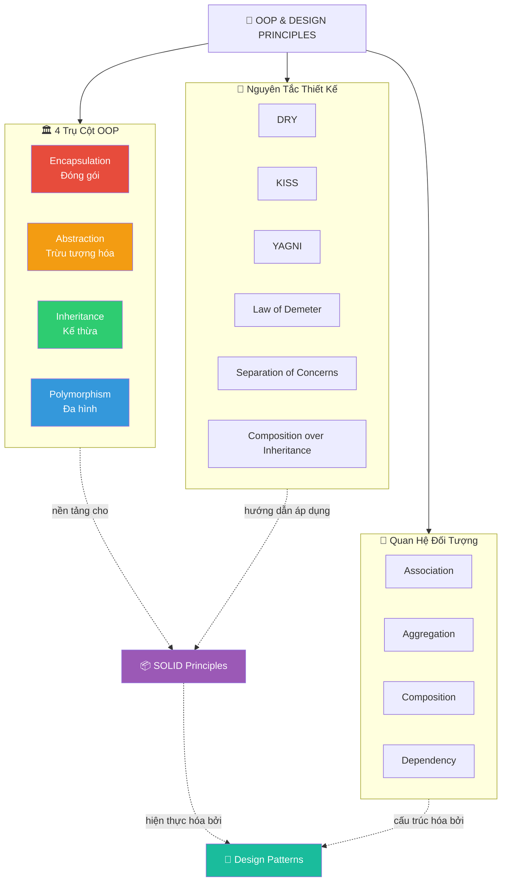

# 🧬 OOP & Software Design Principles — Nghiên Cứu Chuyên Sâu

> **Tài liệu nghiên cứu toàn diện** về Lập Trình Hướng Đối Tượng (Object-Oriented Programming) và các nguyên tắc thiết kế phần mềm cốt lõi. Từ nền tảng lý thuyết đến ứng dụng thực chiến.

---

## 📋 Mục Lục

| # | Tài liệu | Nội dung |
|---|----------|----------|
| 1 | [4 Trụ Cột OOP](./01-four-pillars-of-oop.md) | Encapsulation, Abstraction, Inheritance, Polymorphism — phân tích từng trụ cột với ví dụ thực tế |
| 2 | [Quan Hệ Giữa Các Đối Tượng](./02-object-relationships.md) | Association, Aggregation, Composition, Dependency — khi nào dùng cái nào |
| 3 | [Nguyên Tắc Thiết Kế Bổ Sung](./03-design-principles.md) | DRY, KISS, YAGNI, LoD, Separation of Concerns, Composition over Inheritance, Fail Fast |
| 4 | [OOP Trong Thực Tế](./04-oop-in-practice.md) | Anti-patterns, refactoring, kết hợp OOP + SOLID + Design Patterns, bài tập tổng hợp |

---

## 🗺️ Bản Đồ Tổng Quan



## 🎯 Mối Quan Hệ Với Các Tài Liệu Khác

```
📁 research_docs/
├── 🧬 oop-principles/          ← BẠN ĐANG Ở ĐÂY
│   ├── 01-four-pillars-of-oop.md
│   ├── 02-object-relationships.md
│   ├── 03-design-principles.md
│   └── 04-oop-in-practice.md
│
├── 🏛️ solid-principles/        ← Xây dựng TRÊN nền tảng OOP
│   ├── 01-single-responsibility.md
│   ├── ...
│   └── 06-synthesis-and-practice.md
│
└── 🎨 design-patterns/         ← Hiện thực hóa OOP + SOLID
    ├── 01-creational-patterns.md
    ├── ...
    └── 05-pattern-combinations.md
```

> **Thứ tự đọc khuyến nghị**: OOP Principles → SOLID Principles → Design Patterns
> Mỗi tầng kiến thức xây dựng trên tầng trước đó.

---

## 📊 Ma Trận Quick Reference

| Khái niệm | Thuộc nhóm | Mức cốt lõi | Dễ hiểu nhầm | Liên quan SOLID |
|:---:|:---:|:---:|:---:|---|
| **Encapsulation** | Trụ cột OOP | ⭐⭐⭐ | 🟡 | SRP, ISP |
| **Abstraction** | Trụ cột OOP | ⭐⭐⭐ | 🔴 | DIP, OCP |
| **Inheritance** | Trụ cột OOP | ⭐⭐⭐ | 🔴 | LSP, OCP |
| **Polymorphism** | Trụ cột OOP | ⭐⭐⭐ | 🟡 | OCP, LSP, DIP |
| **DRY** | Nguyên tắc | ⭐⭐ | 🔴 | SRP |
| **KISS** | Nguyên tắc | ⭐⭐ | 🟡 | SRP |
| **YAGNI** | Nguyên tắc | ⭐⭐ | 🟡 | ISP |
| **Law of Demeter** | Nguyên tắc | ⭐⭐ | 🔴 | DIP |
| **Composition > Inheritance** | Nguyên tắc | ⭐⭐⭐ | 🔴 | LSP, DIP |

---

## 📐 Quy Ước Trong Tài Liệu

- **Code mẫu**: Java/Kotlin (nhất quán với tài liệu SOLID và Design Patterns)
- **Lược đồ**: Mermaid class/sequence diagram
- **Ký hiệu mức độ**: ⭐ Cơ bản → ⭐⭐⭐ Nâng cao
- **Ký hiệu thực tế**: 🏢 Enterprise → 📱 Mobile → 🌐 Web

---

## 🌍 Bối Cảnh Lịch Sử OOP

```
1960s  Simula 67 — Ole-Johan Dahl & Kristen Nygaard
       └─ Ngôn ngữ OOP đầu tiên: classes, objects, inheritance

1972   Smalltalk — Alan Kay, Xerox PARC
       └─ Thuần OOP, message passing, encapsulation triệt để

1979   Bjarne Stroustrup bắt đầu phát triển C++
       └─ OOP + Systems Programming → mainstream adoption

1988   Bertrand Meyer — "Object-Oriented Software Construction"
       └─ Design by Contract, Open/Closed Principle

1991   James Gosling bắt đầu phát triển Java
       └─ "Write once, run anywhere" → OOP phổ biến toàn cầu

1994   GoF — "Design Patterns" book
       └─ 23 patterns — catalog chuẩn cho OOP patterns

1996   Robert C. Martin — SOLID principles
       └─ Hệ thống hóa nguyên tắc thiết kế OOP

1999   Andrew Hunt & David Thomas — "The Pragmatic Programmer"
       └─ DRY principle trở nên phổ biến

2000s  Agile + TDD → OOP thiết kế hướng testability

2010s  Functional Programming hồi sinh
       └─ OOP tiến hóa: ít kế thừa, nhiều composition

2020s  Multi-paradigm: OOP + FP + Reactive
       └─ OOP vẫn là nền tảng, kết hợp paradigm linh hoạt
```

> **Ghi chú**: OOP không phải paradigm duy nhất, nhưng là paradigm **nền tảng** mà mọi software engineer cần nắm vững. Hiểu OOP sâu giúp bạn đánh giá đúng khi nào nên dùng FP, khi nào nên kết hợp.
