# 🏛️ Nghiên Cứu Chuyên Đề & Bài Báo Khoa Học (Papers & Research)

> Tuyển tập các nghiên cứu kiến trúc hệ thống phân tán quy mô siêu lớn và các bài báo khoa học về Graph Neural Networks, Social Bot Detection đạt chuẩn quốc tế.

---

## 🗺️ Bản Đồ Phân Nhóm Papers

```mermaid
graph TD
    Papers["🏛️ Papers & Deep Research"]
    
    Papers --> Dist["🌐 Distributed Architecture & High TPS"]
    Papers --> Academic["📜 Academic Papers & Graph Mining"]
    
    Dist --> Micro1M["Microservices 1M TPS Multi-Domain"]
    Dist --> SpringK8s["Spring Cloud, K8s, Istio & Temporal"]
    Dist --> ZK1B["ZooKeeper Ecosystem 1B TPS"]
    Dist --> Kafka["Apache Kafka Zero to Advanced"]
    Dist --> ZKDeep["ZooKeeper Architecture & Spring Guide"]
    Dist --> Nacos["Alibaba Nacos Deep Dive"]
    Dist --> Temporal["Temporal Saga vs Spring Ecosystem"]
    
    Academic --> SOTA["Fake Account Detection SOTA Synthesis"]
    Academic --> Twibot["Twibot-22 Benchmark"]
    Academic --> SybilGAT["SybilGAT (2024 Graph Attention)"]
    Academic --> Clustering["Graph Clustering Survey"]
    Academic --> GNN["GNN Comprehensive Survey"]
    Academic --> LLMBot["LLM Social Bot (2025)"]

    classDef default fill:#1e1e2e,stroke:#3b4252,stroke-width:1px,color:#eceff4;
    classDef highlight fill:#2e3440,stroke:#88c0d0,stroke-width:2px,color:#88c0d0;
    class Micro1M,Kafka,ZK1B,SOTA,SybilGAT,GNN highlight;
```

---

## 1. 🌐 Kiến Trúc Phân Tán & High TPS (Distributed Systems)

Các nghiên cứu thực chiến giải quyết bài toán tải cực lớn, điều phối giao dịch phân tán và đồng bộ trạng thái:

| Tài Liệu | Trọng Tâm Kiến Trúc | Quy Mô / Mục Tiêu | Liên Kết |
|---|---|:---:|:---:|
| **Microservices 1M TPS Multi-Domain** | Thiết kế kiến trúc tổng thể microservices chịu tải 1,000,000 TPS đa domain ngân hàng/e-commerce. | `1,000,000 TPS` | [Đọc ngay →](./ARCHITECTURE_microservice_1M_TPS_multi_domain) |
| **Spring Cloud, K8s, Istio & Temporal** | Phân tích so sánh và kết hợp Service Mesh (Istio), Container Orchestration (K8s) và Workflow Engine (Temporal). | `Enterprise Grid` | [Đọc ngay →](./ANALYSIS_spring_cloud_k8s_istio_temporal_ecosystem) |
| **ZooKeeper Ecosystem 1B TPS** | Mô hình triển khai cụm ZooKeeper hỗ trợ hệ sinh thái Spring xử lý mốc 1 tỷ lượt truy vấn mỗi ngày. | `1,000,000,000 ops` | [Đọc ngay →](./ANALYSIS_zookeeper_spring_ecosystem_1B_TPS) |
| **Apache Kafka Zero to Advanced** | Cẩm nang Kafka toàn diện: Broker internals, Zero-copy, Partition balancing, Idempotent producer, Exactly-once semantics. | `High Throughput` | [Đọc ngay →](./RESEARCH_kafka_zero_to_advanced) |
| **Nghiên Cứu Apache ZooKeeper** | Phân tích sâu thuật toán đồng thuận Zab, cấu trúc znode, Watcher mechanism, leader election. | `Consensus Core` | [Đọc ngay →](./RESEARCH_apache_zookeeper) |
| **Hướng Dẫn ZooKeeper + Spring Boot** | Thực hành cấu hình Apache Curator, Distributed Lock, Service Registration với Spring Boot. | `Thực Hành` | [Đọc ngay →](./GUIDE_zookeeper_spring_boot) |
| **Alibaba Nacos Deep Dive** | So sánh Nacos với Eureka/Consul/ZooKeeper về Service Discovery và Dynamic Configuration Management. | `Cloud Native` | [Đọc ngay →](./RESEARCH_nacos_deep_dive) |
| **Temporal Saga vs Spring Ecosystem** | So sánh cơ chế điều phối Orchestration Saga (Temporal) với Choreography Saga qua Kafka/Spring Cloud. | `Distributed Saga` | [Đọc ngay →](./RESEARCH_temporal_saga_vs_spring_ecosystem) |

---

## 2. 📜 Nghiên Cứu Học Thuật & Đồ Thị (Academic Papers & Bot Detection)

Tổng hợp các nghiên cứu khoa học đỉnh cao về Graph Neural Networks, phát hiện bot và tài khoản độc hại:

| Tài Liệu | Nội Dung Khoa Học & Thuật Toán | Năm / Benchmark | Liên Kết |
|---|---|:---:|:---:|
| **Fake Account Detection SOTA Synthesis** | Tổng hợp toàn diện các phương pháp State-of-the-Art phát hiện tài khoản giả mạo trên mạng xã hội. | `SOTA Survey` | [Đọc ngay →](./SYNTHESIS_fake_account_detection_sota) |
| **Twibot-22 Benchmark** | Bộ dữ liệu đồ thị mạng xã hội lớn nhất và đa dạng nhất phục vụ nghiên cứu Social Bot Detection. | `Benchmark chuẩn` | [Đọc ngay →](./02_twibot22_benchmark) |
| **SybilGAT (2024)** | Mạng nơ-ron đồ thị Graph Attention Network đa quan hệ phát hiện tấn công Sybil quy mô lớn. | `2024 Research` | [Đọc ngay →](./03_sybilgat_2024) |
| **Graph Clustering Survey** | Khảo sát các thuật toán phân cụm đồ thị: Spectral Clustering, Louvain, Infomap, Deep Graph Clustering. | `Comprehensive` | [Đọc ngay →](./04_graph_clustering_survey) |
| **Instagram Fake Detection** | Đặc trưng hành vi, hình ảnh đại diện và mô hình học máy phát hiện tài khoản giả trên Instagram. | `Empirical Study` | [Đọc ngay →](./05_instagram_fake_detection) |
| **Cluster-Aware Anomaly Detection** | Thuật toán nhận diện điểm dị biệt đồ thị kết hợp nhận biết cấu trúc phân cụm (Cluster-aware). | `Advanced ML` | [Đọc ngay →](./06_cluster_aware_anomaly) |
| **GNN Comprehensive Survey** | Tổng quan hệ thống hóa các kiến trúc GNN (GCN, GAT, GraphSAGE, GIN) và ứng dụng thực tiễn. | `Deep Survey` | [Đọc ngay →](./07_gnn_comprehensive_survey) |
| **LLM Social Bot (2025)** | Phân tích hành vi tinh vi của thế hệ bot mạng xã hội được điều khiển bởi Mô hình ngôn ngữ lớn (LLM). | `2025 Research` | [Đọc ngay →](./08_llm_social_bot_2025) |
