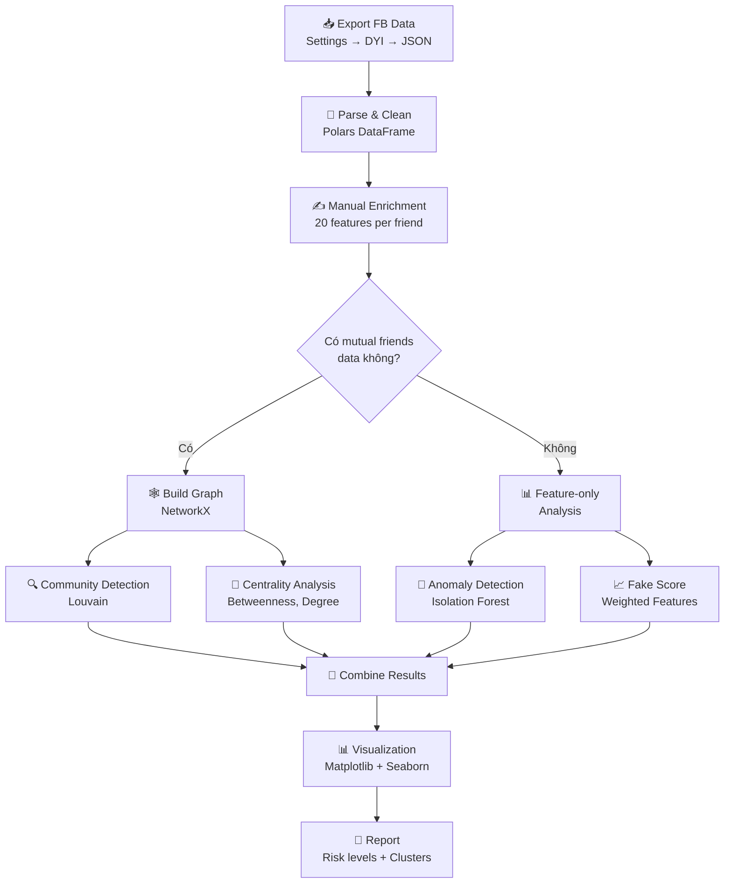

# 🧠 Tổng Hợp Nghiên Cứu SOTA: Phát Hiện Tài Khoản Ảo & Phân Tích Mạng Xã Hội

> Tài liệu này tổng hợp nội dung cốt lõi từ các papers SOTA, viết dưới dạng **dễ hiểu, có ví dụ cụ thể**, dành cho người đang nghiên cứu đề tài phân tích danh sách bạn bè Facebook.

---

## Mục Lục

1. [Bức Tranh Tổng Quan](#1-bức-tranh-tổng-quan)
2. [Tài Khoản Ảo Là Gì & Tại Sao Khó Phát Hiện](#2-tài-khoản-ảo-là-gì--tại-sao-khó-phát-hiện)
3. [Các Phương Pháp Phát Hiện Fake Account](#3-các-phương-pháp-phát-hiện-fake-account)
4. [Graph Neural Networks — Vũ Khí Chính](#4-graph-neural-networks--vũ-khí-chính)
5. [Community Detection — Gom Cụm Mối Quan Hệ](#5-community-detection--gom-cụm-mối-quan-hệ)
6. [Đánh Giá Hành Vi & Mức Độ Uy Tín](#6-đánh-giá-hành-vi--mức-độ-uy-tín)
7. [LLM + GNN — Xu Hướng Mới Nhất 2025](#7-llm--gnn--xu-hướng-mới-nhất-2025)
8. [Benchmarks & Datasets](#8-benchmarks--datasets)
9. [Áp Dụng Cho Facebook](#9-áp-dụng-cho-facebook)
10. [Tài Liệu Tham Khảo](#10-tài-liệu-tham-khảo)

---

## 1. Bức Tranh Tổng Quan

### Vấn đề

Mạng xã hội đang bị tấn công bởi **tài khoản ảo** (fake accounts, bots, Sybils). Theo nghiên cứu:
- Facebook ước tính **5-11% tài khoản** là fake (~600M-1.3B accounts)
- Twitter có khoảng **5-15% accounts** là bots
- Các tài khoản ảo được dùng để: **thao túng dư luận**, **spam/phishing**, **tăng followers ảo**, **lừa đảo tài chính**

### Sự tiến hóa của phương pháp phát hiện

```
2011-2016: Rule-based (đặt ngưỡng thủ công)
    ↓ Bots ngày càng tinh vi, vượt qua rules
2016-2020: Machine Learning (Random Forest, SVM, XGBoost)
    ↓ Bots bắt chước hành vi người thật
2020-2023: Graph Neural Networks (phân tích cấu trúc mạng)
    ↓ Bots bắt đầu dùng LLM tạo nội dung
2024-2025: GNN + LLM Hybrid (kết hợp cấu trúc + ngữ nghĩa)
```

> **Nguồn**: Survey "Graph-based Fake Account Detection" (arXiv:2507.06541, 2025)

---

## 2. Tài Khoản Ảo Là Gì & Tại Sao Khó Phát Hiện

### 2.1 Phân loại tài khoản ảo

| Loại | Mô Tả | Ví Dụ | Mức Độ Khó Phát Hiện |
|------|--------|-------|----------------------|
| **Simple Bot** | Tài khoản tự động, hành vi lặp lại | Like/share liên tục, không có ảnh thật | 🟢 Dễ |
| **Sybil Account** | Nhiều accounts do 1 người/tổ chức điều khiển | Farm tài khoản kết bạn hàng loạt | 🟡 Trung bình |
| **Sophisticated Bot** | Bắt chước hành vi người thật | Post bài, comment tự nhiên | 🟠 Khó |
| **Cyborg** | Nửa người nửa bot, con người điều khiển 1 phần | Mua followers, dùng tool auto-post | 🔴 Rất khó |
| **LLM-powered Bot** | Dùng AI tạo nội dung hoàn toàn tự nhiên | ChatGPT viết comment, reply | 🔴 Cực khó |

> **Nguồn**: "Evolution of Malicious Social Bot Detection" (2025), "Adversarial Creation and Detection of AI-Generated Social Bot Content" (arXiv:2606.07219)

### 2.2 Tại sao rule-based không đủ?

Ví dụ cụ thể: Bạn đặt rule "tài khoản không có ảnh profile = fake":

```
❌ Sai sót 1: Bạn thật có thể chưa đặt ảnh
❌ Sai sót 2: Bot có thể lấy ảnh người khác
❌ Sai sót 3: Deepfake tạo ảnh profile cực thật
```

→ Cần **kết hợp nhiều tín hiệu** + **phân tích cấu trúc mạng**

---

## 3. Các Phương Pháp Phát Hiện Fake Account

### 3.1 Feature-based (Phương pháp cổ điển)

**Ý tưởng**: Trích xuất đặc trưng từ profile → Train ML classifier

**Features hay dùng** (từ paper Instagram Fake Detection, arXiv:1910.03090):

```
Profile features:
├── Có ảnh profile không? (has_profile_pic)
├── Tỷ lệ followers/following (ff_ratio)
├── Độ dài username (username_length)
├── Có số trong username? (has_number_in_name)
├── Độ dài bio (bio_length)
└── Tài khoản private/public? (is_private)

Activity features:
├── Số bài post (posts_count)
├── Posts per day since creation
├── Thời gian trung bình giữa các posts
└── Engagement rate (likes + comments / followers)
```

**Ưu/Nhược điểm**:
- ✅ Nhanh, dễ implement, dễ giải thích
- ✅ Hoạt động tốt với simple bots
- ❌ Dễ bị bypass: bot chỉ cần copy features của người thật
- ❌ Bỏ qua cấu trúc mạng (ai kết bạn với ai)

### 3.2 Graph-based (Phương pháp hiện đại — Chi tiết ở Section 4)

**Ý tưởng**: Phân tích CẤU TRÚC MẠNG — cách tài khoản liên kết với nhau

**Trực giác**: Người thật có mạng lưới bạn bè "chặt" (nhiều bạn chung), còn fake accounts thường:
- Kết bạn ngẫu nhiên → ít bạn chung
- Thuộc "cụm fake" → bạn chung đều là fake

### 3.3 Hybrid (SOTA 2025)

**Ý tưởng**: Kết hợp cả features + graph structure + content analysis

```
Input: Profile data + Network topology + Post content
  ↓
[Feature Extractor] → profile features
[GNN Module]        → structural features  → [Fusion Layer] → Fake/Real
[LLM/NLP Module]    → content features
```

---

## 4. Graph Neural Networks — Vũ Khí Chính

### 4.1 Tại sao Graph lại quan trọng?

**Ví dụ cụ thể với danh sách bạn bè Facebook của bạn**:

```
Bạn (YOU) có 500 friends.
Trong đó:
- "Nguyễn A" có 50 bạn chung với bạn → Khả năng cao là người thật
- "John XYZ123" có 0 bạn chung → Đáng nghi
- 20 accounts cùng kết bạn với bạn trong 1 ngày → Cụm đáng nghi
- 20 accounts đó lại kết bạn với nhau → Farm accounts
```

Graph cho phép nhìn thấy **pattern ẩn** mà features riêng lẻ không thấy được.

### 4.2 Cách GNN hoạt động (giải thích đơn giản)

```
Bước 1: Mỗi user là 1 NODE trong graph
        Mỗi quan hệ bạn bè là 1 EDGE

Bước 2: Mỗi node có "đặc trưng" ban đầu
        (VD: số bạn, tuổi tài khoản, số posts...)

Bước 3: GNN "lan truyền thông tin" giữa các node láng giềng
        → Mỗi node "học" được thông tin từ bạn bè của nó
        → Sau nhiều lần lan truyền, node biết được "neighborhood" rộng hơn

Bước 4: Dựa trên thông tin tổng hợp → Phân loại Fake vs Real
```

**3 loại GNN chính** (từ Survey GNN, arXiv:1901.00596):

| GNN Type | Cách hoạt động | Ví dụ |
|----------|----------------|-------|
| **GCN** (Graph Convolutional Network) | Trung bình hóa features của láng giềng | Đơn giản, nhanh, baseline tốt |
| **GAT** (Graph Attention Network) | Gán trọng số attention cho từng láng giềng | Biết láng giềng nào quan trọng hơn |
| **GraphSAGE** | Sample láng giềng + aggregate | Scale tốt cho graph lớn |

### 4.3 SYBILGAT — GAT cho Sybil Detection (arXiv:2409.08631)

**Vấn đề**: Các phương pháp cũ (SybilRank, SybilBelief) giả sử:
- Số "attack edges" (liên kết fake→real) ít
- Cấu trúc mạng fake khác hẳn mạng real

→ Cả hai giả sử đều sai trong thực tế!

**Giải pháp SYBILGAT**:
```
1. Dùng GAT (Graph Attention Network)
2. Attention mechanism tự học: láng giềng nào đáng tin, láng giềng nào không
3. Chỉ cần thông tin cấu trúc mạng (không cần profile features)
4. Pretrain trên subgraphs nhỏ → generalize tốt cho graph lớn
```

**Kết quả**:
- Vượt trội các baseline (SybilRank, SybilSCAR, SybilBelief)
- Đặc biệt mạnh khi **số attack edges nhiều** (kịch bản thực tế)
- Test trên Twitter graph: **269K nodes, 6.8M edges** → Scale tốt

**Ý nghĩa cho bạn**: Nếu bạn build được friendship graph của mình, GAT có thể tự học ra đâu là fake accounts dựa trên PATTERN LIÊN KẾT, không cần biết gì về profile.

### 4.4 Vấn đề Over-smoothing

```
Vấn đề: Khi GNN có quá nhiều layers
→ Tất cả nodes bị "pha trộn" features
→ Không phân biệt được fake vs real nữa

Ví dụ: Layer 1: Mỗi node biết bạn bè trực tiếp
        Layer 2: Biết bạn của bạn
        Layer 3: Biết bạn của bạn của bạn
        ...
        Layer 10: Mọi node "biết" gần hết graph → tất cả giống nhau

Giải pháp (TopGateGNN, 2024):
→ Gating mechanism: tự quyết định dừng lan truyền khi đủ thông tin
→ Data augmentation: tạo thêm synthetic bot nodes để cân bằng class
```

---

## 5. Community Detection — Gom Cụm Mối Quan Hệ

### 5.1 Tại sao gom cụm?

**Trực giác**: Bạn bè trên Facebook tự nhiên hình thành **nhóm**:
- Nhóm bạn đại học
- Nhóm đồng nghiệp
- Nhóm gia đình
- Nhóm cùng sở thích

**Fake accounts cũng có pattern nhóm**:
- Farm accounts thường kết bạn với nhau
- Bot network hoạt động phối hợp
- Kết bạn cùng lúc, interact cùng content

### 5.2 Các thuật toán (từ Survey Graph Clustering, arXiv:2407.09055)

| Thuật toán | Cách hoạt động | Ưu điểm | Nhược điểm |
|------------|----------------|---------|------------|
| **Louvain** | Tối ưu modularity qua nhiều cấp | Nhanh, scale tốt | Không tìm được overlapping communities |
| **Label Propagation** | Mỗi node "truyền" nhãn cho láng giềng | Rất nhanh, O(n) | Không deterministic |
| **DBSCAN** | Gom cụm dựa trên mật độ | Tìm được outliers | Cần tune parameters |
| **Spectral Clustering** | Dùng eigenvalues của graph Laplacian | Lý thuyết chặt | Chậm với graph lớn |
| **Deep GNN Clustering** | GNN + autoencoder | SOTA accuracy | Cần training, phức tạp |

### 5.3 Ví dụ thực tế với Facebook friends

```python
import networkx as nx

# Giả sử bạn có graph bạn bè
G = nx.Graph()
G.add_edges_from([
    ("YOU", "A"), ("YOU", "B"), ("YOU", "C"),  # Bạn thật
    ("A", "B"), ("B", "C"), ("A", "C"),          # Nhóm 1: bạn chung nhiều
    ("YOU", "X1"), ("YOU", "X2"), ("YOU", "X3"),  # Fake group
    ("X1", "X2"), ("X2", "X3"), ("X1", "X3"),     # Fake kết bạn với nhau
    # Nhưng X1, X2, X3 KHÔNG kết bạn với A, B, C
])

# Louvain community detection
communities = nx.community.louvain_communities(G)
# Kết quả: {'YOU', 'A', 'B', 'C'} và {'X1', 'X2', 'X3'}
# → Phát hiện được cụm fake tách biệt
```

### 5.4 Cluster-Aware Anomaly Detection (arXiv:2409.09770)

**Ý tưởng đột phá**: Thay vì detect anomaly rồi mới cluster, hoặc cluster rồi mới detect, paper này **làm đồng thời**:

```
Traditional:  Graph → Community Detection → Anomaly Detection (riêng biệt)
This paper:   Graph → Joint Cluster + Anomaly (cùng lúc)
```

**Tại sao tốt hơn?**:
- Anomaly detection được "informed" bởi cluster structure
- Cluster detection không bị ảnh hưởng bởi anomalies
- Kết quả: phát hiện cả **cluster fake** (nhóm) và **isolated fake** (đơn lẻ)

---

## 6. Đánh Giá Hành Vi & Mức Độ Uy Tín

### 6.1 MultiCred — Đánh giá uy tín nhiều cấp (arXiv:2309.13305)

Thay vì binary (fake/real), paper này đề xuất **nhiều cấp uy tín**:

```
Tier 1: ⭐⭐⭐⭐⭐ Highly Credible     (người nổi tiếng, verified)
Tier 2: ⭐⭐⭐⭐   Credible            (người dùng bình thường, active)
Tier 3: ⭐⭐⭐     Somewhat Credible   (ít hoạt động, ít tương tác)
Tier 4: ⭐⭐       Low Credibility     (nhiều dấu hiệu đáng nghi)
Tier 5: ⭐         Very Low            (rất nhiều dấu hiệu fake)
```

**Features sử dụng**:
- **Profile features**: Bio, profile photo, creation date
- **Tweet/Post analysis**: Dùng deep language models (BERT) phân tích nội dung
- **Comment analysis**: Pattern comment (spam vs meaningful)
- **Network features**: Followers, following, mutual connections

**Ý nghĩa cho bạn**: Thay vì chỉ "fake/real", bạn có thể xếp hạng uy tín từng friend.

### 6.2 Ban Evasion Detection (arXiv:2202.05257)

Paper này nghiên cứu cách phát hiện accounts bị ban tạo lại:

**Signals mạnh nhất**:
1. **Username similarity**: "nguyen_a" bị ban → tạo "nguyen_a_2"
2. **Edit page overlap**: Trên Wikipedia, cùng sửa các trang giống nhau
3. **Writing style**: Dùng NLP so sánh cách viết
4. **Temporal patterns**: Tạo account mới ngay sau khi bị ban

**Áp dụng cho Facebook**: Nếu bạn unfriend ai → họ tạo account mới kết bạn lại → detect bằng name similarity + timing.

---

## 7. LLM + GNN — Xu Hướng Mới Nhất 2025

### 7.1 Vấn đề mới: Bots dùng AI

```
Trước 2023: Bot viết comment = "Nice post!" "Follow me!"  → Dễ detect
Sau 2023:   Bot dùng ChatGPT viết comment tự nhiên         → Cực khó detect
```

> Paper "Adversarial Creation and Detection of AI-Generated Social Bot Content" (arXiv:2606.07219):
> - Tạo dataset: dùng LLM **giả lập** user thật → tạo cặp "human vs AI"
> - Phát hiện: Train trên adversarial data → detect AI-generated content tốt hơn
> - Kết quả: **Vượt trội** các models content-based hiện tại

### 7.2 FLAG Framework (2025) — SOTA mới nhất

```
Architecture:
┌─────────────────────────────────────────┐
│         Post/Comment content            │
│              ↓                          │
│     [Large Language Model]              │
│     Extract semantic features           │
│              ↓                          │
│     Semantic Embeddings                 │
│              ↓         ┌──────────────┐ │
│     [Fusion Layer]  ← │ Graph (GNN)  │ │
│              ↓         │ Structural   │ │
│     Combined Features  │ features     │ │
│              ↓         └──────────────┘ │
│     [Classifier]                        │
│     Fake / Real                         │
└─────────────────────────────────────────┘
```

**Tại sao FLAG mạnh?**:
1. LLM hiểu ngữ nghĩa sâu → detect nội dung bất thường
2. GNN hiểu cấu trúc mạng → detect pattern liên kết bất thường
3. Fusion = kết hợp cả hai → robust hơn

### 7.3 LLM phát hiện Influence Campaigns (arXiv:2311.07816)

**Coordinated Inauthentic Behavior (CIB)**:
- Nhóm accounts phối hợp push 1 narrative
- VD: 50 accounts cùng share 1 bài viết trong 30 phút
- LLM phân tích: nội dung quá giống nhau → coordinated

---

## 8. Benchmarks & Datasets

### 8.1 TwiBot-22 — Benchmark lớn nhất (arXiv:2206.04564)

| Thông số | Giá trị |
|----------|---------|
| **Users** | 1,000,000+ |
| **Relations** | 14 loại |
| **Labels** | Bot / Human |
| **Graph** | Heterogeneous (user-tweet-hashtag-list) |

**Kết quả baseline trên TwiBot-22**:

| Model | Accuracy | F1 Score | Ghi chú |
|-------|----------|----------|---------|
| BotRGCN | 87.92% | 59.46% | GNN-based |
| GAT | 89.09% | 40.58% | Attention-based |
| BotHunter | 89.53% | 33.77% | Feature-based |
| RGT | 89.60% | 26.89% | Transformer |

> **Quan sát quan trọng**: Accuracy cao (~89%) nhưng F1 thấp (~30-60%) 
> → Vì bots chiếm thiểu số, model predict "human" cho hầu hết → accuracy ảo cao
> → **F1 mới là metric quan trọng** cho bài toán này (class imbalance)

### 8.2 Datasets khác

| Dataset | Platform | Dùng cho |
|---------|----------|----------|
| Cresci-2017 | Twitter | Multi-class bot types |
| FakeNewsNet | Twitter | Misinformation accounts |
| So-Fake | Multi | Profile photo forgery |
| Ban Evasion (Wikipedia) | Wikipedia | Account resurrection |

---

## 9. Áp Dụng Cho Facebook

### 9.1 Data bạn có vs Data papers yêu cầu

| Papers cần | Bạn có (FB Export) | Gap | Workaround |
|-----------|-------------------|-----|------------|
| Full graph | Chỉ có friend list | ❌ Thiếu edges giữa friends | Dùng mutual friends count |
| Profile features | Chỉ name + timestamp | ❌ Thiếu nhiều | Manual enrichment |
| Post content | Không có | ❌ | Không áp dụng NLP approach |
| Labeled data | Không có | ❌ | Unsupervised methods |

### 9.2 Phương pháp khả thi nhất (Realistic Approach)

Dựa trên literature review, đây là **approach tối ưu** cho dữ liệu Facebook thực tế:

```
TIER 1 — Dễ làm ngay (Rule + Feature-based)
├── Name pattern analysis (từ FB export)
├── Friend-since timestamp analysis (phát hiện bulk requests)
├── Manual profile feature collection (10-20 features)
└── Scoring system (weighted sum of features)

TIER 2 — Trung bình (Graph + Unsupervised ML)
├── Build friendship graph (NetworkX)
├── Community detection (Louvain algorithm)
├── Anomaly detection (Isolation Forest)
├── Clustering (DBSCAN trên feature space)
└── Centrality metrics (betweenness, degree, closeness)

TIER 3 — Nâng cao (GNN — cần thêm data)
├── Thu thập mutual friends data
├── Build heterogeneous graph
├── Train GAT/GraphSAGE cho node classification
└── Semi-supervised: label 50-100 accounts → train
```

### 9.3 Pipeline Đề Xuất (Step-by-step)



---

## 10. Tài Liệu Tham Khảo

### Papers Đã Đọc (Xếp theo Ưu Tiên)

| # | Paper | arXiv | Nội dung chính đã tổng hợp |
|---|-------|-------|---------------------------|
| 1 | Graph-based Fake Account Detection: A Survey | 2507.06541 | Section 1, 3 — Taxonomy, evolution |
| 2 | A Comprehensive Survey on GNN | 1901.00596 | Section 4 — GNN fundamentals |
| 3 | TwiBot-22 | 2206.04564 | Section 8 — Benchmark results |
| 4 | SYBILGAT | 2409.08631 | Section 4.3 — GAT for Sybil |
| 5 | Advanced Graph Clustering Methods | 2407.09055 | Section 5 — Clustering algorithms |
| 6 | Cluster Aware Anomaly Detection | 2409.09770 | Section 5.4 — Joint approach |
| 7 | Instagram Fake Detection | 1910.03090 | Section 3.1 — Feature engineering |
| 8 | Adversarial Social Bot Content | 2606.07219 | Section 7.1 — LLM bots |
| 9 | MultiCred | 2309.13305 | Section 6.1 — Credibility tiers |
| 10 | Ban Evasion Detection | 2202.05257 | Section 6.2 — Account resurrection |
| 11 | Digital Cloning of Social Networks | 2401.12509 | Section 7 — Simulation |
| 12 | LLM Detect Influence Campaigns | 2311.07816 | Section 7.3 — CIB detection |

### Đọc Thêm (Chưa Tổng Hợp)
- FLAG Framework (LLM + GNN, 2025) — chưa public trên arXiv
- TopGateGNN (Gated GNN, 2024) — ACL anthology
- Evolution of Malicious Social Bot Detection (2025) — sciopen.com
