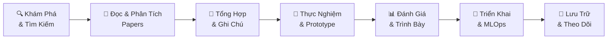
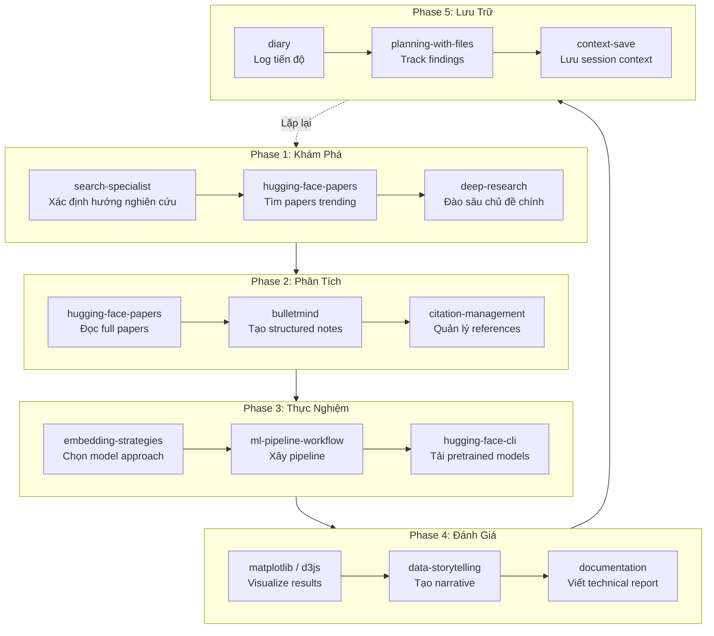

# 🔬 Bộ Skill/Workflow Nghiên Cứu Khoa Học & Công Nghệ SOTA

> **Mục tiêu**: Tổng hợp và phân loại các skill phục vụ quy trình nghiên cứu công nghệ, khoa học, và giải pháp State-of-the-Art (SOTA) — từ khám phá ý tưởng đến triển khai giải pháp.

---

## 📋 Tổng Quan Kiến Trúc Workflow

---

## 🏗️ Phân Loại Skill Theo Giai Đoạn Nghiên Cứu

### Giai Đoạn 1: 🔍 Khám Phá & Tìm Kiếm (Discovery)

| Skill | Mô Tả | Điểm Mạnh | Khi Nào Dùng |
|-------|--------|-----------|--------------|
| [deep-research](file:///home/nguyentthai96/.gemini/config/skills/deep-research/SKILL.md) | Chạy tác vụ nghiên cứu tự động với Gemini API: lên kế hoạch → tìm kiếm → đọc → tổng hợp | Tự động hoàn toàn, tạo báo cáo có trích dẫn, hỗ trợ streaming real-time | Market analysis, literature review, technical research, competitive landscaping |
| [search-specialist](file:///home/nguyentthai96/.gemini/config/skills/search-specialist/SKILL.md) | Kỹ thuật tìm kiếm web nâng cao: formulation query, domain filtering, cross-referencing | Advanced query optimization, đánh giá chất lượng nguồn, fact verification | Khi cần tìm kiếm chính xác với nhiều biến thể query, cần verify facts |
| [infinite-gratitude](file:///home/nguyentthai96/.gemini/config/skills/infinite-gratitude/SKILL.md) | Nghiên cứu song song bằng 10 agent, đã battle-tested với case studies thực tế | Song song hóa 10 agent, tổng hợp cross-agent | Nghiên cứu rộng, cần bao phủ nhiều nguồn cùng lúc |

> [!TIP]
> **Combo đề xuất**: Dùng `search-specialist` để xác định hướng → `deep-research` để đào sâu → `infinite-gratitude` cho survey toàn diện.

---

### Giai Đoạn 2: 📖 Đọc & Phân Tích Papers (Literature Review)

| Skill | Mô Tả | Điểm Mạnh | Khi Nào Dùng |
|-------|--------|-----------|--------------|
| [hugging-face-papers](file:///home/nguyentthai96/.gemini/config/skills/hugging-face-papers/SKILL.md) | Đọc, tìm kiếm, phân tích papers trên HuggingFace & arXiv | API trực tiếp lấy paper dạng markdown, search semantic, liên kết models/datasets/spaces | Đọc papers AI/ML mới nhất, tìm models liên quan đến paper |
| [citation-management](file:///home/nguyentthai96/.gemini/config/skills/citation-management/SKILL.md) | Quản lý trích dẫn: tìm kiếm Google Scholar/PubMed, trích xuất metadata, tạo BibTeX | Search trên nhiều DB (Scholar, PubMed, arXiv), DOI→BibTeX, validation, formatting | Xây bibliography, literature review, verify citations |
| [claude-scientific-skills](file:///home/nguyentthai96/.gemini/config/skills/claude-scientific-skills/SKILL.md) | Kỹ năng phân tích và nghiên cứu khoa học tổng quát | Phân tích khoa học đa lĩnh vực | Cần phân tích dữ liệu khoa học hoặc đánh giá phương pháp |

> [!IMPORTANT]
> **Workflow đọc paper SOTA**:
> 1. Tìm papers trending: `curl "https://huggingface.co/api/daily_papers?sort=trending&limit=20"`
> 2. Search theo chủ đề: `curl "https://huggingface.co/api/papers/search?q=vision+language&limit=20"`
> 3. Đọc full paper: `curl "https://huggingface.co/papers/{PAPER_ID}.md"`
> 4. Tìm models liên quan: `curl "https://huggingface.co/api/models?filter=arxiv:{PAPER_ID}"`

---

### Giai Đoạn 3: 📝 Tổng Hợp & Ghi Chú (Synthesis)

| Skill | Mô Tả | Điểm Mạnh | Khi Nào Dùng |
|-------|--------|-----------|--------------|
| [bulletmind](file:///home/nguyentthai96/.gemini/config/skills/bulletmind/SKILL.md) | Chuyển đổi nội dung thành bullet points phân cấp | 3 cấp độ (lite/full/ultra), loại bỏ filler words, giữ cấu trúc logic | Tóm tắt papers, tạo study notes, so sánh phương pháp |
| [planning-with-files](file:///home/nguyentthai96/.gemini/config/skills/planning-with-files/SKILL.md) | Sử dụng file markdown làm "bộ nhớ trên ổ đĩa" — pattern Manus | task_plan.md + findings.md + progress.md, 2-Action Rule, 3-Strike Protocol | Nghiên cứu phức tạp nhiều bước, cần tracking tiến độ liên tục |
| [data-storytelling](file:///home/nguyentthai96/.gemini/config/skills/data-storytelling/SKILL.md) | Biến dữ liệu thô thành narrative thuyết phục | Story frameworks (Problem-Solution, Trend, Comparison), visualization techniques | Trình bày kết quả nghiên cứu, viết báo cáo cho stakeholders |

> [!TIP]
> **Pattern "Manus" cho nghiên cứu dài hơi**: Tạo 3 file trước khi bắt đầu:
> - `task_plan.md`: Kế hoạch nghiên cứu theo giai đoạn
> - `findings.md`: Phát hiện từ mỗi paper/experiment
> - `progress.md`: Log tiến độ theo session

---

### Giai Đoạn 4: 🧪 Thực Nghiệm & Prototype (Experimentation)

| Skill | Mô Tả | Điểm Mạnh | Khi Nào Dùng |
|-------|--------|-----------|--------------|
| [ml-pipeline-workflow](file:///home/nguyentthai96/.gemini/config/skills/ml-pipeline-workflow/SKILL.md) | End-to-end MLOps pipeline: data prep → training → validation → deployment | DAG orchestration (Airflow/Dagster/Kubeflow), 5 levels progressive complexity | Xây pipeline ML hoàn chỉnh, tái tạo experiments |
| [embedding-strategies](file:///home/nguyentthai96/.gemini/config/skills/embedding-strategies/SKILL.md) | Chọn và tối ưu embedding models cho vector search/RAG | So sánh models (OpenAI/Voyage/BGE/E5), chunking strategies, evaluation metrics | Xây RAG systems, semantic search, fine-tune embeddings |
| [gemini-api-dev](file:///home/nguyentthai96/.gemini/config/skills/gemini-api-dev/SKILL.md) | Phát triển với Gemini API — multimodal AI mạnh nhất của Google | Multimodal, grounding, code execution, function calling | Prototype nhanh với AI models, xây AI-powered tools |
| [hugging-face-cli](file:///home/nguyentthai96/.gemini/config/skills/hugging-face-cli/SKILL.md) | CLI quản lý models, datasets, Spaces trên HuggingFace Hub | Download/upload models, quản lý Spaces | Tải pretrained models, chia sẻ kết quả |
| [transformers-js](file:///home/nguyentthai96/.gemini/config/skills/transformers-js/SKILL.md) | Chạy HuggingFace models trong JavaScript/TypeScript (browser/Node.js) | Inference ngay trên browser, không cần server | Demo nhanh, edge deployment, client-side AI |

#### Thư Viện Khoa Học Chuyên Biệt

| Skill | Lĩnh Vực | Dùng Khi |
|-------|----------|----------|
| [astropy](file:///home/nguyentthai96/.gemini/config/skills/astropy/SKILL.md) | Thiên văn học | Xử lý dữ liệu thiên văn, coordinate systems, FITS files |
| [matplotlib](file:///home/nguyentthai96/.gemini/config/skills/matplotlib/SKILL.md) | Visualization | Tạo plots, charts cho papers và báo cáo |
| [networkx](file:///home/nguyentthai96/.gemini/config/skills/networkx/SKILL.md) | Graph/Network | Phân tích mạng phức tạp, graph algorithms |
| [cirq](file:///home/nguyentthai96/.gemini/config/skills/cirq/SKILL.md) | Quantum Computing | Thiết kế, mô phỏng quantum circuits |

---

### Giai Đoạn 5: 📊 Đánh Giá & Trình Bày (Evaluation & Presentation)

| Skill | Mô Tả | Khi Nào Dùng |
|-------|--------|--------------|
| [data-storytelling](file:///home/nguyentthai96/.gemini/config/skills/data-storytelling/SKILL.md) | Frameworks trình bày dữ liệu: Problem-Solution, Trend, Comparison | Viết báo cáo, slide deck, executive summary |
| [claude-d3js-skill](file:///home/nguyentthai96/.gemini/config/skills/claude-d3js-skill/SKILL.md) | Tạo data visualization tương tác với D3.js | Dashboard, interactive charts cho kết quả nghiên cứu |
| [documentation](file:///home/nguyentthai96/.gemini/config/skills/documentation/SKILL.md) | Tạo tài liệu kỹ thuật: API docs, architecture docs, README | Viết technical reports, research documentation |

---

### Giai Đoạn 6: 🚀 Triển Khai & Scale (Deployment)

| Skill | Mô Tả | Khi Nào Dùng |
|-------|--------|--------------|
| [ml-pipeline-workflow](file:///home/nguyentthai96/.gemini/config/skills/ml-pipeline-workflow/SKILL.md) | Deployment patterns: canary, blue-green, shadow | Đưa model vào production |
| [mlops-engineer](file:///home/nguyentthai96/.gemini/config/skills/mlops-engineer/SKILL.md) | MLflow, Kubeflow, model registries, experiment tracking | CI/CD cho ML, monitoring drift |
| [ai-product](file:///home/nguyentthai96/.gemini/config/skills/ai-product/SKILL.md) | Xây sản phẩm AI production-ready | Chuyển từ research → product |

---

### Giai Đoạn 7: 📔 Lưu Trữ & Theo Dõi (Knowledge Management)

| Skill | Mô Tả | Khi Nào Dùng |
|-------|--------|--------------|
| [diary](file:///home/nguyentthai96/.gemini/config/skills/diary/SKILL.md) | Hệ thống nhật ký phát triển tự động, sync Notion/Obsidian | Ghi lại tiến độ nghiên cứu hàng ngày, multi-project tracking |
| [wiki-architect](file:///home/nguyentthai96/.gemini/config/skills/wiki-architect/SKILL.md) | Tạo wiki catalogue và onboarding guide từ codebase | Xây knowledge base cho team |
| [context-management-context-save](file:///home/nguyentthai96/.gemini/config/skills/context-management-context-save/SKILL.md) | Lưu context nghiên cứu giữa các session | Nghiên cứu dài hơi qua nhiều ngày |
| [context-management-context-restore](file:///home/nguyentthai96/.gemini/config/skills/context-management-context-restore/SKILL.md) | Khôi phục context từ session trước | Tiếp tục nghiên cứu từ điểm dừng |

---

## ⭐ Workflow Đề Xuất: Nghiên Cứu SOTA Toàn Diện

---

## 🎯 Quick Reference: Chọn Skill Theo Tình Huống

| Tôi muốn... | Dùng skill |
|-------------|-----------|
| Tìm papers mới nhất về một chủ đề AI | `hugging-face-papers` + `search-specialist` |
| Chạy literature review toàn diện | `deep-research` + `citation-management` |
| Tóm tắt paper phức tạp thành notes | `bulletmind` |
| Xây RAG system cho research papers | `embedding-strategies` |
| Prototype nhanh với AI model | `gemini-api-dev` + `transformers-js` |
| Xây ML pipeline end-to-end | `ml-pipeline-workflow` |
| Trình bày kết quả cho team | `data-storytelling` + `claude-d3js-skill` |
| Track tiến độ nghiên cứu dài hơi | `planning-with-files` + `diary` |
| Tìm và download pretrained models | `hugging-face-cli` |
| Quản lý multi-project research | `diary` + `context-management-*` |

---

## 📌 Các Skill Hỗ Trợ Bổ Sung

| Skill | Vai Trò |
|-------|---------|
| [concise-planning](file:///home/nguyentthai96/.gemini/config/skills/concise-planning/SKILL.md) | Tạo checklist hành động rõ ràng |
| [writing-plans](file:///home/nguyentthai96/.gemini/config/skills/writing-plans/SKILL.md) | Viết kế hoạch triển khai chi tiết |
| [executing-plans](file:///home/nguyentthai96/.gemini/config/skills/executing-plans/SKILL.md) | Thực thi kế hoạch với review checkpoints |
| [subagent-driven-development](file:///home/nguyentthai96/.gemini/config/skills/subagent-driven-development/SKILL.md) | Song song hóa tasks độc lập |
| [skill-writer](file:///home/nguyentthai96/.gemini/config/skills/skill-writer/SKILL.md) | Tạo skill mới tùy chỉnh cho nhu cầu riêng |
| [architect-review](file:///home/nguyentthai96/.gemini/config/skills/architect-review/SKILL.md) | Review kiến trúc giải pháp |
| [senior-architect](file:///home/nguyentthai96/.gemini/config/skills/senior-architect/SKILL.md) | Toolkit kiến trúc sư cấp cao |

---

> [!NOTE]
> Tài liệu này được biên soạn từ việc phân tích chi tiết **30+ skills** trong hệ thống. Mỗi skill đã được đọc và đánh giá SKILL.md gốc để đảm bảo mô tả chính xác.
>
> Để bắt đầu sử dụng bất kỳ skill nào, chỉ cần nhắc đến nó trong conversation — hệ thống sẽ tự động kích hoạt hướng dẫn tương ứng.
