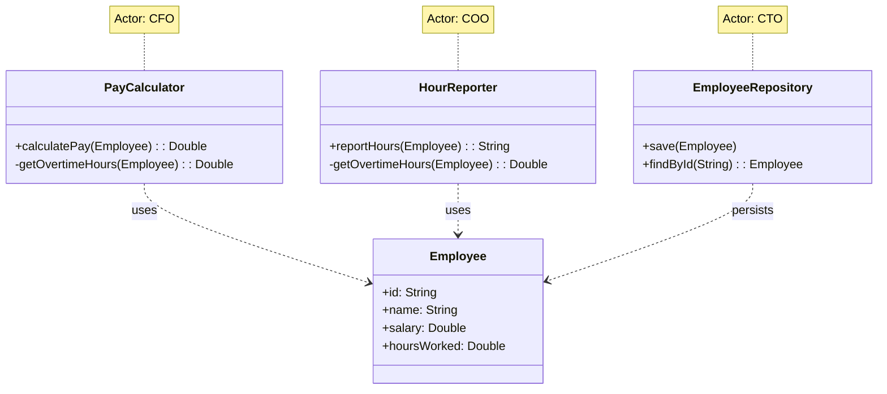
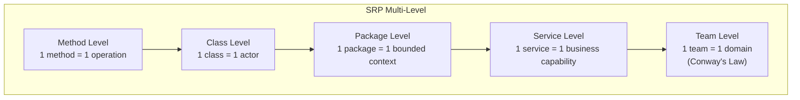
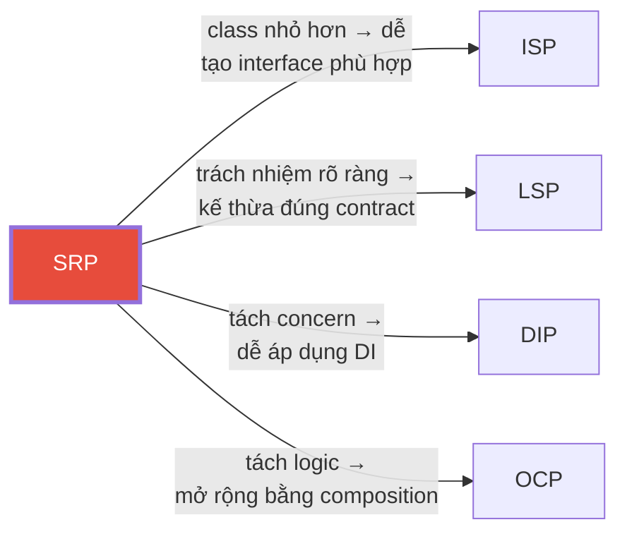

# S — Single Responsibility Principle (SRP)

> *"A class should have one, and only one, reason to change."*
> — Robert C. Martin

---

## 1. Bản Chất Của SRP

### 1.1. Định nghĩa chính xác

SRP **không** nói rằng *"mỗi class chỉ làm một việc"*. Đó là hiểu sai phổ biến nhất.

SRP nói: **Mỗi class chỉ nên có MỘT LÝ DO để thay đổi**, nghĩa là chỉ có **một actor** (một nhóm người/stakeholder) yêu cầu thay đổi class đó.

```
❌ Hiểu sai: "Mỗi class chỉ có 1 method"
❌ Hiểu sai: "Mỗi class chỉ làm 1 việc nhỏ"
✅ Hiểu đúng: "Mỗi class chỉ phục vụ 1 actor/stakeholder"
```

### 1.2. "Reason to change" = Actor

Robert C. Martin làm rõ trong "Clean Architecture" (2017):

> *"A module should be responsible to one, and only one, actor."*

**Actor** ở đây là:
- Một **nhóm người** cùng yêu cầu thay đổi tương tự
- Ví dụ: Team kế toán, Team marketing, Team operations, Team security

### 1.3. Tại sao quan trọng?

| Vấn đề khi vi phạm SRP | Hậu quả |
|---|---|
| **Accidental Coupling** | Thay đổi cho actor A vô tình phá logic của actor B |
| **Merge Conflicts** | Nhiều team sửa cùng file → xung đột liên tục |
| **Ripple Effects** | Sửa 1 dòng → chạy lại toàn bộ test suite |
| **Khó test** | Phải mock quá nhiều dependency |
| **Khó hiểu** | Class 2000+ dòng, dev mới không biết bắt đầu từ đâu |

---

## 2. Ví Dụ Minh Họa Chi Tiết

### 2.1. Ví dụ 1: Employee — Bài toán kinh điển

#### ❌ Vi phạm SRP

```kotlin
class Employee(
    val name: String,
    val position: String,
    var salary: Double,
    var hoursWorked: Double
) {
    // Actor 1: CFO / Phòng Kế Toán
    fun calculatePay(): Double {
        val basePay = salary / 160 * hoursWorked
        val overtimeHours = getOvertimeHours()  // ← shared logic!
        return basePay + overtimeHours * (salary / 160) * 1.5
    }

    // Actor 2: COO / Phòng Vận Hành
    fun reportHours(): String {
        val overtime = getOvertimeHours()  // ← shared logic!
        return "Employee $name worked $hoursWorked hours ($overtime overtime)"
    }

    // Actor 3: CTO / Phòng IT
    fun save() {
        val db = DatabaseConnection.getInstance()
        db.execute("INSERT INTO employees ...")
    }

    // Shared internal logic — nguồn gốc tai họa
    private fun getOvertimeHours(): Double {
        return if (hoursWorked > 160) hoursWorked - 160 else 0.0
    }
}
```

**Vấn đề cụ thể**: Phòng kế toán yêu cầu thay đổi cách tính `getOvertimeHours()` (ví dụ: giờ OT bắt đầu từ 176h thay vì 160h). Developer sửa → **báo cáo giờ của phòng vận hành cũng thay đổi** theo mà không ai biết.

#### ✅ Tuân thủ SRP

```kotlin
// === Data class thuần túy ===
data class Employee(
    val id: String,
    val name: String,
    val position: String,
    val salary: Double,
    val hoursWorked: Double
)

// === Actor: CFO / Phòng Kế Toán ===
class PayCalculator {
    fun calculatePay(employee: Employee): Double {
        val hourlyRate = employee.salary / 160
        val overtimeHours = getOvertimeHours(employee)
        return hourlyRate * 160 + overtimeHours * hourlyRate * 1.5
    }

    // Logic overtime RIÊNG cho kế toán
    private fun getOvertimeHours(employee: Employee): Double {
        return if (employee.hoursWorked > 176) employee.hoursWorked - 176 else 0.0
    }
}

// === Actor: COO / Phòng Vận Hành ===
class HourReporter {
    fun reportHours(employee: Employee): String {
        val overtime = getOvertimeHours(employee)
        return "Employee ${employee.name} worked ${employee.hoursWorked}h ($overtime OT)"
    }

    // Logic overtime RIÊNG cho vận hành (có thể khác kế toán!)
    private fun getOvertimeHours(employee: Employee): Double {
        return if (employee.hoursWorked > 160) employee.hoursWorked - 160 else 0.0
    }
}

// === Actor: CTO / Phòng IT ===
class EmployeeRepository(private val dataSource: DataSource) {
    fun save(employee: Employee) {
        dataSource.connection.use { conn ->
            conn.prepareStatement("INSERT INTO employees ...").use { stmt ->
                // ...
            }
        }
    }
}
```



### 2.2. Ví dụ 2: UserService — Bài toán thực tế

#### ❌ Vi phạm SRP — "God Service"

```kotlin
@Service
class UserService(
    private val userRepo: UserRepository,
    private val passwordEncoder: PasswordEncoder,
    private val emailSender: EmailSender,
    private val smsClient: SmsClient,
    private val auditLogger: AuditLogger,
    private val cacheManager: CacheManager,
    private val metricsCollector: MetricsCollector
) {
    // Đăng ký user
    fun register(request: RegisterRequest): User { ... }
    
    // Đăng nhập
    fun login(username: String, password: String): AuthToken { ... }
    
    // Quên mật khẩu
    fun resetPassword(email: String) { ... }
    
    // Cập nhật profile
    fun updateProfile(userId: String, profile: ProfileUpdate) { ... }
    
    // Gửi notification
    fun sendNotification(userId: String, message: String) { ... }
    
    // Export dữ liệu user (GDPR)
    fun exportUserData(userId: String): ByteArray { ... }
    
    // Xóa tài khoản (GDPR)
    fun deleteAccount(userId: String) { ... }
    
    // Thống kê active users
    fun getActiveUserStats(): UserStats { ... }
}
```

**Có bao nhiêu "actor" đang cùng yêu cầu thay đổi class này?**
1. Team Security → login, password
2. Team Product → register, profile  
3. Team Marketing → notification
4. Team Legal/Compliance → GDPR export, delete
5. Team Analytics → stats

→ **5 actors = 5 lý do thay đổi** → Vi phạm nghiêm trọng SRP!

#### ✅ Tuân thủ SRP — Tách theo Actor

```kotlin
// Actor: Security Team
@Service
class AuthenticationService(
    private val userRepo: UserRepository,
    private val passwordEncoder: PasswordEncoder,
    private val tokenProvider: TokenProvider
) {
    fun login(credentials: Credentials): AuthToken { ... }
    fun resetPassword(email: String) { ... }
    fun changePassword(userId: String, oldPwd: String, newPwd: String) { ... }
}

// Actor: Product Team
@Service
class UserRegistrationService(
    private val userRepo: UserRepository,
    private val eventPublisher: EventPublisher
) {
    fun register(request: RegisterRequest): User { ... }
    fun updateProfile(userId: String, profile: ProfileUpdate) { ... }
}

// Actor: Marketing/Comms Team
@Service
class NotificationService(
    private val emailSender: EmailSender,
    private val smsClient: SmsClient,
    private val pushService: PushNotificationService
) {
    fun send(userId: String, notification: Notification) { ... }
}

// Actor: Legal/Compliance Team
@Service
class GdprComplianceService(
    private val userRepo: UserRepository,
    private val dataExporter: DataExporter,
    private val auditLogger: AuditLogger
) {
    fun exportUserData(userId: String): ByteArray { ... }
    fun deleteAccount(userId: String) { ... }
    fun anonymizeData(userId: String) { ... }
}

// Actor: Analytics Team
@Service
class UserAnalyticsService(
    private val analyticsRepo: AnalyticsRepository,
    private val cacheManager: CacheManager
) {
    fun getActiveUserStats(): UserStats { ... }
    fun getUserGrowthTrend(period: Period): GrowthReport { ... }
}
```

---

## 3. Dấu Hiệu Vi Phạm SRP (Code Smells)

### 3.1. Checklist phát hiện

| # | Dấu hiệu | Mức độ | Giải thích |
|---|-----------|--------|------------|
| 1 | Class > 200 dòng code | 🟡 | Có thể chấp nhận, nhưng cần review |
| 2 | Class > 500 dòng code | 🔴 | Gần như chắc chắn vi phạm SRP |
| 3 | Constructor inject > 5 dependencies | 🔴 | Class làm quá nhiều việc |
| 4 | Class name chứa "And" hoặc "Manager" | 🟡 | `UserAndOrderManager` → tách! |
| 5 | Không thể mô tả class trong 1 câu đơn | 🔴 | "Class này làm X **và** Y **và** Z" |
| 6 | Thay đổi 1 feature → sửa class này | 🔴 | Nhiều actor cùng phụ thuộc |
| 7 | Test file dài hơn 500 dòng | 🟡 | Quá nhiều scenario → quá nhiều trách nhiệm |

### 3.2. "Litmus Test" nhanh

Hỏi những câu sau về class của bạn:

```
1. "Class này phục vụ AI trong tổ chức?"
   → Nếu câu trả lời có > 1 nhóm người → vi phạm SRP

2. "Mô tả class này trong 1 câu?"
   → Nếu phải dùng từ "và" → có thể vi phạm SRP

3. "Nếu thay đổi business rule X, class này có bị ảnh hưởng không?"
   → Liệt kê tất cả X → nếu > 1 business rule → vi phạm SRP
```

---

## 4. Ngữ Cảnh Sử Dụng

### 4.1. Khi NÊN áp dụng SRP nghiêm ngặt

| Ngữ cảnh | Lý do |
|-----------|-------|
| **Domain logic phức tạp** | Business rules thay đổi thường xuyên theo nhiều actor |
| **Hệ thống nhiều team** | Giảm merge conflict, tăng autonomy cho team |
| **Microservices boundary** | SRP ở class level → áp dụng lên service level |
| **Code sẽ tồn tại > 2 năm** | Đầu tư tách sớm, hưởng lợi dài hạn |

### 4.2. Khi KHÔNG cần quá cứng nhắc

| Ngữ cảnh | Lý do |
|-----------|-------|
| **Prototype / MVP** | Tốc độ > chất lượng cấu trúc |
| **Script một lần** | Không có ai maintain sau |
| **CRUD đơn giản** | Controller → Service → Repository đã đủ tách |
| **Team 1-2 người** | Ít conflict, context đều nắm hết |

### 4.3. Ví dụ thực tế trong kiến trúc

```
📁 auth-service/
├── 📁 adapter/
│   ├── 📁 in/web/          ← Actor: API Consumer
│   │   ├── AuthController
│   │   └── TokenController
│   └── 📁 out/persistence/  ← Actor: DBA/Infra
│       ├── UserJpaRepository
│       └── TokenRedisRepository
├── 📁 application/
│   ├── 📁 port/in/          ← Use case interfaces
│   │   ├── LoginUseCase
│   │   └── RegisterUseCase
│   └── 📁 service/          ← Actor: Business
│       ├── LoginService      
│       └── RegisterService   
└── 📁 domain/
    ├── User                  ← Actor: Domain Expert
    └── Token
```

Mỗi layer phục vụ **một actor chính**, mỗi service trong layer phục vụ **một use case cụ thể**.

---

## 5. SRP Ở Các Cấp Độ Khác Nhau

SRP không chỉ áp dụng cho class. Nó là nguyên tắc **đa cấp**:

| Cấp độ | Áp dụng SRP | Ví dụ |
|--------|-------------|-------|
| **Method** | Một method làm một việc | `calculateTax()` vs `calculateTaxAndSendEmail()` |
| **Class** | Một class phục vụ một actor | `PayCalculator` vs `EmployeeManager` |
| **Module/Package** | Một package cho một bounded context | `com.app.billing` vs `com.app.everything` |
| **Microservice** | Một service cho một business capability | `payment-service` vs `monolith` |
| **Team** | Một team own một domain | Conway's Law |



---

## 6. Anti-Patterns Thường Gặp

### 6.1. ❌ God Class

```kotlin
// 3000+ dòng, 50+ methods, 15+ dependencies
class ApplicationManager {
    fun startApp() { ... }
    fun handleLogin() { ... }
    fun processPayment() { ... }
    fun sendEmail() { ... }
    fun generateReport() { ... }
    fun backupDatabase() { ... }
    fun monitorHealth() { ... }
    // ... 43 methods khác
}
```

### 6.2. ❌ Over-decomposition (Tách quá mức)

```kotlin
// ĐỪNG làm thế này!
class UserNameValidator { fun validate(name: String): Boolean }
class UserNameFormatter { fun format(name: String): String }
class UserNameSanitizer { fun sanitize(name: String): String }
class UserNameNormalizer { fun normalize(name: String): String }
class UserNameCapitalizer { fun capitalize(name: String): String }

// ✅ Gộp lại — đây là CÙNG MỘT actor (data validation)
class UserNameProcessor {
    fun process(name: String): String {
        return name.trim()
            .lowercase()
            .replaceFirstChar { it.uppercase() }
            .also { require(it.length in 2..50) }
    }
}
```

> **Quy tắc vàng**: Nếu tách ra mà **không có actor riêng** yêu cầu thay đổi độc lập → **không nên tách**.

### 6.3. ❌ Util/Helper Class

```kotlin
// "Utils" là nơi SRP đến để chết
class StringUtils {
    fun formatCurrency(amount: Double): String { ... }  // Actor: Finance
    fun maskCreditCard(card: String): String { ... }    // Actor: Security
    fun truncateForSms(text: String): String { ... }    // Actor: Marketing
    fun sanitizeHtml(html: String): String { ... }      // Actor: Security
}
```

**Fix**: Đưa mỗi function về class/module thuộc actor tương ứng.

---

## 7. Mối Quan Hệ Với Các Nguyên Tắc Khác



| Nguyên tắc | Mối quan hệ với SRP |
|---|---|
| **OCP** | Class có SRP tốt → dễ extend mà không sửa code cũ |
| **LSP** | Class có SRP tốt → subclass ít bị vi phạm contract |
| **ISP** | SRP ở class level ↔ ISP ở interface level |
| **DIP** | SRP tách concern → dễ inject dependency qua abstraction |

---

## 8. Tóm Tắt

```
┌─────────────────────────────────────────────────────┐
│                    SRP CHEAT SHEET                   │
├─────────────────────────────────────────────────────┤
│                                                     │
│  ĐÚNG: "Mỗi class phục vụ 1 actor"                 │
│  SAI:  "Mỗi class chỉ có 1 method"                 │
│                                                     │
│  ✅ Hỏi: "Ai yêu cầu thay đổi class này?"          │
│     → Nếu > 1 nhóm → TÁCH                          │
│                                                     │
│  ✅ Hỏi: "Mô tả class trong 1 câu?"                │
│     → Nếu phải dùng "VÀ" → TÁCH                    │
│                                                     │
│  ⚠️ ĐỪNG tách quá mức (over-decomposition)         │
│  ⚠️ ĐỪNG tạo Utils/Helper class                    │
│  ⚠️ Áp dụng ở MỌI cấp: method → class → service   │
│                                                     │
└─────────────────────────────────────────────────────┘
```
