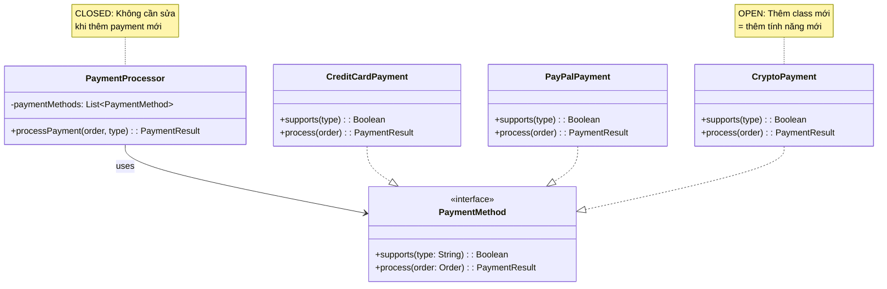
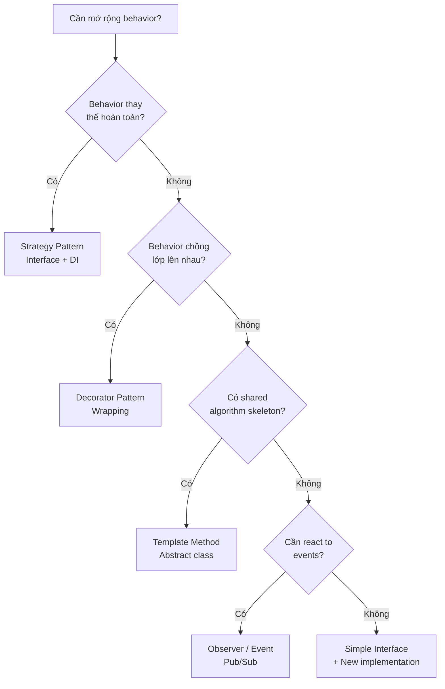

# O — Open/Closed Principle (OCP)

> *"Software entities (classes, modules, functions) should be open for extension, but closed for modification."*
> — Bertrand Meyer, "Object-Oriented Software Construction" (1988)

---

## 1. Bản Chất Của OCP

### 1.1. Hai định nghĩa quan trọng

**Bertrand Meyer (1988) — Phiên bản gốc (Inheritance-based)**:
> Một module là *open* nếu nó vẫn có thể mở rộng. Một module là *closed* nếu nó đã sẵn sàng để sử dụng bởi module khác. → Sử dụng **kế thừa** để mở rộng.

**Robert C. Martin (1996) — Phiên bản hiện đại (Polymorphism-based)**:
> Mở rộng hành vi mà **không sửa source code đang hoạt động**. → Sử dụng **abstraction + polymorphism**.

```
Meyer (1988):   Mở rộng = Kế thừa class cụ thể
Martin (1996):  Mở rộng = Implement interface / Override abstract method
                         ← ĐÂY LÀ CÁCH HIỆN ĐẠI ✅
```

### 1.2. Giải thích trực giác

Hãy tưởng tượng bạn có một chiếc **ổ cắm điện** (interface):
- **Open for extension**: Bạn có thể cắm bất kỳ thiết bị nào vào ổ cắm (quạt, đèn, máy tính...)
- **Closed for modification**: Bạn **không cần đập tường để thay đổi hệ thống dây điện** mỗi khi mua thiết bị mới

### 1.3. Tại sao quan trọng?

| Khi vi phạm OCP | Hậu quả |
|---|---|
| Sửa code cũ để thêm tính năng mới | Code cũ đã test → phải test lại toàn bộ |
| Chuỗi if/else hoặc switch dài dằng dặc | Mỗi lần thêm case → chỉnh core logic |
| Merge conflict khi nhiều dev cùng thêm feature | Tất cả sửa cùng 1 file |
| Regression bugs | Sửa cho feature A → phá feature B |

---

## 2. Ví Dụ Minh Họa Chi Tiết

### 2.1. Ví dụ 1: Payment Processing

#### ❌ Vi phạm OCP — Switch Statement Hell

```kotlin
class PaymentProcessor {
    fun processPayment(order: Order, paymentType: String) {
        when (paymentType) {
            "CREDIT_CARD" -> {
                // Validate card number
                // Charge via Stripe API
                // Handle 3D Secure
                println("Processing credit card payment: $${order.total}")
            }
            "PAYPAL" -> {
                // Redirect to PayPal
                // Verify PayPal callback
                println("Processing PayPal payment: $${order.total}")
            }
            "BANK_TRANSFER" -> {
                // Generate bank reference
                // Create pending transfer
                println("Processing bank transfer: $${order.total}")
            }
            // 🔴 Mỗi lần thêm phương thức thanh toán mới (crypto, Apple Pay, ...)
            // → PHẢI SỬA file này
            // → Phải test lại TẤT CẢ các case cũ
            else -> throw IllegalArgumentException("Unknown payment: $paymentType")
        }
    }
}
```

**Vấn đề**: Thêm "CRYPTO" → sửa `PaymentProcessor` → toàn bộ payment logic phải test lại.

#### ✅ Tuân thủ OCP — Strategy Pattern

```kotlin
// === Abstraction (CLOSED for modification) ===
interface PaymentMethod {
    fun supports(type: String): Boolean
    fun process(order: Order): PaymentResult
}

// === Concrete strategies (OPEN for extension) ===
class CreditCardPayment(
    private val stripeClient: StripeClient
) : PaymentMethod {
    override fun supports(type: String) = type == "CREDIT_CARD"
    
    override fun process(order: Order): PaymentResult {
        val charge = stripeClient.charge(order.total, order.currency)
        return PaymentResult(
            success = charge.status == "succeeded",
            transactionId = charge.id
        )
    }
}

class PayPalPayment(
    private val paypalClient: PayPalClient
) : PaymentMethod {
    override fun supports(type: String) = type == "PAYPAL"
    
    override fun process(order: Order): PaymentResult {
        val payment = paypalClient.createPayment(order.total)
        return PaymentResult(
            success = payment.isApproved,
            transactionId = payment.id
        )
    }
}

class BankTransferPayment : PaymentMethod {
    override fun supports(type: String) = type == "BANK_TRANSFER"
    
    override fun process(order: Order): PaymentResult {
        val reference = generateBankReference()
        return PaymentResult(success = true, transactionId = reference)
    }
    
    private fun generateBankReference(): String = "BT-${System.currentTimeMillis()}"
}

// 🟢 Thêm crypto? Chỉ cần tạo CLASS MỚI, KHÔNG sửa gì cả!
class CryptoPayment(
    private val web3Client: Web3Client
) : PaymentMethod {
    override fun supports(type: String) = type == "CRYPTO"
    
    override fun process(order: Order): PaymentResult {
        val tx = web3Client.sendTransaction(order.total)
        return PaymentResult(success = tx.confirmed, transactionId = tx.hash)
    }
}

// === Processor — CLOSED, không bao giờ cần sửa ===
class PaymentProcessor(
    private val paymentMethods: List<PaymentMethod>  // Inject qua DI
) {
    fun processPayment(order: Order, paymentType: String): PaymentResult {
        val method = paymentMethods.find { it.supports(paymentType) }
            ?: throw UnsupportedPaymentException(paymentType)
        return method.process(order)
    }
}
```



### 2.2. Ví dụ 2: Notification System

#### ❌ Vi phạm OCP

```kotlin
class NotificationService {
    fun notify(user: User, message: String, channel: String) {
        when (channel) {
            "EMAIL" -> {
                val emailClient = SmtpClient("smtp.gmail.com")
                emailClient.send(user.email, "Notification", message)
            }
            "SMS" -> {
                val smsClient = TwilioClient(apiKey)
                smsClient.sendSms(user.phone, message)
            }
            "PUSH" -> {
                val pushClient = FirebaseClient(serverKey)
                pushClient.sendPush(user.deviceToken, message)
            }
            // Thêm Slack? Telegram? Webhook? → SỬA FILE NÀY
        }
    }
}
```

#### ✅ Tuân thủ OCP

```kotlin
// Abstraction
interface NotificationChannel {
    val channelType: String
    fun send(recipient: User, message: String): DeliveryResult
}

// Implementations — mỗi file riêng, test riêng
class EmailChannel(private val smtpClient: SmtpClient) : NotificationChannel {
    override val channelType = "EMAIL"
    override fun send(recipient: User, message: String): DeliveryResult {
        smtpClient.send(recipient.email, "Notification", message)
        return DeliveryResult.success(channelType)
    }
}

class SmsChannel(private val twilioClient: TwilioClient) : NotificationChannel {
    override val channelType = "SMS"
    override fun send(recipient: User, message: String): DeliveryResult {
        twilioClient.sendSms(recipient.phone, message)
        return DeliveryResult.success(channelType)
    }
}

// 🟢 Thêm Slack — chỉ tạo file mới!
class SlackChannel(private val slackClient: SlackWebhookClient) : NotificationChannel {
    override val channelType = "SLACK"
    override fun send(recipient: User, message: String): DeliveryResult {
        slackClient.postMessage(recipient.slackId, message)
        return DeliveryResult.success(channelType)
    }
}

// Service KHÔNG BAO GIỜ thay đổi
class NotificationService(
    private val channels: Map<String, NotificationChannel>
) {
    fun notify(user: User, message: String, channelType: String): DeliveryResult {
        val channel = channels[channelType]
            ?: throw UnsupportedChannelException(channelType)
        return channel.send(user, message)
    }
    
    fun notifyAll(user: User, message: String): List<DeliveryResult> {
        return channels.values.map { it.send(user, message) }
    }
}
```

### 2.3. Ví dụ 3: Discount Calculator — Decorator Pattern

```kotlin
// Base interface
interface PriceCalculator {
    fun calculate(basePrice: Double): Double
}

// Core implementation (CLOSED)
class StandardPriceCalculator : PriceCalculator {
    override fun calculate(basePrice: Double) = basePrice
}

// Decorators — mở rộng bằng composition (OPEN)
class SeasonalDiscount(
    private val wrapped: PriceCalculator,
    private val discountRate: Double
) : PriceCalculator {
    override fun calculate(basePrice: Double): Double {
        return wrapped.calculate(basePrice) * (1 - discountRate)
    }
}

class LoyaltyDiscount(
    private val wrapped: PriceCalculator,
    private val loyaltyYears: Int
) : PriceCalculator {
    override fun calculate(basePrice: Double): Double {
        val discount = minOf(loyaltyYears * 0.02, 0.15)  // Max 15%
        return wrapped.calculate(basePrice) * (1 - discount)
    }
}

class TaxCalculator(
    private val wrapped: PriceCalculator,
    private val taxRate: Double
) : PriceCalculator {
    override fun calculate(basePrice: Double): Double {
        return wrapped.calculate(basePrice) * (1 + taxRate)
    }
}

// Sử dụng — kết hợp linh hoạt, KHÔNG sửa code cũ
fun main() {
    val calculator = TaxCalculator(
        wrapped = LoyaltyDiscount(
            wrapped = SeasonalDiscount(
                wrapped = StandardPriceCalculator(),
                discountRate = 0.10  // Giảm 10% mùa sale
            ),
            loyaltyYears = 5  // Khách hàng 5 năm
        ),
        taxRate = 0.08  // VAT 8%
    )
    
    println(calculator.calculate(1000.0))
    // 1000 → 900 (seasonal) → 810 (loyalty 10%) → 874.8 (tax)
}
```

---

## 3. Các Kỹ Thuật Đạt OCP

### 3.1. Ma trận kỹ thuật

| Kỹ thuật | Cơ chế | Use case chính | Design Pattern |
|----------|--------|----------------|----------------|
| **Interface + Polymorphism** | Runtime dispatch | Thay đổi behavior | Strategy |
| **Abstract class + Template** | Inheritance | Chia sẻ skeleton + hook | Template Method |
| **Decorator / Wrapper** | Composition | Thêm behavior chồng lớp | Decorator |
| **Plugin / Registry** | Discover + Load | Mở rộng ở deployment time | Plugin Architecture |
| **Event / Observer** | Pub/Sub | Decoupled reactions | Observer |
| **Configuration** | External config | Thay đổi không cần code | Feature Flag |

### 3.2. Decision flowchart



---

## 4. Dấu Hiệu Vi Phạm OCP

| # | Code Smell | Ví dụ | Fix |
|---|-----------|-------|-----|
| 1 | `when/switch` trên **type** | `when (shape) { is Circle, is Square... }` | Interface + polymorphism |
| 2 | `if/else` chain dài | `if (format == "PDF") ... else if (format == "CSV") ...` | Strategy pattern |
| 3 | Sửa class cũ khi thêm feature | Thêm payment method → sửa `PaymentService` | New class implement interface |
| 4 | `instanceof` / `is` checks | `if (animal is Dog) ... else if (animal is Cat) ...` | Override method trong subclass |
| 5 | Magic strings / constants | `if (type == "PREMIUM")` | Enum + Strategy |

---

## 5. Khi NÀO Không Nên Áp Dụng OCP

### 5.1. Premature Abstraction — Sai lầm #1

```kotlin
// ❌ OVER-ENGINEERING: CRUD đơn giản không cần OCP
interface UserSaveStrategy { fun save(user: User) }
class DatabaseUserSaver : UserSaveStrategy { ... }
class FileUserSaver : UserSaveStrategy { ... }      // Sẽ KHÔNG BAO GIỜ dùng!
class InMemoryUserSaver : UserSaveStrategy { ... }   // Chỉ dùng trong test

// ✅ Đơn giản hơn — extract interface KHI CẦN
class UserRepository(private val jdbcTemplate: JdbcTemplate) {
    fun save(user: User) {
        jdbcTemplate.update("INSERT INTO users ...", user.name, user.email)
    }
}
```

### 5.2. Rule of Three

> **Đừng abstract hóa cho đến khi bạn thấy pattern lặp lại LẦN THỨ BA.**

```
Lần 1: Viết code trực tiếp
Lần 2: Copy-paste + nhận ra sự lặp lại
Lần 3: ĐÂY là lúc refactor → extract interface → áp dụng OCP
```

### 5.3. Bảng quyết định

| Câu hỏi | Có → | Không → |
|---------|------|---------|
| Feature này sẽ có thêm biến thể trong tương lai gần? | Áp dụng OCP | Giữ đơn giản |
| Đã có >= 3 biến thể? | Áp dụng OCP | Rule of Three |
| Thay đổi code cũ gây regression risk cao? | Áp dụng OCP | Giữ đơn giản |
| Code này stable > 1 năm không thay đổi? | Giữ đơn giản | Xem xét OCP |

---

## 6. OCP Trong Kiến Trúc Hiện Đại

### 6.1. Plugin Architecture

```kotlin
// Plugin interface
interface ExportPlugin {
    val format: String
    fun export(data: ReportData): ByteArray
}

// Plugin registry — tự động discover
class ExportRegistry {
    private val plugins = mutableMapOf<String, ExportPlugin>()
    
    fun register(plugin: ExportPlugin) {
        plugins[plugin.format] = plugin
    }
    
    fun export(data: ReportData, format: String): ByteArray {
        val plugin = plugins[format]
            ?: throw UnsupportedFormatException(format)
        return plugin.export(data)
    }
}

// Spring Boot auto-registration
@Configuration
class ExportConfig {
    @Bean
    fun exportRegistry(plugins: List<ExportPlugin>) = ExportRegistry().apply {
        plugins.forEach { register(it) }
    }
}

// Thêm format mới = thêm @Component class mới, ZERO modification
@Component
class PdfExportPlugin : ExportPlugin {
    override val format = "PDF"
    override fun export(data: ReportData): ByteArray { ... }
}

@Component
class ExcelExportPlugin : ExportPlugin {
    override val format = "EXCEL"
    override fun export(data: ReportData): ByteArray { ... }
}
```

### 6.2. Event-Driven Architecture

```kotlin
// Core domain event (CLOSED)
data class OrderPlacedEvent(
    val orderId: String,
    val customerId: String,
    val totalAmount: Double,
    val timestamp: Instant
)

// Event publisher (CLOSED)
@Service
class OrderService(private val eventPublisher: ApplicationEventPublisher) {
    fun placeOrder(order: Order) {
        // ... process order ...
        eventPublisher.publishEvent(OrderPlacedEvent(
            orderId = order.id,
            customerId = order.customerId,
            totalAmount = order.total,
            timestamp = Instant.now()
        ))
    }
}

// Listeners — OPEN, thêm bao nhiêu cũng được
@Component
class InventoryListener {
    @EventListener
    fun onOrderPlaced(event: OrderPlacedEvent) {
        // Giảm tồn kho
    }
}

@Component
class EmailListener {
    @EventListener
    fun onOrderPlaced(event: OrderPlacedEvent) {
        // Gửi email xác nhận
    }
}

// 🟢 Thêm analytics tracking? Chỉ thêm listener mới!
@Component
class AnalyticsListener {
    @EventListener
    fun onOrderPlaced(event: OrderPlacedEvent) {
        // Track conversion
    }
}
```

---

## 7. Mối Quan Hệ Với Các Nguyên Tắc Khác

| Nguyên tắc | Quan hệ với OCP |
|---|---|
| **SRP** | Class có 1 trách nhiệm → dễ mở rộng đúng chỗ |
| **LSP** | Subtype đúng contract → mở rộng an toàn, không phá client |
| **ISP** | Interface nhỏ → dễ implement extension mới |
| **DIP** | Phụ thuộc abstraction → swap implementation = mở rộng |

---

## 8. Tóm Tắt

```
┌─────────────────────────────────────────────────────┐
│                    OCP CHEAT SHEET                   │
├─────────────────────────────────────────────────────┤
│                                                     │
│  CỐT LÕI: Thêm tính năng = THÊM CODE MỚI          │
│            Không phải SỬA CODE CŨ                   │
│                                                     │
│  KỸ THUẬT:                                          │
│    → Strategy: thay đổi behavior                    │
│    → Decorator: chồng behavior                      │
│    → Template Method: chia sẻ skeleton              │
│    → Observer/Event: decouple reactions              │
│    → Plugin: mở rộng ở deployment time              │
│                                                     │
│  ⚠️ TRÁNH:                                         │
│    → Premature abstraction (chưa cần đã abstract)   │
│    → switch/if trên type                            │
│    → Sửa core logic khi thêm feature                │
│                                                     │
│  RULE OF THREE:                                     │
│    Lần 1 → viết trực tiếp                           │
│    Lần 2 → nhận ra pattern                          │
│    Lần 3 → extract + áp dụng OCP                    │
│                                                     │
└─────────────────────────────────────────────────────┘
```
