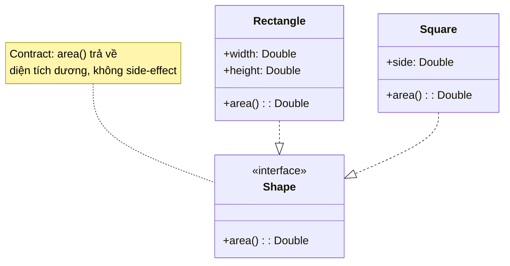
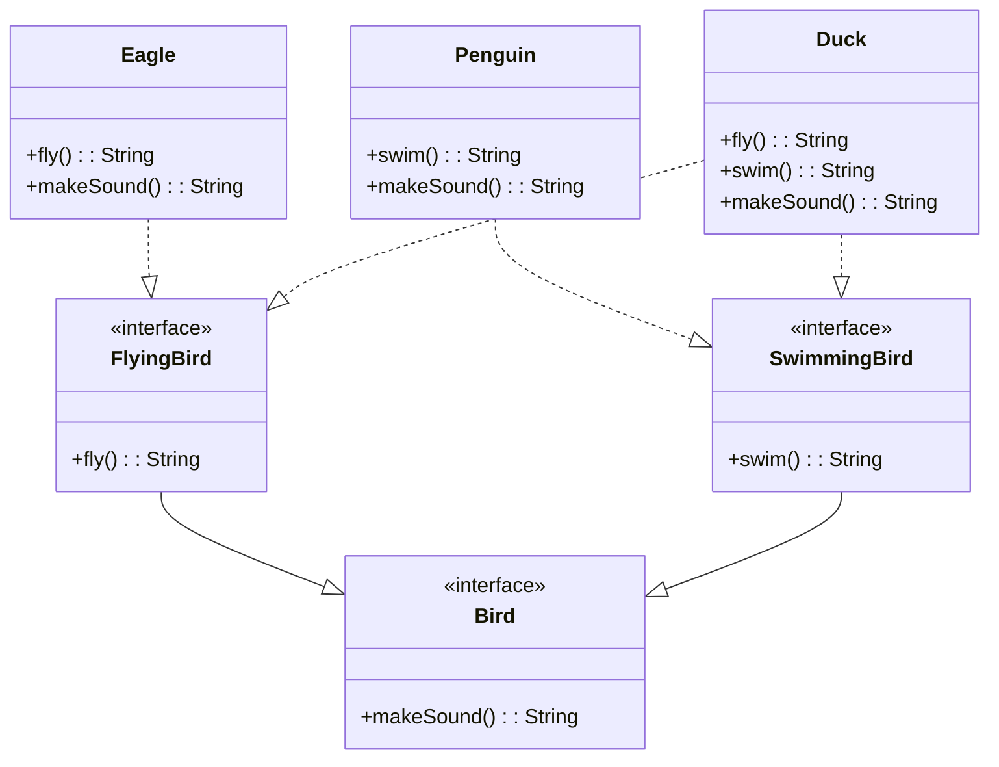

# L — Liskov Substitution Principle (LSP)

> *"If S is a subtype of T, then objects of type T may be replaced with objects of type S without altering any of the desirable properties of the program."*
> — Barbara Liskov & Jeannette Wing, 1994

---

## 1. Bản Chất Của LSP

### 1.1. Nguồn gốc

Barbara Liskov đề xuất nguyên tắc này trong bài giảng **"Data Abstraction and Hierarchy"** (1987) tại hội nghị OOPSLA. Phiên bản chính thức được Liskov & Wing công bố năm 1994.

### 1.2. Định nghĩa dễ hiểu

```
Nếu bạn có một function nhận tham số kiểu Parent,
thì truyền vào bất kỳ Child nào cũng PHẢI hoạt động đúng.

function doSomething(parent: Parent) { ... }

doSomething(child1)  // ✅ Phải hoạt động đúng
doSomething(child2)  // ✅ Phải hoạt động đúng
doSomething(child3)  // ✅ Phải hoạt động đúng
```

**Nói cách khác**: Subclass **phải giữ đúng "lời hứa" (contract)** của parent class. Client code không cần biết — và không nên cần biết — nó đang làm việc với subclass nào.

### 1.3. LSP khác "is-a" thông thường

Nhiều developer hiểu kế thừa theo kiểu:
- "Square **is-a** Rectangle" → `Square extends Rectangle` ✅?

LSP nói: **"is-a" phải đúng về MẶT HÀNH VI, không chỉ về mặt ngữ nghĩa.**
- Square **IS-A** Rectangle (về toán học) → Đúng
- Square **BEHAVES-AS-A** Rectangle (về phần mềm) → **SAI!**

### 1.4. Tại sao quan trọng?

| Khi vi phạm LSP | Hậu quả |
|---|---|
| Subclass thay đổi hành vi parent | Client code bị crash hoặc ra kết quả sai |
| Xuất hiện `instanceof` / `is` checks | Phá vỡ polymorphism |
| Subclass throw exception parent không throw | Client không handle được |
| Override method nhưng làm "ngược lại" | Bugs rất khó debug |

---

## 2. Ví Dụ Minh Họa Chi Tiết

### 2.1. Ví dụ kinh điển: Rectangle vs Square

#### ❌ Vi phạm LSP

```kotlin
open class Rectangle(
    open var width: Double,
    open var height: Double
) {
    open fun area(): Double = width * height
}

class Square(side: Double) : Rectangle(side, side) {
    override var width: Double = side
        set(value) {
            field = value
            super.height = value  // Bắt buộc width == height
        }
    
    override var height: Double = side
        set(value) {
            field = value
            super.width = value   // Bắt buộc width == height
        }
}

// Client code — hoạt động đúng với Rectangle
fun resizeAndCheck(rect: Rectangle) {
    rect.width = 5.0
    rect.height = 10.0
    
    // Expectation: area = 5 * 10 = 50
    assert(rect.area() == 50.0) { 
        "Expected 50, got ${rect.area()}" 
    }
}

fun main() {
    resizeAndCheck(Rectangle(2.0, 3.0))  // ✅ Pass: 50.0
    resizeAndCheck(Square(4.0))           // ❌ FAIL: 100.0 (10 * 10)
}
```

**Tại sao fail?** Khi set `height = 10`, Square cũng set `width = 10` → area = 100, **phá vỡ contract** mà Rectangle đã "hứa".

#### ✅ Tuân thủ LSP — Dùng interface chung

```kotlin
// Không dùng inheritance — dùng shared interface
interface Shape {
    fun area(): Double
}

// Rectangle và Square là NGANG HÀNG, không phải cha-con
data class Rectangle(val width: Double, val height: Double) : Shape {
    override fun area() = width * height
}

data class Square(val side: Double) : Shape {
    override fun area() = side * side
}

// Client code — hoạt động đúng với MỌI Shape
fun printArea(shape: Shape) {
    println("Area: ${shape.area()}")
}

fun main() {
    printArea(Rectangle(5.0, 10.0))  // ✅ Area: 50.0
    printArea(Square(7.0))            // ✅ Area: 49.0
}
```



### 2.2. Ví dụ thực tế: Bird Hierarchy

#### ❌ Vi phạm LSP

```kotlin
open class Bird {
    open fun fly(): String = "Flying high!"
    open fun makeSound(): String = "Tweet!"
}

class Eagle : Bird() {
    override fun fly() = "Soaring like an eagle!"
    override fun makeSound() = "Screech!"
}

class Penguin : Bird() {
    override fun fly(): String {
        throw UnsupportedOperationException("Penguins can't fly!")
        // ❌ Vi phạm LSP: Parent "hứa" fly() trả về String
        //    nhưng subclass throw exception
    }
    override fun makeSound() = "Squawk!"
}

// Client code
fun makeBirdFly(bird: Bird) {
    println(bird.fly())  // 💥 Crash khi truyền Penguin
}
```

#### ✅ Tuân thủ LSP — Tách interface

```kotlin
interface Bird {
    fun makeSound(): String
}

interface FlyingBird : Bird {
    fun fly(): String
}

interface SwimmingBird : Bird {
    fun swim(): String
}

class Eagle : FlyingBird {
    override fun fly() = "Soaring like an eagle!"
    override fun makeSound() = "Screech!"
}

class Penguin : SwimmingBird {
    override fun swim() = "Swimming gracefully!"
    override fun makeSound() = "Squawk!"
}

class Duck : FlyingBird, SwimmingBird {
    override fun fly() = "Flying awkwardly!"
    override fun swim() = "Paddling along!"
    override fun makeSound() = "Quack!"
}

// Client code — type-safe, không bao giờ crash
fun makeBirdFly(bird: FlyingBird) {
    println(bird.fly())  // ✅ Chỉ nhận bird thực sự fly được
}

fun makeBirdSwim(bird: SwimmingBird) {
    println(bird.swim()) // ✅ Chỉ nhận bird thực sự swim được
}
```



### 2.3. Ví dụ thực tế: Collection — ReadOnly vs Mutable

#### ❌ Vi phạm LSP

```kotlin
open class MyList<T> {
    protected val items = mutableListOf<T>()
    
    open fun add(item: T) { items.add(item) }
    open fun get(index: Int): T = items[index]
    open fun size(): Int = items.size
}

class ReadOnlyList<T>(initialItems: List<T>) : MyList<T>() {
    init { items.addAll(initialItems) }
    
    override fun add(item: T) {
        throw UnsupportedOperationException("Cannot add to read-only list!")
        // ❌ Parent "hứa" add() hoạt động, nhưng subclass từ chối
    }
}
```

#### ✅ Tuân thủ LSP — Kotlin's approach

```kotlin
// Kotlin standard library làm đúng LSP:
interface Collection<out E> {    // Read-only
    val size: Int
    fun contains(element: E): Boolean
    fun iterator(): Iterator<E>
}

interface MutableCollection<E> : Collection<E> {  // Mutable
    fun add(element: E): Boolean
    fun remove(element: E): Boolean
    fun clear()
}

// MutableCollection IS-A Collection ✅ (thêm capability, không phá contract)
// Collection KHÔNG IS-A MutableCollection (thiếu capability)
```

---

## 3. Quy Tắc Chi Tiết Của LSP

### 3.1. Contract Rules (Design by Contract — Bertrand Meyer)

| Quy tắc | Ý nghĩa | Ví dụ |
|---------|---------|-------|
| **Precondition không được mạnh hơn** | Subclass không được yêu cầu input chặt hơn parent | Parent nhận `Int`, subclass không được chỉ nhận `Int > 0` |
| **Postcondition không được yếu hơn** | Subclass phải đảm bảo output ít nhất bằng parent | Parent hứa trả `non-null`, subclass không được trả `null` |
| **Invariant phải giữ nguyên** | Thuộc tính bất biến của parent phải được bảo toàn | `balance >= 0` phải luôn đúng ở mọi subclass |

### 3.2. Behavioral Subtyping Rules

```kotlin
// === PRECONDITION: Subclass KHÔNG ĐƯỢC chặt hơn ===

// Parent
open class Calculator {
    open fun divide(a: Double, b: Double): Double {
        require(b != 0.0) { "Cannot divide by zero" }  // Precondition
        return a / b
    }
}

// ❌ Subclass chặt hơn — vi phạm LSP
class StrictCalculator : Calculator() {
    override fun divide(a: Double, b: Double): Double {
        require(a > 0 && b > 0) { "Both must be positive" }  // CHẶT HƠN!
        return a / b
    }
}

// ✅ Subclass lỏng hơn hoặc bằng — OK
class LenientCalculator : Calculator() {
    override fun divide(a: Double, b: Double): Double {
        if (b == 0.0) return Double.POSITIVE_INFINITY  // LỎNG HƠN — chấp nhận
        return a / b
    }
}
```

```kotlin
// === POSTCONDITION: Subclass KHÔNG ĐƯỢC yếu hơn ===

interface UserRepository {
    /** Trả về User, throw NotFoundException nếu không tìm thấy */
    fun findById(id: String): User  // Postcondition: non-null User
}

// ❌ Vi phạm — trả null trong khi contract nói non-null
class BadUserRepo : UserRepository {
    override fun findById(id: String): User {
        return cache[id]!!  // Có thể throw NPE — không phải NotFoundException
    }
}

// ✅ Tuân thủ
class GoodUserRepo(private val dataSource: DataSource) : UserRepository {
    override fun findById(id: String): User {
        return dataSource.query("SELECT * FROM users WHERE id = ?", id)
            ?: throw NotFoundException("User $id not found")
    }
}
```

### 3.3. Exception Rules

```
Subclass KHÔNG ĐƯỢC throw exception mà Parent KHÔNG throw.
(Trừ khi exception đó là subtype của exception parent throw)

Parent throws: IOException
  ✅ Subclass throws: FileNotFoundException (subtype of IOException)
  ❌ Subclass throws: SecurityException (unrelated)
  ❌ Subclass throws: UnsupportedOperationException (phá contract)
```

---

## 4. Dấu Hiệu Vi Phạm LSP

### 4.1. Checklist

| # | Dấu hiệu | Ví dụ | Mức độ |
|---|-----------|-------|--------|
| 1 | `instanceof` / `is` check trong client | `if (shape is Square)` | 🔴 |
| 2 | Override method nhưng throw exception | `throw UnsupportedOperationException` | 🔴 |
| 3 | Override method nhưng return khác | Parent trả list, child trả empty luôn | 🟡 |
| 4 | Empty override (no-op) | `override fun save() { /* nothing */ }` | 🔴 |
| 5 | Subclass cần thêm precondition | `require(amount > 100)` khi parent không có | 🔴 |
| 6 | Client code cần biết concrete type | Downcasting để gọi method riêng | 🔴 |

### 4.2. Smell test

```kotlin
// ❌ Nếu bạn viết code kiểu này → đang vi phạm LSP
fun process(account: Account) {
    if (account is SavingsAccount) {
        // Xử lý riêng cho savings
    } else if (account is CheckingAccount) {
        // Xử lý riêng cho checking
    } else if (account is InvestmentAccount) {
        // Xử lý riêng cho investment
    }
    // → Polymorphism bị phá vỡ
    //   Account hierarchy không thỏa mãn LSP
}

// ✅ Nếu LSP đúng → polymorphism tự nhiên
fun process(account: Account) {
    val fee = account.calculateMonthlyFee()   // Mỗi subtype tự tính
    val interest = account.calculateInterest() // Mỗi subtype tự tính
    account.applyCharges(fee, interest)
}
```

---

## 5. Ngữ Cảnh Sử Dụng

### 5.1. Khi thiết kế Inheritance Hierarchy

| Câu hỏi | Nếu trả lời "Không" → |
|---------|------------------------|
| Subclass có thể thay thế parent ở MỌI nơi? | Đừng dùng inheritance |
| Mọi method override đều giữ đúng contract? | Tách interface hoặc redesign |
| Client code hoạt động đúng mà không cần biết concrete type? | Hierarchy sai |

### 5.2. Favor Composition over Inheritance

```kotlin
// ❌ Inheritance sai — Stack IS-A List?
class Stack<T> : ArrayList<T>() {
    fun push(item: T) = add(item)
    fun pop(): T = removeAt(size - 1)
    // Nhưng user vẫn gọi được: stack.add(0, item) → phá logic Stack!
}

// ✅ Composition — Stack HAS-A list
class Stack<T> {
    private val items = mutableListOf<T>()  // HAS-A, not IS-A
    
    fun push(item: T) { items.add(item) }
    fun pop(): T = items.removeAt(items.size - 1)
    fun peek(): T = items.last()
    fun isEmpty(): Boolean = items.isEmpty()
    // Không expose add(index), remove(index), get(index)
}
```

---

## 6. LSP Trong Thế Giới Thực

### 6.1. Java/Kotlin Collections

```
✅ ArrayList implements List       — Mọi nơi dùng List đều dùng được ArrayList
✅ LinkedList implements List      — Mọi nơi dùng List đều dùng được LinkedList
✅ HashSet implements Set          — Mọi nơi dùng Set đều dùng được HashSet

⚠️ Collections.unmodifiableList() — Trả về List nhưng throw khi add()
   → Đây thực sự vi phạm LSP! (nhưng Java chấp nhận tradeoff này)

✅ Kotlin giải quyết bằng: List (read-only) vs MutableList (mutable)
   → LSP-compliant hierarchy
```

### 6.2. Spring Framework

```kotlin
// Spring repository hierarchy — LSP compliant
interface CrudRepository<T, ID> {
    fun save(entity: T): T
    fun findById(id: ID): Optional<T>
    fun findAll(): Iterable<T>
    fun deleteById(id: ID)
}

interface JpaRepository<T, ID> : CrudRepository<T, ID> {
    fun flush()
    fun saveAndFlush(entity: T): T
    // Thêm capability, không phá contract cũ → ✅ LSP
}

// Mọi nơi dùng CrudRepository đều có thể nhận JpaRepository → OK
```

---

## 7. Tóm Tắt

```
┌─────────────────────────────────────────────────────┐
│                    LSP CHEAT SHEET                   │
├─────────────────────────────────────────────────────┤
│                                                     │
│  CỐT LÕI: Subclass PHẢI thay thế được parent       │
│            mà CLIENT CODE KHÔNG CẦN BIẾT            │
│                                                     │
│  QUY TẮC:                                           │
│    → Precondition: không chặt hơn parent            │
│    → Postcondition: không yếu hơn parent            │
│    → Invariant: giữ nguyên                          │
│    → Exception: không throw loại mới                │
│                                                     │
│  DẤU HIỆU VI PHẠM:                                 │
│    → instanceof / is checks                         │
│    → throw UnsupportedOperationException             │
│    → Empty overrides (no-op)                        │
│    → Client cần biết concrete type                  │
│                                                     │
│  GIẢI PHÁP:                                         │
│    → Tách interface thay vì deep inheritance        │
│    → Composition over Inheritance                   │
│    → "IS-A" phải đúng về HÀNH VI, không chỉ ngữ    │
│      nghĩa                                         │
│                                                     │
└─────────────────────────────────────────────────────┘
```
