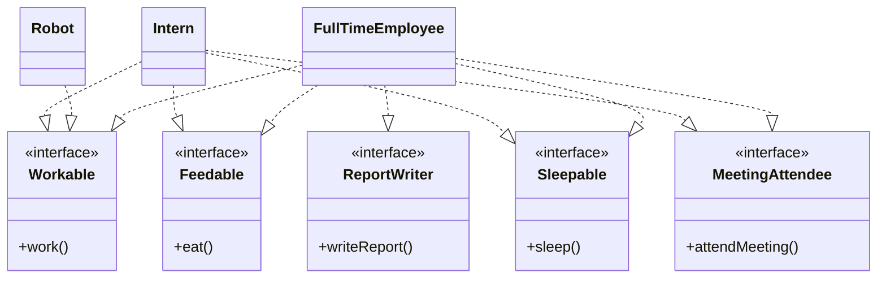
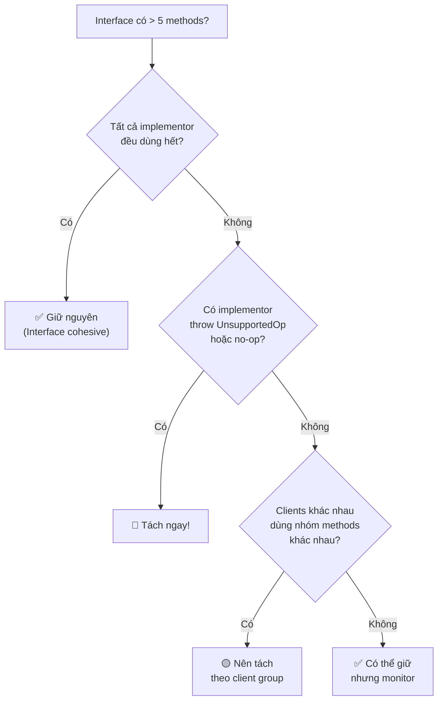
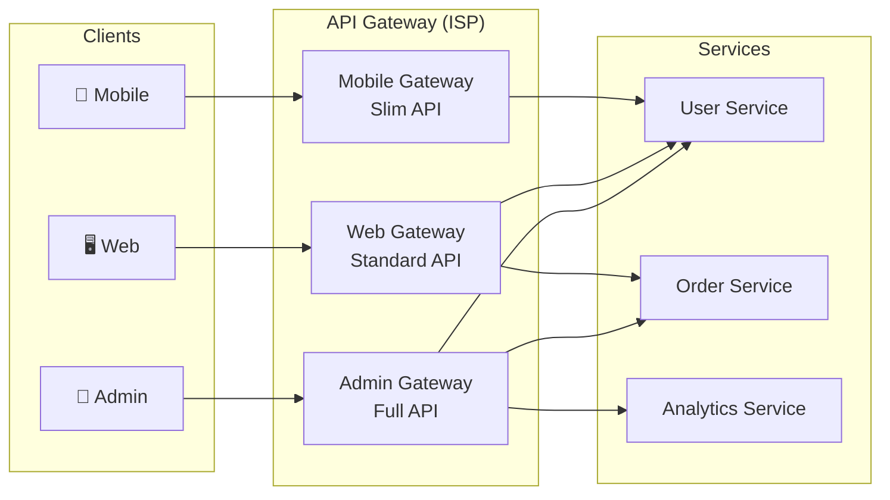

# I — Interface Segregation Principle (ISP)

> *"Clients should not be forced to depend on methods they do not use."*
> — Robert C. Martin

---

## 1. Bản Chất Của ISP

### 1.1. Định nghĩa chính xác

ISP nói rằng: **Không nên ép một class implement những method mà nó không cần**. Thay vì có một interface lớn (fat interface), hãy tách thành nhiều interface nhỏ, mỗi cái phục vụ một nhóm client cụ thể.

### 1.2. Giải thích trực giác

Hãy tưởng tượng bạn đến nhà hàng:
- **Fat interface**: Menu 200 món, bạn chỉ ăn phở nhưng phải đọc hết cả quyển menu
- **Segregated interface**: Menu riêng cho "Phở", "Cơm", "Đồ uống" — bạn chỉ cầm menu bạn cần

### 1.3. ISP vs SRP

| | SRP | ISP |
|---|---|---|
| **Góc nhìn** | Từ **bên trong** class | Từ **bên ngoài** (client) |
| **Câu hỏi** | "Class này có bao nhiêu lý do thay đổi?" | "Client có bị ép phụ thuộc method không dùng?" |
| **Đối tượng** | Class/module | Interface |
| **Quan hệ** | Bổ sung cho nhau | Bổ sung cho nhau |

### 1.4. Tại sao quan trọng?

| Khi vi phạm ISP | Hậu quả |
|---|---|
| Client phụ thuộc method không dùng | Thay đổi method A → recompile/redeploy client chỉ dùng method B |
| Interface quá lớn | Implement phải viết empty stub methods |
| Coupling không cần thiết | Sửa 1 method → ảnh hưởng mọi implementor |
| Test khó khăn | Mock phải implement 20 methods dù test chỉ cần 2 |

---

## 2. Ví Dụ Minh Họa Chi Tiết

### 2.1. Ví dụ 1: Worker — Bài toán kinh điển

#### ❌ Vi phạm ISP — Fat Interface

```kotlin
interface Worker {
    fun work()
    fun eat()
    fun sleep()
    fun attendMeeting()
    fun writeReport()
}

// Nhân viên full-time — implement tất cả ✅ (nhưng interface quá lớn)
class FullTimeEmployee : Worker {
    override fun work() = println("Working 8 hours")
    override fun eat() = println("Lunch break")
    override fun sleep() = println("Going home to sleep")
    override fun attendMeeting() = println("In meeting room")
    override fun writeReport() = println("Writing monthly report")
}

// Robot — bị ÉP implement eat() và sleep()
class Robot : Worker {
    override fun work() = println("Working 24/7")
    
    override fun eat() {
        // ❌ Robot không ăn! Nhưng bị ÉP implement
        throw UnsupportedOperationException("Robots don't eat!")
    }
    
    override fun sleep() {
        // ❌ Robot không ngủ! Nhưng bị ÉP implement
        throw UnsupportedOperationException("Robots don't sleep!")
    }
    
    override fun attendMeeting() {
        // ❌ Robot không họp!
        // Empty method — "no-op" = code smell
    }
    
    override fun writeReport() {
        // ❌ Robot không viết báo cáo!
    }
}

// Intern — bị ÉP implement writeReport()
class Intern : Worker {
    override fun work() = println("Working and learning")
    override fun eat() = println("Eating at cafeteria")
    override fun sleep() = println("Need more sleep!")
    override fun attendMeeting() = println("Observing meeting")
    
    override fun writeReport() {
        // ❌ Intern không viết report! Nhưng bị ÉP implement
        throw UnsupportedOperationException("Interns don't write reports")
    }
}
```

#### ✅ Tuân thủ ISP — Segregated Interfaces

```kotlin
// Tách theo capability/role
interface Workable {
    fun work()
}

interface Feedable {
    fun eat()
}

interface Sleepable {
    fun sleep()
}

interface MeetingAttendee {
    fun attendMeeting()
}

interface ReportWriter {
    fun writeReport()
}

// Full-time employee — implement đúng những gì cần
class FullTimeEmployee : Workable, Feedable, Sleepable, 
                          MeetingAttendee, ReportWriter {
    override fun work() = println("Working 8 hours")
    override fun eat() = println("Lunch break")
    override fun sleep() = println("Going home to sleep")
    override fun attendMeeting() = println("In meeting room")
    override fun writeReport() = println("Writing monthly report")
}

// Robot — chỉ implement Workable
class Robot : Workable {
    override fun work() = println("Working 24/7 without breaks")
}

// Intern — implement đúng capabilities của intern
class Intern : Workable, Feedable, Sleepable, MeetingAttendee {
    override fun work() = println("Working and learning")
    override fun eat() = println("Eating at cafeteria")
    override fun sleep() = println("Need more sleep!")
    override fun attendMeeting() = println("Observing meeting")
}
```



### 2.2. Ví dụ thực tế: Repository Pattern

#### ❌ Vi phạm ISP — God Repository Interface

```kotlin
interface UserRepository {
    // CRUD cơ bản
    fun save(user: User): User
    fun findById(id: String): User?
    fun findAll(): List<User>
    fun delete(id: String)
    
    // Search & Filter
    fun findByEmail(email: String): User?
    fun findByStatus(status: UserStatus): List<User>
    fun searchByName(query: String, page: Int, size: Int): Page<User>
    
    // Aggregation
    fun countByStatus(status: UserStatus): Long
    fun getRegistrationStats(from: LocalDate, to: LocalDate): Stats
    
    // Bulk operations
    fun bulkImport(users: List<User>): ImportResult
    fun bulkDelete(ids: List<String>): Int
    
    // Admin operations
    fun anonymizeUser(id: String)
    fun exportAllData(): ByteArray
}
```

**Vấn đề**: 
- `LoginService` chỉ cần `findByEmail()` nhưng phụ thuộc 14 methods khác
- `AdminDashboard` chỉ cần stats nhưng phụ thuộc CRUD
- Test `LoginService` phải mock 14 methods dù chỉ dùng 1

#### ✅ Tuân thủ ISP — Tách theo Client nhu cầu

```kotlin
// Client: Service layer — CRUD cơ bản
interface UserCrudRepository {
    fun save(user: User): User
    fun findById(id: String): User?
    fun delete(id: String)
}

// Client: Authentication
interface UserLookupRepository {
    fun findByEmail(email: String): User?
    fun findByUsername(username: String): User?
}

// Client: Search/Listing UI
interface UserSearchRepository {
    fun findByStatus(status: UserStatus): List<User>
    fun searchByName(query: String, page: Int, size: Int): Page<User>
}

// Client: Admin Dashboard
interface UserAnalyticsRepository {
    fun countByStatus(status: UserStatus): Long
    fun getRegistrationStats(from: LocalDate, to: LocalDate): Stats
}

// Client: Admin Tools
interface UserAdminRepository {
    fun bulkImport(users: List<User>): ImportResult
    fun bulkDelete(ids: List<String>): Int
    fun anonymizeUser(id: String)
}

// Implementation — implement TẤT CẢ interfaces cần thiết
class JpaUserRepository(
    private val entityManager: EntityManager
) : UserCrudRepository, UserLookupRepository, 
    UserSearchRepository, UserAnalyticsRepository,
    UserAdminRepository {
    
    override fun save(user: User): User { ... }
    override fun findById(id: String): User? { ... }
    override fun findByEmail(email: String): User? { ... }
    // ... tất cả methods
}

// Client code — chỉ phụ thuộc interface mình cần
class LoginService(
    private val userLookup: UserLookupRepository  // Chỉ cần lookup!
) {
    fun login(email: String, password: String): AuthToken {
        val user = userLookup.findByEmail(email)
            ?: throw AuthException("User not found")
        // ... verify password
    }
}

class AdminDashboardService(
    private val analytics: UserAnalyticsRepository  // Chỉ cần analytics!
) {
    fun getDashboardData(): DashboardData {
        val activeCount = analytics.countByStatus(UserStatus.ACTIVE)
        val stats = analytics.getRegistrationStats(
            LocalDate.now().minusDays(30), LocalDate.now()
        )
        return DashboardData(activeCount, stats)
    }
}
```

### 2.3. Ví dụ thực tế: Printer — Multi-function Device

#### ❌ Vi phạm ISP

```kotlin
interface Machine {
    fun print(document: Document)
    fun scan(document: Document): Image
    fun fax(document: Document)
    fun staple(document: Document)
}

// Máy đa năng — OK
class MultiFunctionPrinter : Machine {
    override fun print(document: Document) { /* OK */ }
    override fun scan(document: Document): Image { /* OK */ }
    override fun fax(document: Document) { /* OK */ }
    override fun staple(document: Document) { /* OK */ }
}

// Máy in cơ bản — bị ÉP implement scan, fax, staple
class BasicPrinter : Machine {
    override fun print(document: Document) { /* OK */ }
    override fun scan(document: Document): Image {
        throw UnsupportedOperationException() // ❌
    }
    override fun fax(document: Document) {
        throw UnsupportedOperationException() // ❌
    }
    override fun staple(document: Document) {
        throw UnsupportedOperationException() // ❌
    }
}
```

#### ✅ Tuân thủ ISP

```kotlin
interface Printer {
    fun print(document: Document)
}

interface Scanner {
    fun scan(document: Document): Image
}

interface FaxMachine {
    fun fax(document: Document)
}

interface Stapler {
    fun staple(document: Document)
}

class BasicPrinter : Printer {
    override fun print(document: Document) { /* chỉ in */ }
}

class MultiFunctionPrinter : Printer, Scanner, FaxMachine, Stapler {
    override fun print(document: Document) { ... }
    override fun scan(document: Document): Image { ... }
    override fun fax(document: Document) { ... }
    override fun staple(document: Document) { ... }
}

class PhotocopierMachine : Printer, Scanner {
    override fun print(document: Document) { ... }
    override fun scan(document: Document): Image { ... }
}
```

---

## 3. Kỹ Thuật Tách Interface

### 3.1. Chiến lược tách

| Chiến lược | Mô tả | Ví dụ |
|-----------|-------|-------|
| **Tách theo Role** | Mỗi interface = 1 role/capability | `Printable`, `Scannable`, `Faxable` |
| **Tách theo Client** | Mỗi interface phục vụ 1 client cụ thể | `AdminRepository`, `UserRepository` |
| **Tách theo Read/Write** | Phân biệt đọc và ghi | `ReadableStore`, `WritableStore` |
| **Tách theo Lifecycle** | Theo giai đoạn vòng đời | `Initializable`, `Startable`, `Closeable` |

### 3.2. Flowchart quyết định



### 3.3. Kotlin: Interface Delegation

Kotlin có tính năng **interface delegation** giúp ISP dễ implement:

```kotlin
interface Logger {
    fun log(message: String)
}

interface MetricsCollector {
    fun recordMetric(name: String, value: Double)
}

interface HealthChecker {
    fun checkHealth(): HealthStatus
}

// Delegate thay vì implement trực tiếp
class MyService(
    logger: Logger,
    metrics: MetricsCollector,
    health: HealthChecker
) : Logger by logger,                    // Delegate logging
    MetricsCollector by metrics,          // Delegate metrics
    HealthChecker by health {             // Delegate health
    
    fun doWork() {
        log("Starting work")              // Từ Logger
        recordMetric("work.count", 1.0)   // Từ MetricsCollector
        // ... business logic
    }
}
```

---

## 4. Dấu Hiệu Vi Phạm ISP

| # | Dấu hiệu | Mức độ |
|---|-----------|--------|
| 1 | Interface có > 10 methods | 🟡 Cần review |
| 2 | Implementor có empty/no-op methods | 🔴 Vi phạm ISP |
| 3 | Implementor throw `UnsupportedOperationException` | 🔴 Vi phạm ISP + LSP |
| 4 | Mock trong test cần implement 15+ methods | 🔴 Interface quá lớn |
| 5 | Thay đổi 1 method → nhiều implementor phải update | 🟡 Coupling cao |
| 6 | Client cast interface về concrete type | 🔴 Interface không phù hợp |

---

## 5. Khi NÀO Cần Cẩn Thận

### 5.1. ❌ Over-segregation — Tách quá mức

```kotlin
// ĐỪNG tách đến mức mỗi interface 1 method cho MỌI thứ
interface Saveable { fun save(entity: Any) }
interface Findable { fun find(id: String): Any? }
interface Deletable { fun delete(id: String) }
interface Countable { fun count(): Long }
interface Pageable { fun findPage(page: Int, size: Int): List<Any> }

// → 5 interfaces cho 1 repository → quá phức tạp!
// → CRUD thường đi chung → nên gộp

// ✅ Gộp CRUD thành 1 interface cohesive
interface CrudRepository<T, ID> {
    fun save(entity: T): T
    fun findById(id: ID): T?
    fun findAll(): List<T>
    fun delete(id: ID)
    fun count(): Long
}
```

### 5.2. Quy tắc: Interface Cohesion

> **Nếu mọi implementor đều cần TẤT CẢ methods trong interface → interface đó cohesive → ĐỪNG tách.**

| Test | Kết quả | Hành động |
|------|---------|-----------|
| Mọi implementor dùng hết | Cohesive | Giữ nguyên |
| Một số implementor dùng hết, một số không | Partial | Tách nhóm methods ít dùng |
| Mỗi implementor chỉ dùng vài methods | Bloated | Tách mạnh |

---

## 6. ISP Trong Kiến Trúc Hiện Đại

### 6.1. API Design — Backend for Frontend (BFF)

```
Thay vì 1 API endpoint trả về MỌI thứ:

GET /api/user/123
→ { id, name, email, address, orders, preferences,
    paymentMethods, notifications, friends, ... }

Tách theo client:

Mobile App:   GET /api/mobile/user/123   → { id, name, avatar }
Web App:      GET /api/web/user/123      → { id, name, email, preferences }
Admin Panel:  GET /api/admin/user/123    → { id, name, email, orders, audit_log }
```

### 6.2. Microservices — API Gateway



### 6.3. GraphQL — Natural ISP

```graphql
# GraphQL tự nhiên thỏa mãn ISP — client chỉ query field cần

# Mobile client — chỉ lấy ít data
query MobileUser {
    user(id: "123") {
        name
        avatarUrl
    }
}

# Admin client — lấy đầy đủ
query AdminUser {
    user(id: "123") {
        name
        email
        createdAt
        orders { id, total }
        auditLog { action, timestamp }
    }
}
```

---

## 7. Tóm Tắt

```
┌─────────────────────────────────────────────────────┐
│                    ISP CHEAT SHEET                   │
├─────────────────────────────────────────────────────┤
│                                                     │
│  CỐT LÕI: Client chỉ phụ thuộc method mình dùng   │
│            → Interface NHỎ, FOCUS, COHESIVE         │
│                                                     │
│  CHIẾN LƯỢC TÁCH:                                   │
│    → Theo Role/Capability                           │
│    → Theo Client                                    │
│    → Theo Read/Write                                │
│    → Theo Lifecycle                                 │
│                                                     │
│  DẤU HIỆU VI PHẠM:                                 │
│    → Empty/no-op method implementations             │
│    → throw UnsupportedOperationException             │
│    → Mock quá nhiều methods trong test              │
│    → Interface > 10 methods                         │
│                                                     │
│  ⚠️ TRÁNH over-segregation:                        │
│    → CRUD thường đi chung → gộp                    │
│    → Nếu mọi implementor dùng hết → ĐỪNG tách      │
│    → Cohesion > segregation                         │
│                                                     │
└─────────────────────────────────────────────────────┘
```
