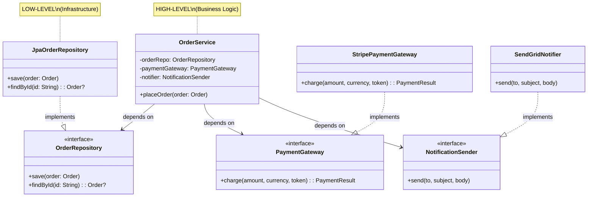
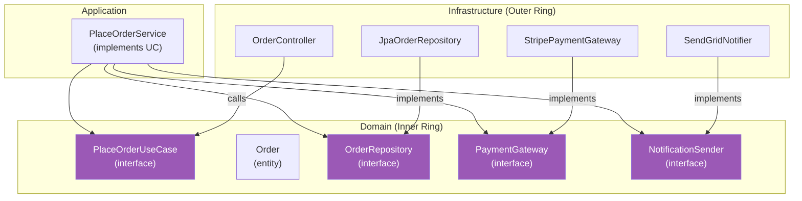
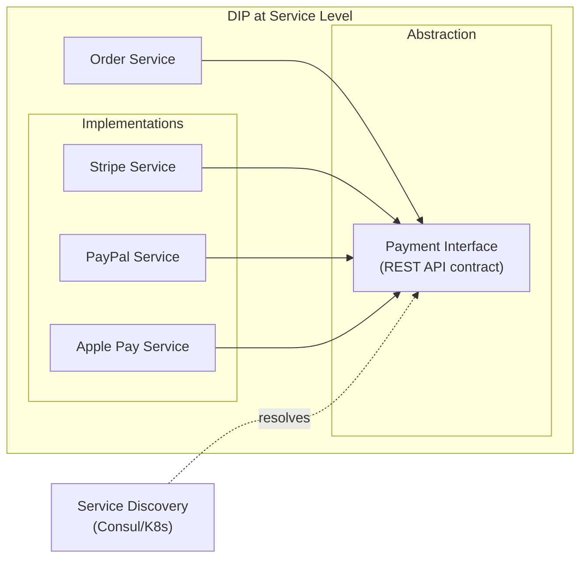

# D — Dependency Inversion Principle (DIP)

> *"A. High-level modules should not depend on low-level modules. Both should depend on abstractions."*
> *"B. Abstractions should not depend on details. Details should depend on abstractions."*
> — Robert C. Martin

---

## 1. Bản Chất Của DIP

### 1.1. Hai quy tắc

DIP gồm **HAI** phát biểu, cả hai đều quan trọng:

| Quy tắc | Ý nghĩa |
|---------|---------|
| **A** | Business logic (high-level) KHÔNG phụ thuộc database/API/framework (low-level) |
| **B** | Interface do high-level định nghĩa, low-level implement theo |

### 1.2. "Inversion" nghĩa là gì?

Trong thiết kế truyền thống:

```
Traditional (KHÔNG inversion):
    Business Logic → Database
    Controller → Service → Repository → MySQL

    High-level phụ thuộc trực tiếp low-level
    → Đổi MySQL sang Postgres? Sửa mọi nơi!
```

DIP **đảo ngược** hướng phụ thuộc:

```
DIP (CÓ inversion):
    Business Logic → <<Interface>> ← Database Implementation
    
    OrderService → OrderRepository(interface) ← JpaOrderRepository
                                               ← MongoOrderRepository
                                               ← InMemoryOrderRepository

    High-level ĐỊNH NGHĨA interface
    Low-level IMPLEMENT interface
    → Đổi database? Chỉ thay implementation!
```

### 1.3. Giải thích trực giác

**Ổ cắm điện (electrical outlet)**:
- **Laptop** (high-level) không phụ thuộc trực tiếp vào **nhà máy điện** (low-level)
- Cả hai phụ thuộc vào **tiêu chuẩn ổ cắm** (abstraction/interface)
- Bạn có thể dùng điện lưới, pin dự phòng, hoặc UPS — laptop không quan tâm

### 1.4. DIP ≠ Dependency Injection

| | DIP | DI (Dependency Injection) |
|---|---|---|
| **Loại** | Design **Principle** | Design **Technique/Pattern** |
| **Nội dung** | "Phụ thuộc vào abstraction" | "Inject dependency từ bên ngoài" |
| **Quan hệ** | DIP là **nguyên tắc** | DI là **một cách** thực hiện DIP |

```kotlin
// DIP without DI — vẫn tuân thủ DIP
class OrderService {
    // Phụ thuộc abstraction ✅ (DIP OK)
    // Nhưng tự tạo instance ❌ (không phải DI)
    private val repository: OrderRepository = JpaOrderRepository()
}

// DIP with DI — cách tốt nhất
class OrderService(
    private val repository: OrderRepository  // Inject từ bên ngoài ✅
)
```

### 1.5. Tại sao quan trọng?

| Khi vi phạm DIP | Hậu quả |
|---|---|
| Business logic phụ thuộc framework | Đổi framework = viết lại business logic |
| Service gọi trực tiếp MySQL | Đổi DB = sửa mọi service |
| Domain logic import HTTP library | Domain layer bị "nhiễm" infrastructure |
| Không mock được khi test | Test chạy chậm, cần real DB |

---

## 2. Ví Dụ Minh Họa Chi Tiết

### 2.1. Ví dụ 1: Order Processing — Bài toán kinh điển

#### ❌ Vi phạm DIP — High-level phụ thuộc low-level

```kotlin
// High-level module
class OrderService {
    // ❌ Phụ thuộc TRỰC TIẾP vào low-level implementations
    private val mysqlDatabase = MySQLConnection("jdbc:mysql://localhost:3306/orders")
    private val smtpMailer = SmtpEmailSender("smtp.gmail.com", 587, "user", "pass")
    private val stripePayment = StripePaymentGateway("sk_live_xxx")
    
    fun placeOrder(order: Order) {
        // Validate
        if (order.items.isEmpty()) throw IllegalArgumentException("Empty order")
        
        // ❌ Gọi trực tiếp MySQL
        mysqlDatabase.execute(
            "INSERT INTO orders (id, customer_id, total) VALUES (?, ?, ?)",
            order.id, order.customerId, order.total
        )
        
        // ❌ Gọi trực tiếp Stripe
        stripePayment.charge(order.total, order.currency, order.paymentToken)
        
        // ❌ Gọi trực tiếp SMTP
        smtpMailer.send(
            to = order.customerEmail,
            subject = "Order Confirmed",
            body = "Your order #${order.id} has been placed."
        )
    }
}
```

**Vấn đề**:
- Đổi MySQL → PostgreSQL? Sửa `OrderService`
- Đổi Stripe → PayPal? Sửa `OrderService`
- Đổi SMTP → SendGrid? Sửa `OrderService`
- Test `OrderService`? Cần real MySQL + real Stripe + real SMTP!

#### ✅ Tuân thủ DIP — Phụ thuộc Abstraction

```kotlin
// === ABSTRACTIONS (do high-level định nghĩa) ===

interface OrderRepository {
    fun save(order: Order)
    fun findById(id: String): Order?
}

interface PaymentGateway {
    fun charge(amount: Double, currency: String, token: String): PaymentResult
}

interface NotificationSender {
    fun send(to: String, subject: String, body: String)
}

// === HIGH-LEVEL MODULE — chỉ biết abstractions ===

class OrderService(
    private val orderRepo: OrderRepository,     // Abstraction
    private val paymentGateway: PaymentGateway, // Abstraction
    private val notifier: NotificationSender    // Abstraction
) {
    fun placeOrder(order: Order) {
        // Business logic thuần túy — KHÔNG biết MySQL, Stripe, hay SMTP
        require(order.items.isNotEmpty()) { "Empty order" }
        
        val paymentResult = paymentGateway.charge(
            order.total, order.currency, order.paymentToken
        )
        
        if (paymentResult.success) {
            orderRepo.save(order.copy(status = OrderStatus.CONFIRMED))
            notifier.send(
                to = order.customerEmail,
                subject = "Order Confirmed",
                body = "Your order #${order.id} has been placed."
            )
        } else {
            throw PaymentFailedException(paymentResult.errorMessage)
        }
    }
}

// === LOW-LEVEL MODULES — implement abstractions ===

class JpaOrderRepository(
    private val entityManager: EntityManager
) : OrderRepository {
    override fun save(order: Order) {
        entityManager.persist(order)
    }
    override fun findById(id: String): Order? {
        return entityManager.find(Order::class.java, id)
    }
}

class StripePaymentGateway(
    private val apiKey: String
) : PaymentGateway {
    override fun charge(amount: Double, currency: String, token: String): PaymentResult {
        val charge = Stripe.charges.create(mapOf(
            "amount" to (amount * 100).toLong(),
            "currency" to currency,
            "source" to token
        ))
        return PaymentResult(charge.status == "succeeded", charge.id)
    }
}

class SendGridNotifier(
    private val sendGridClient: SendGridClient
) : NotificationSender {
    override fun send(to: String, subject: String, body: String) {
        sendGridClient.send(Email(to, subject, body))
    }
}
```



**Lợi ích**:
- Đổi database → Tạo `MongoOrderRepository`, swap injection
- Đổi payment → Tạo `PayPalGateway`, swap injection
- Test → Inject mock/fake implementations

### 2.2. Ví dụ test — Lợi ích rõ rệt nhất

```kotlin
// Với DIP: test dễ dàng, nhanh, không cần infrastructure thật

class OrderServiceTest {
    // Fake implementations — chạy trong memory, cực nhanh
    private val fakeRepo = InMemoryOrderRepository()
    private val fakePayment = FakePaymentGateway(alwaysSucceed = true)
    private val fakeNotifier = FakeNotificationSender()
    
    private val service = OrderService(fakeRepo, fakePayment, fakeNotifier)
    
    @Test
    fun `should save order when payment succeeds`() {
        val order = Order(
            id = "ORD-001",
            customerId = "CUST-001",
            items = listOf(OrderItem("Laptop", 999.0)),
            total = 999.0,
            currency = "USD",
            paymentToken = "tok_123",
            customerEmail = "test@test.com"
        )
        
        service.placeOrder(order)
        
        val savedOrder = fakeRepo.findById("ORD-001")
        assertNotNull(savedOrder)
        assertEquals(OrderStatus.CONFIRMED, savedOrder.status)
        assertTrue(fakeNotifier.sentMessages.isNotEmpty())
    }
    
    @Test
    fun `should throw when payment fails`() {
        val failingPayment = FakePaymentGateway(alwaysSucceed = false)
        val service = OrderService(fakeRepo, failingPayment, fakeNotifier)
        
        assertThrows<PaymentFailedException> {
            service.placeOrder(someOrder)
        }
    }
}

// In-memory fake — siêu đơn giản
class InMemoryOrderRepository : OrderRepository {
    private val store = mutableMapOf<String, Order>()
    override fun save(order: Order) { store[order.id] = order }
    override fun findById(id: String) = store[id]
}

class FakePaymentGateway(private val alwaysSucceed: Boolean) : PaymentGateway {
    override fun charge(amount: Double, currency: String, token: String) =
        PaymentResult(success = alwaysSucceed, transactionId = "fake-tx-001")
}

class FakeNotificationSender : NotificationSender {
    val sentMessages = mutableListOf<Triple<String, String, String>>()
    override fun send(to: String, subject: String, body: String) {
        sentMessages.add(Triple(to, subject, body))
    }
}
```

### 2.3. Ví dụ: Clean/Hexagonal Architecture — DIP ở scale lớn

```
📁 order-service/
├── 📁 domain/                    ← CORE (không phụ thuộc gì)
│   ├── Order.kt
│   ├── OrderStatus.kt
│   └── 📁 port/                  ← ABSTRACTIONS (interface)
│       ├── 📁 in/                ← Driven by (use cases)
│       │   └── PlaceOrderUseCase.kt
│       └── 📁 out/               ← Drives (SPI)
│           ├── OrderRepository.kt
│           ├── PaymentGateway.kt
│           └── NotificationSender.kt
│
├── 📁 application/               ← ORCHESTRATION
│   └── PlaceOrderService.kt     ← Implements use case, uses ports
│
└── 📁 infrastructure/            ← LOW-LEVEL (implements ports)
    ├── 📁 persistence/
    │   └── JpaOrderRepository.kt
    ├── 📁 payment/
    │   └── StripePaymentGateway.kt
    ├── 📁 notification/
    │   └── SendGridNotifier.kt
    └── 📁 web/
        └── OrderController.kt
```



**Dependency Rule**: Mũi tên luôn chỉ **VÀO TRONG** (towards domain). Domain KHÔNG BAO GIỜ import infrastructure.

---

## 3. Các Cách Thực Hiện DIP

### 3.1. Constructor Injection (Phổ biến nhất)

```kotlin
// Framework tự inject — Spring Boot
@Service
class OrderService(
    private val orderRepo: OrderRepository,      // Interface
    private val paymentGateway: PaymentGateway    // Interface
) { ... }

@Repository
class JpaOrderRepository : OrderRepository { ... }

@Component
class StripePaymentGateway : PaymentGateway { ... }
```

### 3.2. Method Injection

```kotlin
class ReportGenerator {
    // Inject qua method parameter
    fun generate(
        data: ReportData,
        formatter: ReportFormatter,     // Interface
        exporter: ReportExporter        // Interface
    ): ByteArray {
        val formatted = formatter.format(data)
        return exporter.export(formatted)
    }
}
```

### 3.3. Interface Injection

```kotlin
interface DatabaseAware {
    fun setDatabase(db: Database)
}

class UserService : DatabaseAware {
    private lateinit var db: Database
    
    override fun setDatabase(db: Database) {
        this.db = db
    }
}
```

### 3.4. So sánh

| Phương pháp | Ưu điểm | Nhược điểm | Khi dùng |
|------------|---------|------------|---------|
| **Constructor** | Immutable, clear dependencies | Nhiều params nếu dependency nhiều | 90% cases |
| **Method** | Flexible per-call | Không lưu state | Utility, stateless operations |
| **Interface** | Framework-friendly | Mutable, complex | Legacy code |

---

## 4. Dấu Hiệu Vi Phạm DIP

| # | Code Smell | Ví dụ | Mức độ |
|---|-----------|-------|--------|
| 1 | `new` concrete class trong business logic | `val repo = MySQLRepo()` | 🔴 |
| 2 | Import infrastructure trong domain | `import com.mysql.jdbc.*` | 🔴 |
| 3 | Static method calls | `Database.getConnection()` | 🟡 |
| 4 | Hardcoded connection strings | `"jdbc:mysql://localhost"` | 🔴 |
| 5 | Test cần real database/API | `@Testcontainers` everywhere | 🟡 |
| 6 | Cannot swap implementations | Đổi DB → sửa 50 files | 🔴 |

---

## 5. Khi NÀO Không Cần DIP

### 5.1. Stable Dependencies

```kotlin
// String, List, Map, LocalDate — KHÔNG CẦN abstract hóa
// Chúng là stable dependencies — hầu như không bao giờ thay đổi

class UserService {
    fun formatName(first: String, last: String): String {
        return "$first $last"  // Không cần StringFormatterInterface!
    }
    
    fun getAge(birthDate: LocalDate): Int {
        return Period.between(birthDate, LocalDate.now()).years
        // Không cần DateCalculatorInterface!
    }
}
```

### 5.2. Bảng quyết định

| Dependency | Volatile? | Cần DIP? | Lý do |
|-----------|-----------|----------|-------|
| `String`, `List`, `Map` | Không | ❌ | Standard library, cực kỳ stable |
| `MySQL`, `PostgreSQL` | Có thể | ✅ | Có thể đổi database |
| `Stripe`, `PayPal` | Rất có thể | ✅ | Có thể đổi payment provider |
| `SmtpClient` | Có thể | ✅ | Có thể đổi email service |
| `LocalDate`, `BigDecimal` | Không | ❌ | JDK standard, stable |
| `Logger` (SLF4J) | Không | ❌ | Đã là abstraction rồi |
| Internal utility class | Ít khi | ❌ | Ít khi thay đổi |

### 5.3. Quy tắc ngón tay cái

```
Cần DIP khi dependency là:
  → External service (API, database, messaging)
  → Có thể thay đổi implementation
  → Cần mock trong unit test
  → Thuộc layer khác (infrastructure, presentation)

KHÔNG cần DIP khi dependency là:
  → Standard library (String, List, ...)
  → Value objects / DTOs
  → Pure utility functions
  → Đã là abstraction (SLF4J Logger)
```

---

## 6. DIP Trong Kiến Trúc Hiện Đại

### 6.1. Spring Boot — DI Container

```kotlin
// Spring Boot tự động DI — bạn chỉ cần tuân thủ DIP
@Configuration
class AppConfig {
    
    @Bean
    @Profile("production")
    fun paymentGateway(): PaymentGateway = StripePaymentGateway(stripeApiKey)
    
    @Bean
    @Profile("staging")
    fun stagingPaymentGateway(): PaymentGateway = SandboxPaymentGateway()
    
    @Bean
    @Profile("test")
    fun testPaymentGateway(): PaymentGateway = FakePaymentGateway()
}

// Service KHÔNG biết đang dùng Stripe, Sandbox, hay Fake
@Service
class OrderService(private val paymentGateway: PaymentGateway) { ... }
```

### 6.2. Microservices — Service Discovery



### 6.3. Event-Driven — Ultimate Decoupling

```kotlin
// Producer — chỉ biết event abstraction
@Service
class OrderService(private val eventPublisher: DomainEventPublisher) {
    fun placeOrder(order: Order) {
        // ... business logic
        eventPublisher.publish(OrderPlacedEvent(order.id, order.total))
        // Không biết AI sẽ xử lý event này
    }
}

// DomainEventPublisher — abstraction
interface DomainEventPublisher {
    fun publish(event: DomainEvent)
}

// Implementation — có thể là Kafka, RabbitMQ, in-memory
class KafkaEventPublisher(
    private val kafkaTemplate: KafkaTemplate<String, DomainEvent>
) : DomainEventPublisher {
    override fun publish(event: DomainEvent) {
        kafkaTemplate.send("domain-events", event)
    }
}
```

---

## 7. Mối Quan Hệ Với Các Nguyên Tắc Khác

| Nguyên tắc | Quan hệ với DIP |
|---|---|
| **SRP** | Class có SRP tốt → dependency rõ ràng → DIP dễ áp dụng |
| **OCP** | DIP cho phép swap implementation → OCP tự nhiên đạt được |
| **LSP** | Implementation phải tuân thủ contract interface → LSP |
| **ISP** | Interface nhỏ, focus → DIP hiệu quả hơn |

---

## 8. Tóm Tắt

```
┌─────────────────────────────────────────────────────┐
│                    DIP CHEAT SHEET                   │
├─────────────────────────────────────────────────────┤
│                                                     │
│  CỐT LÕI:                                          │
│    → High-level KHÔNG phụ thuộc low-level           │
│    → Cả hai phụ thuộc ABSTRACTION                   │
│    → Abstraction do HIGH-LEVEL định nghĩa           │
│                                                     │
│  DIP ≠ DI:                                          │
│    → DIP = Principle (phụ thuộc abstraction)         │
│    → DI  = Technique (inject từ bên ngoài)          │
│                                                     │
│  KỸ THUẬT:                                          │
│    → Constructor Injection (90% cases)              │
│    → Method Injection (stateless ops)               │
│    → DI Container (Spring, Dagger, Koin)            │
│                                                     │
│  CẦN DIP: External services, DB, API, messaging    │
│  KHÔNG CẦN: String, List, LocalDate, utilities      │
│                                                     │
│  ARCHITECTURE:                                      │
│    → Clean/Hexagonal: domain → ports ← adapters     │
│    → Dependency Rule: arrows point INWARD            │
│                                                     │
└─────────────────────────────────────────────────────┘
```
