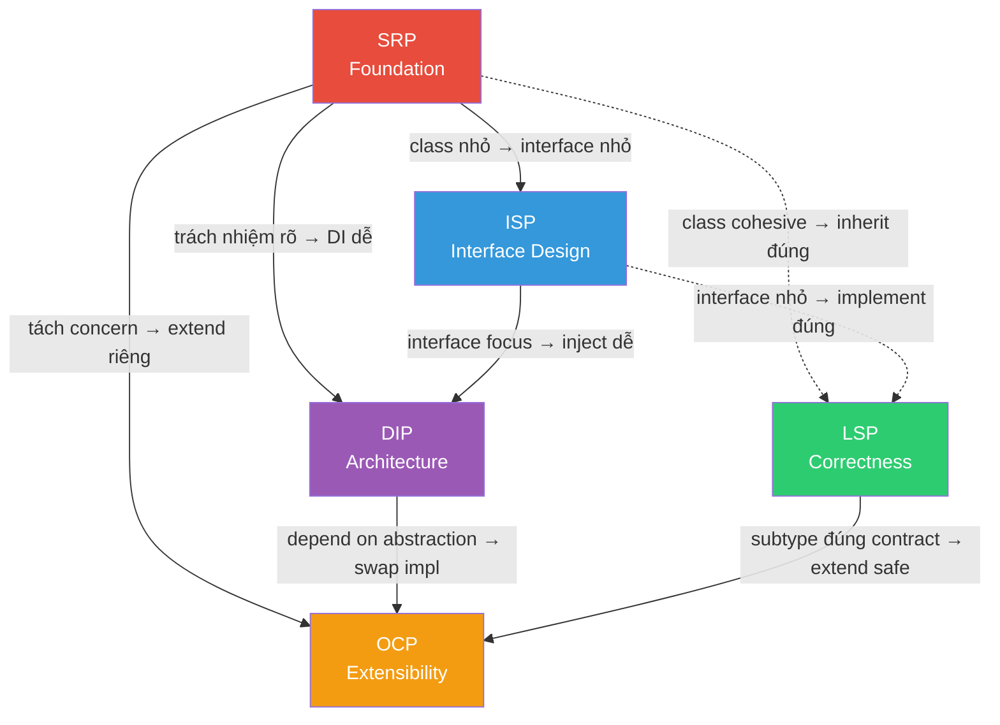
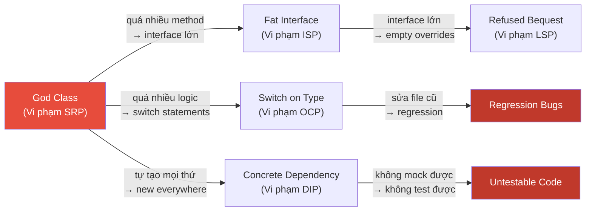

# 🔬 Tổng Hợp & Thực Chiến — SOLID Principles

> Tài liệu này tổng hợp mối quan hệ, so sánh, anti-patterns, và hướng dẫn áp dụng SOLID trong thực tế.

---

## 1. Ma Trận So Sánh Tổng Quan

### 1.1. So sánh theo đặc điểm

| Tiêu chí | SRP | OCP | LSP | ISP | DIP |
|----------|:---:|:---:|:---:|:---:|:---:|
| **Đối tượng** | Class | Class/Module | Inheritance | Interface | Module dependency |
| **Góc nhìn** | Bên trong class | Khi mở rộng | Khi kế thừa | Từ client | Giữa các layer |
| **Khó hiểu** | ⭐ | ⭐⭐ | ⭐⭐⭐ | ⭐ | ⭐⭐ |
| **Hay bị vi phạm** | 🔴🔴🔴 | 🔴🔴 | 🔴 | 🔴🔴 | 🔴🔴🔴 |
| **Khó áp dụng** | Trung bình | Trung bình | Cao | Thấp | Trung bình |
| **Impact khi vi phạm** | Cao | Rất cao | Rất cao | Trung bình | Cao |

### 1.2. Mỗi nguyên tắc trả lời câu hỏi gì?

| Nguyên tắc | Câu hỏi then chốt | Câu trả lời |
|---|---|---|
| **SRP** | "Class này phục vụ ai?" | Chỉ phục vụ 1 actor |
| **OCP** | "Thêm feature thì sửa ở đâu?" | Thêm code mới, không sửa code cũ |
| **LSP** | "Subclass thay parent được không?" | Mọi nơi dùng parent → dùng subclass cũng OK |
| **ISP** | "Client có dùng hết interface không?" | Chỉ expose method client cần |
| **DIP** | "Module này phụ thuộc gì?" | Phụ thuộc abstraction, không phải implementation |

---

## 2. Mối Quan Hệ Chi Tiết Giữa Các Nguyên Tắc

### 2.1. Dependency Graph



### 2.2. Các cặp quan hệ quan trọng

#### SRP ↔ ISP: Hai mặt của cùng xu tiên

```kotlin
// SRP: Tách CLASS theo actor
// ISP: Tách INTERFACE theo client

// Chúng bổ sung nhau:
// - SRP nhìn từ BÊN TRONG: "class có quá nhiều trách nhiệm?"
// - ISP nhìn từ BÊN NGOÀI: "client bị ép phụ thuộc method không dùng?"

interface UserService {              // ← ISP: interface quá lớn?
    fun register(req: RegisterReq)   // → Client: RegistrationController
    fun login(credentials: Creds)    // → Client: AuthController
    fun exportData(userId: String)   // → Client: GdprController
}

// SRP nói: class implement interface này có quá nhiều actor
// ISP nói: RegistrationController bị ép phụ thuộc login() và exportData()
// → Cả hai đều nói: TÁCH!
```

#### OCP ↔ DIP: Cơ chế cho nhau

```kotlin
// DIP cho phép OCP hoạt động:
// - DIP: phụ thuộc abstraction
// - OCP: thêm implementation mới = mở rộng

interface ReportExporter { fun export(data: ReportData): ByteArray }

// DIP: ReportService phụ thuộc ReportExporter (abstraction)
class ReportService(private val exporter: ReportExporter) { ... }

// OCP: Thêm format mới = thêm class mới
class PdfExporter : ReportExporter { ... }   // Extension 1
class CsvExporter : ReportExporter { ... }   // Extension 2
class ExcelExporter : ReportExporter { ... } // Extension 3 — KHÔNG sửa ReportService
```

#### LSP ↔ OCP: Bảo đảm cho nhau

```kotlin
// OCP: Mở rộng bằng subclass/implementation mới
// LSP: Đảm bảo subclass hoạt động đúng → mở rộng AN TOÀN

interface Discount {
    /** Trả về giá sau giảm. Postcondition: result <= originalPrice */
    fun apply(originalPrice: Double): Double
}

class PercentageDiscount(private val percent: Double) : Discount {
    override fun apply(originalPrice: Double): Double {
        return originalPrice * (1 - percent / 100)  // ✅ LSP: result <= original
    }
}

// ❌ Vi phạm LSP → phá OCP safety
class BrokenDiscount : Discount {
    override fun apply(originalPrice: Double): Double {
        return originalPrice * 2  // ❌ Tăng giá! Vi phạm postcondition
    }
}
```

---

## 3. Anti-Patterns Tổng Hợp

### 3.1. Bảng anti-patterns phổ biến

| Anti-Pattern | Vi phạm | Mô tả | Fix |
|---|:---:|---|---|
| **God Class** | SRP | Class 2000+ dòng, 50+ methods | Tách theo actor |
| **Switch on Type** | OCP | `when(type) { is A, is B, ... }` | Strategy + polymorphism |
| **Fat Interface** | ISP | Interface 20+ methods | Tách theo client |
| **Refused Bequest** | LSP | Override throw `UnsupportedOp` | Tách hierarchy |
| **Concrete Dependency** | DIP | `new MySQLRepo()` trong service | Interface + DI |
| **Utils Dumping Ground** | SRP | `StringUtils` chứa mọi thứ | Phân về domain classes |
| **Leaky Abstraction** | DIP | Domain import framework classes | Port/Adapter pattern |
| **Interface Explosion** | ISP | Mỗi method một interface | Gộp cohesive groups |
| **Premature Abstraction** | OCP | Abstract hóa trước khi cần | Rule of Three |
| **Deep Hierarchy** | LSP | 5+ levels inheritance | Flatten + composition |

### 3.2. Chuỗi vi phạm (Violation Chain)



> **Bài học**: Vi phạm SRP thường là **gốc rễ** kéo theo vi phạm tất cả nguyên tắc còn lại.

---

## 4. Checklist Đánh Giá SOLID

### 4.1. Code Review Checklist

```markdown
## SOLID Review Checklist

### SRP — Single Responsibility
- [ ] Class có thể mô tả trong 1 câu không dùng "và"?
- [ ] Chỉ 1 actor/stakeholder yêu cầu thay đổi class này?
- [ ] Constructor inject <= 5 dependencies?
- [ ] Class <= 200 dòng (soft limit)?

### OCP — Open/Closed
- [ ] Thêm feature mới có cần sửa code cũ không?
- [ ] Không có switch/if chain trên type?
- [ ] Behavior mới = class mới implement interface?
- [ ] Không abstract hóa quá sớm (Rule of Three)?

### LSP — Liskov Substitution
- [ ] Mọi subclass thay thế parent mà không phá client?
- [ ] Không có instanceof/is checks trong client code?
- [ ] Không có empty/no-op method overrides?
- [ ] Không throw exception mà parent không throw?

### ISP — Interface Segregation
- [ ] Interface <= 5 methods (soft limit)?
- [ ] Mọi implementor dùng hết methods?
- [ ] Không có empty stub implementations?
- [ ] Client chỉ phụ thuộc methods mình dùng?

### DIP — Dependency Inversion
- [ ] Business logic không import infrastructure?
- [ ] Không có `new ConcreteClass()` trong service?
- [ ] External dependencies đều qua interface?
- [ ] Có thể test mà không cần real DB/API?
```

### 4.2. Mức độ trưởng thành SOLID

| Level | Mô tả | Đặc điểm |
|:---:|---|---|
| **0** | Không biết | Code "works" nhưng God classes everywhere |
| **1** | Nhận biết | Biết tên nguyên tắc, áp dụng bất nhất |
| **2** | Áp dụng | Tuân thủ hầu hết, đôi khi over-engineer |
| **3** | Thành thạo | Biết KHI NÀO áp dụng, khi nào KHÔNG |
| **4** | Mastery | SOLID là bản năng, codebase tự nhiên clean |

---

## 5. Hướng Dẫn Áp Dụng Thực Tế

### 5.1. Áp dụng theo loại dự án

| Loại dự án | SRP | OCP | LSP | ISP | DIP |
|-----------|:---:|:---:|:---:|:---:|:---:|
| **Prototype/MVP** | 🟡 | ❌ | 🟡 | ❌ | ❌ |
| **Startup (< 10 devs)** | ✅ | 🟡 | ✅ | 🟡 | 🟡 |
| **Enterprise (> 50 devs)** | ✅ | ✅ | ✅ | ✅ | ✅ |
| **Open Source Library** | ✅ | ✅ | ✅ | ✅ | ✅ |
| **Script / Automation** | ❌ | ❌ | ❌ | ❌ | ❌ |
| **Microservice (nhỏ)** | ✅ | 🟡 | ✅ | 🟡 | ✅ |
| **Monolith lớn** | ✅ | ✅ | ✅ | ✅ | ✅ |

> ✅ = Nên áp dụng nghiêm ngặt | 🟡 = Áp dụng khi cần | ❌ = Không cần thiết

### 5.2. Thứ tự ưu tiên áp dụng

```
Nếu chỉ có thể tuân thủ 1 nguyên tắc → chọn SRP
Nếu 2 → thêm DIP  
Nếu 3 → thêm OCP
Nếu 4 → thêm ISP
Nếu 5 → thêm LSP

Lý do:
  SRP → nền tảng, giảm complexity
  DIP → testability, loose coupling
  OCP → extensibility, giảm regression
  ISP → clean interfaces, reduce coupling
  LSP → correctness, safe inheritance (ít gặp nhất)
```

### 5.3. Refactoring roadmap

```mermaid
graph LR
    A["🔴 God Class<br/>(2000 dòng)"] -->|"Step 1: SRP<br/>Tách theo actor"| B["🟡 3-5 Classes<br/>(200-400 dòng mỗi class)"]
    B -->|"Step 2: DIP<br/>Extract interfaces"| C["🟢 Interface + Impl<br/>(dependency injection)"]
    C -->|"Step 3: OCP<br/>Thêm extension points"| D["🟢 Pluggable<br/>(strategy/decorator)"]
    D -->|"Step 4: ISP<br/>Slim interfaces"| E["🟢 Focused Interfaces<br/>(client-specific)"]
    E -->|"Step 5: LSP<br/>Verify hierarchy"| F["✅ SOLID<br/>Compliant"]
```



---

## 6. SOLID Trong Các Kiến Trúc Hiện Đại

### 6.1. SOLID → Hexagonal/Clean Architecture

| SOLID | Hexagonal Architecture |
|---|---|
| SRP | Mỗi Use Case class = 1 business action |
| OCP | Thêm adapter mới mà không sửa domain |
| LSP | Adapter phải tuân thủ Port contract |
| ISP | Port (interface) nhỏ, specific cho từng use case |
| DIP | Domain → Port (abstraction) ← Adapter (implementation) |

### 6.2. SOLID → Microservices

| SOLID | Microservices |
|---|---|
| SRP | 1 service = 1 bounded context / 1 business capability |
| OCP | Thêm service mới = thêm capability, không sửa service cũ |
| LSP | Service v2 phải backward-compatible với v1 |
| ISP | API contract phù hợp cho từng client (BFF pattern) |
| DIP | Service giao tiếp qua API contract, không share database |

### 6.3. SOLID → Event-Driven Architecture

| SOLID | Event-Driven |
|---|---|
| SRP | Producer chỉ publish, Consumer chỉ react |
| OCP | Thêm consumer mới = mở rộng, producer không sửa |
| LSP | Event schema versioning, backward compatibility |
| ISP | Event chứa đúng data consumer cần |
| DIP | Producer/Consumer chỉ biết event schema (abstraction) |

---

## 7. SOLID vs Các Framework Nguyên Tắc Khác

### 7.1. So sánh nhanh

| Framework | Phạm vi | Focus | Bổ sung SOLID? |
|-----------|---------|-------|:---------:|
| **SOLID** | OOP Class-level | Design principles | — |
| **GRASP** | OOP Responsibility | Assigning responsibilities | ✅ |
| **DRY** | Code duplication | Don't Repeat Yourself | ✅ |
| **KISS** | Complexity | Keep It Simple | ⚠️ Đôi khi xung đột |
| **YAGNI** | Over-engineering | You Ain't Gonna Need It | ⚠️ Đôi khi xung đột |
| **IDEALS** | Microservices | Distributed design | ✅ Mở rộng SOLID |

### 7.2. SOLID vs KISS/YAGNI — Khi nào xung đột?

```
SOLID nói: "Tách class, tạo interface, dùng DI"
KISS nói:  "Đơn giản nhất có thể"
YAGNI nói: "Chưa cần thì đừng làm"

→ XU HƯỚNG XUNG ĐỘT ở dự án nhỏ / prototype

GIẢI PHÁP: Áp dụng SOLID TĂNG DẦN
  1. Bắt đầu đơn giản (KISS + YAGNI)
  2. Khi code bắt đầu "đau" (code smell) → áp dụng SOLID
  3. Refactor từng bước, không rewrite
```

### 7.3. IDEALS — SOLID cho Microservices

| Chữ | Nguyên tắc | Tương đương SOLID |
|:---:|---|---|
| **I** | Interface Segregation | ISP (mở rộng lên API level) |
| **D** | Deployability | — (mới) |
| **E** | Event-driven | OCP (extension qua events) |
| **A** | Availability over Consistency | — (mới) |
| **L** | Loose coupling | DIP (mở rộng lên service level) |
| **S** | Single responsibility | SRP (mở rộng lên service level) |

---

## 8. Case Study: Refactoring Một God Class

### 8.1. Trước refactoring

```kotlin
// ❌ God Class — 800+ dòng, 12 dependencies, 5 actors
class OrderManager(
    private val db: DatabaseConnection,
    private val stripe: StripeApi,
    private val smtp: SmtpClient,
    private val redis: RedisClient,
    private val s3: S3Client,
    private val kafka: KafkaProducer,
    private val metrics: MetricsCollector,
    private val logger: Logger,
    private val validator: OrderValidator,
    private val taxCalculator: TaxService,
    private val inventoryChecker: InventoryService,
    private val fraudDetector: FraudService
) {
    fun createOrder(request: OrderRequest): Order { /* 100 lines */ }
    fun cancelOrder(orderId: String) { /* 80 lines */ }
    fun refundOrder(orderId: String, reason: String) { /* 120 lines */ }
    fun getOrderHistory(customerId: String): List<Order> { /* 50 lines */ }
    fun generateInvoice(orderId: String): ByteArray { /* 90 lines */ }
    fun exportOrders(from: Date, to: Date): ByteArray { /* 70 lines */ }
    fun calculateRevenue(period: Period): Revenue { /* 60 lines */ }
    fun sendOrderNotification(orderId: String) { /* 40 lines */ }
    // ... 15 more methods
}
```

### 8.2. Sau refactoring — SOLID compliant

```kotlin
// Step 1 (SRP): Tách theo actor
// Step 2 (DIP): Extract interfaces  
// Step 3 (OCP): Extension points
// Step 4 (ISP): Focused interfaces

// === Interfaces (DIP + ISP) ===
interface OrderRepository {
    fun save(order: Order): Order
    fun findById(id: String): Order?
    fun findByCustomerId(customerId: String): List<Order>
}

interface PaymentProcessor {
    fun charge(order: Order): PaymentResult
    fun refund(transactionId: String, amount: Double): RefundResult
}

interface OrderNotifier {
    fun notifyOrderCreated(order: Order)
    fun notifyOrderCancelled(order: Order)
}

// === Services (SRP) ===

// Actor: Customer / Sales Team
class OrderCreationService(
    private val orderRepo: OrderRepository,
    private val paymentProcessor: PaymentProcessor,
    private val inventoryService: InventoryPort,
    private val notifier: OrderNotifier,
    private val eventPublisher: DomainEventPublisher
) {
    fun createOrder(request: OrderRequest): Order {
        // Validate → Check inventory → Process payment → Save → Notify
        val order = request.toOrder()
        inventoryService.reserve(order.items)
        val payment = paymentProcessor.charge(order)
        val savedOrder = orderRepo.save(order.copy(
            status = OrderStatus.CONFIRMED,
            transactionId = payment.transactionId
        ))
        notifier.notifyOrderCreated(savedOrder)
        eventPublisher.publish(OrderCreatedEvent(savedOrder))
        return savedOrder
    }
}

// Actor: Customer Support Team
class OrderCancellationService(
    private val orderRepo: OrderRepository,
    private val paymentProcessor: PaymentProcessor,
    private val notifier: OrderNotifier
) {
    fun cancelOrder(orderId: String): Order { ... }
    fun refundOrder(orderId: String, reason: String): RefundResult { ... }
}

// Actor: Finance Team
class OrderReportingService(
    private val orderRepo: OrderRepository,
    private val reportExporter: ReportExporter  // OCP: pluggable format
) {
    fun getOrderHistory(customerId: String): List<Order> { ... }
    fun calculateRevenue(period: Period): Revenue { ... }
    fun exportOrders(from: Date, to: Date, format: String): ByteArray { ... }
}

// Actor: Operations Team
class InvoiceService(
    private val orderRepo: OrderRepository,
    private val invoiceGenerator: InvoiceGenerator  // OCP: pluggable template
) {
    fun generateInvoice(orderId: String): ByteArray { ... }
}
```

### 8.3. Kết quả

| Metric | Trước | Sau |
|--------|:-----:|:---:|
| Lines of code (main class) | 800+ | 4 classes × ~100 = 400 |
| Dependencies per class | 12 | 3-5 |
| Test setup complexity | Mock 12 deps | Mock 3-5 deps |
| Merge conflicts | Thường xuyên | Hiếm |
| Time to add new feature | 2-3 ngày | 0.5-1 ngày |
| Regression bugs | Thường xuyên | Hiếm |

---

## 9. Kết Luận

```
┌─────────────────────────────────────────────────────────┐
│               SOLID — KEY TAKEAWAYS                     │
├─────────────────────────────────────────────────────────┤
│                                                         │
│  1. SOLID là HEURISTIC, không phải LAW                  │
│     → Áp dụng khi có giá trị, bỏ qua khi over-engineer │
│                                                         │
│  2. SRP là NỀN TẢNG                                     │
│     → Fix SRP trước, 4 nguyên tắc còn lại sẽ dễ hơn    │
│                                                         │
│  3. Mục tiêu cuối cùng: MAINTAINABILITY                 │
│     → Code dễ đọc, dễ test, dễ mở rộng, ít regression   │
│                                                         │
│  4. Áp dụng TĂNG DẦN                                    │
│     → Bắt đầu đơn giản → refactor khi có code smell     │
│     → Rule of Three cho OCP                              │
│                                                         │
│  5. Context-dependent                                    │
│     → Prototype: KISS > SOLID                            │
│     → Enterprise: SOLID = must-have                      │
│     → Library/API: SOLID + LSP critical                  │
│                                                         │
│  6. SOLID + Design Patterns = Powerful                   │
│     → Strategy = OCP + DIP                               │
│     → Decorator = OCP + SRP                              │
│     → Factory = DIP + OCP                                │
│     → Observer = OCP + SRP                               │
│                                                         │
└─────────────────────────────────────────────────────────┘
```
