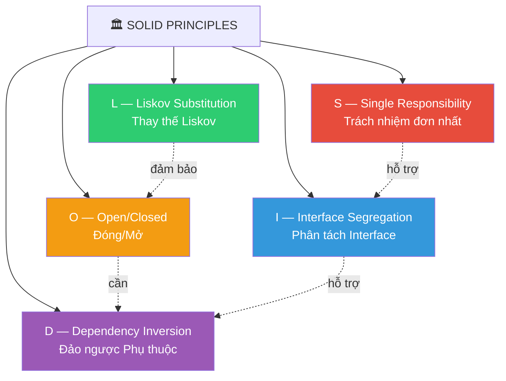
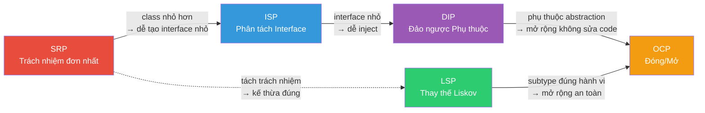

# 🏛️ SOLID Principles — Nghiên Cứu Chuyên Sâu

> **Tài liệu nghiên cứu toàn diện** về 5 nguyên tắc thiết kế phần mềm hướng đối tượng do **Robert C. Martin** ("Uncle Bob") đề xuất và phát triển qua các bài viết từ đầu những năm 2000. Thuật ngữ viết tắt **SOLID** được đặt bởi **Michael Feathers**.

---

## 📋 Mục Lục

| # | Tài liệu | Nội dung |
|---|----------|----------|
| 1 | [Single Responsibility](./01-single-responsibility.md) | Nguyên tắc trách nhiệm đơn nhất — Mỗi class chỉ có một lý do để thay đổi |
| 2 | [Open/Closed](./02-open-closed.md) | Nguyên tắc đóng/mở — Mở cho mở rộng, đóng cho sửa đổi |
| 3 | [Liskov Substitution](./03-liskov-substitution.md) | Nguyên tắc thay thế Liskov — Subtype phải thay thế được base type |
| 4 | [Interface Segregation](./04-interface-segregation.md) | Nguyên tắc phân tách interface — Client không bị ép phụ thuộc method không dùng |
| 5 | [Dependency Inversion](./05-dependency-inversion.md) | Nguyên tắc đảo ngược phụ thuộc — Phụ thuộc vào abstraction, không phải implementation |
| 6 | [Tổng Hợp & Thực Chiến](./06-synthesis-and-practice.md) | So sánh, kết hợp, anti-patterns, và hướng dẫn áp dụng thực tế |

---

## 🗺️ Bản Đồ Tổng Quan



## 🎯 Tổng Quan Nhanh Từng Nguyên Tắc

| Nguyên tắc | Tên đầy đủ | Ý nghĩa cốt lõi | Tác giả gốc |
|:---:|---|---|---|
| **S** | Single Responsibility | *"Một class chỉ nên có MỘT lý do để thay đổi"* | Robert C. Martin |
| **O** | Open/Closed | *"Mở cho mở rộng, đóng cho sửa đổi"* | Bertrand Meyer (1988) |
| **L** | Liskov Substitution | *"Subtype phải thay thế được base type mà không phá vỡ chương trình"* | Barbara Liskov (1987) |
| **I** | Interface Segregation | *"Không ép client phụ thuộc vào method nó không dùng"* | Robert C. Martin |
| **D** | Dependency Inversion | *"Module cấp cao không phụ thuộc module cấp thấp; cả hai phụ thuộc abstraction"* | Robert C. Martin |

---

## 🔗 Mối Quan Hệ Giữa Các Nguyên Tắc



> **Đọc mối quan hệ**: SRP tạo nền tảng → ISP cụ thể hóa ranh giới → DIP cho phép loose coupling → OCP hiện thực hóa khả năng mở rộng. LSP đảm bảo mọi mở rộng (OCP) an toàn về mặt hành vi.

---

## 📐 Quy Ước Trong Tài Liệu

- **Code mẫu**: Kotlin/Java (phổ biến trong hệ sinh thái backend enterprise)
- **Lược đồ**: Mermaid class diagram
- **Mức độ khó hiểu**: ⭐ Trực giác → ⭐⭐⭐ Cần suy nghĩ sâu
- **Tần suất vi phạm**: 🔴 Rất hay bị vi phạm → 🟢 Hiếm khi vi phạm

---

## 📊 Ma Trận Quick Reference

| Nguyên tắc | Code Smell khi vi phạm | Khó hiểu | Hay bị vi phạm | Liên quan Design Pattern |
|:---:|---|:---:|:---:|---|
| **S** | God Class, Side Effects | ⭐ | 🔴 | Facade, Mediator |
| **O** | Switch/If chains | ⭐⭐ | 🔴 | Strategy, Template Method, Decorator |
| **L** | `instanceof` checks | ⭐⭐⭐ | 🟡 | Template Method, Strategy |
| **I** | Empty method stubs | ⭐ | 🟡 | Adapter, Facade |
| **D** | `new` trong business logic | ⭐⭐ | 🔴 | Factory, Abstract Factory, DI Container |

---

## 🌍 Bối Cảnh Lịch Sử

```
1987  Barbara Liskov — Bài giảng "Data Abstraction and Hierarchy"
      └─ Đặt nền tảng cho Liskov Substitution Principle

1988  Bertrand Meyer — Cuốn "Object-Oriented Software Construction"
      └─ Định nghĩa Open/Closed Principle

1994  GoF — "Design Patterns" book
      └─ 23 patterns hiện thực hóa nhiều nguyên tắc SOLID

1996  Robert C. Martin — Loạt bài "The Principles of OOD"
      └─ Hệ thống hóa SRP, OCP, LSP, ISP, DIP

2000  Robert C. Martin — "Design Principles and Design Patterns"
      └─ Trình bày đầy đủ 5 nguyên tắc

2004  Michael Feathers — Đặt tên viết tắt "SOLID"
      └─ Thuật ngữ trở nên phổ biến rộng rãi

2008  Robert C. Martin — "Clean Code"
      └─ SOLID trở thành kiến thức nền tảng bắt buộc

2017  Robert C. Martin — "Clean Architecture"
      └─ Mở rộng SOLID lên architecture level
```

> **Ghi chú**: SOLID không phải "phát minh" của một người duy nhất. Nó là sự **tổng hợp** từ nhiều nhà khoa học và kỹ sư qua hơn 30 năm phát triển phần mềm hướng đối tượng.
